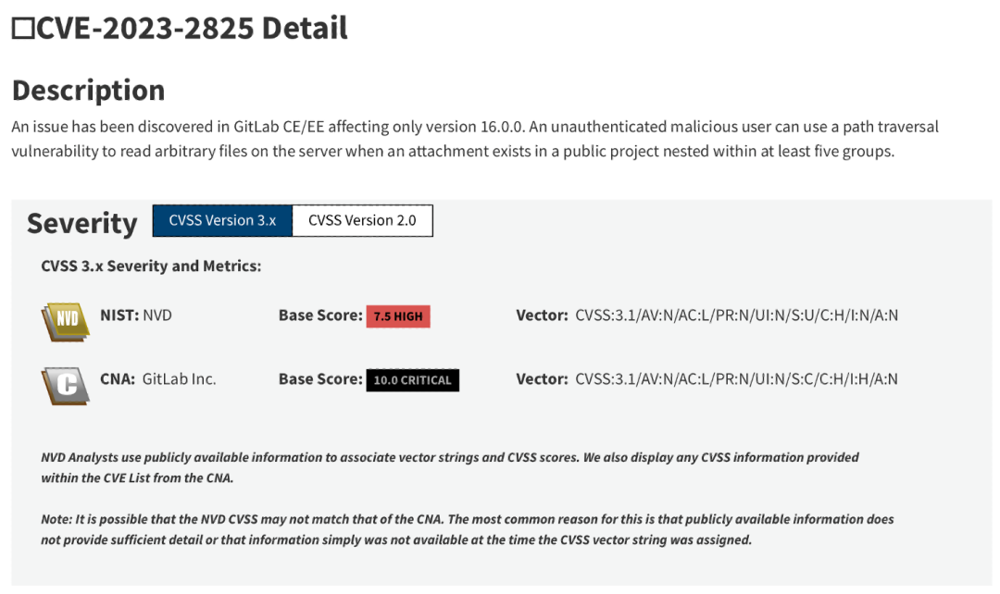
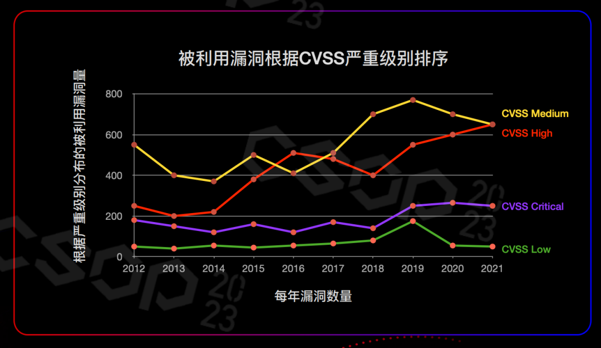
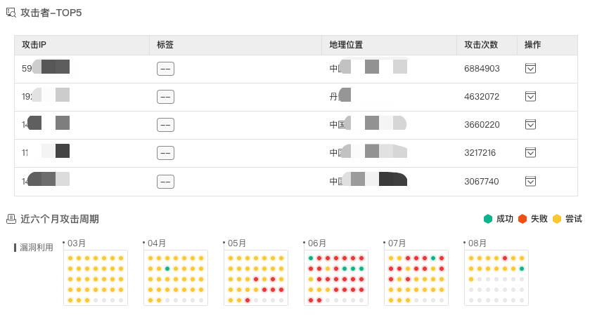

# 不是我懒，王者级漏洞真不用修！

<!-- vulwiki-editorial-rebuild:system-misc -->
## 条目范围与校订

- 本文对象：漏洞修复优先级/TIP营销，GitLab2825和Log4j44228为案例
- 文献类型：技术文章（细分类待核）
- 版本、权限及部署边界：依据复杂条件推导GitLab几乎不会利用/无需修复过强，需检查攻击者能否自行创建嵌套组/公开附件及本组织资产
- 核验状态：仅重建文本校订；未执行文中代码、PoC 或扫描，未把截图或转载声明记为本站复现

### 具体结论与待核项

以下为原归档的逐项勘误与证据缺口；可由文本确定的问题已在下文订正，仍缺来源的事实保持待核。

1. 不是具体漏洞复现，两个CVE均用于说明风险排序
2. 依据复杂条件推导GitLab几乎不会利用/无需修复过强，需检查攻击者能否自行创建嵌套组/公开附件及本组织资产
3. 低优先级不等于永久不修
4. CVSS不是利用概率观点合理，但Gartner统计仅截图无数据来源，攻击成功统计判定标准未给
5. 截至2023文章不可直接作现行处置建议
6. 主文后半全TIP功能广告，阅读原文链接缺失

### 操作风险

原文技术操作的实际副作用未复现核验；按其请求/代码评估状态变更、凭据暴露和业务影响

技术请求、代码与实验方法按原文保留；其中的破坏性动作仅限授权、可恢复的隔离环境。缺失代码、参数或版本事实不猜补。

### 来源追溯

- 原始披露 URL 未确认；既有归档来源标签保留，不能替代原始公告

### 归档技术正文

原创 微步小微  微步在线   2023-08-29 08:35  
  
#   
  
  
漏洞排查与处置，是安全管理员在安全运营中都会碰到的问题，常见却很难做好。  
  
漏洞排查算不上复杂，很多工具都能发现漏洞，但处置起来却是个大麻烦。这不，看着x省分公司安全管理员小A报上来的漏洞修复方案，内容多到我都为他摸了一把汗：“照你这方案，要到猴年马月才能修完？”  
  
想到还有万千小A还在吭哧吭哧踩坑，我决定跟大家共享一份光明正大  
“摸鱼”  
《  
修复超级漏洞攻略》。  
  
  
**安全人不骗安全人：有些高分漏洞真的不用修**  
  
以今年5月GitLab爆出的任意文件读取漏洞（CVE-2023-2825）为例。  
  
GitLab按CVSS（ Common Vulnerability Scoring System，通用漏洞评分系统）评分标准将这个漏洞评为10分（最高10分，即满分）。一般来说，漏洞的评分越高，其危害性就越大，比如2021年爆出的Apache log4j漏洞（CVE-2021-44228），这个满分漏洞被业界称之为“核弹级”漏洞，危害巨大，影响广泛。  
  
那么，GitLab评出来的这个满分漏洞，也如Log4j那般，是一个“核弹级”漏洞吗？  
  
  
  
  
然而并非如此，这个满分漏洞甚至都无需修  
复。  
因为  
**CVSS评分高低与漏洞是否会被利用没有必然关系**  
。  
  
就GitLab这个漏洞而言，虽然CVSS评分满分，但利用条件非常苛刻，首先需要一个公开的至少5级目录的项目组；其次，这个项目组下要存在公开项目，还必须有附件；而且限定在16.0.0这个版本。利用条件太苛刻了，几乎没有被黑客利用的机会，所以修复的优先级没必要那么高。  
  
相当于这个武器有五万斤，攻击者得连夜徒手搬到你家门口来，你是不是就没那么害怕了？  
  
也就是说，CVSS评分只是一个参考标准，据Gartner公开的一组数据显示，相比于CVSS高分（高危）漏洞，被黑客利用的中危漏洞占比更多。  
  
  
  
在实际工作中，修复漏洞要考虑更多的因素。比如漏洞的易用性、影响范围、利用成功后的权限大小等，然后再综合权衡，就像你不会单单依据全球最美500人排行榜找对象一样。  
  
那我们应该怎么找对象？哦不，应该怎么修漏洞以及确定修复漏洞的优先级？  
  
  
**修漏洞的正确姿势**  
  
首先，优先级最高的肯定是在野利用的漏洞，比如Apache Log4j漏洞，虽然在2021年就公开了，但仍有很多企业没有修复，所以有很多攻击者使用。这是最近6个月内，攻击者利用Apache Log4j漏洞发起的攻击次数统计，攻击成功则表明仍有企业未修复此漏洞。   
  
  
  
在统计数据中，也可以看到攻击者用于攻击的代码，以及攻击的周期分布，几乎每天都有攻击者利用此漏洞发起攻击，攻击成功的次数也不少。  
  
除了在野利用以外，还是要再强调一遍，  
**根据漏洞的易用性、影响范围、利用成功后的权限大小等因素综合评估**  
。  
  
“这不一说就会，一练就废么？”小A明显有些不满，“小微，有简单易操作的办法么？”  
  
你要这样问，我就得打个广告了：微步威胁情报管理平台TIP上线新能力，依靠强大的漏洞情报，让漏洞处置清晰好用。  
  
事实上，TIP的优势，也是小微认为在漏洞处理过程中，必须具备的能力。  
  
**首先，漏洞情报不但要新，还要有重点。**  
TIP实时提供最新漏洞信息，并标注重点漏洞情报  
。  
所有情报都提供漏洞描述、影响、评价、解决方案、补丁列表、参考链接、公开的POC详情与CPE等信息。同时还支持添加关注供应商，降低供应链攻击风险；并可通过API接口直接推送情报到其他安全设备；  
  
**其次，要有漏洞攻击画像，知己知彼，方能百战不殆。**  
TIP提供高价值漏洞画像信息  
，包括利用该漏洞的攻击发生时间、攻击影响的资产、是否有攻防演练相关IP、是否有团伙相关IP、攻击行为（针对不同方式、不同结果）、攻击者Top5、最近6个月攻击态势等，  
为漏洞处置提供依据  
；  
  
**第三，要有0day预警，严防降维打击。**  
TIP提供最新0day漏洞预警，与临时修复方案。  
微步通过X漏洞奖励计划、专业漏洞挖掘团队，以及攻防实战等方式收集0day漏洞，并在  
第一时间将0day漏洞详情及加固方案更新到TIP中，帮助用户防患未然  
；  
  
**第四，全面掌握漏洞细节，处置方法清晰可落地。**  
TIP对已公布漏洞、0day漏洞提供完整分析报告，报告内容包括代码分析、漏洞利用分析、攻击排查分析、漏洞自查方法、临时处置建议等，  
最小化用户漏洞排查与处置难度  
。  
  
没有人可以单枪匹马面对身处暗夜的无数攻击者，没有人可以对所有漏洞信息了然于心。但是，如果可以选择，你可以选择一个靠谱、专业的团队（TIP）在你身后。  
  
选择，也是一种力量。  
  
点击文末“  
阅读原文  
”，可免费体验微步TIP。  
  
  
· END ·  
  
  
  
  
  
戳“  
阅读原文  
”，体验微步TIP  
  
↙  
↙  
↙  
  

---

> 来源：gelusus/wxvl（微信公众号漏洞文章自动归档，原始披露 URL 尚未确认，现有链接按来源追溯区分别标注）
