# 从CVE-2025-30208到CVE-2025-31125再到CVE-2025-31486

> 编号角色校订（2026-10-04）：按技术主体及多编号分节核对主讨论对象、链成员与引用，当前编号字段据此更新；旧编号原值及 `identifier_status` 均保留，变更前字段保存在 `previous_*`。后文原有角色待核项按当前字段阅读，版本、配置及证据缺口未因此自动解决；原作者的复现声明不升级为维护者复现。

<!-- vulwiki-editorial-rebuild:system-misc -->
## 条目范围与校订

- 本文对象：Vite CVE-2025-30208/31125/31486补丁演进
- 文献类型：技术文章（细分类待核）
- 版本、权限及部署边界：示例/iife是项目base、Windows绝对路径已注明本地但缺完整配置/各阶段版本与修复矩阵；网络暴露开发服务器/进程读权限未明确，非生产构建必受影响
- 核验状态：仅重建文本校订；未执行文中代码、PoC 或扫描，未把截图或转载声明记为本站复现

### 具体结论与待核项

以下为原归档的逐项勘误与证据缺口；可由文本确定的问题已在下文订正，仍缺来源的事实保持待核。

1. 三主CVE元数据只首30208，45811为前序背景
2. 分raw尾分隔符/inline-wasm/svg与路径规范化两支详细且31486小于4KB限定有价值，同洞简PoC不能取代此分析
3. 前段把removeTimestampQuery描述移除首?至末与后面cleanUrl实际功能混淆
4. 代码片段全压行注释吞后续、两个export之间缺分隔，须恢复
5. 示例/iife是项目base、Windows绝对路径已注明本地但缺完整配置/各阶段版本与修复矩阵
6. 网络暴露开发服务器/进程读权限未明确，非生产构建必受影响
7. 只有Vite功能文档无各GHSA/commit和原作者文章直链，需补来源

### 操作风险

原文技术操作的实际副作用未复现核验；按其请求/代码评估状态变更、凭据暴露和业务影响

技术请求、代码与实验方法按原文保留；其中的破坏性动作仅限授权、可恢复的隔离环境。缺失代码、参数或版本事实不猜补。

### 来源追溯

- 原始披露 URL 未确认；既有归档来源标签保留，不能替代原始公告

### 归档技术正文

 船山信安   2025-04-13 16:04  
  
最近有花了一些时间看vite任意文件读取相关的一系列漏洞，下面打算以漏洞发现者的视角，讲讲这些漏洞的一些要点  
  
   
## CVE-2025-30208  
  
   
  
CVE-2025-30208这个漏洞其实是历史漏洞  
CVE-2024-45811  
的绕过，在CVE-2024-45811核心在于，漏洞作者发现vite中存在一种静态资源处理方法，能够将资源文件本身的内容原样进行返回，这个就是raw语法  
https://cn.vite.dev/guide/assets#importing-asset-as-string  
  
   
  
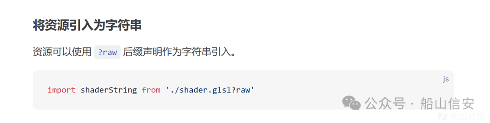  
  
   
  
所以CVE-2024-45811最终的poc是  
  
   
```
http://localhost:5174/iife/@fs/C:/windows/win.ini?import&raw
```  
  
官方对于CVE-2024-45811的修复补丁如下  
  
   
  
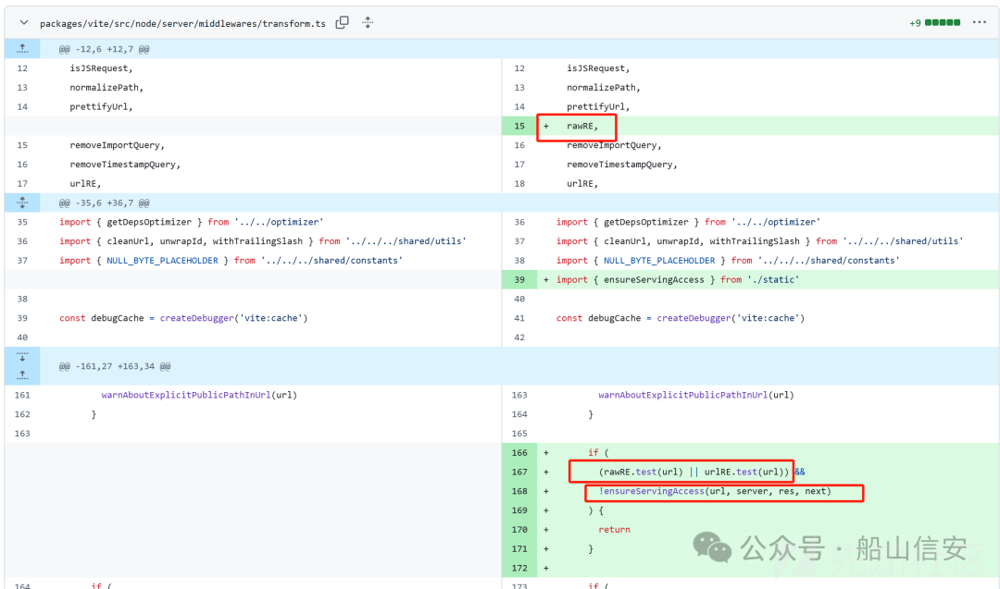  
  
   
  
对于传入的url使用rawRE正则进行匹配，**发现如果满足了资源引入的raw语法则调用ensureServingAccess方法判断 url指向的文件否是项目内允许的资源文件，限制不可读取非项目内的文件**  
  
   
```
export const rawRE = /(\?|&)raw(?:&|$)/
```  
  
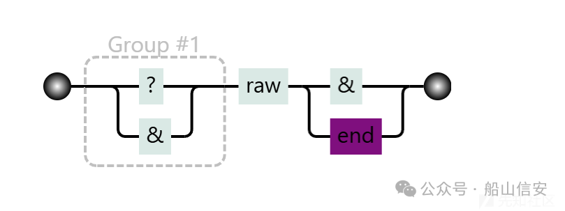  
  
   
  
而CVE-2025-30208则是绕过了上述补丁，**具体是绕过了rawRE正则，从而不需要走ensureServingAccess的验证逻辑**  
，poc如下  
  
   
```
http://localhost:5174/iife/@fs/C:/windows/win.ini?import&raw??
```  
  
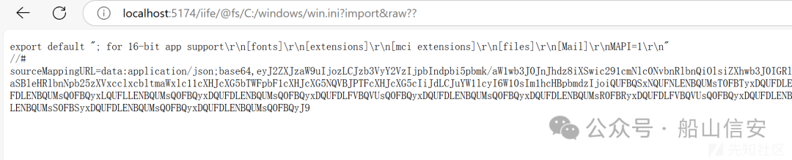  
  
   
  
只是在上一个洞的基础上加上了??  
  
   
  
如果要绕过rawRE正则，其实只需要加一个?  
即可，为什么是2个??  
  
   
  
加2个??  
的原因是在于，在走到rawRE  
的判断前会对url进行预处理，进行url解码，并且处理时间相关的参数，以及移除第一个?  
(或者#  
)到末尾的内容，所以要多加一个?  
来应付这种预处理  
  
   
  
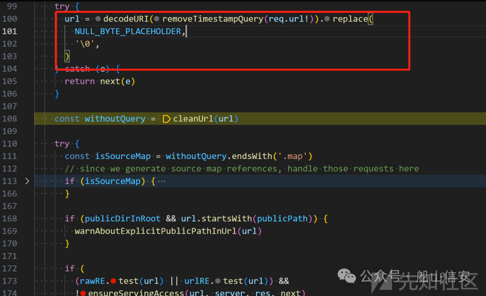  
  
   
```
const trailingSeparatorRE = /[?&]$/export function removeTimestampQuery(url: string): string {  return url.replace(timestampRE, '').replace(trailingSeparatorRE, '')}
```  
  
那为什么加?  
问号能够正常工作呢  
  
   
  
其实是因为后面对于上述处理后的url在doTransform  
方法的开头又调用了一次removeTimestampQuery  
，把第二个？  
也移除了所以最终处理的url还是为/@fs/C:/windows/win.ini?raw  
  
   
  
符合定义的语法所以能走到文件读取的逻辑  
  
   
  
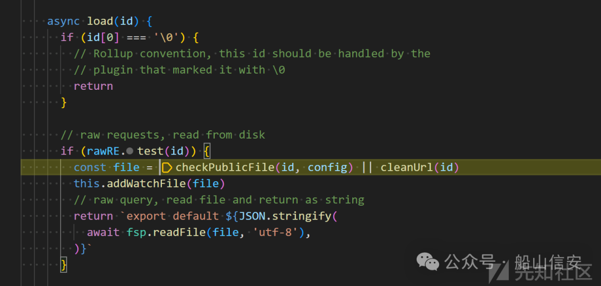  
  
   
  
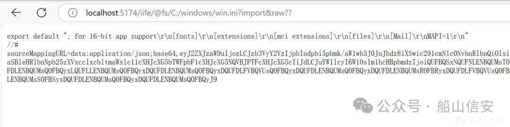  
  
   
  
对于CVE-2025-30208的补丁修复逻辑如下  
  
   
  
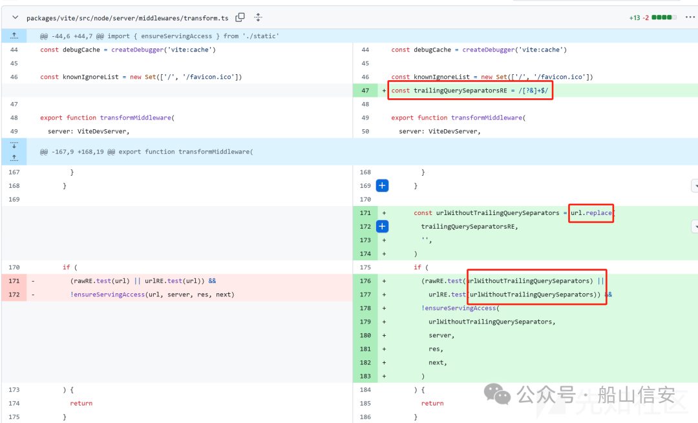  
  
   
  
既然这次的绕过是由于加了??  
,所以这次官方在补丁中引入了trailingQuerySeparatorsRE  
正则，移除url后面多余的连续的?  
和&  
  
   
  
  
   
## CVE-2025-31125  
  
   
  
CVE-2025-31125这个漏洞，没有直接对CVE-2025-30208补丁进行绕过，而是找到了另外的读取文件的方法  
explicit-inline-handling  
和  
  
   
  
webassembly  
，只不过这次不是读取文件的明文而是文件的base64编码后的内容  
  
   
  
这次官方给的poc是  
  
   
```
http://localhost:5173/@fs/C:/windows/win.ini?import&?inline=1.wasm?init
```  
  
核心在于inline  
和.wasm?init  
  
   
  
首先来看下官方文档中介绍的inline用法  
  
   
  
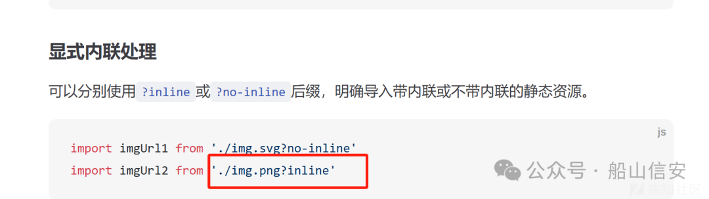  
  
   
  
即只需要加上inline  
即可将文件内容作为静态资源进行内嵌  
  
   
  
   
  
再看一下webAssembly的使用，只要以.wasm?init  
结尾即可返回文件内容的base64编码  
  
   
  
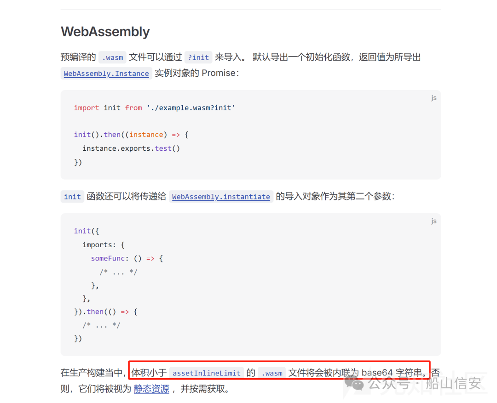  
  
   
  
所以结合inline语法，我们就有可能读取到以wasm为后缀的文件到base64编码后文件内容  
  
   
  
但是似乎不太对，我们要读的明明不是.wasm文件，我们要达到的目的是要读取任意文件，这个又是咋回事？  
  
   
  
这个是因为wasmHelperPlugin  
的处理逻辑有点问题，实际的程序逻辑只要求最后以.wasm?init  
结尾即可，但是其实没有考虑到.wasm?init  
可能在参数的位置  
  
   
  
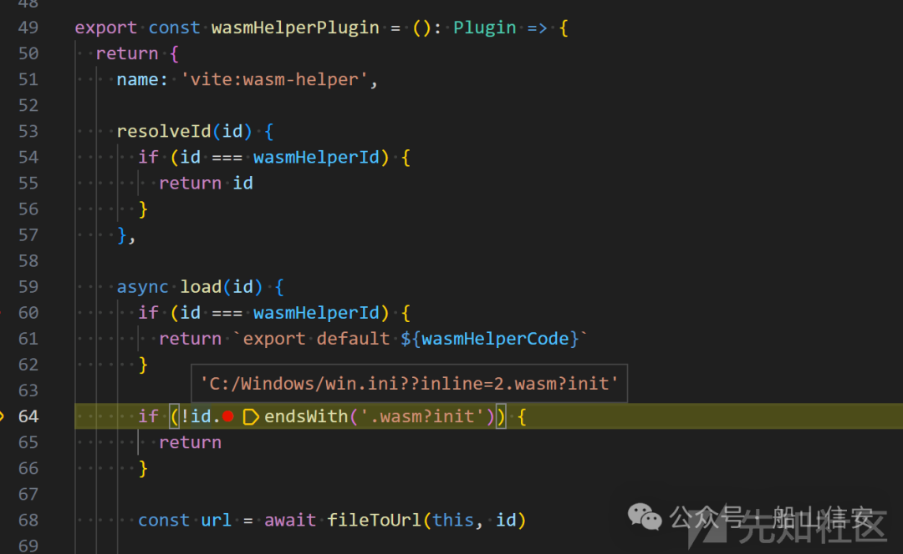  
  
   
  
最终可以走到核心fileToDevUrl  
方法,该方法只要求id（即处理后的url）满足正则/[?&]inline\b/  
即可走到文件读取的逻辑（其中cleanUrl  
很贴心地将我们?后面带的参数部分全部移除，所以最后的file为"C:/Windows/win.ini"  
）  
  
   
```
export const inlineRE = /[?&]inline\b/export async function fileToDevUrl(  environment: Environment,  id: string,  skipBase = false,): Promise<string> {  const config = environment.getTopLevelConfig()  const publicFile = checkPublicFile(id, config)  // If has inline query, unconditionally inline the asset  if (inlineRE.test(id)) {    const file = publicFile || cleanUrl(id)    const content = await fsp.readFile(file)    return assetToDataURL(environment, file, content)  }
```  
  
   
  
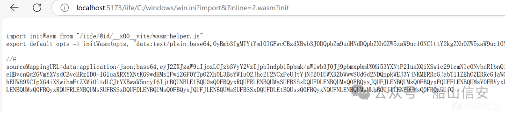  
  
   
  
官方对此的修复如下  
  
   
  
既然inline语法有可能会因为文件内联导致文件内容被读取，那么对于传入的url使用inlineRE  
正则进行匹配，发现如果满足了资源引入的inline语法则调用ensureServingAccess  
方法判断 url指向的文件否是项目内允许的资源文件，限制不可读取非项目内的文件  
  
   
  
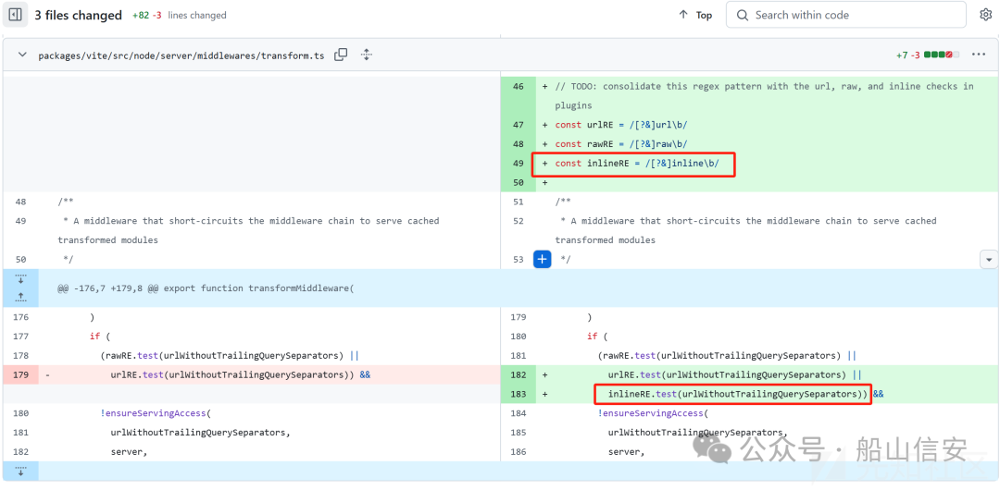  
  
   
  
   
## CVE-2025-31486  
  
   
  
CVE-2025-31486可谓是大家各显神通的一个漏洞，主要包含了2种绕过的方法  
  
   
### 寻找新的文件内敛方法.svg  
  
   
  
在上面分析CVE-2025-31125的时候提到了fileToDevUrl  
，只贴了一半逻辑，现在贴下其完整逻辑  
  
   
```
export async function fileToDevUrl(  environment: Environment,  id: string,  skipBase = false,): Promise<string> {  const config = environment.getTopLevelConfig()  const publicFile = checkPublicFile(id, config)  // If has inline query, unconditionally inline the asset  if (inlineRE.test(id)) {    const file = publicFile || cleanUrl(id)    const content = await fsp.readFile(file)    return assetToDataURL(environment, file, content)  }  // If is svg and it's inlined in build, also inline it in dev to match  // the behaviour in build due to quote handling differences.  if (svgExtRE.test(id)) {    const file = publicFile || cleanUrl(id)    const content = await fsp.readFile(file)    if (shouldInline(environment, file, id, content, undefined, undefined)) {      return assetToDataURL(environment, file, content)    }  }  let rtn: string  if (publicFile) {    // in public dir during dev, keep the url as-is    rtn = id  } else if (id.startsWith(withTrailingSlash(config.root))) {    // in project root, infer short public path    rtn = '/' + path.posix.relative(config.root, id)  } else {    // outside of project root, use absolute fs path    // (this is special handled by the serve static middleware    rtn = path.posix.join(FS_PREFIX, id)  }  if (skipBase) {    return rtn  }  const base = joinUrlSegments(config.server.origin ?? '', config.decodedBase)  return joinUrlSegments(base, removeLeadingSlash(rtn))}
```  
  
CVE-2025-31125走的分支是inlineRE.test(id)  
，但是现在inline不能用了，那我们可以走svgExtRE.test(id)  
分支  
  
   
  
这个就是官方披露的第一个poc  
  
   
```
http://localhost:5173/iife/C:/windows/win.ini?import&?.svg?.wasm?init
```  
  
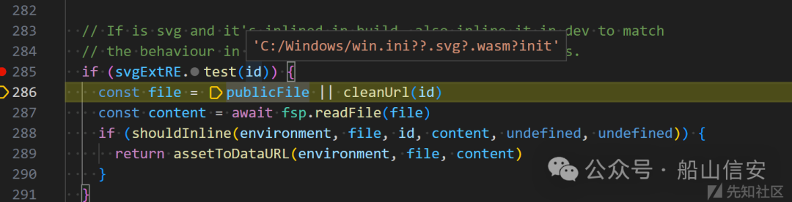  
  
   
  
得出这个poc一个是要满足svgExtRE  
正则和shouldInline  
方法中的各种条条框框  
  
   
```
function shouldInline(  environment: Environment,  file: string,  id: string,  content: Buffer,  /** Should be passed only in build */  buildPluginContext: PluginContext | undefined,  forceInline: boolean | undefined,): boolean {  if (noInlineRE.test(id)) return false  if (inlineRE.test(id)) return true  // Do build only checks if passed the plugin context during build  if (buildPluginContext) {    if (environment.config.build.lib) return true    if (buildPluginContext.getModuleInfo(id)?.isEntry) return false  }  if (forceInline !== undefined) return forceInline  if (file.endsWith('.html')) return false  // Don't inline SVG with fragments, as they are meant to be reused  if (file.endsWith('.svg') && id.includes('#')) return false  let limit: number  const { assetsInlineLimit } = environment.config.build  if (typeof assetsInlineLimit === 'function') {    const userShouldInline = assetsInlineLimit(file, content)    if (userShouldInline != null) return userShouldInline    limit = DEFAULT_ASSETS_INLINE_LIMIT  } else {    limit = Number(assetsInlineLimit)  }  return content.length < limit && !isGitLfsPlaceholder(content)}
```  
  
可以有很多变形，核心不变的在于.svg  
  
   
  
这种利用方式还有个限制就是只能读取文件小于 build.assetsInlinelimit   
(默认为 4kB) 的文件  
  
   
  
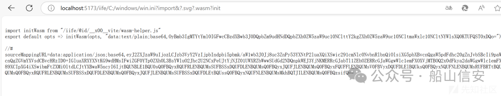  
  
   
  
  
   
### bypass权限校验ensureServingAccess  
  
   
  
官方披露的第二个poc为  
  
   
```
curl 'http://127.0.0.1:5173/@fs/x/x/x/vite-project/?/../../../../../etc/passwd?import&?raw'
```  
  
上面我们说到在修复CVE-2024-45811时有引入ensureServingAccess对传入的url进行校验，这个poc就绕过了ensureServingAccess的校验从而使用raw语法成功读取到了文件  
  
   
  
   
  
针对我本地项目的情况，我本地可用的poc为  
  
   
```
http://localhost:5173/iife/@fs/C:/Users/swordlight/main/sec/analyse/vite-6.2.4/?/../../../../../../../windows/win.ini?import&raw
```  
  
按照这个poc的允许步骤来看下具体的流程  
  
   
  
CVE-2025-30208的补丁中引入了trailingQuerySeparatorsRE  
正则替换，经过该正则处理后的urlWithoutTrailingQuerySeparators  
为  
  
   
  
/@fs/C:/Users/swordlight/main/sec/analyse/vite-6.2.4/?/../../../../../../../windows/win.ini?import&raw  
  
   
  
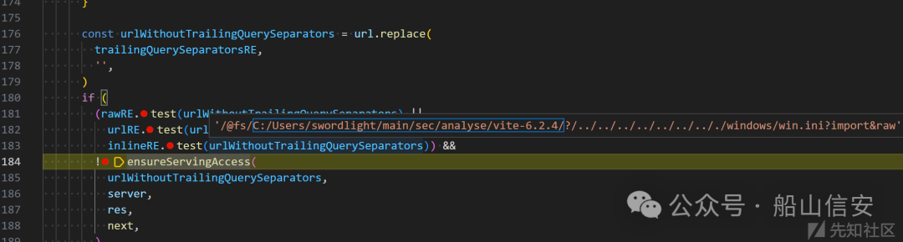  
  
   
  
故传入ensureServingAccess  
的url参数即为/@fs/C:/Users/swordlight/main/sec/analyse/vite-6.2.4/?/../../../../../../../windows/win.ini?import&raw  
  
   
  
ensureServingAccess  
方法中只要isFileServingAllowed  
方法返回true  
即可通过校验  
  
   
```
export function ensureServingAccess(  url: string,  server: ViteDevServer,  res: ServerResponse,  next: Connect.NextFunction,): boolean {  if (isFileServingAllowed(url, server)) {    return true  }  if (isFileReadable(cleanUrl(url))) {    const urlMessage = `The request url "${url}" is outside of Vite serving allow list.`    const hintMessage = `${server.config.server.fs.allow.map((i) => `- ${i}`).join('\n')}Refer to docs https://vite.dev/config/server-options.html#server-fs-allow for configurations and more details.`    server.config.logger.error(urlMessage)    server.config.logger.warnOnce(hintMessage + '\n')    res.statusCode = 403    res.write(renderRestrictedErrorHTML(urlMessage + '\n' + hintMessage))    res.end()  } else {    // if the file doesn't exist, we shouldn't restrict this path as it can    // be an API call. Middlewares would issue a 404 if the file isn't handled    next()  }  return false}
```  
  
而isFileServingAllowed  
对于此次绕过的核心在fsPathFromUrl  
的调用  
  
   
```
export function isFileServingAllowed(  url: string,  server: ViteDevServer,): booleanexport function isFileServingAllowed(  configOrUrl: ResolvedConfig | string,  urlOrServer: string | ViteDevServer,): boolean {  const config = (    typeof urlOrServer === 'string' ? configOrUrl : urlOrServer.config  ) as ResolvedConfig  const url = (    typeof urlOrServer === 'string' ? urlOrServer : configOrUrl  ) as string  if (!config.server.fs.strict) return true  const filePath = fsPathFromUrl(url)  return isFileLoadingAllowed(config, filePath)}
```  
  
fsPathFromUrl  
方法在处理路径时首先调用了cleanUrl  
对url进行了再次处理  
  
   
```
export function fsPathFromUrl(url: string): string {  return fsPathFromId(cleanUrl(url))}
```  
  
cleanUrl  
会使用正则处理url中的第一个？或者#开始的到结尾的部分进行移除，经过cleanUrl  
处理后返回的url为/@fs/C:/Users/swordlight/main/sec/analyse/vite-6.2.4/  
这个其实指向的就是我本地项目的根路径，是合法的  
  
   
  
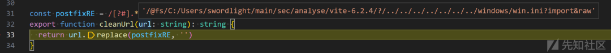  
  
   
  
经过url到路径的转换最终被用来进行鉴权判断的路径为C:/Users/swordlight/main/sec/analyse/vite-6.2.4/  
，其实这个就是我本地项目实际的根目录  
  
   
  
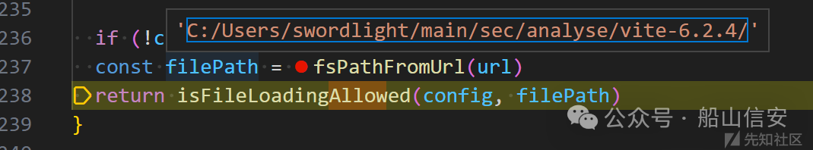  
  
   
  
所以最终在进行目录校验时，最终满足了第三个分支，通过了目录的合法性的校验  
  
   
  
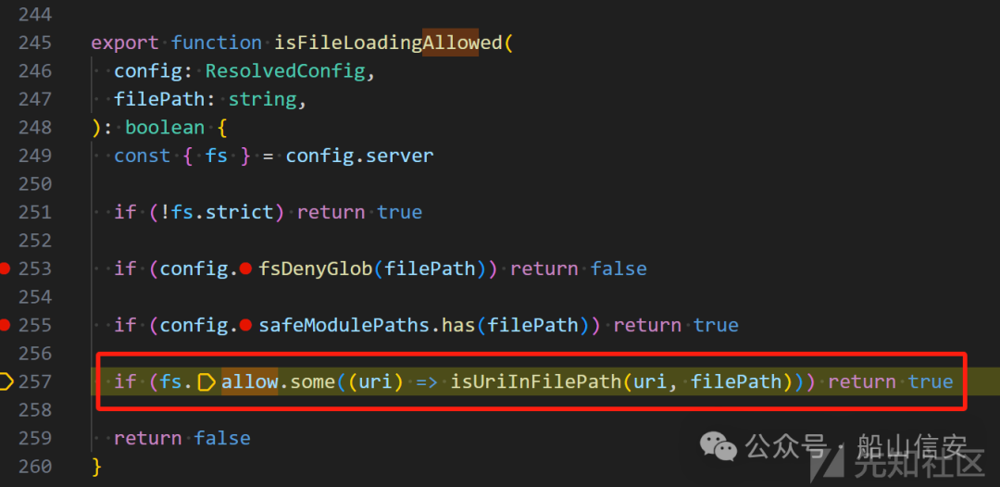  
  
   
  
  
   
  
但是通过目录验证后，后续的处理逻辑却又是使用我们原始的url进行处理  
  
   
  
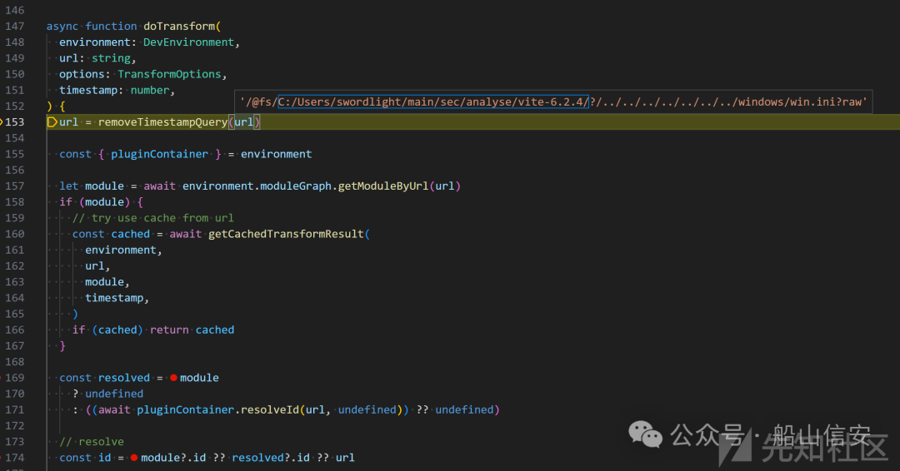  
  
   
  
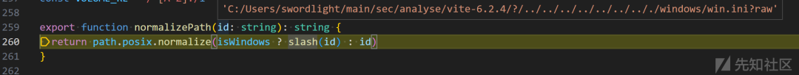  
  
   
  
后续在处理完毕@fs和进行路径规范化后得到的url即为C:/windows/win.ini?raw  
  
   
  
最终可以使用raw语法成功读取明文文件内容  
  
   
  
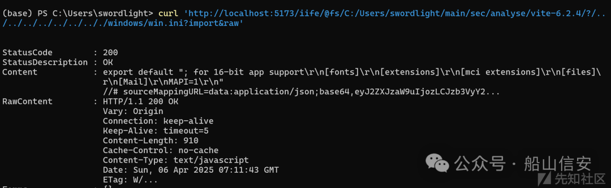  
  
   
  
   
## 总结  
  
   
  
vite这一系列漏洞单看某个漏洞不觉得有什么，但是总体看会发现还是有点意思。上一个漏洞的补丁可能会为下一个漏洞的利用埋下伏笔。个人觉得可能是官方在修复时没有站在一个更全局的视角去考虑修复的方法，所以存在这种一波三折的修复情况。  
  
  
作者：【  
sw0rd1ight】  
  
  


---

> 来源：gelusus/wxvl（微信公众号漏洞文章自动归档，原始披露 URL 尚未确认，现有链接按来源追溯区分别标注）
