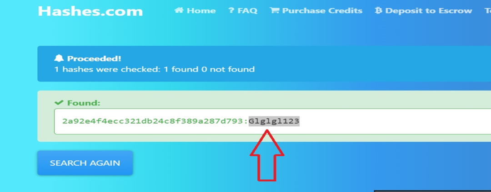
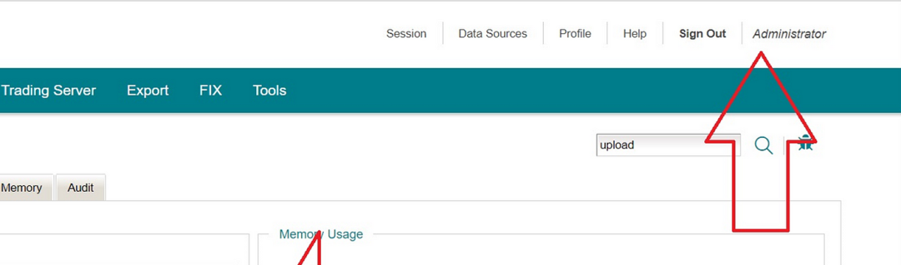
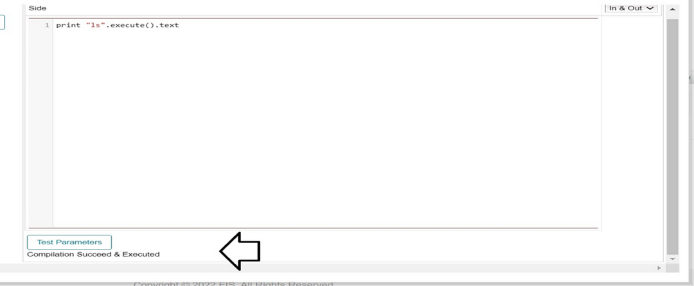

# 从路径遍历到远程命令执行（RCE）

<!-- vulwiki-editorial-rebuild:system-misc -->
## 条目范围与校订

- 本文对象：匿名Java后台文件读取到Groovy执行案例
- 文献类型：技术文章（细分类待核）
- 版本、权限及部署边界：无产品版本/原报告，仅匿名演示不应创建通用CVE产品记录
- 核验状态：仅重建文本校订；未执行文中代码、PoC 或扫描，未把截图或转载声明记为本站复现

### 具体结论与待核项

以下为原归档的逐项勘误与证据缺口；可由文本确定的问题已在下文订正，仍缺来源的事实保持待核。

1. 读公开main.js成功本身不能证明遍历，WEB-INF读取才支持非公开应用文件泄露
2. 称仅/admin下与随后/WEB-INF不一致，需区分应用根和操作系统路径
3. 日志中哈希如何取得明文/对应账号缺过程，MD5应称哈希非加密
4. 两条Groovy命令粘成textprint无法直接运行
5. 管理Groovy Console可能设计能力，漏洞边界主要日志/凭据泄露
6. OOB奖励通常更低非普遍事实，无平台规则来源
7. 无产品版本/原报告，仅匿名演示不应创建通用CVE产品记录

### 操作风险

原文技术操作的实际副作用未复现核验；按其请求/代码评估状态变更、凭据暴露和业务影响

技术请求、代码与实验方法按原文保留；其中的破坏性动作仅限授权、可恢复的隔离环境。缺失代码、参数或版本事实不猜补。

### 来源追溯

- 原始披露 URL 未确认；既有归档来源标签保留，不能替代原始公告

### 归档技术正文

原创 神医  云息信安   2025-07-05 08:31  
  
****  
让我们看看如何从一个看似不起眼的路径遍历漏洞，一路深入最终打到远程命令执行（RCE）。  
## 开始侦察：目标站点与发现的子域  
  
在侦察和端口扫描阶段，我们发现目标有一个特别的子域：  
  
http://admin.target.com:8443  
  
起初它返回的是个 404，不少猎人可能看到 404 就直接跳过了。但我不会。  
  
通过对这个子域进行 fuzz，我找到了一个路径会跳转到登录页：  
  
http://admin.target.com:8443/admin/faces/jsf/login.xhtml  
  
登录页没发现什么问题，我决定继续在 /admin/  
 路径下 fuzz。很快我发现了一个端点：  
  
http://admin.target.com:8443/admin/download  
  
返回的是 200 状态码，但内容为空。  
  
从接口名字就能猜出是下载接口，但我们不知道参数名和文件路径。因为它在 /admin/  
 下，我就试着访问一些后台常见的文件，比如：  
  
/admin/js/main.js  
  
于是我构造了如下请求来测试路径遍历或 LFI：  
  
/admin/download?filename=/admin/js/main.js  
  
  
发现文件成功返回，说明参数是 filename  
，而且存在一个**受限的路径遍历漏洞**  
 —— 只能访问 /admin/  
 下的内容，外部路径如 /etc/passwd  
 是访问不到的。  
## 持续探索：路径遍历读配置文件  
  
由于目标是 Java 应用，我尝试读取：  
  
/WEB-INF/web.xml  
  
果然可以访问，路径如下：  
  
http://admin.target.com:8443/admin/download?filename=/WEB-INF/web.xml  
  
  
在这个 XML 配置中，我发现了几个关键路径，包括：  
- /admin/faces/jsf/login.xhtml  
 （我们已经知道）  
  
- /admin/incident-report  
  
访问 /admin/incident-report  
 居然自动触发了一个日志文件的下载，名为：  
  
incident-report-xxxxx.zip  
  
  
**实时日志文件**  
！每次访问都会重新生成并下载。很多人可能到这里就直接上报漏洞了，但我没有放弃。  
## 意外收获：日志中发现了密码！  
##   
  
我解压日志后，意外发现了几条敏感信息，比如管理后台的密码哈希：  
  
21232f297a57a5a743894a0e4a801fc3:admin （MD5，加密过期）2a92e4f4ecc321db24c8f389a287d793:Glglgl123  
  
  
于是我尝试用账号 admin  
 和密码 Glglgl123  
 登录：  
  
  
  
http://admin.target.com:8443/admin/faces/jsf/login.xhtml  
  
**成功登录后台！**  
 拿到了完整管理员权限！  
  
  
## 后台发现 groovy console —— 开启 RCE 的大门  
  
在后台页面中，我发现了一个功能点叫：  
  
export_step2.xhtml  
  
页面中居然嵌入了 Groovy Console！如果你了解 Groovy Console，就知道这玩意一旦对外暴露，后果会有多严重：  
- 可以任意执行 Java/Groovy 代码  
  
- 读取配置、环境变量、甚至凭证  
  
- 如果服务权限高，可能直接提权或植入后门  
  
我立刻尝试执行以下命令：  
  
print "id".execute().textprint "cat /etc/passwd".execute().text  
  
但是……命令执行了，却没有返回任何输出。  
  
  
## 关键突破：RCE 输出藏在日志文件里！  
  
这时我突然想到前面提到的 /admin/incident-report  
 —— 每次访问会下载实时日志。  
  
我马上执行命令后访问该接口，下载最新日志一看：**命令执行输出就在那里！**  
  
****  
至此，完整的漏洞利用链打通：  
1. 登录后台（通过泄露的密码）  
  
1. 找到并进入 Groovy Console  
  
1. 执行命令如：  
```
print "whoami".execute().text
```  
  
1. 去 /admin/incident-report  
 下载日志  
  
1. 查看日志中命令执行的输出  
  
## 为什么不使用 OOB-RCE 或文件写入？  
  
很多人可能会问，为什么不直接尝试 OOB-RCE（出网）或写文件拿 shell？  
  
原因有两个：  
1. **OOB-RCE 被拦截**  
：存在某种 WAF 或防火墙，所有出网请求都被拦截。  
  
1. **赏金机制**  
：OOB-RCE 的奖励通常低于直接 RCE。直接打通命令执行链路，是更高价值的报告。  
  
## 总结与经验分享：  
### 1. 把漏洞挖掘当成一场游戏  
  
别在发现一个小漏洞后就满足了，真正的大奖永远藏得更深。这次我从路径遍历一路挖到 RCE，赏金也从几千变成了几万。  
### 2. 一个子域，一口气测试到底  
  
子域有洞，别急着上报，深入测试所有功能点，再决定是否提交。小洞常常能带来大突破。  
### 3. 质量胜于数量  
  
起初我们把所有发现写成一个大报告，后来平台建议我们拆分，因为独立提交更容易获得高额奖励，也更有利于平台处理问题。  
  
  
本公众号云息信安所提供的信息以及工具仅供安全测试人员用于授权测试，禁止用于未授权测试，请勿非法使用！！！造成的任何直接或者间接的后果及损失，均由使用者本人负责，公众号云息信安及作者不为此承担任何责任，一旦造成后果请自行承担！如有侵权烦请告知，我们会立即删除并致歉。谢谢！  
  
  
  


---

> 来源：gelusus/wxvl（微信公众号漏洞文章自动归档，原始披露 URL 尚未确认，现有链接按来源追溯区分别标注）
