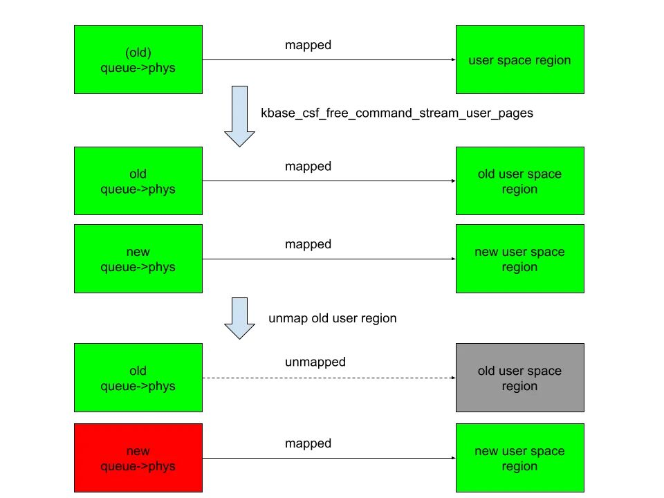
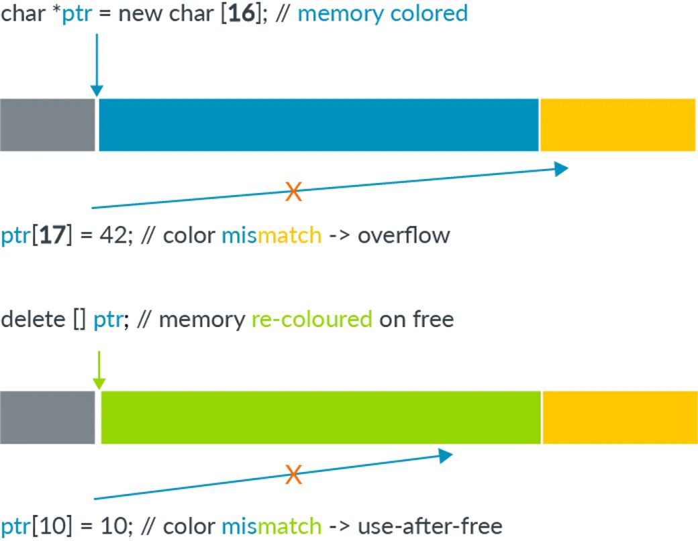

# 利用 CVE-2025-0072 绕过 MTE

> 编号角色校订（2026-10-04）：按归档技术正文区分主讨论编号与背景引用，更新 `primary_identifiers` / `referenced_identifiers` 及旧字段角色。旧编号原值、状态与正文保持原样，变更前字段逐字保存在 `previous_*`；后文旧的角色待核说明应按当前字段阅读。这里的角色判读不等于官方分配核验或漏洞复现。

<!-- vulwiki-editorial-rebuild:system-misc -->
## 条目范围与校订

- 本文对象：ARM Mali CSF GPU driver / CVE-2025-0072
- 文献类型：技术文章（细分类待核）
- 版本、权限及部署边界：缺易受影响驱动范围、Android构建及厂商回移补丁映射，r54p0日期需ARM/ASB一手公告核验；前部摘要与后文重复，完整PoC依赖GitHub Security Lab外链，最终权限提升截图未作像素核验
- 核验状态：仅重建文本校订；未执行文中代码、PoC 或扫描，未把截图或转载声明记为本站复现

### 具体结论与待核项

以下为原归档的逐项勘误与证据缺口；可由文本确定的问题已在下文订正，仍缺来源的事实保持待核。

1. 旧映射关闭时释放新queue->phys造成页UAF、再利用GPU页表实现内核读写的正文链条连贯，CVE-2023-6241仅为前例不是主漏洞
2. 明确仅Pixel 8实测，Pixel 7/9为作者推测，不可扩成所有Android设备
3. 缺易受影响驱动范围、Android构建及厂商回移补丁映射，r54p0日期需ARM/ASB一手公告核验
4. 需本地恶意应用可访问Mali CSF设备及相应ioctl和内核MTE配置，非远程无需交互漏洞
5. 大量C片段压成一行且关键字黏连，行注释吞掉后续内容，部分函数名与正文不一致，不能直接编译
6. 作者对MTE绕过的用户映射标签机制明确不确定，应保留该限定并补映射属性/分配器证据，不能宣称MTE全面失效
7. 前部摘要与后文重复，完整PoC依赖GitHub Security Lab外链，最终权限提升截图未作像素核验

### 操作风险

原文技术操作的实际副作用未复现核验；按其请求/代码评估状态变更、凭据暴露和业务影响

技术请求、代码与实验方法按原文保留；其中的破坏性动作仅限授权、可恢复的隔离环境。缺失代码、参数或版本事实不猜补。

### 来源追溯

- 原始披露 URL 未确认；既有归档来源标签保留，不能替代原始公告

### 归档技术正文

 Ots安全   2025-06-11 03:16  
  
  
  
这篇文章深入探讨了   
CVE-2025-0072  
，一个影响 ARM Mali GPU 驱动的漏洞，作者详细描述了如何利用该漏洞在启用内存标签扩展（Memory Tagging Extension, MTE）的安卓设备上实现任意内核代码执行。以下是文章的核心内容：  
1. 漏洞背景  
：  
  
1. CVE-2025-0072  
 是作者发现并于 2024 年 12 月 12 日报告给 ARM 的一个漏洞，影响使用 Command Stream Frontend (CSF) 架构的新款 ARM Mali GPU，例如 Google Pixel 7、8 和 9 系列。  
  
1. 该漏洞已于 2025 年 5 月 2 日在 Mali 驱动版本 r54p0 中修复，并包含在安卓 2025 年 5 月的安全更新中。  
  
1. 文章通过分析 Mali GPU 驱动中的 CSF 队列机制，展示了如何利用漏洞绕过 MTE（一种旨在防止内存腐败的硬件安全特性）并实现内核代码执行。  
  
1. CSF 队列的工作原理  
：  
  
1. CSF 队列是 Mali GPU 驱动中用于用户态与内核态通信的机制，通过   
kbase_queue  
 和   
kbase_queue_group  
 对象实现。  
  
1. 用户通过   
KBASE_IOCTL_CS_QUEUE_REGISTER  
 和   
KBASE_IOCTL_CS_QUEUE_GROUP_CREATE  
 等 ioctl 调用创建和绑定队列，分配 GPU 内存并将其映射到用户空间。  
  
1. 队列绑定后，内存页面存储在   
queue->phys  
 中，并通过   
mmap  
 调用映射到用户空间。页面释放通常在用户空间解除映射时触发。  
  
1. 漏洞利用原理  
：  
  
1. 漏洞的核心在于通过多次绑定和解绑   
kbase_queue  
 操作，操控   
queue->phys  
 中的内存页面，制造   
页面使用后释放（use-after-free, UAF）  
 漏洞。  
  
1. 具体步骤包括：  
  
1. 通过精心安排内存池操作，作者将释放的页面重新分配为 GPU 上下文的页面表全局目录（PGD），从而允许从用户空间重写 PGD，实现任意内核内存读写和代码执行。  
  
1. 创建并绑定   
kbase_queue  
 和   
kbase_queue_group  
，分配初始 GPU 内存页面并映射到用户空间。  
  
1. 终止原始   
kbase_queue_group  
，解绑队列。  
  
1. 将队列绑定到新的   
kbase_queue_group  
，分配新的 GPU 内存页面，覆盖   
queue->phys  
。  
  
1. 解除旧用户空间映射，导致新的   
queue->phys  
 页面被错误释放，但仍可通过新的用户空间映射访问。  
  
1. 绕过 MTE 的机制  
：  
  
1. MTE 是 ARMv8.5-A 架构引入的硬件内存安全特性，通过在指针和内存块中存储标签（tag）来检测内存腐败（如线性溢出或 UAF）。  
  
1. 该漏洞通过用户空间映射直接访问释放的页面，绕过了 MTE 的检查。原因可能是页面映射通过   
insert_pfn  
 直接插入用户空间页面表，访问时无需内核解引用，因此未触发 MTE。  
  
1. 即使页面被释放至内核的 buddy 分配器，MTE 仍未触发，表明用户空间映射的特殊性质可能导致 MTE 失效。  
  
  
  
  
  
  
内存标记扩展 (MTE)是一项高级内存安全功能，旨在使内存损坏漏洞几乎无法被利用。然而，任何缓解措施都不可能做到万无一失，尤其是在底层操作内存的内核代码中。  
  
去年，我曾撰写过一篇关于 CVE-2023-6241 的文章，该漏洞存在于 ARM 的 Mali GPU 驱动程序中，可使不受信任的 Android 应用绕过 MTE 并获取任意内核代码执行权限。在本文中，我将介绍 CVE-2025-0072：一个最近已修补的漏洞，该漏洞也是我在 ARM 的 Mali GPU 驱动程序中发现的。与上一个漏洞一样，该漏洞也使恶意 Android 应用能够绕过 MTE 并获取任意内核代码执行权限。  
  
我于 2024 年 12 月 12 日向 Arm 报告了此问题。该问题已在2025 年 5 月 2 日公开发布的Mali 驱动程序版本r54p0中得到修复，并包含在 Android 2025 年 5 月的安全更新中。该漏洞会影响搭载较新 Arm Mali GPU 且采用命令流前端 (CSF ) 架构的设备，例如 Google 的 Pixel 7、8 和 9 系列。我在启用了内核 MTE 的 Pixel 8 上开发并测试了该漏洞利用程序，我相信经过少量修改后，该漏洞应该也适用于 7 和 9。  
  
接下来深入探讨 CSF 队列的工作原理、我用来利用此漏洞的步骤以及它最终如何绕过 MTE 保护来实现内核代码执行。  
  
CSF队列的工作原理及其危险性  
  
具有 CSF 功能的 Arm Mali GPU 通过命令队列与用户空间应用程序通信，这些队列在驱动程序中以kbase_queue对象的形式实现。队列是使用 创建的。要使用创建的 ，首先必须将其绑定到，而 是通过 创建的。可以使用将 A 绑定到。将 a 绑定到时，会创建一个句柄并将其返回给用户应用程序。  
  
```
KBASE_IOCTL_CS_QUEUE_REGISTERioctl kbase_queue kbase_queue_group KBASE_IOCTL_CS_QUEUE_GROUP_CREATEioctl kbase_queue kbase_queue_group KBASE_IOCTL_CS_QUEUE_BINDioctl kbase_queue kbase_queue_group get_user_pages_mmap_handle
```  
  
  
  
```
intkbase_csf_queue_bind(struct kbase_context *kctx, union kbase_ioctl_cs_queue_bind *bind){            ...group = find_queue_group(kctx, bind->in.group_handle);  queue = find_queue(kctx, bind->in.buffer_gpu_addr);            …  ret = get_user_pages_mmap_handle(kctx, queue);if (ret)    gotoout;  bind->out.mmap_handle = queue->handle;group->bound_queues[bind->in.csi_index] = queue;  queue->group = group;  queue->group_priority = group->priority;  queue->csi_index = (s8)bind->in.csi_index;  queue->bind_state = KBASE_CSF_QUEUE_BIND_IN_PROGRESS;out:  rt_mutex_unlock(&kctx->csf.lock);return ret;}
```  
  
  
此外， 和 之间存储了相互引用kbase_queue_group。queue请注意，调用完成后，queue->bind_state设置为KBASE_CSF_QUEUE_BIND_IN_PROGRESS，表示绑定尚未完成。要完成绑定，用户应用程序必须调用 ，mmap并使用 所返回的句柄ioctl作为文件偏移量。此mmap调用由 处理  
kbase_csf_cpu_mmap_user_io_pages，它通过 分配 GPU 内存  
kbase_csf_alloc_command_stream_user_pages并将其映射到用户空间。  
  
  
```
intkbase_csf_alloc_command_stream_user_pages(struct kbase_context *kctx, struct kbase_queue *queue){structkbase_device *kbdev = kctx->kbdev;int ret;  lockdep_assert_held(&kctx->csf.lock);  ret = kbase_mem_pool_alloc_pages(&kctx->mem_pools.small[KBASE_MEM_GROUP_CSF_IO],           KBASEP_NUM_CS_USER_IO_PAGES, queue->phys, false, //<------ 1.           kctx->task);  ...  ret = kernel_map_user_io_pages(kctx, queue);  ...  get_queue(queue);queue->bind_state = KBASE_CSF_QUEUE_BOUND;  mutex_unlock(&kbdev->csf.reg_lock);return0;  ...}
```  
  
  
在上述代码片段 1 中，kbase_mem_pool_alloc_pages调用 来从 GPU 内存池分配内存页，这些内存页的地址随后存储在queue->phys字段中。这些内存页随后被映射到用户空间，bind_state队列的 设置为KBASE_CSF_QUEUE_BOUND。仅当映射区域从用户空间取消映射后，才会释放这些内存页。在这种情况下，kbase_csf_free_command_stream_user_pages调用 来通过 释放内存页kbase_mem_pool_free_pages。  
  
```
voidkbase_csf_free_command_stream_user_pages(struct kbase_context *kctx, struct kbase_queue *queue){  kernel_unmap_user_io_pages(kctx, queue);  kbase_mem_pool_free_pages(&kctx->mem_pools.small[KBASE_MEM_GROUP_CSF_IO],          KBASEP_NUM_CS_USER_IO_PAGES, queue->phys, true, false);  ...}
```  
  
  
这将释放存储在 中的页面queue->phys，并且因为这仅在页面从用户空间取消映射时发生，因此它可以防止页面在释放后被访问。  
  
一个利用想法  
  
有趣的部分始于我们思考：如果我们在将queue->phys页面映射到用户空间后进行修改，会发生什么？例如，如果我可以kbase_csf_alloc_command_user_pages再次触发将新页面覆盖到queue->phys，并将它们映射到用户空间，然后取消映射先前映射的区域，kbase_csf_free_command_stream_user_pages将被调用以释放 中的页面queue->phys。然而，由于queue->phys被新分配的页面覆盖，我最终陷入了一种情况：在取消映射旧区域的同时，我释放了新页面：  
  
  
  
在上图中，右侧列表示用户空间中的映射，绿色矩形表示已映射，灰色矩形表示未映射。左侧列表示存储在中的备用页面queue->phys。新queue->phys页面表示当前存储在中的页面queue->phys，旧queue->phys页面表示之前存储但被新页面替换的页面。绿色表示页面处于活动状态，红色表示已被释放。在覆盖queue->phys并取消映射旧区域后，新页面queue->phys将被释放，但仍映射到新的用户区域。这意味着用户空间将可以访问已释放的新queue->phys页面。这便给我带来了页面释放后使用漏洞。  
  
漏洞  
  
那么让我们看看如何实现这种情况。首先显而易见的是尝试看看我是否可以kbase_queue使用 多次绑定 KBASE_IOCTL_CS_QUEUE_BIND ioctl。然而，这是不可能的，因为queue->group在绑定之前会检查该字段：  
  
```
intkbase_csf_queue_bind(struct kbase_context *kctx, union kbase_ioctl_cs_queue_bind *bind){  ...  if (queue->group || group->bound_queues[bind->in.csi_index])    gotoout;  ...}
```  
  
  
kbase_queue绑定后， aqueue->group会被设置为kbase_queue_group它所绑定到的 ，从而防止kbase_queue再次绑定。此外，一旦 akbase_queue被绑定，就无法通过任何 解除绑定ioctl。它可以通过 终止KBASE_IOCTL_CS_QUEUE_TERMINATE，但这也会删除kbase_queue。因此，如果无法从队列重新绑定，那么尝试从 解除绑定又如何呢kbase_queue_group？例如，如果 akbase_queue_group被 终止会发生什么KBASE_IOCTL_CS_QUEUE_GROUP_TERMINATE ioctl？当 akbase_queue_group终止时，作为清理过程的一部分，它会调用kbase_csf_term_descheduled_queue_group来解除它所绑定到的队列的绑定：  
  
```
voidkbase_csf_term_descheduled_queue_group(struct kbase_queue_group *group){  ...  for (i = 0; i < max_streams; i++) {    structkbase_queue *queue = group->bound_queues[i];    /* The group is already being evicted from the scheduler */    if (queue)      unbind_stopped_queue(kctx, queue);  }  ...}
```  
  
  
然后重置解除绑定queue->group的字段：kbase_queue  
  
```
staticvoidunbind_stopped_queue(struct kbase_context *kctx, struct kbase_queue *queue){  ...  if (queue->bind_state != KBASE_CSF_QUEUE_UNBOUND) {    ...    queue->group->bound_queues[queue->csi_index] = NULL;    queue->group = NULL;    ...    queue->bind_state = KBASE_CSF_QUEUE_UNBOUND;  }}
```  
  
  
具体来说，现在允许kbase_queue绑定到另一个kbase_queue_group。这意味着我现在可以按照以下步骤创建一个页面 UAF：  
1. 创建kbase_queue和kbase_queue_group，然后将 绑定kbase_queue到kbase_queue_group。  
  
1. 为 中的用户 IO 页面创建 GPU 内存页面，kbase_queue并使用调用将它们映射到用户空间mmap。然后，这些页面将存储在queue->phys的字段中kbase_queue。  
  
1. 终止kbase_queue_group，这也会解除 的绑定kbase_queue。  
  
1. 创建另一个kbase_queue_group并将其绑定kbase_queue到这个新组。  
  
1. 为此处的用户 IO 页面创建新的 GPU 内存页面kbase_queue，并将其映射到用户空间。这些页面现在将覆盖 中的现有页面queue->phys。  
  
1. 取消映射在步骤 2 中映射的用户空间内存。这将释放页面queue->phys并删除在步骤 2 中创建的用户空间映射。但是，释放的页面现在是在步骤 5 中创建和映射的内存页面，它们仍然映射到用户空间。  
  
具体来说，这意味着上述步骤 6 中释放的页面仍然可以从用户应用程序访问。通过我之前使用过的技术，我可以将这些释放的页面重用为Mali GPU 的页表全局目录 (PGD) 。  
  
回顾一下，我们来看看 a 的后备页面kbase_va_region是如何分配的。在为 a 的后备存储分配页面时kbase_va_region，kbase_mem_pool_alloc_pages使用以下函数：  
  
```
intkbase_mem_pool_alloc_pages(struct kbase_mem_pool *pool, size_t nr_4k_pages,    struct tagged_addr *pages, bool partial_allowed){    .../* Get pages from this pool */while (nr_from_pool--) {    p = kbase_mem_pool_remove_locked(pool); //<------- 1.        ...  }    ...if (i != nr_4k_pages && pool->next_pool) {    /* Allocate via next pool */    err = kbase_mem_pool_alloc_pages(pool->next_pool, //<----- 2.        nr_4k_pages - i, pages + i, partial_allowed);        ...  } else {    /* Get any remaining pages from kernel */    while (i != nr_4k_pages) {      p = kbase_mem_alloc_page(pool); //<------- 3.            ...        }        ...  }    ...}
```  
  
  
输入参数kbase_mem_pool是一个内存池，由与驱动程序文件关联的 kbase_context 对象管理，用于分配 GPU 内存。正如注释所示，分配实际上是分层进行的。首先，页面将从当前kbase_mem_pool正在使用的内存中分配kbase_mem_pool_remove_locked（上文中的 1）。如果当前内存中没有足够的容量kbase_mem_pool来满足请求，则pool->next_pool使用 来分配页面（上文中的 2）。如果 even 也pool->next_pool没有足够的容量，则kbase_mem_alloc_page使用 直接从内核通过伙伴分配器（内核中的页面分配器）分配页面。  
  
释放页面时，反方向也会发生同样的操作：kbase_mem_pool_free_pages首先尝试将页面归还给kbase_mem_pool当前 的kbase_context，如果内存池已满，则会尝试将剩余的页面归还给pool->next_pool。如果下一个内存池也已满，则剩余的页面将通过伙伴分配器释放并归还给内核。  
  
正如我在文章“无内存损坏的内存破坏”中所述，pool->next_poolkbase_context 是一个由 Mali 驱动程序管理并由所有 kbase_context 共享的内存池。它还用于分配GPU 上下文使用的页表全局目录 (PGD)。具体而言，这意味着通过精心安排内存池，可以将已释放的备用页面kbase_va_region重用为 GPU 上下文的 PGD。（阅读有关如何实现此目的的详细信息。）  
  
一旦释放的页面被重用为 GPU 上下文的 PGD，用户空间映射便可用于从 GPU 重写 PGD。这样一来，任何内核内存（包括内核代码）都可以映射到 GPU，从而允许我重写内核代码，进而执行任意内核代码。这还允许我读写任意内核数据，因此我可以轻松重写进程的凭据以获取 root 权限，并禁用 SELinux。  
> 查看Pixel 8 的漏洞及其一些设置说明。  
  
> https://github.com/github/securitylab/tree/main/SecurityExploits/Android/Mali/CVE-2025-0072  
  
  
这如何绕过 MTE？  
  
在结束之前，让我们先看看为什么这个漏洞能够绕过内存标记扩展 (MTE) — — 尽管有保护措施应该可以使这种类型的攻击不可能发生。  
  
内存标记扩展 (MTE) 是较新的 Arm 处理器上的一项安全功能，它使用硬件实现来检查内存损坏。  
  
Arm64 架构使用 64 位指针访问内存，而大多数应用程序使用的地址空间要小得多（例如 39、48 或 52 位）。64 位指针的最高位实际上未被使用。内存标记的主要思想是使用地址中的这些高位来存储一个“标签”，然后可以使用该标签与与该地址关联的内存块中存储的另一个标签进行校验。  
  
当发生线性溢出，并使用指针解引用相邻内存块时，指针上的标记很可能与相邻内存块中的标记不同。通过在解引用时检查这些标记，可以检测到这种差异，从而检测到损坏的解引用。对于释放后使用 (UAF) 类型的内存损坏，只要每次释放内存块时清除其标记，并在分配内存块时重新分配新的标记，解引用已释放并回收的对象也会导致指针标记与内存中的标记不一致，从而可以检测到释放后使用 (UAF)。  
  
  
  
图片来自内存标记扩展：通过Arm 发布的架构增强内存安全性  
  
内存标记扩展是 ARM 架构v8.5a 版本中引入的指令集，旨在加速硬件对内存进行标记和检查的过程。这使得在实际应用中使用内存标记成为可能。在支持硬件加速指令的架构中，仍然需要内存分配器中的软件支持才能调用内存标记指令。在 Linux 内核中，用于分配内核对象的SLUB 分配器和用于分配内存页的伙伴分配器均支持内存标记。  
> 有兴趣了解更多细节的读者可以参考这篇文章以及Arm发布的白皮书。  
  
> https://lwn.net/Articles/834289/  
  
  
正如我在引言中提到的，此漏洞能够绕过 MTE。然而，与我之前报告的漏洞（通过 GPU 访问已释放的内存页面）不同，此漏洞通过用户空间映射访问已释放的内存页面。由于页面分配和取消引用受 MTE 保护，因此此漏洞能够绕过 MTE 或许有些令人惊讶。最初，我认为这是因为漏洞涉及的内存页面由 管理kbase_mem_pool，而 是 Mali GPU 驱动程序使用的自定义内存池。在此漏洞中，被重用为 PGD 的已释放内存页面只是被返回到由 管理的内存池kbase_mem_pool，然后从该内存池再次分配。因此，该页面从未真正被伙伴分配器释放，因此不受 MTE 保护。尽管如此，我还是决定尝试正确释放该页面并将其返回给伙伴分配器。令我惊讶的是，即使在伙伴分配器释放该页面后访问该页面，MTE 也不会触发。经过一些实验和源代码阅读，似乎由mgm_vmf_insert_pfn_protin创建的页面映射kbase_csf_user_io_pages_vm_fault（用于在内存页面释放后访问该页面）最终会用于insert_pfn创建将页框插入用户空间页表的映射。我并不完全确定，但似乎由于页框直接插入用户空间页表，因此从用户空间访问这些页面不需要内核级取消引用，因此不会触发 MTE。  
  
结论  
  
在本文中，我展示了如何利用 CVE-2025-0072 在启用内核 MTE 的 Pixel 8 上实现任意内核代码执行。与我之前报告的漏洞（通过访问 GPU 释放的内存来绕过 MTE）不同，此漏洞通过驱动程序插入的用户空间内存映射来访问释放的内存。这表明，当通过用户空间的内存映射访问释放的内存页面时，MTE 也可以被绕过，这种情况比之前的漏洞更为常见。  
  
  
  
  
感谢您抽出  
  
  
  
.  
  
  
  
.  
  
  
  
来阅读本文  
  
  
  
**点它，分享点赞在看都在这里**  
  


---

> 来源：gelusus/wxvl（微信公众号漏洞文章自动归档，原始披露 URL 尚未确认，现有链接按来源追溯区分别标注）
