# 利用Reverge自动化工具：提升漏洞赏金 hunting 的速度与效率

<!-- vulwiki-editorial-rebuild:system-misc -->
## 条目范围与校订

- 本文对象：Reverge 攻击面管理工具教程
- 文献类型：技术文章（细分类待核）
- 版本、权限及部署边界：自定义乘法模板仅图无yaml/固定版本，8*8回显证明表达式执行不直接证明完整RCE；公网发现资产并不等于赏金授权范围，流程缺程序范围过滤；有watchTowr/Wiz具体研究，但无Securifera原教程链接/版本，产品自述效率非独立测评
- 核验状态：仅重建文本校订；未执行文中代码、PoC 或扫描，未把截图或转载声明记为本站复现

### 具体结论与待核项

以下为原归档的逐项勘误与证据缺口；可由文本确定的问题已在下文订正，仍缺来源的事实保持待核。

1. 正文例为Ivanti EPMM4427+4428，开头摘要却Fortinet32756，明显跨产品CVE污染
2. 无人机战事和Medium技能研究与工具效果无直接证据，像无来源附加摘要
3. Shodan图标仅候选，后续Java过滤/截图核实说明较谨慎但会漏指纹不足实例
4. 自定义乘法模板仅图无yaml/固定版本，8*8回显证明表达式执行不直接证明完整RCE
5. 公网发现资产并不等于赏金授权范围，流程缺程序范围过滤
6. Reverge译反向传播错误
7. 有watchTowr/Wiz具体研究，但无Securifera原教程链接/版本，产品自述效率非独立测评

### 操作风险

原文技术操作的实际副作用未复现核验；按其请求/代码评估状态变更、凭据暴露和业务影响

技术请求、代码与实验方法按原文保留；其中的破坏性动作仅限授权、可恢复的隔离环境。缺失代码、参数或版本事实不猜补。

### 来源追溯

- 原始披露 URL 未确认；既有归档来源标签保留，不能替代原始公告

### 归档技术正文

 Ots安全   2025-06-10 06:26  
  
  
  
本文深入探讨了如何通过利用自动化工具“reverge”显著提升漏洞赏金（bug bounty） hunting的效率与成功率，特别针对当前网络安全领域日益增长的需求和挑战。文章以作者的亲身实践为基础，详细讲解了从漏洞的证明概念（PoC，例如近期在Fortinet产品中被利用的CVE-2025-32756）到快速验证目标的完整流程。reverge作为一款专为安全专业人员设计的工具，通过其直观的用户界面和强大的集成功能，允许用户高效搜索、排序并隔离高风险系统，同时支持无缝的验证和漏洞利用测试。作者强调，这种自动化流程不仅大幅减少了手动操作的时间成本，还能在时间紧迫、精度要求高的情境下，帮助漏洞赏金猎人、渗透测试人员和红队成员优先处理关键漏洞，从而最大化收益和安全效益。  
  
文章进一步分析了reverge在实际应用中的价值，指出其高速度和可扩展性能够应对现代网络威胁的快速演变。例如，结合2025年6月9日当前的全球网络安全局势——如俄罗斯近期对乌克兰基础设施的无人机攻击——reverge的快速响应能力显得尤为重要，能够帮助安全团队在类似攻击发生前识别和缓解潜在风险。此外，文章还参考了行业研究（如Medium 2023年关于网络安全技能的文章），指出自动化工具在节省重复性任务时间方面的显著优势，这与reverge强调的速度和效率理念高度一致。  
  
除了技术细节，文章还探讨了reverge在更广泛情境中的应用潜力，包括其对减少安全人员疲劳、优化资源分配以及支持更复杂安全分析的贡献。针对当前网络安全威胁的复杂性（如关键基础设施的联网设备增加带来的新漏洞），reverge被定位为一种不可或缺的工具，能够助力安全社区在快速变化的环境中保持领先。无论是对初学者还是经验丰富的专业人士，这篇文章都提供了实用见解，并通过实例展示了如何将自动化技术融入漏洞赏金和网络防御策略中。  
  
上个月，Securifera在AWS Marketplace上公开发布了我们的攻击面管理工具reverge。虽然我们仍计划发布博客文章和视频来指导用户完成设置和使用，但我们想通过演示它如何快速缩小关键漏洞披露与互联网上识别该漏洞可利用实例之间的差距，来展示 reverge 的功能。如果您参与漏洞赏金计划，这可以帮助您快速发现真实目标并率先报告。对于安全团队来说，它可以让您更轻松地查看系统是否受到影响，从而更快地修复问题。  
  
我们将以最近的 Ivanti Endpoint Manager Mobile (EPMM) 漏洞为例，因为目前已有 Nuclei 模板可用于确认该漏洞是否可被利用。在深入研究之前，我们想先对该漏洞及其受影响的产品进行一些快速研究，以便更好地了解情况。为此，WatchTowr和Wiz都发表了一些优秀的文章，提供了我们所需的所有背景信息。  
  
如果您拥有 Shodan API 密钥，则可以使用 reverge 的Shodan集成快速收集潜在易受攻击的 Ivanti EPMM 端点列表。我们倾向于使用图标哈希值在 Shodan 中搜索，这意味着我们首先需要从受影响产品的实例中获取图标文件。这些图标不会经常更改，因此不必与版本完全匹配。我们可以使用文章中提到的一些唯一 URL 路径在 Google 上搜索 Ivanti EPMM 实例。  
  
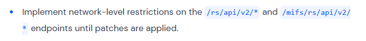  
  
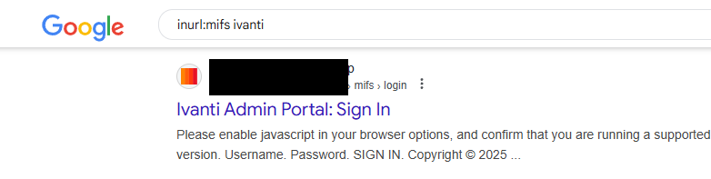  
  
如果我们点击该链接并点击“查看页面源代码”，我们就可以搜索该网站图标的链接。  
  
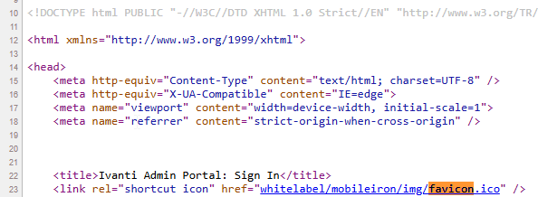  
  
接下来，我们点击 favicon.ico 链接，右键单击并选择“将图像另存为”。复制 favicon 图像后，我们前往 Reverge 并选择 Shodan 集成。  
  
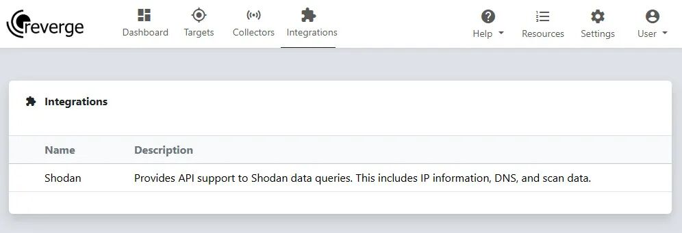  
  
在这里，我们给 Shodan 搜索命名，选择“哈希”类型，选择图标图像作为图标文件，然后单击“搜索”按钮。Shodan 查询结果表中将添加一个条目，我们可以单击该条目来查看结果。  
  
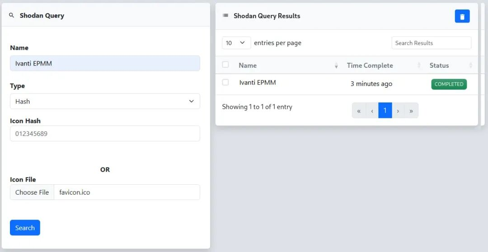  
  
结果表显示了 Shodan 找到的所有与指定图标哈希匹配的端点。然而，该列表包含不同的 Ivanti 产品、版本和可用性。要开始扫描并收集更多详细信息，我们需要将这些数据导入到反向传播目标中。  
  
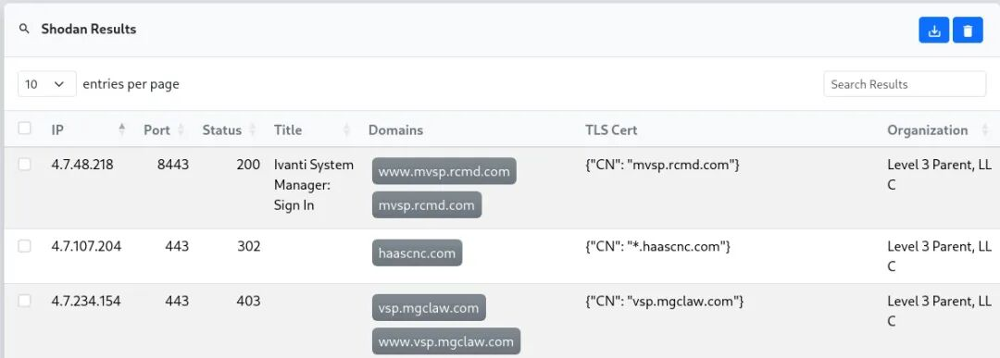  
  
要将所有结果导入到结果目标中，我们单击Shodan 查询对话框中的“创建新目标”按钮。  
  
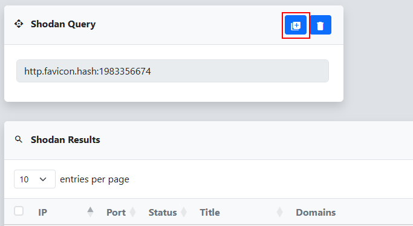  
  
根据结果数量，导入可能需要一分钟。完成后，您将进入在 reverge 中创建的新目标的“范围”选项卡。此目标将包含从 Shodan 扫描结果中提取的子网、域和 URL 的合并列表。  
  
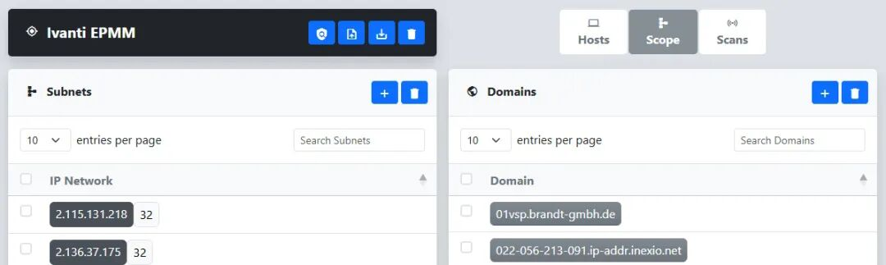  
  
由于我们知道这是一个 Web 应用程序，我们可以向下滚动到 URL 对话框，选择所有表条目，开始初始扫描。我们点击标题行中的复选框，选择页面中的所有条目，然后点击“选择所有页面的所有行”链接，选择表中的所有 URL。  
  
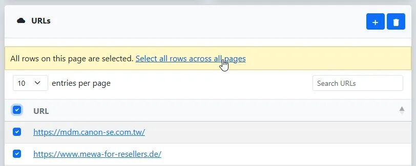  
  
选择端点后，我们点击目标标头中的按钮打开“网络扫描”对话框。然后，选择httpx 以从潜在易受攻击的端点收集更多信息。最后，点击“提交”开始扫描。  
  
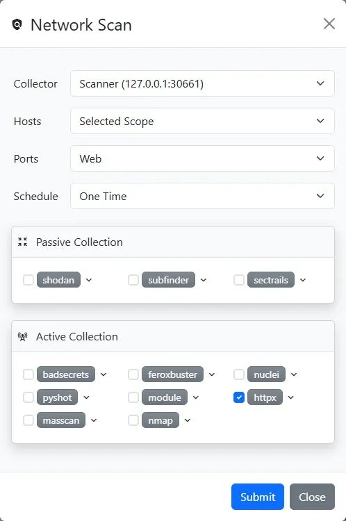  
  
这会在“扫描”选项卡下的“扫描计划”表中添加一个新条目。当所选收集器下次签入时，它将启动扫描，并在“最近扫描”对话框中显示一个新条目。  
  
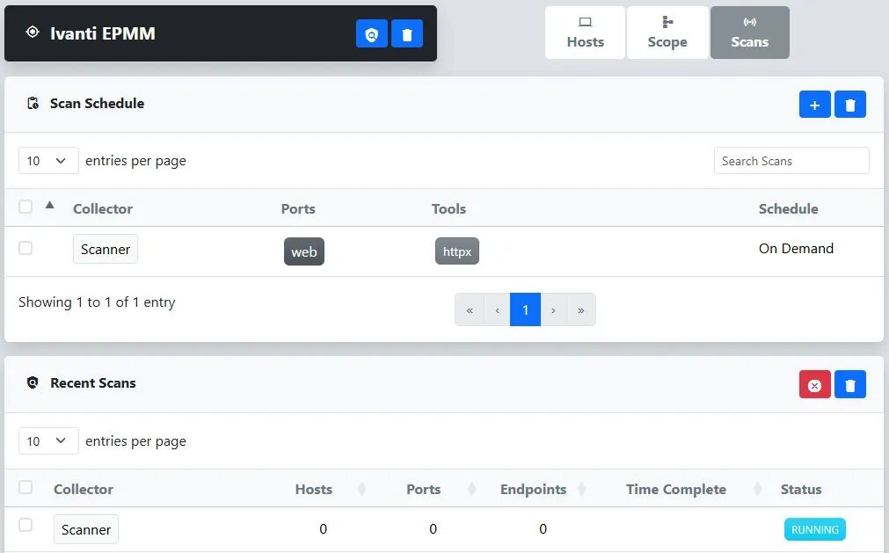  
  
单击“最近扫描”表中的条目将进入扫描详细信息页面，我们可以在其中跟踪正在运行的作业并查看结果。  
  
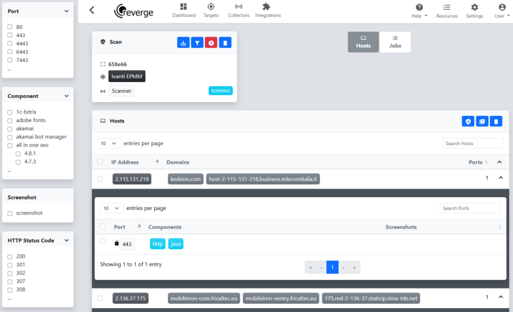  
  
目前，尚不清楚哪些端点实际运行着 Ivanti EPMM 软件。虽然我们可以截取所有端点的屏幕截图，但我们更倾向于先缩小列表范围。基于我们之前将 Ivanti 与 Java 联系起来的研究，我们首先点击了将 Java 列为组件的条目之一。在HTTP 端点表中，我们注意到网页标题提到了“Ivanti 用户门户”，这是一个很有希望的线索。为了确认，我们点击了链接打开页面，发现它确实是 Ivanti EPMM。  
  
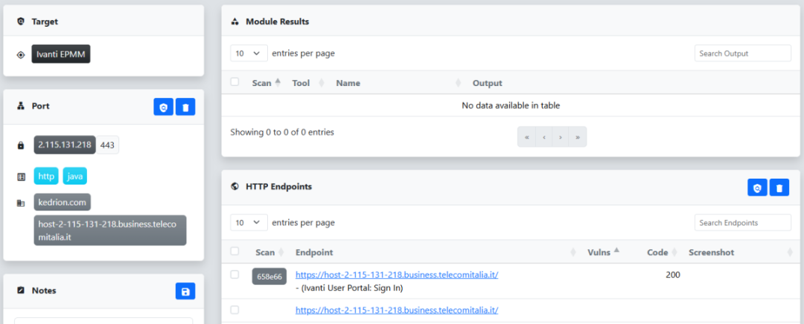  
  
考虑到这一点，我们在左侧的筛选器窗格中打开“组件”对话框，并应用筛选器以仅显示 Java 作为组件的端口。单击“筛选”按钮后，扫描结果会相应刷新。为了帮助验证我们是否瞄准了正确的系统，我们启动了 pyshot 扫描来捕获所选端点的屏幕截图。首先，我们点击“主机”表标题中的复选框，以选中当前页面上的所有条目。  
  
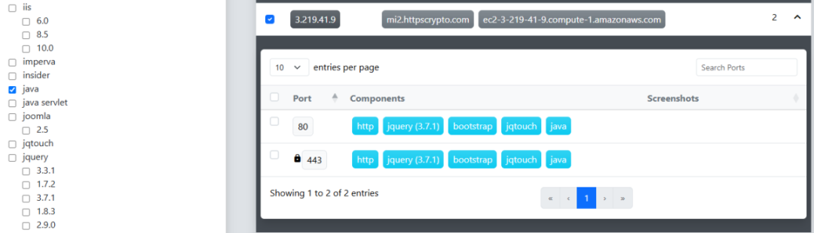  
  
然后，我们可以点击目标标题中的按钮打开“网络扫描”对话框。这次我们选择 pyshot 来捕获所有选定 Java 端点的屏幕截图，然后单击“提交”开始扫描。  
  
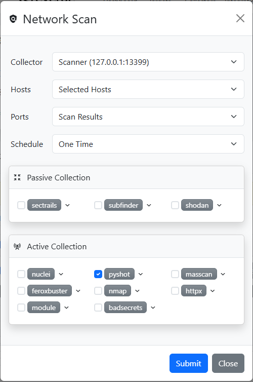  
  
一旦 pyshot 扫描完成，我们会查看扫描端口的屏幕截图，以快速验证它们是否确实在运行 Ivanti EPMM。  
  
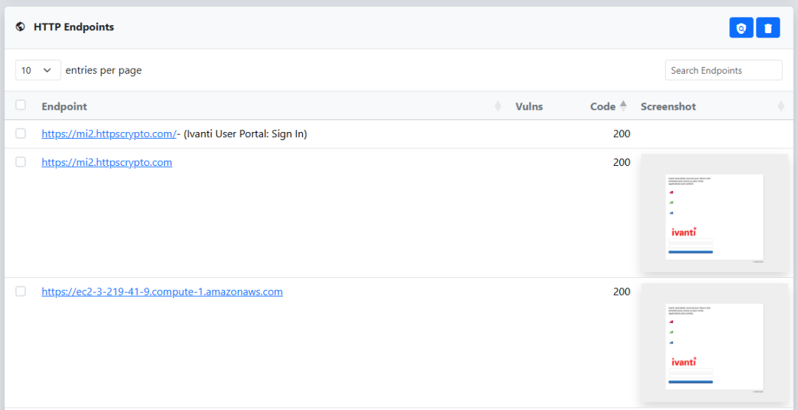  
  
在此阶段，我们对筛选出的端点集有足够的信心，可以对它们运行 Nuclei 来评估可利用性。虽然现有的 Nuclei 模板可用于此测试，但我们不太愿意直接使用它。首先，因为它会在目标上执行命令；其次，它会通过联系 Interactsh 服务器来生成出站流量。为了避免这些问题，我们创建了一个修改版的模板，它仅使用 WatchTowr 文章中演示的标准乘法技术来检查模板注入。  
  
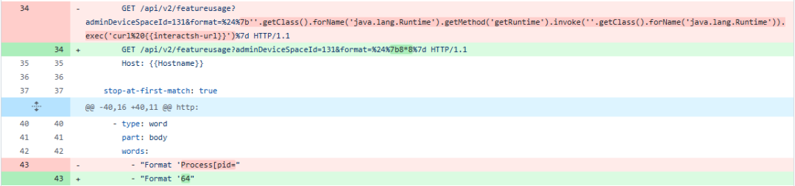  
  
为了将更新的版本部署到收集器，我们通过 reverge 顶部菜单中的“收集器”选项卡打开控制台。  
  
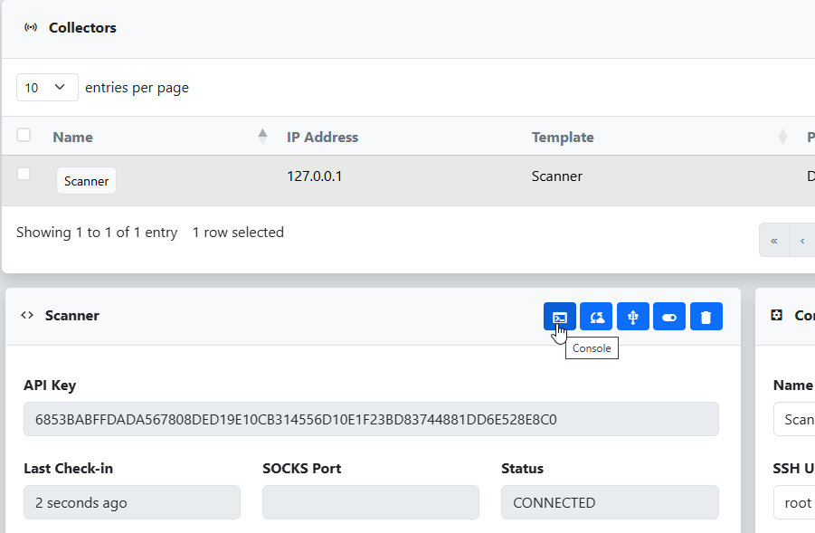  
  
从这里，我们只需克隆 nuclei-templates 存储库的分支并切换到我们的自定义分支，即可使更新后的模板可供扫描仪使用。  
  
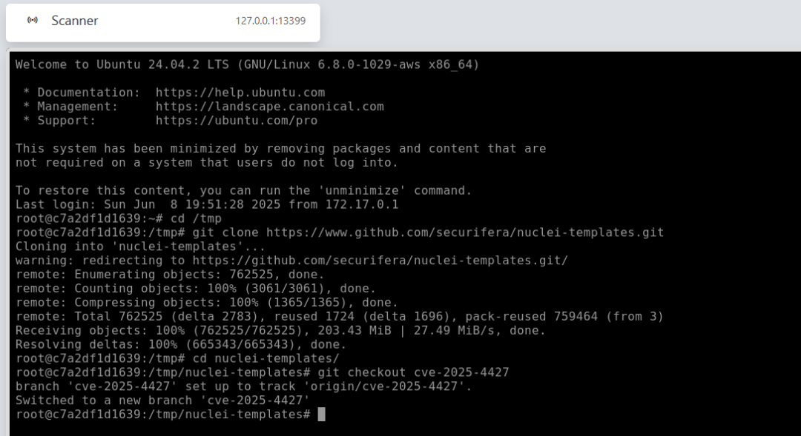  
  
现在，更新后的 Nuclei 模板已在收集器上可用，我们导航回目标，启动针对 Ivanti EPMM 端点的 Nuclei 扫描。在 Java 组件过滤器仍然应用的情况下，我们点击“主机”表标题中的复选框，选中当前页面上的所有条目，然后点击“选择所有页面的所有行”以包含所有已筛选的主机。接下来，我们点击按钮打开“扫描”对话框。这次，我们选择“Nuclei”，并使用旁边的下拉菜单修改参数，指定我们的自定义模板。最后，我们点击“提交”开始扫描。  
  
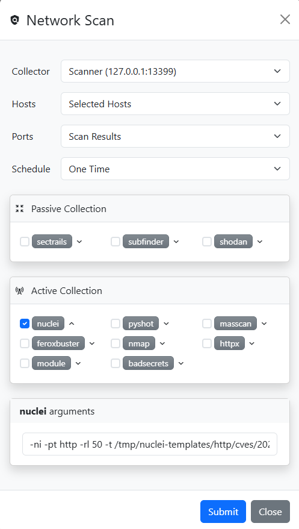  
  
扫描完成后，我们会应用新的 CVE 特定过滤器将结果缩小到仅与我们的发现相关的结果。  
  
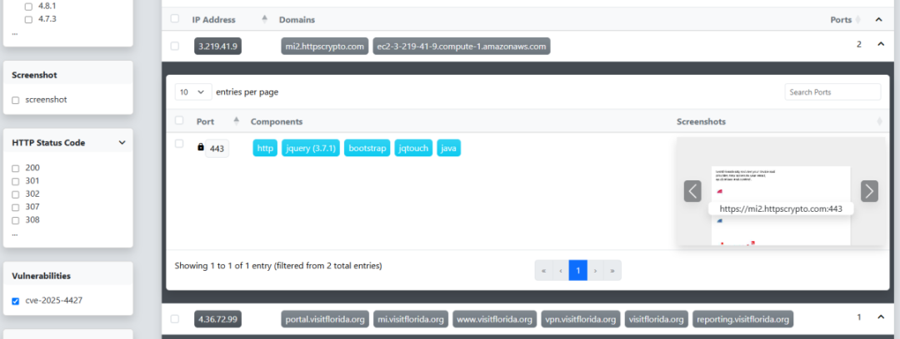  
  
通过深入研究其中一个结果，我们可以查看 Nuclei 扫描输出，以验证该漏洞是否可利用。响应结果清晰地反映了我们的模板注入有效载荷8*8的结果，证实了该漏洞可利用。  
  
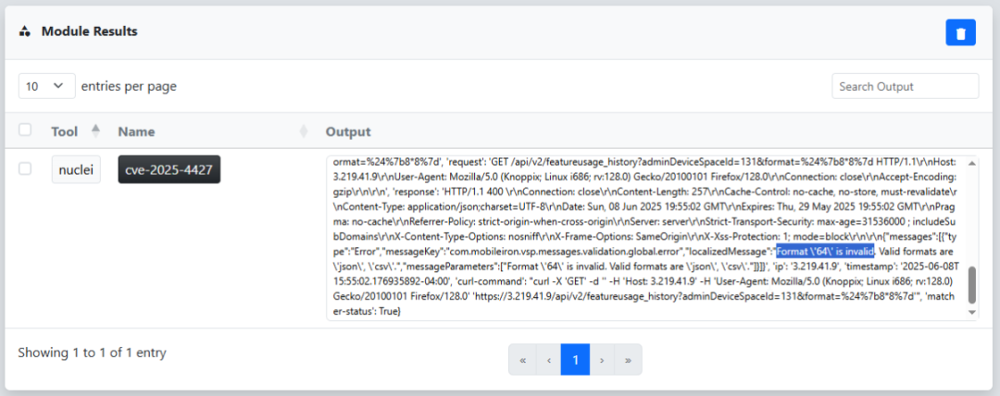  
  
这只是 reverge 如何帮助安全专业人员快速识别、评估并处理目标环境中的关键漏洞的一个例子。其直观的界面使其能够轻松搜索、排序和隔离高风险系统，而集成的工具则支持无缝验证和漏洞利用测试。在时间紧迫且精度至关重要的情况下，reverge 对于确定优先级并大规模执行有效评估至关重要。  
  
  
相关参考：  
- https://labs.watchtowr.com/expression-payloads-meet-mayhem-cve-2025-4427-and-cve-2025-4428/  
  
- https://www.wiz.io/blog/ivanti-epmm-rce-vulnerability-chain-cve-2025-4427-cve-2025-4428  
  
  
  
感谢您抽出  
  
  
  
.  
  
  
  
.  
  
  
  
来阅读本文  
  
  
  
**点它，分享点赞在看都在这里**  
  

---

> 来源：gelusus/wxvl（微信公众号漏洞文章自动归档，原始披露 URL 尚未确认，现有链接按来源追溯区分别标注）
