# 原创  CVE-2019-0808

> 编号角色校订（2026-10-04）：按归档技术正文区分主讨论编号与背景引用，更新 `primary_identifiers` / `referenced_identifiers` 及旧字段角色。旧编号原值、状态与正文保持原样，变更前字段逐字保存在 `previous_*`；后文旧的角色待核说明应按当前字段阅读。这里的角色判读不等于官方分配核验或漏洞复现。

<!-- vulwiki-editorial-rebuild:system-misc -->
## 条目范围与校订

- 本文对象：Windows win32k CVE-2019-0808
- 文献类型：技术文章（细分类待核）
- 版本、权限及部署边界：零页和窗口对象偏移/地址泄漏/内核执行均架构与版本相关，不能泛化Windows；无MSRC修复版本/KB，仅外部PoC仓库，归入操作系统本地提权而非Web
- 核验状态：仅重建文本校订；未执行文中代码、PoC 或扫描，未把截图或转载声明记为本站复现

### 具体结论与待核项

以下为原归档的逐项勘误与证据缺口；可由文本确定的问题已在下文订正，仍缺来源的事实保持待核。

1. 测试环境写win10 x86 SP1但后文依赖Win7零页映射，Windows10无SP1，须给正确系统/build及补丁
2. cbwndExtra放大值在0x4000000和0x40000000间不一致
3. 零页和窗口对象偏移/地址泄漏/内核执行均架构与版本相关，不能泛化Windows
4. 流程细致区分首次鼠标消息与NtUserMNDragOver时机，值得保留，但所有关键实现/补丁多为图片，末尾四处空代码块缺shellcode文本
5. Job对象清空和token继承叙述需核实实际Job安全限制，不能推广到所有Chrome沙箱
6. 无MSRC修复版本/KB，仅外部PoC仓库，归入操作系统本地提权而非Web

### 操作风险

原文技术操作的实际副作用未复现核验；按其请求/代码评估状态变更、凭据暴露和业务影响

技术请求、代码与实验方法按原文保留；其中的破坏性动作仅限授权、可恢复的隔离环境。缺失代码、参数或版本事实不猜补。

### 来源追溯

- 原始披露 URL 未确认；既有归档来源标签保留，不能替代原始公告

### 归档技术正文

原创 正在写  SecIN技术平台   2022-07-13 18:01  
  
**点击蓝字**  
  
  
  
  
**关注我们**  
  
  
  
**漏洞信息**  
  
  
  
**Part 1**  
  
  
  
  
  
CVE-2019-0808是发生在win32k中的一个空指针解引用漏洞，根据网上的blog介绍该漏洞在win32k!xxxMNMouseMove中产生。  
  
  
  
**测试环境及漏洞复现**  
  
  
  
**Part 2**  
  
  
  
  
**测试环境**  
  
POC：https://github.com/ze0r/cve-2019-0808-poc  
  
靶机：win10 x86 SP1  
##   
## 漏洞复现  
  
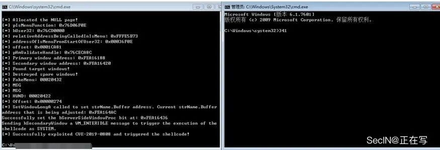  
  
  
**漏洞成因分析**  
  
  
  
**Part 3**  
  
  
  
  
**补丁分析**  
  
通过bindiff对xxxMNMouseMove函数进行对比，发现win32k!xxxMNFindWindowFromPoint函数新增对菜单窗口对象的校验。  
  
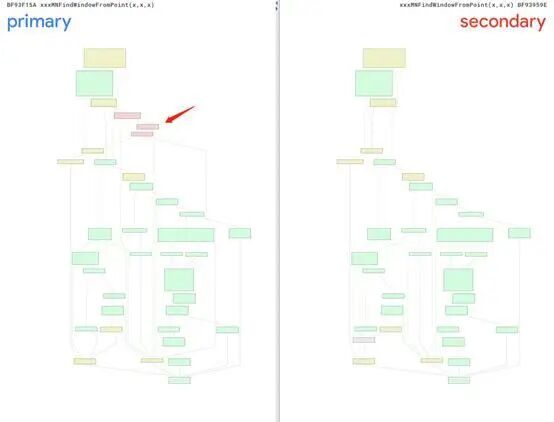  
  
对win32k!xxxMNFindWindowFromPoint进行详细分析时，可以看到xxxSendMessage成功获取到菜单窗口对象句柄后，通过HMValidateHandleNoSecure获取对应的菜单窗口对象，随后直接返回。  
  
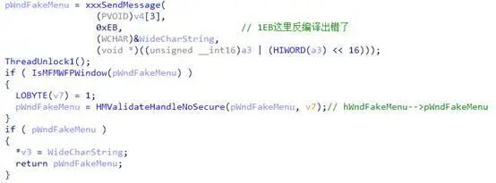  
  
而在补丁文件中，HMValidateHandleNoSecure成功获取菜单窗口对象后会进行一系列的安全检查后（保证tagWndMenu、tagWnd、tagPopuMenu、tagMenu这四个对象均存在且不为NULL）才会返回。此时也猜测到这个漏洞产生的原因大概率是空指针解引用。  
  
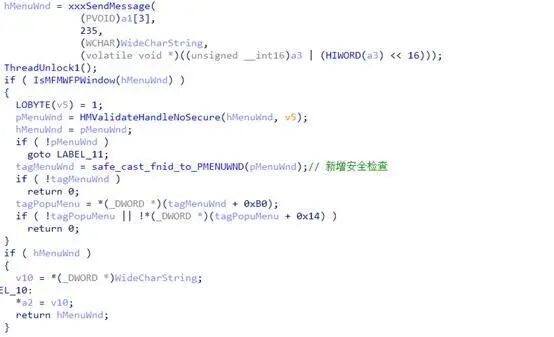  
##   
## 成因分析  
  
在补丁分析中，我们猜测这是一个空指针解引用的洞，这里结合POC去印证。下图为执行POC后windbg抓到的cash现场，从堆栈中可以看到蓝屏触发点在win32!MNGetItem函数。  
  
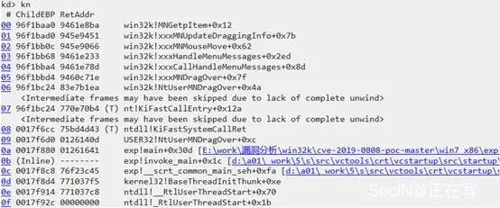  
  
此时进行精准定位后，就是对ecx+0x20的poi操作发生错误。  
  
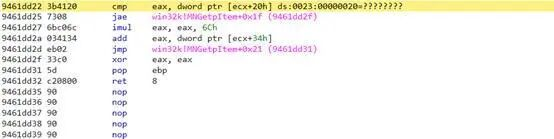  
  
进一步调试后，我们发现ecx的值居然也为空！！！  
  
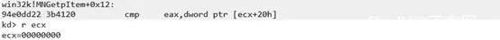  
  
结合IDA对ecx的值进行溯源, 发现其存储的值是ptagMenu。  
  
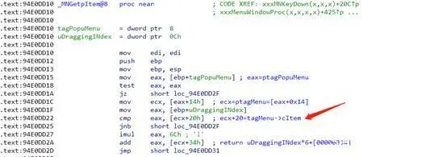  
  
而ptagMenu的值是由菜单弹出对象tagPopuMenu+0x14提供的。  
  
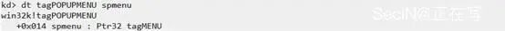  
  
最终，我们溯源完成后知道ptagPopuMenu的值正是由通过xxxMNFindWindowFromPoint函数中HMValidateHandleNoSecure返回的菜单窗口对象tagMenuWnd+0xb0得到的。  
  
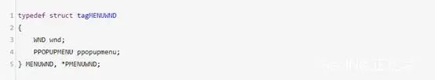  
  
至此，空指针解引用产生的原因已然明了。  
  
  
**漏洞利用分析**  
  
  
  
**Part 4**  
  
  
  
  
  
漏洞利用分析部分是结合EXP，对其漏洞构造、提权利用进行详细阐述,方式为Q-A模式。  
##   
## 问题一，如何构造空的菜单对象  
## （ptagPopupMenu->spmenu=NULL）  
  
  
在漏洞成因过程中知道，tagMenu是由tagPopuMenu+0x14提供的，而tagPopuMenu是由tagMenuWnd+0xb0提供的。  
  
  
tagMenuWnd是在xxxMNFindWindowFromPoint在xxxSendMessage获取的弹出菜单句柄后通过HMValidateHandleNoSecure得到的。  
  
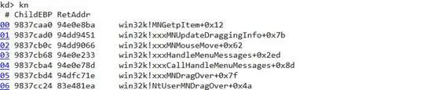  
  
从windbg的堆栈可以看到漏洞函数xxxMNUpdateDraggingInfo是由xxxMNMouseMove调用的。另外在window中win32k!xxxMNMouseMove是菜单窗口过程处理函数用来处理鼠标在菜单内移动的消息，如果此时鼠标由主弹出菜单移动到了子弹出菜单。那么在win32k!xxxMNFindWindowFromPoint内部就会通过xxxSendMessage对子弹出菜单发送消息来获取子弹出菜单的句柄，用来在后续代码中对子弹出菜单发送消息来完成绘制和鼠标选中等效果。  
  
  
因此在EXP对应会创建两个弹出菜单并将其设置成为非模拟态（原因是模拟态会导致其他其他菜单发生阻塞，无法正常接收消息）  
  
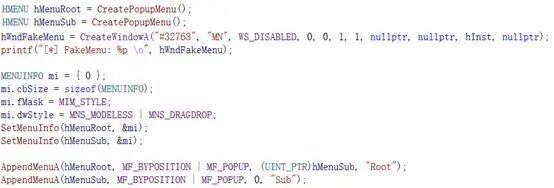  
  
与此同时去创建一个伪造菜单窗口  
  
（tagfakeMenuwnd->spmenu==NULL）  
  
xxxSendMessage发送消息后替换其返回值（正常应该返回hMenuSub）。  
  
  
Ps：CSDN中也有定义lpClassName为#32768时，创建的是菜单窗口。  
  
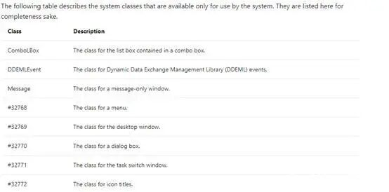  
  
弹出菜单创建后，还需要一个窗口作为媒介来传递消息。  
  
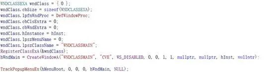  
  
TrackPopupMenuEx的作用是在桌面上显示弹出菜单。  
  
  
  
弹出菜单以及伪造窗口等都成功创建后，我们要想办法将xxxSendMessage的返回值替换为hWndFakeMenu，这里是通过SetWindowsHookEx和SetWinEventHook实现的。  
  
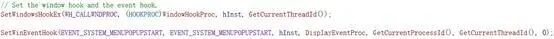  
  
  
下面就这两处hook的原因及作用进行详细介绍：  
  
  
1. **SetWinEventHook**  
  
这里是对EVENT_SYSTEM_MENUPOPUPSTART事件进行了hook，原因是在TrackPopupMenuEx的内部实现xxxTrackPopupMenuEx中对菜单窗口（tagMenuWnd）、  
  
弹出菜单对象（tagPopupMenu）以及tagMENUSTATE创建并初始化后，会通过xxxWindowEvent向用户层发送EVENT_SYSTEM_MENUPOPUPSTART事件消息通知应用层的事件回调。  
  
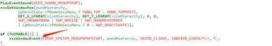  
  
当弹出菜单成功显示后，向用户层发送EVENT_SYSTEM_MENUPOPUPSTART事件。  
  
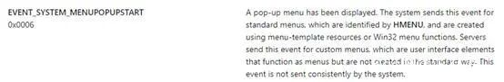  
  
注册Event Hook后，首先在主弹出菜单（hMenuRoot）绘制完成后第一次进入此事件回调  
  
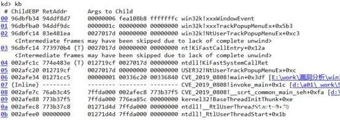  
  
并向其发送WM_LBUTTONDOWN消息即按下左键显示出子弹出菜单（hMenuSub）  
  
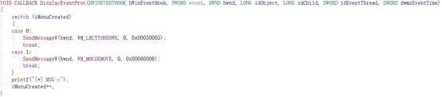  
  
子弹出菜单的显示是我们第二次进入事件回调并向hMenuSub发送WM_MOUSEMOVE消息从而形成一个从主弹出菜单到子弹出菜单的拖拽动作。  
  
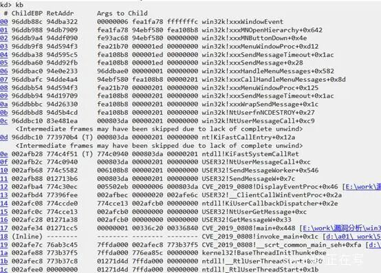  
  
拖拽动作成功实现后，EXP就会顺利进行到xxxMNMouseMove函数中。  
  
**2.SetWindowsHookEx**  
  
用户层成功捕捉到由xxxMNFindWindowFromPoint中的xxxSendMessage发来的  
  
WM_MN_FINDMENUWINDOWFROMPOINT  
  
消息后通过SetWindowLongPtr将子弹出菜单窗口对应的过程函数（DefWindowProc）更改为SubMenuProc。  
  
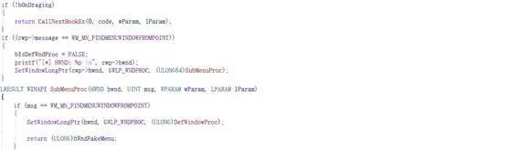  
  
SubMenuProc最终返回用户态构造的窗口对象句柄hWndFakeMenu作为xxxMNFindWindowFromPoint函数调用xxxSendMessage的返回值，最终得到一个  
  
ptagPopupMenu->spmenu=NULL的空指针。  
  
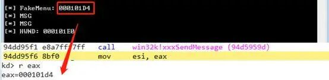  
  
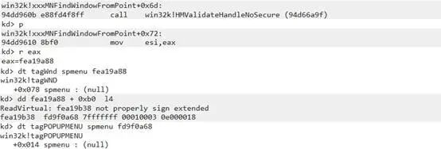  
  
到这为止，已经成功实现了  
  
xxxMNFindWindowFromPoint函数调用xxxSendMessage后返回的是伪造的窗口对象。但是，这并不代表着已经能够成功触发空指针解引用的操作。原因是第二次触发DisplayEventProc事件回调后，EXP向子弹出菜单窗口发送WM_MOUSEMOVE消息时就会在R0中调用一次xxxMNMouseMove。  
  
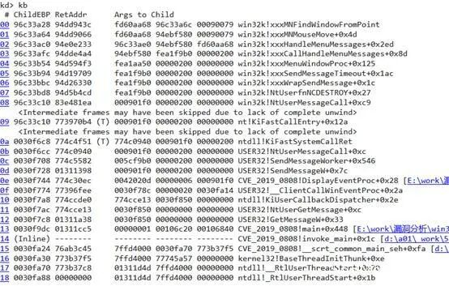  
  
此时，窗口句柄虽然可以被替换但在成功替换后，xxxMNMouseMove往下执行时并不会去调用xxxMNUpdateDraggingInfo。  
  
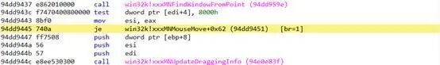  
  
通过IDA可以看到在xxxMNMouseMove中检查了tagMENUSTATE的fInDoDragDrop标志位是否置位，才会进入xxxMNUpdateDraggingInfo函数。  
  
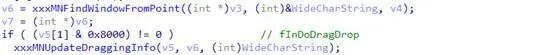  
  
DisplayEventProc事件回调中虽然发送WM_MOUSEMOVE  
  
能够成功进入xxxMNFindWindowFromPoint的逻辑中，但是由于fInDoDragDrop没有被置位，因此并不能触发空指针解引用。  
##   
## 问题二，如何在xxxMNFindWindowFromPoint函数成功获取伪造窗口句柄成功后exp能够顺利进入xxxMNUpdateDraggingInfo的执行逻辑，触发空指针解引用的操作  
  
  
对于这个问题，网上大神的blog给出了解决方案。我们可以通过手动调用NtUserMNDragOver函数来将fInDoDragDrop置位。  
  
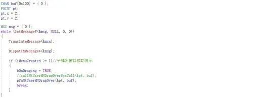  
  
最后还需控制窗口句柄替换时机，设置一个全局变量bOnDraging在事件回调发送xxxMNMouseMove消息时  
  
  
xxxMNFindWindowFromPoint的xxxSendMessage返回正确的窗口句柄。  
  
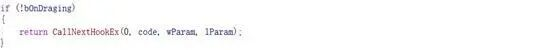  
  
在我们手动调用NtUserMNDragOver后进入xxxMNFindWindowFromPoint的xxxSendMessage时替换子菜单窗口的窗口过程，因此我们的窗口过程回调需要稍作修改，并在手动调用NtUserMNDragOver前将全局变量bOnDrag置1：  
  
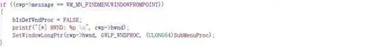  
  
至此，可以实现稳定的触发漏洞。  
##   
## 问题三，如何构造任意地址覆盖写漏洞  
  
  
在漏洞成因分析中我们知道，产生崩溃的点是在xxxMNUpdateDraggingInfo-> 
MNGetpItem中，具体是spmenu的空指针解引用。而对于此类漏洞Win7中用户态可以通过ntdll!NtAllocateVirtualMemory函数分配零页内存利用。分配零页内存的原理比较简单，不再详述：  
  
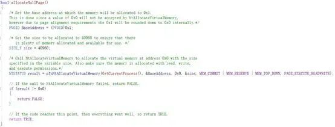  
  
零页内存分配成功后，MNGetpItem函数中的对于菜单对象的取值操作并不会触发异常，我们可以看到此时pMenu的地址为0x0, pMenu->cItems [0x00000020] 也是可控数据。  
  
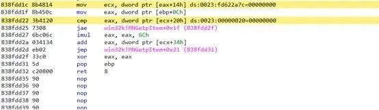  
  
接着在下方的if判断中uDraggingIndex < pMenu->cItems=0 不成立，导致返回pItem=0。我们需要控制程序流程走到红框分支，返回可控数据  
  
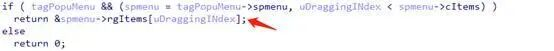  
  
因此需要在[00000020]设置一个合适的值（这里设置为0xffffffff）进入if分支。  
  
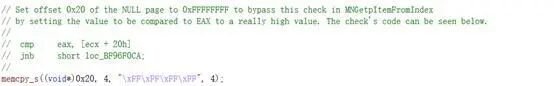  
  
返回值为uDraggingINdex*6C+[00000034]  
  
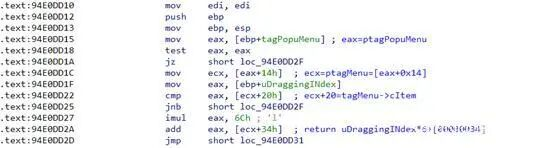  
  
uDraggingINdex的值可以通过wParam+0x10去获取  
  
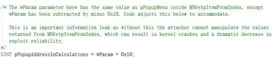  
  
[00000034]是我们可控的数据，因此MNGetpItem的返回值也是可控的。接着往下发现在xxxMNUpdateDraggingInfo-> xxxMNSetGapState存在位修改操作  
  
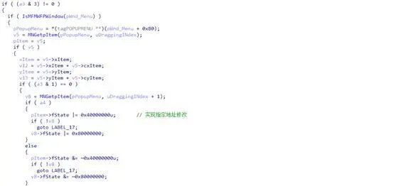  
  
想必看到这里，我们知道此逻辑能够实现任意地地址的有限修改。具体如下：  
  
addressToWrite = ret+0x4 = uDraggingINdex*6C+[00000034]+0x4  
  
  
上述表达式addressToWrite代表着准备改写的任意地址,因此我们仅需设置[00000034]处的地址即可。  
  
  
[00000034] = addressToWrite - uDraggingINdex*6C - 0x4  
  
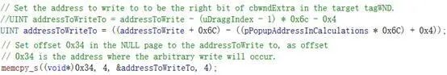  
  
至此，我们就实现了指定地址值的有限修改功能。  
##   
## 问题四,如何实现本地提权利用（LPE）  
  
  
通过分析exp知道，准备修改的地址是一个窗口对象tagWnd+0x90处的数据即cbwndExtra的值，cbwndExtra为此窗口扩展数据的大小，此处将其修改为0x4000000一个超长buf,目的是对其相邻的窗口进行越界写。  
  
  
  
1. **窗口对象喷射**  
  
首先申请100个窗口对象  
  
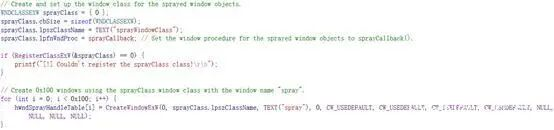  
  
通过pHmValidateHandle函数泄露窗口对象的地址并且以两个窗口的地址差小于0x3fd00为判断依据去寻找两个相邻的窗口对象。  
  
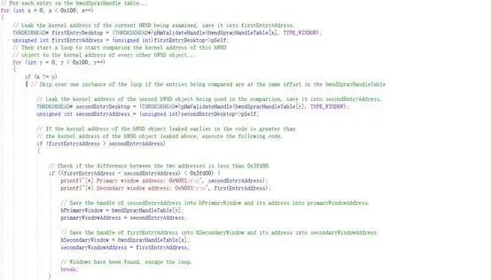  
  
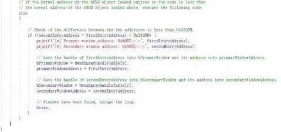  
  
成功找到后，将地址较高的窗口对象设置为primaryWindow，另外一个设置为  
  
secondaryWindow。  
  
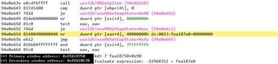  
  
最后通过漏洞能力将primaryWindow的cbwndExtra修改为0x40000000。  
  
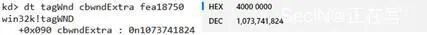  
  
****  
**2.越界写，执行shellcode**  
  
xxxMNMouseMove执行完  
  
xxxMNUpdateDraggingInfo并且成功将  
  
primaryWindow对象的cbwndExtra字段修改为0x4000000后，继续向下执行最后会向子菜单窗口发送0x1E5消息。  
  
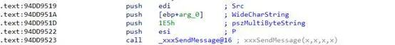  
  
EXP成功拦截到发来的1E5消息后，开始计算primaryWindow对象末尾到secondaryWindow对象的strName.buffer的差值（offset）  
  
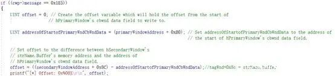  
  
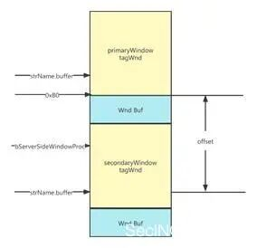  
  
SetWindowLongA将secondaryWindowAddress的strName.buffer的地址修改为secondaryWindow窗口对象的0x16的地址。  
  
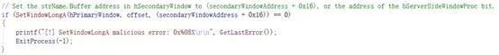  
  
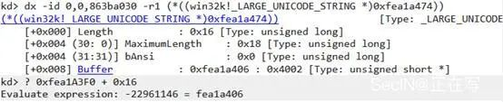  
  
接着用SetWindowTextA将bServerSideWindowProc置为1，从而可以在内核执行我们的窗口过程函数。  
  
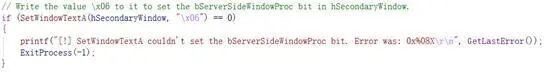  
  
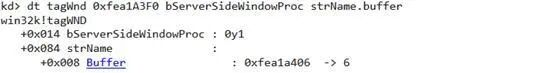  
  
修改0x16偏移的原因如下图所示：  
  
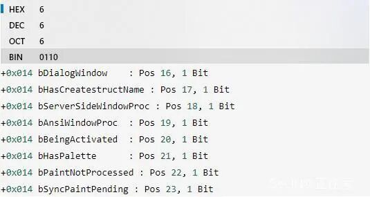  
  
最后向secondaryWindow窗口发送WM_ENTERIDLE消息执行shellcode(内核执行)。  
  
  
> 原文此处代码块为空，内容未归档；无法从空块证明或复现所述结果。
  
secondaryWindow成功接收到WM_ENTERIDLE消息后首先会通过cs寄存器的值去判断当前执行上下文是否在内核态，之后开始执行shellcode，替换token。  
> 原文此处代码块为空，内容未归档；无法从空块证明或复现所述结果。
> 原文此处代码块为空，内容未归档；无法从空块证明或复现所述结果。
  
Shellcode中除了必要的token替换，还清空了进程的Job对象指针，这是因为在Chrome的渲染进程中，即使shellcode替换了system进程的token，当前进程的token依然会继承自Job对象，并且Job不允许Chrome渲染进程产生新进程，因此需要先清空当前进程的Job对象指针。  
> 原文此处代码块为空，内容未归档；无法从空块证明或复现所述结果。
  
至此漏洞利用过程分析结束。  
  
  
**往期推荐**  
  
  
  
[原创 | XXE利用:结合Local DTD和Error-Based技巧bypass防火墙](http://mp.weixin.qq.com/s?__biz=MzI4Mzc0MTI0Mw==&mid=2247494466&idx=1&sn=d47f31dd9da206a4cc9b075c14c5d26e&chksm=eb84b616dcf33f0097d3e7c3bf0607f3d9c53f5375e906e593bc38cf038fc9e5620c81e0cd73&scene=21#wechat_redirect)  
  
  
[原创 |CTF流量包题目总结](http://mp.weixin.qq.com/s?__biz=MzI4Mzc0MTI0Mw==&mid=2247494365&idx=1&sn=2450c279ba54c14e19f9b42de6d9e190&chksm=eb84b789dcf33e9fe0045f49fe9c47f6f3ec3c3857e0a654c4111d423ea7caeca3442febcaa2&scene=21#wechat_redirect)  
  
  
[原创 | 记一次对VAuditDemo平台的代码审计（下）](http://mp.weixin.qq.com/s?__biz=MzI4Mzc0MTI0Mw==&mid=2247494299&idx=1&sn=4b87c97d0035b161158b09ab9a25eff7&chksm=eb84b7cfdcf33ed94b9204c1de938a2dbafb88b416690f972be4a206ff66c009870e87de1ce2&scene=21#wechat_redirect)  
  
  

---

> 来源：gelusus/wxvl（微信公众号漏洞文章自动归档，原始披露 URL 尚未确认，现有链接按来源追溯区分别标注）
