# 原创  OPC UA .NET Standard Stack可信应用认证绕过漏洞分析

<!-- vulwiki-editorial-rebuild:system-misc -->
## 条目范围与校订

- 本文对象：OPC UA .NET Standard Stack CVE-2022-29865
- 文献类型：技术文章（细分类待核）
- 版本、权限及部署边界：明确CA信任配置非默认自签、伪造应用证书，但不能把应用认证绕过等同所有用户身份授权绕过
- 核验状态：仅重建文本校订；未执行文中代码、PoC 或扫描，未把截图或转载声明记为本站复现

### 具体结论与待核项

以下为原归档的逐项勘误与证据缺口；可由文本确定的问题已在下文订正，仍缺来源的事实保持待核。

1. 主CVE未写元数据
2. 测试1.4.368.53却说1.4.368已修复，缺完整四段修复号形成内在矛盾
3. 明确CA信任配置非默认自签、伪造应用证书，但不能把应用认证绕过等同所有用户身份授权绕过
4. Issuer元信息比较与X509Chain不一致组合讲解细致，DN忽略大小写本身不能单独认漏洞
5. 伪证生成代码/字段和源码全图，缺可文本复现构造
6. 精确修复commit及官方安全PDF/规范章节可追溯，属于高价值分析应补文本而非删除

### 操作风险

原文技术操作的实际副作用未复现核验；按其请求/代码评估状态变更、凭据暴露和业务影响

技术请求、代码与实验方法按原文保留；其中的破坏性动作仅限授权、可恢复的隔离环境。缺失代码、参数或版本事实不猜补。

### 来源追溯

- 原始披露 URL 未确认；既有归档来源标签保留，不能替代原始公告

### 归档技术正文

原创 CISRC  网络安全应急技术国家工程中心   2022-10-25 15:26  
  
**漏洞概述**  
  
OPC UA .NET
Standard Stack是OPC基金会官方维护的OPC UA协议栈的参考实现。该参考实现采用.NET语言开发，包含了可移植的OPC UA协议栈和核心库（包含客户端、服务端、配置、复杂类型支持库等）。  
  
OPC UA协议是工业控制领域中的一种十分流行的通讯协议，启明星辰ADLab研究员在漏洞情报跟踪中发现该可信应用认证绕过漏洞（编号为CVE-2022-29865）后对该漏洞进行了深入分析和验证。  
  
**漏洞分析**  
  
该漏洞影响OPC UA
.NET Standard Stack的应用认证机制。根据协议规范，OPC UA客户端和OPC UA服务端是通过创建Secure Channel来进行应用层（Application Layer）的会话（Session）数据传输，如下图所示：  
  
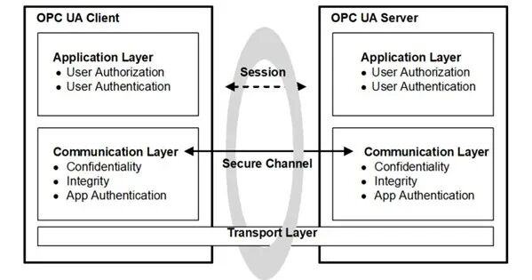  
  
图 1、OPC UA安全架构-客户端/服务端[1]  
  
在客户端和服务端创建Secure
Channel时，有一个应用认证机制（App Authentication），该机制是基于应用证书（Application
Instance Certificate）来实现的。具体参见OPC UA security
architecture 6.1.3  
【2】  
:  
  
An Application decides if another application is trusted
by checking whether the Application Instance Certificate for the
other application is trusted. Applications shall rely on lists
of Certificates provided by the Administrator to determine
trust. There are two separate lists: a list of
trusted Applications and a list of
trusted Certificate Authorities (CAs). If an application is not
directly trusted (i.e. its Certificate is not in the list of trusted
applications) then the application shall build a chain
of Certificates back to a trusted CA.  
  
OPC UA 标准规范详细规定了如何判定一个应用证书是否可信，如下图2所示：  
  
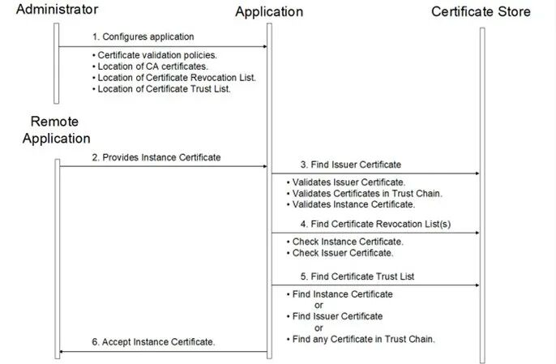  
  
图 2、确定应用证书是否可信  
  
漏洞CVE-2022-29865即是针对此证书校验机制的绕过。OPC UA .NET Standard Stack校验应用证书的关键代码位于协议栈源码文件CertificateValidator.cs的InternalValidate函数中，如下图的关键代码逻辑：  
  
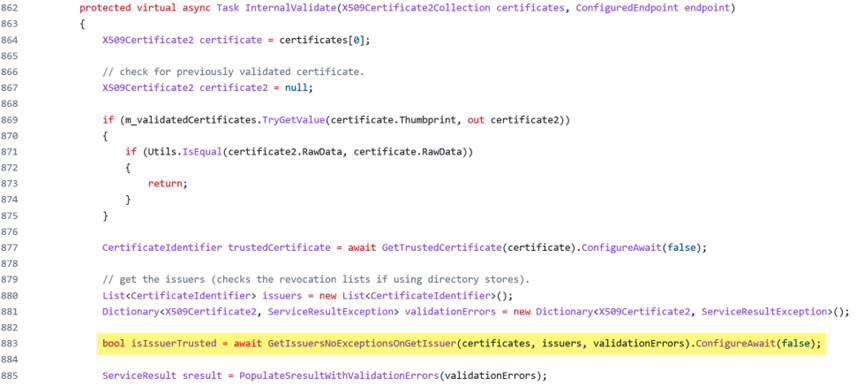  
  
在883行处，调用GetIssuersNoExceptionsOnGetIssuer获得待校验证书的颁发者，并检查其是否为信任的证书颁发者。在该函数中，首先通过GetIssuersNoException函数来获取客户端证书的Issuer并创建证书链，然后检查证书链中的Issuer是否在自己的信任列表中。在检查Issuer过程中，调用了Match函数。  
  
Match函数将待校验证书Issuer名称和潜在Issuer证书的Subject Name进行对比，此外还检查证书的X.509 Extension中Authority Key Identifier属性中的Serial
number和潜在Issuer证书的Serial number是否匹配或者key id是否匹配。如果issuer名匹配且serial number或key_id中有一项匹配，则GetIssuersNoExceptionsOnGetIssuer会返回true。  
  
Match函数调用CompareDistinguishedName进行匹配，如下所示：  
  
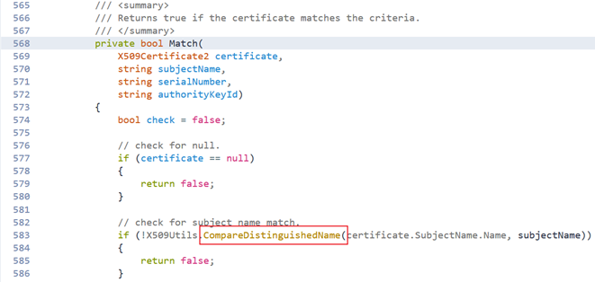  
  
图 3、Match函数调用CompareDistinguishedName对比Issuer Name  
  
但是，函数CompareDistinguishedName内部直接忽略了大小写，如下图所示。  
  
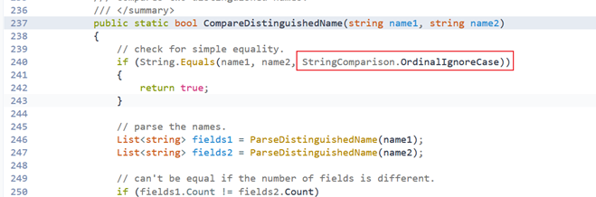  
  
图 4、CompareDistinguishedName忽略大小写对比Issuer Name  
  
显然，在这个证书匹配过程中，没有对证书的签名进行校验，而仅仅根据证书的元信息进行匹配，而且在Issuer时还忽略大小写。因此，可伪造证书元信息来通过该函数校验。  
  
在909行处，InternalValidate函数使用X509Chain进行待校验证书的证书链创建。如下图所示，该过程对证书的签名等信息进行校验，在创建后通过CheckChainStatus函数来检查证书链是否存在问题，结果在result中保存。如果证书链检查没有问题，则result变量为空。至此，证书校验的大部分工作已经完成，后续还会对证书的密钥用途、长度等进行校验。  
  
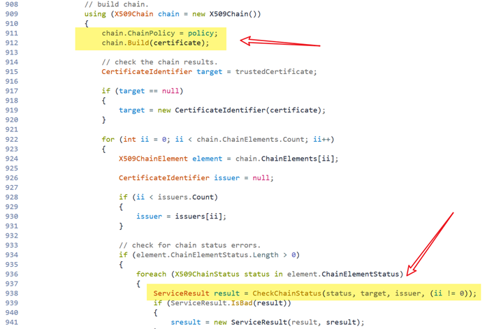  
  
在CheckChainStatus函数中，将根据证书链元素的不同状态返回不同的结果。但是，对于UnTrustedRoot状态，只需要证书的签名合法，如下图所示。  
  
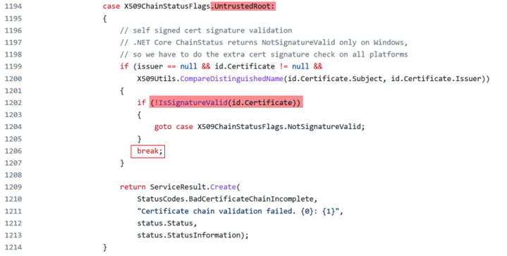  
  
因此，可通过伪造证书来使验证中：GetIssuersNoExceptionsOnGetIssuer函数返回true，CheckChainStatus函数因UntrustedRoot不产生错误，从而使InternalValidate函数因正常返回而通过证书校验。  
  
**漏洞复现**  
## 复现环境  
- OPC UA Vulnerable Server  
  
OPC UA .NET Standard Reference Server（Version:
UA-.NETStandard-1.4.368.53）  
- OPC UA Client  
  
Unified
Automation UA Expert  
## 复现过程  
  
首先，编译OPC UA
.NET Standard Reference Server。修改配置文件Quickstarts.Reference Server.Config.xml，将Server应用证书从默认的自签名证书修改为由CA颁发的证书。然后，将CA证书添加到Server的信任证书列表中。最后，启动该OPC UA Server。  
  
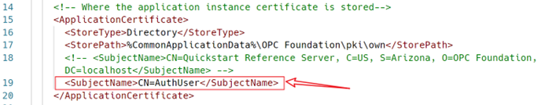  
  
图 5、配置OPC UA Server证书  
  
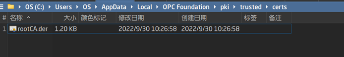  
  
图 6、配置OPC UA Server可信证书存储  
  
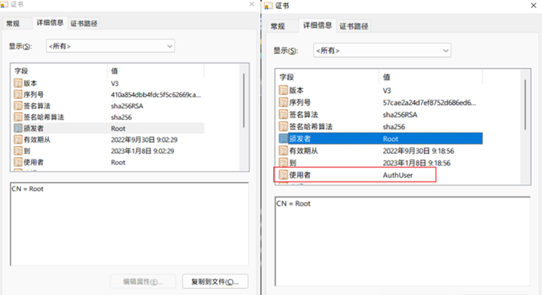  
  
图 7、OPC UA Server应用证书和CA证书  
  
根据OPC UA
Server的应用证书信息（可在OPC UA客户端认证的时候获得），使用python cryptography库生成伪造证书，并将其设置为uaexpert应用证书，如下所示：  
  
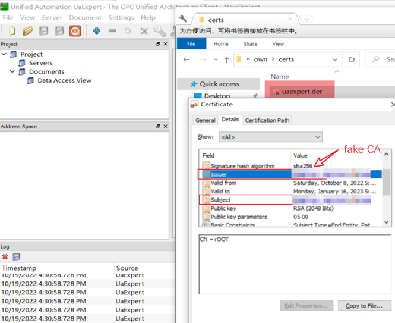  
  
图 8、OPC Client UaExpert使用的伪造应用证书  
  
在UaExpert中配置OPC UA Server信息，使用上述伪造的应用证书登录成功。  
  
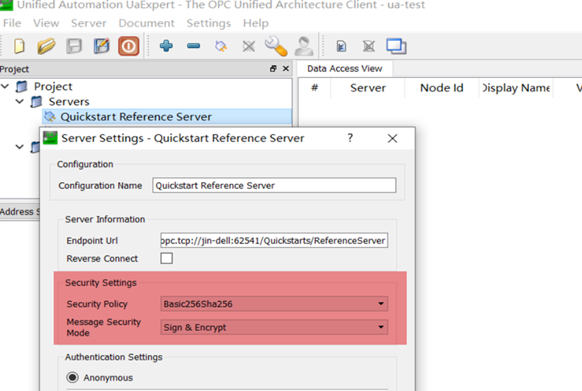  
  
图 9、UaExpert配置Server信息  
  
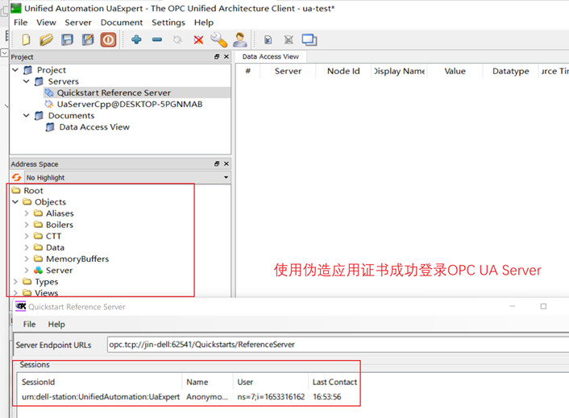  
  
图 10、UaExpert使用伪造证书成功登录OPC UA Reference Server  
  
**漏洞修复**  
  
根据OPC UA的官方漏洞公告  
【3】  
，该漏洞在OPC UA .NET Standard 1.4.368版本中修复。实际在Commit
51549f5ed846c8ac060add509c76ff4c0470f24d中该问题就已被修复。  
  
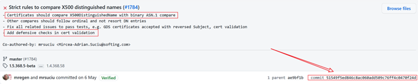  
  
主要修复的方式如下：  
  
1.证书信息对比采用了二进制方式对比。  
  
2.增加了对证书链构造的校验，确保证书验证中构造的两个证书链是一致的。  
# 参考：  
  
1.https://reference.opcfoundation.org/v104/Core/docs/Part2/4.5.1/  
  
2.https://reference.opcfoundation.org/v104/Core/docs/Part4/6.1.3/  
  
3.https://files.opcfoundation.org/SecurityBulletins/OPC%20Foundation%20Security%20Bulletin%20CVE-2022-29865.pdf  
  
  
  
转载请注明来源  
：网络安全应急技术国家工程研究中心  
  
“投稿联系方式：孙中豪 010-82992251   sunzhonghao@cert.org.cn”  
  
  
  

---

> 来源：gelusus/wxvl（微信公众号漏洞文章自动归档，原始披露 URL 尚未确认，现有链接按来源追溯区分别标注）
