# 命令注入漏洞 CVE-2022-26258 复现

> 编号角色校订（2026-10-04）：按归档技术正文区分主讨论编号与背景引用，更新 `primary_identifiers` / `referenced_identifiers` 及旧字段角色。旧编号原值、状态与正文保持原样，变更前字段逐字保存在 `previous_*`；后文旧的角色待核说明应按当前字段阅读。这里的角色判读不等于官方分配核验或漏洞复现。

<!-- vulwiki-editorial-rebuild:system-misc -->
## 条目范围与校订

- 本文对象：D-Link DIR-820L CVE-2022-26258
- 文献类型：技术文章（细分类待核）
- 版本、权限及部署边界：默认空密码仍点击登录，是否设备配置后需要会话/权限未明确，不能视通用无认证；版本描述2022/2023改变原因是作者猜测；补丁过滤表仅图无安全版本/公告
- 核验状态：仅重建文本校订；未执行文中代码、PoC 或扫描，未把截图或转载声明记为本站复现

### 具体结论与待核项

以下为原归档的逐项勘误与证据缺口；可由文本确定的问题已在下文订正，仍缺来源的事实保持待核。

1. 测试1.05B03/Ubuntu18.04和固件直链明确
2. 开头lan.jsp/get set cpp与实际lan.asp/get_set.ccp拼写不一
3. 默认空密码仍点击登录，是否设备配置后需要会话/权限未明确，不能视通用无认证
4. hasInjectionString黑名单遗漏LF数据流合理但全部逆向源码仅图，缺完整请求/返回
5. ping.ccp新增端点仅作者发现，同根因是否纳入原CVE需核，不擅新分或合并编号
6. 版本描述2022/2023改变原因是作者猜测
7. 补丁过滤表仅图无安全版本/公告
8. 启动全接口无认证telnet是写状态/暴露shell，不应检测生产

### 操作风险

原文技术操作的实际副作用未复现核验；按其请求/代码评估状态变更、凭据暴露和业务影响

技术请求、代码与实验方法按原文保留；其中的破坏性动作仅限授权、可恢复的隔离环境。缺失代码、参数或版本事实不猜补。

### 来源追溯

- 原文标注出处：<https://mp.weixin.qq.com/s/Hc2DHKBlKhSwEoFaquKgzw>

### 归档技术正文

<meta name="referrer" content="no-referrer"/>

> 本文由 [简悦 SimpRead](http://ksria.com/simpread/) 转码， 原文地址 [mp.weixin.qq.com](https://mp.weixin.qq.com/s/Hc2DHKBlKhSwEoFaquKgzw)

```
一


漏洞信息

```

◆CVE 编号：CVE-2022-26258

◆漏洞描述：D-Link DIR-820L 1.05B03 was discovered to contain remote command execution (RCE) vulnerability via HTTP POST to get set ccp.

◆设备型号：D-Link DIR-820L

◆固件版本：1.05B03

◆厂商官网：http://www.dlink.com.cn/

◆固件地址：http://www.dlinktw.com.tw/techsupport/download.ashx?file=2663

◆测试环境：Ubuntu 18.04

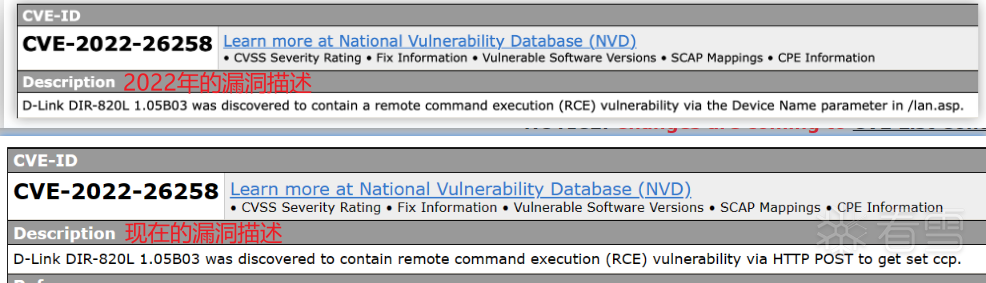

根据漏洞描述可得到几个关键词：远程命令执行、/lan.jsp 页面、Device Name 参数、HTTP、POST、get set cpp。

```
二


固件分析

```

#### 2.1 固件解包

使用 binwalk 对固件解包，获取文件系统：

```
binwalk -Me DIR820LA1_FW105B03.bin


```

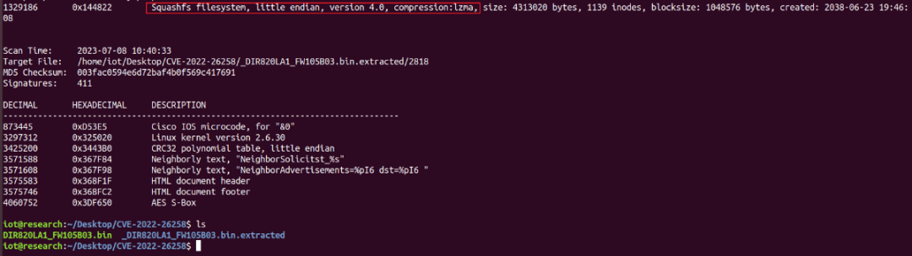

#### 2.2 关键信息查找

根据漏洞描述，查看 www/lan.asp 文件，并在该文件中查找 DeviceName 和 get set ccp 相关内容：

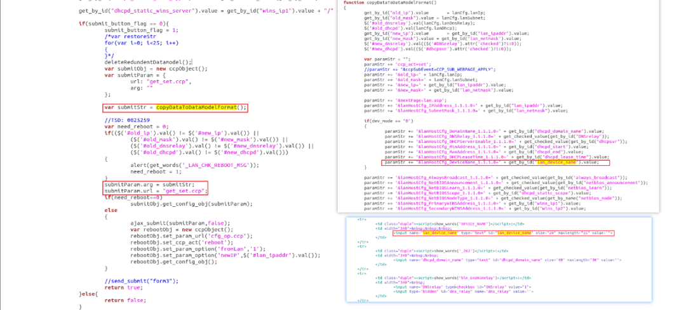

通过 lan.asp 源码可知在 DEVICE_NAME 处填入的参数会被拼接到 paramStr 中，然后函数 copyDataToDataModelFormat 将 paramStr 返回为提交参数传给 submitParam.arg，传递的 URL 为 get_set.ccp。这里应该是一个 POST 请求提交数据。在文件系统中查找一下关键词 get set ccp：

```
grep -r "get_set"


```

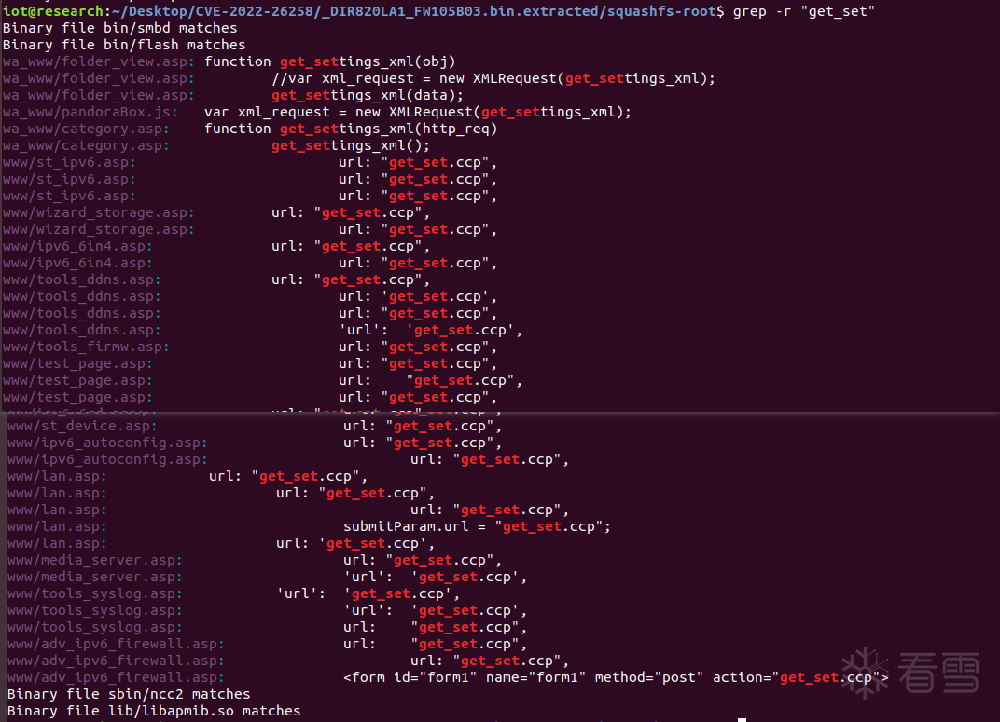

在文件系统中查找关键词并没有发现名为 “get_set.ccp” 的文件，没有 “get_set.ccp” 文件，这个 URL 应该是交给后端处理，处理好之后将结果返回给用户。但在许多 asp 文件中都匹配到了 get_set.ccp 这个 URL 且有四个二进制文件中也匹配到了这个 URL：

```
Binary file ./squashfs-root/bin/smbd matches
Binary file ./squashfs-root/bin/flash matches
Binary file sbin/ncc2 matches
Binary file lib/libapmib.so matches


```

◆bin/smbd 程序是 Samba 服务器的一部分，它允许路由器用户与 Windows 客户端共享文件和打印机。Samba 服务器是一个开源软件，它实现了 SMB/CIFS 协议，这是 Windows 操作系统使用的文件和打印机共享协议。bin/smbd 程序是 Samba 服务器的核心组件之一，它提供了文件和打印机共享的功能。

◆bin/flash 程序允许用户升级路由器固件，以获取最新的功能和安全补丁。它还可以用于还原路由器的出厂设置，以便在出现问题时恢复路由器的正常运行。

◆sbin/ncc2 程序主要用于配置路由器的网络设置和管理路由器的各种功能。通过 ncc2 程序，用户可以轻松地设置无线网络、防火墙、端口转发等功能，使路由器的使用更加便捷和高效。

◆lib/libapmib.so 是 D-Link 路由器系统中的一个库文件，它包含了许多重要的 API 和函数，用于实现路由器的各种功能。用户可以通过调用这些 API 和函数来访问和配置路由器的网络设置、无线网络、防火墙、端口转发等功能。

#### 2.3 FirmAE 固件模拟

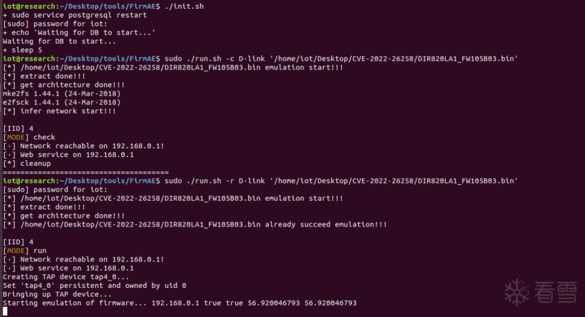

模拟成功后访问 http://192.168.0.1, 默认无密码，直接点击 Log In 即可。

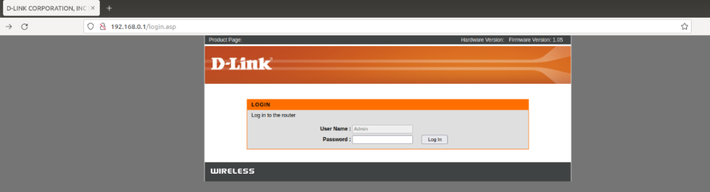

访问 http://192.168.0.1/lan.asp：

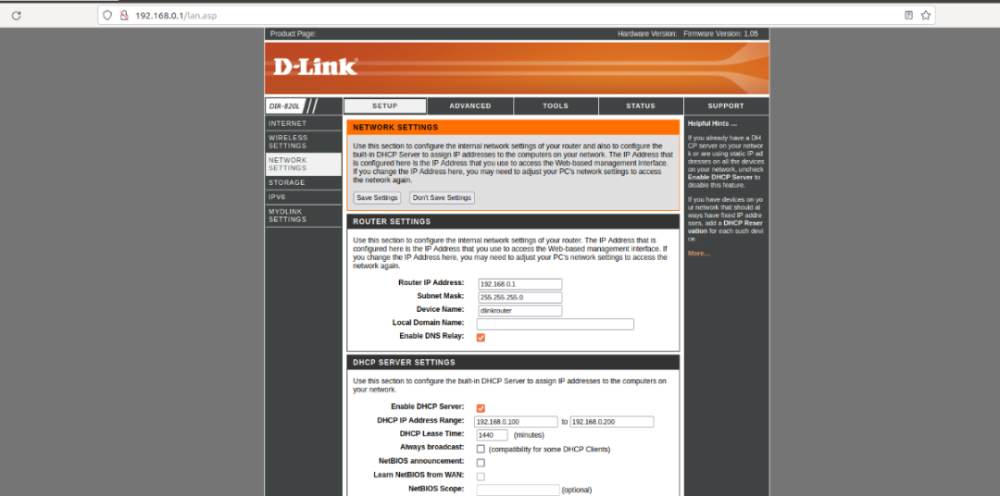

点击 Save Settings 并通过 burpsuite 抓包查看：

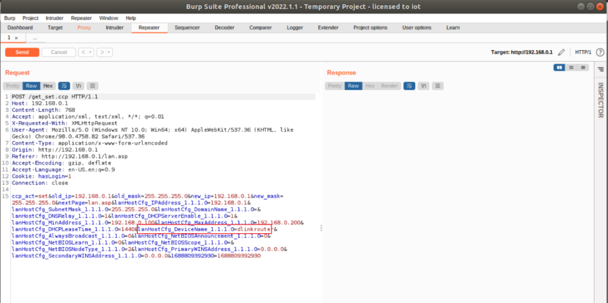

DeviceName 和页面内的其他数据被拼接到一起并 POST 给 / get_set.ccp。根据上述信息逆向分析一下和网络相关且含 get_set 字符串的 ncc2 程序。

#### 2.4 IDA 逆向分析

查找一下关键字 “Device Name”。通过对比、分析最终定位到如下代码：

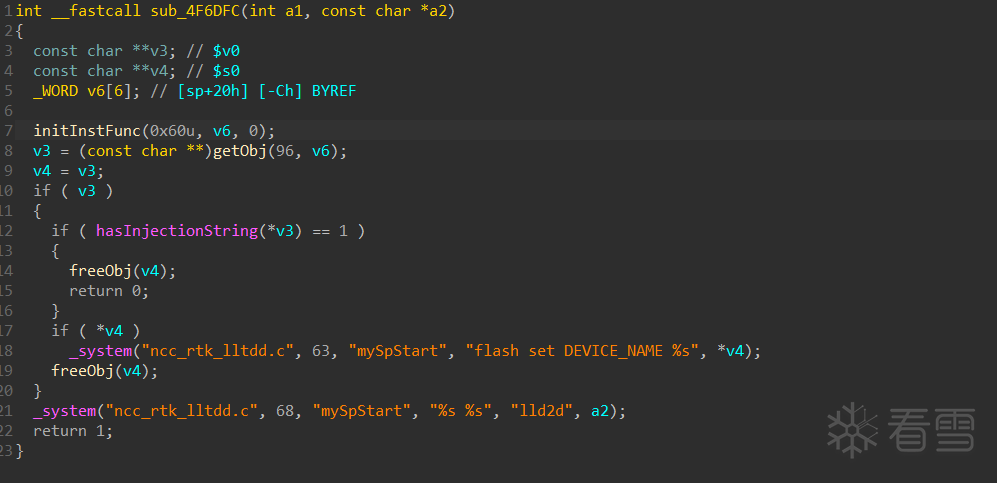

通过分析可知这段代码的功能是：获取 Obj 并判断 Obj 是否为含注入的字符串（hasInjectionString），如果有注入则释放 Obj 并退出，若没有注入则将 Obj 传给_system 函数处理。hasInjectionString 和_system 函数都是导入函数。在文件系统中搜索一这两个函数字符串，找到了一个库文件：lib/libleopard.so。

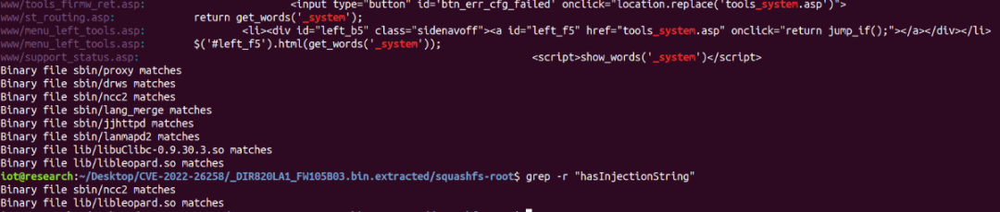

用 IDA 逆向分析 libleopard.so 文件，并直接去导出函数中定位 hasInjectionString 和_system：

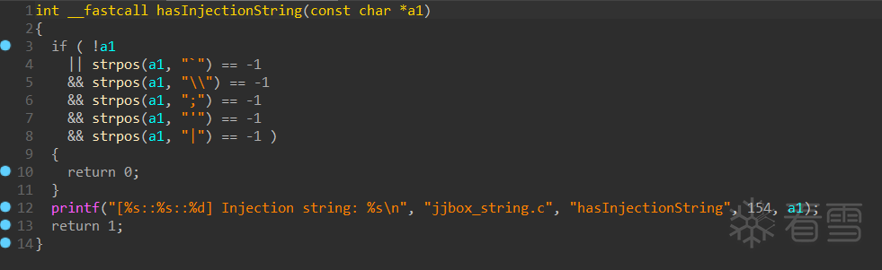

通过伪代码可知过滤的字符仅 5 种，过滤不完全，因此我们可以使用其他字符比如换行 (%0a) 来注入执行命令。

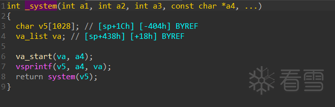

_system 函数的功能是拼接字符串并执行。

```
三


漏洞复现

```

#### 3.1 根据 CVE 信息的复现

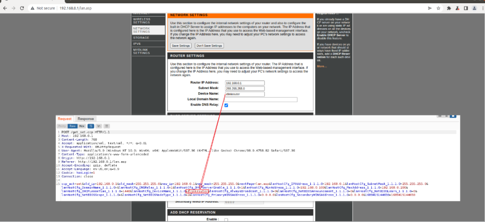

固件模拟并抓包修改 lanHostCfg_DeviceName_1.1.1.0 = 后的数据为：

```
lanHostCfg_DeviceName_1.1.1.0=%0atelnetd -l /bin/sh -p 7080 -b 0.0.0.0%0a


```

含义为：启动一个 telnet 服务器并在端口 7080 上监听所有网络接口。该命令可以让远程用户通过 telnet 协议登录到该服务器并在 / bin/sh shell 中执行命令。以下是每个选项的解释：

◆`telnetd`: 启动 telnet 服务器的程序

◆`-l /bin/sh`: 指定登录后执行的 shell 程序为 / bin/sh

◆`-p 7080`: telnet 服务器监听的端口号为 7080

◆`-b 0.0.0.0`: telnet 服务器监听所有网络接口（IP 地址为 0.0.0.0）

◆%0a 为换行的 ASCII 码。

使用 nc 连接 7080 端口获得 shell：

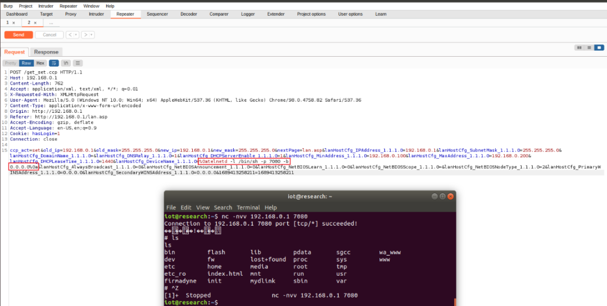

上述是根据 CVE 漏洞披露的信息所做出的复现。实际在复现过程中发现不仅仅是通过 HTTP POST to get set ccp 存在远程命令执行。

#### 3.2 发现新的 RCE 点

由于是因为字符串过滤不完全导致的命令注入，可以猜想所有 HTTP POST 且有可能执行的地方都可能存在这个漏洞。在路由后台中发现有一个 ping 测试页面：

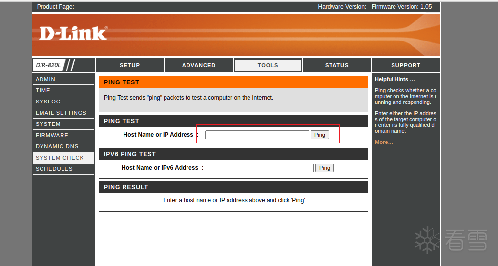

通过抓包改包测试，发现同样存在 RCE 漏洞，且该漏洞并非存在于 CVE 所描述的 get set ccp 而是 ping ccp。

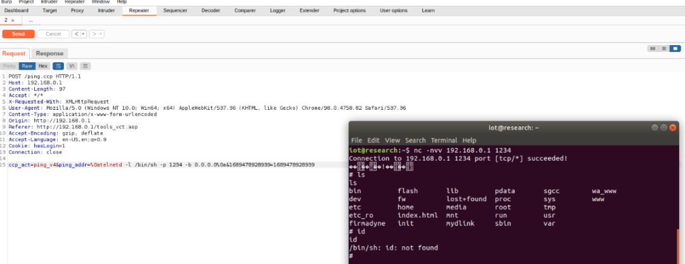

在进一步测试中发现直接在 ping 处输入`%0atelnetd -l /bin/sh -p 7080 -b 0.0.0.0%0a`即可获得 shell：

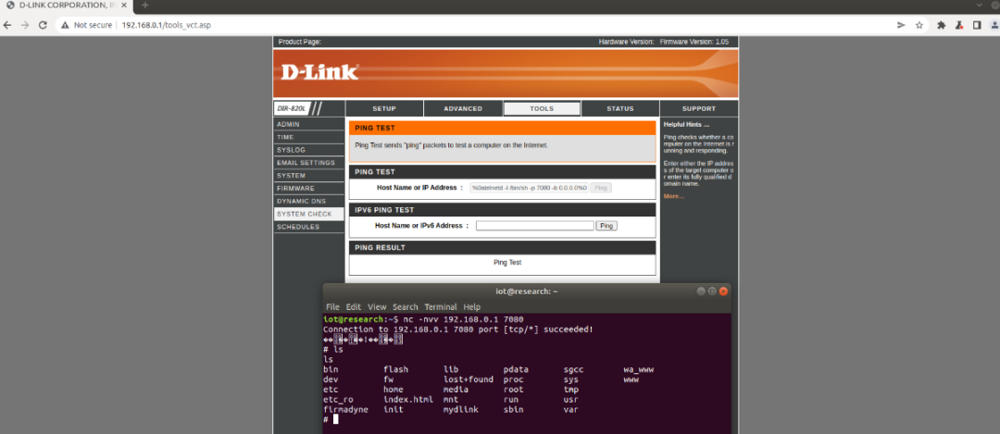

```
四


复现总结

```

在复现这个漏洞中发现 2022 年刚披露的信息和 2023 年有所不同，2022 年的描述更具体，2023 的变得模糊一些。刚开始以为是为了保护厂商，避免提示太明显容易被利用。后来在复现过程中发现应该是后续被验证漏洞点不仅仅是 / lan.jsp 页面、Device Name 参数，其他参数也存在同样的漏洞，所以 2023 的描述范围扩大为 HTTP POST 的 get set ccp。如果是这样那么现在发现不仅是 get set ccp 中存在漏洞点，ping ccp 中同样存在。顺便提一下，去厂商的网站查了一下漏洞补丁，在补丁中 hasInjectionString 的过滤内容修改为:

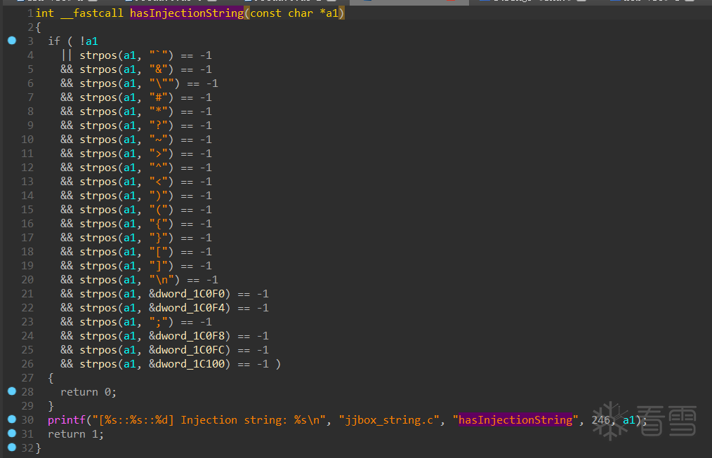

### 参考文章

◆D-Link CVE-2022-26258 命令注入 - IOTsec-Zone 物联网安全社区

（https://www.iotsec-zone.com/article?id=123）  

◆CVE-2022-26258 命令执行漏洞 | Hexo (unrav31.github.io)

（https://unrav31.github.io/2022/04/25/cve-2022-26258-ming-ling-zhi-xing-lou-dong/#!）

◆D-Link CVE-2022-26258 命令注入 - 庄周恋蝶蝶恋花 - 博客园 (cnblogs.com)

（https://www.cnblogs.com/zhuangzhouQAQ/p/16219690.html）


  

**看雪 ID：伯爵的信仰**

https://bbs.kanxue.com/user-home-882513.htm

* 本文为看雪论坛优秀文章，由 伯爵的信仰 原创，转载请注明来自看雪社区

[](http://mp.weixin.qq.com/s?__biz=MjM5NTc2MDYxMw==&mid=2458499288&idx=1&sn=b2b9cd6ff7388a8658d254e13c72f9ad&chksm=b18e885286f9014436a590f2531fda167be67e1e227ea395812968e828932bd44eade34b0dbf&scene=21#wechat_redirect)

**#** **往期推荐**

1、[在 Windows 下搭建 LLVM 使用环境](http://mp.weixin.qq.com/s?__biz=MjM5NTc2MDYxMw==&mid=2458500602&idx=1&sn=4bcc2af3c62e79403737ce6eb197effc&chksm=b18e8d7086f9046631a74245c89d5029c542976f21a98982b34dd59c0bda4624d49d1d0d246b&scene=21#wechat_redirect)

2、[深入学习 smali 语法](http://mp.weixin.qq.com/s?__biz=MjM5NTc2MDYxMw==&mid=2458500599&idx=1&sn=8afbdf12634cbf147b7ca67986002161&chksm=b18e8d7d86f9046b55ff3f6868bd6e1133092b7b4ec7a0d5e115e1ad0a4bd0cb5004a6bb06d1&scene=21#wechat_redirect)

3、[安卓加固脱壳分享](http://mp.weixin.qq.com/s?__biz=MjM5NTc2MDYxMw==&mid=2458500598&idx=1&sn=d783cb03dc6a3c1a9f9465c5053bbbee&chksm=b18e8d7c86f9046a67659f598242acb74c822aaf04529433c5ec2ccff14adeafa4f45abc2b33&scene=21#wechat_redirect)

4、[Flutter 逆向初探](http://mp.weixin.qq.com/s?__biz=MjM5NTc2MDYxMw==&mid=2458500574&idx=1&sn=06344a7d18a72530077fbc8f93a40d8f&chksm=b18e8d5486f904424874d7308e840523ebfb2db20811d99e4b0249d42fa8e38c4e80c3f622c6&scene=21#wechat_redirect)

5、[一个简单实践理解栈空间转移](http://mp.weixin.qq.com/s?__biz=MjM5NTc2MDYxMw==&mid=2458500315&idx=1&sn=19b12ab150dd49325f93ae9d73aef0c4&chksm=b18e8c5186f90547f3b615b160d803a320c103d9d892c7253253db41124ac6993d83d13c5789&scene=21#wechat_redirect)

6、[记一次某盾手游加固的脱壳与修复](http://mp.weixin.qq.com/s?__biz=MjM5NTc2MDYxMw==&mid=2458500165&idx=1&sn=b16710232d3c2799c4177710f0ea6d41&chksm=b18e8ccf86f905d9a0b6c2c40997e9b859241a4d7f798c4aeab21352b0a72b6135afce349262&scene=21#wechat_redirect)

  


**球分享**


**球点赞**


**球在看**

---

> 来源：MrWQ/vulnerability-paper（https://github.com/MrWQ/vulnerability-paper）
