# 命令注入漏洞CVE-2023-27216复现

> 编号角色校订（2026-10-04）：按归档技术正文区分主讨论编号与背景引用，更新 `primary_identifiers` / `referenced_identifiers` 及旧字段角色。旧编号原值、状态与正文保持原样，变更前字段逐字保存在 `previous_*`；后文旧的角色待核说明应按当前字段阅读。这里的角色判读不等于官方分配核验或漏洞复现。

<!-- vulwiki-editorial-rebuild:system-misc -->
## 条目范围与校订

- 本文对象：D-Link DSL-3782 CVE-2023-27216
- 文献类型：技术文章（细分类待核）
- 版本、权限及部署边界：漏洞描述v1.03而复现下载1.01，需明确新增版本证据/是否同根因；认证session明确，默认admin仅实验不能推无认证
- 核验状态：仅重建文本校订；未执行文中代码、PoC 或扫描，未把截图或转载声明记为本站复现

### 具体结论与待核项

以下为原归档的逐项勘误与证据缺口；可由文本确定的问题已在下文订正，仍缺来源的事实保持待核。

1. 漏洞描述v1.03而复现下载1.01，需明确新增版本证据/是否同根因
2. 认证session明确，默认admin仅实验不能推无认证
3. Network.asp参数到XML再cfg_manager写lanconfig.sh执行的跨文件链有分析价值
4. 多处空代码块，HTTP请求/PoC/命令及FirmAE启动全只截图，不可文本复现
5. 改网络IP/netmask配置可能断链，需警示状态改变
6. 核心逆向图片未核，root/成功为作者声明
7. 有精确固件和研究报告但无修复公告，34527是相关历史参考

### 操作风险

原文技术操作的实际副作用未复现核验；按其请求/代码评估状态变更、凭据暴露和业务影响

技术请求、代码与实验方法按原文保留；其中的破坏性动作仅限授权、可恢复的隔离环境。缺失代码、参数或版本事实不猜补。

### 来源追溯

- 原始披露 URL 未确认；既有归档来源标签保留，不能替代原始公告

### 归档技术正文

伯爵的信仰  看雪学苑   2023-08-24 17:59  
  
> 原文此处代码块为空，内容未归档；无法从空块证明或复现所述结果。
  
  
◆CVE编号：CVE-2023-27216  
  
◆漏洞描述：An issue found in D-Link DSL-3782 v.1.03 allows remote authenticated users to execute arbitrary code as root via the network settings page.  
  
◆设备型号：D-Link DSL-3782  
  
◆固件版本：DSL-3782_A1_EU_1.01  
  
◆厂商官网：  
http://www.dlink.com.cn/  
  
◆固件地址：  
https://media.dlink.eu/support/products/dsl/dsl-3782/driver_software/dsl-3782_a1_eu_1.01_07282016.zip  
###   
###   
> 原文此处代码块为空，内容未归档；无法从空块证明或复现所述结果。
  
  
固件解包：  
  
  
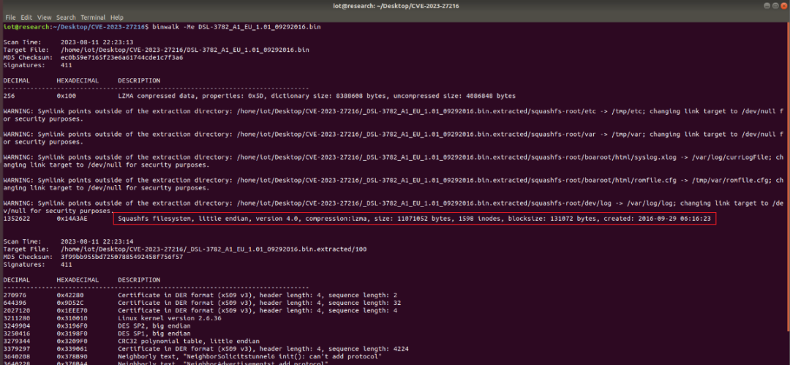  
  
  
模拟固件：  
  
  
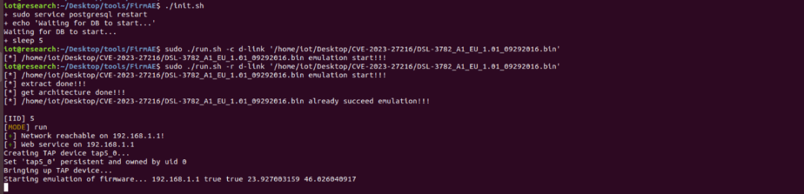  
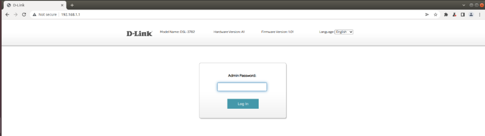  
  
  
通过查看DSL-3782的官方文档可知默认密码为：admin  
  
  
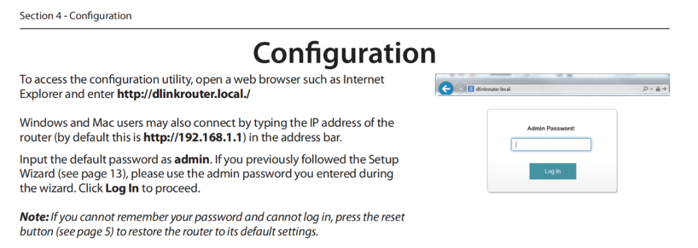  
  
  
根据漏洞描述披露的信息：在网络设置页面有一个需要认证的命令执行，并且是root权限。那么直接固件模拟，看一下网络设置页面的信息：  
  
  
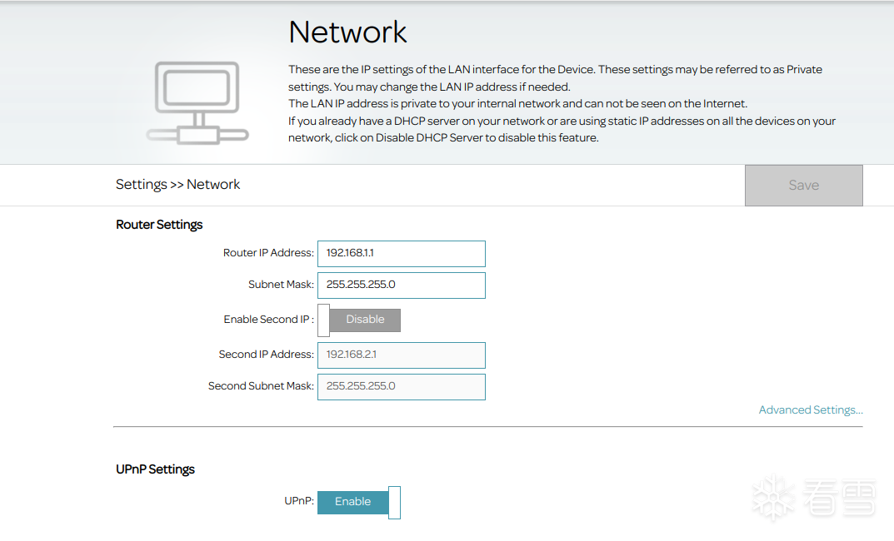  
  
  
尝试更改一下其中数据，并点击Save，此时burpsuite抓到的数据包内容为：  
  
  
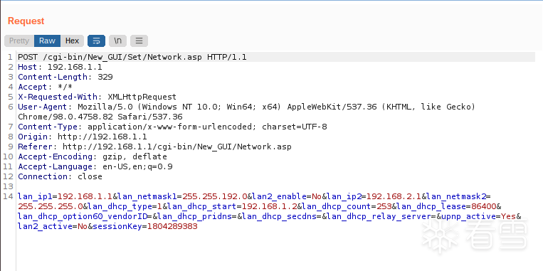  
  
  
根据数据包内容可知Save的数据提交到了/cgi-bin/New_GUI/Set/Network.asp  
，在文件系统中查找该文件并查看其内容：  
  
  
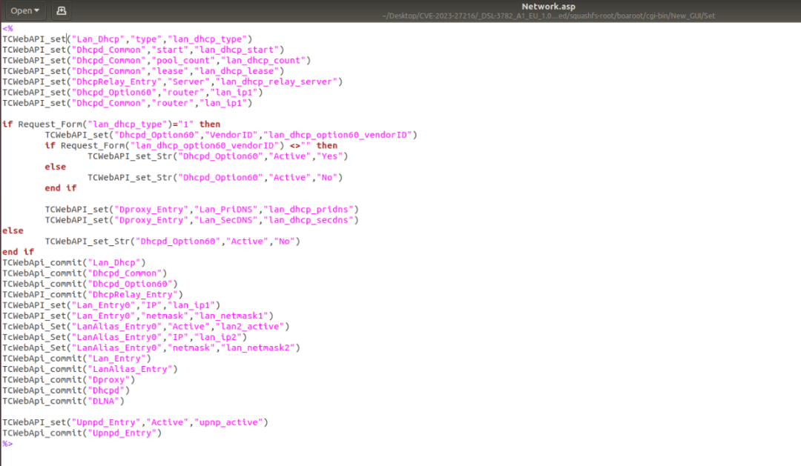  
  
  
由文件内容和数据包的内容可知：网页输入的Router IP Address、Subnet Mask  
的内容会分别被作为lan_ip1、lan_netmask1  
的值POST到/cgi-bin/New_GUI/Set/Network.asp  
。在Network.asp  
中将Lan_Entry0  
中IP、netmask  
的值分别设定为lan_ip1、lan_netmask1  
，即用户传入的Router IP Address、Subnet Mask  
内容最终会传递到Lan_Entry0  
的IP、netmask  
中。此时查找一下含Lan_Entry0  
的文件：  
  
  
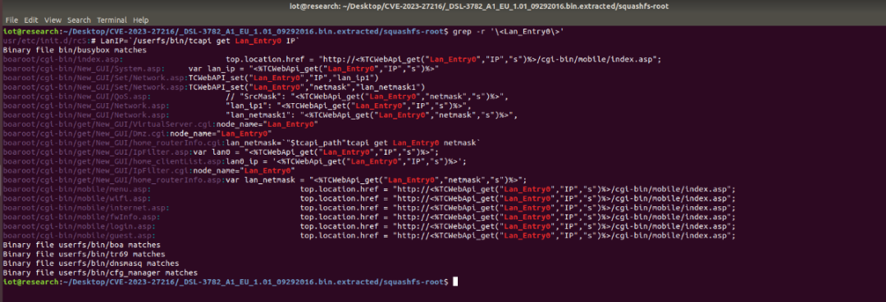  
  
  
结合查找到的内容和之前分析CVE-2022-34527的信息可知漏洞点应该是在userfs/bin/cfg_manager  
中。将该文件拿到IDA中分析并结合关键词IP、netmask  
定位到关键代码并进行分析，在分析过程中会遇到字符串解析不正确和函数不识别问题，需要手动修复。修复方式：  
  
◆字符串：在显示不正确的起始地址处按下U（Undefine），然后按下A。  
  
◆函数：在函数起始地址处按下P。  
  
  
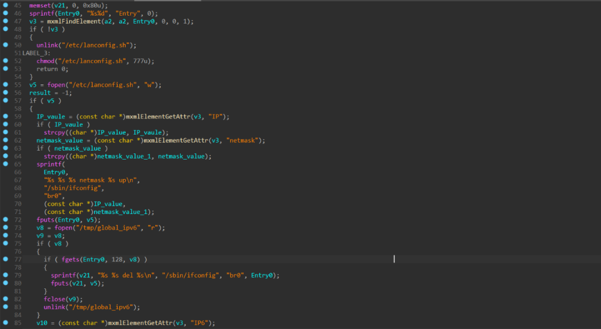  
  
  
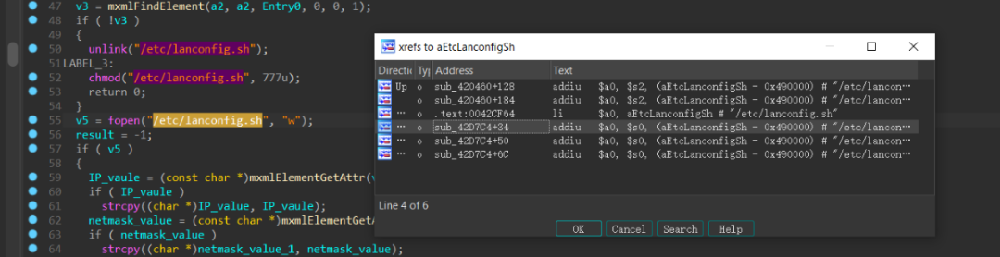  
  
  
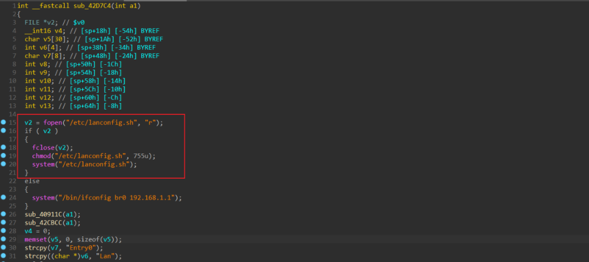  
  
  
通过上面代码可知：cfg_manager向/etc/lanconfig.sh  
文件中写入了可被前端控制的输入信息：IP（Router IP Address）、netmask（Subnet Mask），并将该文件设定为可读可写可执行。通过查看该文件的引用发现最终该文件会被system  
执行，并且为root权限。  
  
  
现在我们已经知道了从mxmlFindElement  
函数获取到Entry0  
,再使用mxmlElementGetAttr  
函数获取IP或netmask的值到写入/etc/lanconfig.sh  
的过程中不存在对输入内容的检查。从mxmlFindElement  
和mxmlElementGetAttr  
这两个函数名称可知是从一个xml文件中获取的数据。现在还需要确认从/cgi-bin/New_GUI/Set/Network.asp  
提交到写入xml文件这一过程中是否存在输入检查。通过分析找到该文件：  
  
  
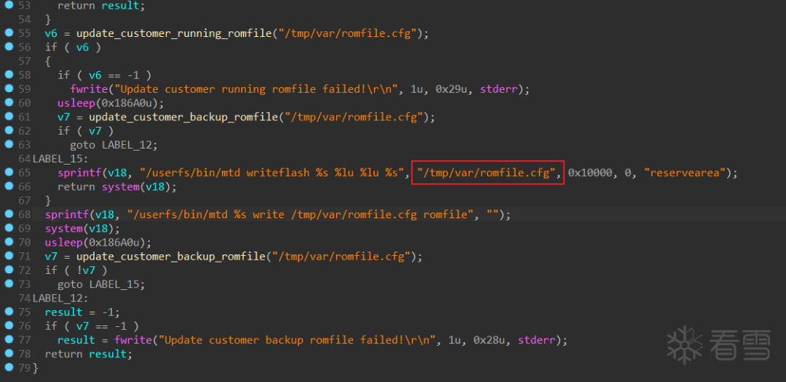  
  
  
现在验证一下自定义的输入能否原封不动的写入到该文件中，使用FirmAE调试模式模拟固件，更改数据包发送后，用其提供的shell辅助查看/tmp/var/romfile.cfg  
文件中内容：  
  
  
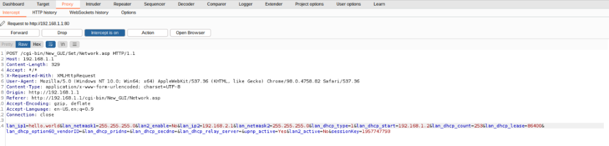  
  
  
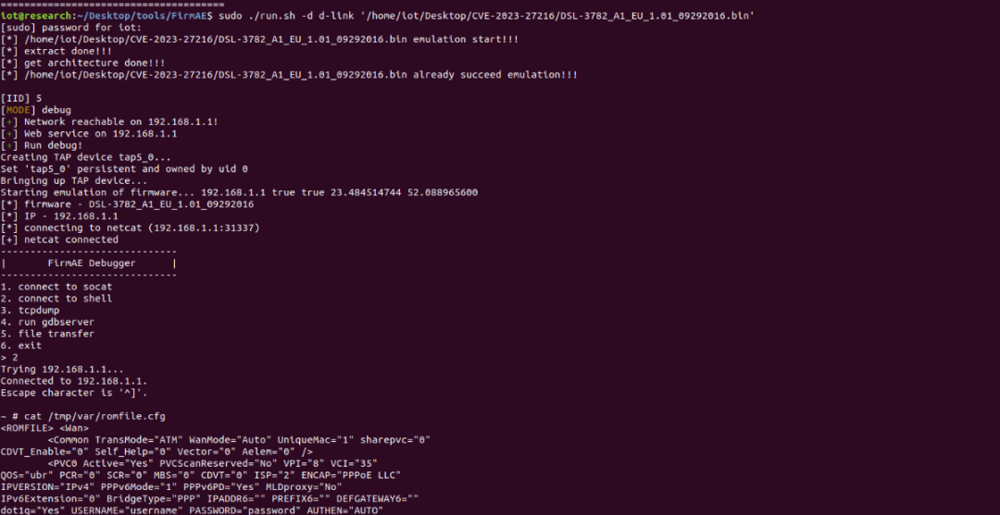  
  
  
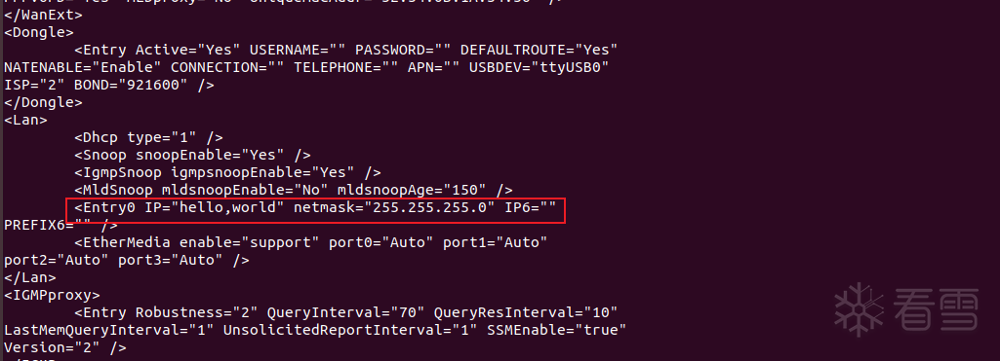  
  
  
可以看到此时IP的内容即为更改的数据。顺便查看一下此时/etc/lanconfig.sh  
文件内容：  
  
  
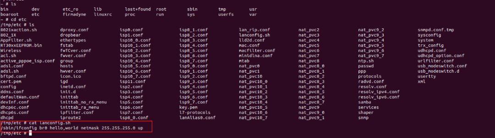  
  
  
到这里整个漏洞分析算是基本完成了，大致的流程是：用户输入的数据被POST到/cgi-bin/New_GUI/Set/Network.asp  
,通过TCWebApi_Set将数据保存到Lan_Entry中，然后传递到cfg-manager，cfg-manager将其保存到/tmp/var/romfile.cfg  
文件中，最后通过mxmlElementGetAttr  
获取数据将其写入文件/etc/lanconfig.sh  
,最终被system  
执行。  
  
  
> 原文此处代码块为空，内容未归档；无法从空块证明或复现所述结果。
  
  
在查看数据包时发现POST的数据是需要session的，因此选择使用Intercept on拦截数据包修改后发送。修改后POST的数据为：  
  
  
> 原文此处代码块为空，内容未归档；无法从空块证明或复现所述结果。
  
  
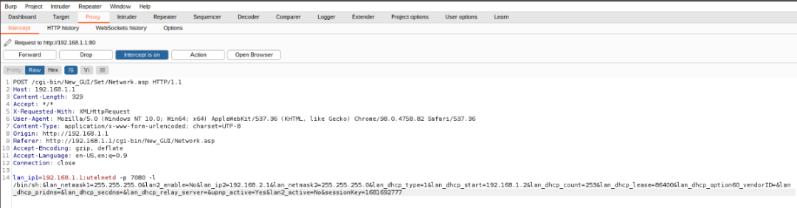  
  
  
使用nc连接成功，取得shell。  
  
  
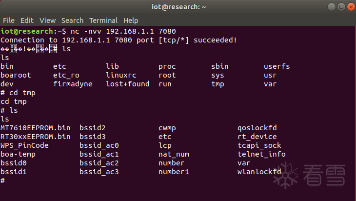  
  
  
> 原文此处代码块为空，内容未归档；无法从空块证明或复现所述结果。
  
  
> 原文此处代码块为空，内容未归档；无法从空块证明或复现所述结果。
  
  
  
执行poc后，使用成功取得shell：  
  
  
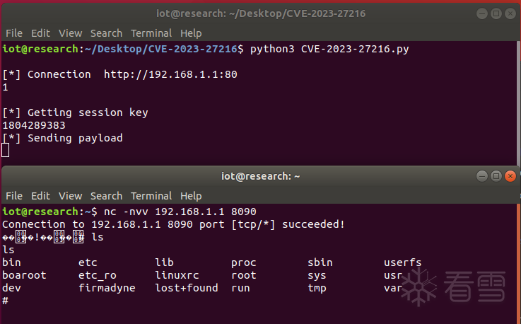  
  
  
> 原文此处代码块为空，内容未归档；无法从空块证明或复现所述结果。
  
  
命令注入漏洞通常造成的原因相同：没有对前端输入数据检测或者检测不充分。这个命令注入漏洞和之前复现的几个略微不同的地方在于前端输入的数据最后是写到一个脚本文件中，通过给该文件添加执行权限，最终被system函数执行。  
  
###   
### 参考文章  
  
  
◆  
https://github.com/FzBacon/CVE-2023-27216_D-Link_DSL-3782_Router_command_injection/blob/master/CVE-2023-27216_D-Link_DSL-3782_Router_command_injection.md  
  
  
  
  
  
  
  
**看雪ID：伯爵的信仰**  
  
https://bbs.kanxue.com/user-home-882513.htm  
  
*本文为看雪论坛优秀文章，由 伯爵的信仰 原创，转载请注明来自看雪社区  
  
  
  
  
  
**#****往期推荐**  
  
1、[在 Windows下搭建LLVM 使用环境](http://mp.weixin.qq.com/s?__biz=MjM5NTc2MDYxMw==&mid=2458500602&idx=1&sn=4bcc2af3c62e79403737ce6eb197effc&chksm=b18e8d7086f9046631a74245c89d5029c542976f21a98982b34dd59c0bda4624d49d1d0d246b&scene=21#wechat_redirect)  
  
  
2、[深入学习smali语法](http://mp.weixin.qq.com/s?__biz=MjM5NTc2MDYxMw==&mid=2458500599&idx=1&sn=8afbdf12634cbf147b7ca67986002161&chksm=b18e8d7d86f9046b55ff3f6868bd6e1133092b7b4ec7a0d5e115e1ad0a4bd0cb5004a6bb06d1&scene=21#wechat_redirect)  
  
  
3、[安卓加固脱壳分享](http://mp.weixin.qq.com/s?__biz=MjM5NTc2MDYxMw==&mid=2458500598&idx=1&sn=d783cb03dc6a3c1a9f9465c5053bbbee&chksm=b18e8d7c86f9046a67659f598242acb74c822aaf04529433c5ec2ccff14adeafa4f45abc2b33&scene=21#wechat_redirect)  
  
  
4、[Flutter 逆向初探](http://mp.weixin.qq.com/s?__biz=MjM5NTc2MDYxMw==&mid=2458500574&idx=1&sn=06344a7d18a72530077fbc8f93a40d8f&chksm=b18e8d5486f904424874d7308e840523ebfb2db20811d99e4b0249d42fa8e38c4e80c3f622c6&scene=21#wechat_redirect)  
  
  
5、[一个简单实践理解栈空间转移](http://mp.weixin.qq.com/s?__biz=MjM5NTc2MDYxMw==&mid=2458500315&idx=1&sn=19b12ab150dd49325f93ae9d73aef0c4&chksm=b18e8c5186f90547f3b615b160d803a320c103d9d892c7253253db41124ac6993d83d13c5789&scene=21#wechat_redirect)  
  
  
6、[记一次某盾手游加固的脱壳与修复](http://mp.weixin.qq.com/s?__biz=MjM5NTc2MDYxMw==&mid=2458500165&idx=1&sn=b16710232d3c2799c4177710f0ea6d41&chksm=b18e8ccf86f905d9a0b6c2c40997e9b859241a4d7f798c4aeab21352b0a72b6135afce349262&scene=21#wechat_redirect)  
  
  
  
  
  
  
  
  
  
**球分享**  
  
  
  
**球点赞**  
  
  
  
**球在看**  
  

---

> 来源：gelusus/wxvl（微信公众号漏洞文章自动归档，原始披露 URL 尚未确认，现有链接按来源追溯区分别标注）
