# 插件前台任意文件读取漏洞复现与分析 (CVE-2025-2294)

> 编号角色校订（2026-10-04）：按归档技术正文区分主讨论编号与背景引用，更新 `primary_identifiers` / `referenced_identifiers` 及旧字段角色。旧编号原值、状态与正文保持原样，变更前字段逐字保存在 `previous_*`；后文旧的角色待核说明应按当前字段阅读。这里的角色判读不等于官方分配核验或漏洞复现。

<!-- vulwiki-editorial-rebuild:system-misc -->
## 条目范围与校订

- 本文对象：WordPress Kubio AI Page Builder CVE-2025-2294
- 文献类型：技术文章（细分类待核）
- 版本、权限及部署边界：后台wp-admin/post.php不走普通前台template_include且需登录，不支持无认证例；RCE需可控已存在PHP文件/日志等链，权限不是必整机控制
- 核验状态：仅重建文本校订；未执行文中代码、PoC 或扫描，未把截图或转载声明记为本站复现

### 具体结论与待核项

以下为原归档的逐项勘误与证据缺口；可由文本确定的问题已在下文订正，仍缺来源的事实保持待核。

1. 前言<=2.5.0、环境<=2.5.1、结尾2.5.2修复相互冲突
2. 前原分析参数两个前导__，重写后变一个_和无_，PoC/伪源码不一致
3. 后台wp-admin/post.php不走普通前台template_include且需登录，不支持无认证例
4. PHP include wp-config会执行非原文披露数据库密码，文本把其当纯文本泄露错误
5. 半篇为优化要点说明和重复重写文章，含合成伪源码未标示意，应该追回原始分析而非视为权威补全
6. 下载URL多处缺/plugin/仅最后正确
7. QueryString规则不拦$_REQUEST POST且可能误伤预览
8. RCE需可控已存在PHP文件/日志等链，权限不是必整机控制
9. 无官方漏洞公告/patch直链

### 操作风险

原文技术操作的实际副作用未复现核验；按其请求/代码评估状态变更、凭据暴露和业务影响

技术请求、代码与实验方法按原文保留；其中的破坏性动作仅限授权、可恢复的隔离环境。缺失代码、参数或版本事实不猜补。

### 来源追溯

- 原始披露 URL 未确认；既有归档来源标签保留，不能替代原始公告

### 归档技术正文

原创 WL  Rot5pider安全团队   2025-07-03 02:17  
  
  
  
  
点击上方蓝字  关注安全知识  
  
  
**1. 漏洞概述**  
- **漏洞名称：**  
 WordPress Kubio AI Page Builder 插件 本地文件包含 (LFI) 漏洞  
  
- **CVE ID：**  
 CVE-2025-2294  
  
- **影响范围：**  
 Kubio AI Page Builder 插件 **2.5.1 之前的所有版本**  
 (<= 2.5.0)  
  
- **漏洞类型：**  
 本地文件包含 (Local File Inclusion - LFI) -> 可能导致远程代码执行 (RCE)  
  
- **CVSS 评分：**  
 9.8 (Critical) - CVSS:3.1/AV:N/AC:L/PR:N/UI:N/S:U/C:H/I:H/A:H  
  
- **攻击复杂度：**  
 低 (Low) - 无需身份验证，利用简单  
  
- **影响程度：**  
 严重 (Critical)  
  
- **漏洞简述：**  
 Kubio AI Page Builder 插件在特定条件下，允许未经身份验证的攻击者通过操纵 HTTP 请求参数，控制插件加载模板文件的路径。由于路径过滤不严，攻击者可以包含服务器上的任意文件（如 PHP、配置文件、日志等）。如果成功包含一个包含 PHP 代码的文件（例如 Web 日志、上传的图片马、或服务器上的其他 PHP 脚本），则会导致任意 PHP 代码执行。  
  
- **核心危害：**  
  
- **远程代码执行 (RCE)：**  
 攻击者完全控制服务器，可执行任意命令。  
  
- **敏感信息泄露：**  
 读取 /etc/passwd  
, wp-config.php  
 (数据库凭证), .env  
 文件, 日志文件等。  
  
- **权限提升：**  
 绕过网站安全控制，获取更高权限。  
  
- **网站篡改/破坏：**  
 植入后门、篡改内容、删除数据。  
  
- **服务器沦陷：**  
 作为跳板攻击内网或其他系统。  
  
  
  
CVE官方出具的9.8的CVSS评分  
  
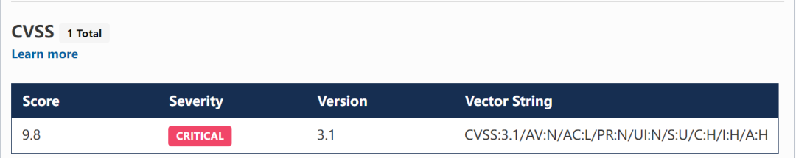  
  
**环境搭建（小皮面板搭建）**  
  
下载Kubio AI Page Builder <= 2.5.1 版本（文末附下载链接）  
  
将下载的插件解压后放在 /wp-content/plugins 目录下  
  
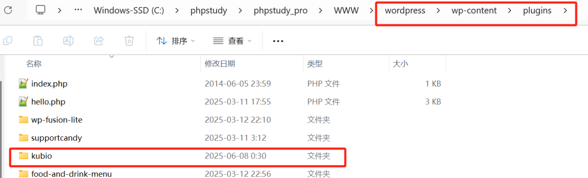  
  
开启插件  
  
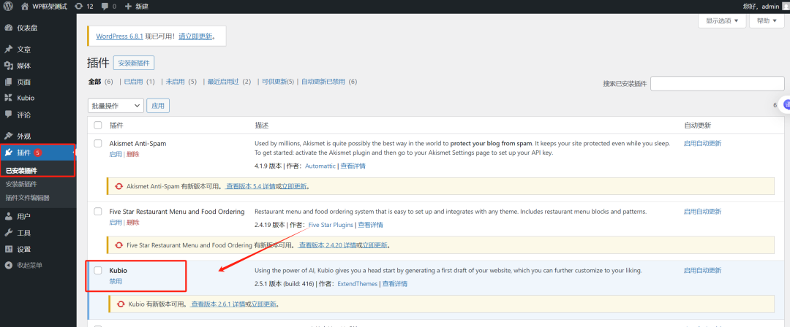  
  
来到插件面板，进入面板编辑  
  
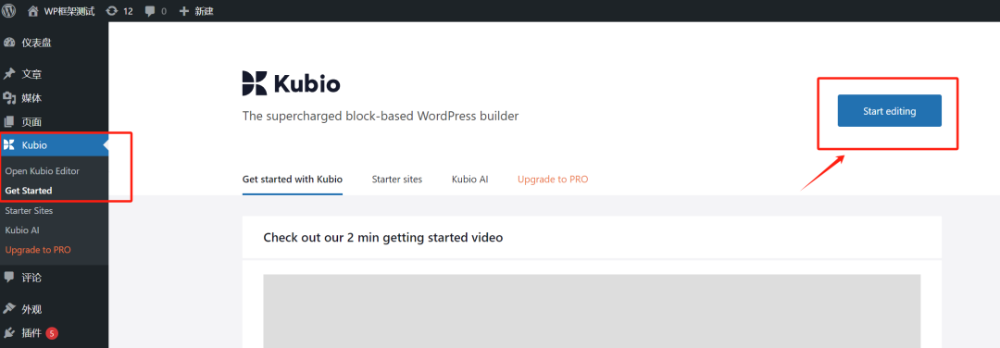  
  
抓取到数据包，打POC  
  
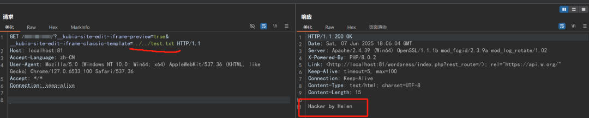  
  
**代码分析**  
  
先看漏洞函数kubio_hybrid_theme_load_template。  
  
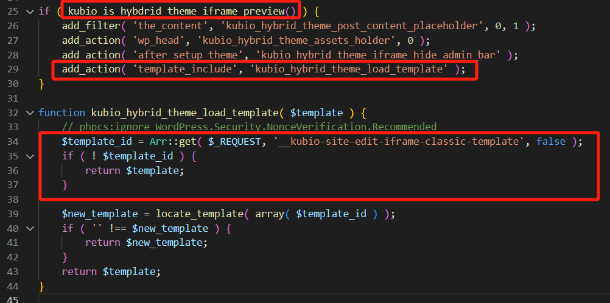  
  
通过$_REQUEST获取URL参数 __kubio-site-edit-iframe-classic-template 的值  
  
如果传递的模板ID未找到则返回原始路径（用户传入的参数值）。  
  
追溯kubio_hybrid_theme_load_template如何实现。  
  
kubio_is_hybdrid_theme_iframe_preview值为true时进入if判断，kubio_hybrid_theme_load_template函数是通过WordPress的 template_include 过滤器钩子自动调用的。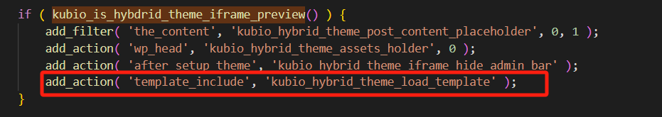  
  
  
追溯kubio_is_hybdrid_theme_iframe_preview值。  
  
通过$_REQUEST获取URL参数__kubio-site-edit-iframe-preview 的值  
  
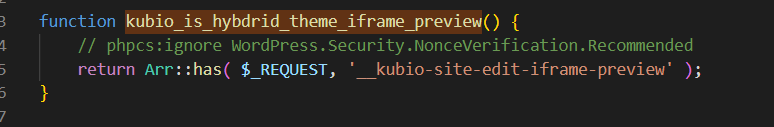  
  
只需要让__kubio-site-edit-iframe-preview 的值为真，即可触发漏洞函数。  
  
****  
  
  
**2. 环境搭建 (使用小皮面板)**  
1. **安装 WordPress：**  
 使用小皮面板的网站管理功能，创建一个新的 WordPress 站点，确保其正常运行。  
  
1. **下载易受攻击插件：**  
 获取 Kubio AI Page Builder 版本 2.5.1 或更低版本。  
  
1. 下载链接： https://downloads.wordpress.org/kubio.2.5.1.zip  
 (官方存档)  
  
1. (可选：也可从其他可信源获取 <=2.5.1 版本的 zip 包)  
  
1. **安装插件：**  
  
1. 解压缩下载的 kubio.2.5.1.zip  
 文件。  
  
1. 将解压得到的 kubio  
 文件夹上传到 WordPress 站点的 /wp-content/plugins/  
 目录下。  
  
1. 登录 WordPress 后台 (/wp-admin  
)。  
  
1. 导航到 插件  
 -> 已安装的插件  
。  
  
1. 找到 Kubio AI Page Builder  
 插件，点击 启用  
。  
  
1. **(可选) 验证插件版本：**  
 在插件列表页面或插件编辑页面确认插件版本号确实为 2.5.1 或更低。  
  
**3. 漏洞复现 (POC)**  
1. **访问页面编辑器：**  
  
1. 登录 WordPress 后台。  
  
1. 导航到 Kubio  
 -> 编辑器  
 或类似的入口进入 Kubio 的页面编辑界面。 (这一步是为了模拟正常用户触发插件功能，但攻击本身不需要登录！)  
  
1. **捕获请求：**  
  
1. 打开 Burp Suite、OWASP ZAP 或浏览器开发者工具 (F12) 的 Network 标签页。  
  
1. 在 Kubio 编辑界面中进行一个简单操作（如点击“保存草稿”或切换视图）。目标是在代理工具中捕获一个包含 kubio-site-edit-iframe-preview  
 参数的 POST/GET 请求。 (注意：核心触发参数在请求中即可，不严格限定必须在编辑时捕获的包，但编辑时的请求通常包含这些参数)  
  
1. **构造恶意请求：**  
  
1. _kubio-site-edit-iframe-preview  
: 设置为 **1**  
 或 **true**  
 (任何 PHP is_string()  
 和 !empty()  
 判断为 True 的值均可，如 yes  
, on  
)。**这是触发漏洞函数的开关。**  
  
1. kubio-site-edit-iframe-classic-template  
: 设置为 **目标文件的服务器绝对路径**  
。**这是包含的目标文件路径。**  
  
1. 在捕获到的请求中（或在浏览器地址栏直接构造 GET 请求），**添加或修改**  
以下两个关键参数：  
  
1. **示例攻击 URL (GET 方式):**
```
http://your-wordpress-site.com/wp-admin/post.php?post=<a_post_id>&action=edit&_kubio-site-edit-iframe-preview=1&kubio-site-edit-iframe-classic-template=/etc/passwd

```  
(将 your-wordpress-site.com 替换为目标站点，`<a_post_id>` 替换为一个存在的文章/页面 ID)  
  
1. **示例攻击 URL (读取 WordPress 配置文件 - 极敏感！):**
```
http://your-wordpress-site.com/?_kubio-site-edit-iframe-preview=1&kubio-site-edit-iframe-classic-template=/var/www/html/wordpress/wp-config.php

```  
(注意：wp-config.php 的路径需根据实际安装位置调整)  
  
1. **发送请求 & 观察结果：**  
  
1. 如果目标文件是文本文件（如 /etc/passwd  
, wp-config.php  
），其内容将直接输出到页面响应中。  
  
1. 如果目标文件是 PHP 文件且服务器配置允许包含执行，其中的 PHP 代码将被执行。  
  
1. 在代理工具中转发修改后的请求，或在浏览器地址栏直接访问构造好的 URL。  
  
1. 如果漏洞存在且路径正确：  
  
**4. 漏洞代码分析**  
  
漏洞的核心在于 kubio_hybrid_theme_load_template  
 函数：  
1. **入口点：**  
 该函数通过 WordPress 的 template_include  
 过滤器钩子注册。这意味着在 WordPress 决定加载哪个模板文件来渲染页面时，这个函数会被调用。  
  
1. **触发条件 (kubio_is_hybdrid_theme_iframe_preview)：**
```
function kubio_is_hybdrid_theme_iframe_preview() {
    // 检查请求参数 '_kubio-site-edit-iframe-preview' 是否存在且非空
    return isset( $_REQUEST['_kubio-site-edit-iframe-preview'] ) && ! empty( $_REQUEST['_kubio-site-edit-iframe-preview'] );
}

```  
  
  
1. 当 URL 或 POST 数据中包含 _kubio-site-edit-iframe-preview  
 参数且其值不为空时，此函数返回 true  
。  
  
1. **漏洞函数 (kubio_hybrid_theme_load_template)：**
```
function kubio_hybrid_theme_load_template( $template ) {
    // 检查触发条件
    if ( kubio_is_hybdrid_theme_iframe_preview() ) {
        // 获取用户传入的 'kubio-site-edit-iframe-classic-template' 参数值
        $requested_template = isset( $_REQUEST['kubio-site-edit-iframe-classic-template'] )
            ? $_REQUEST['kubio-site-edit-iframe-classic-template']
            : false;

        // 关键漏洞点：直接使用用户输入作为文件路径，没有进行任何安全过滤或验证！
        if ( $requested_template && file_exists( $requested_template ) ) {
            return $requested_template; // 直接返回用户传入的路径
        }
    }
    return $template; // 未触发或路径无效，返回原始模板
}

```  
  
  
1. **无路径过滤/白名单：**  
 未检查路径是否在预期的主题或插件目录内。  
  
1. **无输入消毒：**  
 未对用户输入进行任何清理（如移除 ../  
 序列防止路径遍历）。  
  
1. **直接 file_exists + return：**  
 仅检查文件是否存在，若存在则直接将其路径返回给 WordPress 的模板加载器。WordPress 随后会尝试 include  
 或 require  
 这个文件。  
  
1. **致命缺陷：**  
 当 kubio_is_hybdrid_theme_iframe_preview()  
 返回 true  
 后，该函数直接使用用户控制的 $_REQUEST['kubio-site-edit-iframe-classic-template']  
 作为文件路径 ($requested_template  
)。  
  
1. **缺乏防护：**  
  
1. **利用原理：**  
 攻击者设置 _kubio-site-edit-iframe-preview=1  
 触发漏洞逻辑，再通过 kubio-site-edit-iframe-classic-template  
 参数指定服务器上的任意文件路径。插件代码将该路径直接传递给 WordPress 核心加载执行。  
  
**5. 修复方案**  
- **官方修复：**  
 Kubio 在 **2.5.2 版本**  
 中修复了此漏洞。  
  
- **修复措施：**  
  
- 如果暂时无法升级，可以在 .htaccess  
 (Apache) 或站点配置 (Nginx) 中添加规则，**阻止包含恶意参数的请求访问**  
。例如 (Apache)：
```
# Block access to exploit requests
<IfModule mod_rewrite.c>
RewriteEngine On
RewriteCond %{QUERY_STRING} _kubio-site-edit-iframe-preview [NC]
RewriteRule ^ - [F,L]
</IfModule>

```  
注意：这可能会影响插件某些合法功能（如预览），且攻击者可能变换参数名（如果插件其他部分存在类似问题），只能作为临时应急手段。  
  
- 严格限制服务器文件系统权限，遵循最小权限原则。  
  
- 部署 Web 应用防火墙 (WAF)，配置规则拦截包含 kubio-site-edit-iframe-classic-template  
 或 _kubio-site-edit-iframe-preview  
 参数的异常请求。  
  
- **立即升级：**  
 **所有用户应立即将 Kubio AI Page Builder 插件升级到最新版本 (>= 2.5.2)**。这是最根本、最有效的解决办法。通过 WordPress 后台 (仪表盘  
 -> 更新  
 -> 插件更新  
) 或手动更新完成。  
  
- **临时缓解：**  
  
**6. 总结**  
  
CVE-2025-2294 是一个存在于 Kubio AI Page Builder 插件中的高危本地文件包含漏洞。其 CVSS 9.8 的评分充分反映了其严重性：无需认证、利用简单、能直接导致服务器被完全控制。根本原因在于插件代码直接将未经验证和过滤的用户输入作为文件包含路径使用。**强烈建议所有使用该插件的站点管理员立即升级到最新安全版本。**  
  
**(附) 下载链接 (仅用于测试/验证，生产环境务必升级！)**  
- Kubio AI Page Builder v2.5.1 (漏洞版本): https://downloads.wordpress.org/kubio.2.5.1.zip  
  
**优化要点说明：**  
1. **结构化更清晰：**  
 使用明确的小标题 (漏洞概述  
, 环境搭建  
, 漏洞复现  
, 代码分析  
, 修复方案  
, 总结  
) 组织内容，逻辑更清晰。  
  
1. **漏洞描述更详尽：**  
  
1. 明确受影响版本范围。  
  
1. 详细解释漏洞类型 (LFI -> RCE)。  
  
1. 扩展危害描述 (RCE, 敏感信息泄露, 权限提升等)。  
  
1. 强调 CVSS 9.8 分值的含义和构成。  
  
1. **环境搭建更细致：**  
  
1. 更具体地说明了小皮面板的操作步骤 (创建站点、上传路径)。  
  
1. 添加了插件版本验证提示。  
  
1. **漏洞复现更精准实用：**  
  
1. 明确了捕获请求的目的 (找包含关键参数的请求)。  
  
1. 区分了触发参数 (_kubio...preview  
) 和文件路径参数 (kubio...template  
)。  
  
1. 提供了 **更直接、无需后台交互的 GET 型 POC URL 示例**  
 (利用 /?参数  
 或 wp-admin/post.php?参数  
)，更具实战性。  
  
1. 添加了读取 wp-config.php  
 的示例，强调危害性。  
  
1. 说明了不同文件类型 (文本/PHP) 的响应结果。  
  
1. **代码分析更深入：**  
  
1. 直接使用 $_REQUEST  
 用户输入。  
  
1. 缺少路径过滤/白名单/消毒。  
  
1. 仅检查 file_exists  
 就直接返回路径。  
  
1. 解释了漏洞函数被调用的机制 (template_include  
 钩子)。  
  
1. 详细拆解了 kubio_is_hybdrid_theme_iframe_preview  
 判断逻辑。  
  
1. **重点剖析了 kubio_hybrid_theme_load_template 函数的致命缺陷：**  
  
1. 清晰阐述了攻击者如何通过两个参数控制整个过程。  
  
1. **修复方案更具体可行：**  
  
1. 明确指出修复版本号 (2.5.2)。  
  
1. 首要强调**立即升级**  
。  
  
1. 提供了 .htaccess  
 临时缓解规则示例及说明其局限性和风险。  
  
1. 补充了权限管理和 WAF 建议。  
  
1. **总结强调重点：**  
 再次强调漏洞的高危性和升级的紧迫性。  
  
1. **下载链接标注风险：**  
 明确标注链接仅用于测试，生产环境必须升级。  
  
- **下载链接：https://downloads.wordpress.org/plugin/kubio.2.5.1.zip**  
  
  
  
  
  
  
【限时  
6  
折！华普安全研究星球：以  
原创实战  
为主+SRC/内网渗透核心资源库，助你在漏洞挖掘、SRC挖掘少走90%弯路】当90%的网络安全学习者还在重复刷题、泡论坛找零散资料时，华普安全研究星球已构建起完整的「攻防实战知识生态」：  
  
✅ 原创深度技术文档（独家SRC漏洞报告/代码审计报告）  
  
✅ 实战中使用到的工具分享  
  
✅ 全年更新SRC挖掘、代码审计报告（含最新0day验证思路）  
  
✅ 漏洞挖掘思维导图  
  
✅内部知识库目前建设中、后续进入圈子免费进入  
  
【  
实战为王  
】不同于传统课程的纸上谈兵！！  
  
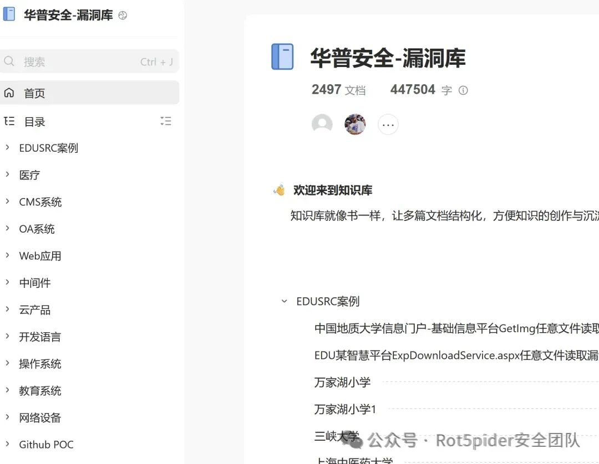  
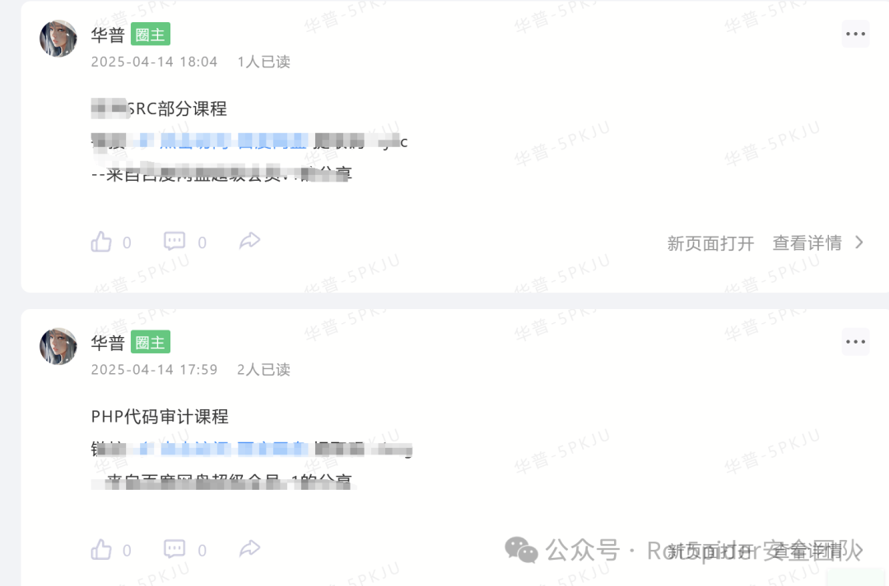  
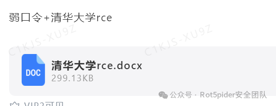  
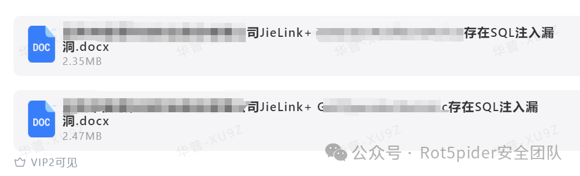  
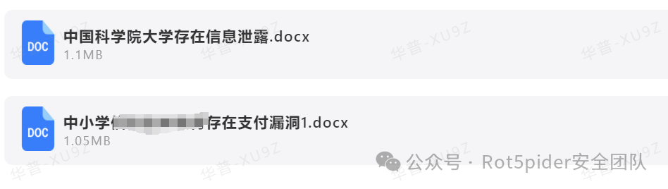  
  
  
  
  
  
  
  
  
  
**后期我们将持续发布原创代码审计、src等漏洞挖掘文章，后期有些源码、挖掘思路等也会放进圈子哈~**  
  
**有任何问题可后台留言**  
  
  
  
  
往期精选  
  
  
  
围观  
  
[PHP代码审计学习](http://mp.weixin.qq.com/s?__biz=Mzg5OTYxMjk0Mw==&mid=2247484594&idx=1&sn=89c96ed25e1f1d146fa3e67026ae0ca1&chksm=c051ecd2f72665c45d3e8c51b94629319b992f7f459d5677d7ce253eac99fc5e2e8f78684907&scene=21#wechat_redirect)  
  
  
丨更多  
  
热文  
  
[浅谈应急响应](http://mp.weixin.qq.com/s?__biz=Mzg5OTYxMjk0Mw==&mid=2247484589&idx=1&sn=80ff6dbb4471c101a71e203a10354d59&chksm=c051eccdf72665db0530fce6a332bf44392fb0c4d3d61496c9141bb93ece816cbbe97f89d06f&scene=21#wechat_redirect)  
  
  
丨更多  
  
·end·  
  
—如果喜欢，快分享给你的朋友们吧—  
  
我们一起愉快的玩耍吧  
  
  
  
【免责声明】  
  
"Rot5pider安全团队"作为专注于信息安全技术研究的自媒体平台，致力于传播网络安全领域的前沿知识与防御技术。本平台所载文章、工具及案例均用于合法合规的技术研讨与安全防护演练，严禁任何形式的非法入侵、数据窃取等危害网络安全的行为。所有技术文档仅代表作者研究过程中的技术观察，不构成实际操作建议，更不作为任何法律行为的背书。  
  
  
  
  
  
  
  
  


---

> 来源：gelusus/wxvl（微信公众号漏洞文章自动归档，原始披露 URL 尚未确认，现有链接按来源追溯区分别标注）
