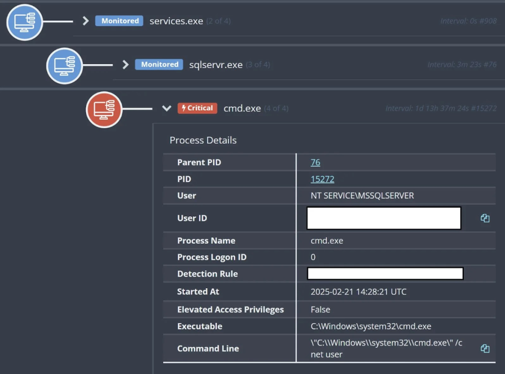
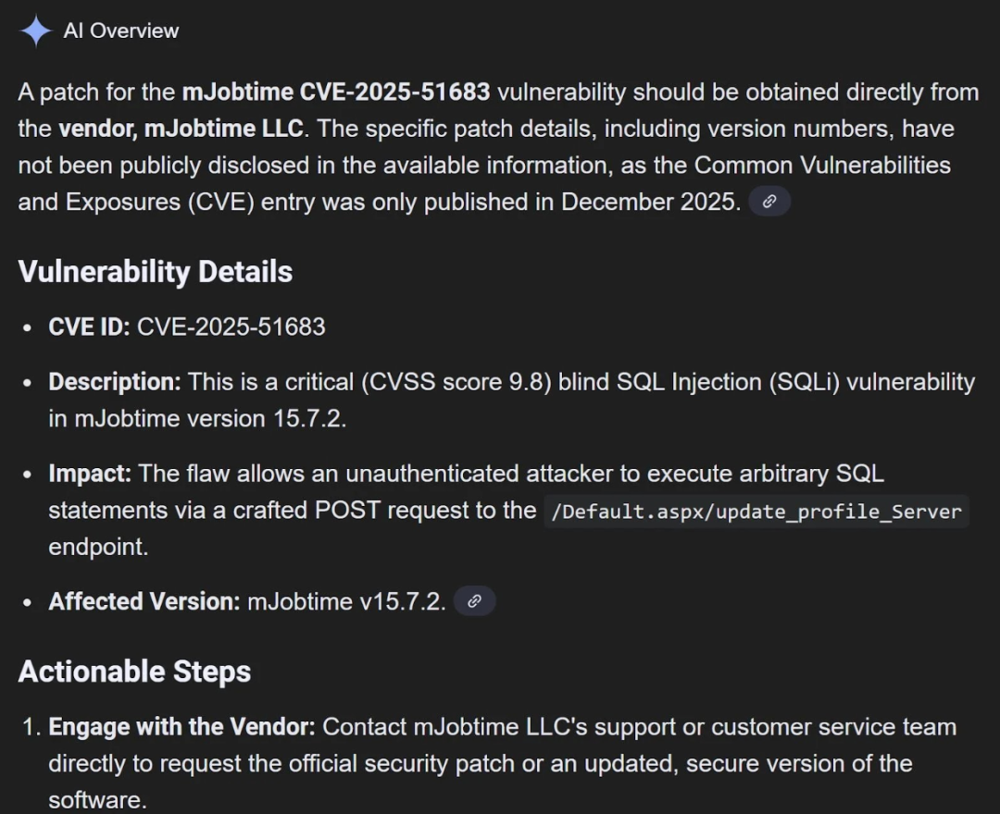
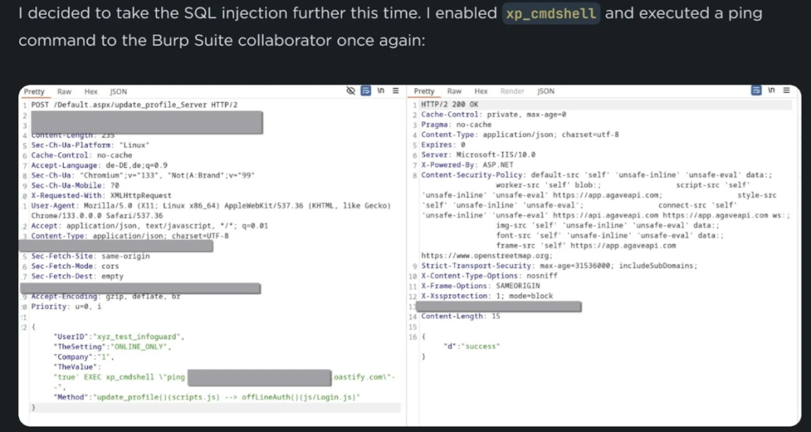

# 攻击者利用 Mjobtime 应用程序漏洞，通过 MSSQL 和 IIS POST 请求攻击建筑公司

<!-- vulwiki-editorial-rebuild:system-misc -->
## 条目范围与校订

- 本文对象：mJobTime51683
- 文献类型：技术文章（细分类待核）
- 版本、权限及部署边界：15.7.2是所述版本非完整影响边界；SQLi到xp_cmdshell需数据库权限不能普遍强制执行OS；缺修复版本/厂商建议，攻击趋势推断勿超过三案例
- 核验状态：仅重建文本校订；未执行文中代码、PoC 或扫描，未把截图或转载声明记为本站复现

### 具体结论与待核项

以下为原归档的逐项勘误与证据缺口；可由文本确定的问题已在下文订正，仍缺来源的事实保持待核。

1. CVE缺元数据
2. 15.7.2是所述版本非完整影响边界
3. SQLi到xp_cmdshell需数据库权限不能普遍强制执行OS
4. 三客户事件来自Huntress却无原文链接和时间细节
5. InfoGuard PoC仅截图无请求文字
6. 缺修复版本/厂商建议，攻击趋势推断勿超过三案例

### 操作风险

原文技术操作的实际副作用未复现核验；按其请求/代码评估状态变更、凭据暴露和业务影响

技术请求、代码与实验方法按原文保留；其中的破坏性动作仅限授权、可恢复的隔离环境。缺失代码、参数或版本事实不猜补。

### 来源追溯

- 原始披露 URL 未确认；既有归档来源标签保留，不能替代原始公告

### 归档技术正文

原创 网络安全9527
                    网络安全9527  安全圈的那点事儿   2026-01-27 01:03  
  
攻击者越来越多地将注意力转向建筑公司，利用其工地上运行的商业软件中的漏洞进行攻击。  
  
最新的攻击目标之一是 Mjobtime 建筑工地时间跟踪应用程序，该应用程序通常部署在 Microsoft IIS 上，后台使用 MSSQL 数据库。  
  
Mjobtime 版本 15.7.2 中存在一个盲 SQL 注入漏洞（编号为 CVE-2025-51683），允许远程攻击者向应用程序的 /Default.aspx/update_profile_Server端点发送精心构造的 HTTP POST 请求，并强制数据库运行系统命令。  
  
这种攻击路径使入侵者能够从面向公众的网页表单直接进入数据库引擎，在那里他们可以滥用原本为管理员设计的强大功能。  
  
在实际事件中，恶意流量首先会在IIS日志中表现为向易受攻击的端点重复发送 POST 请求，随后激活 Mjobtime MSSQL 实例中的 xp_cmdshell 扩展存储过程。  
  
一旦启用，xp_cmdshell 允许攻击者以服务账户的权限运行操作系统命令，这通常会使他们对 Windows 主机拥有深度控制权。  
  
Huntress 分析师注意到，在 2025 年，三个不同的客户环境中都出现了这种模式，所有这些都与 Mjobtime 在建筑行业的部署有关。  
  
在第一个例子中，他们记录了威胁行为者使用 xp_cmdshell 运行诸如“cmd /c net user”之类的命令，以及对外部 oastify.com 域的 ping 操作，这清楚地表明了从受感染的数据库服务器进行发现和回调测试的过程。  
  
  
  
在另外两起案例中，攻击者试图使用 wget 和 curl 获取远程有效载荷，但在完成后续入侵步骤之前就被阻止了。下图展示了其中一台受影响主机上与这些命令相关的进程树。  
## 从 IIS POST 请求到 MSSQL 命令执行  
  
当攻击者向 Mjobtime Web 前端公开的 update_profile_Server 函数发送特制的 POST 请求时，感染链就开始了。  
  
由于存在盲注SQL 注入漏洞，Web 应用程序会将攻击者控制的输入传递给 MSSQL 后端，而没有进行适当的检查，这使得入侵者可以操纵应用程序在数据库上运行的查询。  
  
  
  
攻击者通过多次请求，利用此控制在 Mjobtime 实例上启用 xp_cmdshell，然后执行系统级命令。  
  
  
  
它展示了来自 InfoGuard Labs 研究的概念验证有效载荷，这些有效载荷反映了 Huntress 案例中观察到的行为。  
  
一旦 xp_cmdshell 启动，数据库服务器实际上就变成了防火墙后面的远程 shell ，可以通过看似正常的网络流量访问。  
  
这不仅会暴露敏感的建筑项目和工资数据，而且如果不迅速加以控制，还会为攻击者提供立足点，使其能够更深入地渗透到网络中。  
  

---

> 来源：gelusus/wxvl（微信公众号漏洞文章自动归档，原始披露 URL 尚未确认，现有链接按来源追溯区分别标注）
