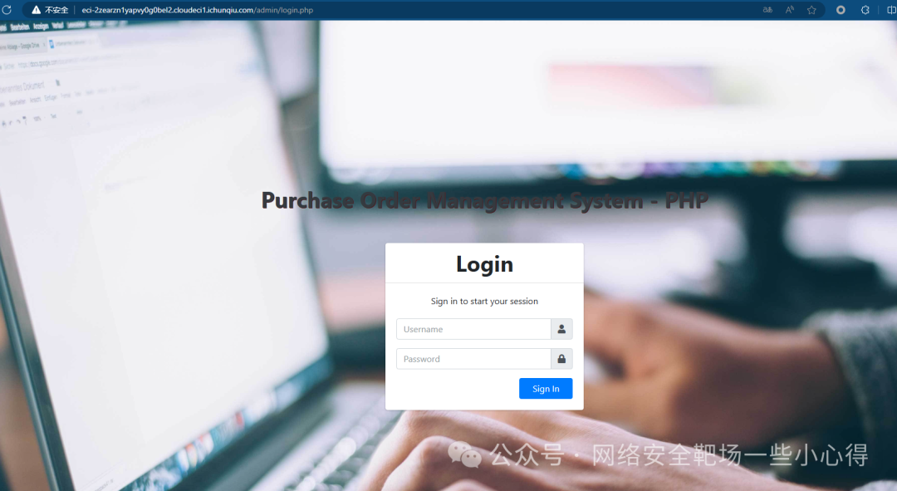
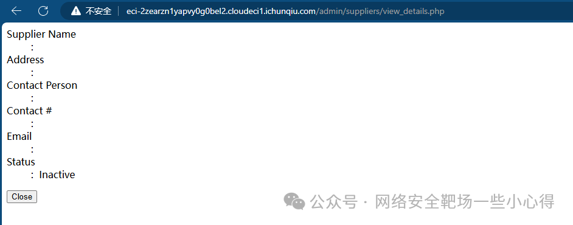
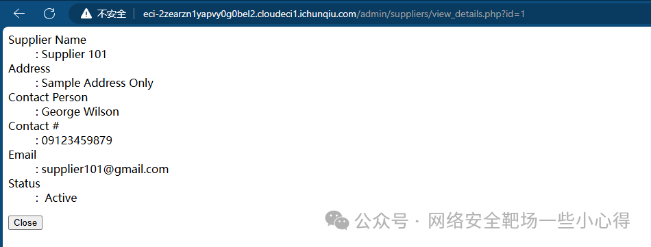
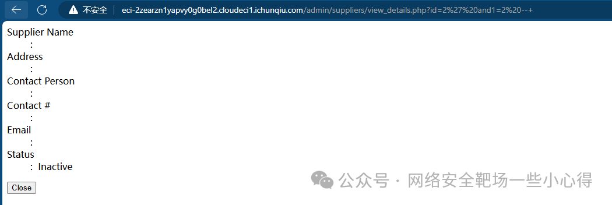
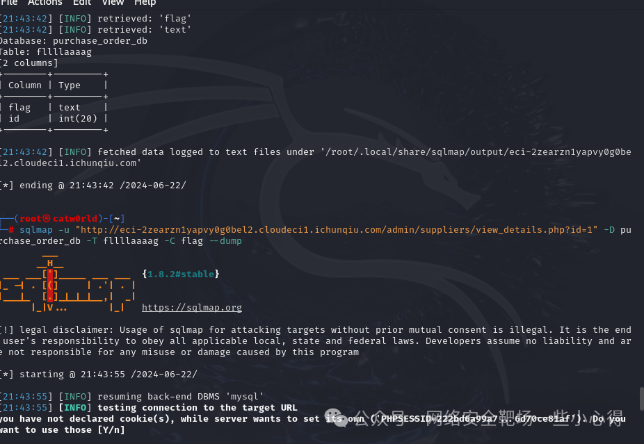
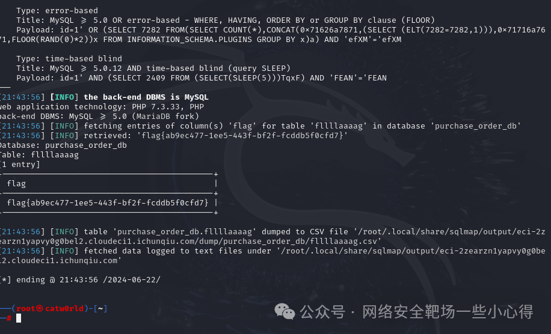

# 春秋云镜 CVE-2023-2130

## 编号角色补核（2026-10-04）

本次只确认编号在本文主题中的主编号／引用角色；版本、修复、截图及其他技术主张仍按下方具体待核说明阅读。旧字段和归档正文保持原值，较早的角色待核说明保留为历史记录。

核对依据：[CNA 记录](https://cveawg.mitre.org/api/cve/CVE-2023-2130)。这些记录支持编号／产品对应关系或编号状态，不替代本篇原始出处。

<!-- vulwiki-editorial-rebuild:system-misc -->
## 条目范围与校订

- 本文对象：SourceCodester Purchase Order Management System
- 文献类型：技术文章（细分类待核）
- 版本、权限及部署边界：补SQLi请求响应/认证前提；1.0只实验范围缺修复原始公告
- 核验状态：仅重建文本校订；未执行文中代码、PoC 或扫描，未把截图或转载声明记为本站复现

### 具体结论与待核项

以下为原归档的逐项勘误与证据缺口；可由文本确定的问题已在下文订正，仍缺来源的事实保持待核。

1. 春秋云镜是实验平台非漏洞产品
2. 唯一实质文字id=1有数据不证明注入，sqlmap参数输出全在图片
3. 补SQLi请求响应/认证前提
4. 1.0只实验范围缺修复原始公告
5. 不把靶场通关视为生产通用验证

### 操作风险

原文技术操作的实际副作用未复现核验；按其请求/代码评估状态变更、凭据暴露和业务影响

技术请求、代码与实验方法按原文保留；其中的破坏性动作仅限授权、可恢复的隔离环境。缺失代码、参数或版本事实不猜补。

### 来源追溯

- 原始披露 URL 未确认；既有归档来源标签保留，不能替代原始公告

### 归档技术正文

原创 catw0rld  网络安全靶场一些小心得   2024-06-22 21:46  
  
靶场：  
  
  
  
靶机介绍：  
  
在SourceCodester采购订单管理系统1.0  
中发现了一项被分类为关键的漏洞。受影响的是组件GET参数处理器的文件/admin/suppliers/view_details.php中的一个未知函数。对参数id的操纵导致了SQL注入。可以远程发起攻击。  
  
给出的地址进行访问  
  
  
  
将参数拼接  
  
  
  
SQL注入的话，尝试id=1  
  
  
  
有数据  
  
  
  
id存在SQL注入，直接扔sqlmap跑  
  
  
  
  
  
  

---

> 来源：gelusus/wxvl（微信公众号漏洞文章自动归档，原始披露 URL 尚未确认，现有链接按来源追溯区分别标注）
