# 某 RCE 漏洞复现、排查与监测

> 编号角色校订（2026-10-04）：按归档技术正文区分主讨论编号与背景引用，更新 `primary_identifiers` / `referenced_identifiers` 及旧字段角色。旧编号原值、状态与正文保持原样，变更前字段逐字保存在 `previous_*`；后文旧的角色待核说明应按当前字段阅读。这里的角色判读不等于官方分配核验或漏洞复现。

<!-- vulwiki-editorial-rebuild:system-misc -->
## 条目范围与校订

- 本文对象：向日葵Sunlogin CNVD-2022-10270 复现与检测
- 文献类型：技术文章（细分类待核）
- 版本、权限及部署边界：缺正式影响范围/修复版本与官方公告
- 核验状态：仅重建文本校订；未执行文中代码、PoC 或扫描，未把截图或转载声明记为本站复现

### 具体结论与待核项

以下为原归档的逐项勘误与证据缺口；可由文本确定的问题已在下文订正，仍缺来源的事实保持待核。

1. 大量代码块整体错位：BPF位置是隐藏调试器、PsExec位置是FOFA、隐藏调试器位置是Python正则、Python位置是pcre工具、PCRE位置是Sysmon等，显著破坏操作
2. fofa元数据抽成叙述句，正文完整指纹却在错误节
3. 实验11.0.0.33162x64/Win7明确，监听49218与BPF49168不一致，端口可变需统一
4. PCRE /check?未转义?会作用k而非字面问号，规则需核，作者已承认绕过风险
5. 5条样本5告警不证明完整检测效果，原pcap/规则整体未附
6. 源码路由/令牌请求多图无完整文本，nslookup扩展有独立价值
7. PsExec需先管理员不是本漏洞提权方法
8. 缺正式影响范围/修复版本与官方公告

### 操作风险

原文技术操作的实际副作用未复现核验；按其请求/代码评估状态变更、凭据暴露和业务影响

技术请求、代码与实验方法按原文保留；其中的破坏性动作仅限授权、可恢复的隔离环境。缺失代码、参数或版本事实不猜补。

### 来源追溯

- 原文标注出处：<https://mp.weixin.qq.com/s/46bVlM0J1m04UMpb5rSoKg>

### 归档技术正文

<meta name="referrer" content="no-referrer"/>

> 本文由 [简悦 SimpRead](http://ksria.com/simpread/) 转码， 原文地址 [mp.weixin.qq.com](https://mp.weixin.qq.com/s/46bVlM0J1m04UMpb5rSoKg)

  

本文为看雪论坛优秀文章

看雪论坛作者 ID：Jtian

```
netstat -ano | findstr LISTEN
tasklist | findstr SunloginClient
```

**1、****基础环境**

测试服务器：Win7 虚拟机  
测试服务器 IP：192.168.220.134  
软件版本：SunloginClient_11.0.0.33162_X64  
EXP 下载地址：https://github.com/Mr-xn/sunlogin_rce （感谢开源作者）

**2、复现流程**
----------

在 Win7 虚拟机里执行 SunloginClient_11.0.0.33162_X64.exe  
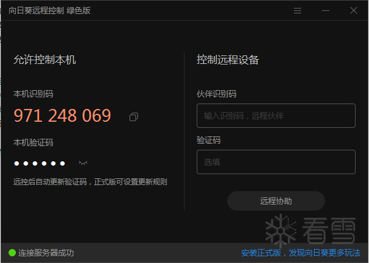  
查看对外开放端口，这里为 49218，这个端口不是固定的，重启程序会变。  
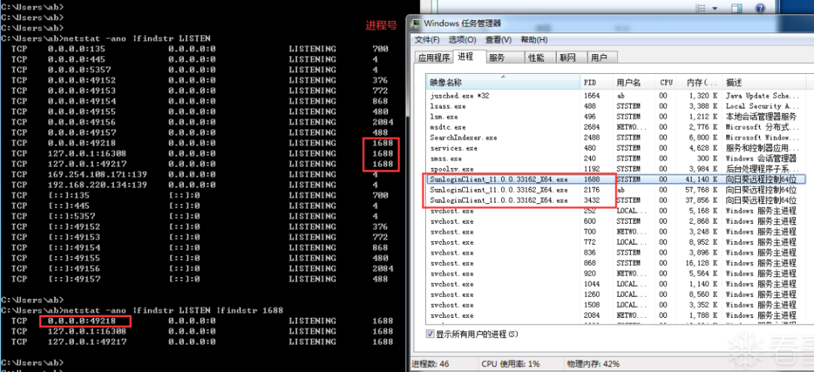  
配合查找的命令：

```
host 192.168.220.134 and tcp port 49168
```

测试 exp，命令执行成功，是 system 权限：  
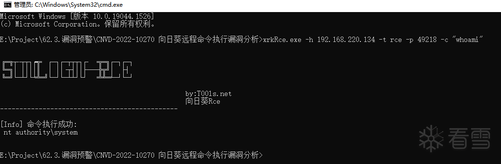

```
PsExec64.exe -i -s cmd
```

**1、EXP 源码分析**

其实直接看 exp 源码，也能猜个差不多，莫过于：  
（1）授权认证出了问题，任意用户可以获得访问令牌；  
（2）存在命令注入问题。  
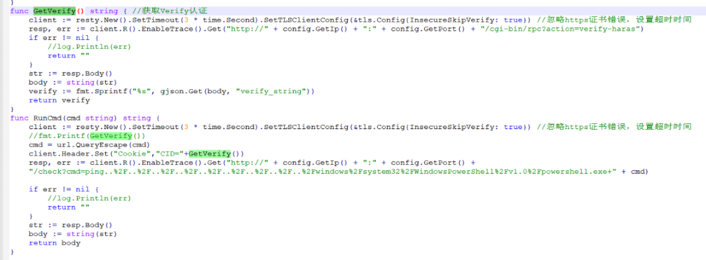  
对导致命令执行的 url 进行 url 解码可以看的更清楚些：  
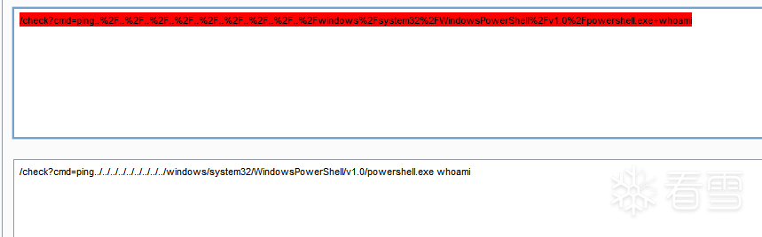

**2、流量分析**
----------

执行 exp，并使用 wireshark 抓包。

  
抓包时可以使用 bpf 语句过滤掉无关的报文，如：

```
调试->高级->隐藏调试器（PEB）
```

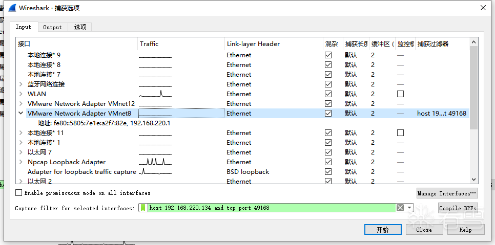  

对抓包结果进行分析，请求令牌，存在未授权访问的问题：  
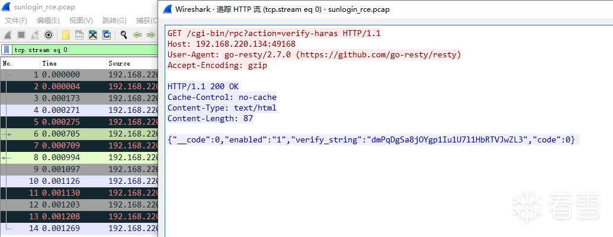  
命令执行，存在命令注入的问题：  
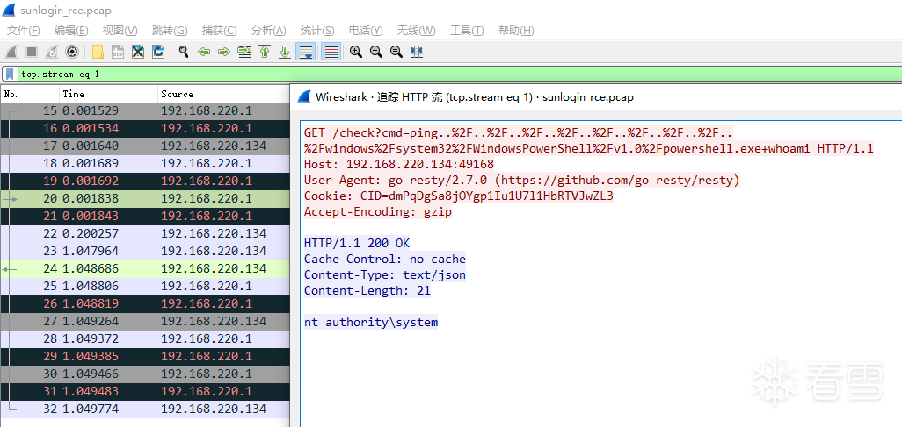

**3、为了定位命令执行的关键代码位置**
---------------------

### **（1）行为分析**

使用 Procmon 对程序进行行为分析，找到命令执行的关键函数，CreateProcessA。其实不用找，大概也能猜出来，可以把常见造成命令执行的函数都下个断点，断下来之后再进行判断。  

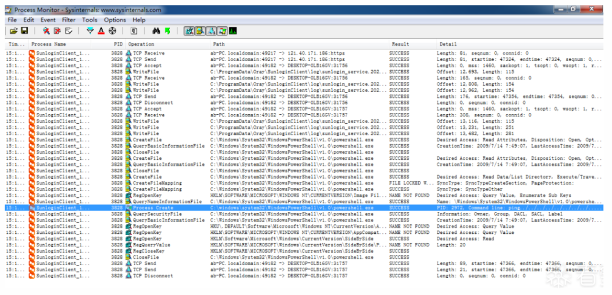

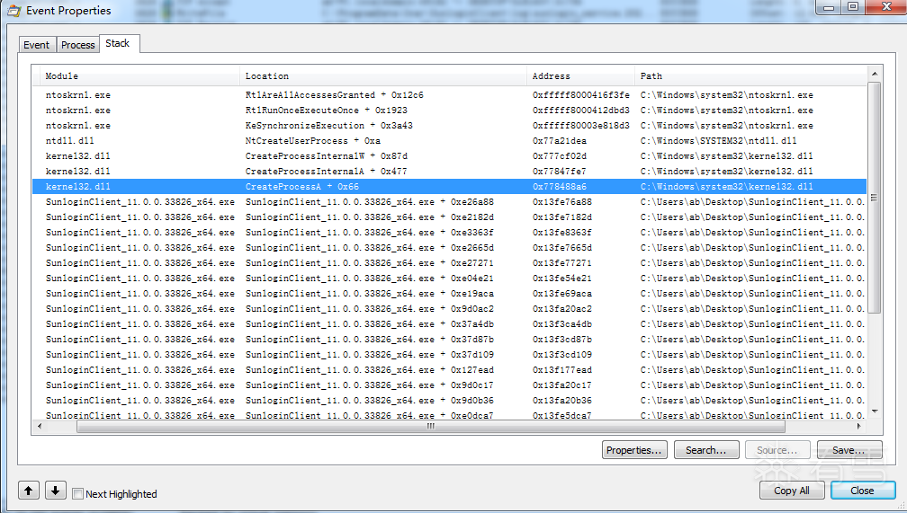

### **（2）动态调试**

小技巧，使用 PsExec 得到 system 权限：

```
body="Verification failure" && body="false" && header="Cache-Control: no-cache" && header="Content-Length: 46" && header="Content-Type: application/json"
```

以 system 权限启动 x64dbg，以方便附加调试目标进程：  
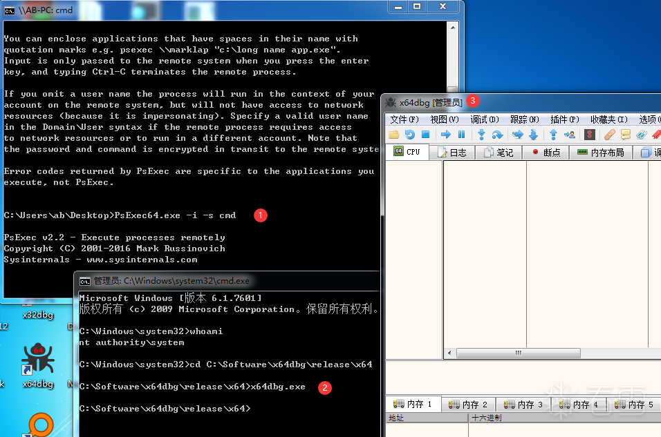  

在调试时需要隐藏调试器，否则在调试过程中会报异常：

```
import re
 
a=r'''{"__code":0,"enabled":"1","verify_string":"ysDRmcQu37usMmdA60fniHTv3cJzlWHz","code":0}'''
filter=re.compile(r'''"verify_string":"(\S+?)",''')
res = filter.findall(a)
print(res)
```

对 CreateProcessA 函数下断点，然后执行 exp 触发断点：  

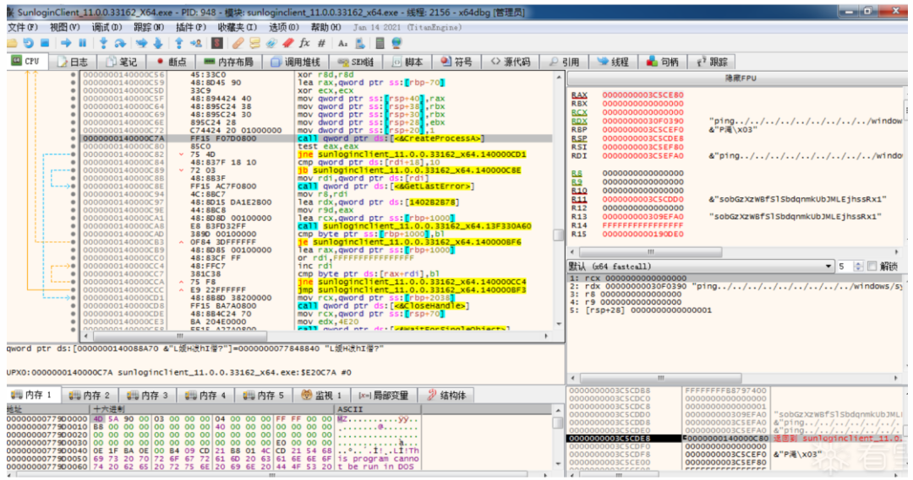

### **（3）静态分析**

有个 upx 壳，使用 “upx -d” 直接脱掉。脱掉后的程序直接运行的话，还是会报错，没有探究原因，不过 ida 可以正常分析了。

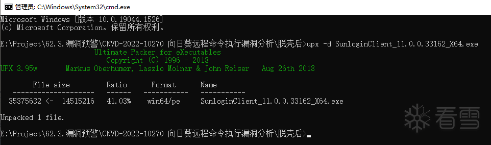

根据动态调试的结果，可以很快定位到关键代码位置。找到 URL 路由，这可以用来分析其他 api 功能。另外，发现除了 exp 里提到的 ping 可以导致命令执行，nslookup 也是可以的，可以自行编写脚本测试。  

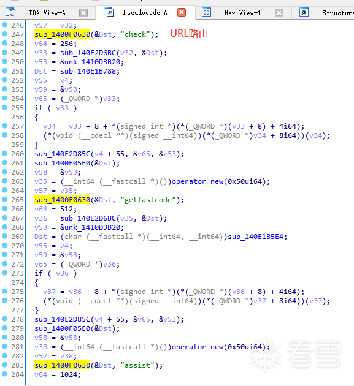  
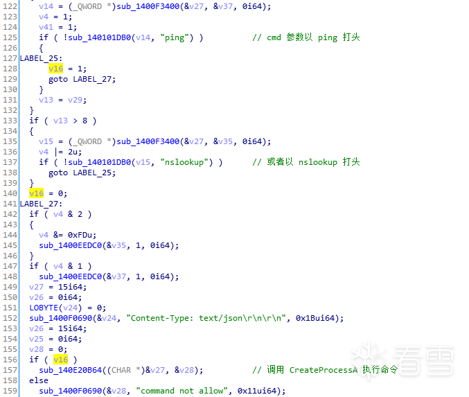

```
  /\/check?.*cmd[\s]*?=(?:ping|nslookup).*?(?:\.\.\/|\.\.\\)/
```

**编写 Goby 脚本**  

### （1）配置 “漏洞信息”：

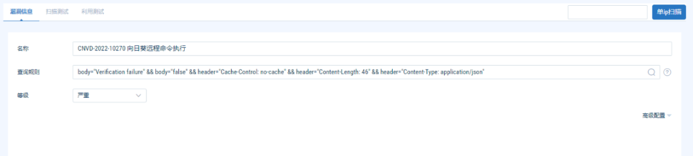  
这里的指纹信息十分关键，Goby 在扫描的时候，会先扫描资产，这个指纹就是用来判断资产种类的，匹配上指纹之后，才会打对应的 poc。指纹的好坏，直接决定了扫描速度。

Goby 语法和 fofa 是一致的，这里匹配的是 "GET /" 的应答，因为 Goby 在做资产探测的时候不会探测太多 URL。

```
[\s]*?=             匹配任意个空白符，非贪婪匹配，匹配最近的“=”
(?:ping|nslookup)    匹配 ping 或 nslookup，?:表示不获取匹配结果
(?:\.\.\/|\.\.\\)       匹配 ../ 或 ..\
```

### （2）配置 “扫描测试”

扫描测试有两个步骤，1. 获得访问令牌 CID；2. 带令牌执行命令。

#### Test1

访问获取令牌的 URL：  
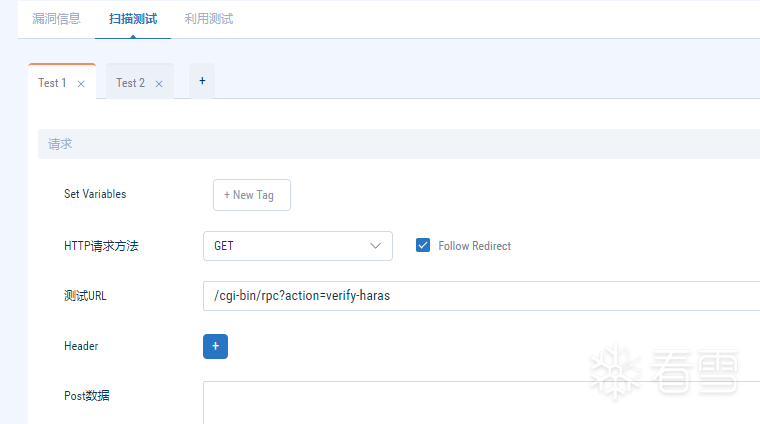  
指纹判断，如果访问成功，则根据正则提取 CID：  
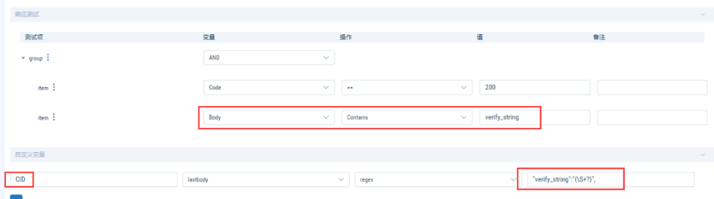  
可以用 python 快速测试正则：

```
apt install pcre2-utils
pcre2test
```

#### Test2

带 Cookie 访问命令执行的 URL，上一步设置的变量 CID 可以套三个大括号来使用，即 \{\\{\{CID\}\\}\}  
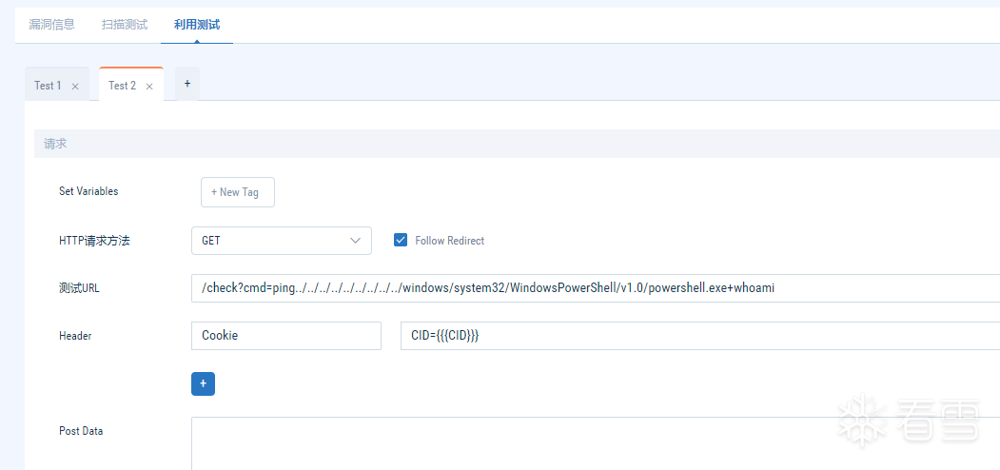

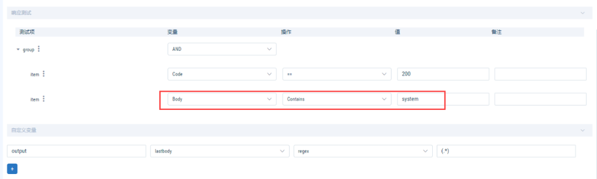

### （3）测试效果

测试效果，发现漏洞。  
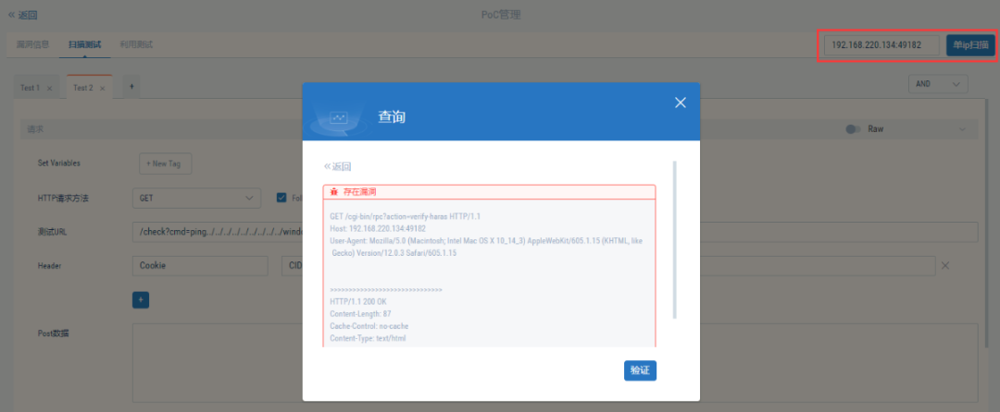  
测试过程可以使用 wireshark 抓包来辅助 poc 编写，也可以参考老的 poc 脚本，其目录在 goby-win-x64-1.8.293\golib\exploits\user，或者通过 poc 管理导出来也是可以的。  
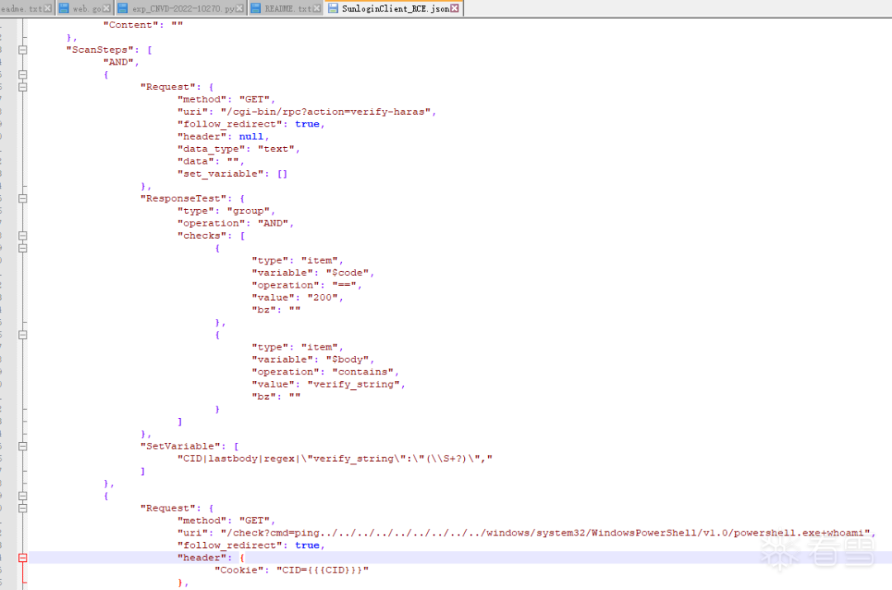

```
alert http any any -> any any (msg:"CNVD-2022-10270 SunloginClient RCE"; pcre:"/\/check?.*cmd[\s]*?=(?:ping|nslookup).*?(?:\.\.\/|\.\.\\)/U"; classtype:attempted-admin; sid:22022801; rev:2;)
```

**1、****流量监测**

### （1）尽可能多的生成多种形式的攻击流量

### 考虑合理变形，尽可能多的生成多种形式的攻击流量，以便用来测试检测规则。

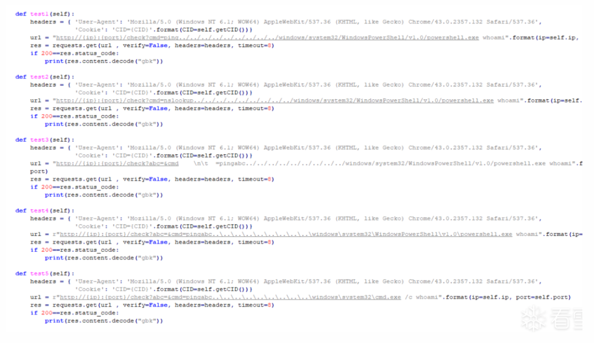

打 poc 的同时，用 wireshark 抓包，这里得到攻击流量包 sunlogin_rce_multi_payload.pcap  

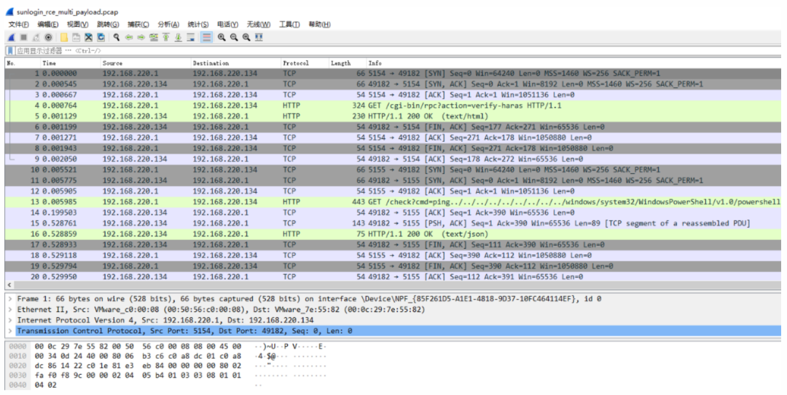

### （2）编写规则并测试

测试环境为 Kali-Linux-2021.2-vmware-amd64，suricata 版本为 6.0.4 。

根据 payload 编写 pcre 正则：

```
rule-files:
  #- suricata.rules
  - test.rules
```

正则解释：

```
suricata -r sunlogin_rce_multi_payload.pcap
```

测试 pcre 正则：

```
  Sysmon64.exe -i
```

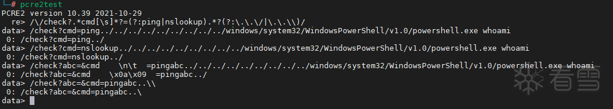

编写 suricata 规则

  
此规则可以应对正常攻击和部分变形，但依然存在被绕过的可能。规则写严了容易漏报，写松了容易误报，另外还应该要考虑报文分片传输、丢包的问题。

  
vim /etc/suricata/rules/test.rules

```
事件查看器 ->应用程序和服务日志 ->Microsoft ->Windows ->Sysmon
```

/U 里的 U 表示在标准 uri 上进行 pcre 匹配（区别于 http_raw_uri，类似于 http_uri，相当于 URL 解码后再匹配）。

vim /etc/suricata/suricata.yaml

```
rule-files:
  #- suricata.rules
  - test.rules
```

测试 suricata 规则，5 条攻击报文触发了 5 次告警，测试成功。

```
suricata -r sunlogin_rce_multi_payload.pcap
```

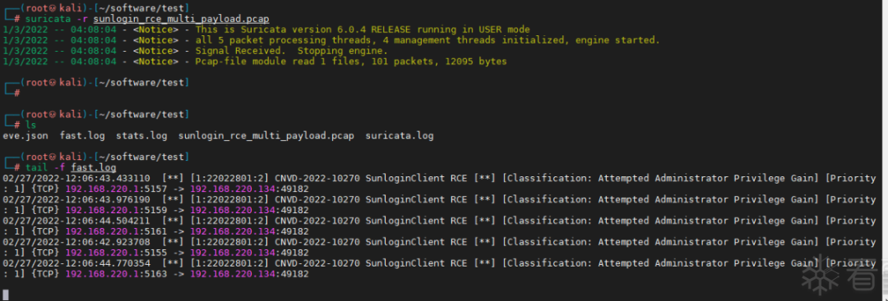

流量监测相关资料  
https://suricata.readthedocs.io/en/suricata-6.0.0/rules/  
https://rocknsm.io/  
https://github.com/arkime/arkime

**2、终端监测**
----------

windows 下的事件监控可以用 sysmon，Linux 下则可以用 auditd，然后借助 wazuh 来管理日志。

```
  Sysmon64.exe -i
```

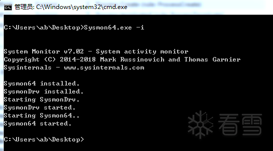

```
事件查看器 ->应用程序和服务日志 ->Microsoft ->Windows ->Sysmon
```

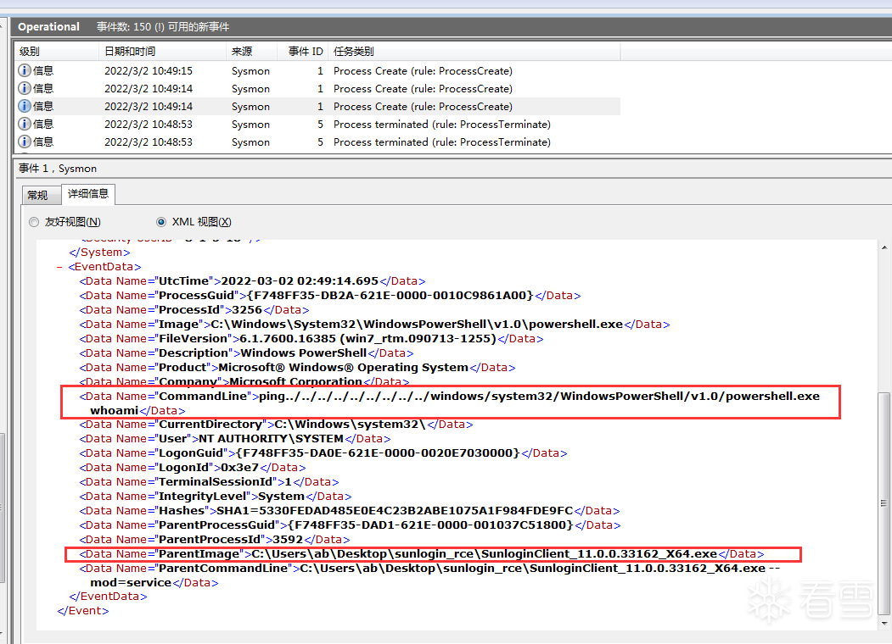

终端监测相关资料：  
_https://www.sysgeek.cn/sysmon/；  
https://www.maliciouskr.cc/2018/11/15 / 使用 OSSEC 构建主机层入侵检测 /  
https://blog.csdn.net/single7_/article/details/110038117_


  

**看雪 ID：Jtian**

https://bbs.pediy.com/user-home-598931.htm

* 本文由看雪论坛 Jtian 原创，转载请注明来自看雪社区

[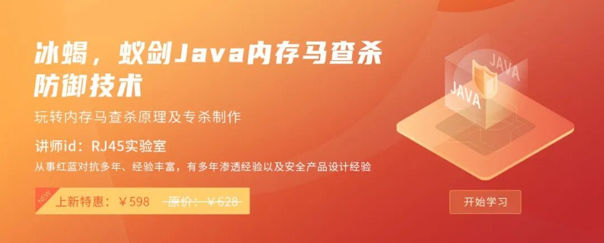](http://mp.weixin.qq.com/s?__biz=MjM5NTc2MDYxMw==&mid=2458489324&idx=3&sn=3643f4f46671c220cbede17182f292d5&chksm=b18ea16686f9287098b2a18599b60fc790b66c114880203b7956a913ad3e2e1d3cdfc9f8a2e7&scene=21#wechat_redirect)

**#** **往期推荐**

1.[CVE-2022-21882 提权漏洞学习笔记](http://mp.weixin.qq.com/s?__biz=MjM5NTc2MDYxMw==&mid=2458471430&idx=1&sn=6a47d0c5c8f3f6204548e80977ecd059&chksm=b18e7c8c86f9f59a88d9b8e83c8297e0ef65034a73436998ab835531baadaa51f3d630793b95&scene=21#wechat_redirect)  

2.[wibu 证书 - 初探](http://mp.weixin.qq.com/s?__biz=MjM5NTc2MDYxMw==&mid=2458471429&idx=1&sn=a85188de9b9697fd1b9e708bb8bb1fdb&chksm=b18e7c8f86f9f59933d6cbf0040ed796f06e37b23f17f1ae842eb22257de02338e1a8d751f6b&scene=21#wechat_redirect)

3.[win10 1909 逆向之 APIC 中断和实验](http://mp.weixin.qq.com/s?__biz=MjM5NTc2MDYxMw==&mid=2458471421&idx=2&sn=e83cf7220dc1c4c06a2efc78593e30cc&chksm=b18e7b7786f9f2614ecce34e23be7f71a3d3516766aabda8f25ae41c81ef359a2c245503cf86&scene=21#wechat_redirect)

4.[EMET 下 EAF 机制分析以及模拟实现](http://mp.weixin.qq.com/s?__biz=MjM5NTc2MDYxMw==&mid=2458468723&idx=2&sn=5a830d04185d80e1b6cfa639dc6c6c15&chksm=b18e71f986f9f8ef5b3c2fec51f69751e63a5d6bdbadf43b49728ba05606fc4ac63fda378c92&scene=21#wechat_redirect)

5.[sql 注入学习分享](http://mp.weixin.qq.com/s?__biz=MjM5NTc2MDYxMw==&mid=2458468108&idx=1&sn=42c8ec155e13e3882cf4aeb60cdbb982&chksm=b18e0f8686f98690c9792298abb04dd243862ff8effd545dc668c7b1c682aaacf9797d899e97&scene=21#wechat_redirect)

6.[V8 Array.prototype.concat 函数出现过的 issues 和他们的 POC 们](http://mp.weixin.qq.com/s?__biz=MjM5NTc2MDYxMw==&mid=2458468074&idx=2&sn=06eb27c1649bd4e3a3e43a46a9500add&chksm=b18e0e6086f9877644ba0de33658232f99213d1b1b074342260031cb529c1b7ad1b89b2e0204&scene=21#wechat_redirect)

  


**球分享**


**球点赞**


**球在看**


点击 “阅读原文”，了解更多！

---

> 来源：MrWQ/vulnerability-paper（https://github.com/MrWQ/vulnerability-paper）
