# 根据POC分析代码

## 编号角色补核（2026-10-04）

本次只确认编号在本文主题中的主编号／引用角色；版本、修复、截图及其他技术主张仍按下方具体待核说明阅读。旧字段和归档正文保持原值，较早的角色待核说明保留为历史记录。

核对依据：[CNA 记录](https://cveawg.mitre.org/api/cve/CVE-2023-41599)。这些记录支持编号／产品对应关系或编号状态，不替代本篇原始出处。

<!-- vulwiki-editorial-rebuild:system-misc -->
## 条目范围与校订

- 本文对象：JFinalCMS41599
- 文献类型：技术文章（细分类待核）
- 版本、权限及部署边界：缺版本权限/修复
- 核验状态：仅重建文本校订；未执行文中代码、PoC 或扫描，未把截图或转载声明记为本站复现

### 具体结论与待核项

以下为原归档的逐项勘误与证据缺口；可由文本确定的问题已在下文订正，仍缺来源的事实保持待核。

1. 标题泛化不可检索
2. getPara/renderFile等JFinal框架方法误称自己封装需核类归属
3. 主要源码请求响应全为截图，正文只有fileKey路径无完整接口
4. 缺版本权限/修复
5. 保留wy876对应PoC及官方JFinal方法文档，不能把应用路径校验缺陷归框架下载功能本身

### 操作风险

原文技术操作的实际副作用未复现核验；按其请求/代码评估状态变更、凭据暴露和业务影响

技术请求、代码与实验方法按原文保留；其中的破坏性动作仅限授权、可恢复的隔离环境。缺失代码、参数或版本事实不猜补。

### 来源追溯

- 原始披露 URL 未确认；既有归档来源标签保留，不能替代原始公告

### 归档技术正文

 赤弋安全团队   2025-02-17 00:00  
  
POC：  
```
https://github.com/wy876/POC/blob/main/JFinalCMS/JFinalCMS%20%E4%BB%BB%E6%84%8F%E6%96%87%E4%BB%B6%E8%AF%BB%E5%8F%96%E6%BC%8F%E6%B4%9E(CVE-2023-41599).md
```  
  
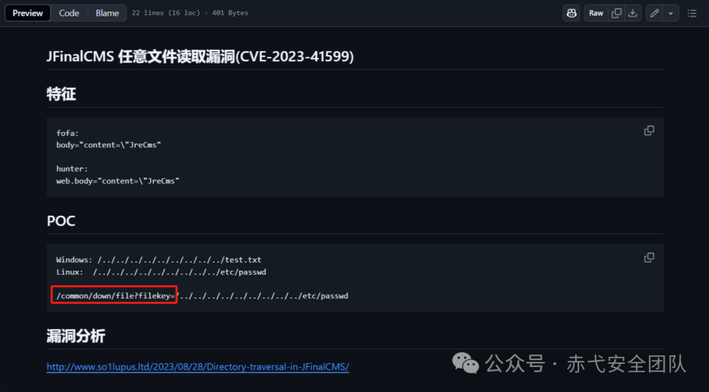  
  
根据 POC 找到相对应的接口。  
  
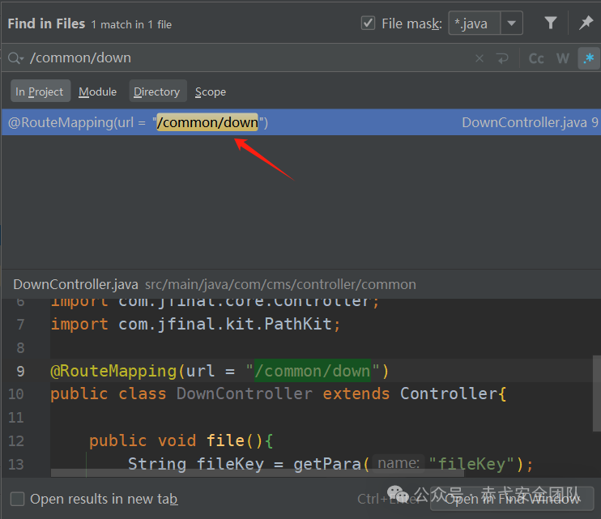  
  
找到接口之后，点击进入相对应的 java 文件。  
  
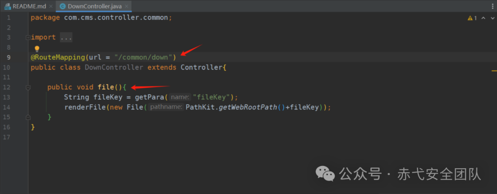  
  
这里 file() 方法也被拼接接口，应该是系统自己封装的方法，接着我们点击进入getPara  
。  
  
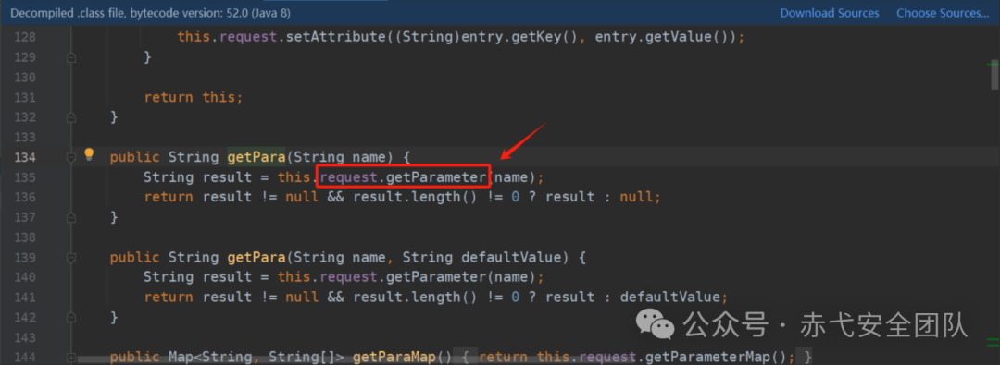  
  
很明显，这里就是使用了request.getParameter  
，获取了当前参数fileKey  
。  
  
接下来就是分析 renderFile  
函数，点击进去，然后定位代码位置。  
  
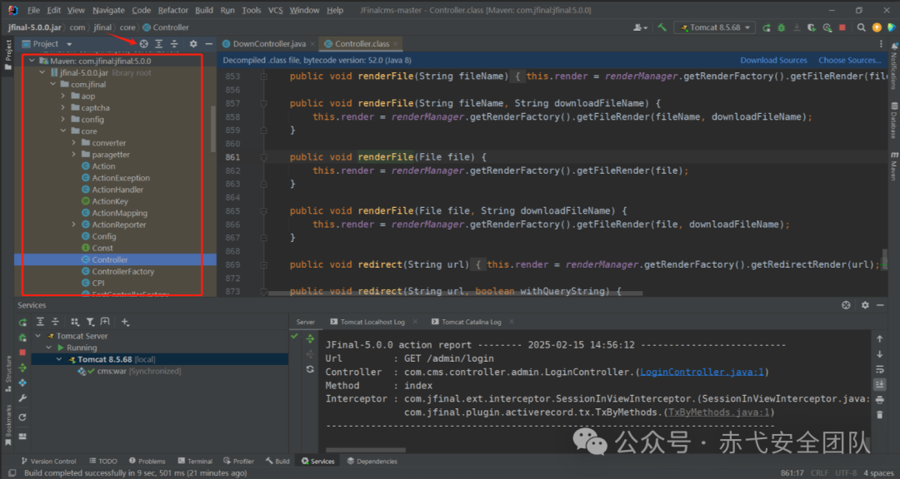  
  
很明显是自己封装的方法，我们直接网上搜索，查看它的文档。  
```
https://jfinal.com/doc/3-8
```  
  
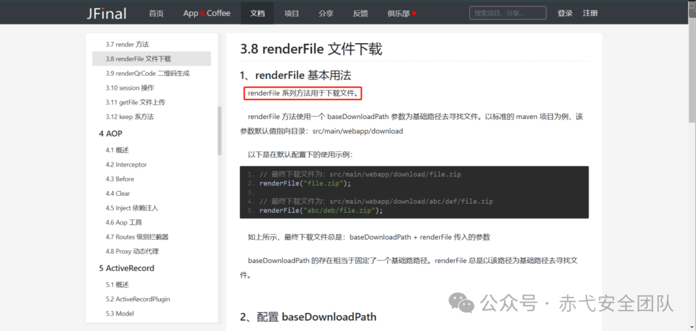  
  
可以看出，此方法就是用于下载文件的。  
  
接下来分析getWebRootPath()  
方法。  
  
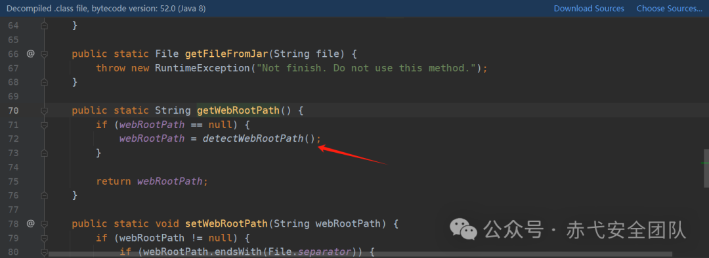  
  
这里显示，如果根路径为空，就让路径等于detectWebRootPath()  
。  
  
继续点击去detectWebRootPath()  
方法。  
  
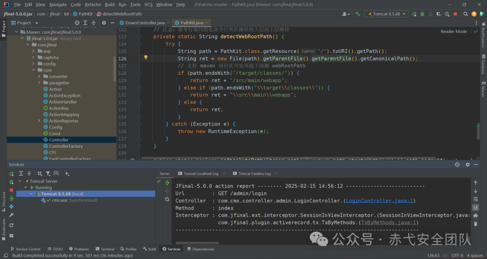  
  
此方法就是用来识别 web 根路径。  
  
接下来，打上断点，进行调试。  
  
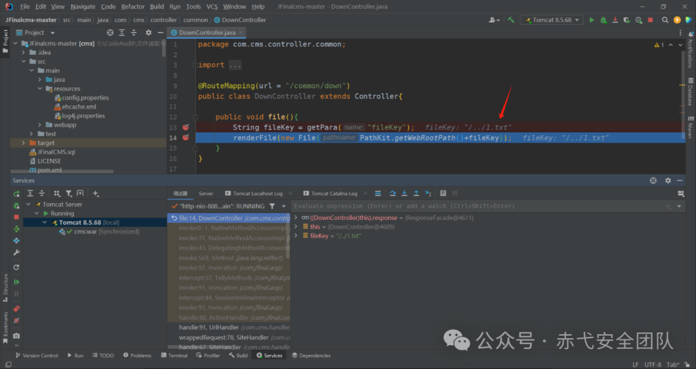  
  
fileKey=/../1.txt  
，继续下一个断点，进入 File()方法。  
  
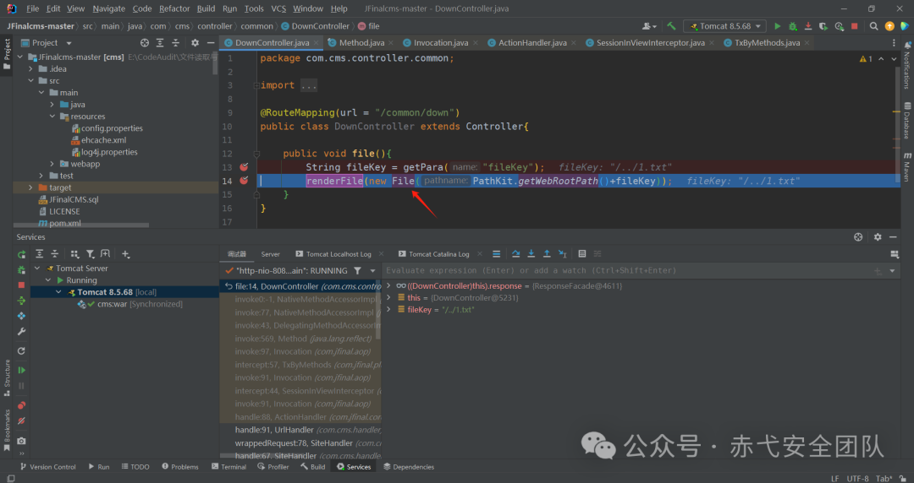  
  
调试得到根路径。  
  
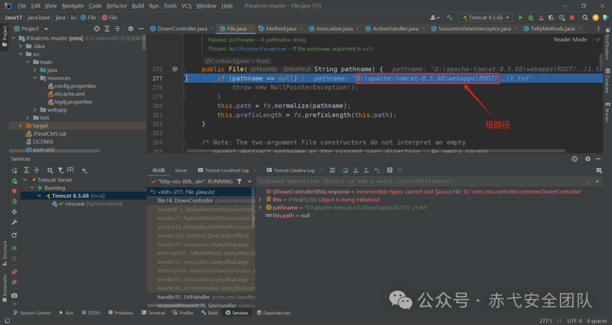  
  
成功读取到文件。  
  
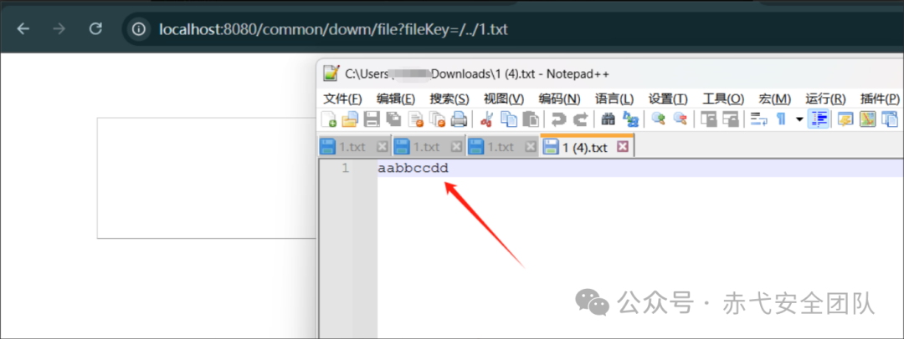  
  


---

> 来源：gelusus/wxvl（微信公众号漏洞文章自动归档，原始披露 URL 尚未确认，现有链接按来源追溯区分别标注）
