# 漏洞复现无垠智能模糊测试系统实战复现OpenSSL高危漏洞

> 编号角色校订（2026-10-04）：按归档技术正文区分主讨论编号与背景引用，更新 `primary_identifiers` / `referenced_identifiers` 及旧字段角色。旧编号原值、状态与正文保持原样，变更前字段逐字保存在 `previous_*`；后文旧的角色待核说明应按当前字段阅读。这里的角色判读不等于官方分配核验或漏洞复现。

<!-- vulwiki-editorial-rebuild:system-misc -->
## 条目范围与校订

- 本文对象：OpenSSL CVE-2022-3602/3786 商业模糊测试演示
- 文献类型：技术文章（细分类待核）
- 版本、权限及部署边界：>255邮箱普通长字符串不足说明punycode触发，memmove off-by-one具体条件应给真实代码；证书校验过程需证书链签名已通过或应用忽略验证失败等条件未列，不能任意证书直接网络RCE
- 核验状态：仅重建文本校订；未执行文中代码、PoC 或扫描，未把截图或转载声明记为本站复现

### 具体结论与待核项

以下为原归档的逐项勘误与证据缺口；可由文本确定的问题已在下文订正，仍缺来源的事实保持待核。

1. 多处中文堆缓冲区溢出配英文stack，实际根因叙述为栈，需统一
2. >255邮箱普通长字符串不足说明punycode触发，memmove off-by-one具体条件应给真实代码
3. 证书校验过程需证书链签名已通过或应用忽略验证失败等条件未列，不能任意证书直接网络RCE
4. 3.0.0–3.0.6及3.0.7修复明确但披露2022年10月需区别预告与11月正式
5. 3786是另一个实际测试主实体，Log4j/BlueKeep等只是RCE背景
6. 2分钟/AI完全对齐只有截图无seed/harness/build/重复实验，属厂商演示不是性能验证
7. 参考全二手没有OpenSSL官方公告，清营销和空推荐链接

### 操作风险

原文技术操作的实际副作用未复现核验；按其请求/代码评估状态变更、凭据暴露和业务影响

技术请求、代码与实验方法按原文保留；其中的破坏性动作仅限授权、可恢复的隔离环境。缺失代码、参数或版本事实不猜补。

### 来源追溯

- 原始披露 URL 未确认；既有归档来源标签保留，不能替代原始公告

### 归档技术正文

原创 Yannis  云起无垠   2025-05-22 08:30  
  
  
  
本文将详细介绍如何使用无垠智能模糊测试系统复现OpenSSL中的CVE-2022-3602漏洞。平台不仅简化了模糊测试流程，还通过AI赋能大幅提升了漏洞挖掘的效率和准确性，为企业构建自动化安全测试体系提供了强有力的支持。  
  
  
  
**背景介绍**  
  
  
在网络安全领域，OpenSSL作为广泛应用的加密库，其安全性直接关系到众多系统和应用的安全。CVE-2022-3602 是存在于OpenSSL 3.0.0到3.0.6版本中的一个堆缓冲区溢出漏洞（stack-buffer-overflow），于2022年10月公开披露。最初被评为“严重”级别，后来降级为"高危"，CVSS 评分7.5（High）。  
  
该漏洞源于X.509证书验证过程中，当处理包含格式错误的电子邮件地址的证书时，可能导致4字节的缓冲区溢出 ，攻击者可利用此漏洞导致程序崩溃或潜在远程代码执行（RCE）。具体体现：  
  
1. 当证书包含超长Punycode编码的邮箱地址（若邮箱地址 > 255字符，如：example@aaaaaaaaaaaaaaaaaaaa...）  
  
2. OpenSSL的ossl_a2ulabel()函数未正确校验输入长度  
  
3. 导致堆栈缓冲区溢出（Stack Buffer Overflow）  
  
  
**漏洞剖析**  
  
  
1. 漏洞利用路径分析  
  
假设攻击者恶意构造一个特定长度的 Punycode 字符串（邮箱地址），漏洞的触发路径如下：  
- 入口点：当处理X.509证书时，OpenSSL会调用ossl_a2ulabel()函数，从参数使用ossl_punycode_decode()来解码Punycode字符串。  
  
  
  
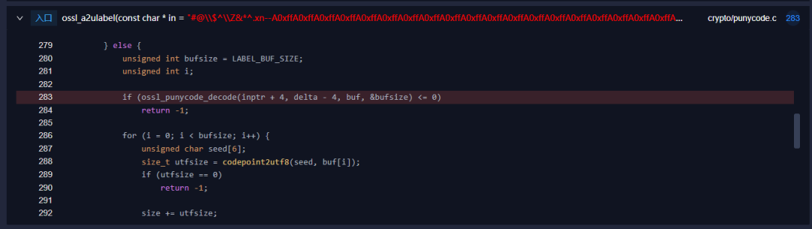  
  
- 漏洞触发点：在ossl_punycode_decode()中，首先会处理基本字符部分，然后进入主解码循环。漏洞的根本原因是内存移动memmove 操作导致的栈缓冲区溢出。  
  
  
  
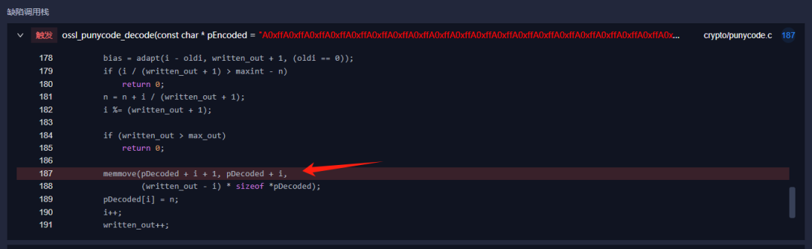  
  
触发原因是由于只检查了written_out > max_out，没有检查memmove操作不会超出缓冲区范围。当i很小而written_out很大时，移动的数据会超出pDecoded缓冲区的末尾，导致栈缓冲区溢出，写入到相邻的栈变量或返回地址。  
  
2. 此类漏洞易触发场景  
  
与CVE-2022-3602类似的堆缓冲区溢出漏洞（stack-buffer-overflow），触发条件存在共同特点：在处理特殊格式数据（如特殊字符序列）时，由于边界检查不足导致栈缓冲区溢出，从而可能被攻击者利用执行任意代码或造成拒绝服务。  
  
可能的触发场景：  
- 处理用户可控的输入数据（如证书、URL、文件名等）  
  
- 进行格式转换或编解码操作（如punycode、base64、URL编码等）  
  
- 缺乏充分的边界检查或长度验证  
  
- 使用固定大小的栈缓冲区存储可变长度数据  
  
3. 影响范围与危害  
  
由于CVE-2022-3602可能导致远程代码执行（RCE），官方初步将其标记为"严重"漏洞。然而，现代系统的堆栈溢出防护机制大幅削弱了其危害性，最终评级下调至“高危”。  
  
部分安全人员称CVE-2022-3602为HeartBleed2.0，但两者的利用门槛存在显著差异，但此漏洞的利用条件是要求攻击者能构造含恶意邮箱地址的证书，同时，目标系统需配置证书验证功能。而且仅影响OpenSSL 3.0.0到3.0.6版本，因此，它不会像HeartBleed那样易于被广泛利用。  
  
**Q：什么是远程代码执行？**  
  
A：远程代码执行（Remote Code Execution，简称RCE）是一种严重的安全漏洞，攻击者无需直接物理接触目标系统，可以通过网络连接，向存在漏洞的目标应用程序或服务发送特制的数据，从而在远程系统上执行恶意代码。  
  
**Q：远程代码执行有哪些常见攻击场景？**  
  
A：RCE漏洞常见于 Web应用程序的命令注入、反序列化漏洞、缓冲区溢出和第三方库缺陷中，历史上著名的案例包括：2021年的Log4Shell漏洞（CVE-2021-44228）影响了数百万使用Apache Log4j库的服务器；2019年的BlueKeep漏洞（CVE-2019-0708）影响Windows远程桌面服务；2021年的Microsoft Exchange ProxyLogon漏洞链（CVE-2021-26855等）被用于大规模入侵企业邮件服务器；2017年的WannaCry勒索软件利用 Windows SMB 协议中的EternalBlue漏洞（CVE-2017-0144）感染全球超过20万台计算机；以及 2014年的Shellshock漏洞（CVE-2014-6271）允许攻击者通过Bash shell执行命令，这些事件造成了数十亿美元的损失，影响了从医疗保健到政府机构的各行各业。  
  
  
**CVE-2022-3602漏洞复现**  
  
  
下面我们将使用无垠智能模糊测试系统，对CVE-2022-3602漏洞进行复现！  
  
1. 一键配置与构建  
  
无需手动配置复杂的编译环境，只需上传源码和基本编译信息。  
  
工程创建过程中，平台将自动完成OpenSSL编译构建、解析测试目标源码、生成函数列表、生成测试驱动，无需手动干预。  
  
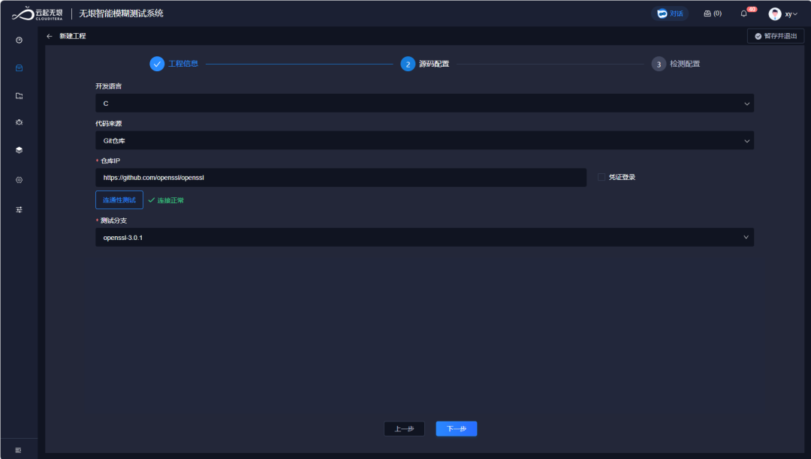  
  
2. 选择测试入口  
  
在新建工程过程中，平台自动解析测试目标，识别出项目内部可能存在风险的关键函数。  
  
当前我们需要复现CVE-2022-3602漏洞，重点关注危险函数ossl_a2ulabel()，选择特定测试入口即可。在测试入口列表，搜索入口函数ossl_a2ulabel()，发现平台  
已经自动识别出目标函数，并且基于语法和语义分析，  
自动生成了测试驱动！  
  
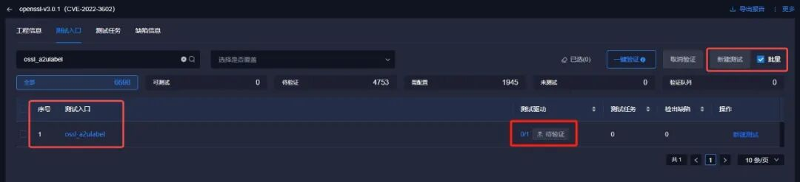  
  
  
3. 驱动验证  
  
在模糊测试前，进行驱动验证，需要试运行一下驱动的有效性，过滤掉那些编译错误、无效运行的低质量驱动，确保宝贵的机器资源和时间用在“刀刃”上。  
  
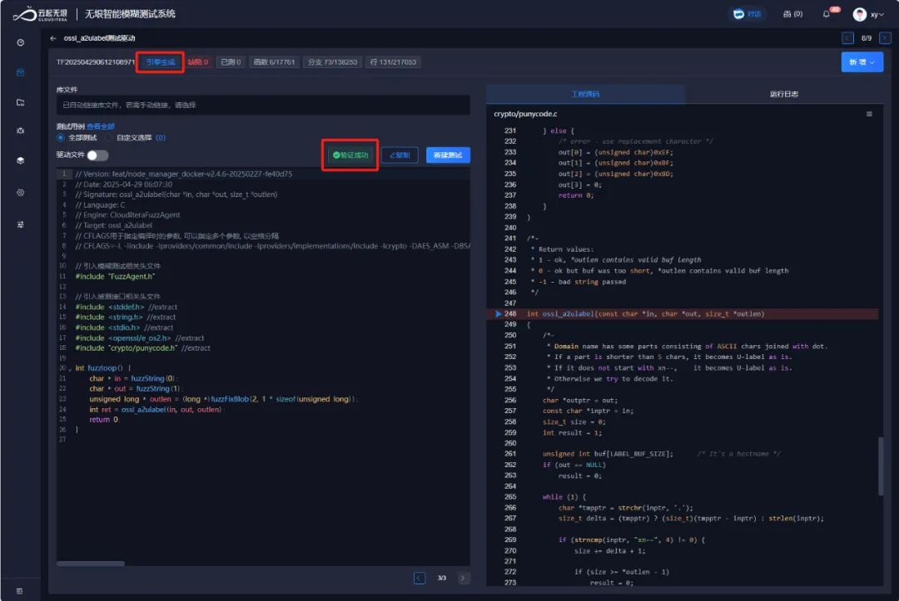  
  
图 引擎自动生成  
  
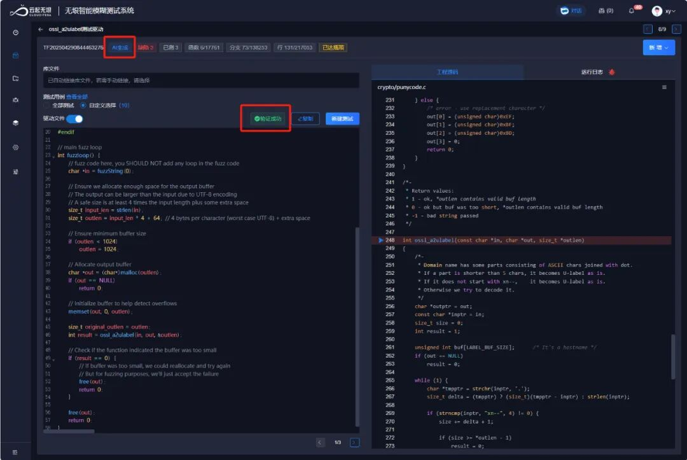  
  
图 AI生成测试驱动  
  
4. 运行模糊测试  
  
对全部或特定可测试入口，批量新建测试任务，使用系统默认配置，即可快速创建任务。  
  
正常情况下，我们可以  
一键对全部可测函数进行驱动验证、下发测试任务。  
  
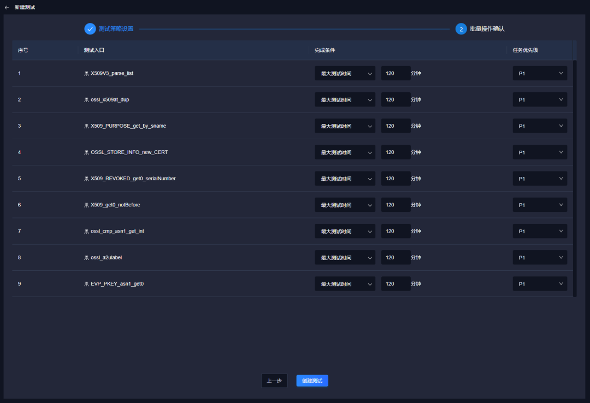  
  
  
图 测试任务设置  
  
测试过程中，系统实时监控测试进度和代码覆盖率，结合覆盖率反馈，自动生成测试用例、探索测试路径，以最大化漏洞触发概率。  
  
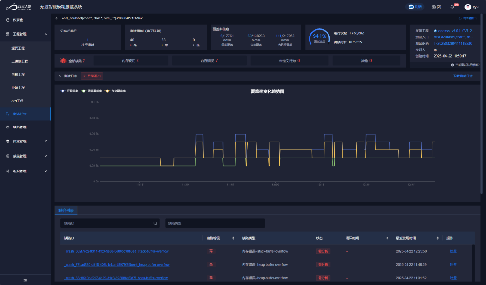  
  
  
  
图 测试运行界面  
  
5. 分析测试结果，识别潜在问题  
  
测试结果：仅用2分钟，平台成功触发了CVE-2022-3602漏洞！  
  
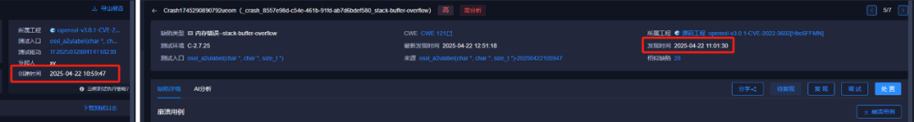  
  
缺陷详情中，平台展现出精准的缺陷定位能力，并提供详细缺陷信息：  
- 精确定位到crypto/punycode.c中缺陷触发位置  
  
- 可视化展示崩溃用例，并自动生成用例复现POC  
  
- 追踪崩溃用例执行路径，详细记录并可视化调用栈、及用例值变化  
  
- 提供完整崩溃堆栈和内存状态分析  
  
- 快捷复现和GDB调试  
  
- AI自动评判风险等级、缺陷成因，并提供代码修复建议，辅助缺陷确认和修复  
  
  
  
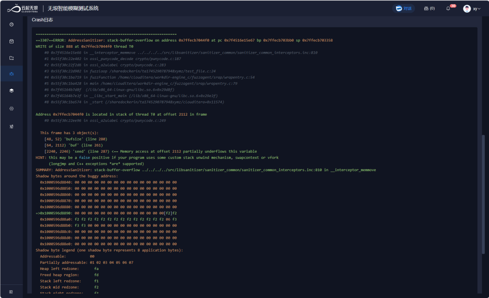  
  
6. 缺陷修复方案对比  
  
前面分析CVE-2022-3602漏洞触发原因之一是由于只检查了written_out > max_out，没有检查memmove操作不会超出缓冲区范围。  
  
OpenSSL官方在3.0.7版本对漏洞CVE-2022-3602提交了补丁，修复方案如下：  
  
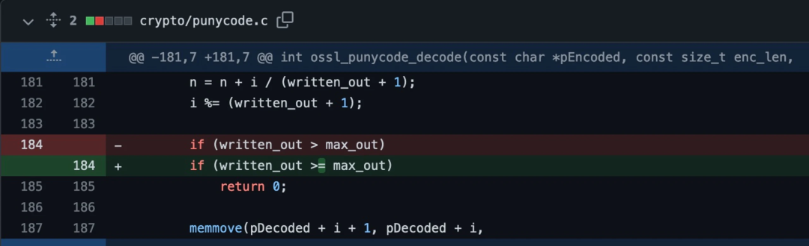  
  
下面，我们来看看平台使用AI对缺陷的分析和修复方案：  
  
AI对缺陷触发原因的分析：  
漏洞成因分析和  
理解正确！  
  
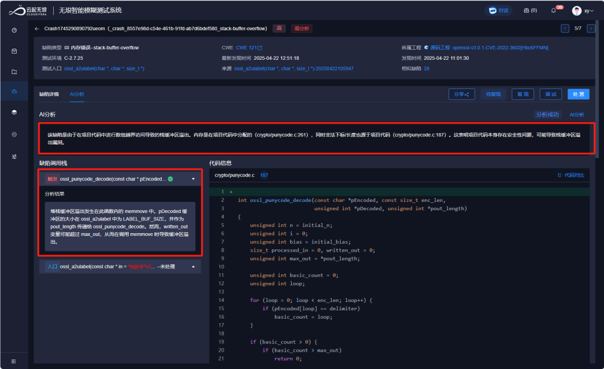  
  
AI提出的修复方案：与OpenSSL 3.0.7官方补丁的实现  
完全技术对齐！  
  
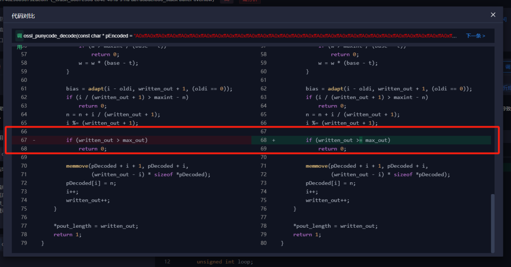  
  
7. 同时复现CVE-2022-3786漏洞  
  
值得一提的是，此测试任务同时检出了CVE-2022-3786漏洞，该漏洞的触发场景是，攻击者恶意制作包含特定电子邮件地址的证书，以溢出包含"."的任意字节数，此缓冲区溢出漏洞可能导致服务崩溃。  
  
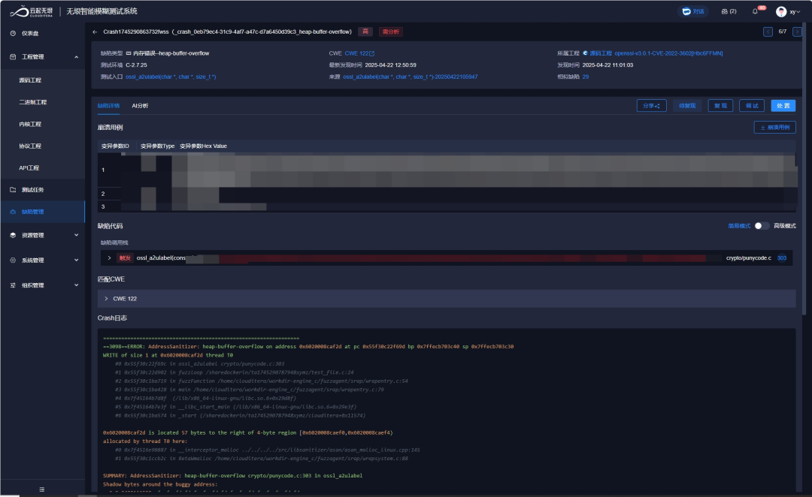  
  
  
**精准破局：两大痛点，智能解法**  
  
  
1. 传统模糊测试的人工依赖痛点  
  
传统方法需要安全测试人员手动编写测试驱动，熟悉测试目标内部代码结构，且往往难以覆盖复杂的分支条件。测试环境配置繁琐，容易遇到编译错误和依赖冲突。  
  
无垠智能模糊测试系统解决方案：  
- 智能识别：基于代码语法与语义理解，自动锁定测试入口  
  
- 驱动生成自动化：由引擎与大语言模型（LLMs）驱动，无需人工编写测试驱动  
  
- 定制化用例：智能生成契合测试目标特性的测试用例  
  
- 环境配置无忧：自动化完成编译环境搭建与依赖安装  
  
2. 漏洞定位与修复效率低下  
  
传统方法中，即使触发了漏洞，定位根因和修复建议仍需大量人工验证和分析。  
  
无垠智能模糊测试系统解决方案：  
- 精准溯源：凭借先进缺陷定位技术，自动追溯漏洞触发根源  
  
- 可视化呈现：以直观图表展示缺陷调用流程，清晰呈现触发路径  
  
- 深度分析：提供详细缺陷详情，结合 LLMs 解析成因，助力复现验证  
  
- 智能修复：依托 LLMs 输出专业缺陷修复方案，加速漏洞闭环  
  
  
  
  
**五大核心价值，护航软件安全**  
  
  
相比传统安全工具，无垠智能模糊测试系统具有如下价值：  
- 效率飞跃：将传统数周的漏洞挖掘周期压缩至数小时，大幅提升测试效率  
  
- 零门槛操作：无需专业安全背景，普通人员也能高效开展模糊测试  
  
- 全面覆盖：智能变异策略深度探索代码分支，显著提升测试覆盖率  
  
- 全流程自动化：从环境配置、测试执行到漏洞分析，实现一站式自动化闭环  
  
- 广泛兼容：适配开源、闭源等各类被测软件，满足多样化安全测试需求  
  
立即联系我们，解锁无垠智能模糊测试系统的强大能力，为您的软件安全筑牢防线！  
  
参考链接：  
  
https://www.freebuf.com/articles/vuls/349195.html  
  
https://www.secrss.com/articles/48582  
  
https://snyk.io/blog/breaking-down-openssl-vulnerability/  
  
安全极客是一个致力于信息安全知识共享与交流的专业社区平台，主要围绕**GPTSecurity、智能模糊测试、软件供应链安全、红蓝攻防**  
四大主题构建内容分享生态。云起无垠作为联合发起方，欢迎广大安全专家的加入，共同探讨前沿安全技术，促进行业内的知识分享与合作。  
  
  
  
  
  
**更多阅读**  
  
  
  
  
  
  
  
  
  
  
  
  
  
  
  
  
  

---

> 来源：gelusus/wxvl（微信公众号漏洞文章自动归档，原始披露 URL 尚未确认，现有链接按来源追溯区分别标注）
