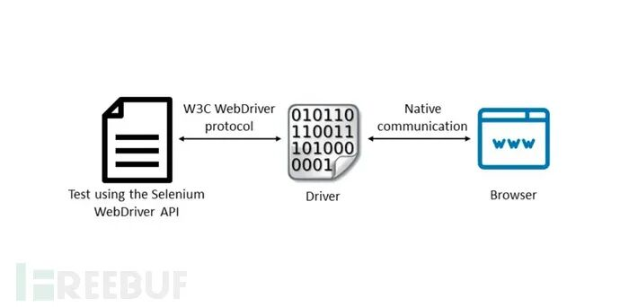

# 热门Selenium库WebDriverManager曝出CVSS 9.3分的严重XXE漏洞

<!-- vulwiki-editorial-rebuild:system-misc -->
## 条目范围与校订

- 本文对象：bonigarcia WebDriverManager
- 文献类型：技术文章（细分类待核）
- 版本、权限及部署边界：CVSS9.3版本向量来源缺
- 核验状态：仅重建文本校订；未执行文中代码、PoC 或扫描，未把截图或转载声明记为本站复现

### 具体结论与待核项

以下为原归档的逐项勘误与证据缺口；可由文本确定的问题已在下文订正，仍缺来源的事实保持待核。

1. 4641缺元数据
2. 反序列化/外部实体爆破术语不准确
3. 需要控制被解析XML来源，不是所有安装库即可远程攻击
4. 6.0.2和secure_processing修复片段需官方commit确认，单开关不普遍保证禁外部实体
5. 只有FreeBuf二手来源，无请求PoC
6. CVSS9.3版本向量来源缺

### 操作风险

原文技术操作的实际副作用未复现核验；按其请求/代码评估状态变更、凭据暴露和业务影响

技术请求、代码与实验方法按原文保留；其中的破坏性动作仅限授权、可恢复的隔离环境。缺失代码、参数或版本事实不猜补。

### 来源追溯

- 原始披露 URL 未确认；既有归档来源标签保留，不能替代原始公告

### 归档技术正文

 船山信安   2025-06-14 16:01  
  
  
## 漏洞概述  
  
安全研究人员在WebDriverManager中发现了一个严重的XML外部实体（XXE）注入漏洞。该Java库被广泛应用于基于Selenium的自动化测试框架中，漏洞编号为CVE-2025-4641，CVSS评分为9.3分，表明其对Windows、macOS和Linux平台均可能造成严重影响。  
## 组件功能与风险  
  
由Bonigarcia开发的WebDriverManager主要用于自动化管理Selenium WebDriver所需的浏览器驱动（如chromedriver、geckodriver、msedgedriver），其核心功能包括：  
- 自动检测系统中已安装的浏览器  
  
- 实例化ChromeDriver或FirefoxDriver等WebDriver对象  
  
- 支持在Docker容器中轻松运行浏览器  
  
由于该库在CI/CD流水线和自动化测试环境中应用广泛，其漏洞可能引发严重的供应链风险和运行时威胁。  
## 漏洞原理与危害  
  
该漏洞源于XML解析处理不当，攻击者可借此注入恶意外部实体。根据CVE描述："Windows、MacOS和Linux平台上的bonigarcia webdrivermanager组件因XML解析模块存在缺陷，导致数据序列化过程中可能遭受外部实体爆破攻击"。  
  
XXE漏洞通常发生在应用程序处理包含外部实体引用的XML输入时，攻击者可利用该漏洞：  
- 读取服务器本地敏感文件  
  
- 实施服务端请求伪造（SSRF）攻击，迫使服务器向任意内外系统发送请求  
  
此类攻击可能导致数据泄露、资源未授权访问以及系统进一步被入侵等严重后果。  
## 修复方案  
  
维护团队已在6.0.2版本中修复该漏洞，关键安全加固措施包括添加安全处理特性：  
```
factory.setFeature(XMLConstants.FEATURE_SECURE_PROCESSING, true);

```  
  
强烈建议所有WebDriverManager用户立即升级至6.0.2或更高版本，该更新包含消除XXE漏洞的必要修复，可有效防范潜在攻击。  
  
  
来源：【  
https://www.freebuf.com/articles/web/431299.html】   
  


---

> 来源：gelusus/wxvl（微信公众号漏洞文章自动归档，原始披露 URL 尚未确认，现有链接按来源追溯区分别标注）
