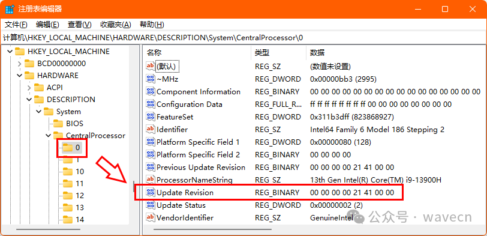

# 随机数、XKCD 漫画与 ZEN 系列最新 CPU 漏洞 CVE-2024-56161

> 编号角色校订（2026-10-04）：按归档技术正文区分主讨论编号与背景引用，更新 `primary_identifiers` / `referenced_identifiers` 及旧字段角色。旧编号原值、状态与正文保持原样，变更前字段逐字保存在 `previous_*`；后文旧的角色待核说明应按当前字段阅读。这里的角色判读不等于官方分配核验或漏洞复现。

<!-- vulwiki-editorial-rebuild:system-misc -->
## 条目范围与校订

- 本文对象：AMD Zen/EPYC CVE-2024-56161 EntrySign科普
- 文献类型：技术文章（细分类待核）
- 版本、权限及部署边界：CPUID表被介绍为最新微码补丁版本，实际CPU身份签名不是补丁revision，不能用其和UpdateRevision比较判修复；Zen1–4全系列与列EPYC型号范围须分，示意Intel注册表不能代替AMD验证
- 核验状态：仅重建文本校订；未执行文中代码、PoC 或扫描，未把截图或转载声明记为本站复现

### 具体结论与待核项

以下为原归档的逐项勘误与证据缺口；可由文本确定的问题已在下文订正，仍缺来源的事实保持待核。

1. 明确宿主本地管理员Ring0/VM之外与海光未知，边界较好
2. CPUID表被介绍为最新微码补丁版本，实际CPU身份签名不是补丁revision，不能用其和UpdateRevision比较判修复
3. head -n7 cpuinfo未必包含microcode且通常不需root，需匹配CPU型号/步进与厂商补丁
4. 不知种子就无法否定连续常数随机的观点混淆统计可检验性与确定性，RDRAND噪声机制笼统需官方文档
5. Zen1–4全系列与列EPYC型号范围须分，示意Intel注册表不能代替AMD验证
6. 精确AMD3019/GoogleGHSA/PoC等来源充分，后续2025-03-05计划是历史时间点

### 操作风险

原文技术操作的实际副作用未复现核验；按其请求/代码评估状态变更、凭据暴露和业务影响

技术请求、代码与实验方法按原文保留；其中的破坏性动作仅限授权、可恢复的隔离环境。缺失代码、参数或版本事实不猜补。

### 来源追溯

- 原始披露 URL 未确认；既有归档来源标签保留，不能替代原始公告

### 归档技术正文

原创 SenderSu  wavecn   2025-02-13 15:15  
  
敏锐和前瞻能力很重要，尤其对于网络安全。  
  
笔者之前已曾强调过漏洞补丁管理需要延伸到 CPU 微码补丁：  
  
《[挖深网络安全的兔子洞：CPU 微码补丁管理](https://mp.weixin.qq.com/s?__biz=Mzg4Njc0Mjc3NQ==&mid=2247486522&idx=1&sn=ef2af1338d0c7cbad6f71727f798aade&scene=21#wechat_redirect)  
》  
  
刚刚发布不久的漏洞公告: CVE-2024-56161[1]，又再一次说明了漏洞补丁管理务必需要延伸纳入 CPU 微码补丁。  
  
  
<table><tbody><tr style="outline: 0px;visibility: visible;"><td data-colwidth="124" width="124" valign="middle" align="right" style="outline: 0px;word-break: break-all;hyphens: auto;border-color: rgb(255, 255, 255);visibility: visible;">笔者：</td><td data-colwidth="453" width="453" valign="middle" align="left" style="outline: 0px;word-break: break-all;hyphens: auto;border-color: rgb(255, 255, 255);visibility: visible;">
国际注册信息系统审计师（CISA）

软考系统分析师

软件工程硕士
</td></tr></tbody></table>  

该漏洞按 CVSS 3.1 评分7.2，关系到 AMD ZEN 系列 CPU 发布的微码更新[2]。  
  
漏洞由 GOOGLE 安全研究人员发现[3]，原理在于 CPU 使用了不安全的哈希函数去验证微码补丁的签名，导致允许具备本地管理员权限的攻击者（位于 VM 之外，RING 0 层）加载有害的微码补丁。  
  
研究员通过测试证实，虽然该漏洞首次发现是在 ZEN 4 CPU 上，但实际从 ZEN 1 到 ZEN 4 CPU 都受影响，即包括有：  
- EPYC 7001 (Naples)  
  
- EPYC 7002 (Rome)  
  
- EPYC 7003 (Milan/Milan-X)  
  
- EPYC 9004 (Genoa/Genoa-X/Bergamo/Siena)  
  
需要注意一点是海光 CPU 源自 AMD ZEN 1。但笔者条件所限，未知该 BUG 是否也存在，只能提醒一下相关读者注意了。  
  
虽然漏洞被利用需要前提，但若实施成功，其危害性相当大，可以使攻击者攻破 AMD 最新版本的 Secure Encrypted Virtualization[4] 即 SEV-SNP(Secure Nested Paging)[5] 所保护的机密计算负载，以及还能攻破 Dynamic Root of Trust Measurement[6]，简单说就是能从根本上沦陷掉整台计算机。  
  
GOOGLE 安全研究员为此还专门开发了一个验证程序：该程序通过微码补丁更新的方式改变了 RDRAND 指令的行为，使得 CPU 返回的随机数总是 4[7]。  
  
RDRAND 是 Intel 在 Ivy Bridege 架构中新增的 CPU 指令，利用 CPU 内部的热噪声、时序中断计数等参数产生真随机数，被广泛采信和利用于各类加密算法环境。  
  
这个指令如果失效或被控制，这条硬件指令随机数就不再随机，甚至还不如传统的伪随机数算法产生的随机数了。  
  
AMD 基于 X86 指令集的授权关系也实现了这条指令。  
  
这事情有趣在于“总是返回4的随机数函数”是个梗，创意来自于著名的漫画站 XKCD，也就是如下这篇：  
  
  
  
来源：https://xkcd.com/221/  
  
稍作解释：如图的 C 语言函数命名为“获得随机数”，只有一条返回数值4的命令，且注释是“以公平的掷骰子选出，保证随机”，哈哈哈......  
  
其实熟悉伪随机数算法原理的读者都知道，通常只要算法种子未知，使用者就难以否定伪随机数不随机，即使它一直给出的都是同一个数......或许下一个就不是这个数呢？  
  
  
  
这就是另一著名漫画系列 Dilbert 回应给 XKCD 的创作：图1上，小恶魔对 Dilbert 说，看，这就是我们自己的随机数发生器。图2，Dilbert 仔细一看，原来是另一个小恶魔在不断地说“9 9 9 9 9 9 ......”。图3，Dilbert 不禁质疑：“你们确认那真的是随机的？” “嗯，这就是随机性的问题所在，  
你永远无法确认。”小恶魔回复。  
  
所以，即使 CPU 的 RDRAND 指令总是返回 4 这么荒谬，但这数来自 CPU，又有几个人有能力怀疑并确认 CPU 已经被黑掉呢？  
  
紧跟厂商微码更新打补丁这件事相信笔者不用强调了，但检查方法值得关注。  
  
比如如果是用 Microsoft Windows ，可以通过访问注册表的方法检查当前应用的补丁版本，位置路径在：  
  
HKEY_LOCAL_MACHINE\HARDWARE\DESCRIPTION\System\CentralProcessor\0  
  
检查其中的二进制项目：  
  
Update Revision   
  
如图：  
  
  
  
（嗯，笔者手提电脑用的 Intel，此图仅为示意）  
  
又如果是用 Linux ，可以在 root 用户下通过如下命令：  
  
head -n7 /proc/cpuinfo  
  
检查输出内容中的 microcode 项目的值。  
  
将查询获得的版本值与 AMD 在 advisory 页面[2]提供的版本信息进行比较，即可判定微码补丁更新是否已经实施到位。  
  
根据 AMD，与本漏洞相关的最新微码补丁版本如下：  
<table><tbody><tr class="ue-table-interlace-color-single"><td data-colwidth="191" width="191"><section>Code Name</section></td><td data-colwidth="191" width="191"><section>Family</section></td><td data-colwidth="191" width="191"><section>CPUID</section></td></tr><tr class="ue-table-interlace-color-double"><td data-colwidth="191" width="191"><section>Naples</section></td><td data-colwidth="191" width="191"><section>AMD EPYC™ 7001 Series</section></td><td data-colwidth="191" width="191"><section>0x00800F12</section></td></tr><tr class="ue-table-interlace-color-single"><td data-colwidth="191" width="191"><section>Rome</section></td><td data-colwidth="191" width="191"><section>AMD EPYC™ 7002 Series</section></td><td data-colwidth="191" width="191"><section>0x00830F10</section></td></tr><tr class="ue-table-interlace-color-double"><td data-colwidth="191" width="191"><section>Milan</section></td><td data-colwidth="191" width="191"><section><section data-pm-slice="2 3 [&#34;table&#34;,{&#34;interlaced&#34;:null,&#34;align&#34;:null,&#34;class&#34;:null,&#34;style&#34;:null},&#34;table_body&#34;,{},&#34;table_row&#34;,{&#34;class&#34;:null,&#34;style&#34;:null},&#34;table_cell&#34;,{&#34;colspan&#34;:1,&#34;rowspan&#34;:1,&#34;colwidth&#34;:[191],&#34;width&#34;:null,&#34;valign&#34;:null,&#34;align&#34;:null,&#34;style&#34;:null}]">AMD EPYC™ 7003 Series</section></section></td><td data-colwidth="191" width="191"><section>0x00A00F11</section></td></tr><tr class="ue-table-interlace-color-single"><td data-colwidth="191" width="191"><section>Milan-X</section></td><td data-colwidth="191" width="191"><section>AMD EPYC™ 7003 Series</section></td><td data-colwidth="191" width="191"><section>0x00A00F12</section></td></tr><tr class="ue-table-interlace-color-double"><td data-colwidth="191" width="191"><section>Genoa</section></td><td data-colwidth="191" width="191"><section>AMD EPYC™ 9004 Series</section></td><td data-colwidth="191" width="191"><section>0x00A10F11</section></td></tr><tr class="ue-table-interlace-color-single"><td data-colwidth="191" width="191"><section>Genoa-X</section></td><td data-colwidth="191" width="191"><section>AMD EPYC™ 9004 Series</section></td><td data-colwidth="191" width="191"><section>0x00A10F12</section></td></tr><tr class="ue-table-interlace-color-double"><td data-colwidth="191" width="191"><section>Bergamo/Siena</section></td><td data-colwidth="191" width="191"><section>AMD EPYC™ 9004 Series</section></td><td data-colwidth="191" width="191"><section>0x00AA0F02</section></td></tr></tbody></table>  
  
最后值得注意的是，这个补丁的发现、修补和公开三阶段的时间跨度相当长，分别是：  
- 报告日期：2024年9月25日  
  
- 修补日期：2024年12月17日  
  
- 公开日期：2025年2月3日  
  
据 Google 安全研究员的说明，延迟披露的原因在于供应链的深度导致修补的过程很长，且目前仍不适合公布所有漏洞细节，具体情况将在2025年3月5日再发布。  
  
~ 完 ~  
  
注：题头图由笔者自行拍摄。  
  
  
参考引用：  
  
[1] NVD - CVE-2024-56161  
  
https://nvd.nist.gov/vuln/detail/CVE-2024-56161  
  
  
[2] AMD SEV Confidential Computing Vulnerability  
  
https://www.amd.com/en/resources/product-security/bulletin/amd-sb-3019.html  
  
  
[3] AMD: Microcode Signature Verification Vulnerability  
  
https://github.com/google/security-research/security/advisories/GHSA-4xq7-4mgh-gp6w  
  
  
[4] AMD Secure Encrypted Virtualization (SEV)  
  
https://www.amd.com/en/developer/sev.html  
  
  
[5] AMD SEV-SNP  
  
https://www.amd.com/content/dam/amd/en/documents/epyc-business-docs/white-papers/SEV-SNP-strengthening-vm-isolation-with-integrity-protection-and-more.pdf  
  
  
[6] AMD Dynamic Root of Trust Measurement  
  
https://www.amd.com/content/dam/amd/en/documents/epyc-technical-docs/user-guides/58453.pdf  
  
  
[7] security-research/pocs/cpus/entrysign at master · google/security-research  
  
https://github.com/google/security-research/tree/master/pocs/cpus/entrysign  
  
  
[8] XKCD 221: Random Number  
  
https://xkcd.com/221/  
  
  
**点赞和转发都是免费的**  
↓   
  
  
  
  
  
  

---

> 来源：gelusus/wxvl（微信公众号漏洞文章自动归档，原始披露 URL 尚未确认，现有链接按来源追溯区分别标注）
