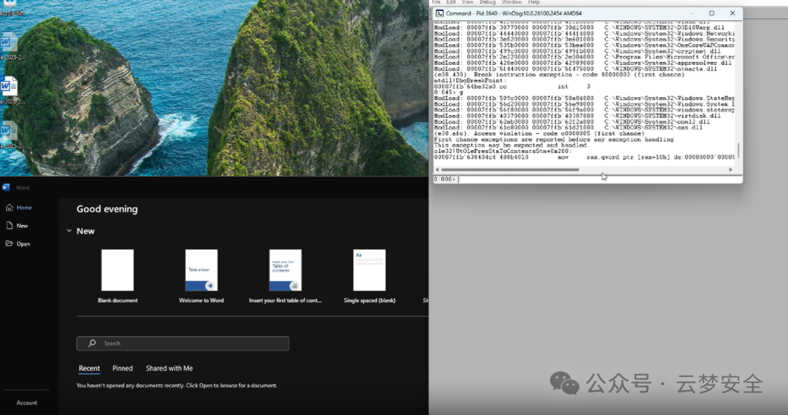

# 预警！高危漏洞曝光，双击文件秒变“肉鸡”！ CVE-2025-21298

> 编号角色校订（2026-10-04）：按归档技术正文区分主讨论编号与背景引用，更新 `primary_identifiers` / `referenced_identifiers` 及旧字段角色。旧编号原值、状态与正文保持原样，变更前字段逐字保存在 `previous_*`；后文旧的角色待核说明应按当前字段阅读。这里的角色判读不等于官方分配核验或漏洞复现。

<!-- vulwiki-editorial-rebuild:system-misc -->
## 条目范围与校订

- 本文对象：Windows OLE21298
- 文献类型：技术文章（细分类待核）
- 版本、权限及部署边界：所有Windows/WPS范围过宽
- 核验状态：仅重建文本校订；未执行文中代码、PoC 或扫描，未把截图或转载声明记为本站复现

### 具体结论与待核项

以下为原归档的逐项勘误与证据缺口；可由文本确定的问题已在下文订正，仍缺来源的事实保持待核。

1. GitHub PoC公开不证明野外大规模利用，企业5分钟勒索案例无来源
2. 双击与无需用户交互表述冲突需区分预览触发
3. 所有Windows/WPS范围过宽
4. KB50252525疑错误编号，19045.3693是旧构建不能作为2025修复门槛
5. DisableOLEPackager注册表建议未证对此漏洞有效
6. 升级SDK不等于修复系统OLE
7. CBS安装日志搜索不是攻击检测
8. 需核MSRC原文

### 操作风险

原文技术操作的实际副作用未复现核验；按其请求/代码评估状态变更、凭据暴露和业务影响

技术请求、代码与实验方法按原文保留；其中的破坏性动作仅限授权、可恢复的隔离环境。缺失代码、参数或版本事实不猜补。

### 来源追溯

- 原始披露 URL 未确认；既有归档来源标签保留，不能替代原始公告

### 归档技术正文

云梦DC  云梦安全   2025-02-26 01:07  
  
【真实威胁：一份文件就能攻破你的电脑！】  
  
“某企业员工打开客户发来的RTF文档后，5分钟内核心服务器被植入勒索病毒！”  
  
——这不是科幻情节，而是利用CVE-2025-21298漏洞的真实攻击场景！  
  
微软最新曝光的OLE组件远程代码执行漏洞（CVSS 9.8），已被黑客大规模用于钓鱼攻击。  
  
  
  
  
受影响范围：  
  
✅ 所有使用Windows系统的PC/服务器  
  
✅ 微软Office（Word、Outlook等）、WPS等支持OLE嵌入的软件  
  
✅ 未安装2025年1月安全补丁的设备  
  
【漏洞原理：一个“双杀”操作引发的灾难】  
  
🔧 技术深潜（简化版）  
  
漏洞位于ole32.dll的关键函数中。攻击者通过构造恶意RTF文件，诱骗系统重复释放同一内存区域（Double-Free），最终导致：  
  
系统崩溃（蓝屏）  
  
远程恶意代码植入（如勒索软件、后门程序）  
  
🛠️ 微软如何修复？  
  
通过对比补丁代码发现：修复方案为释放指针后立即置零，彻底堵住“重复触发”的可能性。  
  
【攻击模拟：3步让你的电脑“举手投降”】  
  
1️⃣ 制作武器：黑客在RTF文件中嵌入恶意OLE对象  
  
2️⃣ 发送诱饵：伪装成合同、报价单等通过邮件/社交工具传播  
  
3️⃣ 触发漏洞：用户双击文件 → 内存崩溃 → 恶意代码自动执行  
  
⚠️ 当前风险等级：  
  
野外攻击已实锤：GitHub已出现PoC（概念验证代码）  
  
杀伤链极短：无需用户交互，打开文件即中招  
  
企业重灾区：OA系统、邮件服务器成首要目标  
  
【紧急应对指南：立即执行这4步！】  
  
1. 个人用户必做  
  
立即更新系统：  
  
▸ 打开Windows Update → 安装2025年1月累积更新（KB50252525）  
  
▸ Office用户需同步升级至最新版本  
  
临时防御方案：  
  
powershell  
  
# 禁用OLE对象预览（管理员权限运行）    
  
reg add "HKEY_CURRENT_USER\Software\Microsoft\Office\16.0\Word\Security" /v "DisableOLEPackager" /t REG_DWORD /d 1 /f    
  
2. 企业管理员行动清单  
  
全网扫描：使用Nessus、OpenVAS检测未打补丁设备  
  
邮件网关拦截：设置规则过滤.rtf附件（需评估业务影响）  
  
3. 开发者自查重点  
  
检查应用中是否调用UtOlePresStmToContentsStm函数  
  
升级Windows SDK至包含补丁的版本  
  
【漏洞自测：3分钟快速排查】  
  
1️⃣ 查看系统版本：  
  
Win + R → 输入winver → 确认版本号≥Windows 10 22H2 (OS Build 19045.3693)  
  
2️⃣ 检查Office更新状态：  
  
打开Word → 文件 → 账户 → 更新选项 → 立即更新  
  
3️⃣ 日志监控（管理员CMD）：  
```
findstr /s /i "ole32.dll fault" C:\Windows\Logs\CBS\*.log  
```  
  
POC:https://github.com/ynwarcs/CVE-2025-21298  
  
  


---

> 来源：gelusus/wxvl（微信公众号漏洞文章自动归档，原始披露 URL 尚未确认，现有链接按来源追溯区分别标注）
