# 高危漏洞预警：Windows TCP-IP 远程代码执行漏洞（CVE-2026-33827）

## 编号角色补核（2026-10-04）

本次只确认编号在本文主题中的主编号／引用角色；版本、修复、截图及其他技术主张仍按下方具体待核说明阅读。旧字段和归档正文保持原值，较早的角色待核说明保留为历史记录。

核对依据：[CNA 记录](https://cveawg.mitre.org/api/cve/CVE-2026-33827)。这些记录支持编号／产品对应关系或编号状态，不替代本篇原始出处。

<!-- vulwiki-editorial-rebuild:system-misc -->
## 条目范围与校订

- 本文对象：Windows TCP/IP33827
- 文献类型：技术文章（细分类待核）
- 版本、权限及部署边界：原文未给出可确认的版本、认证及部署边界；保留待核
- 核验状态：仅重建文本校订；未执行文中代码、PoC 或扫描，未把截图或转载声明记为本站复现

### 具体结论与待核项

以下为原归档的逐项勘误与证据缺口；可由文本确定的问题已在下文订正，仍缺来源的事实保持待核。

1. 正文大多只有图无关键说明文本
2. KB5039218被称2026年4月补丁需官方核，很可能错年代，不能作为安全判据
3. 只看前20HotFix会漏累积替代
4. IPv6非仅fe80/2001两前缀
5. 启用IPsec规则不证明漏洞存在
6. 阻断UDP500/4500可能中断VPN且需证对此TCP/IP漏洞有效，缺回滚
7. 保留MSRC但核原文，不执行这些变更

### 操作风险

阻断UDP500/4500可能中断VPN且需证对此TCP/IP漏洞有效，缺回滚

技术请求、代码与实验方法按原文保留；其中的破坏性动作仅限授权、可恢复的隔离环境。缺失代码、参数或版本事实不猜补。

### 来源追溯

- 原始披露 URL 未确认；既有归档来源标签保留，不能替代原始公告

### 归档技术正文

原创 Zner sec
                    Zner sec  Zner sec   2026-04-23 09:01  
  
  
  
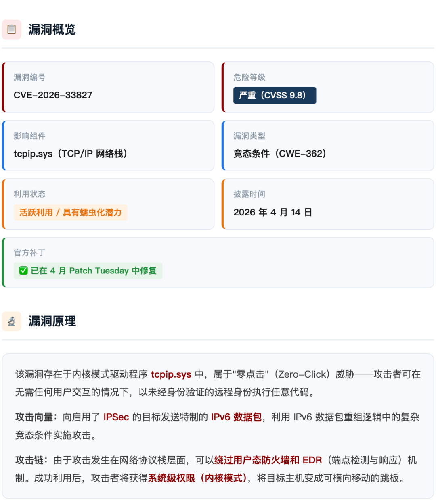  
  
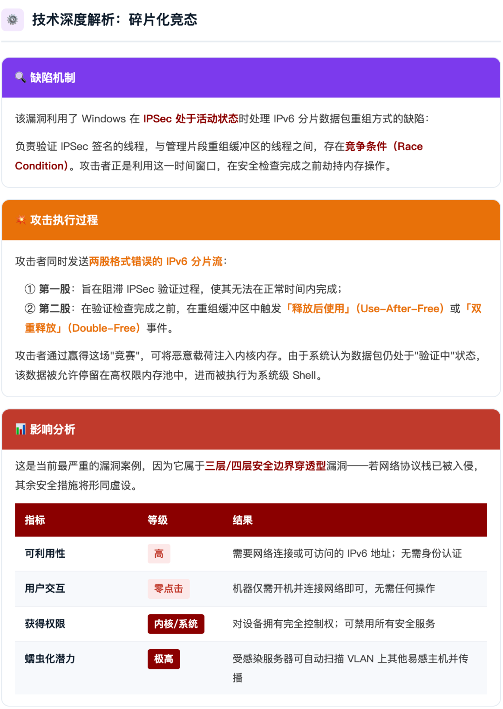  
  
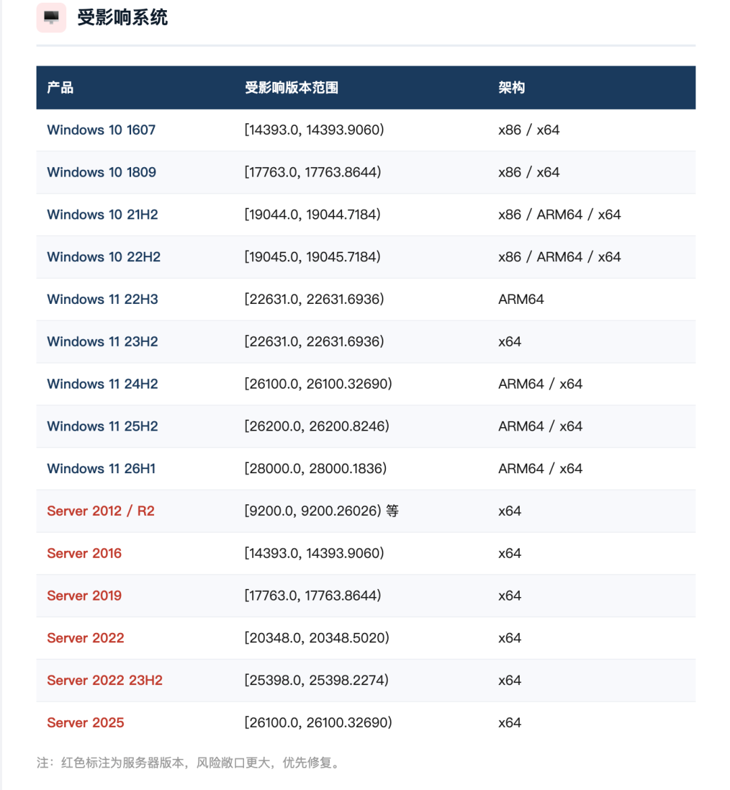  
  
  
  
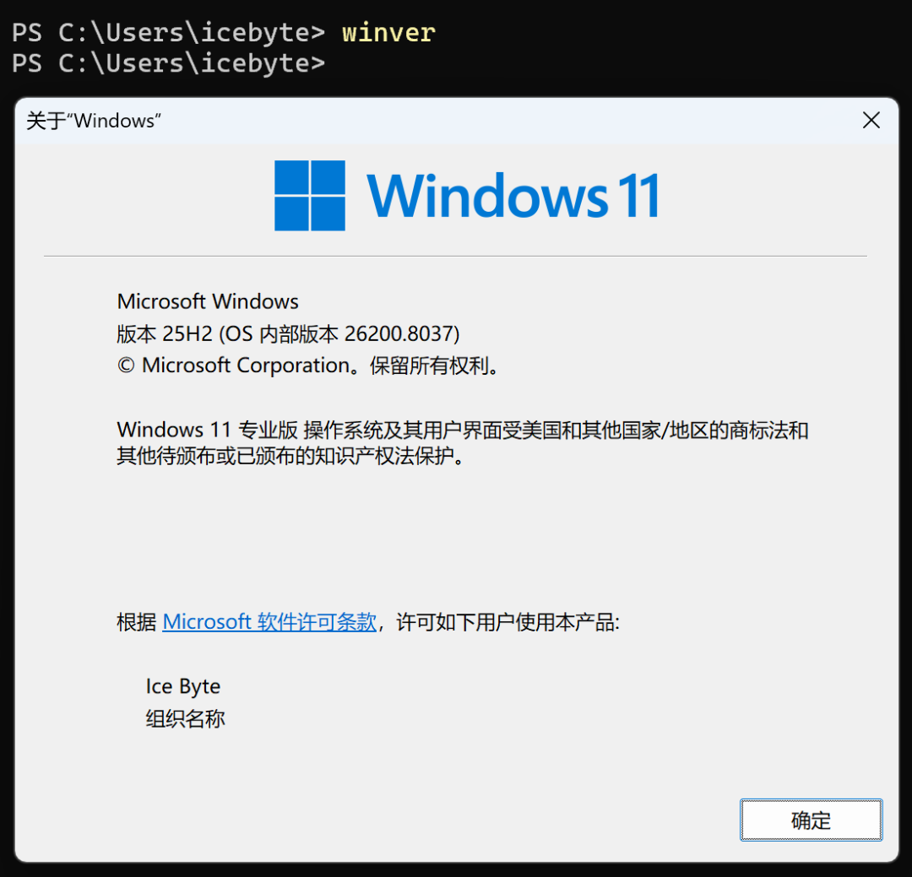  
  
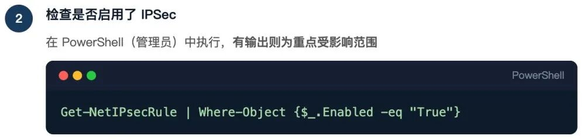  
```
Get-NetIPsecRule | Where-Object {$_.Enabled -eq "True"}
```  
  
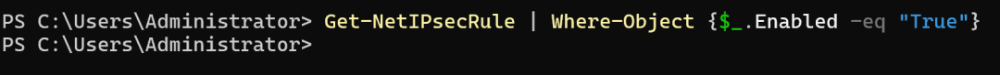  
  
若有输出结果，则说明系统启用了 IPSec，**属于重点受影响范围**  
。  
  
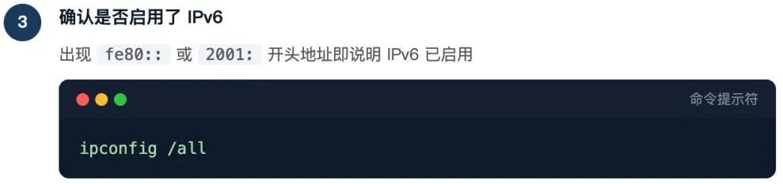  
### ipconfig /all  
###   
  
查找网络适配器信息，如果出现以 fe80::  
 或 2001:  
 开头的地址，说明 IPv6 已启用。  
  
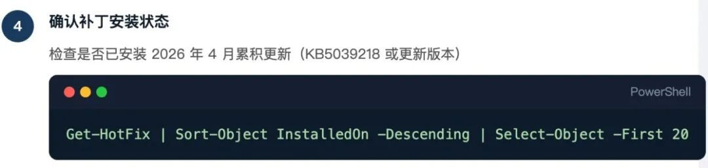  
```
Get-HotFix|Sort-Object InstalledOn -Descending |Select-Object -First 20
```  
  
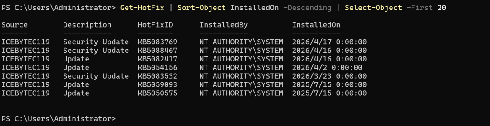  
  
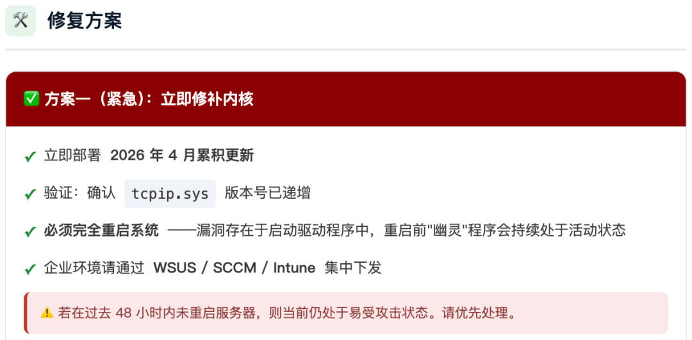  
```
若未安装 2026 年 4 月 Patch Tuesday 
```  
```
更新（KB5039218 或更新版本），则系统存在风险。
```  
  
官方公告参考：  
  
https://msrc.microsoft.com/update-guide/vulnerability/CVE-2026-33827  
  
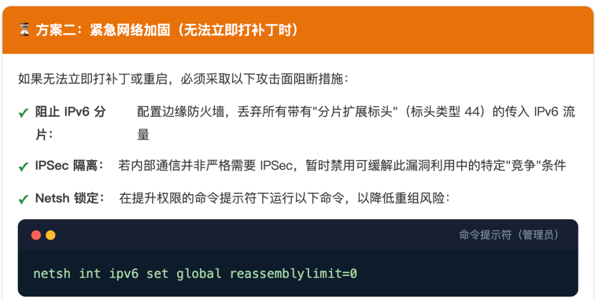  
```
# 阻断 UDP 500（IKE）
New-NetFirewallRule -DisplayName "Block UDP 500 Inbound" -Direction Inbound -Protocol UDP -LocalPort 500 -Action Block
```  
  
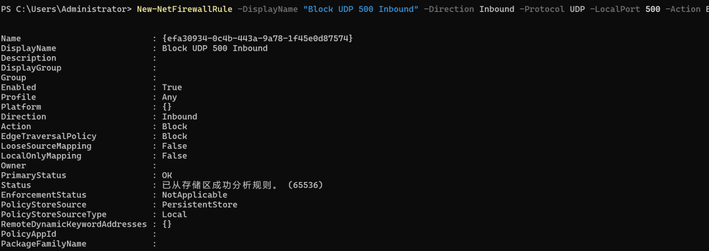  
```
# 阻断 UDP 4500（IKE NAT-T）
New-NetFirewallRule -DisplayName "Block UDP 4500 Inbound" -Direction Inbound -Protocol UDP -LocalPort 4500 -Action Block
```  
  
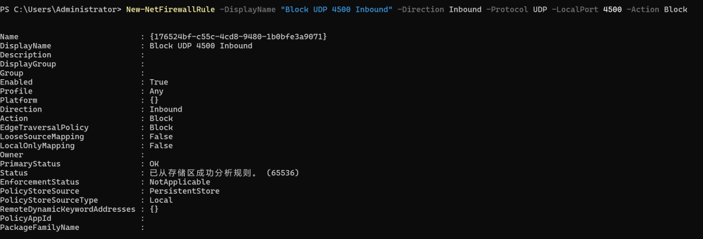  
  
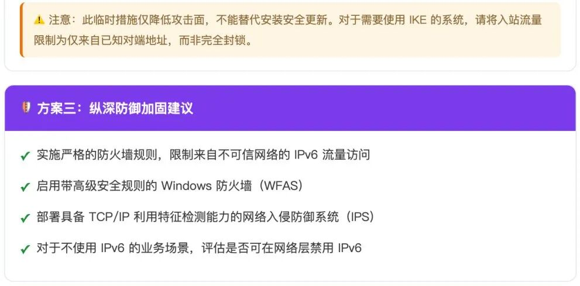  
  
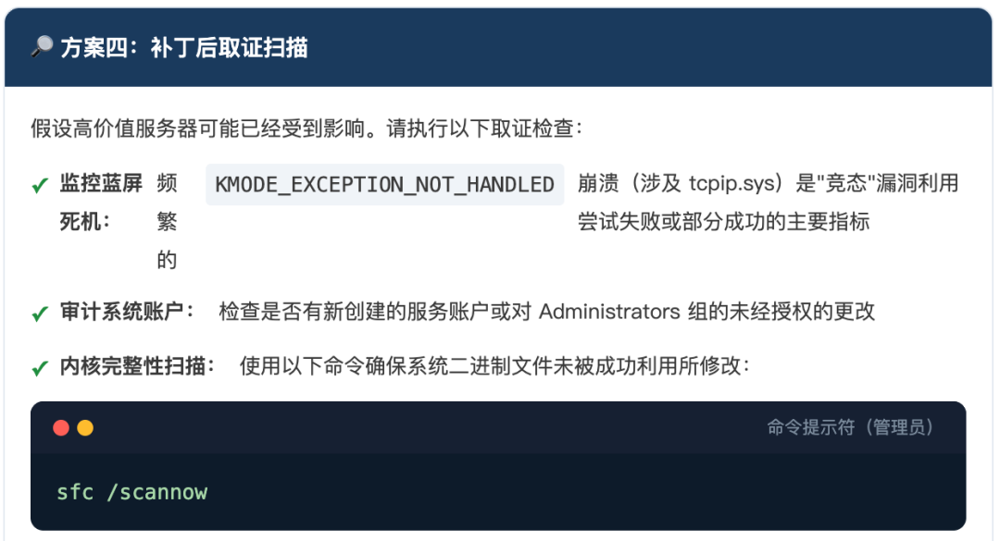  
  
  
  
本公告依据微软官方安全响应中心（MSRC）及 CrowdStrike、Zero Day Initiative 等权威机构发布的信息整理。  
  


---

> 来源：gelusus/wxvl（微信公众号漏洞文章自动归档，原始披露 URL 尚未确认，现有链接按来源追溯区分别标注）
