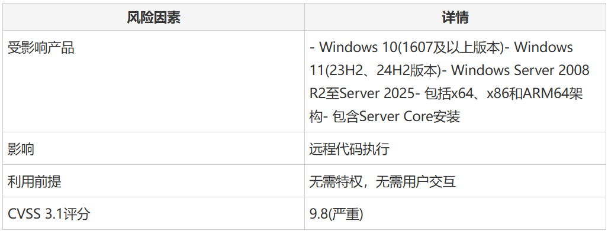

# 高危蠕虫级RCE漏洞，威胁全网Windows系统

> 编号角色校订（2026-10-04）：按归档技术正文区分主讨论编号与背景引用，更新 `primary_identifiers` / `referenced_identifiers` 及旧字段角色。旧编号原值、状态与正文保持原样，变更前字段逐字保存在 `previous_*`；后文旧的角色待核说明应按当前字段阅读。这里的角色判读不等于官方分配核验或漏洞复现。

<!-- vulwiki-editorial-rebuild:system-misc -->
## 条目范围与校订

- 本文对象：Windows SPNEGO/NEGOEX47981
- 文献类型：技术文章（细分类待核）
- 版本、权限及部署边界：PKU2U策略前提不可省略
- 核验状态：仅重建文本校订；未执行文中代码、PoC 或扫描，未把截图或转载声明记为本站复现

### 具体结论与待核项

以下为原归档的逐项勘误与证据缺口；可由文本确定的问题已在下文订正，仍缺来源的事实保持待核。

1. 标题全网Windows和可蠕虫传播是风险推断不是已观测传播
2. 正文明确披露时无公开利用/实战需保留
3. PKU2U策略前提不可省略
4. Server2022 23H2产品名不准确应核Server version23H2
5. 各fixedbuild需MSRC，当前只有二手来源
6. 9.8基础评分与带E/RL/RC时间向量分清

### 操作风险

原文技术操作的实际副作用未复现核验；按其请求/代码评估状态变更、凭据暴露和业务影响

技术请求、代码与实验方法按原文保留；其中的破坏性动作仅限授权、可恢复的隔离环境。缺失代码、参数或版本事实不猜补。

### 来源追溯

- 原始披露 URL 未确认；既有归档来源标签保留，不能替代原始公告

### 归档技术正文

 网络安全与人工智能研究中心   2025-07-11 01:41  
  
  
  
微软已发布关键安全更新，修复编号为CVE-2025-47981的高危漏洞。该漏洞存在于SPNEGO扩展协商(NEGOEX)安全机制中，属于基于堆的缓冲区溢出漏洞，影响多个Windows和Windows Server版本。  
  
  
该漏洞CVSS评分为9.8分(满分10分)，属于最高危级别，可在无需用户交互的情况下实现远程代码执行。  
  
**Part01**  
  
## 核心要点  
  
  
  
1. Windows SPNEGO中存在基于堆的缓冲区溢出漏洞，CVSS评分9.8/10，可实现远程代码执行  
  
  
2. 攻击者无需用户交互或特权，仅需向服务器发送恶意消息即可执行代码  
  
  
3. 影响Windows 10(1607及以上)、Windows 11及Windows Server等33种系统配置  
  
  
4. 微软于2025年7月8日发布更新，建议优先部署在面向互联网的系统及域控制器上  
  
  
该漏洞允许未经授权的攻击者通过网络连接执行任意代码，对企业环境构成严重威胁。  
  
**Part02**  
  
## 可蠕虫传播的RCE漏洞  
  
  
该漏洞存在于Windows SPNEGO扩展协商机制中，该机制是对简单且受保护的GSS-API协商机制的扩展。  
  
  
CVE-2025-47981被归类为CWE-122，属于可远程利用的基于堆的缓冲区溢出漏洞。其CVSS向量字符串CVSS:3.1/AV:N/AC:L/PR:N/UI:N/S:U/C:H/I:H/A:H/E:U/RL:O/RC:C表明，该漏洞可通过网络发起攻击，复杂度低，无需特权或用户交互，但对机密性、完整性和可用性影响极大。  
  
  
安全研究人员评估该漏洞"极有可能被利用"，不过截至披露时尚未发现公开利用代码或实际攻击案例。该漏洞尤其影响运行Windows 10版本1607及更高版本的客户端计算机，这些系统默认启用了组策略对象"网络安全：允许PKU2U身份验证请求使用在线身份"。  
  
  
攻击者可通过向受影响服务器发送恶意消息来利用CVE-2025-47981，可能获得远程代码执行能力。基于堆的缓冲区溢出发生在NEGOEX处理机制中，允许攻击者覆盖内存结构并控制程序执行流程。这种可蠕虫传播的特性意味着漏洞可能通过网络连接的系统自动传播，无需用户干预。  
  
  
该漏洞由安全研究人员通过协调披露机制发现，包括匿名贡献者和Yuki Chen。微软对这些研究人员的致谢体现了负责任漏洞披露对维护企业安全态势的重要性。  
  
  
**Part03**  
  
## 风险因素  
  
  
  
  
  
  
**Part04**  
  
## 补丁部署  
  
  
微软于2025年7月8日发布了全面的安全更新，针对不同Windows配置修复了该漏洞。关键更新包括Windows Server 2025(版本10.0.26100.4652)、Windows 11 24H2版(版本10.0.26100.4652)、Windows Server 2022 23H2版(版本10.0.25398.1732)以及Windows Server 2008 R2(版本6.1.7601.27820)等旧系统的补丁。  
  
  
企业应优先为面向互联网的系统和域控制器部署这些安全更新。补丁可通过Windows Update、Microsoft更新目录和Windows Server更新服务(WSUS)获取。系统管理员应通过核对微软安全公告中的版本号来验证补丁是否成功安装，并考虑在部署补丁期间实施网络分段作为额外防御措施。  
  
  
**参考来源：**  
  
Microsoft Patches Wormable RCE Vulnerability in Windows and Windows Server  
  
https://cybersecuritynews.com/microsoft-patches-wormable-rce-vulnerability/  
  
  
  
  
编辑：席沐沂  
  
审核：秦川原  
  
来源：FreeBuf  
  
  
****  
  
  
  

---

> 来源：gelusus/wxvl（微信公众号漏洞文章自动归档，原始披露 URL 尚未确认，现有链接按来源追溯区分别标注）
