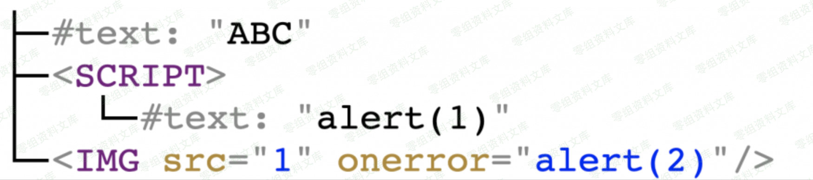
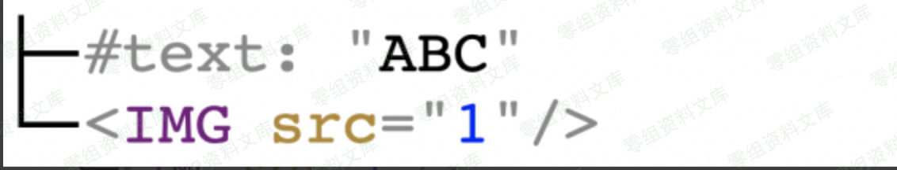
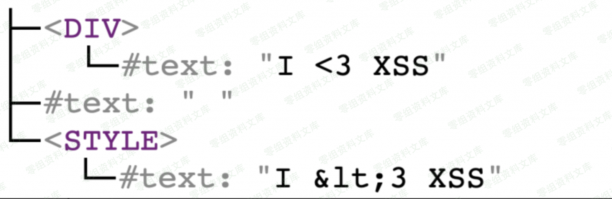
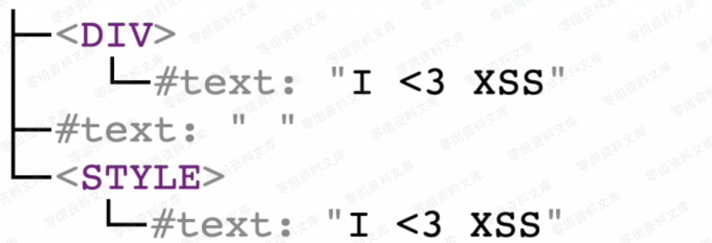
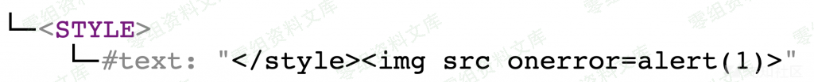
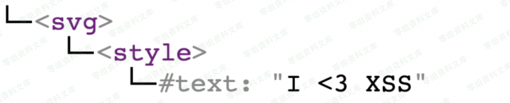
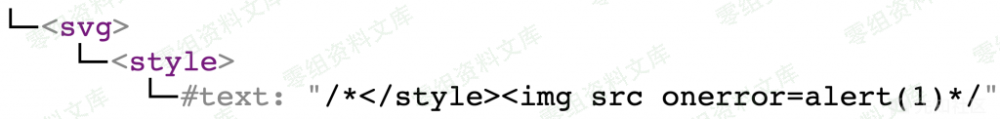
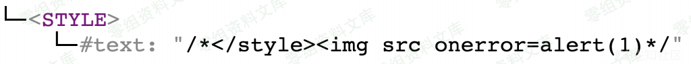

# （CVE-2020-4054）Sanitize 跨站脚本漏洞

> 编号角色校订（2026-10-04）：按归档技术正文区分主讨论编号与背景引用，更新 `primary_identifiers` / `referenced_identifiers` 及旧字段角色。旧编号原值、状态与正文保持原样，变更前字段逐字保存在 `previous_*`；后文旧的角色待核说明应按当前字段阅读。这里的角色判读不等于官方分配核验或漏洞复现。

<!-- vulwiki-editorial-rebuild:system-misc -->
## 条目范围与校订

- 本文对象：Ruby Sanitize CVE-2020-4054
- 文献类型：技术文章（细分类待核）
- 版本、权限及部署边界：影响写3.0.0及以后含已修复版本，应明确<5.2.1；有精确官方GHSA与分析源，需注明应用必须将清洗结果嵌回HTML及相关依赖版本
- 核验状态：仅重建文本校订；未执行文中代码、PoC 或扫描，未把截图或转载声明记为本站复现

### 具体结论与待核项

以下为原归档的逐项勘误与证据缺口；可由文本确定的问题已在下文订正，仍缺来源的事实保持待核。

1. RELAXED允许style和foreign content移除后重解析机制叙述及最终payload较完整
2. 影响写3.0.0及以后含已修复版本，应明确<5.2.1
3. 文中仅含I <3 XSS的无事件样例不会自行执行脚本，称产生XSS过度
4. 编码示例特殊字符损坏，序列化误称反序列化
5. 多图尾部重复半截路径与反引号/HTML标签残缺
6. 有精确官方GHSA与分析源，需注明应用必须将清洗结果嵌回HTML及相关依赖版本

### 操作风险

原文技术操作的实际副作用未复现核验；按其请求/代码评估状态变更、凭据暴露和业务影响

技术请求、代码与实验方法按原文保留；其中的破坏性动作仅限授权、可恢复的隔离环境。缺失代码、参数或版本事实不猜补。

### 来源追溯

- 原始披露 URL 未确认；既有归档来源标签保留，不能替代原始公告

### 归档技术正文

（CVE-2020-4054）Sanitize 跨站脚本漏洞
======================================

一、漏洞简介
------------

于2020/06/16，[Ruby
Sanitize](https://github.com/rgrove/sanitize/security/advisories/GHSA-p4x4-rw2p-8j8m)项目官方发布了编号为\`\`CVE-2020-4054`的[漏洞公告](https://github.com/rgrove/sanitize/security/advisories/GHSA-p4x4-rw2p-8j8m),当`Sanitize`模块的过滤规则被配置成`RELAXED`时，利用该漏洞可以绕过该模块的安全过滤功能。具体配置信息可以查看`lib/sanitize/config/relaxed.rb\`文件。

二、漏洞影响
------------

Sanitize 3.0.0及之后版本（5.2.1版本已修复）

三、复现过程
------------

### 漏洞分析

### `HTML`语法过滤基础思路

这部分将讲述恶意HTML文本的检测思路与过滤手法，有相关经验的大佬可以直接跳过。

[`Sanitize`](https://github.com/rgrove/sanitize)是一个用于检测HTML恶意语法并过滤的Ruby模块，其基于白名单的工作方式，提取到输入内容中的HTML标签后，分析并删除不在白名单内的标签，随后生成相对安全的HTML内容，用户可自定自己的白名单规则（例如，只允许`<b>`、`<i>`标签），不过该模块有一些默认的规则内容，接下来我会分析`RELAXED`过滤规则场景下的默认可信标签，列表如下：

    <a> <abbr> <address <article> <aside> <bdi> <bdo> <blockquote> <body> <br> <caption> <cite>
    <code> <col> <colgroup> <data> <dd> <del> <dfn> <div> <dl> <dt> <figcaption> <figure> <footer>
    <h1> <h2> <h3> <h4> <h5> <h6> <head> <header> <hgroup> <hr> <html>  <ins> <kbd> <li> <main> <mark> <nav> <ol> <p> <pre <q> <rp> <rt> <ruby> <s> <samp> <section> <small> <span> <strike> <style> <sub> <summary> <sup> <table> <tbody> <td> <tfoot> <th> <thead> <time> <title> <tr> <ul> <var> <wbr>

HTML恶意检测的工作大致分为三步：

-   将HTML解析为DOM树

-   从DOM树中删除不可行的标签和属性

-   将新的DOM树序列化为HTML标签

<!-- -->

-   举个例子，当输入内容如下时：

```html
ABC<script>alert(1)</script>
```

首先会被解析为以下DOM树：

Sanitize跨站脚本漏洞/media/rId28.png)

其中

    script

标签和

    onerror

属性不在白名单规则内，随后将被删除。新的DOM树如下：

Sanitize跨站脚本漏洞/media/rId29.png)

反序列化后如下：

    ABC

理想状态下对输入内容进行过滤后其输出内容都是安全的。

### `style`标签的解析与序列化

`Sanitize`模块的安全标签列表中包含`<style>`标签，可以从它入手，因为该标签的处理方式与其它不同。首先，HTML解析器不会解码`<style>`标签中的HTML实体。举个例子：

    <div>I &lt;3 XSS</div>
    <style>I &lt;3 XSS</style>

生成如下DOM树：

Sanitize跨站脚本漏洞/media/rId31.png)

可以看到，`&lt`在`<div>`标签中已被HTML解码，但在`<style>`标签中没有。编码的大致过程为`''<>`等特殊字符被替换成`&"<>`。然后，对于一些特定标签比如`<style>`标签，在反序列化生成新的HTML内容时没有进行HTML实体编码，举个例子：

Sanitize跨站脚本漏洞/media/rId32.png)

反序列化生成的HTML内容为：

    <div>I &lt;3 XSS</div>
    <style>I <3 XSS</style>

可以看到`<`字符在`<div>`标签内进行了HTML编码为`&lt`，但在`<style>`标签中没有。该特性可被恶意利用，比如如下DOM树：

Sanitize跨站脚本漏洞/media/rId33.png)

其由`Sanitize`反序列化生成HTML内容为：

```html
<style></style>
```

这将产生XSS漏洞。接下来的问题是：如何构造出一个恶意的DOM树？

Foreign content特性
-------------------

HTML规范中有很多有趣的特性，当存在`<svg>`或者`<math>`标签时，解析规则会产生变化且上述中`<style>`标签的两个特性将不再受用，该特性就是：`<svg>/<math>`标签中的内容会进行HTML实体解码。理想状态下在`Sanitize`场景下就会生成一个恶意的DOM树举个例子：

    <svg><style>I &lt;3 XSS

对应的DOM树为：

Sanitize跨站脚本漏洞/media/rId35.png)

最终输出为如下并产生XSS漏洞：

    <svg><style>I &lt;3 XSS</style></svg>

### 漏洞复现

回到主题，如何绕过`Sanitize`的过滤规则？`RELAXED`配置场景下，`<style>`标签允许输入但是`<svg>/<math>`标签都不行，`Sanitize`使用的是[`Google Gumbo`](https://github.com/google/gumbo-parser)解析器,它支持HTML5中的新特性。`Sanitize`对CSS语法也进行了安全过滤，但是我发现！
使用`/**/`注释的方法可以进行有效的代码注入，举个例子：

    <svg><style>/*&lt;/style>&lt;img src onerror=alert(1)*/

DOM树如下：

Sanitize跨站脚本漏洞/media/rId38.png)

`<svg>`标签由于不在白名单中被删除了。但其内容仍然存在，因此，此时的DOM树如下：

Sanitize跨站脚本漏洞/media/rId39.png)

此时已不再需要进行过滤了，因此反序列化生成的HTML代码为：

```html
<style>/*</style>*/
```

好了，XSS已经出来了。

参考链接
--------

> https://xz.aliyun.com/t/8226
